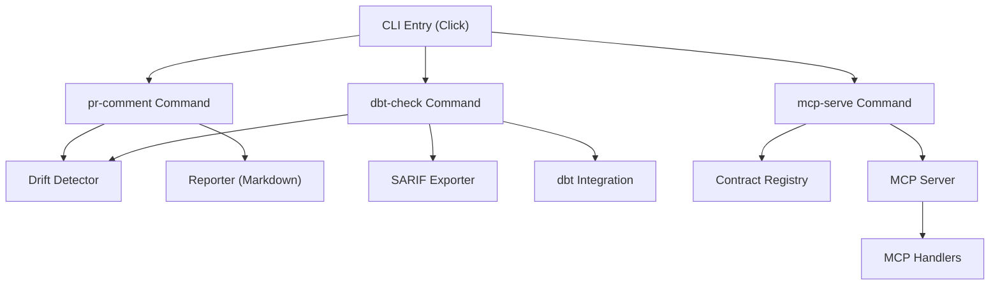
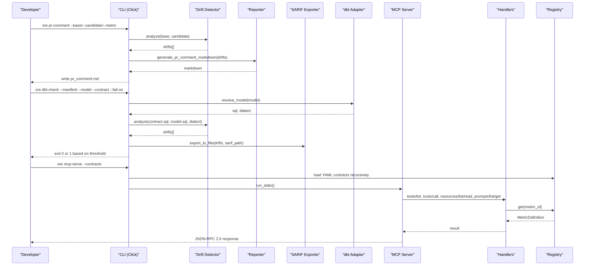
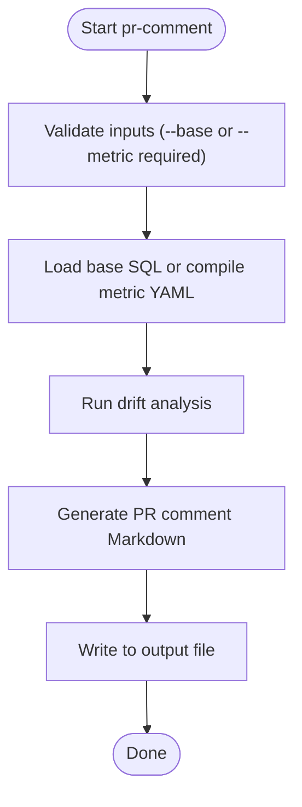
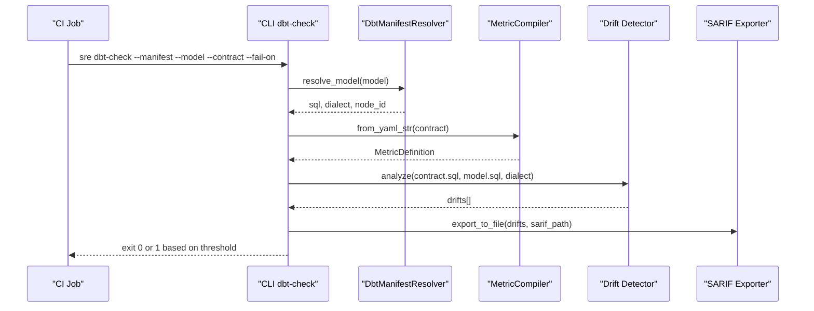
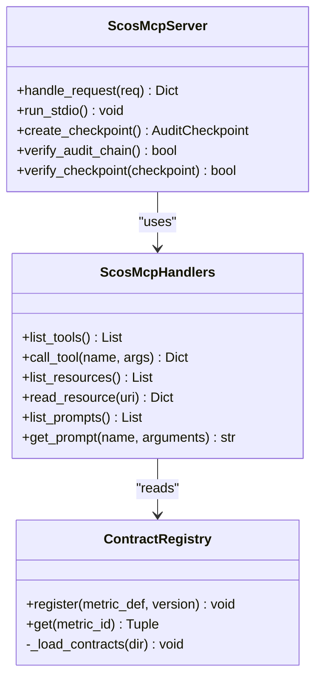
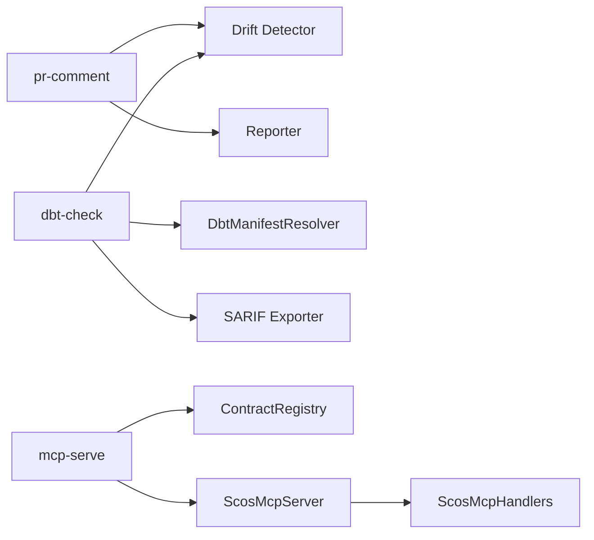

# Integration Commands

<cite>
**Referenced Files in This Document**
- [cli.py](file://semantic_reliability/cli.py)
- [reporter.py](file://semantic_reliability/harness/reporter.py)
- [sarif_exporter.py](file://semantic_reliability/harness/sarif_exporter.py)
- [dbt_integration.py](file://semantic_reliability/adapters/dbt_integration.py)
- [server.py](file://semantic_reliability/mcp/server.py)
- [handlers.py](file://semantic_reliability/mcp/handlers.py)
- [engine.py](file://semantic_reliability/firewall/engine.py)
- [registry.py](file://semantic_reliability/mcp/registry.py)
- [sre-dbt-semantic-gate.yml](file://.github/workflows/sre-dbt-semantic-gate.yml)
</cite>

## Table of Contents
1. [Introduction](#introduction)
2. [Project Structure](#project-structure)
3. [Core Components](#core-components)
4. [Architecture Overview](#architecture-overview)
5. [Detailed Component Analysis](#detailed-component-analysis)
6. [Dependency Analysis](#dependency-analysis)
7. [Performance Considerations](#performance-considerations)
8. [Troubleshooting Guide](#troubleshooting-guide)
9. [Conclusion](#conclusion)

## Introduction
This document provides integration-focused documentation for three CLI commands: sre pr-comment, sre dbt-check, and sre mcp-serve. It explains how each command works, what inputs it expects, how outputs are produced, and how to integrate them into CI/CD and AI agent workflows. Practical examples and troubleshooting guidance are included to help you adopt these commands effectively.

## Project Structure
The three commands are implemented as Click subcommands under a single CLI entry point. Each command delegates to specialized modules:
- sre pr-comment uses drift detection and markdown reporting to generate GitHub PR comments.
- sre dbt-check integrates with dbt manifests and metric contracts to detect semantic drift and can block CI based on severity thresholds.
- sre mcp-serve starts a JSON-RPC 2.0 server that exposes tools, resources, and prompts backed by a contract registry for AI agents.

**Diagram sources**
- [cli.py:543-568](file://semantic_reliability/cli.py#L543-L568)
- [cli.py:737-786](file://semantic_reliability/cli.py#L737-L786)
- [cli.py:789-808](file://semantic_reliability/cli.py#L789-L808)
- [reporter.py:8-84](file://semantic_reliability/harness/reporter.py#L8-L84)
- [sarif_exporter.py:36-65](file://semantic_reliability/harness/sarif_exporter.py#L36-L65)
- [dbt_integration.py:21-118](file://semantic_reliability/adapters/dbt_integration.py#L21-L118)
- [engine.py:18-43](file://semantic_reliability/firewall/engine.py#L18-L43)
- [server.py:16-257](file://semantic_reliability/mcp/server.py#L16-L257)
- [handlers.py:19-409](file://semantic_reliability/mcp/handlers.py#L19-L409)

**Section sources**
- [cli.py:543-568](file://semantic_reliability/cli.py#L543-L568)
- [cli.py:737-786](file://semantic_reliability/cli.py#L737-L786)
- [cli.py:789-808](file://semantic_reliability/cli.py#L789-L808)

## Core Components
- sre pr-comment: Detects semantic drift between baseline SQL or canonical metric definition and candidate SQL; generates a GitHub-friendly Markdown comment with severity, drift type, component, business impact, and remediation details.
- sre dbt-check: Reads a compiled dbt manifest, resolves the target model’s SQL and dialect, compares against a metric contract, and optionally exports SARIF. It blocks CI when drift severity meets or exceeds a configured threshold.
- sre mcp-serve: Starts a JSON-RPC 2.0 server exposing tools (list metrics, get contract, validate SQL, explain violation, probe status), resources (policy and per-metric contracts/invariants), and prompts (guidance and repair). It loads SCOS contracts from a directory into an in-memory registry and enforces domain authorization.

**Section sources**
- [cli.py:543-568](file://semantic_reliability/cli.py#L543-L568)
- [cli.py:737-786](file://semantic_reliability/cli.py#L737-L786)
- [cli.py:789-808](file://semantic_reliability/cli.py#L789-L808)
- [reporter.py:8-84](file://semantic_reliability/harness/reporter.py#L8-L84)
- [dbt_integration.py:21-118](file://semantic_reliability/adapters/dbt_integration.py#L21-L118)
- [server.py:16-257](file://semantic_reliability/mcp/server.py#L16-L257)
- [handlers.py:19-409](file://semantic_reliability/mcp/handlers.py#L19-L409)
- [engine.py:18-43](file://semantic_reliability/firewall/engine.py#L18-L43)

## Architecture Overview
The commands share common building blocks:
- Drift detection compares baseline/candidate SQL using AST analysis and produces structured drift objects with severity, type, component, and business impact.
- Reporting converts drift results into human-readable formats (Markdown for PR comments, SARIF for code scanning).
- dbt integration reads compiled models and their dialects from the manifest and runs drift checks against metric contracts.
- The MCP server exposes a standard protocol for AI agents to discover and enforce business contracts through tools and resources.

**Diagram sources**
- [cli.py:543-568](file://semantic_reliability/cli.py#L543-L568)
- [cli.py:737-786](file://semantic_reliability/cli.py#L737-L786)
- [cli.py:789-808](file://semantic_reliability/cli.py#L789-L808)
- [reporter.py:8-84](file://semantic_reliability/harness/reporter.py#L8-L84)
- [sarif_exporter.py:36-65](file://semantic_reliability/harness/sarif_exporter.py#L36-L65)
- [dbt_integration.py:21-118](file://semantic_reliability/adapters/dbt_integration.py#L21-L118)
- [server.py:16-257](file://semantic_reliability/mcp/server.py#L16-L257)
- [handlers.py:19-409](file://semantic_reliability/mcp/handlers.py#L19-L409)
- [engine.py:18-43](file://semantic_reliability/firewall/engine.py#L18-L43)

## Detailed Component Analysis

### sre pr-comment
Purpose: Generate a GitHub PR review comment that summarizes semantic drift between a baseline (SQL or metric contract) and a candidate SQL file.

Key behaviors:
- Accepts either a baseline SQL file or a metric YAML defining ground truth SQL.
- Runs drift analysis and builds a Markdown report including severity, drift type, component, business impact, and remediation guidance.
- Writes output to a specified Markdown file suitable for posting as a PR comment.

Inputs:
- --base: Baseline SQL file path.
- --candidate: Candidate SQL file path (required).
- --metric: Metric YAML path (alternative to --base).
- --output: Output Markdown path (default pr_comment.md).

Outputs:
- A Markdown file containing a structured PR comment with drift summary and detailed breakdown.

Integration example:
- Run locally to produce a comment file, then post via GitHub API or use a bot action.
- In CI, generate the comment and attach it to the PR for reviewer visibility.

**Diagram sources**
- [cli.py:543-568](file://semantic_reliability/cli.py#L543-L568)
- [reporter.py:8-84](file://semantic_reliability/harness/reporter.py#L8-L84)

**Section sources**
- [cli.py:543-568](file://semantic_reliability/cli.py#L543-L568)
- [reporter.py:8-84](file://semantic_reliability/harness/reporter.py#L8-L84)

### sre dbt-check
Purpose: Check a compiled dbt model against a metric contract for semantic drift and optionally block CI based on severity thresholds.

Key behaviors:
- Resolves model SQL and dialect from target/manifest.json.
- Compares model SQL against the canonical SQL defined in the metric contract.
- Produces drift alerts with severity levels.
- Exports optional JSON and SARIF reports.
- Blocks CI if drift severity meets or exceeds the configured threshold.

Inputs:
- --manifest: Path to dbt target/manifest.json (required).
- --model: dbt model name to check (required).
- --contract: Metric contract YAML path (required).
- --fail-on: Severity threshold ("critical", "high", "any").
- --output-json: Optional JSON report path.
- --output-sarif: Optional SARIF report path.

CI/CD blocking behavior:
- Exit code 1 indicates blocked due to drift at or above threshold.
- Exit code 0 indicates compliant.

Integration example:
- Use in GitHub Actions to compile dbt, identify changed models, and run sre dbt-check per model.
- Upload SARIF to GitHub Code Scanning for centralized visibility.

**Diagram sources**
- [cli.py:737-786](file://semantic_reliability/cli.py#L737-L786)
- [dbt_integration.py:21-118](file://semantic_reliability/adapters/dbt_integration.py#L21-L118)
- [sarif_exporter.py:36-65](file://semantic_reliability/harness/sarif_exporter.py#L36-L65)

**Section sources**
- [cli.py:737-786](file://semantic_reliability/cli.py#L737-L786)
- [dbt_integration.py:21-118](file://semantic_reliability/adapters/dbt_integration.py#L21-L118)
- [sre-dbt-semantic-gate.yml:50-71](file://.github/workflows/sre-dbt-semantic-gate.yml#L50-L71)

### sre mcp-serve
Purpose: Start a Model Context Protocol (MCP) server that exposes tools, resources, and prompts for AI agents to interact with business metric contracts safely and consistently.

Key behaviors:
- Loads SCOS contracts from a directory into an in-memory ContractRegistry.
- Implements JSON-RPC 2.0 methods: initialize, tools/list, tools/call, resources/list, resources/read, prompts/list, prompts/get.
- Enforces domain authorization and payload/AST limits for safety.
- Provides audit logging with hash chaining and checkpointing for tamper-evident operation.

Server setup:
- Provide a contracts directory path; the server recursively loads YAML files and registers metrics.
- Optionally configure allowed domains to restrict access to specific business units.

AI agent integration patterns:
- Discover available tools via tools/list and call tools like scos_validate_sql to ensure generated SQL adheres to declared invariants before execution.
- Retrieve full contracts or invariants via resources/read for context-aware generation and repair.
- Use prompts to guide LLM query generation and repair strategies without automatic rewrites.

**Diagram sources**
- [server.py:16-257](file://semantic_reliability/mcp/server.py#L16-L257)
- [handlers.py:19-409](file://semantic_reliability/mcp/handlers.py#L19-L409)
- [engine.py:18-43](file://semantic_reliability/firewall/engine.py#L18-L43)

**Section sources**
- [cli.py:789-808](file://semantic_reliability/cli.py#L789-L808)
- [server.py:16-257](file://semantic_reliability/mcp/server.py#L16-L257)
- [handlers.py:19-409](file://semantic_reliability/mcp/handlers.py#L19-L409)
- [engine.py:18-43](file://semantic_reliability/firewall/engine.py#L18-L43)

## Dependency Analysis
- sre pr-comment depends on drift detection and reporter modules to produce Markdown comments.
- sre dbt-check depends on dbt manifest resolution, metric compilation, drift detection, and SARIF export.
- sre mcp-serve depends on a contract registry and MCP handlers implementing tools/resources/prompts over JSON-RPC 2.0.

**Diagram sources**
- [cli.py:543-568](file://semantic_reliability/cli.py#L543-L568)
- [cli.py:737-786](file://semantic_reliability/cli.py#L737-L786)
- [cli.py:789-808](file://semantic_reliability/cli.py#L789-L808)
- [reporter.py:8-84](file://semantic_reliability/harness/reporter.py#L8-L84)
- [sarif_exporter.py:36-65](file://semantic_reliability/harness/sarif_exporter.py#L36-L65)
- [dbt_integration.py:21-118](file://semantic_reliability/adapters/dbt_integration.py#L21-L118)
- [engine.py:18-43](file://semantic_reliability/firewall/engine.py#L18-L43)
- [server.py:16-257](file://semantic_reliability/mcp/server.py#L16-L257)
- [handlers.py:19-409](file://semantic_reliability/mcp/handlers.py#L19-L409)

**Section sources**
- [cli.py:543-568](file://semantic_reliability/cli.py#L543-L568)
- [cli.py:737-786](file://semantic_reliability/cli.py#L737-L786)
- [cli.py:789-808](file://semantic_reliability/cli.py#L789-L808)

## Performance Considerations
- Drift detection operates on ASTs; large queries may increase parsing time. The MCP server enforces maximum SQL character and AST node limits to prevent excessive resource usage.
- dbt-check relies on compiled SQL from the manifest; ensure dbt compile is run prior to checking to avoid fallbacks or errors.
- MCP server audit logging and hash chaining add minimal overhead but provide strong integrity guarantees for multi-agent environments.

[No sources needed since this section provides general guidance]

## Troubleshooting Guide
Common issues and resolutions:
- Missing baseline or metric for pr-comment: Ensure either --base or --metric is provided; otherwise the command exits with an error.
- No compiled SQL in dbt manifest: If require_compiled is true and compiled SQL is absent, the dbt adapter raises an error; run dbt compile or dbt build first.
- Unknown metric contract in MCP: The registry returns an error if the requested metric_id is not registered; verify contracts directory contents and paths.
- Domain authorization denied: When allowed_domains is set, only metrics within authorized domains are accessible; adjust allowed_domains or metric metadata accordingly.
- Payload size or complexity limits: MCP handlers reject overly large SQL or complex ASTs; refactor queries or adjust limits as appropriate.

**Section sources**
- [cli.py:543-568](file://semantic_reliability/cli.py#L543-L568)
- [dbt_integration.py:21-68](file://semantic_reliability/adapters/dbt_integration.py#L21-L68)
- [handlers.py:147-214](file://semantic_reliability/mcp/handlers.py#L147-L214)
- [engine.py:18-43](file://semantic_reliability/firewall/engine.py#L18-L43)

## Conclusion
These integration commands enable robust semantic reliability across development and production data pipelines:
- sre pr-comment surfaces drift insights directly in pull requests to catch risky changes early.
- sre dbt-check enforces contract compliance in CI/CD, producing actionable reports and blocking unsafe merges.
- sre mcp-serve provides a standardized interface for AI agents to generate and validate SQL against business contracts safely and audibly.

Adopting these commands helps maintain metric integrity, reduce silent regressions, and align analytical outputs with declared business semantics.