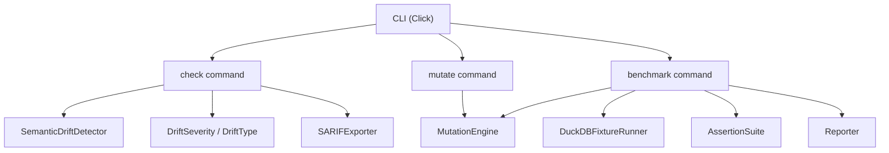
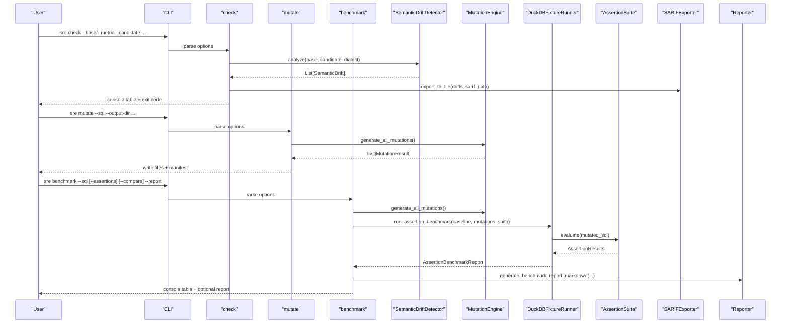
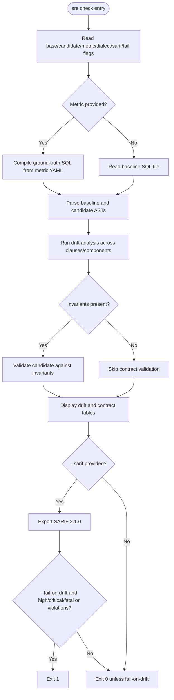
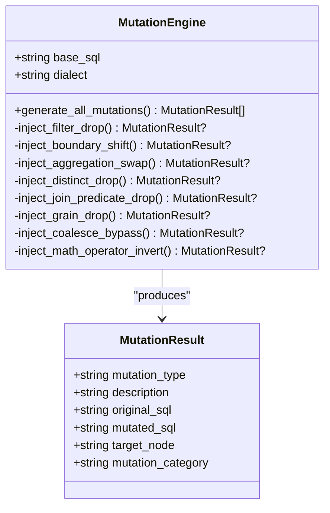
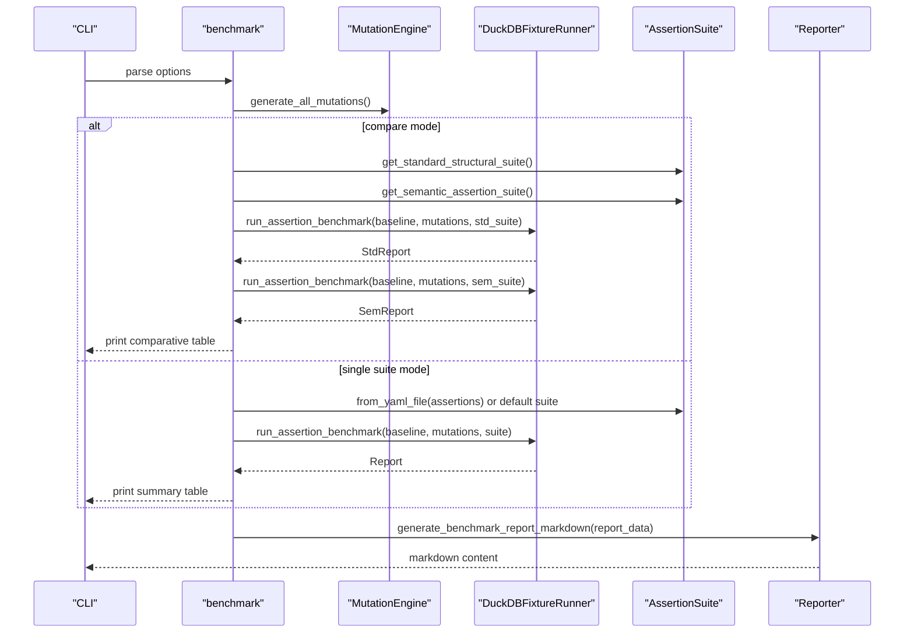
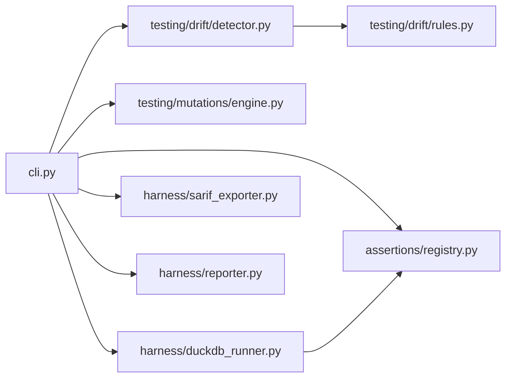

# Testing & Validation Commands

<cite>
**Referenced Files in This Document**
- [cli.py](file://semantic_reliability/cli.py)
- [detector.py](file://semantic_reliability/testing/drift/detector.py)
- [rules.py](file://semantic_reliability/testing/drift/rules.py)
- [engine.py](file://semantic_reliability/testing/mutations/engine.py)
- [duckdb_runner.py](file://semantic_reliability/harness/duckdb_runner.py)
- [registry.py](file://semantic_reliability/assertions/registry.py)
- [sarif_exporter.py](file://semantic_reliability/harness/sarif_exporter.py)
- [reporter.py](file://semantic_reliability/harness/reporter.py)
</cite>

## Table of Contents
1. [Introduction](#introduction)
2. [Project Structure](#project-structure)
3. [Core Components](#core-components)
4. [Architecture Overview](#architecture-overview)
5. [Detailed Component Analysis](#detailed-component-analysis)
6. [Dependency Analysis](#dependency-analysis)
7. [Performance Considerations](#performance-considerations)
8. [Troubleshooting Guide](#troubleshooting-guide)
9. [Conclusion](#conclusion)

## Introduction
This document explains the testing and validation CLI commands provided by the Semantic Reliability Engine: sre check, sre mutate, and sre benchmark. It covers how to compare baseline and candidate SQL, validate metrics, detect semantic drift with severity levels, export SARIF reports, fail CI on drift, generate AST mutations, structure mutation outputs and manifests, evaluate assertion suites, run comparative benchmarks between standard and semantic tests, compute catch rate metrics, and generate reports.

## Project Structure
The CLI is implemented as a Click group with subcommands for each operation. Each command wires together specialized components:
- Drift detection uses an AST-based analyzer that inspects WHERE, JOINs, GROUP BY, aggregations, null handling, HAVING, and source tables.
- Mutation generation injects realistic SQL bugs into the AST to create test cases.
- Benchmarking executes baseline vs mutated queries in DuckDB, evaluates assertions, and computes catch rates.
- Reporting includes terminal panels, Markdown PR comments, SARIF 2.1.0 exports, and optional Markdown reports.

**Diagram sources**
- [cli.py:43-283](file://semantic_reliability/cli.py#L43-L283)
- [detector.py:9-46](file://semantic_reliability/testing/drift/detector.py#L9-L46)
- [rules.py:6-28](file://semantic_reliability/testing/drift/rules.py#L6-L28)
- [engine.py:8-52](file://semantic_reliability/testing/mutations/engine.py#L8-L52)
- [duckdb_runner.py:56-256](file://semantic_reliability/harness/duckdb_runner.py#L56-L256)
- [registry.py:22-159](file://semantic_reliability/assertions/registry.py#L22-L159)
- [sarif_exporter.py:9-65](file://semantic_reliability/harness/sarif_exporter.py#L9-L65)
- [reporter.py:8-129](file://semantic_reliability/harness/reporter.py#L8-L129)

**Section sources**
- [cli.py:36-283](file://semantic_reliability/cli.py#L36-L283)

## Core Components
- sre check: Compares baseline or metric-defined SQL against a candidate, detects semantic drift, validates contracts if present, optionally exports SARIF, and can fail CI based on severity thresholds.
- sre mutate: Generates AST-level mutations from a target SQL file, writes individual mutated SQL files, and creates a manifest describing each mutation.
- sre benchmark: Evaluates an assertion suite against injected mutations, supports comparative mode between standard structural tests and semantic assertions, computes catch rates, and generates Markdown reports.

**Section sources**
- [cli.py:43-283](file://semantic_reliability/cli.py#L43-L283)

## Architecture Overview
The three commands share common building blocks but differ in workflow:
- check parses baseline/candidate SQL, runs drift analysis across multiple relational algebra dimensions, and integrates contract validation and SARIF export.
- mutate builds an AST and applies targeted mutation operators to produce realistic bug scenarios.
- benchmark executes baseline and mutated queries in-memory, compares results, runs assertions, classifies outcomes, and summarizes performance.

**Diagram sources**
- [cli.py:43-283](file://semantic_reliability/cli.py#L43-L283)
- [detector.py:12-46](file://semantic_reliability/testing/drift/detector.py#L12-L46)
- [engine.py:16-52](file://semantic_reliability/testing/mutations/engine.py#L16-L52)
- [duckdb_runner.py:208-256](file://semantic_reliability/harness/duckdb_runner.py#L208-L256)
- [registry.py:106-159](file://semantic_reliability/assertions/registry.py#L106-L159)
- [sarif_exporter.py:16-65](file://semantic_reliability/harness/sarif_exporter.py#L16-L65)
- [reporter.py:87-129](file://semantic_reliability/harness/reporter.py#L87-L129)

## Detailed Component Analysis

### sre check: Baseline/Candidate Comparison, Metric-Based Validation, Drift Detection, SARIF Export, Fail-on-Drift
- Inputs:
  - --base: Path to baseline SQL file
  - --candidate: Path to candidate SQL file (required)
  - --metric: Optional path to metric YAML definition; when provided, the canonical SQL is compiled from the metric and used as baseline
  - --dialect: Optional SQL dialect for parsing
  - --sarif: Optional output path for SARIF 2.1.0 JSON
  - --fail-on-drift/--no-fail: Exit non-zero if critical/high/fatal drift or contract violations are detected
- Workflow:
  - If --metric is provided, compile ground-truth SQL and extract metric name; otherwise read baseline SQL directly
  - Parse both baseline and candidate SQL into ASTs and run comprehensive drift analysis across:
    - WHERE clause population logic
    - Aggregation functions and expressions
    - Join topology and predicates
    - GROUP BY grain
    - Null handling via COALESCE
    - HAVING filters
    - Source table lineage
  - Validate declared invariant contracts if present in the metric definition
  - Display a structured table of drift anomalies with severity, type, component, and business impact
  - Optionally export SARIF 2.1.0 report mapping drift severities to SARIF levels
  - Exit with non-zero status if --fail-on-drift is enabled and any fatal/critical/high drift or contract violation exists
- Output interpretation:
  - No drift: success message indicating candidate matches baseline relational logic and contracts
  - Drifts: table rows show severity and remediation guidance; SARIF file created if requested
  - Contract violations: separate table listing category, rule, and details
  - Exit codes: 0 for pass, 1 for failure when --fail-on-drift triggers

**Diagram sources**
- [cli.py:43-132](file://semantic_reliability/cli.py#L43-L132)
- [detector.py:12-46](file://semantic_reliability/testing/drift/detector.py#L12-L46)
- [sarif_exporter.py:16-65](file://semantic_reliability/harness/sarif_exporter.py#L16-L65)

**Section sources**
- [cli.py:43-132](file://semantic_reliability/cli.py#L43-L132)
- [detector.py:9-246](file://semantic_reliability/testing/drift/detector.py#L9-L246)
- [rules.py:6-28](file://semantic_reliability/testing/drift/rules.py#L6-L28)
- [sarif_exporter.py:9-65](file://semantic_reliability/harness/sarif_exporter.py#L9-L65)

### sre mutate: AST Mutation Generation, Output Directory Structure, Manifest Creation, Mutation Categories
- Inputs:
  - --sql: Path to target SQL file to mutate (required)
  - --output-dir: Directory to save mutated SQL files (default: mutations_output)
  - --dialect: Optional SQL dialect
- Workflow:
  - Parse target SQL into AST
  - Generate all supported mutations by injecting realistic bugs at key AST nodes:
    - Filter drop (WHERE conjunct removal or entire WHERE drop)
    - Boundary shift (>, <, = to >=, <=, !=)
    - Aggregation swap (SUM ↔ AVG, COUNT → SUM)
    - Distinct drop (COUNT(DISTINCT) → COUNT)
    - Join predicate drop (remove ON condition)
    - Grain drop (remove column from GROUP BY)
    - Coalesce bypass (remove default fallback)
    - Math operator invert (+ ↔ -)
  - Write each mutated SQL to a numbered file named mutation_XX_<type>.sql
  - Create mutations_manifest.json containing index, filename, mutation_type, category, description, and target_node
- Output directory structure:
  - mutations_output/
    - mutation_01_filter_drop.sql
    - mutation_02_boundary_shift.sql
    - ...
    - mutations_manifest.json
- Mutation categories:
  - Population Filtering
  - Boundary Conditions
  - Mathematical Calculation
  - Join Cardinality
  - Reporting Grain
  - Null Safety
  - Arithmetic Logic

**Diagram sources**
- [engine.py:8-269](file://semantic_reliability/testing/mutations/engine.py#L8-L269)

**Section sources**
- [cli.py:134-172](file://semantic_reliability/cli.py#L134-L172)
- [engine.py:8-269](file://semantic_reliability/testing/mutations/engine.py#L8-L269)

### sre benchmark: Assertion Suite Evaluation, Comparative Benchmarking, Catch Rate Metrics, Report Generation
- Inputs:
  - --sql: Path to target SQL model to evaluate (required)
  - --assertions: Optional YAML assertions suite file
  - --compare/--no-compare: Run head-to-head comparison between standard dbt-style structural suite and semantic reliability suite
  - --dialect: Optional SQL dialect
  - --report: Optional Markdown report output file
- Workflow:
  - Generate all AST mutations from the target SQL
  - If --compare:
    - Load standard structural suite (non-null, unique key, row count bounds)
    - Load semantic suite (population filters, expected grain, metric value checks)
    - Run assertion benchmark for both suites against the same mutations
    - Print comparative summary and per-mutation breakdown showing which suite caught each defect
  - If not comparing:
    - Use provided assertions or default structural suite
    - Execute baseline and mutated queries in DuckDB
    - Evaluate assertions on mutated queries
    - Classify outcomes: equivalent on fixture, runtime error, valid defect detected, valid defect survived
    - Compute effective catch score as percentage of executable valid defects detected
  - Optionally generate Markdown report summarizing mutation evaluations and blind spots
- Metrics:
  - Total mutations generated
  - Executable valid defects (denominator after excluding equivalent mutations)
  - Detected by assertions (numerator)
  - Surviving defects (blind spots)
  - Effective catch score percentage
  - Comparative gain between standard and semantic suites

**Diagram sources**
- [cli.py:175-283](file://semantic_reliability/cli.py#L175-L283)
- [registry.py:106-159](file://semantic_reliability/assertions/registry.py#L106-L159)
- [duckdb_runner.py:208-256](file://semantic_reliability/harness/duckdb_runner.py#L208-L256)
- [reporter.py:87-129](file://semantic_reliability/harness/reporter.py#L87-L129)

**Section sources**
- [cli.py:175-283](file://semantic_reliability/cli.py#L175-L283)
- [duckdb_runner.py:14-50](file://semantic_reliability/harness/duckdb_runner.py#L14-L50)
- [registry.py:22-159](file://semantic_reliability/assertions/registry.py#L22-L159)
- [reporter.py:8-129](file://semantic_reliability/harness/reporter.py#L8-L129)

## Dependency Analysis
- CLI depends on:
  - Drift detector for AST-level comparisons
  - Mutation engine for generating test cases
  - DuckDB runner for execution and evaluation
  - Assertion registry for loading and running suites
  - SARIF exporter for standardized reporting
  - Reporter for human-readable outputs
- Coupling:
  - check tightly couples drift detection with contract validation and SARIF export
  - mutate isolates mutation generation and file I/O
  - benchmark orchestrates mutation generation, execution, assertion evaluation, and reporting
- External dependencies:
  - sqlglot for AST parsing and manipulation
  - duckdb for in-memory query execution
  - rich for terminal formatting
  - click for CLI argument parsing

**Diagram sources**
- [cli.py:21-33](file://semantic_reliability/cli.py#L21-L33)
- [detector.py:1-7](file://semantic_reliability/testing/drift/detector.py#L1-L7)
- [rules.py:1-28](file://semantic_reliability/testing/drift/rules.py#L1-L28)
- [engine.py:1-6](file://semantic_reliability/testing/mutations/engine.py#L1-L6)
- [duckdb_runner.py:1-12](file://semantic_reliability/harness/duckdb_runner.py#L1-L12)
- [registry.py:1-20](file://semantic_reliability/assertions/registry.py#L1-L20)
- [sarif_exporter.py:1-7](file://semantic_reliability/harness/sarif_exporter.py#L1-L7)
- [reporter.py:1-6](file://semantic_reliability/harness/reporter.py#L1-L6)

**Section sources**
- [cli.py:21-33](file://semantic_reliability/cli.py#L21-L33)

## Performance Considerations
- Drift detection operates on parsed ASTs and performs targeted inspections; complexity scales with SQL size and number of clauses.
- Mutation generation traverses AST once per mutation operator; total cost proportional to number of operators and AST depth.
- Benchmark execution runs baseline and mutated queries in DuckDB; performance depends on fixture size and assertion complexity.
- Equivalent mutation filtering reduces denominator for catch rate calculation, improving meaningfulness of metrics.
- For large corpora, consider parallelizing mutation evaluation or limiting assertion suites to essential checks.

[No sources needed since this section provides general guidance]

## Troubleshooting Guide
- sre check fails immediately if neither --base nor --metric is provided; ensure one is specified.
- If --fail-on-drift is enabled, exit code 1 indicates presence of fatal/critical/high drift or contract violations; review drift table and remediation suggestions.
- SARIF export requires a writable path; verify permissions and directory existence.
- sre mutate requires a valid SQL file; ensure path exists and is readable.
- sre benchmark may encounter runtime errors during mutation execution; these are classified and reported separately from surviving defects.
- Assertion failures indicate specific checks that did not pass; use the detailed summaries to refine your test suite.

**Section sources**
- [cli.py:52-54](file://semantic_reliability/cli.py#L52-L54)
- [cli.py:127-131](file://semantic_reliability/cli.py#L127-L131)
- [duckdb_runner.py:128-144](file://semantic_reliability/harness/duckdb_runner.py#L128-L144)

## Conclusion
The testing and validation commands provide a robust pipeline for ensuring semantic correctness of data pipelines:
- sre check offers precise drift detection with actionable insights and CI integration via SARIF and fail-on-drift behavior.
- sre mutate generates realistic, categorized mutations to stress-test pipelines and uncover blind spots.
- sre benchmark quantifies test effectiveness through catch rates, supports comparative evaluation of standard versus semantic assertions, and produces clear reports for stakeholders.

Together, these tools enable proactive quality assurance, continuous validation, and measurable improvement of data reliability.