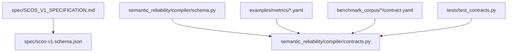
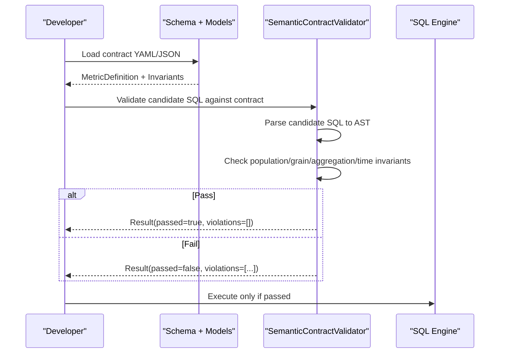
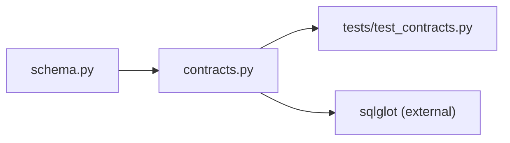

# Contract Specification

<cite>
**Referenced Files in This Document**
- [SCOS_V1_SPECIFICATION.md](file://spec/SCOS_V1_SPECIFICATION.md)
- [scos-v1.schema.json](file://spec/scos-v1.schema.json)
- [schema.py](file://semantic_reliability/compiler/schema.py)
- [contracts.py](file://semantic_reliability/compiler/contracts.py)
- [net_revenue_contract.yaml](file://examples/metrics/net_revenue_contract.yaml)
- [monthly_active_users.yaml](file://examples/metrics/monthly_active_users.yaml)
- [net_revenue contract.yaml](file://benchmark_corpus/dev/net_revenue/contract.yaml)
- [monthly_active_users contract.yaml](file://benchmark_corpus/dev/monthly_active_users/contract.yaml)
- [customer_churn_rate contract.yaml](file://benchmark_corpus/dev/customer_churn_rate/contract.yaml)
- [checkout_conversion_rate contract.yaml](file://benchmark_corpus/dev/checkout_conversion_rate/contract.yaml)
- [inventory_turnover contract.yaml](file://benchmark_corpus/dev/inventory_turnover/contract.yaml)
- [sla_compliance_rate contract.yaml](file://benchmark_corpus/dev/sla_compliance_rate/contract.yaml)
- [test_contracts.py](file://tests/test_contracts.py)
</cite>

## Table of Contents
1. Introduction
2. Project Structure
3. Core Components
4. Architecture Overview
5. Detailed Component Analysis
6. Dependency Analysis
7. Performance Considerations
8. Troubleshooting Guide
9. Conclusion
10. Appendices

## Introduction
This document specifies SCOS v1.0, the Semantic Contract Open Standard for executable business metric contracts and runtime governance. It explains all contract fields (identity, metadata, grain, canonical SQL, semantic invariants, statistical probes), enumerates data types and validation rules, and provides examples from the benchmark corpus. It also outlines best practices, schema conformance, versioning, migration strategies, and compatibility considerations across ecosystems such as dbt, Cube.js/Looker, AI agents via MCP, and data catalogs.

## Project Structure
The SCOS specification is defined formally and validated by a machine-readable JSON Schema. The repository includes:
- Formal spec and schema under spec/
- Example contracts under examples/metrics/
- Benchmark corpus contracts under benchmark_corpus/*/contract.yaml
- Compiler and validator implementation under semantic_reliability/compiler/
- Tests validating contract behavior under tests/

**Diagram sources**
- [SCOS_V1_SPECIFICATION.md:1-134](file://spec/SCOS_V1_SPECIFICATION.md#L1-L134)
- [scos-v1.schema.json:1-163](file://spec/scos-v1.schema.json#L1-L163)
- [schema.py:1-98](file://semantic_reliability/compiler/schema.py#L1-L98)
- [contracts.py:1-135](file://semantic_reliability/compiler/contracts.py#L1-L135)
- [test_contracts.py:1-92](file://tests/test_contracts.py#L1-L92)

**Section sources**
- [SCOS_V1_SPECIFICATION.md:1-134](file://spec/SCOS_V1_SPECIFICATION.md#L1-L134)
- [scos-v1.schema.json:1-163](file://spec/scos-v1.schema.json#L1-L163)

## Core Components
A SCOS contract defines a business metric with four orthogonal layers:
- Identity & Registry Layer: scos_version, id, metric, version, owner, domain, grain, dialect, tags, description
- Canonical Representation Layer: sql (ground-truth query), dialect
- Semantic Invariants Layer: population, grain, aggregation, units, time
- Statistical Probes Layer: population, implications, null_drift

Key field semantics and constraints:
- scos_version: Must be "1.0.0"
- id: URN pattern urn:scos:<domain>:<metric_slug>
- metric: slug identifier
- version: SemVer MAJOR.MINOR.PATCH
- grain: reporting dimensionality (e.g., customer_month, monthly)
- dialect: target SQL engine (snowflake, bigquery, postgres, duckdb, redshift, databricks)
- sql: canonical ground-truth query
- invariants.population.required_filters: predicates that must appear in WHERE
- invariants.population.forbidden_filters: predicates that must never appear
- invariants.grain.required_dimensions: grouping dimensions required in GROUP BY
- invariants.aggregation.required_function: expected top-level aggregate function
- invariants.aggregation.positive_components/negative_components: conditions or expressions that must be added/subtracted
- invariants.units.currency/scale: unit expectations
- invariants.time.timezone/period_grain: temporal semantics
- probes.population: predicate rate bounds
- probes.implications: antecedent/consequent confidence thresholds
- probes.null_drift: max null rates on critical columns
- metadata: arbitrary organizational metadata

Data types and validation rules are enforced by both the JSON Schema and Pydantic models used by the compiler.

**Section sources**
- [SCOS_V1_SPECIFICATION.md:92-114](file://spec/SCOS_V1_SPECIFICATION.md#L92-L114)
- [scos-v1.schema.json:1-163](file://spec/scos-v1.schema.json#L1-L163)
- [schema.py:5-98](file://semantic_reliability/compiler/schema.py#L5-L98)

## Architecture Overview
SCOS contracts are parsed into structured definitions, then used to validate candidate SQL via AST-based checks. Violations are reported with severity and remediation guidance.

**Diagram sources**
- [contracts.py:26-135](file://semantic_reliability/compiler/contracts.py#L26-L135)
- [schema.py:83-98](file://semantic_reliability/compiler/schema.py#L83-L98)

## Detailed Component Analysis

### Identity and Metadata Fields
- scos_version: Enum "1.0.0"
- id: URN pattern enforcing domain and metric slug
- metric: alphanumeric slug
- version: SemVer string
- owner/domain: free-form strings for governance
- grain: descriptive granularity (entity_time)
- dialect: enum of supported engines; defaults vary by schema/model
- tags: list of categorization labels
- description: human-readable purpose

Validation:
- Enforced by JSON Schema patterns and enums
- Mapped to Pydantic fields for programmatic access

Examples:
- Finance net revenue with currency USD and calendar month period
- Product monthly active users with Snowflake dialect and platform/organization dimensions

**Section sources**
- [scos-v1.schema.json:9-55](file://spec/scos-v1.schema.json#L9-L55)
- [schema.py:83-98](file://semantic_reliability/compiler/schema.py#L83-L98)
- [net_revenue_contract.yaml:1-39](file://examples/metrics/net_revenue_contract.yaml#L1-L39)
- [monthly_active_users.yaml:1-21](file://examples/metrics/monthly_active_users.yaml#L1-L21)

### Canonical SQL Field
- sql: The signed, canonical implementation of the metric; serves as ground truth for dry runs, mutation testing, and replay
- dialect: Target SQL dialect for parsing and AST normalization

Best practices:
- Keep sql minimal, deterministic, and aligned with invariants
- Use explicit timezone handling when required
- Avoid ambiguous aliases; ensure grouping matches declared grain

**Section sources**
- [SCOS_V1_SPECIFICATION.md:98-101](file://spec/SCOS_V1_SPECIFICATION.md#L98-L101)
- [schema.py:83-98](file://semantic_reliability/compiler/schema.py#L83-L98)

### Semantic Invariants
Invariant categories and enforcement:

- Population
  - required_filters: Must appear in WHERE clause
  - forbidden_filters: Must not appear in WHERE clause
  - Enforcement: AST normalization compares normalized predicate strings

- Grain
  - required_dimensions: Must be present in GROUP BY
  - Enforcement: Extracts GROUP BY expressions and checks presence

- Aggregation
  - required_function: Expected aggregate at top level
  - positive_components/negative_components: Conditions or expressions that must be included in net calculation
  - Enforcement: Textual presence checks on normalized SQL text

- Units
  - currency/scale: Declares monetary units and scaling conventions

- Time
  - timezone: Enforces UTC or other timezone policy
  - period_grain: Declares calendar/fiscal period grain

Examples from benchmark corpus:
- Net revenue requires active and region filters; invoice positive component; refund negative component
- Monthly active users require active and non-bot filters
- Customer churn rate excludes trials
- Checkout conversion rate excludes internal IPs
- Inventory turnover excludes obsolete items
- SLA compliance rate excludes spam tickets

Common pitfalls:
- Dropping required filters leads to CRITICAL violations
- Omitting grouping dimensions causes grain invariant failures
- Missing deductions inflates financial metrics
- Non-UTC timezone conversions violate time invariants

**Section sources**
- [SCOS_V1_SPECIFICATION.md:102-114](file://spec/SCOS_V1_SPECIFICATION.md#L102-L114)
- [scos-v1.schema.json:61-115](file://spec/scos-v1.schema.json#L61-L115)
- [schema.py:5-37](file://semantic_reliability/compiler/schema.py#L5-L37)
- [contracts.py:44-128](file://semantic_reliability/compiler/contracts.py#L44-L128)
- [net_revenue contract.yaml:1-19](file://benchmark_corpus/dev/net_revenue/contract.yaml#L1-L19)
- [monthly_active_users contract.yaml:1-13](file://benchmark_corpus/dev/monthly_active_users/contract.yaml#L1-L13)
- [customer_churn_rate contract.yaml:1-11](file://benchmark_corpus/dev/customer_churn_rate/contract.yaml#L1-L11)
- [checkout_conversion_rate contract.yaml:1-11](file://benchmark_corpus/dev/checkout_conversion_rate/contract.yaml#L1-L11)
- [inventory_turnover contract.yaml:1-11](file://benchmark_corpus/dev/inventory_turnover/contract.yaml#L1-L11)
- [sla_compliance_rate contract.yaml:1-12](file://benchmark_corpus/dev/sla_compliance_rate/contract.yaml#L1-L12)

### Statistical Probes
Probes provide runtime observability for data distribution sanity:

- Population probes
  - predicate: SQL predicate expression
  - min_rate/max_rate: Bounds on proportion of rows satisfying predicate
  - Purpose: Ensure filter selectivity remains within historical ranges

- Implication probes
  - antecedent/consequent: Logical conditions
  - min_confidence: Minimum conditional probability P(consequent|antecedent)
  - Purpose: Detect semantic drift in business relationships

- Null drift probes
  - column: Critical column name
  - max_null_rate: Maximum acceptable null percentage
  - Purpose: Guard against join key degradation

Notes:
- JSON Schema enforces numeric ranges [0.0, 1.0]
- Implementation models define baseline rates and tolerances for runtime checks

**Section sources**
- [SCOS_V1_SPECIFICATION.md:109-114](file://spec/SCOS_V1_SPECIFICATION.md#L109-L114)
- [scos-v1.schema.json:116-156](file://spec/scos-v1.schema.json#L116-L156)
- [schema.py:39-70](file://semantic_reliability/compiler/schema.py#L39-L70)

### Machine-Readable JSON Schema Validation
The JSON Schema validates contract syntax:
- Required fields: scos_version, metric, owner, grain, sql
- Pattern constraints: id URN, metric slug, version SemVer
- Enum constraints: scos_version, dialect
- Nested objects: invariants, probes, metadata
- Numeric bounds: probe rates and confidence values

Conformance requirements:
- Strict parsing against scos-v1.schema.json
- Deterministic AST invariant enforcement without false positives on formatting
- Audit evidence generation with SHA-256 digests for evaluation decisions

**Section sources**
- [scos-v1.schema.json:1-163](file://spec/scos-v1.schema.json#L1-L163)
- [SCOS_V1_SPECIFICATION.md:128-134](file://spec/SCOS_V1_SPECIFICATION.md#L128-L134)

### Versioning, Migration, and Compatibility
- scos_version: Fixed to "1.0.0" for this standard
- metric.version: SemVer MAJOR.MINOR.PATCH to track business metric evolution
- Compatibility:
  - Dialect-specific parsing via sqlglot ensures cross-engine AST normalization
  - Contracts should remain stable across minor versions unless breaking changes occur
- Migration strategies:
  - Introduce new invariants gradually; use metadata to annotate deprecations
  - Maintain backward-compatible SQL where possible; prefer additive changes
  - Update probes to reflect evolving data distributions without altering core logic
  - Leverage provenance metadata to trace upstream changes and verify integrity

**Section sources**
- [SCOS_V1_SPECIFICATION.md:92-101](file://spec/SCOS_V1_SPECIFICATION.md#L92-L101)
- [scos-v1.schema.json:9-55](file://spec/scos-v1.schema.json#L9-L55)
- [schema.py:83-98](file://semantic_reliability/compiler/schema.py#L83-L98)

## Dependency Analysis
The compiler depends on:
- sqlglot for SQL parsing and AST normalization
- Pydantic models for schema validation and type safety
- Test suite for regression coverage of invariant checks

**Diagram sources**
- [schema.py:1-98](file://semantic_reliability/compiler/schema.py#L1-L98)
- [contracts.py:1-135](file://semantic_reliability/compiler/contracts.py#L1-L135)
- [test_contracts.py:1-92](file://tests/test_contracts.py#L1-L92)

**Section sources**
- [contracts.py:1-135](file://semantic_reliability/compiler/contracts.py#L1-L135)
- [schema.py:1-98](file://semantic_reliability/compiler/schema.py#L1-L98)
- [test_contracts.py:1-92](file://tests/test_contracts.py#L1-L92)

## Performance Considerations
- AST normalization is lightweight but can be expensive on very large queries; cache parsed ASTs per contract where feasible
- Prefer precise required_filters and required_dimensions to minimize false negatives
- Use probes judiciously; frequent statistical checks add runtime overhead
- Align dialect settings to reduce parsing differences and improve performance

[No sources needed since this section provides general guidance]

## Troubleshooting Guide
Common violations and remedies:
- Missing required filter: Add the missing predicate to WHERE
- Missing grouping dimension: Include required dimension(s) in GROUP BY
- Missing deduction: Ensure negative components are subtracted in net calculations
- Non-UTC timezone: Convert timestamps to UTC explicitly
- Probe failures: Investigate data distribution shifts; adjust thresholds conservatively

Diagnostic outputs:
- Violation category, rule, severity, details, and remediation guidance are provided for each failure
- Use these to guide self-correction in agent workflows or CI gates

**Section sources**
- [contracts.py:44-128](file://semantic_reliability/compiler/contracts.py#L44-L128)
- [test_contracts.py:36-92](file://tests/test_contracts.py#L36-L92)

## Conclusion
SCOS v1.0 provides a robust, machine-verifiable framework for defining business metrics with executable invariants and runtime probes. By combining declarative contracts with AST-based validation and statistical monitoring, teams can prevent silent semantic drift, enforce governance across ecosystems, and maintain trust in AI-generated analytics.

[No sources needed since this section summarizes without analyzing specific files]

## Appendices

### Best Practices for Writing Effective Contracts
- Start with clear identity: set scos_version, id, metric, version, owner, domain, grain, dialect
- Define canonical sql that exactly implements the business definition
- Declare invariants precisely:
  - population.required_filters for cohort selection
  - population.forbidden_filters to exclude invalid segments
  - grain.required_dimensions to lock reporting grain
  - aggregation.positive_components/negative_components for net calculations
  - time.timezone to avoid boundary drift
- Add probes to monitor reality:
  - population probes for filter selectivity
  - implication probes for logical dependencies
  - null_drift probes for critical keys
- Use tags and metadata for governance and cost policies
- Validate with the JSON Schema before committing

**Section sources**
- [SCOS_V1_SPECIFICATION.md:92-114](file://spec/SCOS_V1_SPECIFICATION.md#L92-L114)
- [scos-v1.schema.json:1-163](file://spec/scos-v1.schema.json#L1-L163)
- [schema.py:5-98](file://semantic_reliability/compiler/schema.py#L5-L98)

### Examples Across Business Domains
- Finance: net_revenue with invoice additions and refund deductions, USD currency, calendar month grain
- Product Analytics: monthly_active_users with active and non-bot filters, Snowflake dialect
- Growth: customer_churn_rate excluding trials, plan grain
- Marketing: checkout_conversion_rate excluding internal IPs
- Supply Chain: inventory_turnover excluding obsolete items, warehouse grain
- Support: sla_compliance_rate excluding spam tickets, priority grain

**Section sources**
- [net_revenue_contract.yaml:1-39](file://examples/metrics/net_revenue_contract.yaml#L1-L39)
- [monthly_active_users.yaml:1-21](file://examples/metrics/monthly_active_users.yaml#L1-L21)
- [net_revenue contract.yaml:1-19](file://benchmark_corpus/dev/net_revenue/contract.yaml#L1-L19)
- [monthly_active_users contract.yaml:1-13](file://benchmark_corpus/dev/monthly_active_users/contract.yaml#L1-L13)
- [customer_churn_rate contract.yaml:1-11](file://benchmark_corpus/dev/customer_churn_rate/contract.yaml#L1-L11)
- [checkout_conversion_rate contract.yaml:1-11](file://benchmark_corpus/dev/checkout_conversion_rate/contract.yaml#L1-L11)
- [inventory_turnover contract.yaml:1-11](file://benchmark_corpus/dev/inventory_turnover/contract.yaml#L1-L11)
- [sla_compliance_rate contract.yaml:1-12](file://benchmark_corpus/dev/sla_compliance_rate/contract.yaml#L1-L12)