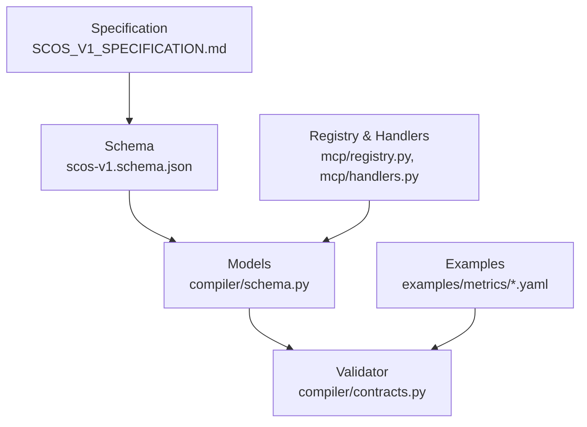
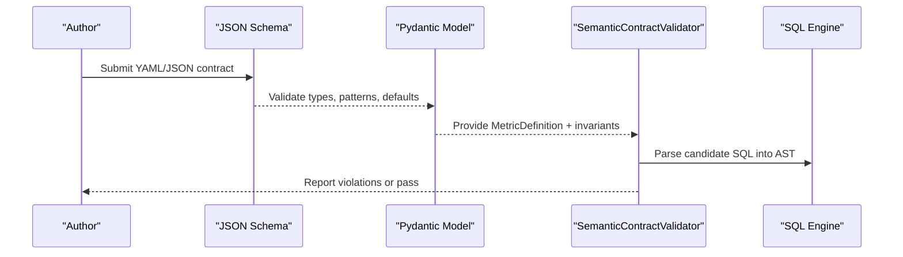
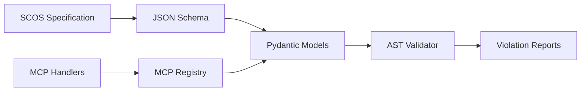

# Core Contract Structure

<cite>
**Referenced Files in This Document**
- [SCOS_V1_SPECIFICATION.md](file://spec/SCOS_V1_SPECIFICATION.md)
- [scos-v1.schema.json](file://spec/scos-v1.schema.json)
- [contracts.py](file://semantic_reliability/compiler/contracts.py)
- [schema.py](file://semantic_reliability/compiler/schema.py)
- [registry.py](file://semantic_reliability/mcp/registry.py)
- [handlers.py](file://semantic_reliability/mcp/handlers.py)
- [net_revenue_contract.yaml](file://examples/metrics/net_revenue_contract.yaml)
- [contract.yaml (net_revenue)](file://benchmark_corpus/dev/net_revenue/contract.yaml)
- [contract.yaml (monthly_active_users)](file://benchmark_corpus/dev/monthly_active_users/contract.yaml)
- [test_scos_spec.py](file://tests/test_scos_spec.py)
</cite>

## Table of Contents
1. Introduction
2. Project Structure
3. Core Components
4. Architecture Overview
5. Detailed Component Analysis
6. Dependency Analysis
7. Performance Considerations
8. Troubleshooting Guide
9. Conclusion
10. Appendices

## Introduction
This document explains the core SCOS contract structure with a focus on required and optional fields, canonical SQL as ground truth, identity and governance headers, URN formatting, semantic versioning, and practical guidance for choosing grains, domains, and dialects. It synthesizes the specification, schema, and runtime validation logic to provide actionable guidance for building well-structured contracts.

## Project Structure
The SCOS standard is defined by:
- A human-readable specification describing layers and rules
- A JSON Schema enforcing field types, patterns, defaults, and requirements
- Runtime models and validators that parse, validate, and enforce invariants against candidate SQL
- Example contracts demonstrating proper usage across different ecosystems

**Diagram sources**
- [SCOS_V1_SPECIFICATION.md:31-96](file://spec/SCOS_V1_SPECIFICATION.md#L31-L96)
- [scos-v1.schema.json:1-163](file://spec/scos-v1.schema.json#L1-L163)
- [schema.py:83-96](file://semantic_reliability/compiler/schema.py#L83-L96)
- [contracts.py:26-135](file://semantic_reliability/compiler/contracts.py#L26-L135)
- [registry.py:36-70](file://semantic_reliability/mcp/registry.py#L36-L70)
- [handlers.py:315-349](file://semantic_reliability/mcp/handlers.py#L315-L349)

**Section sources**
- [SCOS_V1_SPECIFICATION.md:31-96](file://spec/SCOS_V1_SPECIFICATION.md#L31-L96)
- [scos-v1.schema.json:1-163](file://spec/scos-v1.schema.json#L1-L163)

## Core Components
A SCOS contract consists of four orthogonal layers:
- Identity & Governance Header: scos_version, id, metric, version, owner, domain, grain, dialect
- Canonical Ground Truth: sql
- Semantic Invariants: population, grain, aggregation, units/time constraints
- Statistical Probes: population rates, implications, null drift

Key points:
- Required fields per schema: scos_version, metric, owner, grain, sql
- Optional but recommended: id, version, description, domain, dialect, tags, invariants, probes, metadata
- Canonical SQL is the signed, human-authorized implementation used as the ground-truth oracle for mutation testing, dry-runs, and replay workers
- Dialect controls parsing and AST normalization; default is duckdb in schema, postgres in model defaults

Field overview and constraints:
- scos_version: string, enum ["1.0.0"]
- id: string, pattern urn:scos:<domain>:<metric_slug>
- metric: string, alphanumeric with underscores
- version: string, SemVer MAJOR.MINOR.PATCH, default "1.0.0"
- owner: string (required)
- domain: string (optional in schema; used in URN and registry routing)
- grain: string (required), descriptive entity+timeframe like customer_month
- dialect: string, enum of supported engines; default varies by context
- sql: string (required), canonical query
- invariants: object with nested rules for population, grain, aggregation, time, units
- probes: object with arrays for population, implications, null_drift
- tags, metadata: optional organizational fields

**Section sources**
- [scos-v1.schema.json:7-55](file://spec/scos-v1.schema.json#L7-L55)
- [SCOS_V1_SPECIFICATION.md:92-114](file://spec/SCOS_V1_SPECIFICATION.md#L92-L114)
- [schema.py:83-96](file://semantic_reliability/compiler/schema.py#L83-L96)

## Architecture Overview
The SCOS contract lifecycle spans authoring, validation, and runtime enforcement:

**Diagram sources**
- [scos-v1.schema.json:1-163](file://spec/scos-v1.schema.json#L1-L163)
- [schema.py:83-96](file://semantic_reliability/compiler/schema.py#L83-L96)
- [contracts.py:26-135](file://semantic_reliability/compiler/contracts.py#L26-L135)

## Detailed Component Analysis

### Identity and Governance Header
- scos_version: Must be "1.0.0". Enforced by schema enum.
- id: Canonical URN format urn:scos:<domain>:<metric_slug>. Used for registry resolution and cross-system interoperability.
- metric: Unique slug identifier for the metric.
- version: Semantic versioning MAJOR.MINOR.PATCH; default "1.0.0". Tracks business evolution.
- owner: Responsible team or contact; required.
- domain: Business domain; used in URN and access control policies.
- grain: Reporting granularity; required. Describes entity and timeframe (e.g., customer_month).
- dialect: Target SQL engine for parsing and AST analysis; defaults vary by context.

URN formatting standards:
- Pattern enforced by schema: urn:scos:<domain>:<metric_slug>
- Registry supports resolving URNs and scos:// URI paths to contracts and invariants

Semantic versioning conventions:
- Follow MAJOR.MINOR.PATCH to signal breaking changes, new features, and patches
- Align version increments with changes to canonical SQL or invariant semantics

**Section sources**
- [scos-v1.schema.json:9-28](file://spec/scos-v1.schema.json#L9-L28)
- [SCOS_V1_SPECIFICATION.md:92-96](file://spec/SCOS_V1_SPECIFICATION.md#L92-L96)
- [registry.py:36-70](file://semantic_reliability/mcp/registry.py#L36-L70)
- [handlers.py:315-349](file://semantic_reliability/mcp/handlers.py#L315-L349)

### Canonical SQL Definition Field
Role:
- Serves as the signed, human-authorized ground-truth implementation of the metric
- Used for mutation testing, dry runs, and replay workers
- Parsed via the specified dialect to build an AST for invariant checks

Validation behavior:
- Candidate SQL is parsed using the same dialect as the canonical definition
- AST-based checks ensure required filters, grouping dimensions, and aggregation components are present

**Section sources**
- [SCOS_V1_SPECIFICATION.md:98-100](file://spec/SCOS_V1_SPECIFICATION.md#L98-L100)
- [contracts.py:26-135](file://semantic_reliability/compiler/contracts.py#L26-L135)

### Invariants and Probes
Invariants:
- Population: required_filters and forbidden_filters ensure correct WHERE predicates
- Grain: required_dimensions enforce GROUP BY semantics and prevent over-aggregation
- Aggregation: positive_components and negative_components define net calculations
- Time/Units: timezone and period_grain constrain temporal semantics; currency/scale define units

Probes:
- Population: predicate min/max rate bounds to detect distribution drift
- Implications: antecedent/consequent confidence thresholds for logical dependencies
- Null drift: max_null_rate per column to guard join keys and identifiers

**Section sources**
- [scos-v1.schema.json:61-155](file://spec/scos-v1.schema.json#L61-L155)
- [schema.py:5-23](file://semantic_reliability/compiler/schema.py#L5-L23)
- [contracts.py:44-128](file://semantic_reliability/compiler/contracts.py#L44-L128)

### Data Type Constraints, Defaults, and Dependencies
- scos_version: string, enum ["1.0.0"]
- id: string, pattern urn:scos:<domain>:<metric_slug>
- metric: string, alphanumeric with underscores
- version: string, SemVer pattern, default "1.0.0"
- owner: string, required
- domain: string, optional
- grain: string, required
- dialect: string, enum of supported engines; default "duckdb" in schema, "postgres" in model
- sql: string, required
- invariants.probes.population[].min_rate/max_rate: numbers between 0.0 and 1.0
- invariants.probes.implications[].min_confidence: number between 0.0 and 1.0
- invariants.probes.null_drift[].max_null_rate: number between 0.0 and 1.0

Dependencies:
- id depends on domain and metric slug
- invariants depend on metric semantics (population, aggregation, grain)
- probes depend on data characteristics and risk tolerance

**Section sources**
- [scos-v1.schema.json:7-55](file://spec/scos-v1.schema.json#L7-L55)
- [schema.py:83-96](file://semantic_reliability/compiler/schema.py#L83-L96)

### Choosing Grains, Domains, and Dialects
- Grain: Choose the smallest reporting unit that makes sense for your metric (e.g., customer_month for revenue per customer per month; monthly for active users). Ensure GROUP BY aligns with grain invariants.
- Domain: Use a consistent naming convention aligned with business areas (finance, marketing, operations). URNs and registry routing rely on domain.
- Dialect: Select the target engine for parsing and AST normalization (snowflake, bigquery, postgres, duckdb, redshift, databricks). Default may vary by context; ensure consistency between canonical SQL and validator.

Guidance:
- For financial metrics requiring strict accounting semantics, prefer explicit timezone and period_grain in invariants
- For high-cardinality user metrics, ensure grain prevents duplicate rows at the reporting level
- For multi-engine environments, keep canonical SQL portable or maintain per-dialect variants with consistent invariants

**Section sources**
- [SCOS_V1_SPECIFICATION.md:92-100](file://spec/SCOS_V1_SPECIFICATION.md#L92-L100)
- [scos-v1.schema.json:46-50](file://spec/scos-v1.schema.json#L46-L50)
- [schema.py:83-96](file://semantic_reliability/compiler/schema.py#L83-L96)

### Well-Structured Contract Examples
- Net Revenue example demonstrates required filters, aggregation components, units, and time semantics
- Monthly Active Users example shows population filters and monthly grain
- Benchmark examples illustrate minimal contracts focusing on essential fields

Use these as templates for constructing robust contracts:
- Include all required fields
- Define invariants that capture business rules
- Add probes to monitor data health
- Align grain, domain, and dialect with your environment

**Section sources**
- [net_revenue_contract.yaml:1-39](file://examples/metrics/net_revenue_contract.yaml#L1-L39)
- [contract.yaml (net_revenue):1-19](file://benchmark_corpus/dev/net_revenue/contract.yaml#L1-L19)
- [contract.yaml (monthly_active_users):1-13](file://benchmark_corpus/dev/monthly_active_users/contract.yaml#L1-L13)

## Dependency Analysis
The contract system composes specification, schema, models, and runtime validation:

**Diagram sources**
- [SCOS_V1_SPECIFICATION.md:31-96](file://spec/SCOS_V1_SPECIFICATION.md#L31-L96)
- [scos-v1.schema.json:1-163](file://spec/scos-v1.schema.json#L1-L163)
- [schema.py:83-96](file://semantic_reliability/compiler/schema.py#L83-L96)
- [contracts.py:26-135](file://semantic_reliability/compiler/contracts.py#L26-L135)
- [registry.py:36-70](file://semantic_reliability/mcp/registry.py#L36-L70)
- [handlers.py:315-349](file://semantic_reliability/mcp/handlers.py#L315-L349)

**Section sources**
- [contracts.py:26-135](file://semantic_reliability/compiler/contracts.py#L26-L135)
- [schema.py:83-96](file://semantic_reliability/compiler/schema.py#L83-L96)

## Performance Considerations
- AST parsing uses a single dialect; ensure canonical SQL matches the intended engine to avoid costly rewrites
- Keep invariants focused on critical business rules to reduce false positives and evaluation overhead
- Use probes judiciously; expensive statistical checks should be scheduled appropriately
- Prefer compact, readable canonical SQL to improve readability and maintenance without impacting performance

[No sources needed since this section provides general guidance]

## Troubleshooting Guide
Common issues and resolutions:
- Missing required fields: Ensure scos_version, metric, owner, grain, and sql are present
- Invalid URN: Verify id matches urn:scos:<domain>:<metric_slug>
- Dialect mismatch: Align canonical SQL dialect with validator settings
- Invariant violations: Add missing required filters, grouping dimensions, or aggregation components
- Probe failures: Adjust min/max thresholds based on historical baselines; investigate data drift

Validation references:
- Schema enforces types, patterns, and defaults
- Tests demonstrate valid and invalid contract structures

**Section sources**
- [scos-v1.schema.json:7-55](file://spec/scos-v1.schema.json#L7-L55)
- [test_scos_spec.py:16-66](file://tests/test_scos_spec.py#L16-L66)
- [contracts.py:44-128](file://semantic_reliability/compiler/contracts.py#L44-L128)

## Conclusion
SCOS contracts formalize business metrics through a layered approach: identity and governance, canonical SQL, semantic invariants, and statistical probes. Adhering to the schema ensures correctness, while invariants and probes provide deterministic enforcement and runtime observability. Proper use of URNs, semantic versioning, grains, domains, and dialects enables scalable governance across ecosystems.

[No sources needed since this section summarizes without analyzing specific files]

## Appendices

### Field Reference Summary
- Required: scos_version, metric, owner, grain, sql
- Optional: id, version, description, domain, dialect, tags, invariants, probes, metadata
- Patterns and defaults:
  - scos_version: "1.0.0"
  - id: urn:scos:<domain>:<metric_slug>
  - version: SemVer, default "1.0.0"
  - dialect: enum; default varies by context
  - probes rates/confidences: 0.0–1.0

**Section sources**
- [scos-v1.schema.json:7-55](file://spec/scos-v1.schema.json#L7-L55)
- [SCOS_V1_SPECIFICATION.md:92-114](file://spec/SCOS_V1_SPECIFICATION.md#L92-L114)