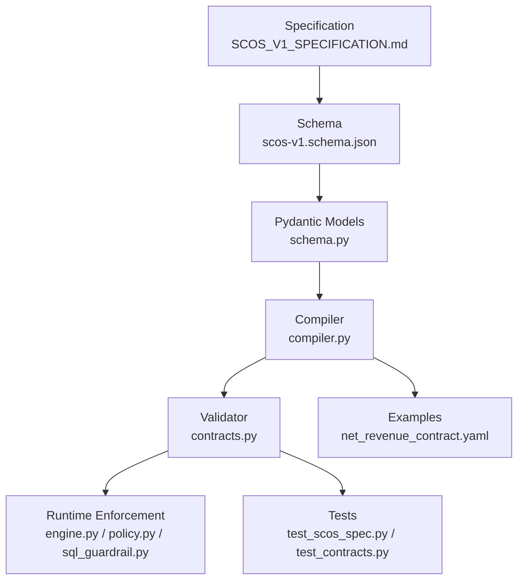
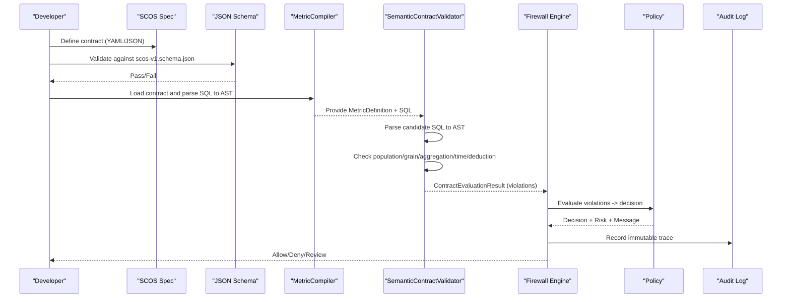
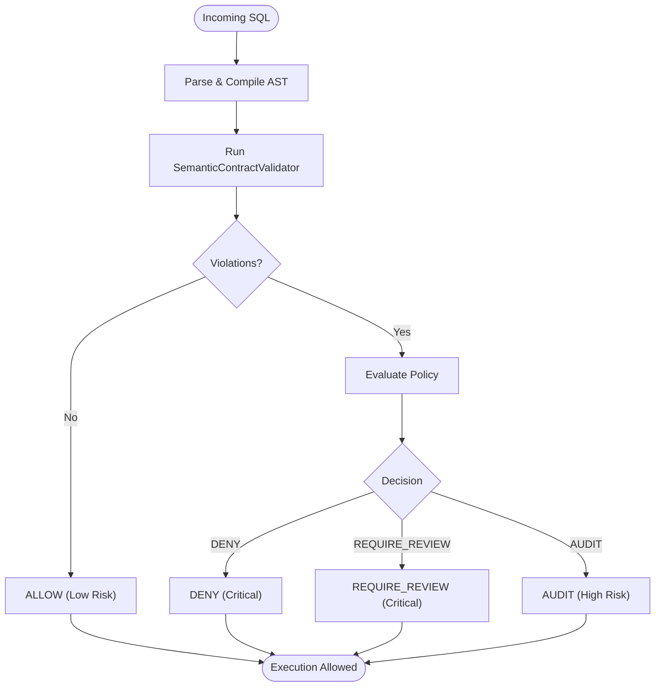
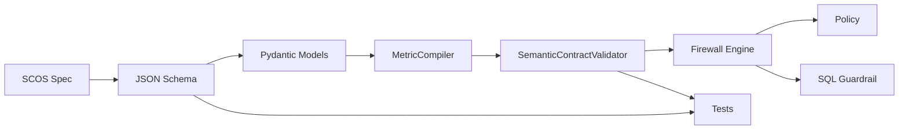

# Schema Validation

<cite>
**Referenced Files in This Document**
- [SCOS_V1_SPECIFICATION.md](file://spec/SCOS_V1_SPECIFICATION.md)
- [scos-v1.schema.json](file://spec/scos-v1.schema.json)
- [schema.py](file://semantic_reliability/compiler/schema.py)
- [contracts.py](file://semantic_reliability/compiler/contracts.py)
- [compiler.py](file://semantic_reliability/compiler/compiler.py)
- [validity.py](file://semantic_reliability/harness/validity.py)
- [engine.py](file://semantic_reliability/firewall/engine.py)
- [policy.py](file://semantic_reliability/firewall/policy.py)
- [sql_guardrail.py](file://semantic_reliability/runtime/sql_guardrail.py)
- [auditor.py](file://semantic_reliability/gym/auditor.py)
- [test_scos_spec.py](file://tests/test_scos_spec.py)
- [test_contracts.py](file://tests/test_contracts.py)
- [net_revenue_contract.yaml](file://examples/metrics/net_revenue_contract.yaml)
- [contract.yaml (dev net_revenue)](file://benchmark_corpus/dev/net_revenue/contract.yaml)
</cite>

## Table of Contents
1. Introduction
2. Project Structure
3. Core Components
4. Architecture Overview
5. Detailed Component Analysis
6. Dependency Analysis
7. Performance Considerations
8. Troubleshooting Guide
9. Conclusion
10. Appendices

## Introduction
This document explains the SCOS v1.0 JSON schema and validation mechanisms that enforce contract syntax, structure, and semantic invariants for executable business metric contracts. It details how machine-readable schemas constrain data types, cross-field dependencies, and AST-based checks; documents conformance requirements for SCOS v1.0.0 compliance; provides examples of valid and invalid contracts with explanations of validation errors; and outlines schema evolution strategies and backward compatibility considerations.

## Project Structure
The SCOS implementation spans specification, schema, compiler models, validators, runtime enforcement, and tests:
- Specification and schema define the canonical contract format and constraints.
- Compiler models parse YAML/JSON into typed structures and compile SQL to ASTs.
- Validators enforce population, grain, aggregation, time, and deduction rules against candidate SQL.
- Runtime components gate execution based on violations and produce audit evidence.
- Tests validate schema correctness and validator behavior.

**Diagram sources**
- [SCOS_V1_SPECIFICATION.md:1-134](file://spec/SCOS_V1_SPECIFICATION.md#L1-L134)
- [scos-v1.schema.json:1-163](file://spec/scos-v1.schema.json#L1-L163)
- [schema.py:1-98](file://semantic_reliability/compiler/schema.py#L1-L98)
- [compiler.py:1-72](file://semantic_reliability/compiler/compiler.py#L1-L72)
- [contracts.py:1-135](file://semantic_reliability/compiler/contracts.py#L1-L135)
- [engine.py:86-131](file://semantic_reliability/firewall/engine.py#L86-L131)
- [policy.py:35-67](file://semantic_reliability/firewall/policy.py#L35-L67)
- [sql_guardrail.py:37-69](file://semantic_reliability/runtime/sql_guardrail.py#L37-L69)
- [test_scos_spec.py:1-67](file://tests/test_scos_spec.py#L1-L67)
- [test_contracts.py:1-92](file://tests/test_contracts.py#L1-L92)
- [net_revenue_contract.yaml:1-39](file://examples/metrics/net_revenue_contract.yaml#L1-L39)

**Section sources**
- [SCOS_V1_SPECIFICATION.md:1-134](file://spec/SCOS_V1_SPECIFICATION.md#L1-L134)
- [scos-v1.schema.json:1-163](file://spec/scos-v1.schema.json#L1-L163)

## Core Components
- SCOS v1.0 JSON Schema: Declares required fields, patterns, enums, and nested objects for invariants and probes.
- Pydantic Models: Strongly-typed representations for MetricDefinition, SemanticInvariants, and probes.
- Compiler: Parses YAML/JSON into MetricDefinition and compiles SQL to an AST for deterministic analysis.
- Validator: Enforces invariant rules by comparing parsed AST nodes and text against declared policies.
- Runtime Enforcement: Evaluates violations to allow, deny, or require review; records immutable audit traces.
- Tests: Validate schema correctness and ensure validator catches common defects.

Key responsibilities:
- Schema enforces data type constraints and structural requirements at ingestion time.
- Compiler ensures ground-truth SQL is syntactically valid and AST-accessible.
- Validator performs deterministic AST checks for filters, grouping, aggregations, and time semantics.
- Runtime gates execution and produces auditable decisions.

**Section sources**
- [scos-v1.schema.json:1-163](file://spec/scos-v1.schema.json#L1-L163)
- [schema.py:1-98](file://semantic_reliability/compiler/schema.py#L1-L98)
- [compiler.py:1-72](file://semantic_reliability/compiler/compiler.py#L1-L72)
- [contracts.py:1-135](file://semantic_reliability/compiler/contracts.py#L1-L135)
- [engine.py:86-131](file://semantic_reliability/firewall/engine.py#L86-L131)
- [policy.py:35-67](file://semantic_reliability/firewall/policy.py#L35-L67)
- [sql_guardrail.py:37-69](file://semantic_reliability/runtime/sql_guardrail.py#L37-L69)
- [test_scos_spec.py:1-67](file://tests/test_scos_spec.py#L1-L67)
- [test_contracts.py:1-92](file://tests/test_contracts.py#L1-L92)

## Architecture Overview
End-to-end flow from contract definition to runtime enforcement and audit:

**Diagram sources**
- [SCOS_V1_SPECIFICATION.md:1-134](file://spec/SCOS_V1_SPECIFICATION.md#L1-L134)
- [scos-v1.schema.json:1-163](file://spec/scos-v1.schema.json#L1-L163)
- [compiler.py:1-72](file://semantic_reliability/compiler/compiler.py#L1-L72)
- [contracts.py:1-135](file://semantic_reliability/compiler/contracts.py#L1-L135)
- [engine.py:86-131](file://semantic_reliability/firewall/engine.py#L86-L131)
- [policy.py:35-67](file://semantic_reliability/firewall/policy.py#L35-L67)

## Detailed Component Analysis

### SCOS v1.0 JSON Schema
- Required fields: scos_version, metric, owner, grain, sql.
- Identifier constraints: id must match a URN pattern; metric must be alphanumeric with underscores; version follows SemVer.
- Dialect enum: supports multiple SQL engines with defaults.
- Invariants object:
  - population.required_filters and forbidden_filters: arrays of predicate strings.
  - temporal.timezone default UTC; period_grain optional.
  - aggregation.required_aggregations array.
  - deduction.required_subtractions array.
- Probes object:
  - population: items require predicate, min_rate, max_rate with numeric bounds.
  - implications: items require antecedent, consequent, min_confidence with numeric bounds.
  - null_drift: items require column, max_null_rate with numeric bounds.
- metadata: arbitrary key-value store.

Validation behaviors enforced by the schema:
- Type checks (string, number, array).
- Enum constraints (dialect, scos_version).
- Pattern constraints (id, metric, version).
- Numeric range constraints (rates and confidence between 0.0 and 1.0).
- Cross-field dependencies via required subfields within nested objects.

**Section sources**
- [scos-v1.schema.json:1-163](file://spec/scos-v1.schema.json#L1-L163)
- [test_scos_spec.py:1-67](file://tests/test_scos_spec.py#L1-L67)

### Pydantic Models and Typed Contracts
- MetricDefinition encapsulates metric identity, SQL, dialect, tags, dimensions, invariants, probes, provenance, and metadata.
- SemanticInvariants groups population, grain, aggregation, units, and time constraints.
- Probe models formalize population, implication, and null drift expectations with tolerances and baselines.
- These models provide programmatic access to contract fields and enable consistent parsing across tools.

**Section sources**
- [schema.py:1-98](file://semantic_reliability/compiler/schema.py#L1-L98)

### Compiler and AST Compilation
- MetricCompiler loads YAML/JSON into MetricDefinition and parses the canonical SQL into an AST using sqlglot.
- Provides helpers to extract WHERE clauses, select expressions, aggregation functions, tables, and metadata.
- Ensures deterministic AST representation for invariant checks and transpilation when needed.

**Section sources**
- [compiler.py:1-72](file://semantic_reliability/compiler/compiler.py#L1-L72)

### Semantic Contract Validator
- Parses candidate SQL into AST and compares against declared invariants:
  - Population: checks presence of required filters in WHERE clause; can detect missing predicates.
  - Grain: verifies GROUP BY includes required dimensions; normalizes tokens for robust matching.
  - Aggregation: checks inclusion of positive/negative components in SQL text; flags missing deductions.
  - Timezone: detects non-UTC timezone usage when UTC is required.
- Returns a structured result with pass/fail, metric name, list of violations, and count of evaluated rules.

Example validations demonstrated in tests:
- Passing contract validates successfully.
- Missing required filter triggers a violation.
- Dropping a required dimension triggers a reporting grain violation.
- Omitting a negative component triggers an aggregation invariant violation.

**Section sources**
- [contracts.py:1-135](file://semantic_reliability/compiler/contracts.py#L1-L135)
- [test_contracts.py:1-92](file://tests/test_contracts.py#L1-L92)

### Runtime Enforcement and Audit Evidence
- Firewall engine runs the validator against incoming SQL, maps violations to policy rules, and decides ALLOW/AUDIT/REQUIRE_REVIEW/DENY.
- Policy evaluates severity and mode (strict vs review) to determine final decision and risk level.
- SQL guardrail enriches violations with mutation oracle mappings and applies strict-mode blocking for critical issues.
- Audit traces record request context, decision, violations, and hashes for immutability and reproducibility.

**Diagram sources**
- [engine.py:86-131](file://semantic_reliability/firewall/engine.py#L86-L131)
- [policy.py:35-67](file://semantic_reliability/firewall/policy.py#L35-L67)
- [sql_guardrail.py:37-69](file://semantic_reliability/runtime/sql_guardrail.py#L37-L69)

**Section sources**
- [engine.py:86-131](file://semantic_reliability/firewall/engine.py#L86-L131)
- [policy.py:35-67](file://semantic_reliability/firewall/policy.py#L35-L67)
- [sql_guardrail.py:37-69](file://semantic_reliability/runtime/sql_guardrail.py#L37-L69)

### Conformance Requirements for SCOS v1.0.0 Compliance
A system is compliant if it provides:
- Schema Validation: Strict parsing against scos-v1.schema.json.
- Deterministic AST Invariant Enforcement: Validates SQL candidates without false positives due to formatting or commutative operations.
- Audit Evidence Generation: Produces deterministic, verifiable digests for evaluation decisions.

Evidence generation and integrity are supported by:
- Immutable audit traces recording decisions, violations, and hashes.
- Gym auditor checks for duplicate evidence hashes and missing metadata to ensure dataset integrity.

**Section sources**
- [SCOS_V1_SPECIFICATION.md:128-134](file://spec/SCOS_V1_SPECIFICATION.md#L128-L134)
- [engine.py:118-131](file://semantic_reliability/firewall/engine.py#L118-L131)
- [auditor.py:41-138](file://semantic_reliability/gym/auditor.py#L41-L138)

### Examples of Valid and Invalid Contracts

Valid contract example:
- The example net_revenue contract defines metric identity, invariants (population filters, grain dimensions, aggregation components), and canonical SQL. It passes schema validation and invariant checks when executed through the compiler and validator.

Invalid contract scenarios:
- Missing required fields (e.g., metric, owner, grain, sql) fail schema validation.
- Candidate SQL missing a required filter fails invariant validation.
- Candidate SQL dropping a required dimension fails grain invariant validation.
- Candidate SQL omitting a negative component fails aggregation invariant validation.

These cases are validated programmatically in tests and demonstrate expected error conditions.

**Section sources**
- [net_revenue_contract.yaml:1-39](file://examples/metrics/net_revenue_contract.yaml#L1-L39)
- [contract.yaml (dev net_revenue):1-19](file://benchmark_corpus/dev/net_revenue/contract.yaml#L1-L19)
- [test_scos_spec.py:16-67](file://tests/test_scos_spec.py#L16-L67)
- [test_contracts.py:36-92](file://tests/test_contracts.py#L36-L92)

### Data Type Constraints and Cross-Field Dependencies
- scos_version must equal "1.0.0".
- id must match a URN pattern; metric must be alphanumeric with underscores; version must follow SemVer.
- dialect must be one of the supported engines.
- probes.population requires predicate plus numeric rates bounded between 0.0 and 1.0.
- probes.implications require antecedent, consequent, and min_confidence bounded between 0.0 and 1.0.
- probes.null_drift requires column and max_null_rate bounded between 0.0 and 1.0.
- invariants.population and invariants.deduction use arrays of string predicates to express cross-field logical dependencies between filters and deductions.

**Section sources**
- [scos-v1.schema.json:1-163](file://spec/scos-v1.schema.json#L1-L163)

### Schema Evolution Strategies and Backward Compatibility
- Versioning: scos_version is pinned to "1.0.0" in the current schema; future versions should introduce new top-level fields or nested objects while preserving existing required fields for backward compatibility.
- Optional fields: Use optional properties and defaults to avoid breaking changes (e.g., metadata, tags, dialect defaults).
- Extensibility: Add new invariant categories or probe types as optional nested objects to maintain compatibility with older consumers.
- Migration path: When evolving, keep legacy fields functional alongside new ones and deprecate gradually with documentation and tooling support.

[No sources needed since this section provides general guidance]

## Dependency Analysis
The following diagram shows core dependencies among modules involved in schema validation and enforcement:

**Diagram sources**
- [SCOS_V1_SPECIFICATION.md:1-134](file://spec/SCOS_V1_SPECIFICATION.md#L1-L134)
- [scos-v1.schema.json:1-163](file://spec/scos-v1.schema.json#L1-L163)
- [schema.py:1-98](file://semantic_reliability/compiler/schema.py#L1-L98)
- [compiler.py:1-72](file://semantic_reliability/compiler/compiler.py#L1-L72)
- [contracts.py:1-135](file://semantic_reliability/compiler/contracts.py#L1-L135)
- [engine.py:86-131](file://semantic_reliability/firewall/engine.py#L86-L131)
- [policy.py:35-67](file://semantic_reliability/firewall/policy.py#L35-L67)
- [sql_guardrail.py:37-69](file://semantic_reliability/runtime/sql_guardrail.py#L37-L69)
- [test_scos_spec.py:1-67](file://tests/test_scos_spec.py#L1-L67)
- [test_contracts.py:1-92](file://tests/test_contracts.py#L1-L92)

**Section sources**
- [contracts.py:1-135](file://semantic_reliability/compiler/contracts.py#L1-L135)
- [engine.py:86-131](file://semantic_reliability/firewall/engine.py#L86-L131)

## Performance Considerations
- AST parsing uses sqlglot; performance depends on query complexity and dialect-specific parsing.
- Invariant checks operate on normalized strings and AST node searches; minimize redundant parsing by reusing compiled ASTs where possible.
- Runtime enforcement adds minimal overhead but enables governance; consider batching evaluations in CI pipelines.
- Audit logging is append-only; ensure log rotation and storage policies for high-throughput environments.

[No sources needed since this section provides general guidance]

## Troubleshooting Guide
Common validation failures and remedies:
- Missing required filters: Add the required predicate to the WHERE clause.
- Missing required dimensions: Include all required grouping dimensions in GROUP BY.
- Missing negative components: Ensure deductions for refunds/discounts are subtracted in aggregation.
- Non-UTC timezone usage: Align timestamps to UTC when UTC is required.
- Schema validation errors: Ensure required fields are present and values conform to patterns/enums/ranges.

Diagnostic steps:
- Run schema validation against scos-v1.schema.json to catch structural issues early.
- Use the compiler to parse and inspect AST nodes for WHERE, GROUP BY, and aggregation functions.
- Execute the validator on candidate SQL to obtain detailed violations with remediation hints.
- Inspect firewall decisions and audit logs to understand enforcement outcomes.

**Section sources**
- [contracts.py:44-128](file://semantic_reliability/compiler/contracts.py#L44-L128)
- [engine.py:86-131](file://semantic_reliability/firewall/engine.py#L86-L131)
- [policy.py:35-67](file://semantic_reliability/firewall/policy.py#L35-L67)
- [sql_guardrail.py:37-69](file://semantic_reliability/runtime/sql_guardrail.py#L37-L69)
- [test_contracts.py:45-92](file://tests/test_contracts.py#L45-L92)

## Conclusion
SCOS v1.0 provides a robust, machine-readable contract standard that enforces both schema-level and semantic-level constraints. The combination of JSON Schema validation, AST-based invariant checks, and runtime enforcement ensures deterministic, auditable governance over metric definitions and generated SQL. By adhering to the specified schema and invariants, teams can prevent silent semantic drift, maintain consistency across ecosystems, and generate reliable audit evidence for compliance and reproducibility.

[No sources needed since this section summarizes without analyzing specific files]

## Appendices

### Appendix A: Example Contracts
- Valid example: net_revenue contract demonstrates proper invariants and SQL structure.
- Benchmark example: dev net_revenue contract illustrates required filters and aggregation components.

**Section sources**
- [net_revenue_contract.yaml:1-39](file://examples/metrics/net_revenue_contract.yaml#L1-L39)
- [contract.yaml (dev net_revenue):1-19](file://benchmark_corpus/dev/net_revenue/contract.yaml#L1-L19)

### Appendix B: Validity and Confidence Evaluation
- Benchmark validity evaluator classifies results based on fixture adequacy and contract coverage thresholds, providing confidence levels and validity notes.

**Section sources**
- [validity.py:1-127](file://semantic_reliability/harness/validity.py#L1-L127)