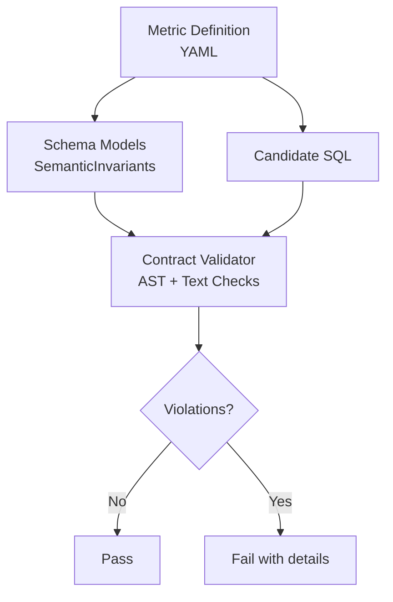
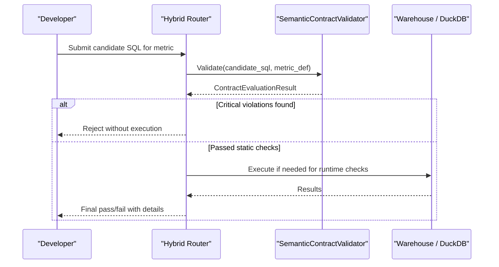
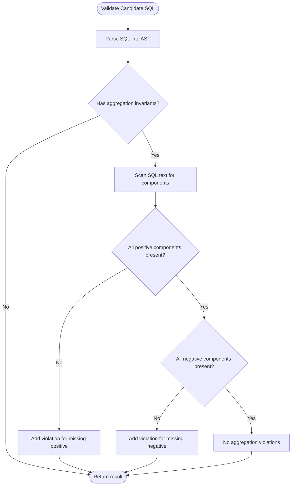
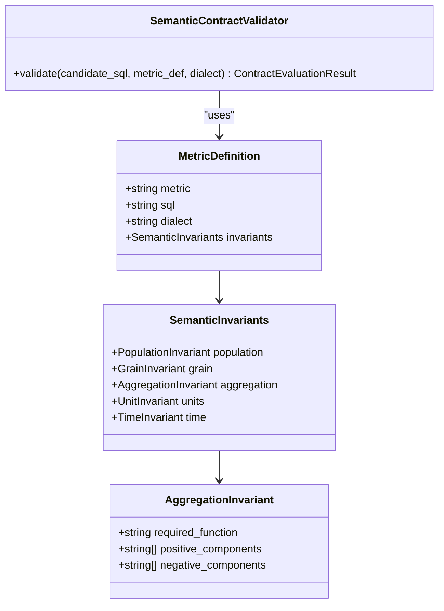
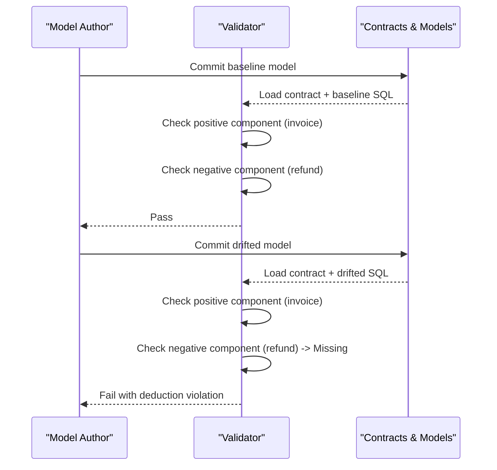
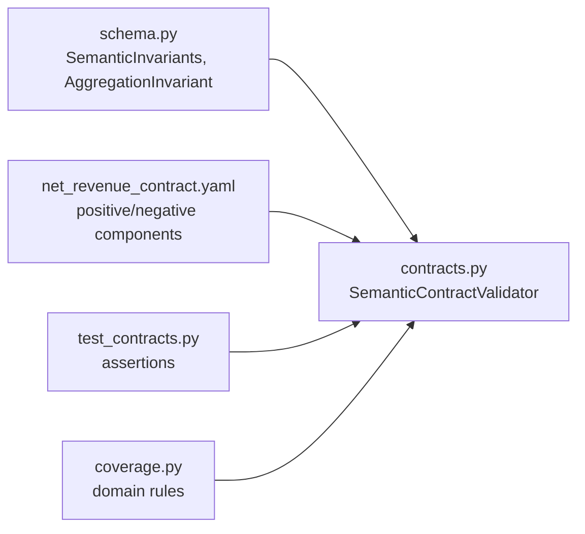

# Deduction Invariants

<cite>
**Referenced Files in This Document**
- [contracts.py](file://semantic_reliability/compiler/contracts.py)
- [schema.py](file://semantic_reliability/compiler/schema.py)
- [coverage.py](file://semantic_reliability/compiler/coverage.py)
- [net_revenue.yaml](file://examples/metrics/net_revenue.yaml)
- [net_revenue_contract.yaml](file://examples/metrics/net_revenue_contract.yaml)
- [contract.yaml (dev net_revenue)](file://benchmark_corpus/dev/net_revenue/contract.yaml)
- [model_net_revenue.sql (dev)](file://benchmark_corpus/dev/net_revenue/model_net_revenue.sql)
- [fct_net_revenue_baseline.sql](file://examples/models/fct_net_revenue_baseline.sql)
- [fct_net_revenue_drifted.sql](file://examples/models/fct_net_revenue_drifted.sql)
- [test_contracts.py](file://tests/test_contracts.py)
- [hybrid_router.py](file://semantic_reliability/firewall/hybrid_router.py)
- [agent_eval.py](file://semantic_reliability/evaluation/agent_eval.py)
</cite>

## Table of Contents
1. Introduction
2. Project Structure
3. Core Components
4. Architecture Overview
5. Detailed Component Analysis
6. Dependency Analysis
7. Performance Considerations
8. Troubleshooting Guide
9. Conclusion

## Introduction
This document explains deduction invariants for additive metrics, focusing on how required negative components must be subtracted from aggregate sums to prevent overcounting. It documents the AST-based analysis that validates candidate SQL queries against declared semantic contracts and shows concrete examples using net_revenue where invoice amounts are added and refunds are subtracted. It also provides best practices for defining deduction rules that catch revenue calculation errors while allowing legitimate business variations, and includes debugging techniques when validation incorrectly flags valid queries.

## Project Structure
The deduction invariant system is implemented as a declarative contract layer plus an AST-based validator:
- Contracts define population filters, grain dimensions, aggregation requirements, and deduction components.
- The validator parses candidate SQL into an AST and checks whether required positive and negative components appear in the query text.
- Net revenue examples demonstrate invoice addition and refund subtraction.

**Diagram sources**
- [schema.py:15-36](file://semantic_reliability/compiler/schema.py#L15-L36)
- [contracts.py:26-134](file://semantic_reliability/compiler/contracts.py#L26-L134)

**Section sources**
- [schema.py:15-36](file://semantic_reliability/compiler/schema.py#L15-L36)
- [contracts.py:26-134](file://semantic_reliability/compiler/contracts.py#L26-L134)

## Core Components
- AggregationInvariant defines positive_components and negative_components to enforce which conditions must be included in the metric’s arithmetic.
- SemanticContractValidator parses candidate SQL and enforces:
  - Population filters presence
  - Grain dimension grouping
  - Presence of positive and negative component conditions in the SQL text
  - Timezone constraints
- CoverageCalculator maps metric categories to expected dimensions, including aggregation-related deductions.

Key responsibilities:
- Define deduction rules via negative_components.
- Detect missing or incorrect subtractions by ensuring negative component strings appear in the candidate SQL.
- Report precise violations with remediation guidance.

**Section sources**
- [schema.py:15-18](file://semantic_reliability/compiler/schema.py#L15-L18)
- [contracts.py:92-113](file://semantic_reliability/compiler/contracts.py#L92-L113)
- [coverage.py:28-33](file://semantic_reliability/compiler/coverage.py#L28-L33)

## Architecture Overview
The validation pipeline integrates static contract checks with optional escalation paths:

**Diagram sources**
- [hybrid_router.py:82-107](file://semantic_reliability/firewall/hybrid_router.py#L82-L107)
- [contracts.py:26-134](file://semantic_reliability/compiler/contracts.py#L26-L134)

**Section sources**
- [hybrid_router.py:82-107](file://semantic_reliability/firewall/hybrid_router.py#L82-L107)
- [contracts.py:26-134](file://semantic_reliability/compiler/contracts.py#L26-L134)

## Detailed Component Analysis

### Deduction Invariant Enforcement
Deduction invariants ensure that certain expressions representing reductions (e.g., refunds, chargebacks) are subtracted from aggregate sums. The validator treats each negative_component as a required substring match in the candidate SQL. If any negative component is absent, a violation is raised.

**Diagram sources**
- [contracts.py:92-113](file://semantic_reliability/compiler/contracts.py#L92-L113)

**Section sources**
- [contracts.py:92-113](file://semantic_reliability/compiler/contracts.py#L92-L113)

### AST-Based Analysis Details
- The validator uses an SQL parser to build an AST and then performs targeted checks:
  - WHERE clause presence for required filters
  - GROUP BY presence for required dimensions
  - Substring search for positive/negative components in the full SQL text
- While the component check is text-based, it operates within the context of an AST-parsed query, enabling consistent dialect handling and safe normalization before comparison.

**Diagram sources**
- [schema.py:15-36](file://semantic_reliability/compiler/schema.py#L15-L36)
- [contracts.py:26-36](file://semantic_reliability/compiler/contracts.py#L26-L36)

**Section sources**
- [schema.py:15-36](file://semantic_reliability/compiler/schema.py#L15-L36)
- [contracts.py:26-36](file://semantic_reliability/compiler/contracts.py#L26-L36)

### Net Revenue Example: Invoice Addition and Refund Subtraction
- Contract declares:
  - Positive component condition for invoices
  - Negative component condition for refunds
- Baseline model correctly adds invoice amounts and subtracts refunds at the reporting grain.
- Drifted model drops refund subtraction and changes population filter, triggering violations.

**Diagram sources**
- [net_revenue_contract.yaml:18-23](file://examples/metrics/net_revenue_contract.yaml#L18-L23)
- [fct_net_revenue_baseline.sql:1-8](file://examples/models/fct_net_revenue_baseline.sql#L1-L8)
- [fct_net_revenue_drifted.sql:1-8](file://examples/models/fct_net_revenue_drifted.sql#L1-L8)
- [contracts.py:92-113](file://semantic_reliability/compiler/contracts.py#L92-L113)

**Section sources**
- [net_revenue_contract.yaml:18-23](file://examples/metrics/net_revenue_contract.yaml#L18-L23)
- [fct_net_revenue_baseline.sql:1-8](file://examples/models/fct_net_revenue_baseline.sql#L1-L8)
- [fct_net_revenue_drifted.sql:1-8](file://examples/models/fct_net_revenue_drifted.sql#L1-L8)
- [contracts.py:92-113](file://semantic_reliability/compiler/contracts.py#L92-L113)

### Best Practices for Defining Deduction Rules
- Be explicit about every reduction type: list all negative components that must be subtracted (e.g., refunds, chargebacks).
- Keep component strings stable and unambiguous so substring matching remains reliable across rewrites.
- Pair deduction invariants with population filters to avoid counting ineligible rows.
- Use coverage mapping to ensure financial metrics include aggregation-related dimensions like currency and time alignment.
- Allow legitimate variations by:
  - Using normalized column names and aliases consistently
  - Avoiding fragile formatting assumptions; rely on canonical expressions
  - Adding unit/time invariants to constrain scale and timezone

**Section sources**
- [coverage.py:28-33](file://semantic_reliability/compiler/coverage.py#L28-L33)
- [net_revenue_contract.yaml:18-23](file://examples/metrics/net_revenue_contract.yaml#L18-L23)

### Debugging Techniques When Validation Incorrectly Flags Valid Queries
Common causes and fixes:
- Case sensitivity or whitespace differences: Ensure the negative component string appears exactly as declared in the candidate SQL.
- Aliasing or expression rewriting: If the developer refactors CASE WHEN logic, keep the original predicate token intact or adjust the contract to match the new canonical form.
- Over-normalization pitfalls: The validator normalizes some tokens; verify that your component string survives normalization.
- Escalation path: If static checks pass but runtime behavior differs, use the hybrid router’s escalation to execute and compare results.

Practical steps:
- Inspect the violation message to identify the exact missing component.
- Compare the candidate SQL against the declared negative component string character-by-character.
- Temporarily relax or update the contract to reflect legitimate business variations, then add tests to guard future drift.
- Use agent evaluation integration to collect detailed unsupported-assumption messages when invariants fail.

**Section sources**
- [contracts.py:92-113](file://semantic_reliability/compiler/contracts.py#L92-L113)
- [agent_eval.py:69-80](file://semantic_reliability/evaluation/agent_eval.py#L69-L80)
- [hybrid_router.py:82-107](file://semantic_reliability/firewall/hybrid_router.py#L82-L107)

## Dependency Analysis
The deduction invariant system depends on schema models, contract definitions, and the validator. Tests validate both passing and failing scenarios.

**Diagram sources**
- [schema.py:15-36](file://semantic_reliability/compiler/schema.py#L15-L36)
- [contracts.py:26-134](file://semantic_reliability/compiler/contracts.py#L26-L134)
- [coverage.py:28-33](file://semantic_reliability/compiler/coverage.py#L28-L33)
- [test_contracts.py:78-91](file://tests/test_contracts.py#L78-L91)

**Section sources**
- [schema.py:15-36](file://semantic_reliability/compiler/schema.py#L15-L36)
- [contracts.py:26-134](file://semantic_reliability/compiler/contracts.py#L26-L134)
- [coverage.py:28-33](file://semantic_reliability/compiler/coverage.py#L28-L33)
- [test_contracts.py:78-91](file://tests/test_contracts.py#L78-L91)

## Performance Considerations
- Static contract checks run before warehouse execution, preventing costly runs when critical violations exist.
- Substring scanning of SQL text is lightweight compared to full AST traversal for complex logic.
- Escalation to runtime checks should be reserved for ambiguous cases after static checks pass.

[No sources needed since this section provides general guidance]

## Troubleshooting Guide
When deduction validation flags valid queries:
- Verify the negative component string matches exactly what appears in the candidate SQL.
- Check for case differences, quoting, or aliasing that may break substring matching.
- Review whether the developer refactored the expression such that the canonical predicate no longer appears verbatim.
- If the business rule legitimately changed, update the contract and add regression tests to lock in the new behavior.
- Use the hybrid router’s escalation to execute and compare outputs when static checks are inconclusive.

**Section sources**
- [contracts.py:92-113](file://semantic_reliability/compiler/contracts.py#L92-L113)
- [hybrid_router.py:82-107](file://semantic_reliability/firewall/hybrid_router.py#L82-L107)

## Conclusion
Deduction invariants provide a robust, policy-driven mechanism to ensure additive metrics subtract necessary reductions, preventing overcounting and protecting financial accuracy. By declaring explicit positive and negative components and validating them through AST-aware checks, teams can catch revenue miscalculations early. Following the best practices and troubleshooting steps outlined here helps maintain correctness while accommodating legitimate business variations.