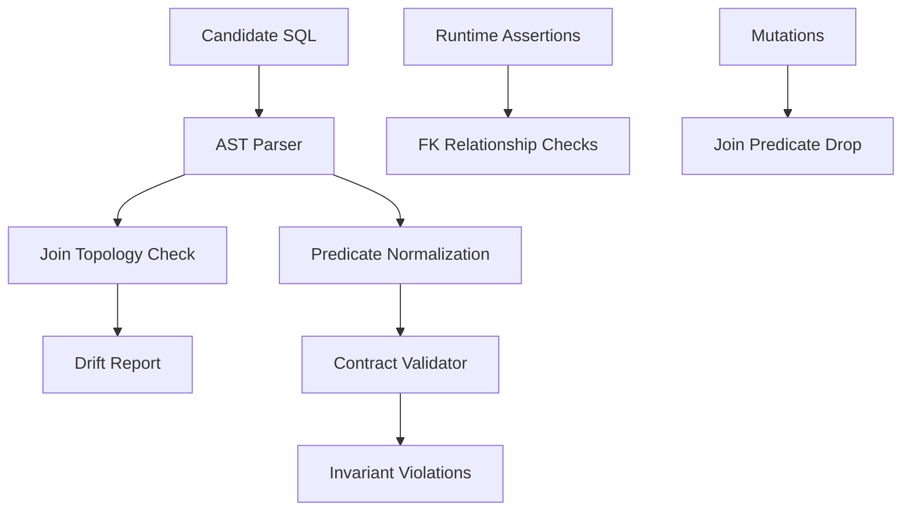
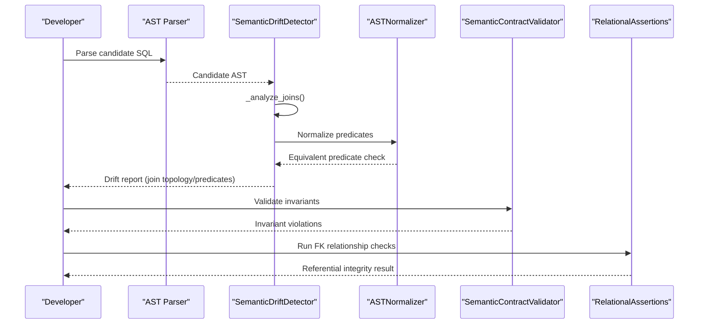
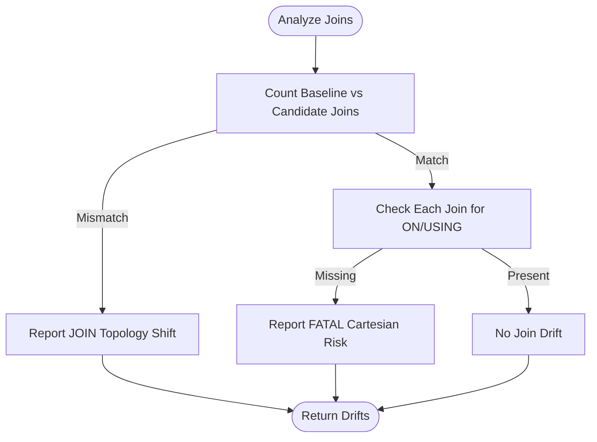
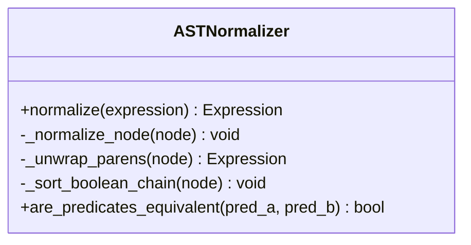
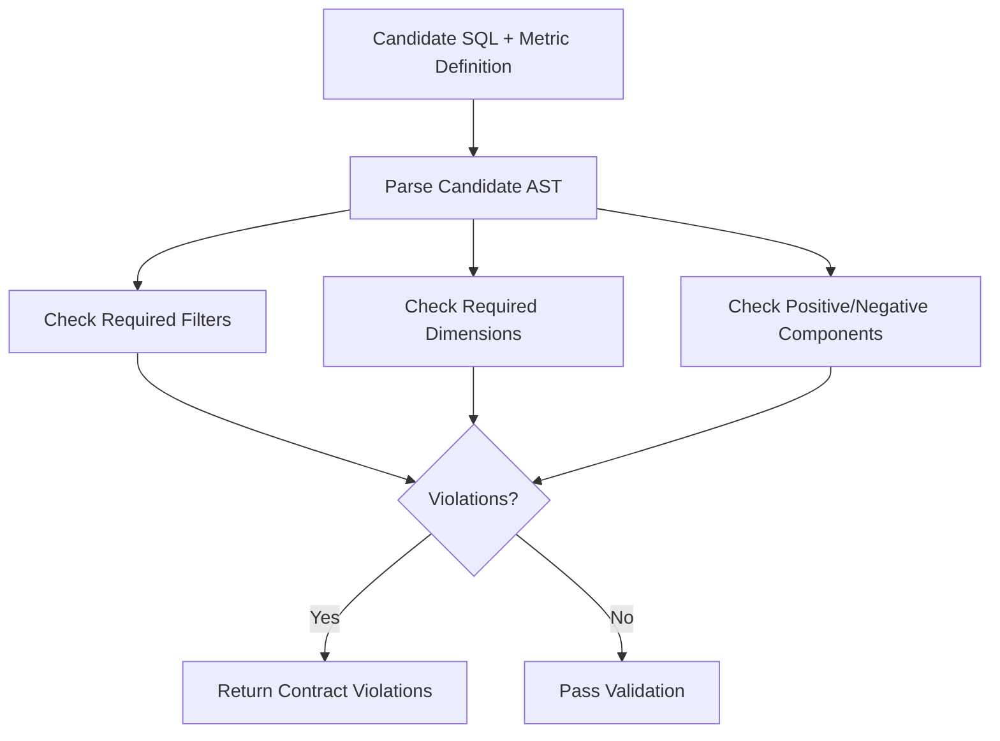
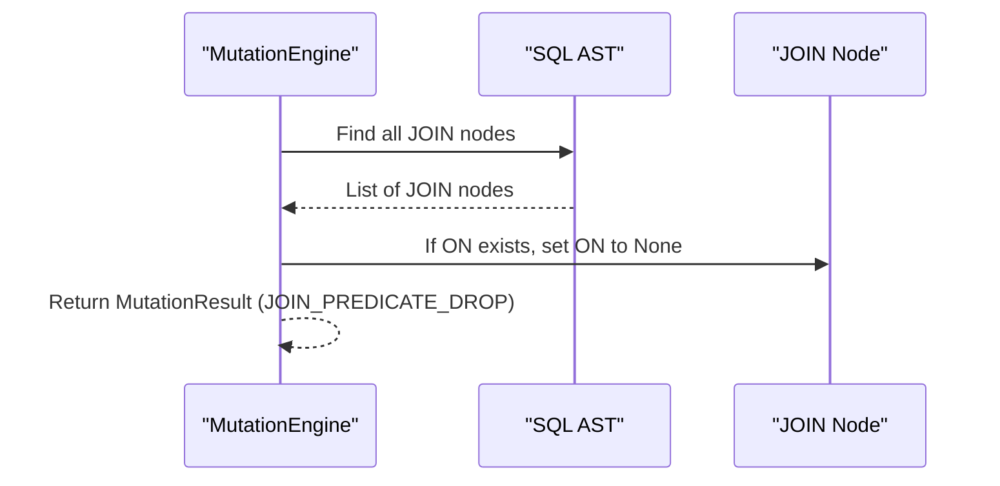
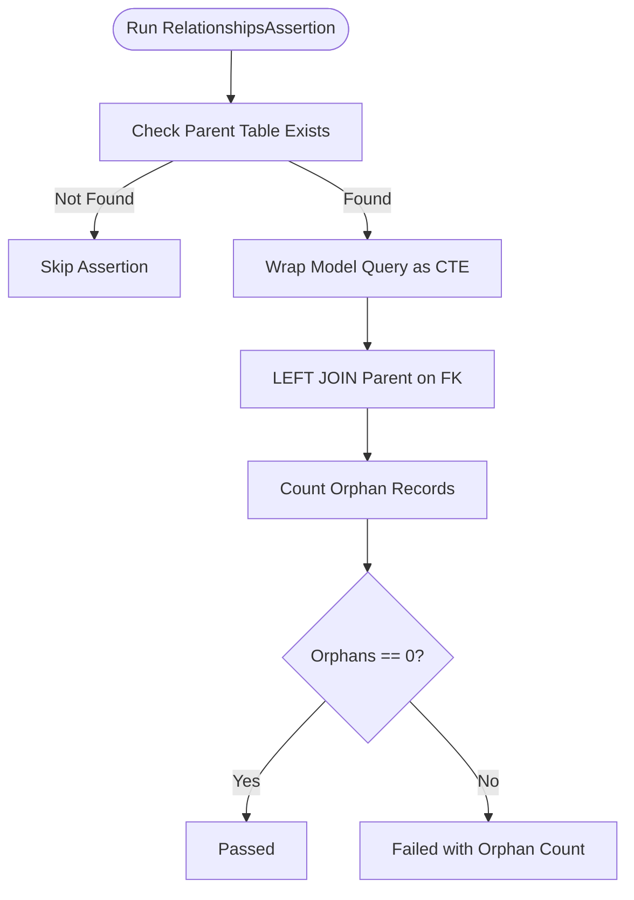
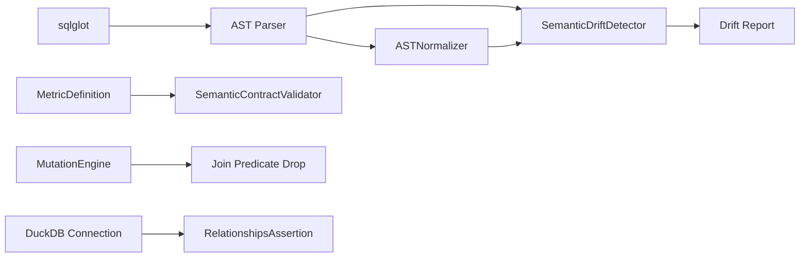

# Join Constraints

<cite>
**Referenced Files in This Document**
- [detector.py](file://semantic_reliability/testing/drift/detector.py)
- [normalizer.py](file://semantic_reliability/testing/drift/normalizer.py)
- [contracts.py](file://semantic_reliability/compiler/contracts.py)
- [schema.py](file://semantic_reliability/compiler/schema.py)
- [engine.py](file://semantic_reliability/testing/mutations/engine.py)
- [structural.py](file://semantic_reliability/assertions/structural.py)
- [dbt_adapter.py](file://semantic_reliability/adapters/dbt_adapter.py)
- [model_inventory_turnover.sql](file://benchmark_corpus/dev/inventory_turnover/model_inventory_turnover.sql)
- [contract.yaml (inventory_turnover)](file://benchmark_corpus/dev/inventory_turnover/contract.yaml)
- [model_sla_compliance_rate.sql](file://benchmark_corpus/dev/sla_compliance_rate/model_sla_compliance_rate.sql)
- [test_drift_detector.py](file://tests/test_drift_detector.py)
</cite>

## Table of Contents
1. [Introduction](#introduction)
2. [Project Structure](#project-structure)
3. [Core Components](#core-components)
4. [Architecture Overview](#architecture-overview)
5. [Detailed Component Analysis](#detailed-component-analysis)
6. [Dependency Analysis](#dependency-analysis)
7. [Performance Considerations](#performance-considerations)
8. [Troubleshooting Guide](#troubleshooting-guide)
9. [Conclusion](#conclusion)

## Introduction
This document explains how the system enforces join constraint invariants for metric queries to ensure correct table relationships and valid join conditions. It covers AST-based analysis that detects invalid join patterns, prevents cartesian products or missing joins, and ensures referential integrity between fact and dimension tables. Concrete examples from inventory turnover and SLA compliance metrics illustrate correct join implementations and best practices for defining join constraints that catch relationship violations while allowing flexible query structures. It also provides debugging strategies when join validation fails due to legitimate query variations.

## Project Structure
The join constraint enforcement spans several modules:
- AST drift detection and normalization for structural comparisons
- Contract validation against declared semantic invariants
- Mutation injection to simulate common join mistakes
- Runtime relational assertions to validate foreign key relationships
- Example metrics demonstrating correct usage

**Diagram sources**
- [detector.py:13-46](file://semantic_reliability/testing/drift/detector.py#L13-L46)
- [normalizer.py:6-93](file://semantic_reliability/testing/drift/normalizer.py#L6-L93)
- [contracts.py:26-135](file://semantic_reliability/compiler/contracts.py#L26-L135)
- [engine.py:191-205](file://semantic_reliability/testing/mutations/engine.py#L191-L205)
- [structural.py:378-496](file://semantic_reliability/assertions/structural.py#L378-L496)

**Section sources**
- [detector.py:13-46](file://semantic_reliability/testing/drift/detector.py#L13-L46)
- [normalizer.py:6-93](file://semantic_reliability/testing/drift/normalizer.py#L6-L93)
- [contracts.py:26-135](file://semantic_reliability/compiler/contracts.py#L26-L135)
- [engine.py:191-205](file://semantic_reliability/testing/mutations/engine.py#L191-L205)
- [structural.py:378-496](file://semantic_reliability/assertions/structural.py#L378-L496)

## Core Components
- Semantic Drift Detector: Parses baseline and candidate SQL into ASTs and inspects joins, predicates, grouping, and source tables to detect semantic drift.
- AST Normalizer: Canonicalizes expressions to avoid false positives from commutative or cosmetic differences.
- Contract Validator: Enforces declarative invariants such as required filters, grain dimensions, and aggregation components.
- Mutation Engine: Injects realistic join mutations (e.g., dropping ON predicates) to test robustness.
- Relational Assertions: Validates runtime referential integrity by checking foreign key relationships across models.

Key responsibilities:
- Detect missing or altered JOIN topology and predicates
- Prevent cartesian product risks by requiring explicit ON/USING clauses
- Ensure reporting grain consistency
- Validate population filters and aggregation components
- Confirm referential integrity at runtime

**Section sources**
- [detector.py:13-46](file://semantic_reliability/testing/drift/detector.py#L13-L46)
- [detector.py:133-164](file://semantic_reliability/testing/drift/detector.py#L133-L164)
- [normalizer.py:6-93](file://semantic_reliability/testing/drift/normalizer.py#L6-L93)
- [contracts.py:26-135](file://semantic_reliability/compiler/contracts.py#L26-L135)
- [engine.py:191-205](file://semantic_reliability/testing/mutations/engine.py#L191-L205)
- [structural.py:378-496](file://semantic_reliability/assertions/structural.py#L378-L496)

## Architecture Overview
The join constraint enforcement pipeline integrates static AST analysis with runtime relational checks:

**Diagram sources**
- [detector.py:13-46](file://semantic_reliability/testing/drift/detector.py#L13-L46)
- [detector.py:133-164](file://semantic_reliability/testing/drift/detector.py#L133-L164)
- [normalizer.py:6-93](file://semantic_reliability/testing/drift/normalizer.py#L6-L93)
- [contracts.py:26-135](file://semantic_reliability/compiler/contracts.py#L26-L135)
- [structural.py:378-496](file://semantic_reliability/assertions/structural.py#L378-L496)

## Detailed Component Analysis

### AST-Based Join Validation
The detector inspects JOIN nodes to ensure:
- The number of joins matches the baseline
- Every non-CROSS join has an explicit ON or USING clause
- Changes in join count trigger a high-severity drift alert
- Missing predicates are flagged as fatal due to cartesian product risk

**Diagram sources**
- [detector.py:133-164](file://semantic_reliability/testing/drift/detector.py#L133-L164)

**Section sources**
- [detector.py:133-164](file://semantic_reliability/testing/drift/detector.py#L133-L164)
- [test_drift_detector.py:74-78](file://tests/test_drift_detector.py#L74-L78)

### Predicate Normalization and Equivalence
To avoid false positives from commutative or cosmetic differences, the normalizer:
- Unwraps redundant parentheses
- Flattens and sorts AND/OR chains
- Canonicalizes aliases
- Compares normalized SQL strings for equivalence

**Diagram sources**
- [normalizer.py:6-93](file://semantic_reliability/testing/drift/normalizer.py#L6-L93)

**Section sources**
- [normalizer.py:6-93](file://semantic_reliability/testing/drift/normalizer.py#L6-L93)

### Contract Validation for Join-Related Invariants
While contracts focus on population filters, grain, and aggregation components, they complement join validation by ensuring:
- Required filters remain present in WHERE clauses
- Grouping dimensions match declared grain
- Positive/negative aggregation components are included

**Diagram sources**
- [contracts.py:26-135](file://semantic_reliability/compiler/contracts.py#L26-L135)
- [schema.py:5-37](file://semantic_reliability/compiler/schema.py#L5-L37)

**Section sources**
- [contracts.py:26-135](file://semantic_reliability/compiler/contracts.py#L26-L135)
- [schema.py:5-37](file://semantic_reliability/compiler/schema.py#L5-L37)

### Mutation Injection for Join Robustness Testing
The mutation engine simulates accidental removal of JOIN ON predicates to verify that downstream checks catch cartesian product risks.

**Diagram sources**
- [engine.py:191-205](file://semantic_reliability/testing/mutations/engine.py#L191-L205)

**Section sources**
- [engine.py:191-205](file://semantic_reliability/testing/mutations/engine.py#L191-L205)

### Runtime Referential Integrity Assertions
At runtime, the system validates foreign key relationships by:
- Checking if parent tables exist
- Wrapping the model query and joining to parent tables
- Counting orphaned child records where references do not match

**Diagram sources**
- [structural.py:378-496](file://semantic_reliability/assertions/structural.py#L378-L496)

**Section sources**
- [structural.py:378-496](file://semantic_reliability/assertions/structural.py#L378-L496)
- [dbt_adapter.py:95-103](file://semantic_reliability/adapters/dbt_adapter.py#L95-L103)

### Concrete Examples: Inventory Turnover and SLA Compliance
- Inventory Turnover: Single-table ratio calculation with population filter; no JOIN required but demonstrates correct filtering and grain.
- SLA Compliance Rate: Single-table rate calculation with population filter; no JOIN required but demonstrates correct filtering and grain.

These examples show correct query structure and can be extended with JOINs when fact-dimension relationships are introduced.

**Section sources**
- [model_inventory_turnover.sql:1-6](file://benchmark_corpus/dev/inventory_turnover/model_inventory_turnover.sql#L1-L6)
- [contract.yaml (inventory_turnover):1-10](file://benchmark_corpus/dev/inventory_turnover/contract.yaml#L1-L10)
- [model_sla_compliance_rate.sql:1-6](file://benchmark_corpus/dev/sla_compliance_rate/model_sla_compliance_rate.sql#L1-L6)

## Dependency Analysis
Join constraint enforcement depends on:
- AST parsing via sqlglot
- Drift detection logic for join topology and predicates
- Normalization utilities for predicate equivalence
- Contract validation for invariant compliance
- Mutation injection for testing resilience
- Runtime assertions for referential integrity

**Diagram sources**
- [detector.py:13-46](file://semantic_reliability/testing/drift/detector.py#L13-L46)
- [normalizer.py:6-93](file://semantic_reliability/testing/drift/normalizer.py#L6-L93)
- [contracts.py:26-135](file://semantic_reliability/compiler/contracts.py#L26-L135)
- [engine.py:191-205](file://semantic_reliability/testing/mutations/engine.py#L191-L205)
- [structural.py:378-496](file://semantic_reliability/assertions/structural.py#L378-L496)

**Section sources**
- [detector.py:13-46](file://semantic_reliability/testing/drift/detector.py#L13-L46)
- [normalizer.py:6-93](file://semantic_reliability/testing/drift/normalizer.py#L6-L93)
- [contracts.py:26-135](file://semantic_reliability/compiler/contracts.py#L26-L135)
- [engine.py:191-205](file://semantic_reliability/testing/mutations/engine.py#L191-L205)
- [structural.py:378-496](file://semantic_reliability/assertions/structural.py#L378-L496)

## Performance Considerations
- AST traversal is efficient for typical metric queries; however, large queries with many joins may increase analysis time.
- Predicate normalization avoids expensive semantic comparisons by canonicalizing boolean chains.
- Runtime FK checks execute additional joins; consider limiting scope to critical relationships or sampling data for performance.
- Mutation generation is lightweight but should be used judiciously in CI pipelines to avoid excessive runtime.

[No sources needed since this section provides general guidance]

## Troubleshooting Guide
Common issues and strategies:
- Missing JOIN predicate detected as FATAL: Add explicit ON or USING clause to prevent cartesian products.
- Join count mismatch: Verify whether new tables were added or removed; confirm intended cardinality changes.
- Predicate equivalence false positive: Use normalized comparison; ensure commutative order does not trigger alerts.
- Contract violation on required filters: Ensure required filters are present in WHERE clause exactly as declared.
- Runtime FK assertion failure: Check for orphaned records; validate upstream data quality and referential integrity.

Debugging steps:
- Inspect drift reports for specific join topology and predicate changes.
- Compare baseline and candidate ASTs using normalized predicates.
- Run mutation tests to reproduce and validate detection logic.
- Execute runtime FK assertions to identify data-level relationship violations.

**Section sources**
- [detector.py:133-164](file://semantic_reliability/testing/drift/detector.py#L133-L164)
- [normalizer.py:6-93](file://semantic_reliability/testing/drift/normalizer.py#L6-L93)
- [contracts.py:26-135](file://semantic_reliability/compiler/contracts.py#L26-L135)
- [engine.py:191-205](file://semantic_reliability/testing/mutations/engine.py#L191-L205)
- [structural.py:378-496](file://semantic_reliability/assertions/structural.py#L378-L496)

## Conclusion
The system enforces join constraint invariants through a combination of AST-based drift detection, predicate normalization, contract validation, mutation testing, and runtime referential integrity checks. This multi-layered approach prevents cartesian products, ensures proper JOIN syntax and keys, and maintains referential integrity between fact and dimension tables. By applying these techniques to metrics like inventory turnover and SLA compliance, teams can define robust join constraints that catch relationship violations while accommodating flexible query structures. Debugging strategies help resolve legitimate query variations without compromising reliability.

[No sources needed since this section summarizes without analyzing specific files]