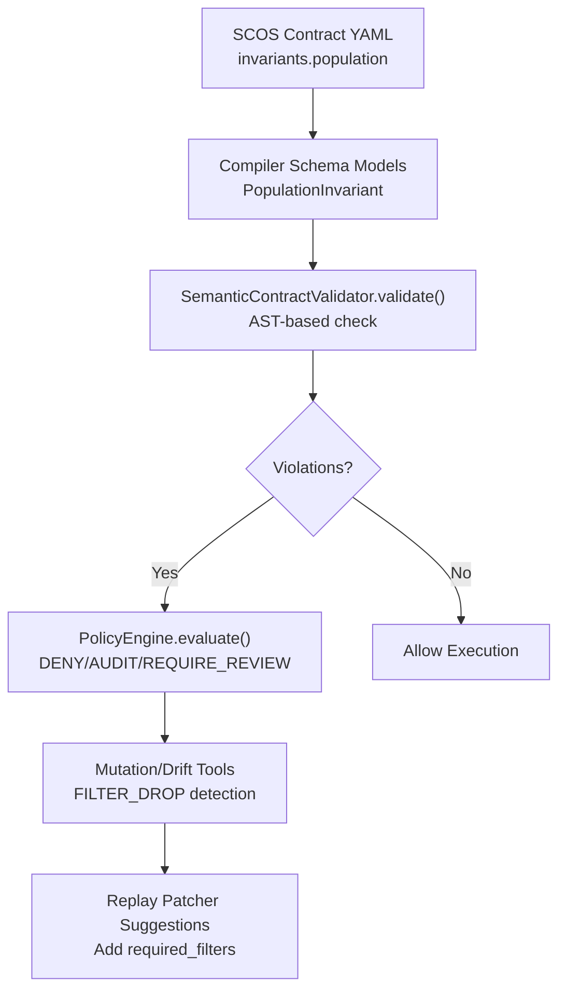
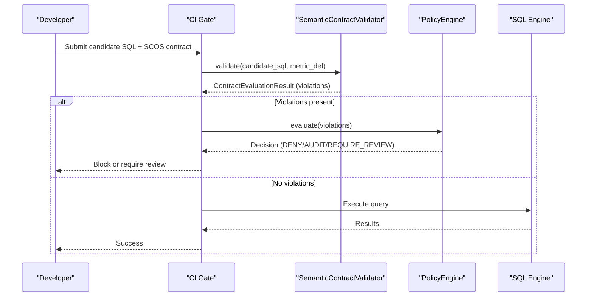
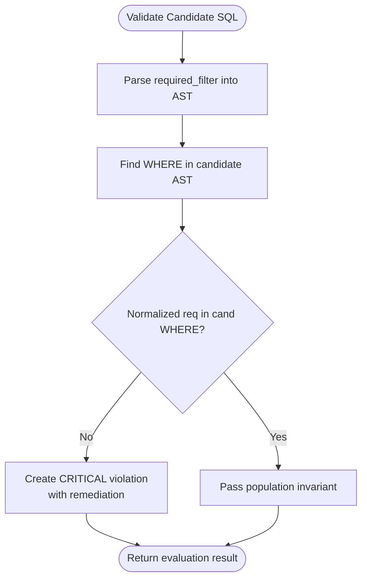
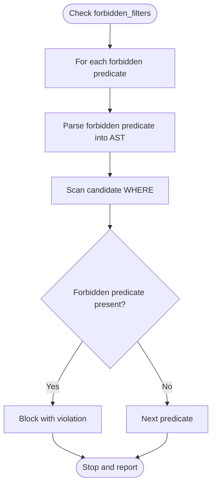
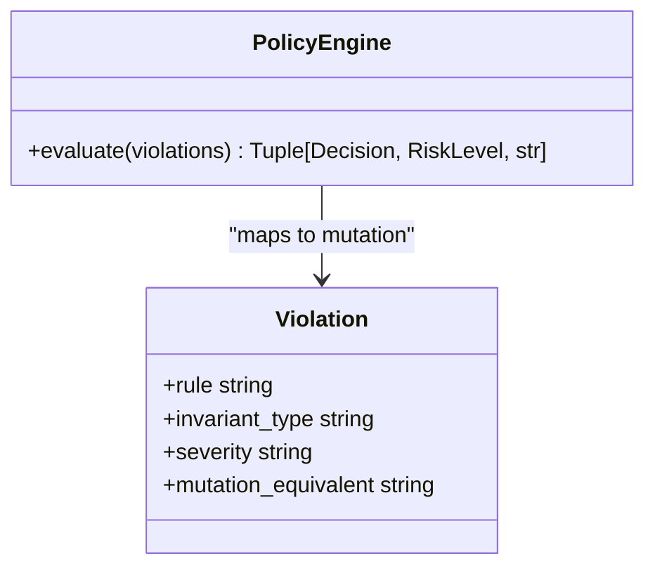
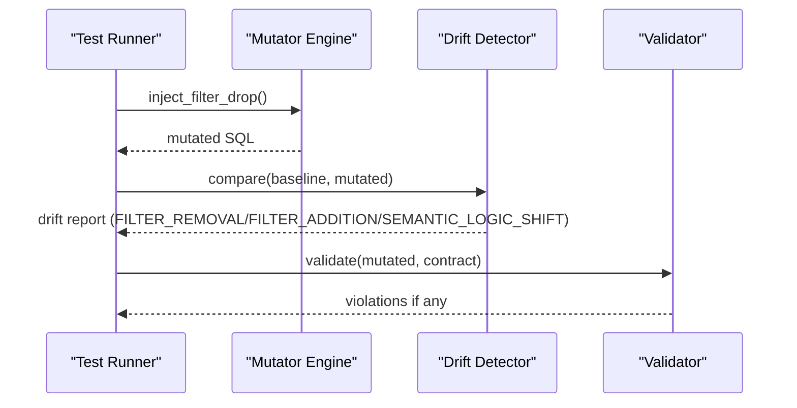
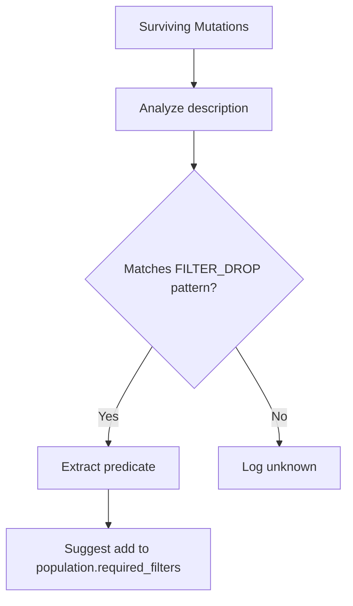
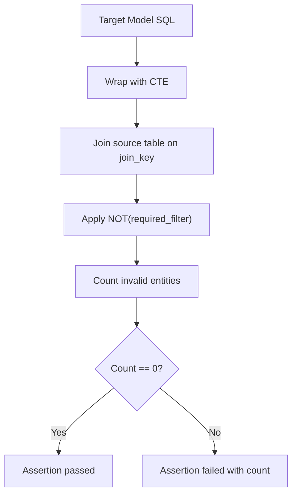
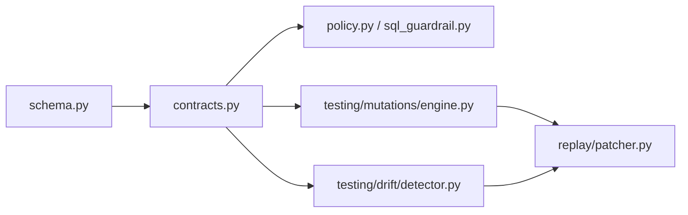

# Population Invariants

<cite>
**Referenced Files in This Document**
- [contracts.py](file://semantic_reliability/compiler/contracts.py)
- [schema.py](file://semantic_reliability/compiler/schema.py)
- [scos-v1.schema.json](file://spec/scos-v1.schema.json)
- [SCOS_V1_SPECIFICATION.md](file://spec/SCOS_V1_SPECIFICATION.md)
- [sql_guardrail.py](file://semantic_reliability/runtime/sql_guardrail.py)
- [policy.py](file://semantic_reliability/firewall/policy.py)
- [engine.py](file://semantic_reliability/testing/mutations/engine.py)
- [detector.py](file://semantic_reliability/testing/drift/detector.py)
- [patcher.py](file://semantic_reliability/replay/patcher.py)
- [contract.yaml (net_revenue)](file://benchmark_corpus/dev/net_revenue/contract.yaml)
- [contract.yaml (customer_churn_rate)](file://benchmark_corpus/dev/customer_churn_rate/contract.yaml)
- [contract.yaml (checkout_conversion_rate)](file://benchmark_corpus/dev/checkout_conversion_rate/contract.yaml)
- [semantic_assertions.yaml (net_revenue)](file://benchmark_corpus/dev/net_revenue/semantic_assertions.yaml)
- [semantic_assertions.yaml (monthly_active_users)](file://benchmark_corpus/dev/monthly_active_users/semantic_assertions.yaml)
- [semantic.py](file://semantic_reliability/assertions/semantic.py)
</cite>

## Table of Contents
1. [Introduction](#introduction)
2. [Project Structure](#project-structure)
3. [Core Components](#core-components)
4. [Architecture Overview](#architecture-overview)
5. [Detailed Component Analysis](#detailed-component-analysis)
6. [Dependency Analysis](#dependency-analysis)
7. [Performance Considerations](#performance-considerations)
8. [Troubleshooting Guide](#troubleshooting-guide)
9. [Conclusion](#conclusion)
10. [Appendices](#appendices)

## Introduction
This document explains population invariants in SCOS contracts and how they enforce data filtering semantics at the SQL AST level. It focuses on required_filters and forbidden_filters, showing how candidate queries are validated to include necessary business filters (for example, status = 'active' or is_test_account = FALSE) while excluding forbidden ones. It also provides concrete examples from the benchmark corpus, best practices for precise filter invariants, common pitfalls, and debugging techniques when validation fails.

## Project Structure
Population invariants are defined declaratively in SCOS contracts and enforced by a compiler that parses SQL into an AST and checks WHERE clause predicates against declared rules. Runtime policies gate execution based on violations, and mutation/drift tools help validate invariant coverage and suggest improvements.

**Diagram sources**
- [schema.py:5-8](file://semantic_reliability/compiler/schema.py#L5-L8)
- [contracts.py:26-65](file://semantic_reliability/compiler/contracts.py#L26-L65)
- [policy.py:32-67](file://semantic_reliability/firewall/policy.py#L32-L67)
- [engine.py:54-76](file://semantic_reliability/testing/mutations/engine.py#L54-L76)
- [patcher.py:13-29](file://semantic_reliability/replay/patcher.py#L13-L29)

**Section sources**
- [schema.py:5-8](file://semantic_reliability/compiler/schema.py#L5-L8)
- [contracts.py:26-65](file://semantic_reliability/compiler/contracts.py#L26-L65)
- [policy.py:32-67](file://semantic_reliability/firewall/policy.py#L32-L67)

## Core Components
- PopulationInvariant model defines required_filters and forbidden_filters as lists of SQL predicate strings.
- SemanticContractValidator parses candidate SQL and the required filter(s) into ASTs and checks presence in the WHERE clause.
- PolicyEngine maps violations to mutation categories and decides ALLOW, AUDIT, REQUIRE_REVIEW, or DENY.
- Mutation and drift tools simulate filter drops and detect semantic shifts in WHERE clauses.
- Replay patcher suggests adding missing required_filters based on surviving mutations.

Key implementation highlights:
- Required filter matching uses AST normalization and substring containment within the WHERE clause text.
- Forbidden filters are declared in the schema; enforcement logic should mirror required filter checks but with inverted semantics.
- Violation severity drives policy decisions; critical violations typically block execution in strict mode.

**Section sources**
- [schema.py:5-8](file://semantic_reliability/compiler/schema.py#L5-L8)
- [contracts.py:44-65](file://semantic_reliability/compiler/contracts.py#L44-L65)
- [policy.py:32-67](file://semantic_reliability/firewall/policy.py#L32-L67)
- [engine.py:54-76](file://semantic_reliability/testing/mutations/engine.py#L54-L76)
- [patcher.py:13-29](file://semantic_reliability/replay/patcher.py#L13-L29)

## Architecture Overview
The population invariant enforcement pipeline connects contract definitions to runtime governance:

**Diagram sources**
- [contracts.py:26-65](file://semantic_reliability/compiler/contracts.py#L26-L65)
- [policy.py:32-67](file://semantic_reliability/firewall/policy.py#L32-L67)

## Detailed Component Analysis

### Population Invariant Enforcement (Required Filters)
- The validator parses each required_filter into a WHERE AST and compares it against the candidate’s WHERE clause AST.
- If the normalized required predicate is not found in the candidate’s WHERE clause, a CRITICAL violation is recorded with remediation guidance.
- This mechanism ensures business filters like status = 'active' or is_test_account = FALSE cannot be accidentally omitted.

**Diagram sources**
- [contracts.py:44-65](file://semantic_reliability/compiler/contracts.py#L44-L65)

**Section sources**
- [contracts.py:44-65](file://semantic_reliability/compiler/contracts.py#L44-L65)

### Forbidden Filters Mechanism
- The schema supports forbidden_filters as a list of disallowed predicates.
- While the current validator explicitly enforces required_filters, the same pattern can be applied to forbid specific predicates (e.g., status = 'cancelled').
- Best practice: treat forbidden_filters symmetrically to required_filters—parse into AST and assert absence in candidate WHERE.

**Diagram sources**
- [scos-v1.schema.json:61-78](file://spec/scos-v1.schema.json#L61-L78)

**Section sources**
- [scos-v1.schema.json:61-78](file://spec/scos-v1.schema.json#L61-L78)

### Runtime Governance and Mutation Mapping
- Violations are mapped to mutation categories such as FILTER_DROP, enabling correlation with test mutations and drift detection.
- PolicyEngine evaluates severity and returns a decision: ALLOW, AUDIT, REQUIRE_REVIEW, or DENY depending on strict mode.

**Diagram sources**
- [policy.py:32-67](file://semantic_reliability/firewall/policy.py#L32-L67)
- [sql_guardrail.py:1-31](file://semantic_reliability/runtime/sql_guardrail.py#L1-L31)

**Section sources**
- [policy.py:32-67](file://semantic_reliability/firewall/policy.py#L32-L67)
- [sql_guardrail.py:1-31](file://semantic_reliability/runtime/sql_guardrail.py#L1-L31)

### Mutation and Drift Detection for WHERE Clauses
- Mutators simulate dropping AND conjuncts or entire WHERE clauses to test robustness of invariants.
- Drift detector compares baseline and candidate WHERE clauses to identify removal, addition, or modification of filters.

**Diagram sources**
- [engine.py:54-76](file://semantic_reliability/testing/mutations/engine.py#L54-L76)
- [detector.py:48-85](file://semantic_reliability/testing/drift/detector.py#L48-L85)
- [contracts.py:44-65](file://semantic_reliability/compiler/contracts.py#L44-L65)

**Section sources**
- [engine.py:54-76](file://semantic_reliability/testing/mutations/engine.py#L54-L76)
- [detector.py:48-85](file://semantic_reliability/testing/drift/detector.py#L48-L85)

### Replay Patcher Suggestions
- When mutations survive without triggering invariants, the replay patcher analyzes descriptions to suggest adding required_filters to contracts.

**Diagram sources**
- [patcher.py:13-29](file://semantic_reliability/replay/patcher.py#L13-L29)

**Section sources**
- [patcher.py:13-29](file://semantic_reliability/replay/patcher.py#L13-L29)

### Data-Level Assertions for Population
- Runtime assertions verify that no source records violating required filters leak into output by joining model results back to source tables.

**Diagram sources**
- [semantic.py:19-54](file://semantic_reliability/assertions/semantic.py#L19-L54)

**Section sources**
- [semantic.py:19-54](file://semantic_reliability/assertions/semantic.py#L19-L54)

## Dependency Analysis
- Contracts depend on schema models to define invariants.
- Validator depends on SQL parsing and AST comparison utilities.
- Policy engine depends on violation types and severity to decide execution outcomes.
- Mutation and drift tools depend on AST manipulation to simulate and detect changes.
- Replay patcher depends on mutation outputs to propose contract updates.

**Diagram sources**
- [schema.py:5-8](file://semantic_reliability/compiler/schema.py#L5-L8)
- [contracts.py:26-65](file://semantic_reliability/compiler/contracts.py#L26-L65)
- [policy.py:32-67](file://semantic_reliability/firewall/policy.py#L32-L67)
- [engine.py:54-76](file://semantic_reliability/testing/mutations/engine.py#L54-L76)
- [detector.py:48-85](file://semantic_reliability/testing/drift/detector.py#L48-L85)
- [patcher.py:13-29](file://semantic_reliability/replay/patcher.py#L13-L29)

**Section sources**
- [schema.py:5-8](file://semantic_reliability/compiler/schema.py#L5-L8)
- [contracts.py:26-65](file://semantic_reliability/compiler/contracts.py#L26-L65)
- [policy.py:32-67](file://semantic_reliability/firewall/policy.py#L32-L67)

## Performance Considerations
- AST parsing and normalization occur per candidate SQL; keep required_filters concise to minimize parsing overhead.
- Substring containment checks on normalized WHERE text are efficient but can match substrings unintentionally; prefer precise predicates.
- Avoid overly broad forbidden_filters that may cause false positives; scope them to exact known bad patterns.
- Batch validations where possible to reduce repeated parsing costs.

## Troubleshooting Guide
Common issues and remedies:
- Missing required filter:
  - Symptom: CRITICAL violation indicating candidate SQL does not include required business filter.
  - Fix: Add the required predicate to the WHERE clause exactly as declared in the contract.
  - Example references:
    - [contract.yaml (net_revenue):5-8](file://benchmark_corpus/dev/net_revenue/contract.yaml#L5-L8)
    - [contract.yaml (customer_churn_rate):4-7](file://benchmark_corpus/dev/customer_churn_rate/contract.yaml#L4-L7)
    - [contract.yaml (checkout_conversion_rate):4-7](file://benchmark_corpus/dev/checkout_conversion_rate/contract.yaml#L4-L7)
- False positive matches:
  - Cause: Normalized substring containment may match unintended expressions.
  - Fix: Use more specific predicates or wrap conditions to avoid accidental matches.
- Forbidden filter still present:
  - Ensure forbidden_filters are enforced similarly to required_filters; parse and assert absence in WHERE.
- Policy blocking execution:
  - Check violation severity; critical violations trigger DENY in strict mode.
  - Review PolicyEngine decision and adjust contract or query accordingly.
- Mutation survives without detection:
  - Use replay patcher to analyze surviving mutations and add suggested required_filters.
  - Validate with mutation tests to ensure coverage.

Debugging steps:
- Inspect ContractEvaluationResult.violations for detailed messages and remediation hints.
- Run drift detector to compare baseline and candidate WHERE clauses and identify modifications.
- Use mutator to reproduce suspected filter drops and confirm invariant coverage.
- Leverage runtime assertions to catch data-level leaks even if AST checks pass.

**Section sources**
- [contracts.py:44-65](file://semantic_reliability/compiler/contracts.py#L44-L65)
- [policy.py:32-67](file://semantic_reliability/firewall/policy.py#L32-L67)
- [detector.py:48-85](file://semantic_reliability/testing/drift/detector.py#L48-L85)
- [engine.py:54-76](file://semantic_reliability/testing/mutations/engine.py#L54-L76)
- [patcher.py:13-29](file://semantic_reliability/replay/patcher.py#L13-L29)
- [semantic.py:19-54](file://semantic_reliability/assertions/semantic.py#L19-L54)

## Conclusion
Population invariants provide deterministic, AST-level guarantees that essential business filters are present and forbidden ones are absent in analytical queries. By combining declarative SCOS contracts, AST-based validation, runtime governance, and mutation-driven testing, teams can prevent semantic drift and maintain metric integrity across code changes. Following best practices for precise filter definitions and leveraging debugging tools ensures robust protection against both accidental omissions and intentional deviations.

## Appendices

### Concrete Examples from Benchmark Corpus
- Net revenue requires active transactions and NA region filters; aggregation includes invoice minus refund components.
  - References:
    - [contract.yaml (net_revenue):1-18](file://benchmark_corpus/dev/net_revenue/contract.yaml#L1-L18)
    - [semantic_assertions.yaml (net_revenue):1-18](file://benchmark_corpus/dev/net_revenue/semantic_assertions.yaml#L1-L18)
- Customer churn rate excludes trial subscriptions.
  - Reference:
    - [contract.yaml (customer_churn_rate):1-11](file://benchmark_corpus/dev/customer_churn_rate/contract.yaml#L1-L11)
- Checkout conversion rate excludes internal IP events.
  - Reference:
    - [contract.yaml (checkout_conversion_rate):1-11](file://benchmark_corpus/dev/checkout_conversion_rate/contract.yaml#L1-L11)
- Monthly active users exclude bot logins via runtime assertion.
  - Reference:
    - [semantic_assertions.yaml (monthly_active_users):1-14](file://benchmark_corpus/dev/monthly_active_users/semantic_assertions.yaml#L1-L14)

**Section sources**
- [contract.yaml (net_revenue):1-18](file://benchmark_corpus/dev/net_revenue/contract.yaml#L1-L18)
- [semantic_assertions.yaml (net_revenue):1-18](file://benchmark_corpus/dev/net_revenue/semantic_assertions.yaml#L1-L18)
- [contract.yaml (customer_churn_rate):1-11](file://benchmark_corpus/dev/customer_churn_rate/contract.yaml#L1-L11)
- [contract.yaml (checkout_conversion_rate):1-11](file://benchmark_corpus/dev/checkout_conversion_rate/contract.yaml#L1-L11)
- [semantic_assertions.yaml (monthly_active_users):1-14](file://benchmark_corpus/dev/monthly_active_users/semantic_assertions.yaml#L1-L14)

### Best Practices for Precise Filter Invariants
- Define minimal, unambiguous predicates that capture business intent (e.g., status = 'active', is_test_account = FALSE).
- Prefer explicit column comparisons over loose substring matches to avoid false positives.
- Group related filters logically and document their purpose in contract metadata.
- Use forbidden_filters to explicitly ban known bad patterns (e.g., status = 'cancelled') and enforce symmetry with required_filters.
- Validate with mutation tests to ensure invariants catch realistic drift scenarios.

### Common Pitfalls and How to Avoid Them
- Overly broad predicates causing false positives: refine predicates to exact matches.
- Missing forbidden_filters enforcement: implement AST-based absence checks mirroring required_filters.
- Relying solely on AST checks without runtime assertions: complement with data-level joins to catch leaks.
- Ignoring dialect differences: ensure consistent parsing using the correct dialect setting.

[No sources needed since this section provides general guidance]