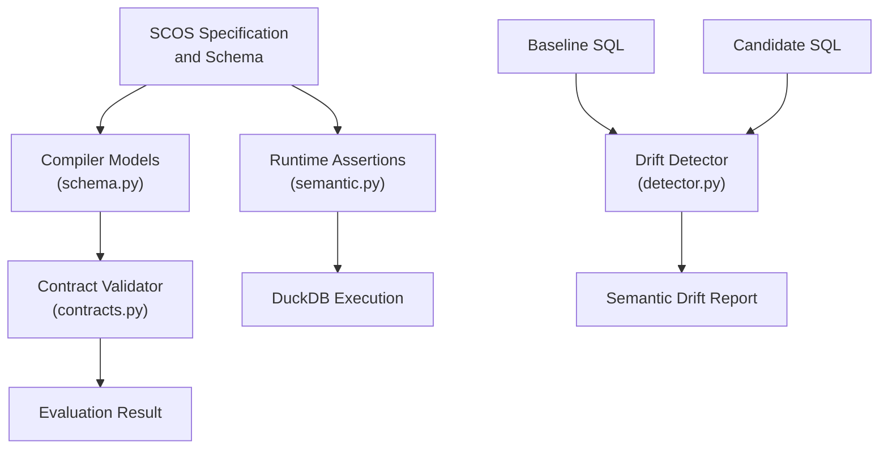
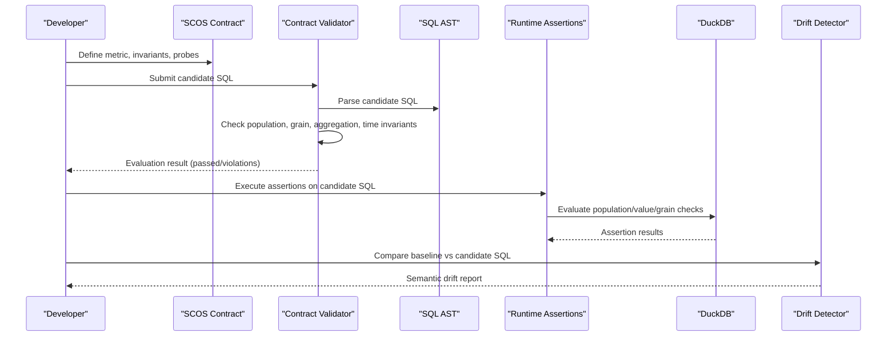
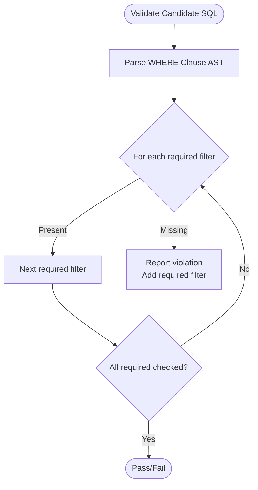
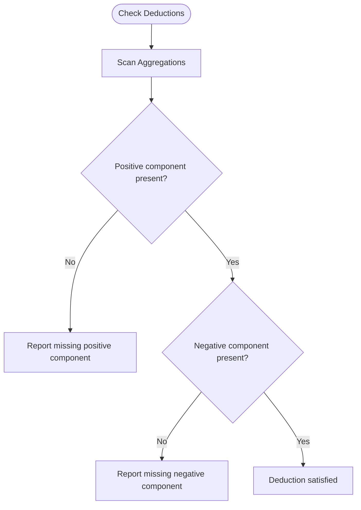
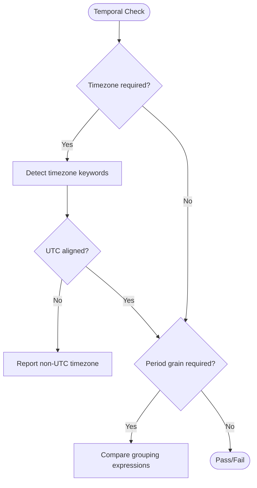
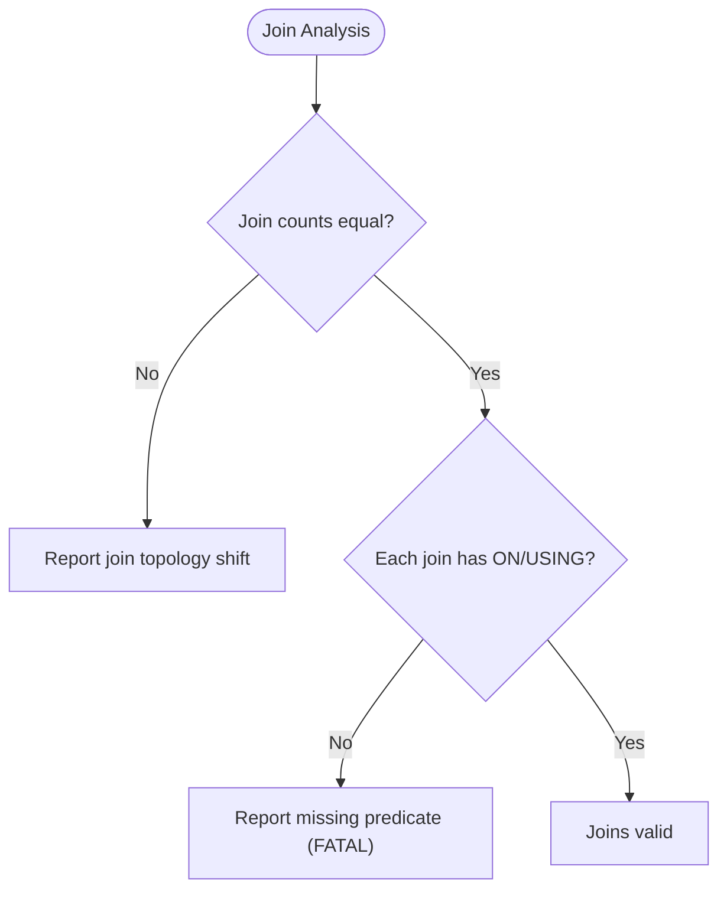
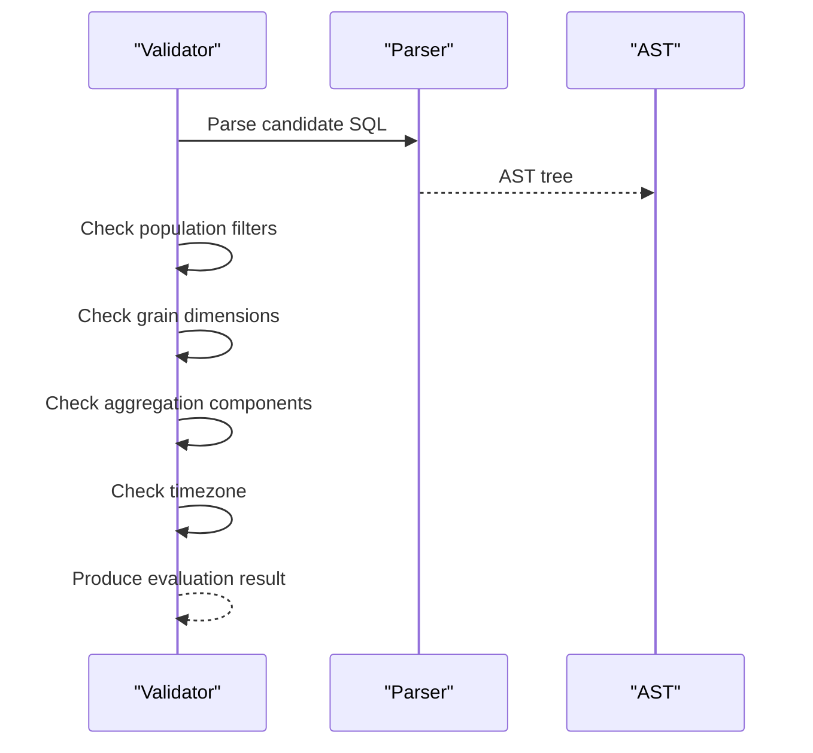
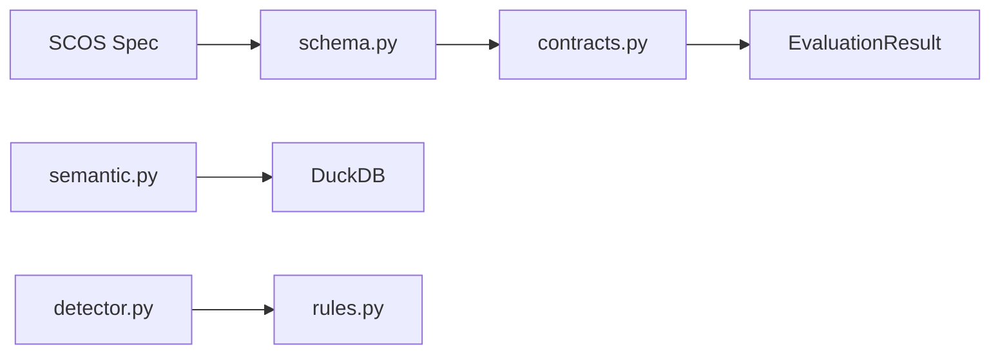

# Semantic Invariants

<cite>
**Referenced Files in This Document**
- [SCOS_V1_SPECIFICATION.md](file://spec/SCOS_V1_SPECIFICATION.md)
- [scos-v1.schema.json](file://spec/scos-v1.schema.json)
- [contracts.py](file://semantic_reliability/compiler/contracts.py)
- [schema.py](file://semantic_reliability/compiler/schema.py)
- [semantic.py](file://semantic_reliability/assertions/semantic.py)
- [base.py](file://semantic_reliability/assertions/base.py)
- [detector.py](file://semantic_reliability/testing/drift/detector.py)
- [rules.py](file://semantic_reliability/testing/drift/rules.py)
- [contract.yaml (net_revenue)](file://benchmark_corpus/dev/net_revenue/contract.yaml)
- [semantic_assertions.yaml (net_revenue)](file://benchmark_corpus/dev/net_revenue/semantic_assertions.yaml)
- [contract.yaml (monthly_active_users)](file://benchmark_corpus/dev/monthly_active_users/contract.yaml)
- [semantic_assertions.yaml (monthly_active_users)](file://benchmark_corpus/dev/monthly_active_users/semantic_assertions.yaml)
- [contract.yaml (checkout_conversion_rate)](file://benchmark_corpus/dev/checkout_conversion_rate/contract.yaml)
- [semantic_assertions.yaml (checkout_conversion_rate)](file://benchmark_corpus/dev/checkout_conversion_rate/semantic_assertions.yaml)
- [contract.yaml (inventory_turnover)](file://benchmark_corpus/dev/inventory_turnover/contract.yaml)
- [semantic_assertions.yaml (inventory_turnover)](file://benchmark_corpus/dev/inventory_turnover/semantic_assertions.yaml)
</cite>

## Table of Contents
1. Introduction
2. Project Structure
3. Core Components
4. Architecture Overview
5. Detailed Component Analysis
6. Dependency Analysis
7. Performance Considerations
8. Troubleshooting Guide
9. Conclusion
10. Appendices

## Introduction
This document explains semantic invariants in SCOS contracts and how AST-based analysis validates candidate SQL queries against them. It covers population invariants (required_filters, forbidden_filters), deduction rules (required_subtractions), temporal constraints (timezone, period_grain), and join constraints. It also provides concrete examples from the benchmark corpus, best practices for precise invariant definitions, common pitfalls, and debugging techniques when invariants fail to match expected behavior.

## Project Structure
The repository implements SCOS v1.0.0 with:
- A declarative specification defining identity, canonical SQL, semantic invariants, and statistical probes.
- A compiler that parses SCOS contracts into typed models and enforces invariants via AST analysis.
- Runtime assertions executed in DuckDB to validate data-level semantics.
- Drift detection that compares baseline and candidate SQL ASTs to detect semantic changes.

**Diagram sources**
- [SCOS_V1_SPECIFICATION.md:31-113](file://spec/SCOS_V1_SPECIFICATION.md#L31-L113)
- [schema.py:5-36](file://semantic_reliability/compiler/schema.py#L5-L36)
- [contracts.py:26-134](file://semantic_reliability/compiler/contracts.py#L26-L134)
- [semantic.py:8-167](file://semantic_reliability/assertions/semantic.py#L8-L167)
- [detector.py:35-246](file://semantic_reliability/testing/drift/detector.py#L35-L246)

**Section sources**
- [SCOS_V1_SPECIFICATION.md:31-113](file://spec/SCOS_V1_SPECIFICATION.md#L31-L113)
- [schema.py:5-36](file://semantic_reliability/compiler/schema.py#L5-L36)

## Core Components
- Contract model types define invariants: population, grain, aggregation, units, time, and probes.
- The contract validator parses candidate SQL into an AST and checks declared invariants.
- Runtime assertions execute SQL in DuckDB to verify population filters, metric values, and grain uniqueness.
- Drift detection compares baseline and candidate ASTs to identify semantic drift across WHERE, GROUP BY, JOINs, HAVING, null handling, and source tables.

Key responsibilities:
- Population invariants enforce required and forbidden filters in WHERE.
- Deduction invariants ensure negative components are subtracted in net calculations.
- Temporal invariants constrain timezone usage and period grain.
- Join constraints prevent missing predicates or topology changes.

**Section sources**
- [schema.py:5-36](file://semantic_reliability/compiler/schema.py#L5-L36)
- [contracts.py:26-134](file://semantic_reliability/compiler/contracts.py#L26-L134)
- [semantic.py:8-167](file://semantic_reliability/assertions/semantic.py#L8-L167)
- [detector.py:35-246](file://semantic_reliability/testing/drift/detector.py#L35-L246)

## Architecture Overview
The validation pipeline combines static AST checks with runtime assertions and drift detection.

**Diagram sources**
- [contracts.py:26-134](file://semantic_reliability/compiler/contracts.py#L26-L134)
- [semantic.py:8-167](file://semantic_reliability/assertions/semantic.py#L8-L167)
- [detector.py:35-246](file://semantic_reliability/testing/drift/detector.py#L35-L246)

## Detailed Component Analysis

### Population Invariants: required_filters and forbidden_filters
- Purpose: Ensure business filters are present and disallowed filters are absent in WHERE clauses.
- Implementation:
  - Required filters: parse each filter into a WHERE AST node and check presence in candidate WHERE.
  - Forbidden filters: should be enforced similarly; schema supports forbidden_filters even if current validator focuses on required filters.
- Example from benchmark:
  - Net revenue requires active status and region filters.
  - Monthly active users require active status and bot exclusion.
  - Checkout conversion rate excludes internal IPs.

**Diagram sources**
- [contracts.py:44-65](file://semantic_reliability/compiler/contracts.py#L44-L65)
- [schema.py:5-8](file://semantic_reliability/compiler/schema.py#L5-L8)

**Section sources**
- [contracts.py:44-65](file://semantic_reliability/compiler/contracts.py#L44-L65)
- [schema.py:5-8](file://semantic_reliability/compiler/schema.py#L5-L8)
- [contract.yaml (net_revenue):4-13](file://benchmark_corpus/dev/net_revenue/contract.yaml#L4-L13)
- [contract.yaml (monthly_active_users):4-8](file://benchmark_corpus/dev/monthly_active_users/contract.yaml#L4-L8)
- [contract.yaml (checkout_conversion_rate):4-7](file://benchmark_corpus/dev/checkout_conversion_rate/contract.yaml#L4-L7)

### Deduction Invariants: required_subtractions
- Purpose: Ensure negative components are subtracted in net calculations (e.g., refunds).
- Implementation:
  - Aggregation invariants specify positive and negative components; validator checks presence in SQL text.
  - For stricter enforcement, compare AST expressions inside aggregations to confirm subtraction semantics.
- Example from benchmark:
  - Net revenue subtracts refund amounts from invoice amounts.

**Diagram sources**
- [contracts.py:92-113](file://semantic_reliability/compiler/contracts.py#L92-L113)
- [schema.py:15-18](file://semantic_reliability/compiler/schema.py#L15-L18)

**Section sources**
- [contracts.py:92-113](file://semantic_reliability/compiler/contracts.py#L92-L113)
- [schema.py:15-18](file://semantic_reliability/compiler/schema.py#L15-L18)
- [contract.yaml (net_revenue):9-13](file://benchmark_corpus/dev/net_revenue/contract.yaml#L9-L13)

### Temporal Invariants: timezone and period_grain
- Purpose: Enforce timezone alignment and period grain for time-based metrics.
- Implementation:
  - Timezone invariant checks for non-UTC conversions when UTC is required.
  - Period grain can be declared; additional checks may normalize and compare grouping expressions.
- Example from benchmark:
  - Net revenue uses month truncation for reporting_month.

**Diagram sources**
- [contracts.py:115-127](file://semantic_reliability/compiler/contracts.py#L115-L127)
- [schema.py:26-28](file://semantic_reliability/compiler/schema.py#L26-L28)

**Section sources**
- [contracts.py:115-127](file://semantic_reliability/compiler/contracts.py#L115-L127)
- [schema.py:26-28](file://semantic_reliability/compiler/schema.py#L26-L28)
- [contract.yaml (net_revenue):14-17](file://benchmark_corpus/dev/net_revenue/contract.yaml#L14-L17)

### Join Constraints
- Purpose: Prevent missing join predicates, topology changes, and Cartesian explosions.
- Implementation:
  - Drift detector compares baseline and candidate joins, flags missing ON/USING clauses, and detects join count changes.
- Example scenario:
  - Removing an ON clause triggers a fatal drift due to potential fan-out and duplicate counting.

**Diagram sources**
- [detector.py:134-164](file://semantic_reliability/testing/drift/detector.py#L134-L164)
- [rules.py:15-28](file://semantic_reliability/testing/drift/rules.py#L15-L28)

**Section sources**
- [detector.py:134-164](file://semantic_reliability/testing/drift/detector.py#L134-L164)
- [rules.py:15-28](file://semantic_reliability/testing/drift/rules.py#L15-L28)

### AST-Based Validation Flow
The validator parses candidate SQL into an AST and applies invariant checks:
- Population: required filters presence in WHERE.
- Grain: required dimensions in GROUP BY.
- Aggregation: positive/negative components presence.
- Time: timezone alignment.

**Diagram sources**
- [contracts.py:26-134](file://semantic_reliability/compiler/contracts.py#L26-L134)

**Section sources**
- [contracts.py:26-134](file://semantic_reliability/compiler/contracts.py#L26-L134)

### Concrete Examples from Benchmark Corpus
- Net revenue:
  - Requires active status and region filters; subtracts refunds; aggregates by customer and month.
  - Runtime assertions enforce not-null columns, required population filters, and metric value bounds.
- Monthly active users:
  - Requires active status and bot exclusion; counts distinct users per month.
  - Runtime assertions enforce not-null columns, required population filters, and metric value bounds.
- Checkout conversion rate:
  - Excludes internal IPs; computes ratio of completed checkouts to sessions.
  - Runtime assertions enforce not-null column and value bounds between 0 and 1.
- Inventory turnover:
  - Excludes obsolete items; computes COGS over stock value ratio per warehouse.
  - Runtime assertions enforce not-null columns and minimum ratio.

**Section sources**
- [contract.yaml (net_revenue):1-19](file://benchmark_corpus/dev/net_revenue/contract.yaml#L1-L19)
- [semantic_assertions.yaml (net_revenue):1-18](file://benchmark_corpus/dev/net_revenue/semantic_assertions.yaml#L1-L18)
- [contract.yaml (monthly_active_users):1-13](file://benchmark_corpus/dev/monthly_active_users/contract.yaml#L1-L13)
- [semantic_assertions.yaml (monthly_active_users):1-14](file://benchmark_corpus/dev/monthly_active_users/semantic_assertions.yaml#L1-L14)
- [contract.yaml (checkout_conversion_rate):1-11](file://benchmark_corpus/dev/checkout_conversion_rate/contract.yaml#L1-L11)
- [semantic_assertions.yaml (checkout_conversion_rate):1-10](file://benchmark_corpus/dev/checkout_conversion_rate/semantic_assertions.yaml#L1-L10)
- [contract.yaml (inventory_turnover):1-11](file://benchmark_corpus/dev/inventory_turnover/contract.yaml#L1-L11)
- [semantic_assertions.yaml (inventory_turnover):1-10](file://benchmark_corpus/dev/inventory_turnover/semantic_assertions.yaml#L1-L10)

## Dependency Analysis
Components interact through well-defined interfaces:
- Contracts depend on schema models to parse invariants.
- Validator depends on sqlglot AST parsing and dialect configuration.
- Assertions depend on DuckDB execution for runtime checks.
- Drift detection depends on AST comparison utilities and rule enums.

**Diagram sources**
- [schema.py:5-36](file://semantic_reliability/compiler/schema.py#L5-L36)
- [contracts.py:26-134](file://semantic_reliability/compiler/contracts.py#L26-L134)
- [semantic.py:8-167](file://semantic_reliability/assertions/semantic.py#L8-L167)
- [detector.py:35-246](file://semantic_reliability/testing/drift/detector.py#L35-L246)
- [rules.py:1-41](file://semantic_reliability/testing/drift/rules.py#L1-L41)

**Section sources**
- [schema.py:5-36](file://semantic_reliability/compiler/schema.py#L5-L36)
- [contracts.py:26-134](file://semantic_reliability/compiler/contracts.py#L26-L134)
- [semantic.py:8-167](file://semantic_reliability/assertions/semantic.py#L8-L167)
- [detector.py:35-246](file://semantic_reliability/testing/drift/detector.py#L35-L246)
- [rules.py:1-41](file://semantic_reliability/testing/drift/rules.py#L1-L41)

## Performance Considerations
- AST parsing is lightweight but repeated parsing can add overhead; cache parsed ASTs where possible.
- String normalization for dimension matching reduces false negatives but may miss semantic equivalence; prefer AST-based comparisons for complex expressions.
- Runtime assertions execute full queries; limit scope and use indexes to reduce execution time.
- Drift detection scans multiple AST nodes; optimize by early exits on critical drifts.

[No sources needed since this section provides general guidance]

## Troubleshooting Guide
Common issues and remedies:
- Missing required filters: Add explicit AND conditions in WHERE; ensure filter syntax matches dialect.
- Forbidden filters present: Remove disallowed predicates or refactor logic to avoid them.
- Deduction mismatches: Confirm negative components are subtracted; verify CASE expressions and arithmetic operands.
- Timezone drift: Align timestamps to UTC; remove non-UTC conversions.
- Grain drift: Restore required GROUP BY dimensions; avoid over-aggregation unless permitted.
- Join predicate loss: Re-add ON/USING clauses; verify join cardinality and avoid Cartesian products.
- Runtime assertion failures: Inspect failure_reason for exact violations; adjust data or filters accordingly.

Debugging steps:
- Use evaluation results to identify violated invariants and remediation hints.
- Run drift detection to pinpoint semantic differences between baseline and candidate SQL.
- Validate assertions locally with DuckDB to reproduce failures quickly.

**Section sources**
- [contracts.py:44-127](file://semantic_reliability/compiler/contracts.py#L44-L127)
- [semantic.py:19-167](file://semantic_reliability/assertions/semantic.py#L19-L167)
- [detector.py:49-246](file://semantic_reliability/testing/drift/detector.py#L49-L246)

## Conclusion
SCOS contracts provide a robust framework for enforcing semantic invariants through AST-based validation and runtime assertions. By precisely defining population, deduction, temporal, and join constraints, teams can catch semantic drift early while minimizing false positives. Combining static checks with runtime observability ensures metrics remain reliable across code changes and data evolution.

[No sources needed since this section summarizes without analyzing specific files]

## Appendices

### Best Practices for Writing Precise Invariants
- Be explicit about required filters; include all business-critical conditions.
- Declare forbidden filters to prevent accidental inclusion of excluded entities.
- Specify positive and negative components for net metrics to ensure correct deductions.
- Enforce timezone alignment to avoid boundary drift in time-based aggregations.
- Define reporting grain clearly to maintain dimensional consistency.
- Avoid overly broad string matches; prefer AST-aware checks for complex expressions.

[No sources needed since this section provides general guidance]

### Common Pitfalls
- Relying solely on substring matches can miss semantic equivalence or produce false positives.
- Omitting required GROUP BY dimensions leads to grain drift.
- Dropping join predicates causes Cartesian explosions and inflated metrics.
- Using non-UTC timezones introduces silent boundary shifts.

[No sources needed since this section provides general guidance]