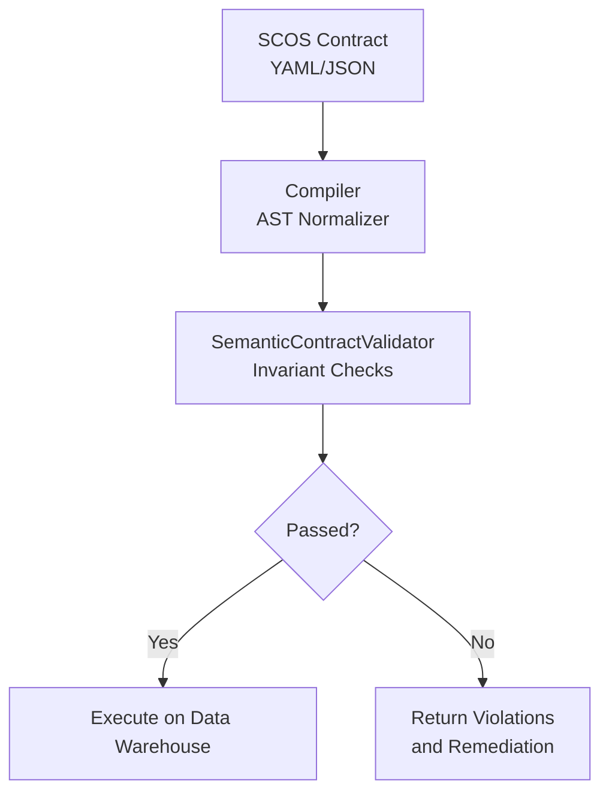
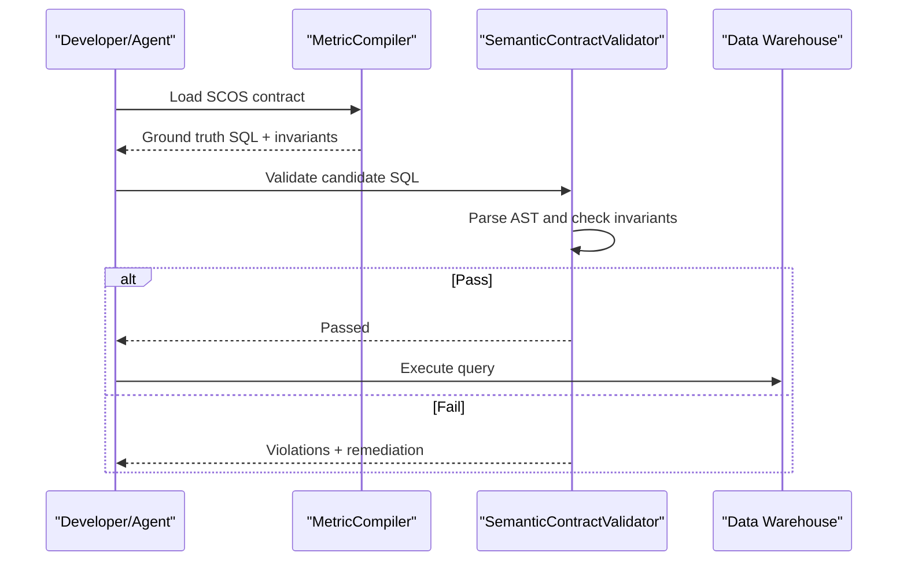
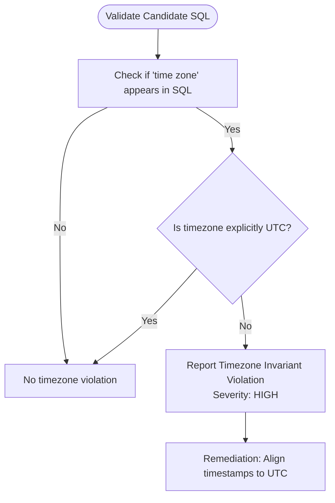
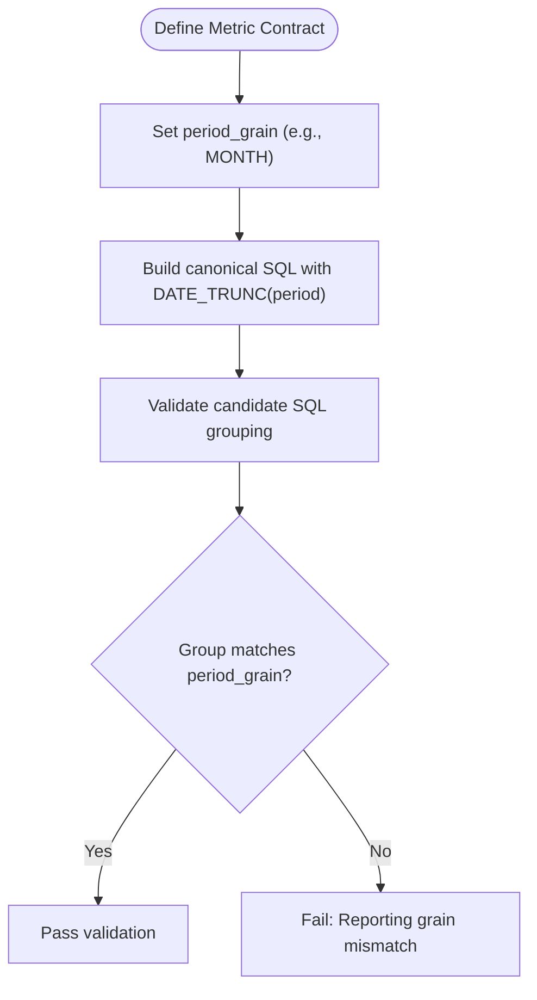
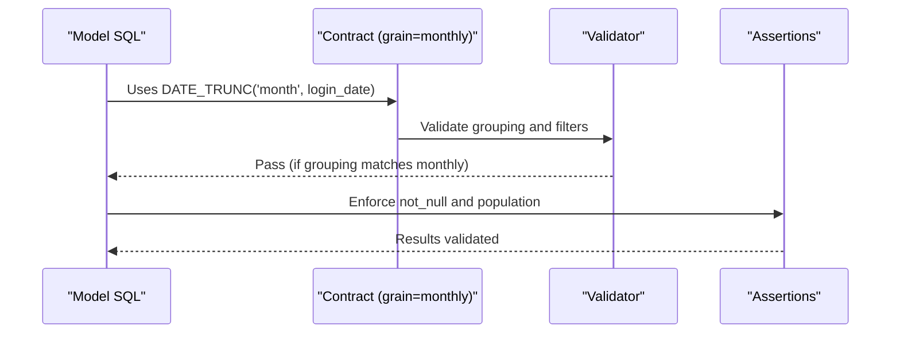
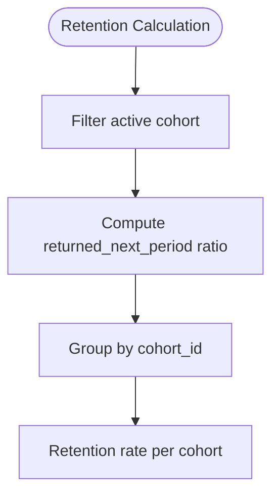
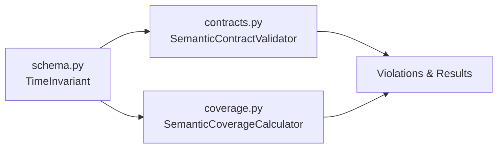

# Temporal Invariants

<cite>
**Referenced Files in This Document**
- [README.md](file://README.md)
- [SCOS_V1_SPECIFICATION.md](file://spec/SCOS_V1_SPECIFICATION.md)
- [scos-v1.schema.json](file://spec/scos-v1.schema.json)
- [schema.py](file://semantic_reliability/compiler/schema.py)
- [contracts.py](file://semantic_reliability/compiler/contracts.py)
- [coverage.py](file://semantic_reliability/compiler/coverage.py)
- [contract.yaml (monthly_active_users)](file://benchmark_corpus/dev/monthly_active_users/contract.yaml)
- [model_monthly_active_users.sql](file://benchmark_corpus/dev/monthly_active_users/model_monthly_active_users.sql)
- [semantic_assertions.yaml (monthly_active_users)](file://benchmark_corpus/dev/monthly_active_users/semantic_assertions.yaml)
- [contract.yaml (customer_retention_rate)](file://benchmark_corpus/dev/customer_retention_rate/contract.yaml)
- [model_customer_retention_rate.sql](file://benchmark_corpus/dev/customer_retention_rate/model_customer_retention_rate.sql)
- [monthly_active_users.yaml (example metric)](file://examples/metrics/monthly_active_users.yaml)
- [test_contracts.py](file://tests/test_contracts.py)
- [test_contract_coverage.py](file://tests/test_contract_coverage.py)
</cite>

## Table of Contents
1. [Introduction](#introduction)
2. [Project Structure](#project-structure)
3. [Core Components](#core-components)
4. [Architecture Overview](#architecture-overview)
5. [Detailed Component Analysis](#detailed-component-analysis)
6. [Dependency Analysis](#dependency-analysis)
7. [Performance Considerations](#performance-considerations)
8. [Troubleshooting Guide](#troubleshooting-guide)
9. [Conclusion](#conclusion)
10. [Appendices](#appendices)

## Introduction
This document explains how temporal invariants are defined and enforced to prevent silent boundary drift across databases and user regions, and to ensure consistent time bucketing for aggregations. It focuses on two key mechanisms:
- Timezone declarations that guard against non-UTC conversions and region-specific drift.
- Period grain enforcement that ensures stable daily/weekly/monthly/quarterly buckets.

It also provides concrete examples from customer retention and monthly active users metrics, best practices for defining temporal constraints, and debugging techniques for cross-database temporal compatibility issues.

## Project Structure
Temporal invariants are declared in SCOS contracts and enforced by the compiler’s AST-based validator. Contracts define identity, canonical SQL, and semantic invariants including temporal rules. The engine parses candidate SQL into an AST and checks required filters, grouping dimensions, aggregation components, and temporal constraints.

**Diagram sources**
- [SCOS_V1_SPECIFICATION.md:31-108](file://spec/SCOS_V1_SPECIFICATION.md#L31-L108)
- [contracts.py:26-134](file://semantic_reliability/compiler/contracts.py#L26-L134)

**Section sources**
- [README.md:22-45](file://README.md#L22-L45)
- [SCOS_V1_SPECIFICATION.md:31-108](file://spec/SCOS_V1_SPECIFICATION.md#L31-L108)

## Core Components
- TimeInvariant model defines timezone and period_grain fields used by contracts.
- SemanticContractValidator enforces population, grain, aggregation, and timezone invariants via AST analysis.
- Coverage utilities evaluate whether a contract includes all required dimensions, including temporal ones.

Key responsibilities:
- Define temporal expectations in contracts (timezone, period_grain).
- Parse candidate SQL and validate presence/absence of temporal constructs.
- Report violations with severity and remediation guidance.

**Section sources**
- [schema.py:26-36](file://semantic_reliability/compiler/schema.py#L26-L36)
- [contracts.py:26-134](file://semantic_reliability/compiler/contracts.py#L26-L134)
- [coverage.py:28-49](file://semantic_reliability/compiler/coverage.py#L28-L49)

## Architecture Overview
The temporal invariant pipeline integrates with the broader SCOS workflow:
- Contracts declare temporal semantics (e.g., UTC timezone, monthly grain).
- Candidate SQL is normalized and checked against invariants before execution.
- Violations block or return feedback to agents or CI gates.

**Diagram sources**
- [SCOS_V1_SPECIFICATION.md:31-108](file://spec/SCOS_V1_SPECIFICATION.md#L31-L108)
- [contracts.py:26-134](file://semantic_reliability/compiler/contracts.py#L26-L134)

## Detailed Component Analysis

### Timezone Invariant Enforcement
- Purpose: Prevent silent boundary drift when timestamps are converted to local timezones or when database defaults differ from expected UTC behavior.
- Mechanism: If a contract requires UTC, the validator detects non-UTC timezone conversions in candidate SQL and reports a high-severity violation with remediation guidance.
- Scope: Applies to any SQL containing timezone conversion keywords without explicit UTC alignment.

**Diagram sources**
- [contracts.py:115-127](file://semantic_reliability/compiler/contracts.py#L115-L127)

**Section sources**
- [contracts.py:115-127](file://semantic_reliability/compiler/contracts.py#L115-L127)
- [schema.py:26-28](file://semantic_reliability/compiler/schema.py#L26-L28)
- [scos-v1.schema.json:80-92](file://spec/scos-v1.schema.json#L80-L92)

### Period Grain Enforcement
- Purpose: Ensure consistent time bucketing (daily, weekly, monthly, quarterly) for aggregations so metrics remain comparable across systems and cohorts.
- Mechanism: Contracts specify period_grain; coverage tools verify that temporal dimensions are included in the contract. While the current AST validator explicitly checks population, grain, and aggregation, period_grain is part of the contract schema and can be enforced by extending the validator or using coverage scoring to require temporal dimensions.
- Examples: Monthly reporting uses DATE_TRUNC('month', ...) in both canonical and candidate queries to align buckets.

**Diagram sources**
- [SCOS_V1_SPECIFICATION.md:69-71](file://spec/SCOS_V1_SPECIFICATION.md#L69-L71)
- [scos-v1.schema.json:88-91](file://spec/scos-v1.schema.json#L88-L91)
- [coverage.py:28-49](file://semantic_reliability/compiler/coverage.py#L28-L49)

**Section sources**
- [SCOS_V1_SPECIFICATION.md:69-71](file://spec/SCOS_V1_SPECIFICATION.md#L69-L71)
- [scos-v1.schema.json:88-91](file://spec/scos-v1.schema.json#L88-L91)
- [coverage.py:28-49](file://semantic_reliability/compiler/coverage.py#L28-L49)

### Example: Monthly Active Users
- Canonical SQL truncates login_date to month and groups by that bucket, ensuring consistent monthly counts.
- Contract declares grain and required filters; assertions enforce not-null outputs and population requirements.

**Diagram sources**
- [model_monthly_active_users.sql:1-6](file://benchmark_corpus/dev/monthly_active_users/model_monthly_active_users.sql#L1-L6)
- [contract.yaml (monthly_active_users):1-12](file://benchmark_corpus/dev/monthly_active_users/contract.yaml#L1-L12)
- [semantic_assertions.yaml (monthly_active_users):1-13](file://benchmark_corpus/dev/monthly_active_users/semantic_assertions.yaml#L1-L13)

**Section sources**
- [model_monthly_active_users.sql:1-6](file://benchmark_corpus/dev/monthly_active_users/model_monthly_active_users.sql#L1-L6)
- [contract.yaml (monthly_active_users):1-12](file://benchmark_corpus/dev/monthly_active_users/contract.yaml#L1-L12)
- [semantic_assertions.yaml (monthly_active_users):1-13](file://benchmark_corpus/dev/monthly_active_users/semantic_assertions.yaml#L1-L13)

### Example: Customer Retention Rate
- Cohort-based metric computes retention per cohort with required filters.
- While this example emphasizes cohort grain, it demonstrates how temporal boundaries (cohort periods) must be consistently applied to avoid miscounting returns.

**Diagram sources**
- [model_customer_retention_rate.sql:1-6](file://benchmark_corpus/dev/customer_retention_rate/model_customer_retention_rate.sql#L1-L6)
- [contract.yaml (customer_retention_rate):1-12](file://benchmark_corpus/dev/customer_retention_rate/contract.yaml#L1-L12)

**Section sources**
- [model_customer_retention_rate.sql:1-6](file://benchmark_corpus/dev/customer_retention_rate/model_customer_retention_rate.sql#L1-L6)
- [contract.yaml (customer_retention_rate):1-12](file://benchmark_corpus/dev/customer_retention_rate/contract.yaml#L1-L12)

### Best Practices for Temporal Constraints
- Always declare timezone in contracts (default UTC) to prevent implicit conversions.
- Use DATE_TRUNC with explicit period_grain in canonical SQL and require matching grouping in candidates.
- Include temporal dimensions in coverage checks to ensure contracts are comprehensive.
- For cross-database compatibility, prefer standard functions like DATE_TRUNC and avoid dialect-specific timezone features unless explicitly aligned to UTC.

**Section sources**
- [schema.py:26-28](file://semantic_reliability/compiler/schema.py#L26-L28)
- [coverage.py:28-49](file://semantic_reliability/compiler/coverage.py#L28-L49)
- [SCOS_V1_SPECIFICATION.md:69-71](file://spec/SCOS_V1_SPECIFICATION.md#L69-L71)

## Dependency Analysis
Temporal invariants depend on:
- Schema definitions for TimeInvariant fields.
- Validator logic that inspects candidate SQL for timezone keywords and grouping.
- Coverage tools that assess inclusion of temporal dimensions in contracts.

**Diagram sources**
- [schema.py:26-36](file://semantic_reliability/compiler/schema.py#L26-L36)
- [contracts.py:26-134](file://semantic_reliability/compiler/contracts.py#L26-L134)
- [coverage.py:28-49](file://semantic_reliability/compiler/coverage.py#L28-L49)

**Section sources**
- [schema.py:26-36](file://semantic_reliability/compiler/schema.py#L26-L36)
- [contracts.py:26-134](file://semantic_reliability/compiler/contracts.py#L26-L134)
- [coverage.py:28-49](file://semantic_reliability/compiler/coverage.py#L28-L49)

## Performance Considerations
- AST parsing and normalization add minimal overhead compared to query execution.
- Keep temporal checks focused on necessary keywords and grouping expressions to avoid expensive string scans.
- Prefer canonical SQL with clear DATE_TRUNC usage to simplify validation and reduce false positives.

[No sources needed since this section provides general guidance]

## Troubleshooting Guide
Common issues and debugging steps:
- Non-UTC timezone conversions:
  - Symptom: High-severity Timezone Invariant violation when UTC is required.
  - Debug: Inspect candidate SQL for timezone conversion keywords and ensure explicit UTC alignment.
  - Reference: Validator logic for timezone checks.
- Missing or incorrect period grain:
  - Symptom: Reporting grain mismatch or coverage gaps indicating missing temporal dimensions.
  - Debug: Verify GROUP BY matches period_grain and canonical SQL uses DATE_TRUNC with the correct period.
  - Reference: Coverage evaluation for temporal dimensions.
- Cross-database compatibility:
  - Symptom: Queries work in one warehouse but fail or produce different buckets in another.
  - Debug: Standardize on DATE_TRUNC and avoid dialect-specific timezone functions; test with multiple dialects.

**Section sources**
- [contracts.py:115-127](file://semantic_reliability/compiler/contracts.py#L115-L127)
- [coverage.py:28-49](file://semantic_reliability/compiler/coverage.py#L28-L49)
- [test_contracts.py:36-92](file://tests/test_contracts.py#L36-L92)
- [test_contract_coverage.py:6-43](file://tests/test_contract_coverage.py#L6-L43)

## Conclusion
Temporal invariants provide a robust mechanism to prevent silent boundary drift and ensure consistent time bucketing across diverse environments. By declaring timezone and period_grain in contracts and enforcing them through AST-based validation and coverage checks, teams can catch date truncation errors and timezone-related drift early. Applying these practices to metrics like monthly active users and customer retention improves reliability and comparability across databases and regions.

[No sources needed since this section summarizes without analyzing specific files]

## Appendices

### Appendix A: Contract Schema Fields for Temporal Invariants
- timezone: Expected timestamp timezone (default UTC).
- period_grain: Required time window partition (e.g., day, week, month, quarter).

**Section sources**
- [scos-v1.schema.json:80-92](file://spec/scos-v1.schema.json#L80-L92)
- [schema.py:26-28](file://semantic_reliability/compiler/schema.py#L26-L28)

### Appendix B: Example Metrics Using Temporal Handling
- Monthly Active Users: Uses DATE_TRUNC('month', login_date) for consistent monthly grouping.
- Customer Retention Rate: Cohort-based calculation requiring consistent period application.

**Section sources**
- [model_monthly_active_users.sql:1-6](file://benchmark_corpus/dev/monthly_active_users/model_monthly_active_users.sql#L1-L6)
- [contract.yaml (monthly_active_users):1-12](file://benchmark_corpus/dev/monthly_active_users/contract.yaml#L1-L12)
- [model_customer_retention_rate.sql:1-6](file://benchmark_corpus/dev/customer_retention_rate/model_customer_retention_rate.sql#L1-L6)
- [contract.yaml (customer_retention_rate):1-12](file://benchmark_corpus/dev/customer_retention_rate/contract.yaml#L1-L12)