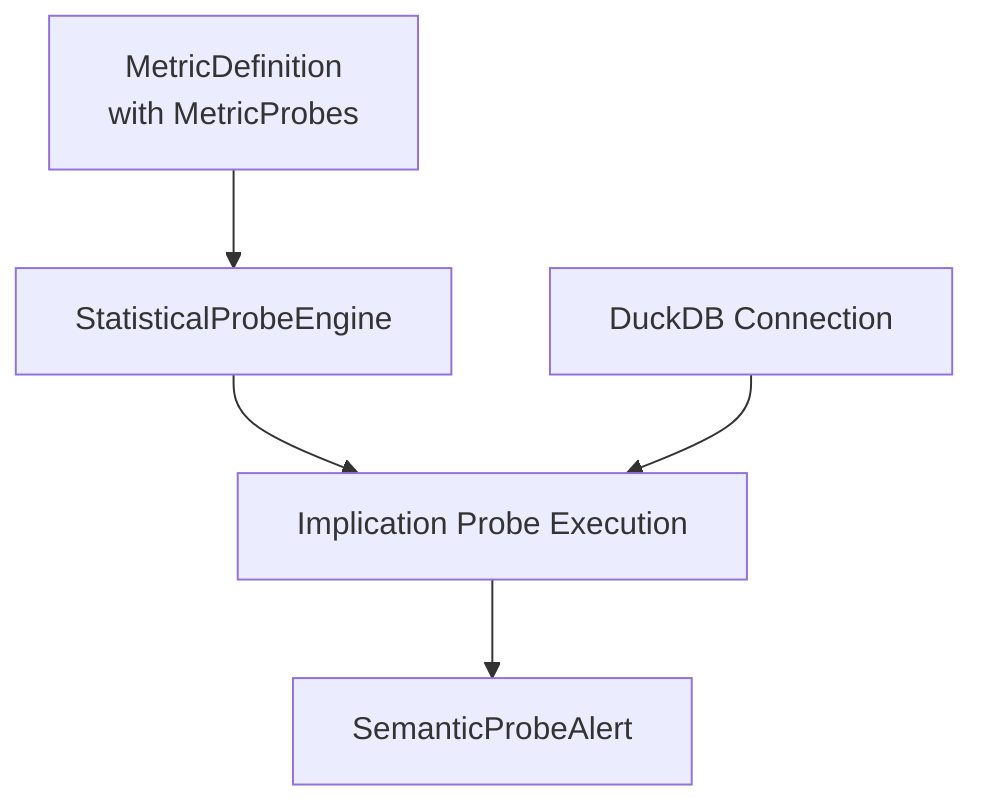
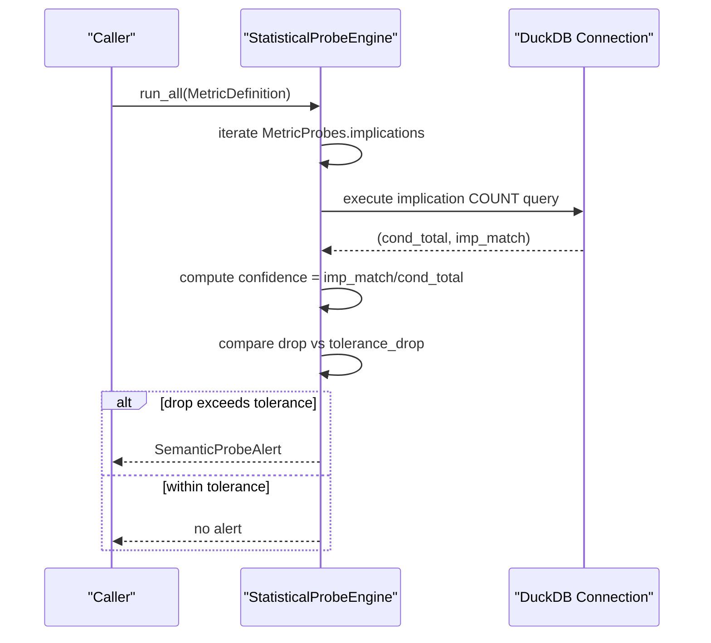
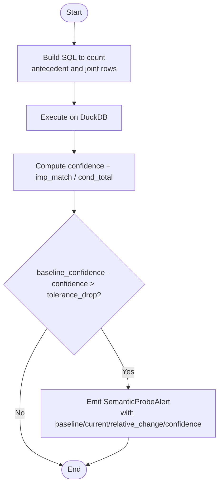
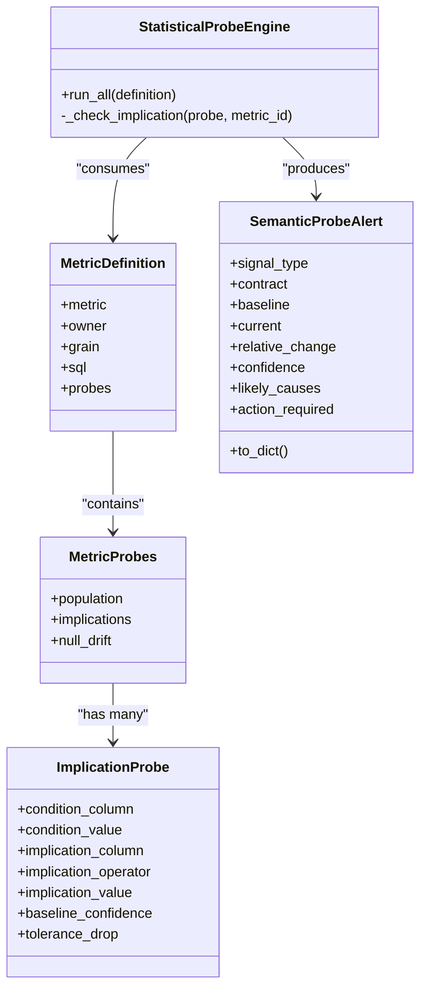

# Implication Probes

<cite>
**Referenced Files in This Document**
- [engine.py](file://semantic_reliability/probes/engine.py)
- [signals.py](file://semantic_reliability/probes/signals.py)
- [schema.py](file://semantic_reliability/compiler/schema.py)
- [test_probes.py](file://tests/test_probes.py)
</cite>

## Table of Contents
1. Introduction
2. Project Structure
3. Core Components
4. Architecture Overview
5. Detailed Component Analysis
6. Dependency Analysis
7. Performance Considerations
8. Troubleshooting Guide
9. Conclusion

## Introduction
This document explains implication probes that validate logical business rule dependencies across data attributes. An implication probe enforces a conditional relationship: if a condition holds (antecedent), then a consequent must also hold with high confidence. The system detects semantic violations when data changes break these rules, such as “active customers must have positive revenue” or “completed orders must have valid timestamps.” It reports alerts with baseline and current confidence, relative change, and likely causes to guide remediation.

## Project Structure
Implication probes are implemented as part of the statistical probes subsystem:
- Declarative schema defines the probe configuration (antecedent/consequent fields, operator, thresholds).
- A runtime engine executes SQL against a connection to compute observed confidence and compare it to the configured baseline.
- Alerts are emitted as structured signals for downstream consumption.

**Diagram sources**
- [engine.py:11-38](file://semantic_reliability/probes/engine.py#L11-L38)
- [schema.py:47-69](file://semantic_reliability/compiler/schema.py#L47-L69)
- [signals.py:5-17](file://semantic_reliability/probes/signals.py#L5-L17)

**Section sources**
- [engine.py:11-38](file://semantic_reliability/probes/engine.py#L11-L38)
- [schema.py:47-69](file://semantic_reliability/compiler/schema.py#L47-L69)
- [signals.py:5-17](file://semantic_reliability/probes/signals.py#L5-L17)

## Core Components
- ImplicationProbe: Declares antecedent and consequent columns/values, comparison operator, expected baseline confidence, and tolerance drop.
- StatisticalProbeEngine: Executes the implication check by computing P(consequent | antecedent) on live data and comparing to baseline.
- SemanticProbeAlert: Structured alert containing signal type, metric contract, baseline/current confidence, relative change, confidence level, and likely causes.

Key responsibilities:
- Antecedent-consequent configuration via schema fields.
- Confidence computation from counts of rows satisfying antecedent and both antecedent and consequent.
- Alerting when observed confidence drops below baseline minus tolerance.

**Section sources**
- [schema.py:47-69](file://semantic_reliability/compiler/schema.py#L47-L69)
- [engine.py:73-110](file://semantic_reliability/probes/engine.py#L73-L110)
- [signals.py:5-17](file://semantic_reliability/probes/signals.py#L5-L17)

## Architecture Overview
The implication probe workflow:
1. A MetricDefinition includes one or more ImplicationProbe entries under MetricProbes.implications.
2. StatisticalProbeEngine.run_all iterates over implications and calls _check_implication for each.
3. _check_implication builds a SQL query to count:
   - cond_total: number of rows where antecedent is true.
   - imp_match: number of rows where both antecedent and consequent are true.
4. Observed confidence = imp_match / cond_total.
5. If baseline_confidence - observed confidence > tolerance_drop, an alert is produced.

**Diagram sources**
- [engine.py:18-38](file://semantic_reliability/probes/engine.py#L18-L38)
- [engine.py:73-110](file://semantic_reliability/probes/engine.py#L73-L110)

## Detailed Component Analysis

### ImplicationProbe Configuration
- condition_column, condition_value: define the antecedent predicate (e.g., status = 'active').
- implication_column, implication_operator, implication_value: define the consequent predicate (e.g., mrr_amount > 0; supports IS NOT NULL).
- baseline_confidence: expected P(consequent | antecedent) in stable data.
- tolerance_drop: absolute threshold for acceptable decline in confidence.

Practical examples:
- “Active customers must have positive revenue”: condition=status='active', implication=mrr_amount>0, baseline_confidence near 1.0, small tolerance_drop.
- “Completed orders must have valid timestamps”: condition=order_status='completed', implication=timestamp IS NOT NULL.

**Section sources**
- [schema.py:47-69](file://semantic_reliability/compiler/schema.py#L47-L69)

### StatisticalProbeEngine._check_implication
- Builds SQL to compute counts for antecedent and joint satisfaction.
- Computes observed confidence and compares to baseline.
- Emits alert with:
  - signal_type indicating which implication decayed.
  - baseline and current confidence values.
  - relative_change percentage.
  - confidence level (“high” if drop > 2× tolerance_drop, else “medium”).
  - likely_causes describing upstream decoupling or definition expansion.

**Diagram sources**
- [engine.py:73-110](file://semantic_reliability/probes/engine.py#L73-L110)

**Section sources**
- [engine.py:73-110](file://semantic_reliability/probes/engine.py#L73-L110)

### SemanticProbeAlert
- Encapsulates alert details for downstream systems:
  - signal_type, contract, baseline, current, relative_change, confidence, likely_causes, action_required.
- Supports serialization via to_dict.

**Section sources**
- [signals.py:5-17](file://semantic_reliability/probes/signals.py#L5-L17)

### Example Usage and Validation
- Tests demonstrate configuring an implication probe to detect “active implies positive MRR” and asserting alert behavior when the rule is violated by data drift.
- Assertions verify alert presence, signal naming, computed current confidence, and confidence level.

**Section sources**
- [test_probes.py:82-118](file://tests/test_probes.py#L82-L118)

## Dependency Analysis
- StatisticalProbeEngine depends on:
  - MetricDefinition and MetricProbes from schema to read probe configurations.
  - DuckDB connection to execute queries.
  - SemanticProbeAlert to return results.
- ImplicationProbe is a Pydantic model defining required fields and defaults.

**Diagram sources**
- [schema.py:47-98](file://semantic_reliability/compiler/schema.py#L47-L98)
- [engine.py:11-38](file://semantic_reliability/probes/engine.py#L11-L38)
- [signals.py:5-17](file://semantic_reliability/probes/signals.py#L5-L17)

**Section sources**
- [schema.py:47-98](file://semantic_reliability/compiler/schema.py#L47-L98)
- [engine.py:11-38](file://semantic_reliability/probes/engine.py#L11-L38)
- [signals.py:5-17](file://semantic_reliability/probes/signals.py#L5-L17)

## Performance Considerations
- Query efficiency: The implication check uses two aggregate counts filtered by the antecedent and the joint condition. Ensure indexes on condition_column and implication_column to speed up scans.
- Large datasets: Prefer running probes against materialized snapshots or pre-aggregated tables to reduce full-table scans.
- Batch execution: Run multiple implication probes per metric in a single pass where possible to minimize repeated table scans.
- Connection reuse: Reuse the DuckDB connection across probes to avoid overhead.
- Sampling: For very large tables, consider stratified sampling of antecedent-matching rows to estimate confidence quickly, then escalate to full scan only when close to thresholds.

[No sources needed since this section provides general guidance]

## Troubleshooting Guide
Common issues and resolutions:
- Zero antecedent rows: If cond_total is zero, confidence is treated as 0.0. Verify the antecedent filter matches actual data values and casing.
- Operator misuse: When using IS NOT NULL, ensure implication_value is not provided; otherwise use numeric/string comparisons with appropriate quoting.
- Threshold tuning: If frequent false positives occur, increase tolerance_drop or adjust baseline_confidence based on historical stability.
- Data quality: Nulls or unexpected values in implication_column can cause decay; investigate upstream pipelines and schema migrations.

Operational tips:
- Inspect alert fields: baseline, current, relative_change, and likely_causes to pinpoint the nature of the violation.
- Reproduce locally: Use in-memory DuckDB with representative fixtures to validate probe behavior before production runs.

**Section sources**
- [engine.py:73-110](file://semantic_reliability/probes/engine.py#L73-L110)
- [signals.py:5-17](file://semantic_reliability/probes/signals.py#L5-L17)

## Conclusion
Implication probes provide a declarative, runtime mechanism to enforce business rule dependencies between attributes. By measuring observed confidence against a configured baseline and tolerances, they detect semantic violations early and produce actionable alerts. With careful configuration and performance-aware execution, they scale to large datasets and help maintain data integrity across evolving pipelines.