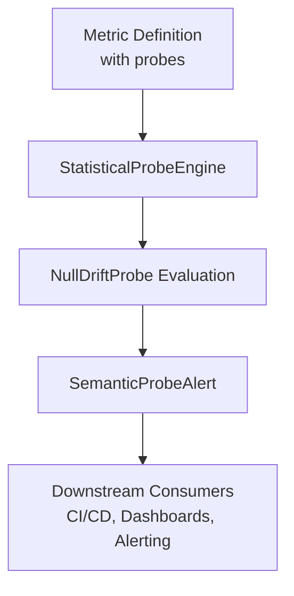
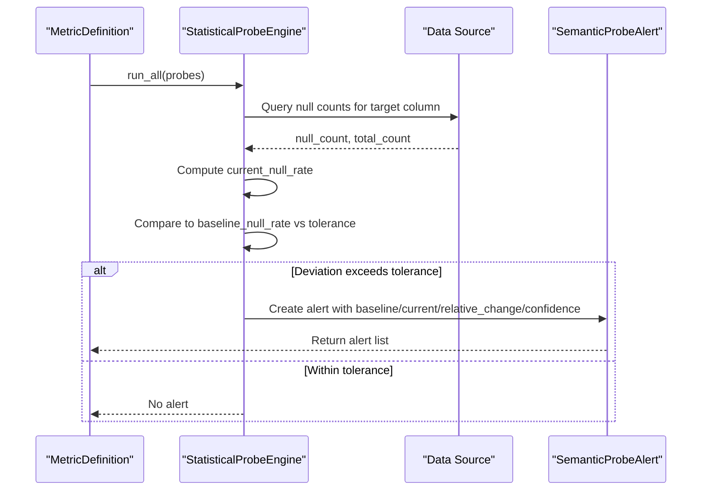
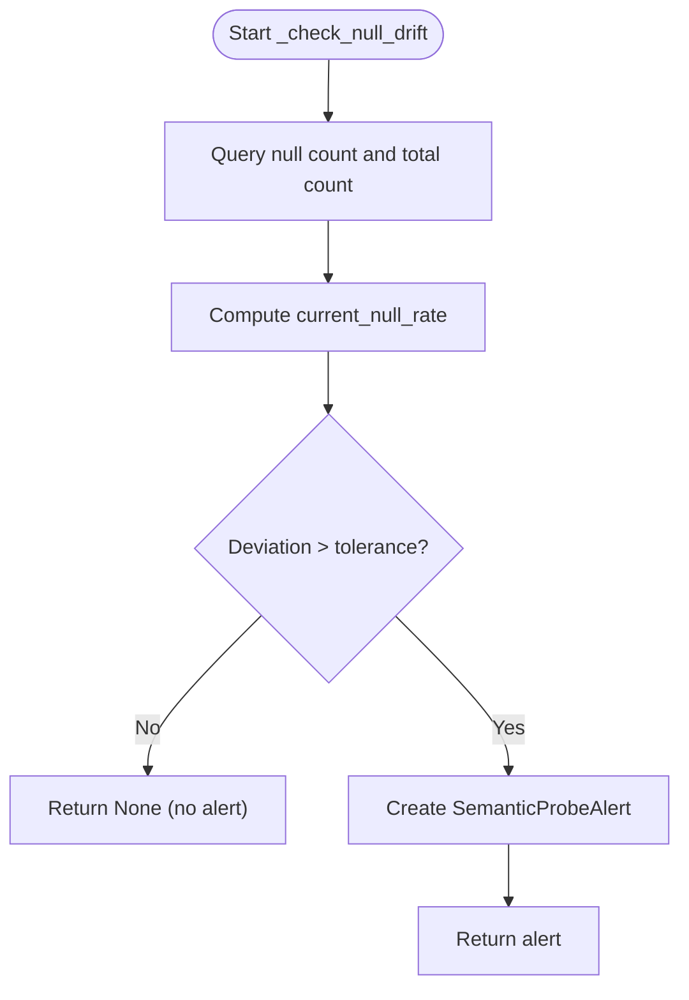
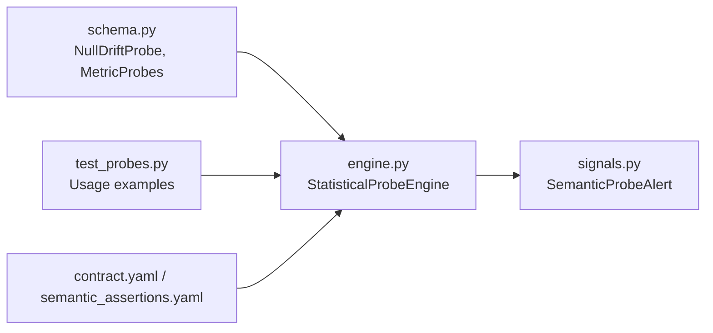

# Null Drift Probes

<cite>
**Referenced Files in This Document**
- [engine.py](file://semantic_reliability/probes/engine.py)
- [schema.py](file://semantic_reliability/compiler/schema.py)
- [signals.py](file://semantic_reliability/probes/signals.py)
- [test_probes.py](file://tests/test_probes.py)
- [net_revenue_contract.yaml](file://examples/metrics/net_revenue_contract.yaml)
- [net_revenue_semantic_assertions.yaml](file://benchmark_corpus/dev/net_revenue/semantic_assertions.yaml)
</cite>

## Table of Contents
1. [Introduction](#introduction)
2. [Project Structure](#project-structure)
3. [Core Components](#core-components)
4. [Architecture Overview](#architecture-overview)
5. [Detailed Component Analysis](#detailed-component-analysis)
6. [Dependency Analysis](#dependency-analysis)
7. [Performance Considerations](#performance-considerations)
8. [Troubleshooting Guide](#troubleshooting-guide)
9. [Conclusion](#conclusion)
10. [Appendices](#appendices)

## Introduction
Null drift probes detect silent data quality degradation by monitoring the null rate of critical columns over time. They compare the current null rate against a configured baseline and alert when the deviation exceeds a tolerance threshold. This prevents subtle but impactful issues such as missing join keys, identifiers, or required fields from silently corrupting metrics and downstream analytics.

The system executes declarative statistical probes against live warehouse connections or snapshots, computes empirical rates, and emits structured alerts with confidence levels and likely causes to guide remediation.

## Project Structure
Null drift detection is implemented as part of the statistical probe engine:
- Probe definitions are declared via schema models for each metric contract.
- The engine runs queries to compute current null rates and compares them to baselines.
- Alerts are emitted as structured signals that can be integrated into CI/CD, dashboards, or alerting systems.

**Diagram sources**
- [engine.py:11-38](file://semantic_reliability/probes/engine.py#L11-L38)
- [schema.py:58-69](file://semantic_reliability/compiler/schema.py#L58-L69)
- [signals.py:5-17](file://semantic_reliability/probes/signals.py#L5-L17)

**Section sources**
- [engine.py:11-38](file://semantic_reliability/probes/engine.py#L11-L38)
- [schema.py:58-69](file://semantic_reliability/compiler/schema.py#L58-L69)
- [signals.py:5-17](file://semantic_reliability/probes/signals.py#L5-L17)

## Core Components
- NullDriftProbe: Declarative configuration for column-specific null rate monitoring including baseline and tolerance.
- StatisticalProbeEngine: Executes probe logic, computes current null rates, and triggers alerts when thresholds are exceeded.
- SemanticProbeAlert: Structured output containing signal type, baseline/current values, relative change, confidence, and likely causes.

Key responsibilities:
- Baseline establishment: Define expected null rate per column (often zero for required fields).
- Tolerance setting: Define maximum acceptable absolute deviation from baseline.
- Alerting: Emit actionable signals when drift is detected.

**Section sources**
- [schema.py:58-69](file://semantic_reliability/compiler/schema.py#L58-L69)
- [engine.py:112-137](file://semantic_reliability/probes/engine.py#L112-L137)
- [signals.py:5-17](file://semantic_reliability/probes/signals.py#L5-L17)

## Architecture Overview
Null drift probes integrate into the metric contract lifecycle:
- Contracts define metrics and associated probes.
- The engine evaluates probes at runtime against data sources.
- Alerts are produced for consumption by pipelines and tools.

**Diagram sources**
- [engine.py:18-38](file://semantic_reliability/probes/engine.py#L18-L38)
- [engine.py:112-137](file://semantic_reliability/probes/engine.py#L112-L137)
- [signals.py:5-17](file://semantic_reliability/probes/signals.py#L5-L17)

## Detailed Component Analysis

### NullDriftProbe Configuration
- column: Target column to monitor for nulls (e.g., customer_id, transaction_date, amount).
- baseline_null_rate: Expected null percentage (0.0 to 1.0), typically 0.0 for required fields.
- tolerance: Maximum acceptable absolute deviation from baseline; alerts trigger when current rate minus baseline exceeds this value.

Example usage patterns:
- For join keys like customer_id: baseline_null_rate = 0.0, tolerance small (e.g., 0.01–0.02) to catch any unexpected nulls.
- For timestamps like transaction_date: baseline_null_rate = 0.0, tolerance small to ensure temporal integrity.
- For amounts like amount: baseline_null_rate = 0.0, tolerance small to prevent revenue calculation errors.

Configuration examples are demonstrated in tests and contracts:
- Test fixture shows how a non-zero null rate triggers an alert when baseline is zero.
- Contracts show where probes attach to metric definitions.

**Section sources**
- [schema.py:58-69](file://semantic_reliability/compiler/schema.py#L58-L69)
- [test_probes.py:121-150](file://tests/test_probes.py#L121-L150)
- [net_revenue_contract.yaml:1-39](file://examples/metrics/net_revenue_contract.yaml#L1-L39)
- [net_revenue_semantic_assertions.yaml:1-18](file://benchmark_corpus/dev/net_revenue/semantic_assertions.yaml#L1-L18)

### StatisticalProbeEngine Execution Logic
- Computes current null rate by counting nulls and total rows for the specified column.
- Compares deviation against tolerance to decide whether to emit an alert.
- Emits a SemanticProbeAlert with:
  - signal_type indicating the column and null rate shift
  - baseline and current null rates
  - relative_change percentage
  - confidence level
  - likely_causes suggestions

**Diagram sources**
- [engine.py:112-137](file://semantic_reliability/probes/engine.py#L112-L137)

**Section sources**
- [engine.py:112-137](file://semantic_reliability/probes/engine.py#L112-L137)

### Alert Model and Semantics
- SemanticProbeAlert provides structured information for consumers:
  - signal_type: Identifies the specific drift (e.g., column_null_rate_shift)
  - contract: Metric identifier for context
  - baseline/current: Numeric null rates
  - relative_change: Percentage change for quick assessment
  - confidence: Qualitative severity indicator
  - likely_causes: Suggested root causes to accelerate investigation

This model enables integration with CI/CD gates, dashboards, and alerting systems.

**Section sources**
- [signals.py:5-17](file://semantic_reliability/probes/signals.py#L5-L17)

### Example Scenarios and Threshold Guidance
- Join keys (customer_id):
  - baseline_null_rate = 0.0
  - tolerance = 0.01–0.02
  - Rationale: Any nulls break joins and degrade downstream aggregations; even small deviations warrant immediate attention.
- Timestamps (transaction_date):
  - baseline_null_rate = 0.0
  - tolerance = 0.01–0.02
  - Rationale: Missing dates disrupt time-based analysis and cohort calculations.
- Amounts (amount):
  - baseline_null_rate = 0.0
  - tolerance = 0.01–0.02
  - Rationale: Null amounts cause incorrect sums/averages and misstate financial metrics.

These scenarios align with test behavior where a non-zero null rate on a column with baseline zero triggers an alert.

**Section sources**
- [test_probes.py:121-150](file://tests/test_probes.py#L121-L150)
- [schema.py:58-69](file://semantic_reliability/compiler/schema.py#L58-L69)

## Dependency Analysis
Null drift detection depends on:
- Schema models for probe definitions and metric contracts.
- Engine execution against a DuckDB connection or equivalent data source.
- Alert model for standardized outputs.

**Diagram sources**
- [schema.py:58-69](file://semantic_reliability/compiler/schema.py#L58-L69)
- [engine.py:11-38](file://semantic_reliability/probes/engine.py#L11-L38)
- [signals.py:5-17](file://semantic_reliability/probes/signals.py#L5-L17)
- [test_probes.py:121-150](file://tests/test_probes.py#L121-L150)
- [net_revenue_contract.yaml:1-39](file://examples/metrics/net_revenue_contract.yaml#L1-L39)
- [net_revenue_semantic_assertions.yaml:1-18](file://benchmark_corpus/dev/net_revenue/semantic_assertions.yaml#L1-L18)

**Section sources**
- [schema.py:58-69](file://semantic_reliability/compiler/schema.py#L58-L69)
- [engine.py:11-38](file://semantic_reliability/probes/engine.py#L11-L38)
- [signals.py:5-17](file://semantic_reliability/probes/signals.py#L5-L17)
- [test_probes.py:121-150](file://tests/test_probes.py#L121-L150)
- [net_revenue_contract.yaml:1-39](file://examples/metrics/net_revenue_contract.yaml#L1-L39)
- [net_revenue_semantic_assertions.yaml:1-18](file://benchmark_corpus/dev/net_revenue/semantic_assertions.yaml#L1-L18)

## Performance Considerations
- Query efficiency: The null rate query uses COUNT(CASE WHEN ... IS NULL THEN 1 END) and COUNT(*) which are generally efficient; ensure indexes on monitored columns if datasets are large.
- Sampling: For very large tables, consider sampling strategies or materialized views to reduce query cost while maintaining accuracy.
- Frequency: Run probes at appropriate cadence (e.g., per pipeline run or daily) to balance timeliness and resource usage.
- Alert fatigue: Tune tolerances to avoid excessive false positives; start conservative and adjust based on observed stability.

[No sources needed since this section provides general guidance]

## Troubleshooting Guide
Common issues and resolutions:
- Unexpected null spikes:
  - Investigate upstream ETL failures, schema migrations, or API payload changes.
  - Review recent changes to source systems or transformations.
- High false positive rate:
  - Increase tolerance slightly if transient nulls are expected during maintenance windows.
  - Segment probes by business unit or region if null behavior varies significantly.
- Integration problems:
  - Ensure the engine has access to the correct table name and connection.
  - Validate that metric definitions include probes under the probes field.

Operational tips:
- Use the alert’s likely_causes to prioritize investigation.
- Track baseline and current rates over time to identify trends before thresholds are breached.
- Integrate alerts into CI/CD to block deployments when critical null drift occurs.

**Section sources**
- [engine.py:112-137](file://semantic_reliability/probes/engine.py#L112-L137)
- [signals.py:5-17](file://semantic_reliability/probes/signals.py#L5-L17)

## Conclusion
Null drift probes provide essential protection against silent data quality degradation by continuously monitoring critical columns for unexpected nulls. By configuring appropriate baselines and tolerances per column and integrating alerts into your data quality pipelines, teams can prevent join key failures, identifier mismatches, and required field gaps from impacting downstream analytics and business decisions.

[No sources needed since this section summarizes without analyzing specific files]

## Appendices

### Configuration Reference
- NullDriftProbe fields:
  - column: string
  - baseline_null_rate: float (0.0–1.0)
  - tolerance: float (absolute deviation threshold)
- MetricProbes container:
  - population: List[PopulationProbe]
  - implications: List[ImplicationProbe]
  - null_drift: List[NullDriftProbe]

**Section sources**
- [schema.py:58-69](file://semantic_reliability/compiler/schema.py#L58-L69)

### Example Integrations
- Attach probes to metric contracts to enforce runtime checks.
- Use semantic assertions alongside probes for comprehensive coverage.
- Leverage alert structures in dashboards and CI/CD gating.

**Section sources**
- [net_revenue_contract.yaml:1-39](file://examples/metrics/net_revenue_contract.yaml#L1-L39)
- [net_revenue_semantic_assertions.yaml:1-18](file://benchmark_corpus/dev/net_revenue/semantic_assertions.yaml#L1-L18)
- [test_probes.py:121-150](file://tests/test_probes.py#L121-L150)