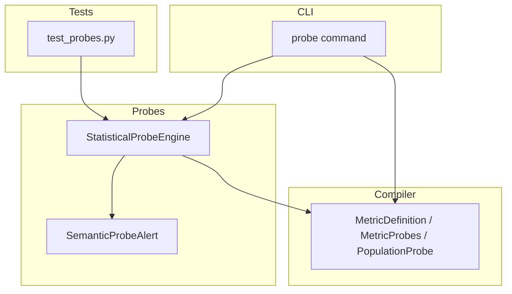
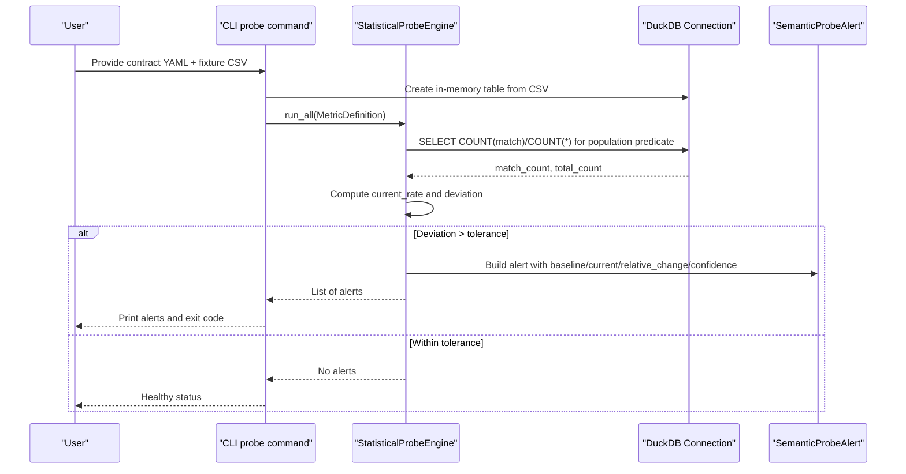
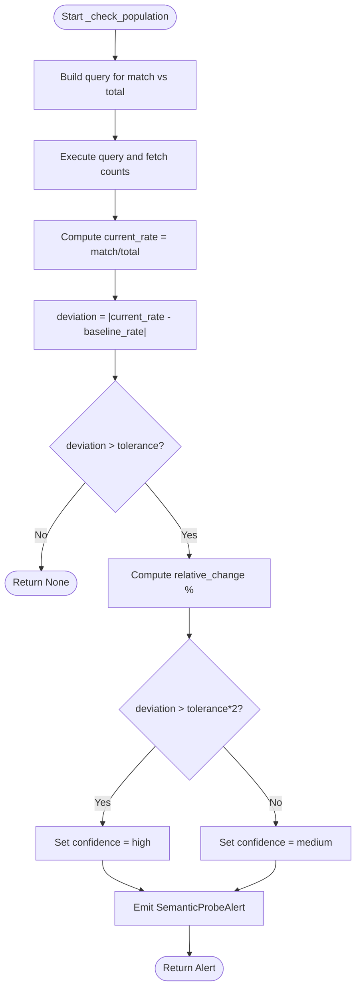
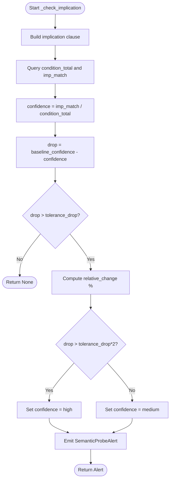
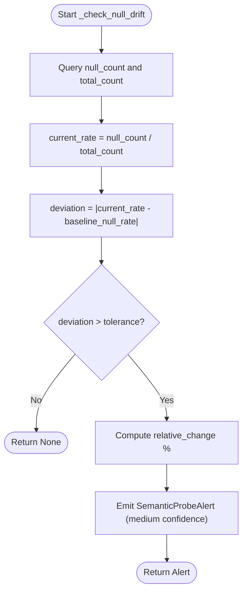
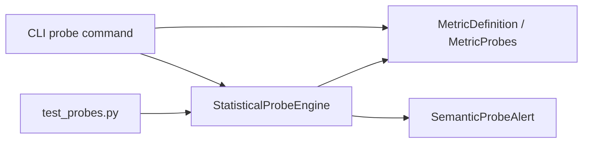

# Population Probes

<cite>
**Referenced Files in This Document**
- [engine.py](file://semantic_reliability/probes/engine.py)
- [signals.py](file://semantic_reliability/probes/signals.py)
- [schema.py](file://semantic_reliability/compiler/schema.py)
- [cli.py](file://semantic_reliability/cli.py)
- [test_probes.py](file://tests/test_probes.py)
</cite>

## Table of Contents
1. [Introduction](#introduction)
2. [Project Structure](#project-structure)
3. [Core Components](#core-components)
4. [Architecture Overview](#architecture-overview)
5. [Detailed Component Analysis](#detailed-component-analysis)
6. [Dependency Analysis](#dependency-analysis)
7. [Performance Considerations](#performance-considerations)
8. [Troubleshooting Guide](#troubleshooting-guide)
9. [Conclusion](#conclusion)

## Introduction
This document explains population probes in SCOS contracts and how they detect silent reality drift in data warehouse populations. Population probes monitor whether the proportion of rows matching a specific predicate remains stable over time. When the observed rate deviates beyond configured thresholds, the system emits structured alerts to signal potential upstream changes or data quality issues.

The engine computes an observed rate for a target value (or nulls when no target is specified), compares it against a baseline rate using absolute tolerance, and reports confidence levels based on the magnitude of deviation. It also supports related checks such as implication decay and null drift to complement population monitoring.

## Project Structure
Population probes are implemented as part of a small, focused module:
- Schema definitions declare probe types and their fields.
- The probe engine executes SQL queries against a connection and table to compute rates and generate alerts.
- A CLI command loads metric contracts with probes and runs them against fixtures or snapshots.
- Tests demonstrate healthy and drifted scenarios and validate alert behavior.

**Diagram sources**
- [engine.py:11-38](file://semantic_reliability/probes/engine.py#L11-L38)
- [signals.py:5-17](file://semantic_reliability/probes/signals.py#L5-L17)
- [schema.py:39-69](file://semantic_reliability/compiler/schema.py#L39-L69)
- [cli.py:587-629](file://semantic_reliability/cli.py#L587-L629)
- [test_probes.py:54-80](file://tests/test_probes.py#L54-L80)

**Section sources**
- [engine.py:11-38](file://semantic_reliability/probes/engine.py#L11-L38)
- [schema.py:39-69](file://semantic_reliability/compiler/schema.py#L39-L69)
- [cli.py:587-629](file://semantic_reliability/cli.py#L587-L629)
- [test_probes.py:54-80](file://tests/test_probes.py#L54-L80)

## Core Components
- StatisticalProbeEngine: Executes population, implication, and null drift probes against a database connection and table name. It aggregates alerts across all configured probes.
- SemanticProbeAlert: Structured alert containing signal type, contract reference, baseline/current values, relative change, confidence level, likely causes, and required action.
- Probe schema models:
  - PopulationProbe: Defines column, optional target_value, baseline_rate, and tolerance for absolute deviation.
  - ImplicationProbe: Monitors conditional probability P(B|A) and triggers on significant drops.
  - NullDriftProbe: Monitors null rates for critical columns.

Key behaviors:
- Population probe computes current_rate = matches / total_rows for a given predicate and raises an alert if |current_rate - baseline_rate| > tolerance.
- Confidence is set to high when deviation exceeds twice the tolerance; otherwise medium.
- Relative change is computed as percentage difference from baseline.

**Section sources**
- [engine.py:40-71](file://semantic_reliability/probes/engine.py#L40-L71)
- [signals.py:5-17](file://semantic_reliability/probes/signals.py#L5-L17)
- [schema.py:39-45](file://semantic_reliability/compiler/schema.py#L39-L45)

## Architecture Overview
The runtime flow for population probes:
1. Load a metric contract YAML that includes MetricDefinition and MetricProbes.
2. Connect to a DuckDB instance and register the fixture/snapshot as a table.
3. Run StatisticalProbeEngine.run_all to evaluate each probe.
4. For population probes, execute SQL to count matches vs total rows, compute current_rate, compare to baseline_rate with tolerance, and emit SemanticProbeAlert when exceeded.
5. CLI prints results and can exit non-zero based on configuration.

**Diagram sources**
- [cli.py:587-629](file://semantic_reliability/cli.py#L587-L629)
- [engine.py:18-38](file://semantic_reliability/probes/engine.py#L18-L38)
- [engine.py:40-71](file://semantic_reliability/probes/engine.py#L40-L71)
- [signals.py:5-17](file://semantic_reliability/probes/signals.py#L5-L17)

## Detailed Component Analysis

### Population Probe Logic
- Predicate handling:
  - If target_value is provided, the engine counts rows where column equals the target value.
  - If target_value is None, the engine counts rows where the column IS NULL.
- Rate computation:
  - current_rate = match_count / total_count (safe-guarded for zero totals).
- Thresholding:
  - deviation = |current_rate - baseline_rate|
  - Alert if deviation > tolerance
  - Confidence:
    - high if deviation > tolerance * 2
    - medium otherwise
- Relative change:
  - relative_change = ((current_rate - baseline_rate) / baseline_rate) * 100% (zero if baseline_rate == 0)

**Diagram sources**
- [engine.py:40-71](file://semantic_reliability/probes/engine.py#L40-L71)

**Section sources**
- [engine.py:40-71](file://semantic_reliability/probes/engine.py#L40-L71)

### Implication Probe Logic
- Purpose: Monitor conditional relationships like “Active implies Revenue > 0”.
- Computation:
  - Count condition_total (rows where condition_column = condition_value).
  - Count imp_match (rows where condition holds AND implication clause holds).
  - confidence = imp_match / condition_total (safe-guarded for zero condition_total).
- Thresholding:
  - drop = baseline_confidence - confidence
  - Alert if drop > tolerance_drop
  - Confidence:
    - high if drop > tolerance_drop * 2
    - medium otherwise
- Relative change:
  - negative relative_change representing confidence decay.

**Diagram sources**
- [engine.py:73-110](file://semantic_reliability/probes/engine.py#L73-L110)

**Section sources**
- [engine.py:73-110](file://semantic_reliability/probes/engine.py#L73-L110)

### Null Drift Probe Logic
- Purpose: Monitor unexpected increases in null rates for critical columns.
- Computation:
  - null_count and total_count via SQL.
  - current_rate = null_count / total_count.
- Thresholding:
  - deviation = |current_rate - baseline_null_rate|
  - Alert if deviation > tolerance
  - Confidence: medium
- Relative change:
  - percentage change from baseline_null_rate.

**Diagram sources**
- [engine.py:112-137](file://semantic_reliability/probes/engine.py#L112-L137)

**Section sources**
- [engine.py:112-137](file://semantic_reliability/probes/engine.py#L112-L137)

### Configuration Model
- PopulationProbe fields:
  - column: Target column to filter on.
  - target_value: Optional specific value; if None, monitors nulls.
  - baseline_rate: Expected ratio between 0.0 and 1.0.
  - tolerance: Absolute tolerance for rate deviation.
- MetricProbes:
  - population: List of PopulationProbe.
  - implications: List of ImplicationProbe.
  - null_drift: List of NullDriftProbe.
- MetricDefinition:
  - Includes probes field to attach statistical probes to a metric contract.

**Section sources**
- [schema.py:39-69](file://semantic_reliability/compiler/schema.py#L39-L69)
- [schema.py:83-95](file://semantic_reliability/compiler/schema.py#L83-L95)

## Dependency Analysis
- StatisticalProbeEngine depends on:
  - DuckDB connection and table name for executing queries.
  - MetricDefinition and probe schemas to interpret configuration.
  - SemanticProbeAlert to return structured signals.
- CLI probe command depends on:
  - YAML parsing to build MetricDefinition.
  - StatisticalProbeEngine to run probes.
- Tests depend on:
  - In-memory DuckDB instances to simulate fixtures and assert alert behavior.

**Diagram sources**
- [cli.py:587-629](file://semantic_reliability/cli.py#L587-L629)
- [engine.py:11-38](file://semantic_reliability/probes/engine.py#L11-L38)
- [signals.py:5-17](file://semantic_reliability/probes/signals.py#L5-L17)
- [test_probes.py:54-80](file://tests/test_probes.py#L54-L80)

**Section sources**
- [cli.py:587-629](file://semantic_reliability/cli.py#L587-L629)
- [engine.py:11-38](file://semantic_reliability/probes/engine.py#L11-L38)
- [test_probes.py:54-80](file://tests/test_probes.py#L54-L80)

## Performance Considerations
- Query efficiency:
  - Population probes use simple COUNT(CASE WHEN ...) and COUNT(*), which are efficient and scalable for large tables.
  - Ensure indexes on frequently filtered columns (e.g., status, region) to reduce scan times.
- Sampling strategy:
  - For very large datasets, consider running probes on representative samples or materialized views to reduce latency.
- Batch execution:
  - run_all evaluates all probes sequentially; grouping similar predicates can minimize repeated scans.
- Monitoring overhead:
  - Keep tolerance reasonable to avoid excessive alerting and downstream processing costs.

[No sources needed since this section provides general guidance]

## Troubleshooting Guide
Common false positive scenarios and strategies:
- Upstream mapping changes:
  - Symptoms: sudden shift in population rate without business intent.
  - Action: Review source CRM/database mappings and update baseline_rate if legitimate.
- Cohort segmentation shifts:
  - Symptoms: filters expanded or contracted unintentionally.
  - Action: Validate WHERE clauses and segment definitions; adjust tolerance if seasonal variation exists.
- Fixture/sample mix differences:
  - Symptoms: tests or local runs show drift compared to production.
  - Action: Align fixture distributions with production baselines; tune tolerance accordingly.
- Null spikes:
  - Symptoms: null_drift probe triggers due to missing values.
  - Action: Investigate ETL failures or schema migrations; add validation upstream.

Threshold tuning strategies:
- Start with conservative tolerances (e.g., 0.05 for population, 0.02 for null drift).
- Use high-confidence threshold (tolerance * 2) to distinguish significant drift.
- For implication probes, set baseline_confidence close to expected P(B|A) and tolerance_drop to capture meaningful decays.
- Revisit thresholds periodically based on observed stability and business seasonality.

Alerting mechanisms:
- CLI prints alerts with baseline, current, relative change, confidence, and likely causes.
- Exit codes can be configured to fail on critical signals for CI pipelines.
- MCP integration exposes active probes and health status for external systems.

**Section sources**
- [engine.py:40-71](file://semantic_reliability/probes/engine.py#L40-L71)
- [engine.py:73-110](file://semantic_reliability/probes/engine.py#L73-L110)
- [engine.py:112-137](file://semantic_reliability/probes/engine.py#L112-L137)
- [cli.py:587-629](file://semantic_reliability/cli.py#L587-L629)

## Conclusion
Population probes provide a lightweight, declarative mechanism to detect silent reality drift by monitoring key population ratios. By configuring baseline_rate and tolerance, teams can establish robust guardrails around critical predicates. Combined with implication and null drift probes, this approach offers comprehensive observability into data warehouse populations, enabling early detection of upstream changes and data quality issues. Proper threshold tuning and alerting integration ensure reliable operations and actionable insights.

[No sources needed since this section summarizes without analyzing specific files]