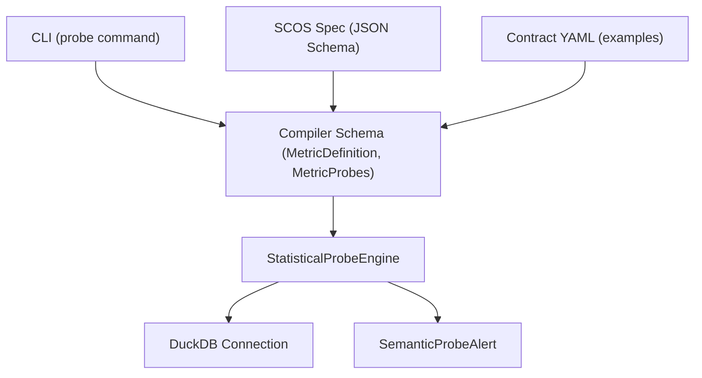
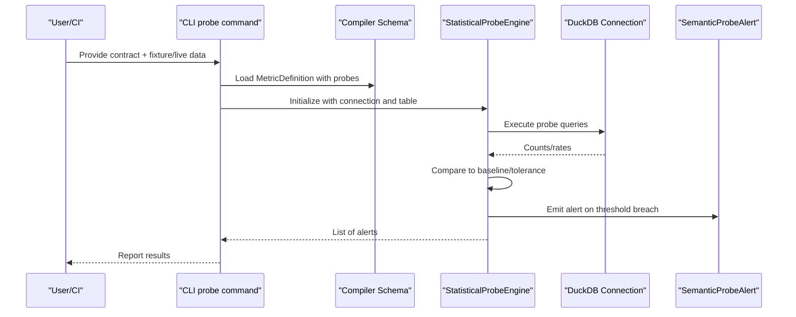
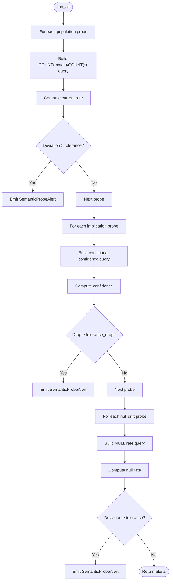
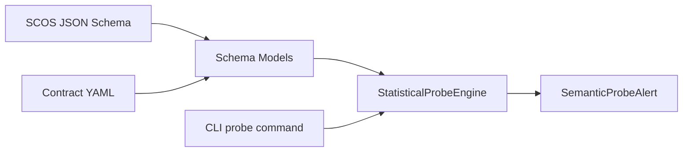

# Probe Configuration & Management

<cite>
**Referenced Files in This Document**
- [engine.py](file://semantic_reliability/probes/engine.py)
- [signals.py](file://semantic_reliability/probes/signals.py)
- [schema.py](file://semantic_reliability/compiler/schema.py)
- [contracts.py](file://semantic_reliability/compiler/contracts.py)
- [cli.py](file://semantic_reliability/cli.py)
- [scos-v1.schema.json](file://spec/scos-v1.schema.json)
- [SCOS_V1_SPECIFICATION.md](file://spec/SCOS_V1_SPECIFICATION.md)
- [test_probes.py](file://tests/test_probes.py)
- [net_revenue_contract.yaml](file://examples/metrics/net_revenue_contract.yaml)
- [ci.yml](file://.github/workflows/ci.yml)
</cite>

## Table of Contents
1. Introduction
2. Project Structure
3. Core Components
4. Architecture Overview
5. Detailed Component Analysis
6. Dependency Analysis
7. Performance Considerations
8. Troubleshooting Guide
9. Conclusion
10. Appendices

## Introduction
This document explains how to configure and manage statistical probes within SCOS contracts for runtime observability of data quality and semantic consistency. It covers the complete probe configuration schema, thresholds, confidence semantics, sampling strategies, alerting parameters, lifecycle management, versioning, deployment strategies, tuning best practices, composition patterns, CI/CD integration, and troubleshooting.

Probes are declarative expectations attached to a metric contract that continuously validate whether live or snapshot data matches expected distributions and relationships. The system supports three probe types:
- Population probes: monitor whether a filter predicate selects an expected proportion of rows.
- Implication probes: enforce conditional relationships (e.g., if status is active, then revenue must be positive).
- Null drift probes: ensure critical columns do not unexpectedly become null.

These probes produce structured alerts with baseline, current values, relative change, confidence level, likely causes, and required actions.

## Project Structure
The probe subsystem integrates with the SCOS compiler and CLI:
- Probes engine executes queries against a DuckDB connection and returns alerts.
- Schema models define probe configuration structures used by contracts.
- CLI exposes commands to run probes against fixtures or live connections.
- SCOS specification defines the canonical schema for contracts including probes.

**Diagram sources**
- [cli.py:175-200](file://semantic_reliability/cli.py#L175-L200)
- [schema.py:39-98](file://semantic_reliability/compiler/schema.py#L39-L98)
- [engine.py:11-38](file://semantic_reliability/probes/engine.py#L11-L38)
- [signals.py:5-17](file://semantic_reliability/probes/signals.py#L5-L17)
- [scos-v1.schema.json:116-155](file://spec/scos-v1.schema.json#L116-L155)
- [net_revenue_contract.yaml:1-39](file://examples/metrics/net_revenue_contract.yaml#L1-L39)

**Section sources**
- [engine.py:11-38](file://semantic_reliability/probes/engine.py#L11-L38)
- [schema.py:39-98](file://semantic_reliability/compiler/schema.py#L39-L98)
- [scos-v1.schema.json:116-155](file://spec/scos-v1.schema.json#L116-L155)
- [cli.py:175-200](file://semantic_reliability/cli.py#L175-L200)

## Core Components
- StatisticalProbeEngine: Executes population, implication, and null drift probes against a provided DuckDB connection and table name; aggregates alerts.
- SemanticProbeAlert: Structured alert model containing signal type, contract ID, baseline/current metrics, relative change, confidence, likely causes, and action required.
- Probe Models: PopulationProbe, ImplicationProbe, NullDriftProbe, MetricProbes define declarative configurations for each probe type.
- Contract Integration: MetricDefinition includes probes; contracts can be validated statically via SemanticContractValidator for SQL invariants.

Key responsibilities:
- Engine builds SQL per probe type, computes rates/confidence, compares to baselines/tolerances, and emits alerts when thresholds are exceeded.
- Alerts include actionable metadata to guide remediation.

**Section sources**
- [engine.py:11-138](file://semantic_reliability/probes/engine.py#L11-L138)
- [signals.py:5-17](file://semantic_reliability/probes/signals.py#L5-L17)
- [schema.py:39-98](file://semantic_reliability/compiler/schema.py#L39-L98)
- [contracts.py:26-135](file://semantic_reliability/compiler/contracts.py#L26-L135)

## Architecture Overview
The probe architecture layers static contract validation with runtime statistical checks:

**Diagram sources**
- [cli.py:175-200](file://semantic_reliability/cli.py#L175-L200)
- [schema.py:83-98](file://semantic_reliability/compiler/schema.py#L83-L98)
- [engine.py:18-38](file://semantic_reliability/probes/engine.py#L18-L38)
- [signals.py:5-17](file://semantic_reliability/probes/signals.py#L5-L17)

## Detailed Component Analysis

### Probe Configuration Schema
The SCOS JSON schema defines the probes section with three arrays:
- population: Each item requires a predicate and rate bounds (min_rate, max_rate).
- implications: Each item requires antecedent, consequent, and min_confidence.
- null_drift: Each item requires column and max_null_rate.

In code, the equivalent Pydantic models provide richer defaults and tolerances:
- PopulationProbe: column, target_value, baseline_rate, tolerance.
- ImplicationProbe: condition_column, condition_value, implication_column, implication_operator, implication_value, baseline_confidence, tolerance_drop.
- NullDriftProbe: column, baseline_null_rate, tolerance.

Use these fields to set thresholds and confidence semantics. For example:
- Set baseline_rate to historical proportions and tolerance to acceptable absolute deviation.
- Set baseline_confidence to expected P(consequent|antecedent) and tolerance_drop to alert when confidence falls below baseline minus tolerance.
- Set baseline_null_rate to expected null percentage and tolerance to maximum acceptable deviation.

**Section sources**
- [scos-v1.schema.json:116-155](file://spec/scos-v1.schema.json#L116-L155)
- [schema.py:39-98](file://semantic_reliability/compiler/schema.py#L39-L98)

### StatisticalProbeEngine Execution Flow
The engine runs all configured probes in order:
- Population: Computes match count vs total, derives current rate, compares to baseline_rate using tolerance, and emits alert if exceeded. Confidence is high when deviation exceeds twice the tolerance.
- Implication: Builds condition and implication clauses, computes confidence as P(implication|condition), compares drop to baseline_confidence using tolerance_drop, and emits alert if exceeded.
- Null Drift: Computes null rate for a column, compares to baseline_null_rate using tolerance, and emits alert if exceeded.

Each probe method catches exceptions and logs errors without failing the entire run.

**Diagram sources**
- [engine.py:18-138](file://semantic_reliability/probes/engine.py#L18-L138)

**Section sources**
- [engine.py:18-138](file://semantic_reliability/probes/engine.py#L18-L138)

### Alert Model and Semantics
SemanticProbeAlert captures:
- signal_type: Describes the nature of the alert (e.g., population rate shift, implication decay, null rate shift).
- contract: Metric identifier associated with the alert.
- baseline/current: Historical expectation and observed value.
- relative_change: Percentage change from baseline.
- confidence: High/medium/low based on severity of deviation.
- likely_causes: Suggested root causes to accelerate triage.
- action_required: Default guidance for human review.

This structure enables downstream systems to route alerts, prioritize responses, and integrate with dashboards or incident management tools.

**Section sources**
- [signals.py:5-17](file://semantic_reliability/probes/signals.py#L5-L17)

### Static Contract Validation (Complementary)
While probes check runtime data reality, static invariants validate candidate SQL against declared rules. The SemanticContractValidator enforces:
- Required filters present in WHERE clause.
- Reporting grain dimensions included in GROUP BY.
- Positive/negative components included in aggregation logic.
- Timezone constraints enforced.

This separation ensures both pre-execution correctness and post-execution monitoring.

**Section sources**
- [contracts.py:26-135](file://semantic_reliability/compiler/contracts.py#L26-L135)

## Dependency Analysis
Probe execution depends on:
- Compiler schema models for configuration parsing.
- DuckDB connection for executing queries.
- CLI for orchestrating inputs and outputs.
- SCOS spec for standardized contract structure.

**Diagram sources**
- [schema.py:39-98](file://semantic_reliability/compiler/schema.py#L39-L98)
- [engine.py:11-38](file://semantic_reliability/probes/engine.py#L11-L38)
- [signals.py:5-17](file://semantic_reliability/probes/signals.py#L5-L17)
- [cli.py:175-200](file://semantic_reliability/cli.py#L175-L200)
- [scos-v1.schema.json:116-155](file://spec/scos-v1.schema.json#L116-L155)
- [net_revenue_contract.yaml:1-39](file://examples/metrics/net_revenue_contract.yaml#L1-L39)

**Section sources**
- [schema.py:39-98](file://semantic_reliability/compiler/schema.py#L39-L98)
- [engine.py:11-38](file://semantic_reliability/probes/engine.py#L11-L38)
- [cli.py:175-200](file://semantic_reliability/cli.py#L175-L200)
- [scos-v1.schema.json:116-155](file://spec/scos-v1.schema.json#L116-L155)

## Performance Considerations
- Query efficiency: Probes use simple COUNT-based aggregations over the target table. Ensure appropriate indexing on filtered columns to reduce scan time.
- Batch execution: The engine runs all probes sequentially; consider parallelizing across independent probes if datasets are large.
- Sampling strategy: For very large tables, implement stratified sampling or windowed scans to approximate rates while reducing cost.
- Tolerance tuning: Tight tolerances increase sensitivity but may raise false positives; wider tolerances reduce noise but risk missing drift.
- Logging: Exceptions are logged per probe; enable structured logging to capture performance metrics and failure contexts.

[No sources needed since this section provides general guidance]

## Troubleshooting Guide
Common issues and resolutions:
- Probe fails due to missing column: Verify column names and quoting in probe configuration; ensure the table schema matches expectations.
- Unexpected alerts: Review baseline_rate/baseline_null_rate and tolerance settings; adjust to reflect recent legitimate changes.
- Implication probe false negatives: Confirm implication_operator and implication_value align with business logic; update baseline_confidence if definitions evolved.
- CLI invocation errors: Ensure contract and fixture paths are correct; verify table_name matches registered table in DuckDB.

Diagnostic steps:
- Inspect logs for probe-specific error messages.
- Validate contract YAML against SCOS schema before running probes.
- Use test cases to simulate data scenarios and confirm expected alert behavior.

**Section sources**
- [engine.py:69-71](file://semantic_reliability/probes/engine.py#L69-L71)
- [engine.py:108-110](file://semantic_reliability/probes/engine.py#L108-L110)
- [engine.py:135-137](file://semantic_reliability/probes/engine.py#L135-L137)
- [test_probes.py:153-184](file://tests/test_probes.py#L153-L184)

## Conclusion
Statistical probes in SCOS contracts provide robust runtime observability for data quality and semantic integrity. By configuring thresholds, confidence intervals, and tolerances appropriately, teams can detect silent drift early, prevent false positives, and maintain reliable metrics. Combining static invariant validation with dynamic probing yields comprehensive coverage across development and production. Integrating probes into CI/CD pipelines ensures continuous verification and rapid feedback.

[No sources needed since this section summarizes without analyzing specific files]

## Appendices

### Probe Lifecycle Management and Versioning
- Versioning: Contracts carry a semantic version field to track evolution of metric definitions and probe baselines.
- Deployment: Promote probe configurations alongside metric SQL; validate via static checks and execute probes against staging data before production rollout.
- Rollback: Maintain previous versions of contracts; revert probe baselines if new configurations cause excessive alerts.
- Audit: Capture alert histories and baseline updates for governance and compliance.

**Section sources**
- [scos-v1.schema.json:24-28](file://spec/scos-v1.schema.json#L24-L28)
- [SCOS_V1_SPECIFICATION.md:92-114](file://spec/SCOS_V1_SPECIFICATION.md#L92-L114)

### Best Practices for Probe Tuning and False Positive Prevention
- Baseline calibration: Derive baseline_rate and baseline_null_rate from stable historical windows; avoid transient spikes.
- Tolerance selection: Start with conservative tolerances; iteratively widen if false positives dominate.
- Confidence thresholds: Use high confidence only for significant deviations; medium for moderate drops.
- Composition: Combine population, implication, and null drift probes to cover different failure modes.
- Monitoring: Track alert frequency and resolution times; refine probes based on operational feedback.

[No sources needed since this section provides general guidance]

### CI/CD Integration Patterns
- Pre-merge checks: Run static contract validation and probe tests against fixtures to catch misconfigurations early.
- Post-deployment: Schedule periodic probe runs against production snapshots or live connections; export alerts to dashboards or incident systems.
- Benchmarking: Include probe suites in benchmark workflows to measure effectiveness over time.

**Section sources**
- [ci.yml:10-51](file://.github/workflows/ci.yml#L10-L51)
- [cli.py:175-200](file://semantic_reliability/cli.py#L175-L200)

### Example Contract Reference
A sample metric contract demonstrates invariants and structure; extend it with probes to add runtime monitoring.

**Section sources**
- [net_revenue_contract.yaml:1-39](file://examples/metrics/net_revenue_contract.yaml#L1-L39)