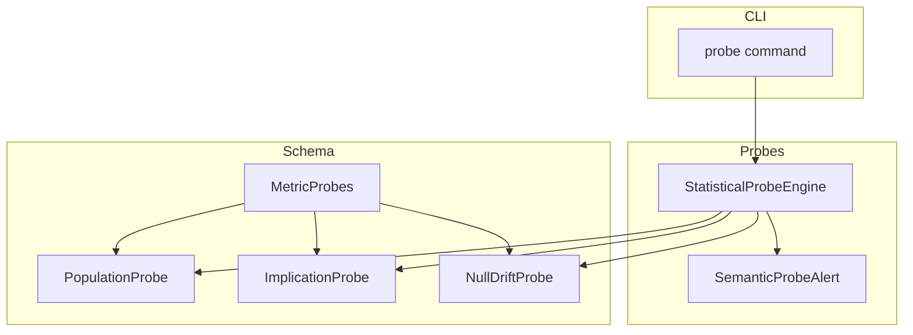
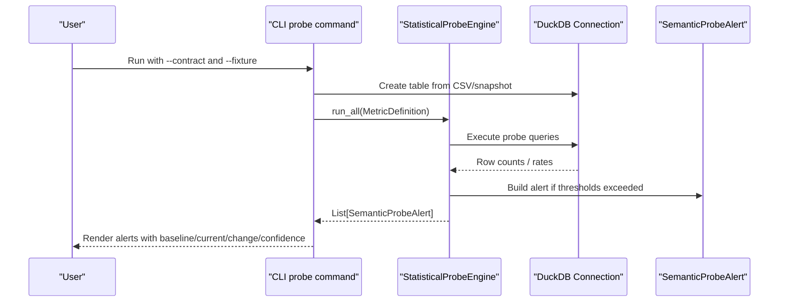
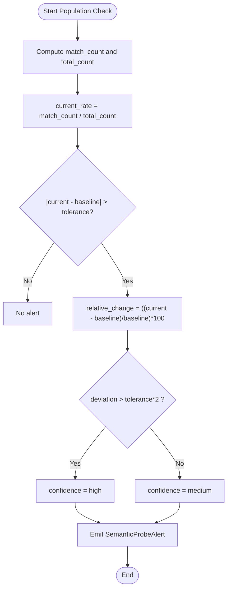
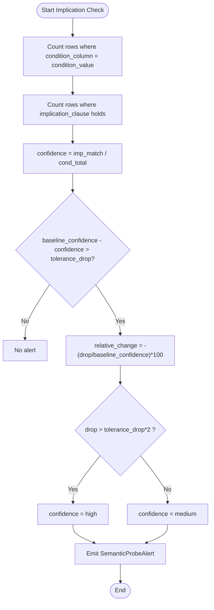
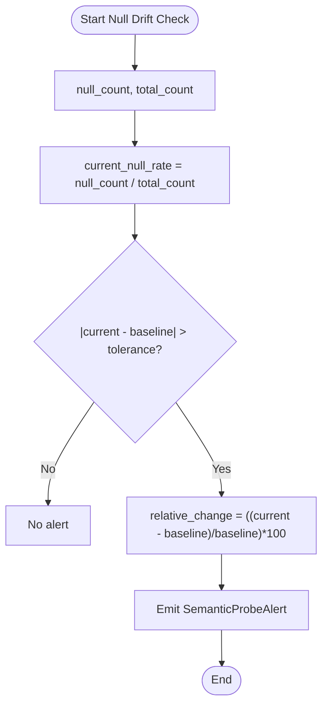
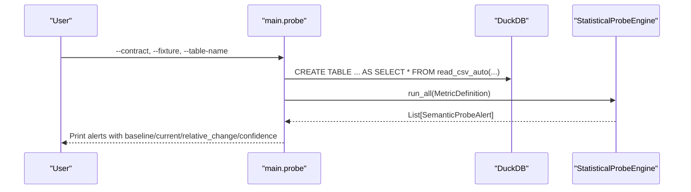
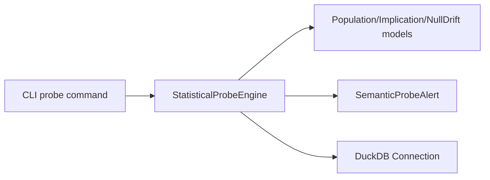

# Statistical Probes

<cite>
**Referenced Files in This Document**
- [engine.py](file://semantic_reliability/probes/engine.py)
- [signals.py](file://semantic_reliability/probes/signals.py)
- [schema.py](file://semantic_reliability/compiler/schema.py)
- [cli.py](file://semantic_reliability/cli.py)
- [test_probes.py](file://tests/test_probes.py)
</cite>

## Table of Contents
1. Introduction
2. Project Structure
3. Core Components
4. Architecture Overview
5. Detailed Component Analysis
6. Dependency Analysis
7. Performance Considerations
8. Troubleshooting Guide
9. Conclusion

## Introduction
This document explains statistical probes for SCOS contracts that continuously monitor underlying data warehouses to detect silent reality drift. It covers three probe types:
- Population probes: monitor whether a filter predicate selects the expected proportion of rows (e.g., “active” status rate).
- Implication probes: validate logical business rules such as “if status is active, then revenue must be greater than zero.”
- Null drift probes: monitor unexpected null rates on critical semantic columns.

It also documents threshold configuration, confidence signaling, alerting mechanisms, example configurations for common business scenarios, performance considerations, false positive prevention, and troubleshooting.

## Project Structure
Statistical probes are implemented as a small, focused module with clear separation between:
- Probe execution engine
- Declarative schema definitions for probe types
- Structured alert model
- CLI integration to run probes against fixtures or live connections

**Diagram sources**
- [engine.py:11-38](file://semantic_reliability/probes/engine.py#L11-L38)
- [schema.py:39-69](file://semantic_reliability/compiler/schema.py#L39-L69)
- [signals.py:5-17](file://semantic_reliability/probes/signals.py#L5-L17)
- [cli.py:586-629](file://semantic_reliability/cli.py#L586-L629)

**Section sources**
- [engine.py:11-38](file://semantic_reliability/probes/engine.py#L11-L38)
- [schema.py:39-69](file://semantic_reliability/compiler/schema.py#L39-L69)
- [signals.py:5-17](file://semantic_reliability/probes/signals.py#L5-L17)
- [cli.py:586-629](file://semantic_reliability/cli.py#L586-L629)

## Core Components
- StatisticalProbeEngine: Executes declarative probes against a DuckDB connection and table name; returns structured alerts when thresholds are breached.
- MetricProbes and probe models: Declarative configuration for population, implication, and null drift checks.
- SemanticProbeAlert: Standardized alert payload including baseline, current, relative change, confidence, likely causes, and required action.

Key responsibilities:
- Compute empirical rates from the target table.
- Compare against configured baselines and tolerances.
- Emit alerts with actionable metadata.

**Section sources**
- [engine.py:11-38](file://semantic_reliability/probes/engine.py#L11-L38)
- [schema.py:39-69](file://semantic_reliability/compiler/schema.py#L39-L69)
- [signals.py:5-17](file://semantic_reliability/probes/signals.py#L5-L17)

## Architecture Overview
The probe pipeline integrates with the CLI to load a metric contract YAML containing probes, materialize a DuckDB table from a fixture or snapshot, execute all probes, and render results.

**Diagram sources**
- [cli.py:586-629](file://semantic_reliability/cli.py#L586-L629)
- [engine.py:18-38](file://semantic_reliability/probes/engine.py#L18-L38)
- [signals.py:5-17](file://semantic_reliability/probes/signals.py#L5-L17)

## Detailed Component Analysis

### Population Probes
Purpose: Ensure a filter predicate selects the expected proportion of the population. For example, monitoring the percentage of rows where status equals “active.”

How it works:
- Computes match count and total count for the specified column and optional target value.
- Derives current_rate = match_count / total_count.
- Compares absolute deviation against tolerance.
- Emits an alert with signal_type indicating population rate shift, baseline, current, relative change, confidence, and likely causes.

Configuration fields:
- column: Target column to evaluate.
- target_value: Optional value to filter by; if omitted, evaluates nulls via IS NULL.
- baseline_rate: Expected ratio (0.0 to 1.0).
- tolerance: Maximum acceptable absolute deviation.

Example scenario:
- Expect 80% active users; actual drops to 10%; triggers high-confidence alert due to large deviation.

**Diagram sources**
- [engine.py:40-71](file://semantic_reliability/probes/engine.py#L40-L71)
- [schema.py:39-45](file://semantic_reliability/compiler/schema.py#L39-L45)

**Section sources**
- [engine.py:40-71](file://semantic_reliability/probes/engine.py#L40-L71)
- [schema.py:39-45](file://semantic_reliability/compiler/schema.py#L39-L45)
- [test_probes.py:54-79](file://tests/test_probes.py#L54-L79)

### Implication Probes
Purpose: Validate logical business rules such as “if condition A holds, then condition B should hold with high probability.”

How it works:
- Builds a conditional query counting rows where condition_column equals condition_value.
- Counts matches where the implication clause holds (supports operators like >, <, =, !=, or IS NOT NULL).
- Computes confidence = imp_match / cond_total.
- Alerts if baseline_confidence - confidence exceeds tolerance_drop.

Configuration fields:
- condition_column, condition_value: Define the antecedent.
- implication_column, implication_operator, implication_value: Define the consequent.
- baseline_confidence: Expected P(B|A) in [0.0, 1.0].
- tolerance_drop: Alert if confidence drops by more than this amount.

Example scenario:
- Active customers should have mrr_amount > 0; free trial dilution reduces confidence, triggering an alert.

**Diagram sources**
- [engine.py:73-110](file://semantic_reliability/probes/engine.py#L73-L110)
- [schema.py:47-55](file://semantic_reliability/compiler/schema.py#L47-L55)

**Section sources**
- [engine.py:73-110](file://semantic_reliability/probes/engine.py#L73-L110)
- [schema.py:47-55](file://semantic_reliability/compiler/schema.py#L47-L55)
- [test_probes.py:82-118](file://tests/test_probes.py#L82-L118)

### Null Drift Probes
Purpose: Monitor unexpected null rates on critical semantic columns to catch upstream ETL failures, schema migrations, or API payload changes.

How it works:
- Computes null_count and total_count for the specified column.
- Derives current null rate and compares absolute deviation against tolerance.
- Emits an alert with baseline_null_rate, current null rate, relative change, and likely causes.

Configuration fields:
- column: Column to monitor for nulls.
- baseline_null_rate: Expected null rate in [0.0, 1.0].
- tolerance: Max acceptable absolute deviation.

Example scenario:
- Status column should never be null; sudden 20% nulls trigger an alert.

**Diagram sources**
- [engine.py:112-137](file://semantic_reliability/probes/engine.py#L112-L137)
- [schema.py:58-62](file://semantic_reliability/compiler/schema.py#L58-L62)

**Section sources**
- [engine.py:112-137](file://semantic_reliability/probes/engine.py#L112-L137)
- [schema.py:58-62](file://semantic_reliability/compiler/schema.py#L58-L62)
- [test_probes.py:121-150](file://tests/test_probes.py#L121-L150)

### Alert Model
All probes emit a standardized alert object carrying:
- signal_type: Descriptive identifier of the issue.
- contract: Metric ID associated with the alert.
- baseline: Historical expectation.
- current: Observed value.
- relative_change: Percentage change.
- confidence: “high”, “medium”, or “low”.
- likely_causes: Human-readable hypotheses.
- action_required: Default guidance for human review.

**Section sources**
- [signals.py:5-17](file://semantic_reliability/probes/signals.py#L5-L17)

### CLI Integration and Execution Flow
The CLI provides a dedicated probe command that:
- Loads a metric contract YAML with probes.
- Creates an in-memory DuckDB table from a CSV fixture or snapshot.
- Runs all probes and prints structured panels for each alert.
- Supports fail-on-critical behavior for CI gating.

**Diagram sources**
- [cli.py:586-629](file://semantic_reliability/cli.py#L586-L629)
- [engine.py:18-38](file://semantic_reliability/probes/engine.py#L18-L38)

**Section sources**
- [cli.py:586-629](file://semantic_reliability/cli.py#L586-L629)
- [engine.py:18-38](file://semantic_reliability/probes/engine.py#L18-L38)

## Dependency Analysis
- The engine depends on:
  - Schema models for probe configuration.
  - A DuckDB connection to execute queries.
  - The alert model to standardize outputs.
- The CLI depends on the engine and schema to parse contracts and orchestrate runs.

**Diagram sources**
- [cli.py:586-629](file://semantic_reliability/cli.py#L586-L629)
- [engine.py:1-17](file://semantic_reliability/probes/engine.py#L1-L17)
- [schema.py:39-69](file://semantic_reliability/compiler/schema.py#L39-L69)
- [signals.py:5-17](file://semantic_reliability/probes/signals.py#L5-L17)

**Section sources**
- [engine.py:1-17](file://semantic_reliability/probes/engine.py#L1-L17)
- [schema.py:39-69](file://semantic_reliability/compiler/schema.py#L39-L69)
- [signals.py:5-17](file://semantic_reliability/probes/signals.py#L5-L17)
- [cli.py:586-629](file://semantic_reliability/cli.py#L586-L629)

## Performance Considerations
- Probes execute simple aggregate queries over the target table; complexity is dominated by scanning the table once per probe type.
- Use appropriate tolerances to avoid excessive alerting on normal fluctuations.
- Prefer running probes on representative snapshots or partitioned tables to reduce scan cost.
- Batch multiple probes per metric to minimize repeated scans where possible.

[No sources needed since this section provides general guidance]

## Troubleshooting Guide
Common issues and remedies:
- Probe query errors: Each probe wraps execution in try/except and logs errors; check logs for specific failure messages.
- False positives:
  - Increase tolerance for population and null drift probes.
  - Adjust baseline values after validating that the new reality is correct.
  - For implication probes, ensure the implication operator and value accurately reflect business rules.
- Data quality problems:
  - Null drift alerts often indicate upstream ETL failures, schema migrations, or source system changes. Investigate pipelines and schemas.
- CI gating:
  - Use the CLI’s fail-on-critical option to block pipelines when high-confidence alerts occur.

Operational tips:
- Keep baseline values aligned with recent stable periods.
- Add likely causes to your team’s runbooks for faster triage.
- Periodically review and tune tolerances based on observed variance.

**Section sources**
- [engine.py:40-71](file://semantic_reliability/probes/engine.py#L40-L71)
- [engine.py:73-110](file://semantic_reliability/probes/engine.py#L73-L110)
- [engine.py:112-137](file://semantic_reliability/probes/engine.py#L112-L137)
- [cli.py:586-629](file://semantic_reliability/cli.py#L586-L629)

## Conclusion
Statistical probes provide continuous, declarative monitoring of SCOS contracts to detect silent reality drift in production data. By combining population, implication, and null drift checks with configurable thresholds and standardized alerts, teams can proactively identify upstream changes, prevent false positives through sensible tolerances, and integrate seamlessly into CI/CD workflows using the CLI. Regular tuning of baselines and tolerances ensures long-term reliability and minimal noise.

[No sources needed since this section summarizes without analyzing specific files]