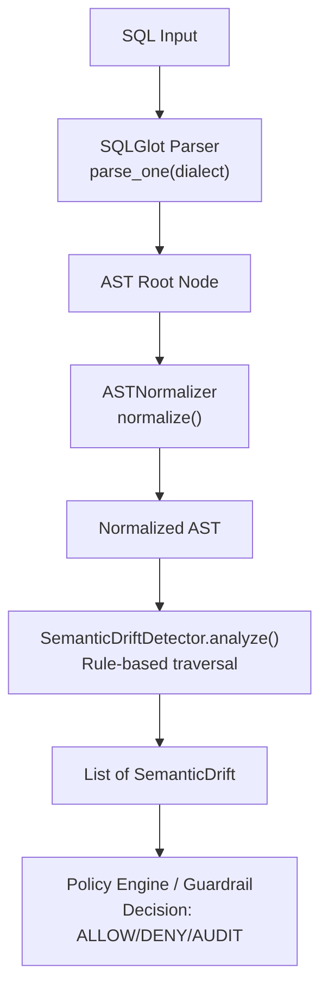
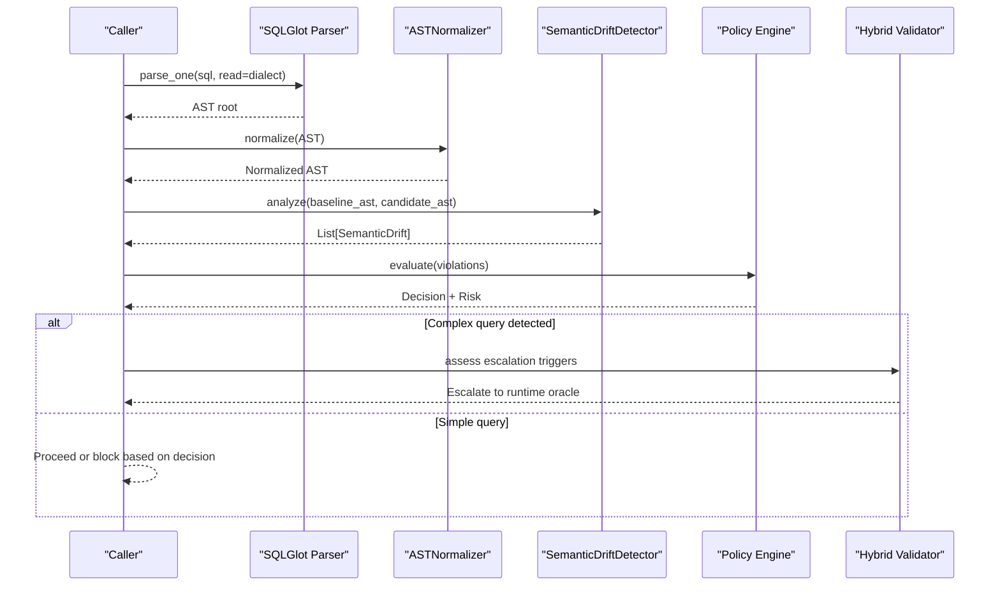
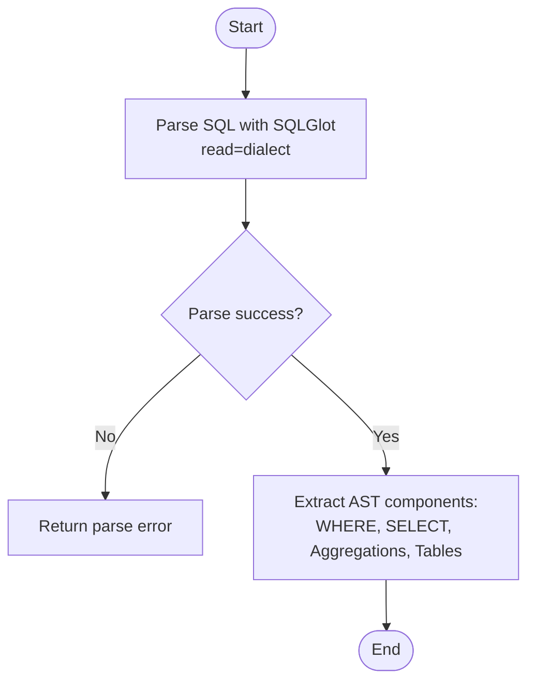
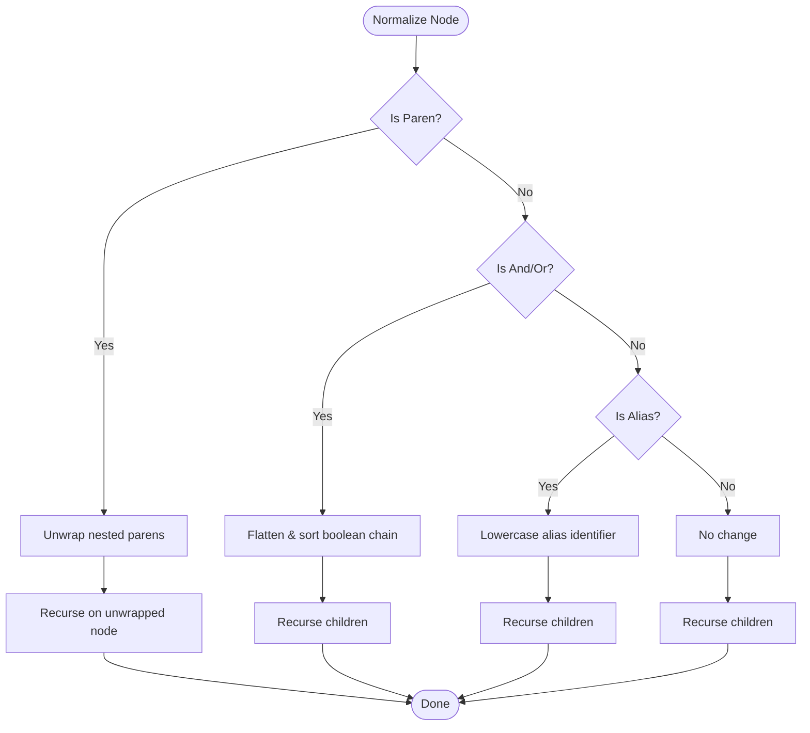
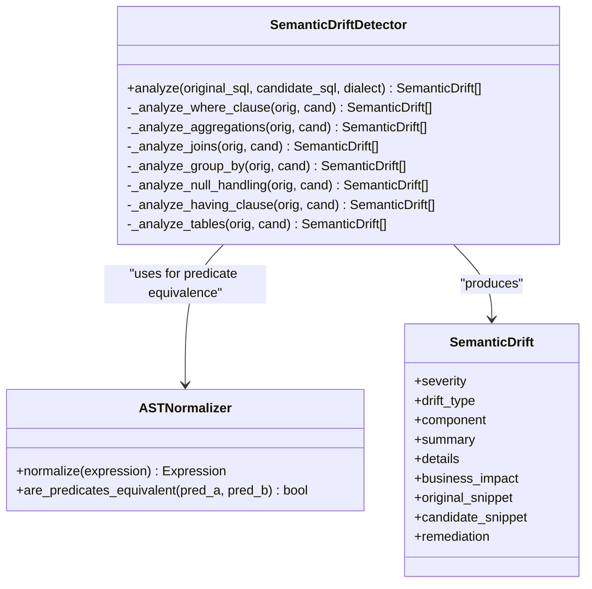
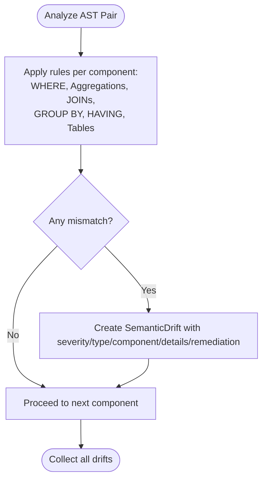
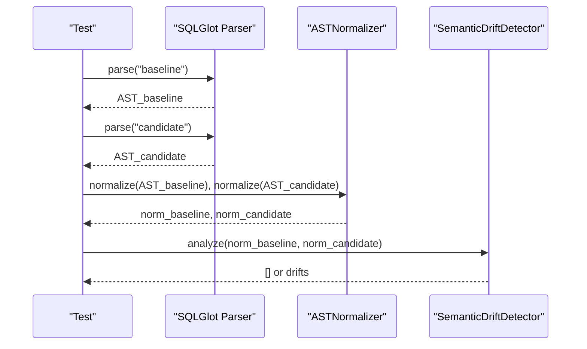
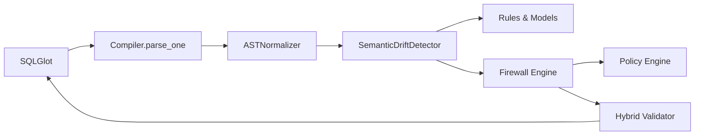

# AST Analysis

<cite>
**Referenced Files in This Document**
- [normalizer.py](file://semantic_reliability/testing/drift/normalizer.py)
- [detector.py](file://semantic_reliability/testing/drift/detector.py)
- [rules.py](file://semantic_reliability/testing/drift/rules.py)
- [compiler.py](file://semantic_reliability/compiler/compiler.py)
- [schema.py](file://semantic_reliability/compiler/schema.py)
- [engine.py](file://semantic_reliability/firewall/engine.py)
- [hybrid_router.py](file://semantic_reliability/firewall/hybrid_router.py)
- [handlers.py](file://semantic_reliability/mcp/handlers.py)
- [test_equivalence.py](file://tests/test_equivalence.py)
</cite>

## Table of Contents
1. [Introduction](#introduction)
2. [Project Structure](#project-structure)
3. [Core Components](#core-components)
4. [Architecture Overview](#architecture-overview)
5. [Detailed Component Analysis](#detailed-component-analysis)
6. [Dependency Analysis](#dependency-analysis)
7. [Performance Considerations](#performance-considerations)
8. [Troubleshooting Guide](#troubleshooting-guide)
9. [Conclusion](#conclusion)

## Introduction
This document explains how the system performs Abstract Syntax Tree (AST) analysis to ensure semantic reliability of SQL queries. It covers:
- Parsing SQL into ASTs using SQLGlot
- Normalizing ASTs to enable deterministic, dialect-aware semantic comparison
- Traversal algorithms used for semantic equivalence and drift detection
- A rule-based system that detects semantic drift and invariant violations
- Examples of before/after transformations and how differences are identified
- Performance considerations and optimization strategies for large-scale analysis

## Project Structure
The AST analysis pipeline is implemented across several modules:
- Parsing and compilation: SQLGlot-based parsing and metric compilation
- Normalization: Canonicalization of AST expressions for stable comparisons
- Drift detection: Rule-based traversal over key relational components (WHERE, JOIN, GROUP BY, HAVING, aggregations, tables)
- Policy enforcement: Contract registry and evaluator that gate execution based on semantic invariants
- Escalation and safety: Hybrid routing and complexity limits to avoid expensive runtime checks when not needed

**Diagram sources**
- [compiler.py:37-47](file://semantic_reliability/compiler/compiler.py#L37-L47)
- [normalizer.py:9-14](file://semantic_reliability/testing/drift/normalizer.py#L9-L14)
- [detector.py:12-46](file://semantic_reliability/testing/drift/detector.py#L12-L46)
- [engine.py:54-116](file://semantic_reliability/firewall/engine.py#L54-L116)

**Section sources**
- [compiler.py:37-47](file://semantic_reliability/compiler/compiler.py#L37-L47)
- [normalizer.py:9-14](file://semantic_reliability/testing/drift/normalizer.py#L9-L14)
- [detector.py:12-46](file://semantic_reliability/testing/drift/detector.py#L12-L46)
- [engine.py:54-116](file://semantic_reliability/firewall/engine.py#L54-L116)

## Core Components
- SQLGlot parser: Converts SQL strings into typed AST nodes with dialect support.
- ASTNormalizer: Canonicalizes ASTs by removing redundant parentheses, flattening/sorting commutative boolean chains, and normalizing alias casing.
- SemanticDriftDetector: Compares baseline and candidate ASTs across critical relational components and emits structured drift reports.
- Rules and models: Enumerated drift types and severities; a Pydantic model representing each drift with context and remediation hints.
- Compiler and schema: Compile canonical metric definitions into ASTs and define declarative semantic invariants (population, grain, aggregation, units, time).
- Firewall engine: Parses, validates against contracts, and returns decisions with audit traces.
- Hybrid router: Escalates to runtime evaluation only when static AST analysis cannot guarantee correctness.

**Section sources**
- [normalizer.py:6-92](file://semantic_reliability/testing/drift/normalizer.py#L6-L92)
- [detector.py:9-246](file://semantic_reliability/testing/drift/detector.py#L9-L246)
- [rules.py:6-41](file://semantic_reliability/testing/drift/rules.py#L6-L41)
- [compiler.py:10-72](file://semantic_reliability/compiler/compiler.py#L10-L72)
- [schema.py:5-98](file://semantic_reliability/compiler/schema.py#L5-L98)
- [engine.py:18-132](file://semantic_reliability/firewall/engine.py#L18-L132)
- [hybrid_router.py:34-107](file://semantic_reliability/firewall/hybrid_router.py#L34-L107)

## Architecture Overview
The system follows a layered approach:
1. Parse SQL into an AST using SQLGlot with a specified dialect.
2. Normalize ASTs to eliminate cosmetic and commutative differences.
3. Traverse normalized ASTs to detect structural and semantic changes.
4. Enforce policy via contract validation and risk scoring.
5. Optionally escalate to runtime evaluation for complex queries.

**Diagram sources**
- [compiler.py:37-47](file://semantic_reliability/compiler/compiler.py#L37-L47)
- [normalizer.py:9-14](file://semantic_reliability/testing/drift/normalizer.py#L9-L14)
- [detector.py:12-46](file://semantic_reliability/testing/drift/detector.py#L12-L46)
- [engine.py:54-116](file://semantic_reliability/firewall/engine.py#L54-L116)
- [hybrid_router.py:34-107](file://semantic_reliability/firewall/hybrid_router.py#L34-L107)

## Detailed Component Analysis

### SQL Parsing and Compilation
- SQLGlot parses SQL into AST nodes with dialect awareness. The compiler wraps this to produce canonical metric definitions and exposes helpers to extract WHERE clauses, SELECT expressions, aggregations, and table references.
- Dialect-specific transpilation is supported for generating target-dialect SQL from canonical ASTs.

**Diagram sources**
- [compiler.py:37-67](file://semantic_reliability/compiler/compiler.py#L37-L67)

**Section sources**
- [compiler.py:37-67](file://semantic_reliability/compiler/compiler.py#L37-L67)

### AST Normalization Techniques
- Redundant parentheses are unwrapped to reduce structural noise.
- Commutative AND/OR chains are flattened and sorted by normalized SQL string to make order-independent comparisons deterministic.
- Alias identifiers are lowercased to avoid case-sensitive false positives.
- Predicate equivalence uses normalized SQL comparison after normalization.

**Diagram sources**
- [normalizer.py:16-38](file://semantic_reliability/testing/drift/normalizer.py#L16-L38)
- [normalizer.py:47-75](file://semantic_reliability/testing/drift/normalizer.py#L47-L75)

**Section sources**
- [normalizer.py:9-92](file://semantic_reliability/testing/drift/normalizer.py#L9-L92)

### AST Traversal Algorithms for Semantic Equivalence Checking
- The detector traverses both baseline and candidate ASTs to compare:
  - WHERE clause predicates (with normalization)
  - Aggregation functions and their payloads
  - Join topology and predicates
  - GROUP BY grain dimensions
  - COALESCE usage for null handling
  - HAVING filters
  - Source tables referenced
- Each mismatch produces a structured drift report with severity, type, component, summary, details, business impact, snippets, and remediation guidance.

**Diagram sources**
- [detector.py:9-246](file://semantic_reliability/testing/drift/detector.py#L9-L246)
- [normalizer.py:6-92](file://semantic_reliability/testing/drift/normalizer.py#L6-L92)
- [rules.py:6-41](file://semantic_reliability/testing/drift/rules.py#L6-L41)

**Section sources**
- [detector.py:48-246](file://semantic_reliability/testing/drift/detector.py#L48-L246)
- [rules.py:6-41](file://semantic_reliability/testing/drift/rules.py#L6-L41)

### Rule-Based System for Detecting Semantic Drift and Invariant Violations
- Drift types enumerate specific semantic changes (e.g., filter removal/addition, aggregation function shift, join predicate mutation, grain drift).
- Severities range from INFO to FATAL, enabling prioritized triage.
- Each drift includes human-readable summaries, detailed diffs, business impact, and remediation suggestions.
- Contracts define required filters, forbidden filters, grouping dimensions, expected aggregation functions, units, and time semantics.

**Diagram sources**
- [detector.py:48-246](file://semantic_reliability/testing/drift/detector.py#L48-L246)
- [rules.py:6-41](file://semantic_reliability/testing/drift/rules.py#L6-L41)
- [schema.py:5-98](file://semantic_reliability/compiler/schema.py#L5-L98)

**Section sources**
- [detector.py:48-246](file://semantic_reliability/testing/drift/detector.py#L48-L246)
- [rules.py:6-41](file://semantic_reliability/testing/drift/rules.py#L6-L41)
- [schema.py:5-98](file://semantic_reliability/compiler/schema.py#L5-L98)

### Examples: Before/After Transformations and Semantic Differences
- Commutative AND/OR predicates are considered equivalent after normalization; tests verify zero drifts for reordered conditions.
- Redundant parentheses are ignored during comparison.
- Aggregation function changes (e.g., SUM vs AVG) or payload expression changes trigger high-severity drifts.
- Missing or added WHERE filters, changed GROUP BY grain, missing JOIN ON conditions, and altered HAVING filters are flagged with appropriate severities.

**Diagram sources**
- [test_equivalence.py:7-43](file://tests/test_equivalence.py#L7-L43)
- [normalizer.py:9-92](file://semantic_reliability/testing/drift/normalizer.py#L9-L92)
- [detector.py:12-46](file://semantic_reliability/testing/drift/detector.py#L12-L46)

**Section sources**
- [test_equivalence.py:7-43](file://tests/test_equivalence.py#L7-L43)

## Dependency Analysis
Key dependencies and interactions:
- SQLGlot provides parsing and AST utilities used throughout.
- The detector depends on the normalizer for predicate equivalence.
- The firewall engine integrates contract validation and policy evaluation.
- The hybrid router inspects AST characteristics to decide whether to escalate to runtime evaluation.
- MCP handlers enforce AST complexity limits and syntax checks.

**Diagram sources**
- [compiler.py:37-47](file://semantic_reliability/compiler/compiler.py#L37-L47)
- [normalizer.py:9-14](file://semantic_reliability/testing/drift/normalizer.py#L9-L14)
- [detector.py:12-46](file://semantic_reliability/testing/drift/detector.py#L12-L46)
- [engine.py:54-116](file://semantic_reliability/firewall/engine.py#L54-L116)
- [hybrid_router.py:34-107](file://semantic_reliability/firewall/hybrid_router.py#L34-L107)

**Section sources**
- [compiler.py:37-47](file://semantic_reliability/compiler/compiler.py#L37-L47)
- [normalizer.py:9-14](file://semantic_reliability/testing/drift/normalizer.py#L9-L14)
- [detector.py:12-46](file://semantic_reliability/testing/drift/detector.py#L12-L46)
- [engine.py:54-116](file://semantic_reliability/firewall/engine.py#L54-L116)
- [hybrid_router.py:34-107](file://semantic_reliability/firewall/hybrid_router.py#L34-L107)

## Performance Considerations
- Early rejection: Unparseable SQL is denied immediately without further analysis.
- Complexity gating: AST node count limits prevent excessive traversal costs.
- Escalation triggers: Queries with multiple CTEs, nested subqueries, window functions, or many CASE branches are escalated to runtime evaluation only when necessary.
- Deterministic normalization: Sorting boolean chains and stripping whitespace ensures fast equality checks after normalization.
- Targeted traversal: The detector focuses on critical relational components rather than full tree diffing.

Optimization strategies:
- Cache normalized ASTs where possible to avoid repeated work.
- Use dialect-specific parsing to minimize post-parse adjustments.
- Apply early exits for trivial mismatches (e.g., missing WHERE vs present WHERE).
- Limit recursion depth and prune irrelevant subtrees during traversal.

**Section sources**
- [engine.py:54-84](file://semantic_reliability/firewall/engine.py#L54-L84)
- [handlers.py:177-214](file://semantic_reliability/mcp/handlers.py#L177-L214)
- [hybrid_router.py:34-107](file://semantic_reliability/firewall/hybrid_router.py#L34-L107)
- [normalizer.py:47-75](file://semantic_reliability/testing/drift/normalizer.py#L47-L75)

## Troubleshooting Guide
Common issues and resolutions:
- Parse errors: Ensure SQL is valid for the specified dialect; unparseable queries are automatically denied.
- False positives due to formatting: Rely on normalization; if still failing, check alias casing and redundant parentheses.
- Unexpected drifts: Inspect the drift details and snippets to identify which component changed (WHERE, JOIN, GROUP BY, HAVING, aggregations, tables).
- High complexity: If AST node counts exceed limits, simplify the query or split logic.

Remediation tips:
- Restore missing filters or join predicates.
- Align aggregation functions and expressions with canonical definitions.
- Maintain consistent grouping dimensions to preserve reporting grain.
- Keep NULL-handling patterns (e.g., COALESCE) intact to avoid unexpected NULL propagation.

**Section sources**
- [engine.py:54-84](file://semantic_reliability/firewall/engine.py#L54-L84)
- [detector.py:48-246](file://semantic_reliability/testing/drift/detector.py#L48-L246)
- [handlers.py:177-214](file://semantic_reliability/mcp/handlers.py#L177-L214)

## Conclusion
The system leverages SQLGlot to build robust AST representations, applies deterministic normalization to neutralize cosmetic and commutative variations, and uses targeted traversal algorithms to detect semantic drift across critical SQL components. A rule-based framework categorizes and prioritizes changes, while policy enforcement gates execution and optionally escalates to runtime evaluation for complex cases. This approach enables reliable, scalable semantic validation of SQL queries at scale.