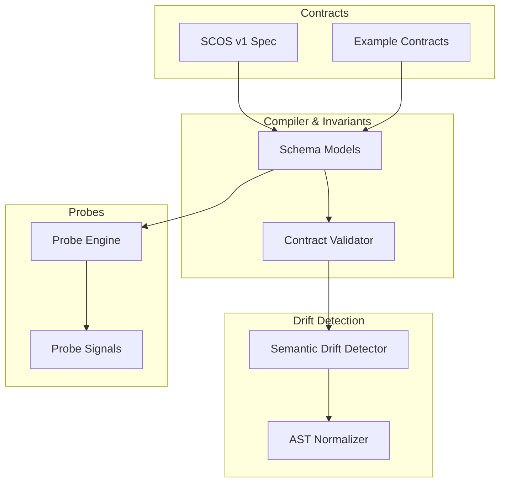
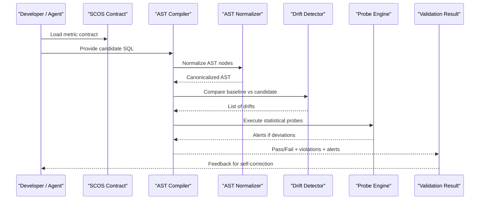
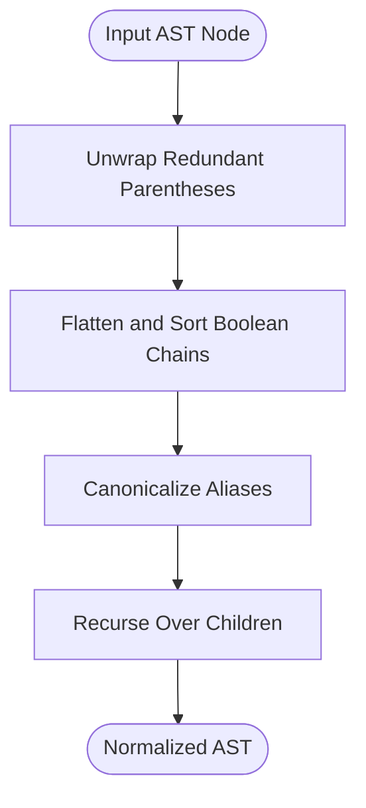
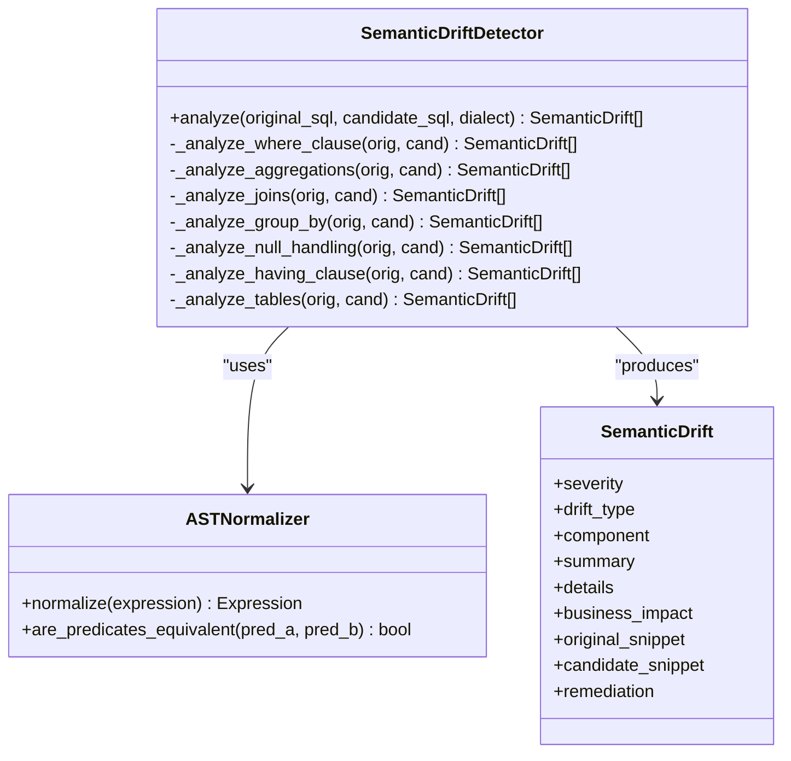
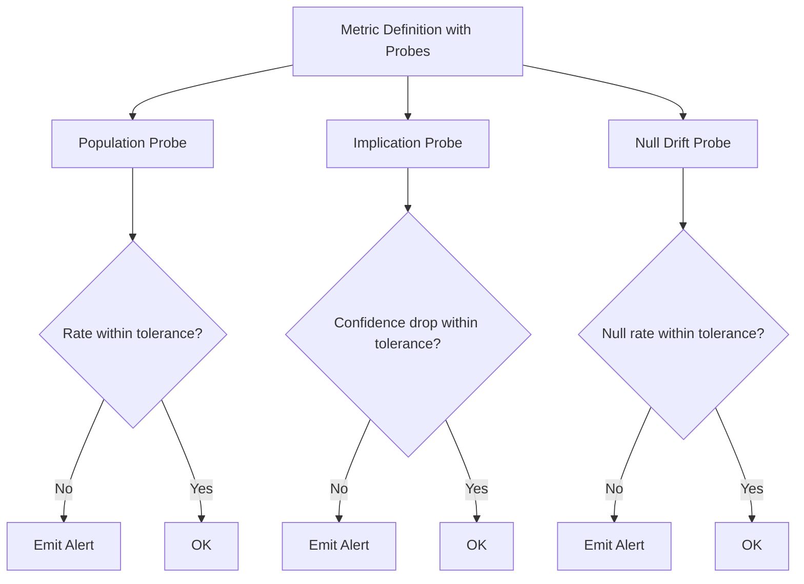
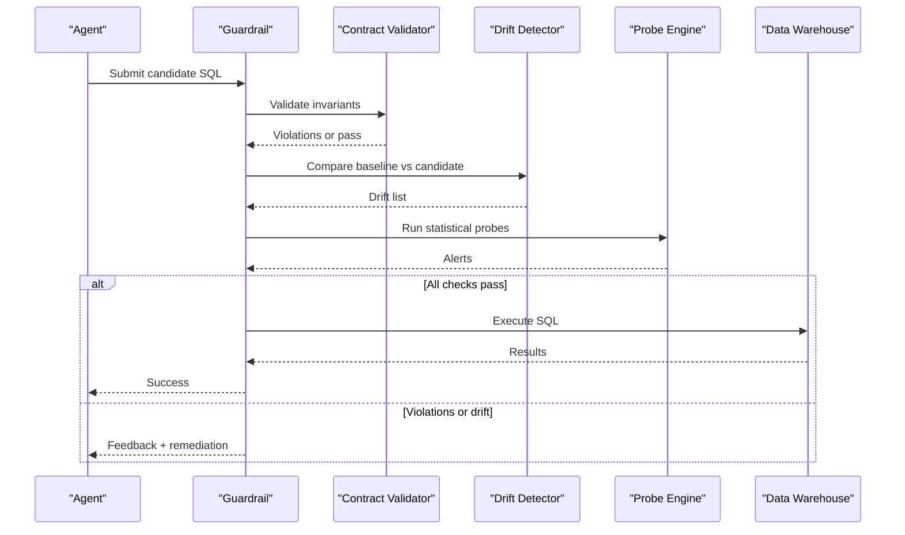
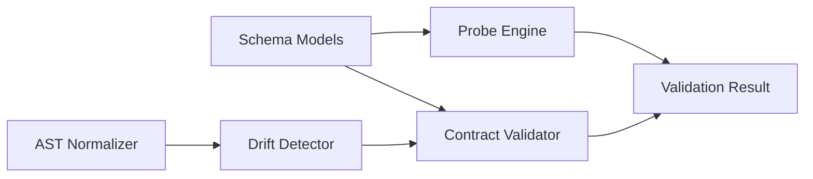

# Core Concepts

<cite>
**Referenced Files in This Document**
- [README.md](file://README.md)
- [SCOS_V1_SPECIFICATION.md](file://spec/SCOS_V1_SPECIFICATION.md)
- [schema.py](file://semantic_reliability/compiler/schema.py)
- [contracts.py](file://semantic_reliability/compiler/contracts.py)
- [detector.py](file://semantic_reliability/testing/drift/detector.py)
- [normalizer.py](file://semantic_reliability/testing/drift/normalizer.py)
- [rules.py](file://semantic_reliability/testing/drift/rules.py)
- [engine.py](file://semantic_reliability/probes/engine.py)
- [signals.py](file://semantic_reliability/probes/signals.py)
- [net_revenue_contract.yaml](file://examples/metrics/net_revenue_contract.yaml)
- [benchmark net_revenue contract.yaml](file://benchmark_corpus/dev/net_revenue/contract.yaml)
</cite>

## Table of Contents
1. [Introduction](#introduction)
2. [Project Structure](#project-structure)
3. [Core Components](#core-components)
4. [Architecture Overview](#architecture-overview)
5. [Detailed Component Analysis](#detailed-component-analysis)
6. [Dependency Analysis](#dependency-analysis)
7. [Performance Considerations](#performance-considerations)
8. [Troubleshooting Guide](#troubleshooting-guide)
9. [Conclusion](#conclusion)
10. [Appendices](#appendices)

## Introduction
This document explains the fundamental concepts behind semantic reliability engineering as implemented in this repository. It focuses on:
- What semantic reliability means for business metrics and AI-generated SQL
- The Semantic Contract Open Standard (SCOS) and how it governs metric definitions
- Abstract Syntax Tree (AST) normalization and deterministic semantic comparison
- Semantic drift detection and invariant violations
- The end-to-end flow from contract definition to execution validation
- Key terminology such as grain, identity, canonical SQL, semantic invariants, and statistical probes

The goal is to provide both conceptual understanding for beginners and technical implementation details for experienced developers.

## Project Structure
At a high level, the system revolves around:
- SCOS contracts that define canonical SQL and declarative invariants/probes
- An AST-based compiler that parses and validates candidate SQL against invariants
- A drift detector that compares baseline and candidate SQL at the AST level
- A probe engine that runs statistical checks against data snapshots or live connections
- Example contracts and benchmark corpus artifacts demonstrating real-world usage

**Diagram sources**
- [SCOS_V1_SPECIFICATION.md:31-114](file://spec/SCOS_V1_SPECIFICATION.md#L31-L114)
- [schema.py:31-98](file://semantic_reliability/compiler/schema.py#L31-L98)
- [contracts.py:26-135](file://semantic_reliability/compiler/contracts.py#L26-L135)
- [normalizer.py:6-93](file://semantic_reliability/testing/drift/normalizer.py#L6-L93)
- [detector.py:9-46](file://semantic_reliability/testing/drift/detector.py#L9-L46)
- [engine.py:11-38](file://semantic_reliability/probes/engine.py#L11-L38)
- [signals.py:5-18](file://semantic_reliability/probes/signals.py#L5-L18)

**Section sources**
- [README.md:22-45](file://README.md#L22-L45)
- [SCOS_V1_SPECIFICATION.md:31-114](file://spec/SCOS_V1_SPECIFICATION.md#L31-L114)

## Core Components
- SCOS Metric Contract: A declarative artifact defining identity, canonical SQL, semantic invariants, and statistical probes.
- AST Compiler and Validator: Parses SQL into an AST and enforces declared invariants deterministically.
- AST Normalizer: Canonicalizes expressions to eliminate false positives from commutativity and cosmetic differences.
- Semantic Drift Detector: Compares baseline and candidate SQL ASTs to detect structural and semantic changes.
- Statistical Probe Engine: Executes runtime checks over data to validate population rates, implications, and null drift.

These components together enable governance of business metrics by ensuring generated SQL remains semantically aligned with authoritative definitions.

**Section sources**
- [SCOS_V1_SPECIFICATION.md:31-114](file://spec/SCOS_V1_SPECIFICATION.md#L31-L114)
- [schema.py:31-98](file://semantic_reliability/compiler/schema.py#L31-L98)
- [contracts.py:26-135](file://semantic_reliability/compiler/contracts.py#L26-L135)
- [normalizer.py:6-93](file://semantic_reliability/testing/drift/normalizer.py#L6-L93)
- [detector.py:9-46](file://semantic_reliability/testing/drift/detector.py#L9-L46)
- [engine.py:11-38](file://semantic_reliability/probes/engine.py#L11-L38)

## Architecture Overview
The system enforces semantic reliability through a pipeline:
- Define a SCOS contract with canonical SQL and invariants
- Parse candidate SQL into an AST
- Normalize ASTs to ensure deterministic comparisons
- Validate invariants and detect drift between baseline and candidate
- Run statistical probes to observe data reality alignment
- Return pass/fail results with detailed diagnostics

**Diagram sources**
- [contracts.py:26-135](file://semantic_reliability/compiler/contracts.py#L26-L135)
- [normalizer.py:6-93](file://semantic_reliability/testing/drift/normalizer.py#L6-L93)
- [detector.py:9-46](file://semantic_reliability/testing/drift/detector.py#L9-L46)
- [engine.py:11-38](file://semantic_reliability/probes/engine.py#L11-L38)

## Detailed Component Analysis

### SCOS: Identity, Canonical SQL, Invariants, Probes
SCOS defines four orthogonal layers:
- Identity and registry: versioning, owner, domain, grain, dialect
- Canonical representation: signed SQL ground truth
- Semantic invariants: declarative rules enforced statically via AST analysis
- Statistical probes: runtime observability for population, implications, and null drift

Key schema models include:
- PopulationInvariant, GrainInvariant, AggregationInvariant, UnitInvariant, TimeInvariant
- MetricProbes with PopulationProbe, ImplicationProbe, NullDriftProbe
- MetricDefinition encapsulating all contract metadata

Example contracts demonstrate these layers in practice.

**Section sources**
- [SCOS_V1_SPECIFICATION.md:31-114](file://spec/SCOS_V1_SPECIFICATION.md#L31-L114)
- [schema.py:5-98](file://semantic_reliability/compiler/schema.py#L5-L98)
- [net_revenue_contract.yaml:1-39](file://examples/metrics/net_revenue_contract.yaml#L1-L39)
- [benchmark net_revenue contract.yaml:1-19](file://benchmark_corpus/dev/net_revenue/contract.yaml#L1-L19)

### AST Normalization and Deterministic Comparison
AST normalization ensures that logically equivalent SQL statements are recognized as such despite formatting or commutative differences:
- Unwraps redundant parentheses
- Flattens and sorts AND/OR chains
- Canonicalizes aliases
- Provides predicate equivalence checks

This enables deterministic semantic comparison without false positives from cosmetic variations.

**Diagram sources**
- [normalizer.py:6-93](file://semantic_reliability/testing/drift/normalizer.py#L6-L93)

**Section sources**
- [normalizer.py:6-93](file://semantic_reliability/testing/drift/normalizer.py#L6-L93)

### Semantic Drift Detection and Invariant Violations
The drift detector performs comprehensive AST-level inspection across:
- WHERE clause logic (filter removal/addition/logic shifts)
- Aggregations (function and expression changes)
- JOIN topology and predicates (missing ON clauses)
- GROUP BY grain changes
- NULL handling differences
- HAVING clause alterations
- Source table lineage changes

Invariants are enforced by the contract validator, which checks:
- Required and forbidden filters
- Required grouping dimensions
- Positive/negative aggregation components
- Timezone constraints

**Diagram sources**
- [detector.py:9-246](file://semantic_reliability/testing/drift/detector.py#L9-L246)
- [normalizer.py:6-93](file://semantic_reliability/testing/drift/normalizer.py#L6-L93)
- [rules.py:6-41](file://semantic_reliability/testing/drift/rules.py#L6-L41)

**Section sources**
- [detector.py:9-246](file://semantic_reliability/testing/drift/detector.py#L9-L246)
- [rules.py:6-41](file://semantic_reliability/testing/drift/rules.py#L6-L41)
- [contracts.py:26-135](file://semantic_reliability/compiler/contracts.py#L26-L135)

### Statistical Probes: Runtime Observability
The probe engine executes declarative probes against data to catch silent reality drift:
- Population probes: measure filter selection rates and alert on deviation
- Implication probes: verify logical dependencies (e.g., active implies positive amount)
- Null drift probes: monitor critical column null rates

Alerts are structured signals indicating baseline vs current values, confidence levels, likely causes, and recommended actions.

**Diagram sources**
- [engine.py:11-138](file://semantic_reliability/probes/engine.py#L11-L138)
- [signals.py:5-18](file://semantic_reliability/probes/signals.py#L5-L18)

**Section sources**
- [engine.py:11-138](file://semantic_reliability/probes/engine.py#L11-L138)
- [signals.py:5-18](file://semantic_reliability/probes/signals.py#L5-L18)

### Relationship Between Contracts, Generated SQL, and Validation Results
- Contracts define canonical SQL and invariants/probes
- Generated SQL is parsed into an AST and normalized
- Invariant enforcement yields pass/fail with specific violations
- Drift detection highlights structural/semantic changes relative to baseline
- Probes surface runtime anomalies in data behavior
- Results guide agent self-correction or block execution until compliance

**Diagram sources**
- [contracts.py:26-135](file://semantic_reliability/compiler/contracts.py#L26-L135)
- [detector.py:9-46](file://semantic_reliability/testing/drift/detector.py#L9-L46)
- [engine.py:11-38](file://semantic_reliability/probes/engine.py#L11-L38)

**Section sources**
- [contracts.py:26-135](file://semantic_reliability/compiler/contracts.py#L26-L135)
- [detector.py:9-46](file://semantic_reliability/testing/drift/detector.py#L9-L46)
- [engine.py:11-38](file://semantic_reliability/probes/engine.py#L11-L38)

## Dependency Analysis
Key dependencies and relationships:
- Schema models define contract structure consumed by validators and probe engines
- Contract validator depends on schema models and uses SQL parsing libraries
- Drift detector depends on AST normalizer and produces structured drift reports
- Probe engine depends on schema-defined probes and emits structured alerts

**Diagram sources**
- [schema.py:31-98](file://semantic_reliability/compiler/schema.py#L31-L98)
- [contracts.py:26-135](file://semantic_reliability/compiler/contracts.py#L26-L135)
- [normalizer.py:6-93](file://semantic_reliability/testing/drift/normalizer.py#L6-L93)
- [detector.py:9-46](file://semantic_reliability/testing/drift/detector.py#L9-L46)
- [engine.py:11-38](file://semantic_reliability/probes/engine.py#L11-L38)

**Section sources**
- [schema.py:31-98](file://semantic_reliability/compiler/schema.py#L31-L98)
- [contracts.py:26-135](file://semantic_reliability/compiler/contracts.py#L26-L135)
- [normalizer.py:6-93](file://semantic_reliability/testing/drift/normalizer.py#L6-L93)
- [detector.py:9-46](file://semantic_reliability/testing/drift/detector.py#L9-L46)
- [engine.py:11-38](file://semantic_reliability/probes/engine.py#L11-L38)

## Performance Considerations
- AST normalization reduces false positives by canonicalizing expressions; this adds overhead but improves accuracy
- Drift detection operates on parsed ASTs; complexity scales with query size and number of relational algebra components
- Probe queries run against data snapshots or live connections; design probes to be efficient and targeted
- Batch processing of multiple contracts can improve throughput in CI/CD pipelines

[No sources needed since this section provides general guidance]

## Troubleshooting Guide
Common issues and resolutions:
- Missing required filters: Add the specified filters to the WHERE clause as indicated by invariant violations
- Incorrect grouping dimensions: Include required dimensions in GROUP BY to match the declared grain
- Aggregation mismatches: Ensure positive and negative components are included in calculations
- Timezone drift: Align timestamps to UTC when required by invariants
- Join predicate mutations: Restore explicit ON clauses to avoid Cartesian products
- Probe alerts: Investigate upstream schema or data changes causing population rate, implication confidence, or null rate shifts

Use the violation messages and remediation hints provided by the contract validator and drift detector to correct issues before re-execution.

**Section sources**
- [contracts.py:44-128](file://semantic_reliability/compiler/contracts.py#L44-L128)
- [detector.py:49-246](file://semantic_reliability/testing/drift/detector.py#L49-L246)
- [engine.py:40-138](file://semantic_reliability/probes/engine.py#L40-L138)

## Conclusion
Semantic reliability engineering, as implemented here, provides a robust framework for governing business metrics through:
- Declarative SCOS contracts that capture identity, canonical SQL, invariants, and probes
- Deterministic AST normalization enabling precise semantic comparison
- Comprehensive drift detection to identify structural and semantic changes
- Statistical probes to monitor data reality and catch silent drift
Together, these mechanisms ensure that generated SQL remains faithful to business definitions and that any deviations are detected and addressed before execution.

[No sources needed since this section summarizes without analyzing specific files]

## Appendices

### Key Terminology
- Grain: The reporting dimensionality and entity level (e.g., customer_month), declared in contracts and enforced via grouping checks
- Identity: Unique metric identifier and versioning metadata used to track evolution and ownership
- Canonical SQL: The signed, human-authorized implementation serving as the ground-truth oracle
- Semantic Invariants: Declarative rules enforced statically via AST analysis (filters, grain, aggregation, timezone)
- Statistical Probes: Runtime checks validating population rates, logical implications, and null drift

**Section sources**
- [SCOS_V1_SPECIFICATION.md:92-114](file://spec/SCOS_V1_SPECIFICATION.md#L92-L114)
- [schema.py:5-98](file://semantic_reliability/compiler/schema.py#L5-L98)