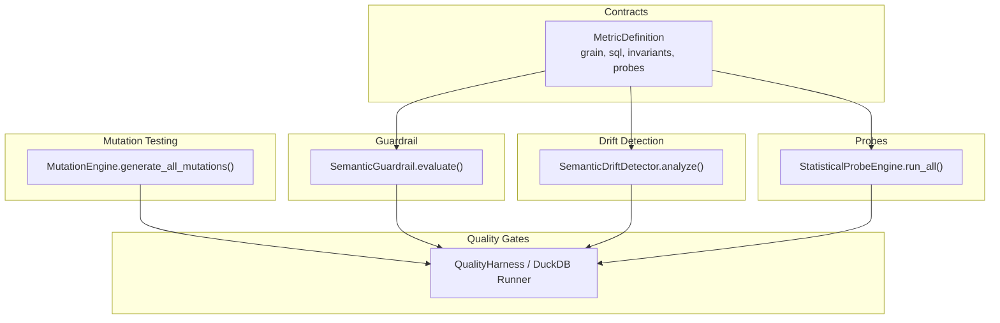
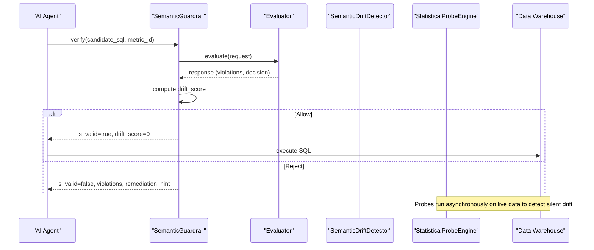
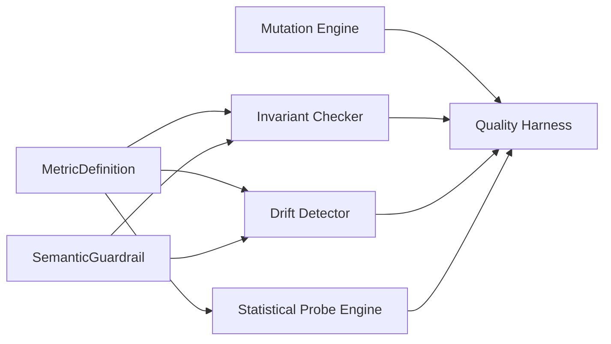

# Core Terminology

<cite>
**Referenced Files in This Document**
- [README.md](file://README.md)
- [SCOS_V1_SPECIFICATION.md](file://spec/SCOS_V1_SPECIFICATION.md)
- [schema.py](file://semantic_reliability/compiler/schema.py)
- [contracts.py](file://semantic_reliability/compiler/contracts.py)
- [coverage.py](file://semantic_reliability/compiler/coverage.py)
- [guardrail.py](file://semantic_reliability/guardrail.py)
- [engine.py (drift detector)](file://semantic_reliability/testing/drift/detector.py)
- [rules.py (drift types/severities)](file://semantic_reliability/testing/drift/rules.py)
- [normalizer.py (AST normalizer)](file://semantic_reliability/testing/drift/normalizer.py)
- [engine.py (mutation engine)](file://semantic_reliability/testing/mutations/engine.py)
- [mutators.py](file://semantic_reliability/testing/mutations/mutators.py)
- [duckdb_runner.py](file://semantic_reliability/harness/duckdb_runner.py)
- [quality_harness.py](file://semantic_reliability/harness/quality_harness.py)
- [sarif_exporter.py](file://semantic_reliability/harness/sarif_exporter.py)
- [probes engine.py](file://semantic_reliability/probes/engine.py)
- [signals.py](file://semantic_reliability/probes/signals.py)
- [contract.yaml (net_revenue)](file://benchmark_corpus/dev/net_revenue/contract.yaml)
- [semantic_assertions.yaml (net_revenue)](file://benchmark_corpus/dev/net_revenue/semantic_assertions.yaml)
- [test_drift_detector.py](file://tests/test_drift_detector.py)
- [test_duckdb_runner.py](file://tests/test_duckdb_runner.py)
- [test_agent_eval.py](file://tests/test_agent_eval.py)
</cite>

## Table of Contents
1. Introduction
2. Project Structure
3. Core Components
4. Architecture Overview
5. Detailed Component Analysis
6. Dependency Analysis
7. Performance Considerations
8. Troubleshooting Guide
9. Conclusion
10. Appendices

## Introduction
This document defines and explains the key terminology used throughout the semantic reliability framework, with a focus on how these terms interrelate to ensure business-semantic correctness for AI-generated SQL. It provides clear definitions, practical examples grounded in the codebase, common misconceptions, and guidance for proper usage. The goal is to serve as a glossary for both newcomers and experienced users.

## Project Structure
The repository implements a contract-first approach:
- Contracts define canonical metrics, invariants, and probes.
- A guardrail enforces invariants before execution.
- Drift detection compares baseline vs candidate SQL at the AST level.
- Mutation testing injects precise AST-level changes to validate test coverage.
- Statistical probes monitor live data for silent drift.
- Quality harnesses aggregate results into quality gates.

**Diagram sources**
- [schema.py:83-96](file://semantic_reliability/compiler/schema.py#L83-L96)
- [guardrail.py:45-126](file://semantic_reliability/guardrail.py#L45-L126)
- [engine.py (drift detector):9-46](file://semantic_reliability/testing/drift/detector.py#L9-L46)
- [engine.py (mutation engine):8-52](file://semantic_reliability/testing/mutations/engine.py#L8-L52)
- [probes engine.py:11-38](file://semantic_reliability/probes/engine.py#L11-L38)
- [duckdb_runner.py:185-214](file://semantic_reliability/harness/duckdb_runner.py#L185-L214)
- [quality_harness.py:34-113](file://semantic_reliability/harness/quality_harness.py#L34-L113)

**Section sources**
- [README.md:22-45](file://README.md#L22-L45)
- [SCOS_V1_SPECIFICATION.md:31-114](file://spec/SCOS_V1_SPECIFICATION.md#L31-L114)

## Core Components
- MetricDefinition: The canonical contract that declares metric identity, grain, canonical SQL, invariants, and probes.
- Semantic Invariants: Declarative rules (e.g., required filters, forbidden filters, grouping dimensions) enforced against candidate SQL.
- Statistical Probes: Runtime checks over warehouse data to detect silent drift in populations, implications, or null rates.
- Drift Detection: AST-based comparison between baseline and candidate SQL to identify structural and semantic changes.
- Mutation Testing: Deterministic injection of AST-level mutations to evaluate test suite robustness.
- Quality Gates: Aggregated decisions (allow/reject) based on invariant violations, drift severity, probe alerts, and mutation catch rates.

Practical anchors:
- Grain appears in contracts and is enforced via grouping checks.
- Canonical SQL is the signed ground truth used for comparisons and replay.
- Statistical probes run against live connections to observe reality drift.
- Drift detection flags changes like filter removal, aggregation shifts, join predicate loss, and grain drift.
- Mutation testing validates whether tests catch realistic bugs.
- Quality gates combine all signals into pass/fail outcomes.

**Section sources**
- [schema.py:83-96](file://semantic_reliability/compiler/schema.py#L83-L96)
- [contracts.py:44-90](file://semantic_reliability/compiler/contracts.py#L44-L90)
- [probes engine.py:11-38](file://semantic_reliability/probes/engine.py#L11-L38)
- [engine.py (drift detector):9-46](file://semantic_reliability/testing/drift/detector.py#L9-L46)
- [engine.py (mutation engine):8-52](file://semantic_reliability/testing/mutations/engine.py#L8-L52)
- [quality_harness.py:34-113](file://semantic_reliability/harness/quality_harness.py#L34-L113)

## Architecture Overview
The system evaluates generated SQL against a contract before execution, detects semantic drift, monitors runtime data health, and measures test robustness through mutation testing. Decisions are gated by policy and reported via standardized outputs.

**Diagram sources**
- [guardrail.py:93-126](file://semantic_reliability/guardrail.py#L93-L126)
- [engine.py (drift detector):12-46](file://semantic_reliability/testing/drift/detector.py#L12-L46)
- [probes engine.py:18-38](file://semantic_reliability/probes/engine.py#L18-L38)

## Detailed Component Analysis

### Grain
- Definition: The reporting dimensionality and entity level of a metric (e.g., customer_month). Declared in contracts and enforced by ensuring required grouping dimensions are present in GROUP BY.
- Implementation highlights:
  - Contract schema includes grain as a required field.
  - Invariant enforcement checks required grouping dimensions.
  - Drift detection reports grain drift when GROUP BY expressions change.
- Practical example:
  - A net revenue metric declares grain customer_month; candidate SQL must group by customer_id and month.
  - Tests assert that missing grain triggers violations.
- Common misconceptions:
  - Grain is not just a column name; it is the full set of grouping dimensions that define output uniqueness.
  - Changing time truncation functions can alter grain semantics even if names look similar.
- Proper usage:
  - Always declare grain explicitly in contracts.
  - Ensure GROUP BY matches declared dimensions exactly.

**Section sources**
- [SCOS_V1_SPECIFICATION.md:92-97](file://spec/SCOS_V1_SPECIFICATION.md#L92-L97)
- [schema.py:83-96](file://semantic_reliability/compiler/schema.py#L83-L96)
- [contracts.py:67-90](file://semantic_reliability/compiler/contracts.py#L67-L90)
- [engine.py (drift detector):166-187](file://semantic_reliability/testing/drift/detector.py#L166-L187)
- [test_agent_eval.py:38-49](file://tests/test_agent_eval.py#L38-L49)

### Identity
- Definition: The unique, versioned identifier for a metric contract, typically a URN scoped by domain and metric slug.
- Implementation highlights:
  - SCOS specification defines identity fields including scos_version, id, metric, version, owner, domain.
  - MCP registry resolves URNs and versions for contracts.
- Practical example:
  - A finance net revenue contract uses a URN under the finance domain and is resolved via URI patterns.
- Common misconceptions:
  - Identity is not just the metric name; it includes versioning and domain scoping for governance.
- Proper usage:
  - Use stable URNs and semantic versions to track evolution and enable reproducible evaluations.

**Section sources**
- [SCOS_V1_SPECIFICATION.md:92-97](file://spec/SCOS_V1_SPECIFICATION.md#L92-L97)
- [test_mcp_server.py:246-266](file://tests/test_mcp_server.py#L246-L266)

### Canonical SQL
- Definition: The signed, human-authorized implementation of the metric that serves as the ground-truth oracle for mutation testing, dry-runs, and replay workers.
- Implementation highlights:
  - Included in MetricDefinition.sql and referenced across evaluation and replay flows.
  - Used as baseline for drift detection and mutation generation.
- Practical example:
  - Net revenue canonical SQL specifies invoice minus refund sums with active NA filters and monthly grouping.
- Common misconceptions:
  - Canonical SQL is not an optimization target; it is the authoritative definition to which candidates are compared.
- Proper usage:
  - Keep canonical SQL immutable and versioned; any changes should be treated as metric redefinition.

**Section sources**
- [SCOS_V1_SPECIFICATION.md:98-100](file://spec/SCOS_V1_SPECIFICATION.md#L98-L100)
- [contract.yaml (net_revenue):1-19](file://benchmark_corpus/dev/net_revenue/contract.yaml#L1-L19)
- [engine.py (drift detector):12-21](file://semantic_reliability/testing/drift/detector.py#L12-L21)

### Semantic Invariants
- Definition: Declarative rules that constrain candidate SQL to adhere to business logic (e.g., required filters, forbidden filters, required grouping dimensions, aggregation constraints).
- Implementation highlights:
  - Enforced via AST parsing and normalization; violations include missing filters, wrong grouping, or changed aggregations.
  - Coverage module maps metric domains to required invariant dimensions.
- Practical example:
  - Required filters for active status and region are checked in WHERE; grouping dimensions are validated in GROUP BY.
- Common misconceptions:
  - Invariants are not optional style rules; they encode business-critical constraints.
  - Passing structural tests does not imply semantic compliance.
- Proper usage:
  - Define explicit invariants per metric; treat violations as critical defects.

**Section sources**
- [SCOS_V1_SPECIFICATION.md:102-108](file://spec/SCOS_V1_SPECIFICATION.md#L102-L108)
- [contracts.py:44-90](file://semantic_reliability/compiler/contracts.py#L44-L90)
- [coverage.py:71-102](file://semantic_reliability/compiler/coverage.py#L71-L102)

### Statistical Probes
- Definition: Declarative runtime checks executed against live data to detect silent drift in population rates, logical implications, and null rates.
- Implementation highlights:
  - Population probes compare current rates to baselines within tolerances.
  - Implication probes measure confidence of logical dependencies.
  - Null drift probes monitor null rates for required columns.
- Practical example:
  - A population probe ensures active status rate stays within expected bounds; implication probes enforce that active records have positive amounts.
- Common misconceptions:
  - Probes are not replacements for invariants; they complement them by observing real-world data behavior.
- Proper usage:
  - Configure baseline rates and tolerances conservatively; investigate alerts promptly.

**Section sources**
- [SCOS_V1_SPECIFICATION.md:109-114](file://spec/SCOS_V1_SPECIFICATION.md#L109-L114)
- [probes engine.py:18-38](file://semantic_reliability/probes/engine.py#L18-L38)
- [probes engine.py:40-71](file://semantic_reliability/probes/engine.py#L40-L71)
- [probes engine.py:73-110](file://semantic_reliability/probes/engine.py#L73-L110)
- [probes engine.py:112-137](file://semantic_reliability/probes/engine.py#L112-L137)

### Drift Detection
- Definition: AST-based analysis comparing baseline (canonical) SQL to candidate SQL to identify structural and semantic changes such as filter removal, aggregation shifts, join predicate loss, and grain drift.
- Implementation highlights:
  - Parses both SQLs and inspects WHERE, SELECT aggregations, JOINs, GROUP BY, HAVING, COALESCE, and source tables.
  - Reports drift types with severity levels and remediation hints.
- Practical example:
  - Dropping a WHERE conjunct triggers FILTER_REMOVAL; changing GROUP BY triggers GRAIN_DRIFT.
- Common misconceptions:
  - Drift detection is not about performance tuning; it is about preserving business semantics.
- Proper usage:
  - Treat high/fatal drift as blockers; require review and approval for changes.

**Section sources**
- [engine.py (drift detector):9-46](file://semantic_reliability/testing/drift/detector.py#L9-L46)
- [engine.py (drift detector):48-91](file://semantic_reliability/testing/drift/detector.py#L48-L91)
- [engine.py (drift detector):93-131](file://semantic_reliability/testing/drift/detector.py#L93-L131)
- [engine.py (drift detector):133-164](file://semantic_reliability/testing/drift/detector.py#L133-L164)
- [engine.py (drift detector):166-187](file://semantic_reliability/testing/drift/detector.py#L166-L187)
- [engine.py (drift detector):189-205](file://semantic_reliability/testing/drift/detector.py#L189-L205)
- [engine.py (drift detector):207-225](file://semantic_reliability/testing/drift/detector.py#L207-L225)
- [engine.py (drift detector):227-245](file://semantic_reliability/testing/drift/detector.py#L227-L245)
- [test_drift_detector.py:17-28](file://tests/test_drift_detector.py#L17-L28)
- [test_drift_detector.py:70-83](file://tests/test_drift_detector.py#L70-L83)

### Mutation Testing
- Definition: Deterministic injection of AST-level logical mutations (e.g., filter drop, boundary shift, aggregation swap, join predicate drop, grain drop, coalesce bypass, math operator invert) to evaluate whether existing tests catch realistic defects.
- Implementation highlights:
  - MutationEngine generates multiple mutation types per base SQL.
  - DuckDB runner executes baseline vs mutated SQL and classifies outcomes (equivalent, detected, survived).
  - Quality harness aggregates results into a mutation score.
- Practical example:
  - FILTER_DROP removes a WHERE conjunct; tests should detect resulting row count/value variance.
- Common misconceptions:
  - Mutation testing is not about finding syntax errors; it is about validating semantic robustness.
- Proper usage:
  - Aim to maximize effective catch score; treat surviving mutations as blind spots requiring new assertions.

**Section sources**
- [engine.py (mutation engine):8-52](file://semantic_reliability/testing/mutations/engine.py#L8-L52)
- [engine.py (mutation engine):54-83](file://semantic_reliability/testing/mutations/engine.py#L54-L83)
- [engine.py (mutation engine):85-128](file://semantic_reliability/testing/mutations/engine.py#L85-L128)
- [engine.py (mutation engine):130-173](file://semantic_reliability/testing/mutations/engine.py#L130-L173)
- [engine.py (mutation engine):175-205](file://semantic_reliability/testing/mutations/engine.py#L175-L205)
- [engine.py (mutation engine):207-221](file://semantic_reliability/testing/mutations/engine.py#L207-L221)
- [engine.py (mutation engine):223-237](file://semantic_reliability/testing/mutations/engine.py#L223-L237)
- [engine.py (mutation engine):240-268](file://semantic_reliability/testing/mutations/engine.py#L240-L268)
- [duckdb_runner.py:185-214](file://semantic_reliability/harness/duckdb_runner.py#L185-L214)
- [quality_harness.py:34-113](file://semantic_reliability/harness/quality_harness.py#L34-L113)
- [test_duckdb_runner.py:40-71](file://tests/test_duckdb_runner.py#L40-L71)

### Quality Gates
- Definition: Aggregated decision points that determine whether a candidate SQL is allowed to execute or requires review/rejection, based on invariant violations, drift severity, probe alerts, and mutation catch rates.
- Implementation highlights:
  - Guardrail computes a drift score and returns allow/reject decisions with remediation hints.
  - SARIF exporter standardizes rule IDs and severity levels for CI integration.
  - Quality harness produces mutation scores to gate test suite adequacy.
- Practical example:
  - A query missing required filters receives a reject decision with a remediation hint to add the filter.
- Common misconceptions:
  - Quality gates are not only about runtime failures; they include static semantic checks and statistical signals.
- Proper usage:
  - Configure strict mode where appropriate; integrate SARIF outputs into CI pipelines to block risky changes.

**Section sources**
- [guardrail.py:93-126](file://semantic_reliability/guardrail.py#L93-L126)
- [sarif_exporter.py:36-65](file://semantic_reliability/harness/sarif_exporter.py#L36-L65)
- [quality_harness.py:34-113](file://semantic_reliability/harness/quality_harness.py#L34-L113)

## Dependency Analysis
Key relationships:
- MetricDefinition drives invariant checks, drift detection targets, and probe configurations.
- SemanticGuardrail orchestrates evaluation and decision-making using invariants and drift scoring.
- Drift detection depends on AST normalization and rule classification.
- Mutation testing depends on deterministic AST mutations and execution harnesses.
- Statistical probes depend on live connections and baseline parameters.

**Diagram sources**
- [schema.py:83-96](file://semantic_reliability/compiler/schema.py#L83-L96)
- [guardrail.py:93-126](file://semantic_reliability/guardrail.py#L93-L126)
- [engine.py (drift detector):9-46](file://semantic_reliability/testing/drift/detector.py#L9-L46)
- [engine.py (mutation engine):8-52](file://semantic_reliability/testing/mutations/engine.py#L8-L52)
- [probes engine.py:18-38](file://semantic_reliability/probes/engine.py#L18-L38)
- [quality_harness.py:34-113](file://semantic_reliability/harness/quality_harness.py#L34-L113)

**Section sources**
- [schema.py:83-96](file://semantic_reliability/compiler/schema.py#L83-L96)
- [guardrail.py:93-126](file://semantic_reliability/guardrail.py#L93-L126)
- [engine.py (drift detector):9-46](file://semantic_reliability/testing/drift/detector.py#L9-L46)
- [engine.py (mutation engine):8-52](file://semantic_reliability/testing/mutations/engine.py#L8-L52)
- [probes engine.py:18-38](file://semantic_reliability/probes/engine.py#L18-L38)
- [quality_harness.py:34-113](file://semantic_reliability/harness/quality_harness.py#L34-L113)

## Performance Considerations
- AST parsing and normalization are deterministic and efficient for typical SQL sizes; avoid overly complex queries in hot paths.
- Drift detection performs multiple AST scans; batch evaluations where possible.
- Statistical probes execute lightweight COUNT/CASE queries; tune tolerances to reduce false positives.
- Mutation testing can be expensive; run offline or against fixtures to minimize compute costs.
- Integrate SARIF outputs into CI to fail fast on critical issues.

[No sources needed since this section provides general guidance]

## Troubleshooting Guide
Common issues and resolutions:
- Missing required filters: Add the specified filter to the WHERE clause as indicated by invariant violations.
- Grain mismatch: Include required grouping dimensions in GROUP BY to match declared grain.
- Join predicate missing: Restore ON clauses to prevent Cartesian products.
- Probe alerts: Investigate upstream schema or ETL changes causing population or null rate shifts.
- Mutation survival: Add targeted assertions to catch specific mutation types.

**Section sources**
- [contracts.py:44-90](file://semantic_reliability/compiler/contracts.py#L44-L90)
- [engine.py (drift detector):48-91](file://semantic_reliability/testing/drift/detector.py#L48-L91)
- [engine.py (drift detector):133-164](file://semantic_reliability/testing/drift/detector.py#L133-L164)
- [probes engine.py:40-71](file://semantic_reliability/probes/engine.py#L40-L71)
- [probes engine.py:112-137](file://semantic_reliability/probes/engine.py#L112-L137)
- [quality_harness.py:34-113](file://semantic_reliability/harness/quality_harness.py#L34-L113)

## Conclusion
This glossary clarifies core concepts—grain, identity, canonical SQL, semantic invariants, statistical probes, drift detection, mutation testing, and quality gates—and shows how they work together to protect business semantics in AI-generated SQL. By defining contracts precisely, enforcing invariants, monitoring runtime data, detecting drift, and validating tests via mutation, teams can build reliable, auditable analytics pipelines.

[No sources needed since this section summarizes without analyzing specific files]

## Appendices

### Glossary
- Grain: Reporting dimensionality and entity level declared in contracts and enforced via grouping dimensions.
- Identity: Unique, versioned metric contract identifier (URN) scoped by domain and metric slug.
- Canonical SQL: Signed ground-truth implementation of the metric used as the oracle for comparisons and replay.
- Semantic Invariants: Declarative rules constraining candidate SQL to business logic (filters, grouping, aggregation).
- Statistical Probes: Runtime checks over live data to detect silent drift in populations, implications, and null rates.
- Drift Detection: AST-based comparison identifying structural and semantic changes between baseline and candidate SQL.
- Mutation Testing: Deterministic injection of AST-level mutations to evaluate test suite robustness.
- Quality Gates: Aggregated decisions (allow/reject) based on invariant violations, drift severity, probe alerts, and mutation catch rates.

**Section sources**
- [SCOS_V1_SPECIFICATION.md:92-114](file://spec/SCOS_V1_SPECIFICATION.md#L92-L114)
- [schema.py:83-96](file://semantic_reliability/compiler/schema.py#L83-L96)
- [guardrail.py:93-126](file://semantic_reliability/guardrail.py#L93-L126)
- [engine.py (drift detector):9-46](file://semantic_reliability/testing/drift/detector.py#L9-L46)
- [engine.py (mutation engine):8-52](file://semantic_reliability/testing/mutations/engine.py#L8-L52)
- [probes engine.py:18-38](file://semantic_reliability/probes/engine.py#L18-L38)
- [quality_harness.py:34-113](file://semantic_reliability/harness/quality_harness.py#L34-L113)