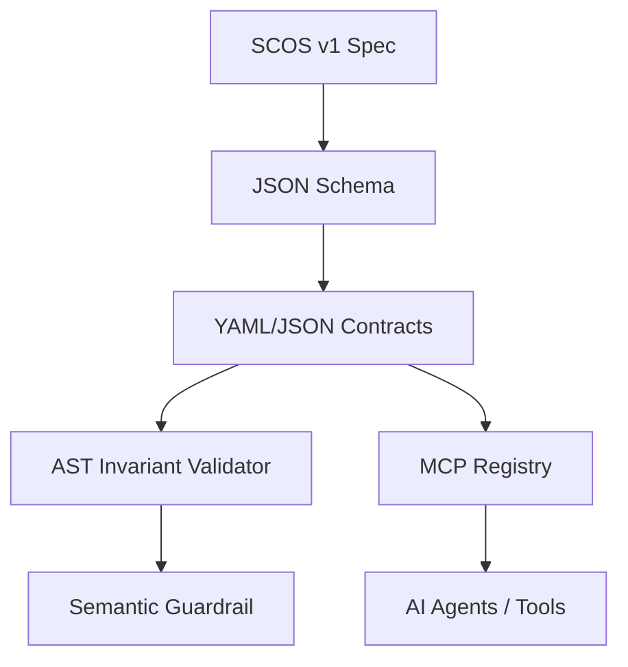
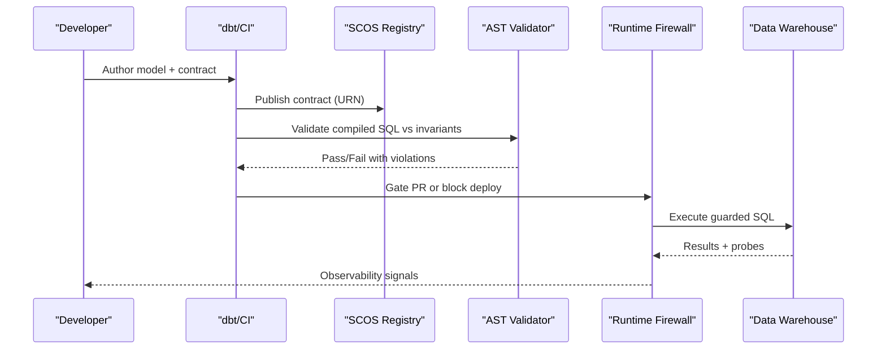
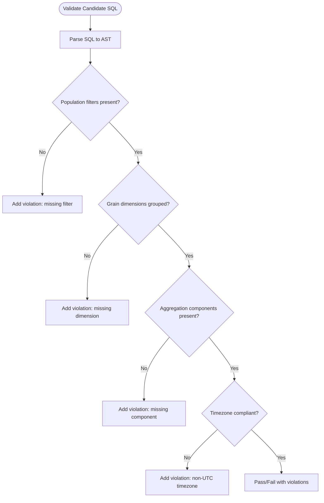
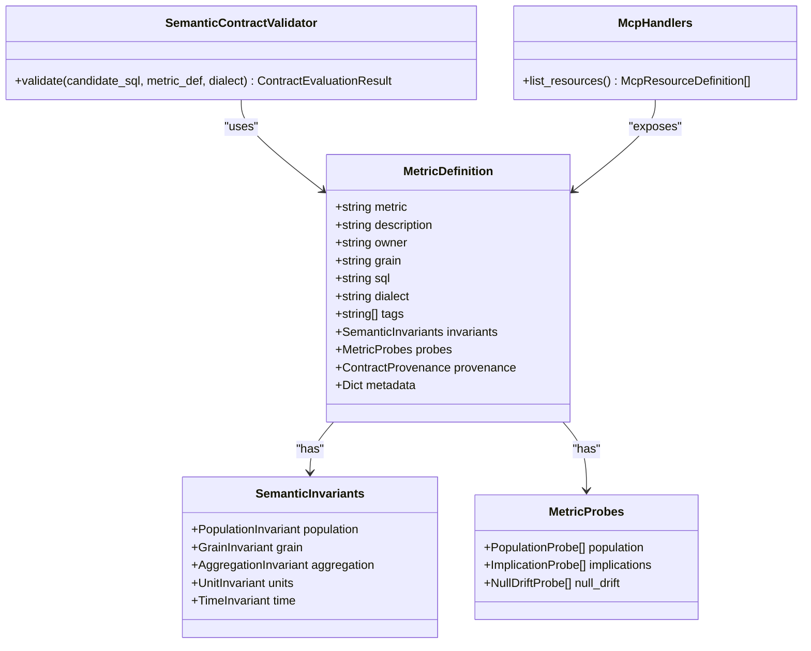

# SCOS Specification

<cite>
**Referenced Files in This Document**
- [SCOS_V1_SPECIFICATION.md](file://spec/SCOS_V1_SPECIFICATION.md)
- [scos-v1.schema.json](file://spec/scos-v1.schema.json)
- [README.md](file://README.md)
- [contracts.py](file://semantic_reliability/compiler/contracts.py)
- [schema.py](file://semantic_reliability/compiler/schema.py)
- [coverage.py](file://semantic_reliability/compiler/coverage.py)
- [handlers.py](file://semantic_reliability/mcp/handlers.py)
- [net_revenue_contract.yaml](file://examples/metrics/net_revenue_contract.yaml)
- [net_revenue contract.yaml](file://benchmark_corpus/dev/net_revenue/contract.yaml)
- [monthly_active_users contract.yaml](file://benchmark_corpus/dev/monthly_active_users/contract.yaml)
</cite>

## Table of Contents
1. [Introduction](#introduction)
2. [Project Structure](#project-structure)
3. [Core Components](#core-components)
4. [Architecture Overview](#architecture-overview)
5. [Detailed Component Analysis](#detailed-component-analysis)
6. [Dependency Analysis](#dependency-analysis)
7. [Performance Considerations](#performance-considerations)
8. [Troubleshooting Guide](#troubleshooting-guide)
9. [Conclusion](#conclusion)
10. [Appendices](#appendices)

## Introduction
The Semantic Contract Open Standard (SCOS) v1.0.0 defines a vendor-neutral, declarative specification for business metric contracts. It binds analytical logic to machine-readable rules that enforce semantic correctness across ecosystems such as dbt, CI/CD gates, runtime firewalls, and AI agent workflows. SCOS specifies:
- Identity and governance headers
- Canonical SQL ground truth
- AST-based semantic invariants (population, grain, aggregation, deduction, time)
- Statistical reality probes (population rates, implications, null drift)

It enables deterministic validation of candidate SQL against declared invariants and provides runtime observability to detect silent semantic drift.

**Section sources**
- [SCOS_V1_SPECIFICATION.md:9-134](file://spec/SCOS_V1_SPECIFICATION.md#L9-L134)
- [README.md:14-46](file://README.md#L14-L46)

## Project Structure
At the heart of SCOS are two artifacts:
- The formal specification document describing layers, fields, and conformance requirements
- A JSON Schema defining strict validation rules for SCOS contracts

In this repository, example contracts demonstrate real-world usage across financial and product metrics. The implementation includes an AST-based validator and MCP server integration for registry access.

**Diagram sources**
- [SCOS_V1_SPECIFICATION.md:31-134](file://spec/SCOS_V1_SPECIFICATION.md#L31-L134)
- [scos-v1.schema.json:1-163](file://spec/scos-v1.schema.json#L1-L163)
- [handlers.py:287-313](file://semantic_reliability/mcp/handlers.py#L287-L313)
- [contracts.py:26-135](file://semantic_reliability/compiler/contracts.py#L26-L135)

**Section sources**
- [SCOS_V1_SPECIFICATION.md:31-134](file://spec/SCOS_V1_SPECIFICATION.md#L31-L134)
- [scos-v1.schema.json:1-163](file://spec/scos-v1.schema.json#L1-L163)

## Core Components
SCOS contracts consist of four orthogonal layers:

- Identity & Governance Header
  - scos_version, id, metric, version, owner, domain, grain, dialect, description, tags, metadata
- Canonical Ground Truth
  - sql: signed, human-authorized query representing the metric
- AST Semantic Invariants
  - population: required_filters, forbidden_filters
  - grain: required_dimensions, allow_over_aggregation
  - aggregation: required_function, positive_components, negative_components
  - units: currency, scale
  - time: timezone, period_grain
  - deduction: required_subtractions
- Statistical Reality Probes
  - population: predicate with min_rate/max_rate
  - implications: antecedent/consequent with min_confidence
  - null_drift: column with max_null_rate

These layers enable deterministic static enforcement and runtime observability.

**Section sources**
- [SCOS_V1_SPECIFICATION.md:31-114](file://spec/SCOS_V1_SPECIFICATION.md#L31-L114)
- [scos-v1.schema.json:8-160](file://spec/scos-v1.schema.json#L8-L160)
- [schema.py:5-98](file://semantic_reliability/compiler/schema.py#L5-L98)

## Architecture Overview
SCOS integrates into multiple systems:
- CI/CD and dbt pipelines validate compiled SQL against contracts
- Runtime firewall enforces invariants before execution
- MCP server exposes contracts and invariants to agents and tools
- Evaluation harness runs mutation tests and replay trajectories

**Diagram sources**
- [SCOS_V1_SPECIFICATION.md:117-134](file://spec/SCOS_V1_SPECIFICATION.md#L117-L134)
- [README.md:22-46](file://README.md#L22-L46)
- [handlers.py:287-313](file://semantic_reliability/mcp/handlers.py#L287-L313)
- [contracts.py:26-135](file://semantic_reliability/compiler/contracts.py#L26-L135)

## Detailed Component Analysis

### Identity and Registry Layer
- scos_version: Fixed to "1.0.0"
- id: URN pattern urn:scos:<domain>:<metric_slug>
- metric: slug identifier
- version: SemVer MAJOR.MINOR.PATCH
- owner/domain/grain/dialect/description/tags/metadata: governance and context

Validation is enforced by the JSON schema; tests verify both valid and invalid contracts.

**Section sources**
- [scos-v1.schema.json:8-60](file://spec/scos-v1.schema.json#L8-L60)
- [test_scos_spec.py:16-66](file://tests/test_scos_spec.py#L16-L66)

### Canonical SQL Layer
- sql: canonical ground-truth query used for dry-runs, mutation testing, and replay
- dialect: target SQL engine (snowflake, bigquery, postgres, duckdb, databricks, redshift)

Examples show canonical queries for net revenue and monthly active users.

**Section sources**
- [SCOS_V1_SPECIFICATION.md:98-101](file://spec/SCOS_V1_SPECIFICATION.md#L98-L101)
- [net_revenue_contract.yaml:30-39](file://examples/metrics/net_revenue_contract.yaml#L30-L39)
- [net_revenue contract.yaml:14-18](file://benchmark_corpus/dev/net_revenue/contract.yaml#L14-L18)
- [monthly_active_users contract.yaml:9-11](file://benchmark_corpus/dev/monthly_active_users/contract.yaml#L9-L11)

### AST Semantic Invariants Layer
- Population: required_filters and forbidden_filters ensure correct WHERE predicates
- Grain: required_dimensions define reporting granularity; allow_over_aggregation controls grouping flexibility
- Aggregation: required_function and positive/negative components enforce formula semantics
- Units: currency and scale standardize monetary units
- Time: timezone and period_grain prevent boundary drift
- Deduction: required_subtractions ensure gross-to-net adjustments

Implementation parses candidate SQL via SQLGlot and checks presence of filters, group-by dimensions, and component conditions.

**Diagram sources**
- [contracts.py:44-128](file://semantic_reliability/compiler/contracts.py#L44-L128)

**Section sources**
- [SCOS_V1_SPECIFICATION.md:102-114](file://spec/SCOS_V1_SPECIFICATION.md#L102-L114)
- [schema.py:5-37](file://semantic_reliability/compiler/schema.py#L5-L37)
- [contracts.py:26-135](file://semantic_reliability/compiler/contracts.py#L26-L135)

### Statistical Reality Probes Layer
- Population probes: predicate with min_rate/max_rate to monitor filter prevalence
- Implication probes: antecedent/consequent with min_confidence to test logical dependencies
- Null drift probes: column with max_null_rate to guard join keys and identifiers

Probes provide runtime observability to catch silent data drift.

**Section sources**
- [SCOS_V1_SPECIFICATION.md:109-114](file://spec/SCOS_V1_SPECIFICATION.md#L109-L114)
- [scos-v1.schema.json:116-155](file://spec/scos-v1.schema.json#L116-L155)
- [schema.py:39-70](file://semantic_reliability/compiler/schema.py#L39-L70)

### Cross-Ecosystem Interoperability
- dbt: validate compiled SQL during CI
- Cube.js/Looker: translate measures to SCOS contracts for mutation auditing
- AI Agents: read-only MCP server exposes contracts and invariants
- Data Catalogs: push invariant documentation into enterprise dictionaries

**Section sources**
- [SCOS_V1_SPECIFICATION.md:117-124](file://spec/SCOS_V1_SPECIFICATION.md#L117-L124)
- [handlers.py:287-313](file://semantic_reliability/mcp/handlers.py#L287-L313)

### Conformance and Verification
A system is SCOS v1.0.0 compliant if it provides:
- Schema validation against scos-v1.schema.json
- Deterministic AST invariant enforcement without false positives on formatting or commutativity
- Audit evidence generation with SHA-256 digests

**Section sources**
- [SCOS_V1_SPECIFICATION.md:128-134](file://spec/SCOS_V1_SPECIFICATION.md#L128-L134)

## Dependency Analysis
Key relationships:
- JSON Schema validates contract structure
- Pydantic models define invariants and probes
- SQLGlot parses SQL to AST for invariant checks
- MCP handlers expose contracts and invariants via URNs and resources

**Diagram sources**
- [schema.py:5-98](file://semantic_reliability/compiler/schema.py#L5-L98)
- [contracts.py:26-135](file://semantic_reliability/compiler/contracts.py#L26-L135)
- [handlers.py:287-313](file://semantic_reliability/mcp/handlers.py#L287-L313)

**Section sources**
- [schema.py:5-98](file://semantic_reliability/compiler/schema.py#L5-L98)
- [contracts.py:26-135](file://semantic_reliability/compiler/contracts.py#L26-L135)
- [handlers.py:287-313](file://semantic_reliability/mcp/handlers.py#L287-L313)

## Performance Considerations
- AST normalization avoids false positives from formatting differences and commutative operations
- Minimal parsing overhead using SQLGlot for targeted checks (WHERE, GROUP BY, text presence)
- Probes should be tuned to avoid excessive compute while capturing meaningful drift

[No sources needed since this section provides general guidance]

## Troubleshooting Guide
Common issues and resolutions:
- Missing required filters: add AND <filter> to WHERE clause
- Missing grouping dimensions: include required dimensions in GROUP BY
- Omitted positive/negative components: ensure conditions appear in aggregation expressions
- Non-UTC timezone conversions: align timestamps to UTC per time invariant
- Probe failures: adjust thresholds or investigate data quality changes

Use the validator’s violation messages to remediate quickly.

**Section sources**
- [contracts.py:44-128](file://semantic_reliability/compiler/contracts.py#L44-L128)

## Conclusion
SCOS v1.0.0 provides a robust, executable contract standard for business metrics. By combining identity headers, canonical SQL, AST invariants, and statistical probes, it ensures semantic correctness across development, CI/CD, runtime, and AI agent contexts. Adhering to the schema and implementing the validator yields measurable improvements in reliability and governance.

[No sources needed since this section summarizes without analyzing specific files]

## Appendices

### Supported Fields, Data Types, and Validation Rules
- scos_version: string, enum ["1.0.0"]
- id: string, pattern urn:scos:<domain>:<metric_slug>
- metric: string, alphanumeric with underscores
- version: string, SemVer pattern
- description: string
- owner: string
- domain: string
- grain: string
- dialect: string, enum [snowflake, bigquery, postgres, duckdb, redshift, databricks], default duckdb
- sql: string
- tags: array of strings
- invariants: object with nested properties (population, grain, aggregation, units, time, deduction)
- probes: object with nested arrays (population, implications, null_drift)
- metadata: object

Required top-level fields: scos_version, metric, owner, grain, sql.

**Section sources**
- [scos-v1.schema.json:1-163](file://spec/scos-v1.schema.json#L1-L163)

### Examples of Well-Formed Contracts
- Net Revenue (financial): includes population filters, grain, aggregation with positive/negative components, units, and time
- Monthly Active Users (engagement): includes population filters, grain, and deduplication semantics

**Section sources**
- [net_revenue_contract.yaml:1-39](file://examples/metrics/net_revenue_contract.yaml#L1-L39)
- [net_revenue contract.yaml:1-19](file://benchmark_corpus/dev/net_revenue/contract.yaml#L1-L19)
- [monthly_active_users contract.yaml:1-13](file://benchmark_corpus/dev/monthly_active_users/contract.yaml#L1-L13)

### Relationship Between SCOS v1 Schema and Implementation
- JSON Schema enforces contract structure
- Pydantic models define invariants and probes
- AST validator implements invariant checks
- MCP server exposes contracts and invariants via URNs and resources

**Section sources**
- [scos-v1.schema.json:1-163](file://spec/scos-v1.schema.json#L1-L163)
- [schema.py:5-98](file://semantic_reliability/compiler/schema.py#L5-L98)
- [contracts.py:26-135](file://semantic_reliability/compiler/contracts.py#L26-L135)
- [handlers.py:287-313](file://semantic_reliability/mcp/handlers.py#L287-L313)

### Best Practices for Contract Authoring
- Use clear, stable metric slugs and consistent domains
- Declare precise population filters and forbidden filters to prevent leakage
- Specify grain dimensions explicitly to avoid over-aggregation
- Define positive and negative components for net metrics
- Set timezone and period grain to prevent boundary drift
- Include probes to monitor population rates, implications, and null drift
- Tag contracts for governance and filtering

**Section sources**
- [SCOS_V1_SPECIFICATION.md:92-114](file://spec/SCOS_V1_SPECIFICATION.md#L92-L114)
- [coverage.py:28-102](file://semantic_reliability/compiler/coverage.py#L28-L102)

### Governance Patterns
- Domain ownership via owner and domain fields
- Tags for categorization and policy application
- MCP resources for discoverable, versioned contracts
- CI/CD gates to enforce compliance before deployment

**Section sources**
- [handlers.py:287-313](file://semantic_reliability/mcp/handlers.py#L287-L313)
- [SCOS_V1_SPECIFICATION.md:117-124](file://spec/SCOS_V1_SPECIFICATION.md#L117-L124)

### Versioning Considerations and Migration Strategies
- scos_version fixed at "1.0.0" for current spec
- Per-metric version uses SemVer to track evolution
- Migration strategy:
  - Maintain backward-compatible changes in minor/patch versions
  - Use new metric versions alongside old ones during transition
  - Update invariants gradually and validate with AST checks
  - Leverage MCP URNs to resolve specific versions for agents and tools

**Section sources**
- [scos-v1.schema.json:9-29](file://spec/scos-v1.schema.json#L9-L29)
- [handlers.py:287-313](file://semantic_reliability/mcp/handlers.py#L287-L313)