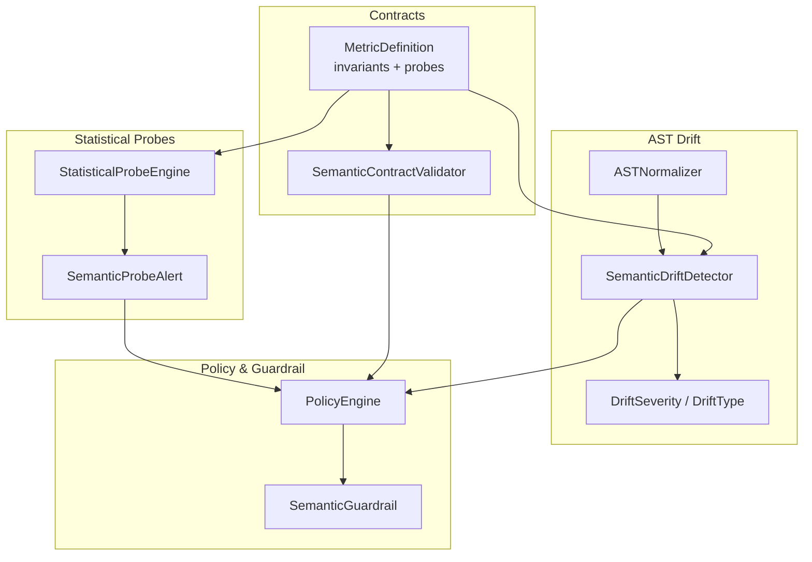
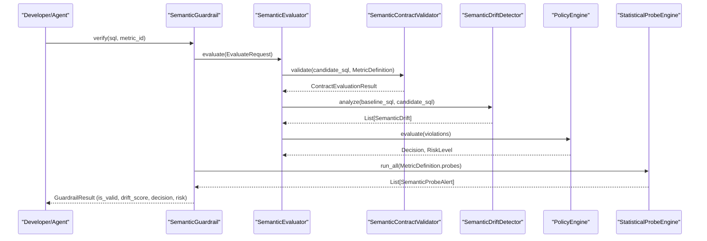
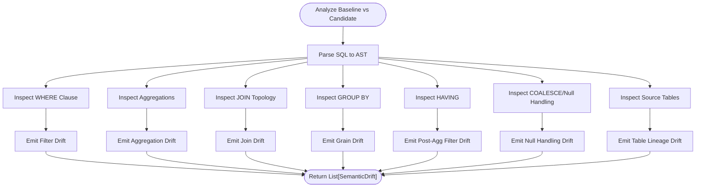
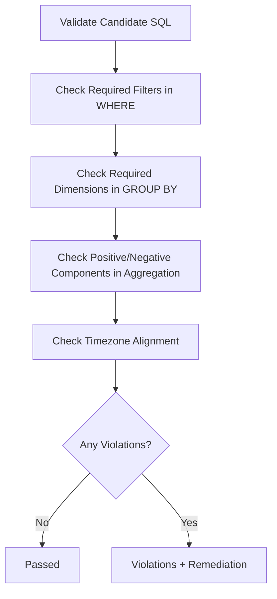
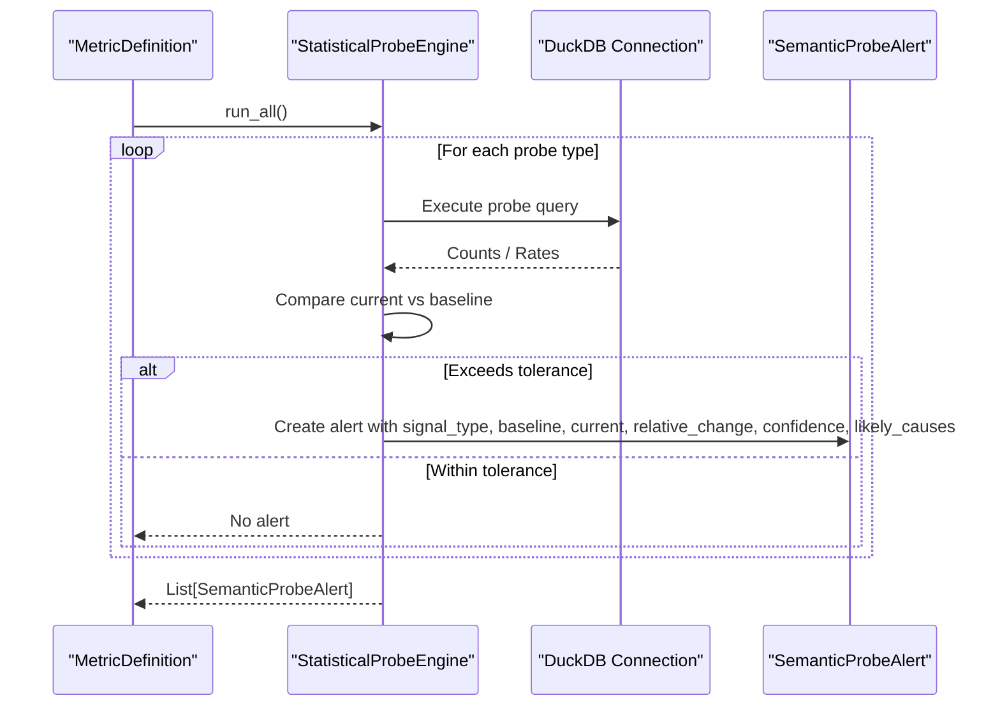
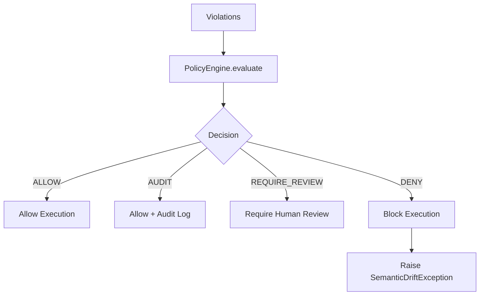
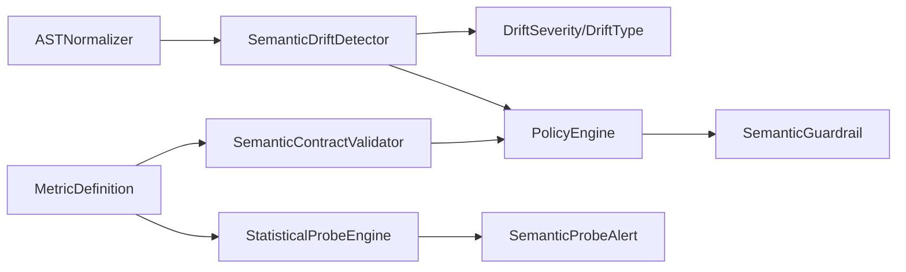

# Semantic Drift Detection

<cite>
**Referenced Files in This Document**
- [detector.py](file://semantic_reliability/testing/drift/detector.py)
- [rules.py](file://semantic_reliability/testing/drift/rules.py)
- [normalizer.py](file://semantic_reliability/testing/drift/normalizer.py)
- [contracts.py](file://semantic_reliability/compiler/contracts.py)
- [schema.py](file://semantic_reliability/compiler/schema.py)
- [engine.py](file://semantic_reliability/probes/engine.py)
- [signals.py](file://semantic_reliability/probes/signals.py)
- [policy.py](file://semantic_reliability/firewall/policy.py)
- [guardrail.py](file://semantic_reliability/guardrail.py)
- [test_drift_detector.py](file://tests/test_drift_detector.py)
- [fct_net_revenue_baseline.sql](file://examples/models/fct_net_revenue_baseline.sql)
- [fct_net_revenue_drifted.sql](file://examples/models/fct_net_revenue_drifted.sql)
- [net_revenue_contract.yaml](file://examples/metrics/net_revenue_contract.yaml)
</cite>

## Table of Contents
1. Introduction
2. Project Structure
3. Core Components
4. Architecture Overview
5. Detailed Component Analysis
6. Dependency Analysis
7. Performance Considerations
8. Troubleshooting Guide
9. Conclusion
10. Appendices

## Introduction
This document explains how the system detects semantic drift between a canonical metric definition and candidate SQL implementations. It covers:
- How deviations from business logic defined in contracts are identified
- The drift severity classification and impact assessment methodology
- Statistical probes that validate data quality and business reality constraints
- The relationship between AST-level changes and semantic meaning alterations
- Common drift scenarios (metric definition changes, filter modifications, aggregation alterations)
- False positive prevention and drift tolerance configuration

The goal is to ensure that generated or modified queries remain semantically aligned with business definitions, preventing silent metric corruption before execution.

## Project Structure
Semantic drift detection spans three layers:
- Contract enforcement: declarative invariants define required filters, grouping dimensions, aggregation components, units, and time semantics
- AST-based drift analysis: structural comparison of baseline vs candidate SQL to detect semantic shifts
- Statistical probes: runtime checks against live or snapshot data to validate population rates, implications, and null drift

**Diagram sources**
- [schema.py:83-98](file://semantic_reliability/compiler/schema.py#L83-L98)
- [contracts.py:26-135](file://semantic_reliability/compiler/contracts.py#L26-L135)
- [normalizer.py:6-93](file://semantic_reliability/testing/drift/normalizer.py#L6-L93)
- [detector.py:9-46](file://semantic_reliability/testing/drift/detector.py#L9-L46)
- [rules.py:6-41](file://semantic_reliability/testing/drift/rules.py#L6-L41)
- [engine.py:11-38](file://semantic_reliability/probes/engine.py#L11-L38)
- [signals.py:5-18](file://semantic_reliability/probes/signals.py#L5-L18)
- [policy.py:32-68](file://semantic_reliability/firewall/policy.py#L32-L68)
- [guardrail.py:45-153](file://semantic_reliability/guardrail.py#L45-L153)

**Section sources**
- [schema.py:83-98](file://semantic_reliability/compiler/schema.py#L83-L98)
- [contracts.py:26-135](file://semantic_reliability/compiler/contracts.py#L26-L135)
- [detector.py:9-46](file://semantic_reliability/testing/drift/detector.py#L9-L46)
- [engine.py:11-38](file://semantic_reliability/probes/engine.py#L11-L38)
- [policy.py:32-68](file://semantic_reliability/firewall/policy.py#L32-L68)
- [guardrail.py:45-153](file://semantic_reliability/guardrail.py#L45-L153)

## Core Components
- MetricDefinition: declares canonical SQL, dialect, grain, tags, invariants, and statistical probes for a metric
- SemanticContractValidator: enforces invariants on candidate SQL (population filters, grain dimensions, aggregation components, timezone)
- ASTNormalizer: canonicalizes expressions to avoid false positives from commutativity and cosmetic differences
- SemanticDriftDetector: compares baseline vs candidate ASTs across WHERE, aggregations, joins, GROUP BY, HAVING, COALESCE, and source tables
- StatisticalProbeEngine: runs population rate, implication confidence, and null drift checks against data snapshots or live connections
- PolicyEngine: maps violations to mutation oracles and decides ALLOW/AUDIT/REQUIRE_REVIEW/DENY based on severity and strict mode
- SemanticGuardrail: orchestrates evaluation and can block execution via exceptions when contract compliance fails

**Section sources**
- [schema.py:5-98](file://semantic_reliability/compiler/schema.py#L5-L98)
- [contracts.py:26-135](file://semantic_reliability/compiler/contracts.py#L26-L135)
- [normalizer.py:6-93](file://semantic_reliability/testing/drift/normalizer.py#L6-L93)
- [detector.py:9-246](file://semantic_reliability/testing/drift/detector.py#L9-L246)
- [engine.py:11-138](file://semantic_reliability/probes/engine.py#L11-L138)
- [policy.py:32-68](file://semantic_reliability/firewall/policy.py#L32-L68)
- [guardrail.py:45-153](file://semantic_reliability/guardrail.py#L45-L153)

## Architecture Overview
End-to-end flow for drift detection and governance:

**Diagram sources**
- [guardrail.py:91-153](file://semantic_reliability/guardrail.py#L91-L153)
- [contracts.py:26-135](file://semantic_reliability/compiler/contracts.py#L26-L135)
- [detector.py:12-46](file://semantic_reliability/testing/drift/detector.py#L12-L46)
- [policy.py:32-68](file://semantic_reliability/firewall/policy.py#L32-L68)
- [engine.py:18-38](file://semantic_reliability/probes/engine.py#L18-L38)

## Detailed Component Analysis

### AST-Level Drift Detection
The detector parses both baseline and candidate SQL into ASTs and inspects key relational algebra components:
- WHERE clause: removal, addition, or modification of filters
- Aggregations: function changes (SUM vs AVG), expression payload changes inside aggregates
- Joins: count changes, missing ON/USING predicates (Cartesian explosion risk)
- GROUP BY: grain dimension shifts
- HAVING: post-aggregation filter changes
- COALESCE: null handling drift
- Source tables: lineage changes

**Diagram sources**
- [detector.py:12-46](file://semantic_reliability/testing/drift/detector.py#L12-L46)
- [detector.py:48-246](file://semantic_reliability/testing/drift/detector.py#L48-L246)

**Section sources**
- [detector.py:12-46](file://semantic_reliability/testing/drift/detector.py#L12-L46)
- [detector.py:48-246](file://semantic_reliability/testing/drift/detector.py#L48-L246)

### Severity Classification and Impact Assessment
- DriftSeverity levels: FATAL, CRITICAL, HIGH, MEDIUM, LOW, INFO
- DriftType categories: FILTER_REMOVAL, FILTER_ADDITION, SEMANTIC_LOGIC_SHIFT, AGGREGATION_FUNCTION_SHIFT, AGGREGATION_EXPRESSION_SHIFT, MATHEMATICAL_OPERATOR_SHIFT, JOIN_PREDICATE_MUTATION, JOIN_TYPE_SHIFT, GRAIN_DRIFT, NULL_HANDLING_DRIFT, HAVING_FILTER_SHIFT, TABLE_TARGET_SHIFT
- Each SemanticDrift includes component, summary, details, business_impact, snippets, and remediation guidance

Impact mapping examples:
- Filter removal: unfiltered aggregation inflates metrics (FATAL)
- Missing join predicate: Cartesian product duplicates counts (FATAL)
- Grain shift: downstream dimensional models break (CRITICAL)
- Aggregation change: metric formula altered (HIGH)

**Section sources**
- [rules.py:6-41](file://semantic_reliability/testing/drift/rules.py#L6-L41)
- [detector.py:48-246](file://semantic_reliability/testing/drift/detector.py#L48-L246)

### Contract Invariant Enforcement
The validator enforces policy-driven invariants declared in MetricDefinition:
- Population: required/forbidden filters must be present/absent in WHERE
- Grain: required grouping dimensions must exist in GROUP BY
- Aggregation: required function and positive/negative components must appear
- Timezone: enforce UTC alignment if specified

**Diagram sources**
- [contracts.py:26-135](file://semantic_reliability/compiler/contracts.py#L26-L135)
- [schema.py:5-37](file://semantic_reliability/compiler/schema.py#L5-L37)

**Section sources**
- [contracts.py:26-135](file://semantic_reliability/compiler/contracts.py#L26-L135)
- [schema.py:5-37](file://semantic_reliability/compiler/schema.py#L5-L37)

### Statistical Probes for Data Quality and Business Reality
Probes validate empirical data behavior against expected baselines:
- Population probe: measure proportion matching a target value; alert if deviation exceeds tolerance
- Implication probe: measure P(B|A); alert if confidence drops beyond tolerance_drop
- Null drift probe: monitor null rate on critical columns; alert if deviation exceeds tolerance

**Diagram sources**
- [engine.py:11-138](file://semantic_reliability/probes/engine.py#L11-L138)
- [signals.py:5-18](file://semantic_reliability/probes/signals.py#L5-L18)
- [schema.py:39-69](file://semantic_reliability/compiler/schema.py#L39-L69)

**Section sources**
- [engine.py:11-138](file://semantic_reliability/probes/engine.py#L11-L138)
- [signals.py:5-18](file://semantic_reliability/probes/signals.py#L5-L18)
- [schema.py:39-69](file://semantic_reliability/compiler/schema.py#L39-L69)

### Relationship Between AST Changes and Semantic Meaning
- WHERE clause changes alter the population being aggregated; even small predicate shifts can exclude/include different entities
- Aggregation function or expression changes modify the mathematical computation of the metric
- Join topology changes affect cardinality and can cause duplication or record loss
- GROUP BY changes alter reporting grain, breaking downstream slices and dashboards
- HAVING changes adjust post-aggregation retention thresholds
- COALESCE changes influence null propagation and aggregate results
- Source table changes shift upstream dependencies and potentially introduce deprecated or staging data

False positive prevention is achieved by normalizing ASTs to ignore commutative ordering and cosmetic differences.

**Section sources**
- [detector.py:48-246](file://semantic_reliability/testing/drift/detector.py#L48-L246)
- [normalizer.py:6-93](file://semantic_reliability/testing/drift/normalizer.py#L6-L93)

### Governance and Decisioning
- PolicyEngine maps violations to mutation oracles and computes decisions:
  - ALLOW: no violations
  - AUDIT: anomalies detected but not critical
  - REQUIRE_REVIEW: critical defects in non-strict mode
  - DENY: critical defects in strict mode
- SemanticGuardrail calculates a drift score and can raise an exception to block execution when contract compliance fails

**Diagram sources**
- [policy.py:32-68](file://semantic_reliability/firewall/policy.py#L32-L68)
- [guardrail.py:138-153](file://semantic_reliability/guardrail.py#L138-L153)

**Section sources**
- [policy.py:32-68](file://semantic_reliability/firewall/policy.py#L32-L68)
- [guardrail.py:91-153](file://semantic_reliability/guardrail.py#L91-L153)

## Dependency Analysis
Key dependency relationships:
- SemanticGuardrail depends on ContractRegistry and SemanticEvaluator, which use MetricDefinition and SemanticContractValidator
- SemanticDriftDetector depends on ASTNormalizer and emits SemanticDrift objects typed by DriftSeverity and DriftType
- StatisticalProbeEngine depends on MetricDefinition.probes and returns SemanticProbeAlert
- PolicyEngine consumes violations and produces governance decisions used by guardrails

**Diagram sources**
- [schema.py:83-98](file://semantic_reliability/compiler/schema.py#L83-L98)
- [contracts.py:26-135](file://semantic_reliability/compiler/contracts.py#L26-L135)
- [detector.py:9-46](file://semantic_reliability/testing/drift/detector.py#L9-L46)
- [rules.py:6-41](file://semantic_reliability/testing/drift/rules.py#L6-L41)
- [engine.py:11-38](file://semantic_reliability/probes/engine.py#L11-L38)
- [signals.py:5-18](file://semantic_reliability/probes/signals.py#L5-L18)
- [policy.py:32-68](file://semantic_reliability/firewall/policy.py#L32-L68)
- [guardrail.py:45-153](file://semantic_reliability/guardrail.py#L45-L153)

**Section sources**
- [schema.py:83-98](file://semantic_reliability/compiler/schema.py#L83-L98)
- [contracts.py:26-135](file://semantic_reliability/compiler/contracts.py#L26-L135)
- [detector.py:9-46](file://semantic_reliability/testing/drift/detector.py#L9-L46)
- [engine.py:11-38](file://semantic_reliability/probes/engine.py#L11-L38)
- [policy.py:32-68](file://semantic_reliability/firewall/policy.py#L32-L68)
- [guardrail.py:45-153](file://semantic_reliability/guardrail.py#L45-L153)

## Performance Considerations
- AST parsing and traversal are linear in query size; normalization adds overhead but reduces false positives
- Statistical probes execute targeted queries; keep tolerances tight to minimize noise while avoiding excessive alerts
- Batch probe execution per MetricDefinition to reduce connection churn
- Prefer snapshot-based testing for reproducible probe results during CI

[No sources needed since this section provides general guidance]

## Troubleshooting Guide
Common issues and resolutions:
- False positives due to commutative predicates: rely on ASTNormalizer to sort AND/OR chains and unwrap parentheses
- Missing join predicates causing Cartesian explosions: treat as FATAL; add explicit ON clauses
- Grain drift breaking downstream models: restore required GROUP BY dimensions
- Null handling drift leading to unexpected NULL aggregates: retain COALESCE defaults
- Statistical probe alerts: review baseline rates and tolerances; investigate upstream schema or pipeline changes

**Section sources**
- [normalizer.py:6-93](file://semantic_reliability/testing/drift/normalizer.py#L6-L93)
- [detector.py:134-164](file://semantic_reliability/testing/drift/detector.py#L134-L164)
- [detector.py:166-205](file://semantic_reliability/testing/drift/detector.py#L166-L205)
- [engine.py:40-138](file://semantic_reliability/probes/engine.py#L40-L138)

## Conclusion
The system combines contract enforcement, AST-level drift detection, and statistical probes to safeguard metric semantics. By classifying drift severity, assessing business impact, and applying governance policies, it prevents silent metric corruption and ensures alignment with business definitions. Tolerances and invariants provide configurable drift tolerance, while normalization minimizes false positives.

[No sources needed since this section summarizes without analyzing specific files]

## Appendices

### Common Drift Scenarios
- Metric definition changes: aggregation function or expression shifts alter calculations
- Filter modifications: WHERE clause additions/removals change population scope
- Aggregation alterations: SUM vs AVG or operand changes modify metric formulas
- Grain changes: GROUP BY dimension shifts break downstream slicing
- Join topology changes: missing predicates or extra joins alter cardinality

Examples:
- Baseline net revenue model vs drifted model demonstrating filter and aggregation changes

**Section sources**
- [test_drift_detector.py:17-84](file://tests/test_drift_detector.py#L17-L84)
- [fct_net_revenue_baseline.sql:1-9](file://examples/models/fct_net_revenue_baseline.sql#L1-L9)
- [fct_net_revenue_drifted.sql:1-9](file://examples/models/fct_net_revenue_drifted.sql#L1-L9)

### Drift Tolerance Configuration
- PopulationProbe.tolerance: absolute deviation threshold for population rate
- ImplicationProbe.tolerance_drop: acceptable drop in conditional confidence
- NullDriftProbe.tolerance: maximum acceptable null rate deviation
- PolicyEngine.strict_mode: toggles whether critical violations deny execution or require review

**Section sources**
- [schema.py:39-69](file://semantic_reliability/compiler/schema.py#L39-L69)
- [policy.py:32-68](file://semantic_reliability/firewall/policy.py#L32-L68)

### Example Contract Definition
A sample contract defines required filters, grain dimensions, aggregation components, units, and timezone alignment for net revenue.

**Section sources**
- [net_revenue_contract.yaml:1-39](file://examples/metrics/net_revenue_contract.yaml#L1-L39)