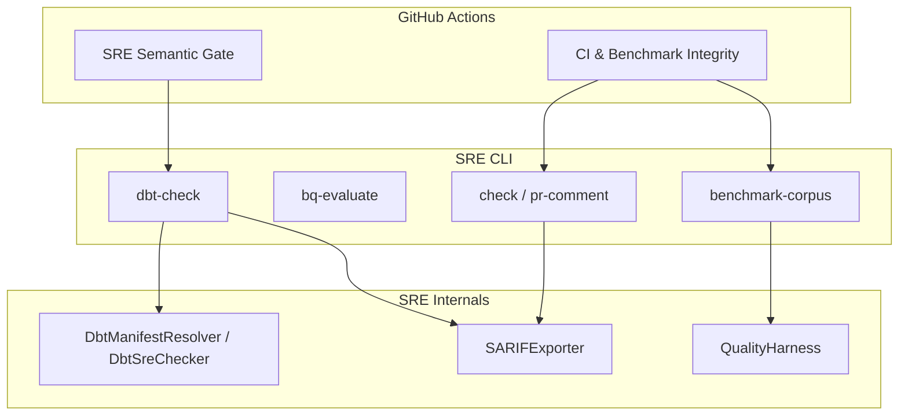
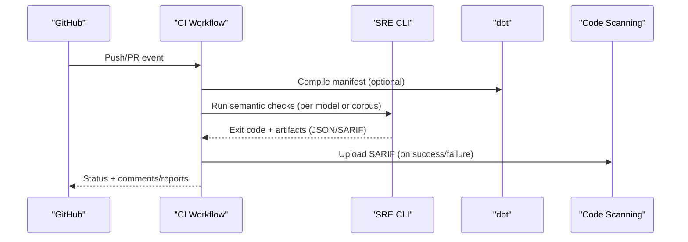
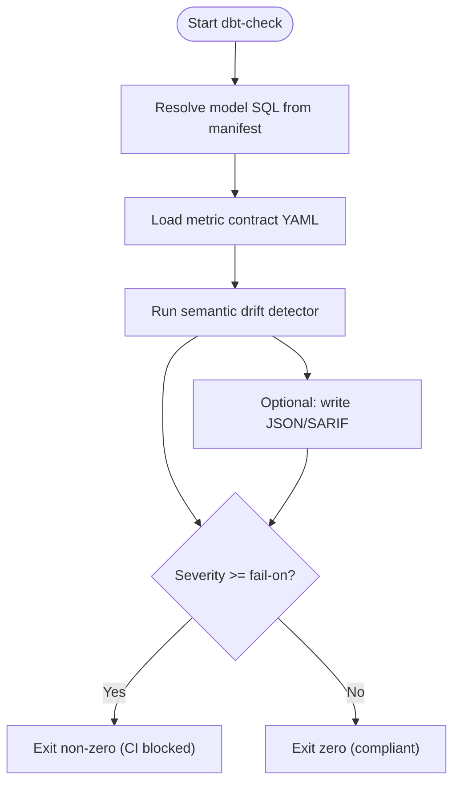
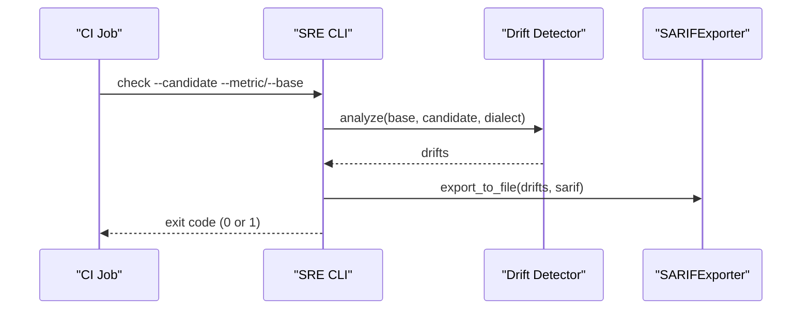
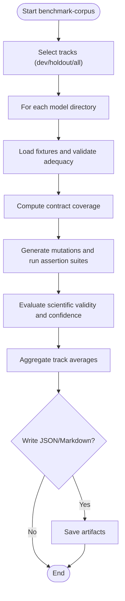
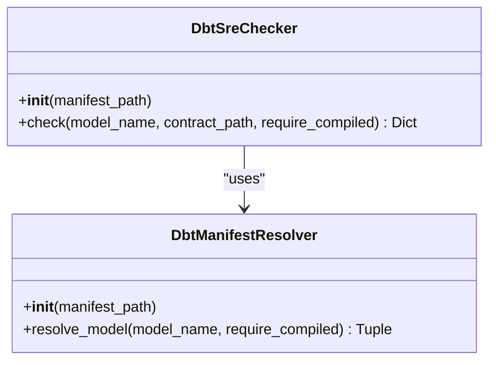
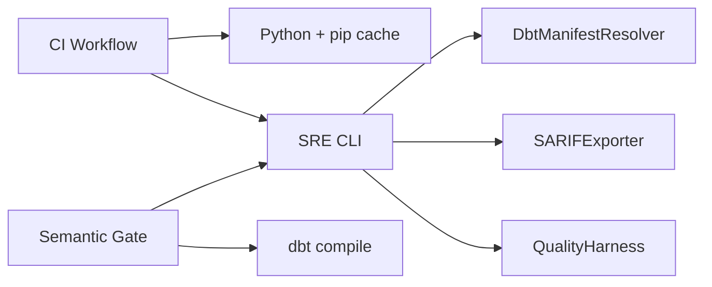

# CI/CD Integration

<cite>
**Referenced Files in This Document**
- [ci.yml](file://.github/workflows/ci.yml)
- [sre-dbt-semantic-gate.yml](file://.github/workflows/sre-dbt-semantic-gate.yml)
- [cli.py](file://semantic_reliability/cli.py)
- [dbt_integration.py](file://semantic_reliability/adapters/dbt_integration.py)
- [sarif_exporter.py](file://semantic_reliability/harness/sarif_exporter.py)
- [quality_harness.py](file://semantic_reliability/harness/quality_harness.py)
- [README.md](file://README.md)
- [pyproject.toml](file://pyproject.toml)
</cite>

## Table of Contents
1. Introduction
2. Project Structure
3. Core Components
4. Architecture Overview
5. Detailed Component Analysis
6. Dependency Analysis
7. Performance Considerations
8. Troubleshooting Guide
9. Conclusion
10. Appendices

## Introduction
This document explains how to integrate the Semantic Reliability Engine (SRE) into CI/CD pipelines with automated semantic validation gates and DBT integration patterns. It covers GitHub Actions workflows, CLI commands for CI environments, artifact management, reporting via SARIF and JSON, branch protection strategies, pull request automation, multi-stage pipelines, parallel execution, caching, failure handling, notifications, and rollback procedures for production deployments.

## Project Structure
The repository provides:
- GitHub Actions workflows that run tests, provenance audits, benchmark suites, and semantic checks on PRs touching dbt models or contracts.
- A CLI surface exposing commands to compile metrics, evaluate SQL against BigQuery dry-run, check dbt models for semantic drift, generate SARIF reports, and run corpus benchmarks.
- DBT adapter components to resolve compiled SQL from manifests and compare against metric contracts.
- Reporting utilities to export SARIF 2.1.0 results consumable by GitHub Code Scanning.

**Diagram sources**
- [ci.yml:1-51](file://.github/workflows/ci.yml#L1-L51)
- [sre-dbt-semantic-gate.yml:1-72](file://.github/workflows/sre-dbt-semantic-gate.yml#L1-L72)
- [cli.py:43-132](file://semantic_reliability/cli.py#L43-L132)
- [cli.py:706-786](file://semantic_reliability/cli.py#L706-L786)
- [dbt_integration.py:21-118](file://semantic_reliability/adapters/dbt_integration.py#L21-L118)
- [sarif_exporter.py:9-99](file://semantic_reliability/harness/sarif_exporter.py#L9-L99)
- [quality_harness.py:34-113](file://semantic_reliability/harness/quality_harness.py#L34-L113)

**Section sources**
- [ci.yml:1-51](file://.github/workflows/ci.yml#L1-L51)
- [sre-dbt-semantic-gate.yml:1-72](file://.github/workflows/sre-dbt-semantic-gate.yml#L1-L72)
- [README.md:93-136](file://README.md#L93-L136)
- [pyproject.toml:32-34](file://pyproject.toml#L32-L34)

## Core Components
- GitHub Actions Workflows
  - CI & Benchmark Integrity: runs unit tests, provenance audit, and a full corpus benchmark; uploads JSON artifacts.
  - SRE Semantic Gate: triggers on changes to dbt models/contracts, compiles dbt, identifies changed models, runs semantic checks per model, and uploads SARIF to GitHub Code Scanning.

- CLI Commands for CI
  - check: compares candidate SQL against baseline/metric contract, optional SARIF output, fail-on-drift exit codes.
  - bq-evaluate: dry-run evaluation against BigQuery with policy decisions and exit codes.
  - dbt-check: resolves compiled SQL from manifest, compares to contract, outputs JSON/SARIF, exits non-zero based on severity threshold.
  - benchmark-corpus: executes multi-model cross-evaluation across dev/holdout tracks, supports JSON/markdown outputs.
  - pr-comment: generates markdown comment content for PR reviews.

- DBT Integration
  - DbtManifestResolver extracts compiled SQL and dialect from target/manifest.json.
  - DbtSreChecker orchestrates drift detection between compiled model SQL and metric contract.

- Reporting and Artifacts
  - SARIFExporter produces standard SARIF 2.1.0 documents for GitHub Security tab.
  - JSON artifacts produced by benchmark-corpus and dbt-check are uploaded as workflow artifacts.

**Section sources**
- [ci.yml:10-51](file://.github/workflows/ci.yml#L10-L51)
- [sre-dbt-semantic-gate.yml:15-72](file://.github/workflows/sre-dbt-semantic-gate.yml#L15-L72)
- [cli.py:43-132](file://semantic_reliability/cli.py#L43-L132)
- [cli.py:706-786](file://semantic_reliability/cli.py#L706-L786)
- [dbt_integration.py:21-118](file://semantic_reliability/adapters/dbt_integration.py#L21-L118)
- [sarif_exporter.py:9-99](file://semantic_reliability/harness/sarif_exporter.py#L9-L99)

## Architecture Overview
The CI/CD architecture integrates static semantic checks into PR flows and comprehensive benchmarking into main/master merges.

**Diagram sources**
- [sre-dbt-semantic-gate.yml:30-72](file://.github/workflows/sre-dbt-semantic-gate.yml#L30-L72)
- [cli.py:737-786](file://semantic_reliability/cli.py#L737-L786)
- [sarif_exporter.py:91-99](file://semantic_reliability/harness/sarif_exporter.py#L91-L99)

## Detailed Component Analysis

### GitHub Actions: CI & Benchmark Integrity
- Triggers on push/PR to main/master.
- Steps include checkout, Python setup with pip cache, install dependencies, run pytest, provenance audit, and benchmark-corpus execution.
- Produces JSON artifact for downstream consumption.

Key behaviors:
- Caching: pip cache enabled for faster installs.
- Parallelism: single job here; can be extended to matrix jobs for splits.
- Artifacts: uploads benchmark results JSON.

**Section sources**
- [ci.yml:1-51](file://.github/workflows/ci.yml#L1-L51)

### GitHub Actions: SRE Semantic Gate
- Triggers on PRs when models/**/*.sql, contracts/**/*.yaml, or dbt_project.yml change.
- Installs dbt-bigquery and SRE, configures dbt profile from secrets, compiles manifest, detects changed models, runs sre dbt-check per model, and uploads SARIF.

Key behaviors:
- Permissions: contents read, security-events write, pull-requests write.
- Environment: GCP service account credentials path configured.
- Output: SARIF files uploaded to GitHub Code Scanning under category 'semantic-reliability'.

**Section sources**
- [sre-dbt-semantic-gate.yml:1-72](file://.github/workflows/sre-dbt-semantic-gate.yml#L1-L72)

### CLI: dbt-check Command
- Resolves compiled SQL from dbt manifest and compares against a metric contract.
- Supports --fail-on thresholds (critical/high/any), JSON and SARIF outputs.
- Exits non-zero if drift severity meets or exceeds threshold.

**Diagram sources**
- [cli.py:737-786](file://semantic_reliability/cli.py#L737-L786)
- [dbt_integration.py:71-118](file://semantic_reliability/adapters/dbt_integration.py#L71-L118)

**Section sources**
- [cli.py:737-786](file://semantic_reliability/cli.py#L737-L786)
- [dbt_integration.py:21-118](file://semantic_reliability/adapters/dbt_integration.py#L21-L118)

### CLI: check and pr-comment
- check: compares candidate SQL to baseline or metric contract, prints drift table, optionally exports SARIF, and fails on critical/high drift when requested.
- pr-comment: generates markdown suitable for posting as a PR review comment.

**Diagram sources**
- [cli.py:43-132](file://semantic_reliability/cli.py#L43-L132)
- [sarif_exporter.py:91-99](file://semantic_reliability/harness/sarif_exporter.py#L91-L99)

**Section sources**
- [cli.py:43-132](file://semantic_reliability/cli.py#L43-L132)

### CLI: bq-evaluate
- Evaluates SQL against BigQuery dry-run and semantic contract.
- Returns JSON decision and sets exit codes: 0 allow, 1 deny, 2 require review.

Use cases:
- Pre-execution gate in CI before running expensive warehouse queries.
- Policy enforcement using project-specific pricing policies.

**Section sources**
- [cli.py:706-734](file://semantic_reliability/cli.py#L706-L734)

### CLI: benchmark-corpus
- Executes multi-model cross-evaluation across development and frozen holdout tracks.
- Outputs machine-readable JSON and optional Markdown report.
- Integrates fixture adequacy, contract coverage, and scientific validity evaluation.

**Diagram sources**
- [cli.py:286-486](file://semantic_reliability/cli.py#L286-L486)

**Section sources**
- [cli.py:286-486](file://semantic_reliability/cli.py#L286-L486)

### DBT Adapter: Manifest Resolution and Checking
- DbtManifestResolver reads target/manifest.json, finds node by name, determines resource type, dialect, and retrieves compiled or raw SQL.
- DbtSreChecker orchestrates drift detection and returns structured result including decision and max severity.

**Diagram sources**
- [dbt_integration.py:21-118](file://semantic_reliability/adapters/dbt_integration.py#L21-L118)

**Section sources**
- [dbt_integration.py:21-118](file://semantic_reliability/adapters/dbt_integration.py#L21-L118)

### Reporting: SARIF Exporter
- Converts drift detections into SARIF 2.1.0 documents with rules, results, and locations.
- Writes files consumable by GitHub Code Scanning.

**Section sources**
- [sarif_exporter.py:9-99](file://semantic_reliability/harness/sarif_exporter.py#L9-L99)

### Quality Harness: Mutation Evaluation
- Simulates or executes test suites against mutated SQL to compute mutation catch scores.
- Provides structured evaluations useful for benchmarking and reporting.

**Section sources**
- [quality_harness.py:34-113](file://semantic_reliability/harness/quality_harness.py#L34-L113)

## Dependency Analysis
- Workflows depend on:
  - Python environment and pip cache.
  - dbt-bigquery and SRE package installation.
  - Secrets for dbt profiles and GCP credentials.
- CLI depends on:
  - MetricCompiler, SemanticDriftDetector, DbtSreChecker, SARIFExporter, QualityHarness.
- DBT integration depends on:
  - Compiled manifest presence and correct resource types.

**Diagram sources**
- [ci.yml:20-34](file://.github/workflows/ci.yml#L20-L34)
- [sre-dbt-semantic-gate.yml:25-42](file://.github/workflows/sre-dbt-semantic-gate.yml#L25-L42)
- [cli.py:21-33](file://semantic_reliability/cli.py#L21-L33)

**Section sources**
- [ci.yml:20-34](file://.github/workflows/ci.yml#L20-L34)
- [sre-dbt-semantic-gate.yml:25-42](file://.github/workflows/sre-dbt-semantic-gate.yml#L25-L42)
- [cli.py:21-33](file://semantic_reliability/cli.py#L21-L33)

## Performance Considerations
- Caching strategies:
  - Use pip cache in GitHub Actions to speed up dependency installation.
  - Cache dbt target/manifest where feasible to avoid repeated compilation.
- Parallel execution:
  - Expand CI to matrix jobs splitting benchmark tracks (dev vs holdout).
  - In semantic gate, iterate changed models in parallel using concurrency groups or separate jobs per model.
- Artifact minimization:
  - Upload only necessary artifacts (JSON results, SARIF files).
  - Compress large reports if needed.
- Dry-run evaluation:
  - Prefer bq-evaluate to avoid costly warehouse executions during CI.

[No sources needed since this section provides general guidance]

## Troubleshooting Guide
Common issues and resolutions:
- Missing compiled SQL:
  - Ensure dbt compile is run before dbt-check; DbtManifestResolver requires compiled_code or compiled_sql.
- Model not found in manifest:
  - Verify model name matches exactly; check resource_type is 'model'.
- Severity threshold blocking CI:
  - Adjust --fail-on threshold or remediate drift alerts.
- SARIF upload failures:
  - Confirm permissions (security-events: write) and that SARIF files exist.
- Provenance audit failures:
  - Ensure target directories contain required files and citations are present.

**Section sources**
- [dbt_integration.py:59-68](file://semantic_reliability/adapters/dbt_integration.py#L59-L68)
- [cli.py:737-786](file://semantic_reliability/cli.py#L737-L786)
- [sre-dbt-semantic-gate.yml:66-72](file://.github/workflows/sre-dbt-semantic-gate.yml#L66-L72)

## Conclusion
The repository provides robust CI/CD integration points for automated semantic validation and DBT-driven quality gates. By leveraging GitHub Actions, SRE CLI commands, and standardized reporting (SARIF/JSON), teams can enforce semantic compliance early in PRs and maintain rigorous benchmarking on merges. The design supports caching, parallelization, and clear failure modes, enabling scalable and reliable data pipeline governance.

[No sources needed since this section summarizes without analyzing specific files]

## Appendices

### Branch Protection Rules
Recommended rules:
- Require status checks to pass:
  - CI & Benchmark Integrity
  - SRE Semantic Gate (for PRs touching models/contracts)
- Require pull request reviews:
  - At least one reviewer for changes affecting contracts or models.
- Enforce signed commits:
  - Prevent tampering and ensure traceability.
- Restrict force pushes:
  - Protect main/master branches.

[No sources needed since this section provides general guidance]

### Pull Request Automation
- Automated comments:
  - Use pr-comment to post drift summaries and recommendations.
- SARIF integration:
  - Upload SARIF to highlight semantic issues directly in PR diffs.
- Auto-labeling:
  - Label PRs based on changed paths (models, contracts).

**Section sources**
- [cli.py:543-568](file://semantic_reliability/cli.py#L543-L568)
- [sre-dbt-semantic-gate.yml:66-72](file://.github/workflows/sre-dbt-semantic-gate.yml#L66-L72)

### Deployment Pipelines
- Pre-deployment gates:
  - Run bq-evaluate to ensure SQL is valid and compliant.
  - Execute dbt-check with strict thresholds.
- Post-deployment monitoring:
  - Use statistical probes to detect upstream shifts and anomalies.
- Rollback procedures:
  - Maintain versioned contracts and revert to previous versions if drift is detected post-deploy.
  - Use replay worker insights to identify underspecified contracts and patch them proactively.

**Section sources**
- [cli.py:706-734](file://semantic_reliability/cli.py#L706-L734)
- [probes/engine.py:53-117](file://semantic_reliability/probes/engine.py#L53-L117)

### Multi-Stage Pipelines Example
- Stage 1: Lint and unit tests (pytest).
- Stage 2: Compile dbt and run semantic checks per changed model.
- Stage 3: Run benchmark-corpus on dev/holdout tracks.
- Stage 4: Generate reports (JSON/Markdown) and SARIF.
- Stage 5: Publish artifacts and notify stakeholders.

**Section sources**
- [ci.yml:10-51](file://.github/workflows/ci.yml#L10-L51)
- [sre-dbt-semantic-gate.yml:15-72](file://.github/workflows/sre-dbt-semantic-gate.yml#L15-L72)

### Notification Systems
- Integrate Slack or email notifications on failure.
- Use GitHub statuses and comments to inform reviewers.
- Leverage SARIF annotations for inline feedback.

[No sources needed since this section provides general guidance]