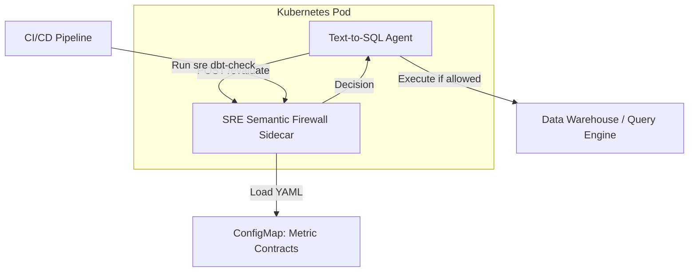
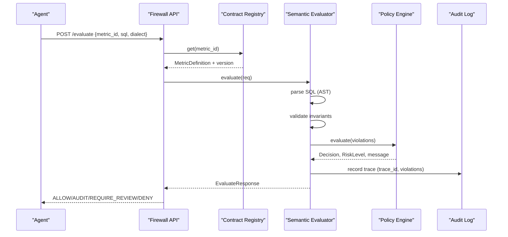
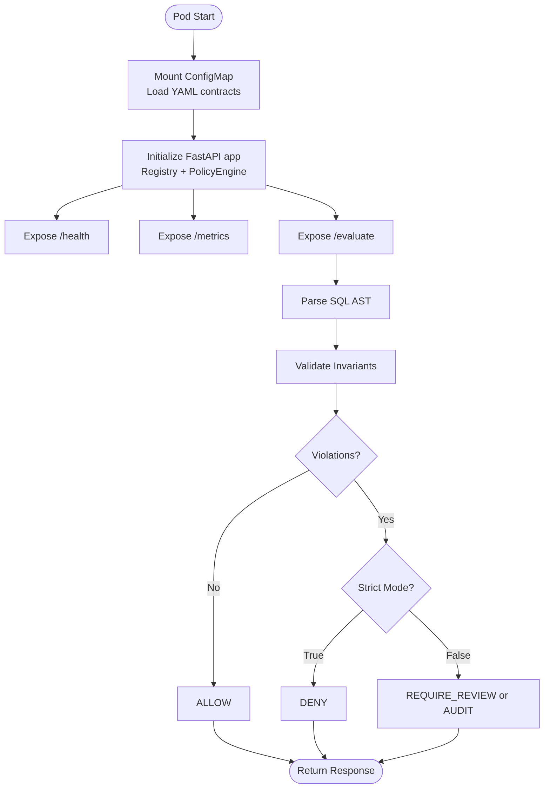
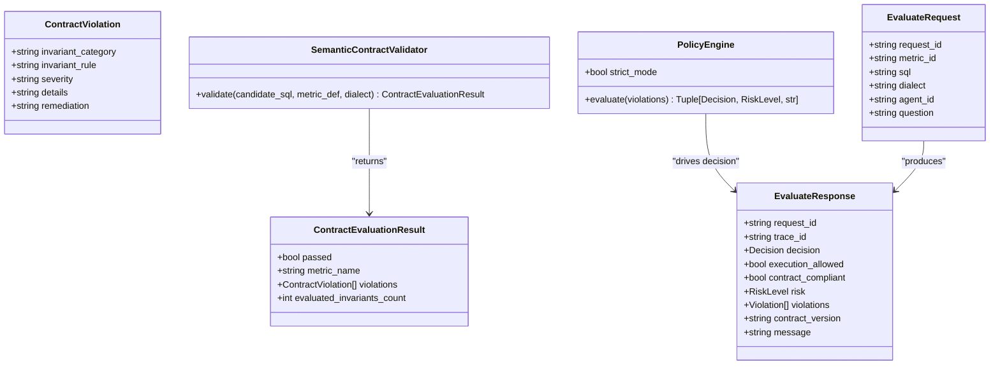
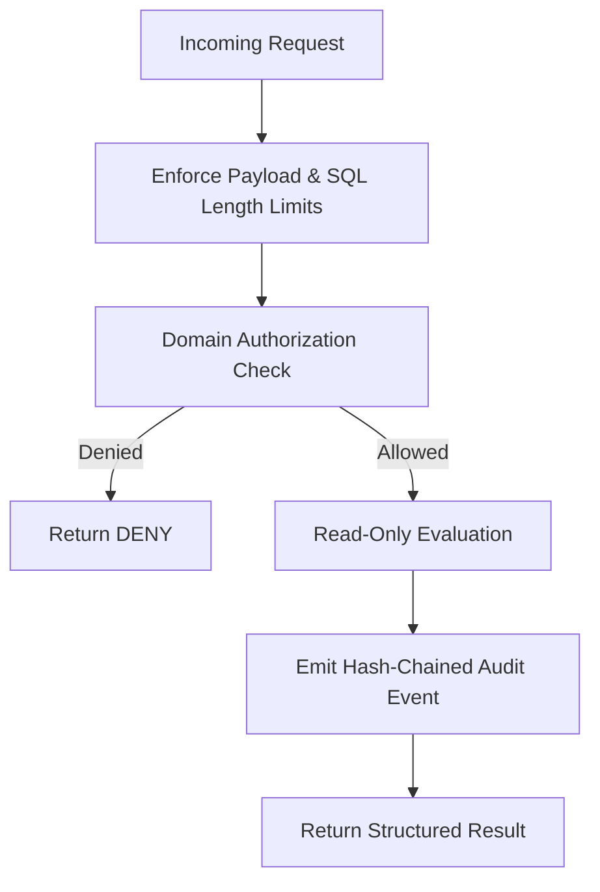
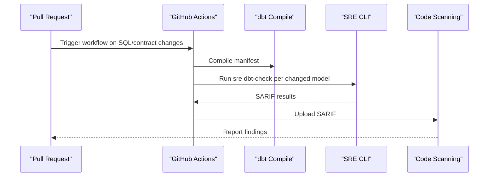
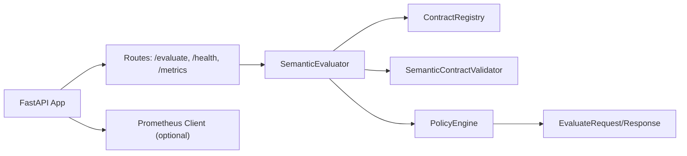

# Enterprise Deployment

<cite>
**Referenced Files in This Document**
- [engine.py](file://semantic_reliability/firewall/engine.py)
- [policy.py](file://semantic_reliability/firewall/policy.py)
- [main.py](file://semantic_reliability/firewall/main.py)
- [models.py](file://semantic_reliability/firewall/models.py)
- [contracts.py](file://semantic_reliability/compiler/contracts.py)
- [security.py](file://semantic_reliability/mcp/security.py)
- [handlers.py](file://semantic_reliability/mcp/handlers.py)
- [semantic_firewall_sidecar.yaml](file://deploy/k8s/semantic_firewall_sidecar.yaml)
- [sre-dbt-semantic-gate.yml](file://.github/workflows/sre-dbt-semantic-gate.yml)
- [ci.yml](file://.github/workflows/ci.yml)
- [validity_policy.yaml](file://semantic_reliability/harness/validity_policy.yaml)
- [ENTERPRISE_ARCHITECTURE_WHITEPAPER.md](file://docs/ENTERPRISE_ARCHITECTURE_WHITEPAPER.md)
- [MCP_SECURITY_AND_THREAT_MODEL.md](file://docs/MCP_SECURITY_AND_THREAT_MODEL.md)
</cite>

## Table of Contents
1. [Introduction](#introduction)
2. [Project Structure](#project-structure)
3. [Core Components](#core-components)
4. [Architecture Overview](#architecture-overview)
5. [Detailed Component Analysis](#detailed-component-analysis)
6. [Dependency Analysis](#dependency-analysis)
7. [Performance Considerations](#performance-considerations)
8. [Troubleshooting Guide](#troubleshooting-guide)
9. [Conclusion](#conclusion)
10. [Appendices](#appendices)

## Introduction
This document provides enterprise deployment guidance for the Semantic Reliability Engine (SRE), focusing on the firewall engine, policy enforcement, and security considerations. It explains how to deploy SRE as a Kubernetes sidecar proxy that enforces semantic contracts before analytical SQL executes against downstream warehouses. It also covers CI/CD integration for automated semantic validation gates, monitoring and observability recommendations, scaling and high availability configurations, and migration strategies for existing data quality pipelines.

The SRE firewall evaluates agent-generated SQL against declarative metric contracts using AST-based invariant checks and returns deterministic decisions: ALLOW, AUDIT, REQUIRE_REVIEW, or DENY. A policy engine maps violations to governance outcomes and enriches audit trails with mutation-equivalent mappings for offline replay and continuous improvement.

## Project Structure
At a high level, the deployment surface includes:
- FastAPI-based firewall service exposing evaluation endpoints and health/metrics
- Contract registry loading YAML metric definitions from a mounted volume
- Policy engine enforcing strict or advisory modes
- Kubernetes manifest defining a sidecar pattern with probes and resource limits
- CI/CD workflows integrating semantic checks into pull requests and mainline builds

**Diagram sources**
- [semantic_firewall_sidecar.yaml:23-63](file://deploy/k8s/semantic_firewall_sidecar.yaml#L23-L63)
- [main.py:23-33](file://semantic_reliability/firewall/main.py#L23-L33)
- [engine.py:18-52](file://semantic_reliability/firewall/engine.py#L18-L52)

**Section sources**
- [semantic_firewall_sidecar.yaml:1-103](file://deploy/k8s/semantic_firewall_sidecar.yaml#L1-L103)
- [main.py:1-70](file://semantic_reliability/firewall/main.py#L1-L70)
- [engine.py:1-132](file://semantic_reliability/firewall/engine.py#L1-L132)

## Core Components
- Firewall API: FastAPI application exposing /evaluate, /health, and /metrics endpoints. It auto-discovers metric contracts from a default directory and initializes the evaluator and policy engine.
- Contract Registry: Loads YAML metric definitions and exposes them by metric ID. Each definition includes canonical SQL, invariants, and metadata.
- Semantic Evaluator: Parses candidate SQL, validates it against declared invariants, records immutable audit traces, and returns structured responses with decision, risk, and violations.
- Policy Engine: Maps violations to governance decisions based on severity and strict mode. Enriches violations with mutation-equivalent operators for offline replay.
- Security and Audit: Hash-chained audit events, payload size and SQL length limits, read-only tool surface, and domain-scoped access controls.

**Section sources**
- [main.py:23-33](file://semantic_reliability/firewall/main.py#L23-L33)
- [engine.py:18-132](file://semantic_reliability/firewall/engine.py#L18-L132)
- [policy.py:32-68](file://semantic_reliability/firewall/policy.py#L32-L68)
- [security.py:16-57](file://semantic_reliability/mcp/security.py#L16-L57)
- [handlers.py:131-289](file://semantic_reliability/mcp/handlers.py#L131-L289)

## Architecture Overview
The SRE control plane decouples query generation from authorization:
- Layer 1: Semantic contract registry defines authoritative metric behavior via YAML.
- Layer 2: Pre-execution firewall performs AST parsing and invariant checks, returning deterministic decisions.
- Layer 3: Offline replay consumes audit logs to identify blind spots and suggest contract patches.
- Layer 4: Statistical probes monitor data reality drift and emit alerts.
- Layer 5: Immutable audit and evidence capture trace IDs, decisions, and violation summaries.

**Diagram sources**
- [main.py:36-53](file://semantic_reliability/firewall/main.py#L36-L53)
- [engine.py:54-116](file://semantic_reliability/firewall/engine.py#L54-L116)
- [policy.py:38-68](file://semantic_reliability/firewall/policy.py#L38-L68)

**Section sources**
- [ENTERPRISE_ARCHITECTURE_WHITEPAPER.md:56-111](file://docs/ENTERPRISE_ARCHITECTURE_WHITEPAPER.md#L56-L111)

## Detailed Component Analysis

### Firewall API and Sidecar Deployment
- The FastAPI app initializes Prometheus metrics when available and exposes:
  - POST /evaluate: Accepts EvaluateRequest and returns EvaluateResponse
  - GET /health: Returns status and loaded contract list
  - GET /metrics: Exposes Prometheus counters and histograms
- The Kubernetes manifest deploys a sidecar container running the firewall with:
  - Liveness and readiness probes on /health
  - Resource requests/limits for CPU and memory
  - ConfigMap volume mounting metric contracts under /etc/sre/contracts
  - Environment variables controlling strict mode and contracts directory

**Diagram sources**
- [semantic_firewall_sidecar.yaml:23-75](file://deploy/k8s/semantic_firewall_sidecar.yaml#L23-L75)
- [main.py:23-70](file://semantic_reliability/firewall/main.py#L23-L70)
- [engine.py:54-116](file://semantic_reliability/firewall/engine.py#L54-L116)
- [policy.py:38-68](file://semantic_reliability/firewall/policy.py#L38-L68)

**Section sources**
- [semantic_firewall_sidecar.yaml:1-103](file://deploy/k8s/semantic_firewall_sidecar.yaml#L1-L103)
- [main.py:1-70](file://semantic_reliability/firewall/main.py#L1-L70)

### Contract Validation and Policy Enforcement
- ContractValidator parses candidate SQL and checks:
  - Population invariants: required filters present in WHERE clause
  - Grain invariants: required dimensions present in GROUP BY
  - Aggregation invariants: positive/negative components included
  - Timezone invariants: UTC alignment enforced when required
- Violations are mapped to mutation-equivalent operators to support offline replay and blind spot detection.
- PolicyEngine determines governance outcome:
  - No violations: ALLOW
  - Errors/CRITICAL in strict mode: DENY
  - Errors/CRITICAL in non-strict mode: REQUIRE_REVIEW
  - Non-critical anomalies: AUDIT

**Diagram sources**
- [contracts.py:9-135](file://semantic_reliability/compiler/contracts.py#L9-L135)
- [policy.py:32-68](file://semantic_reliability/firewall/policy.py#L32-L68)
- [models.py:20-51](file://semantic_reliability/firewall/models.py#L20-L51)

**Section sources**
- [contracts.py:26-135](file://semantic_reliability/compiler/contracts.py#L26-L135)
- [policy.py:32-68](file://semantic_reliability/firewall/policy.py#L32-L68)
- [models.py:1-51](file://semantic_reliability/firewall/models.py#L1-L51)

### Security Architecture and Threat Mitigation
- Read-only semantics: The MCP server never executes queries; it returns violations and guidance without silent rewrites.
- Request limits: Hard ceilings on payload size and SQL length prevent DoS and injection attempts.
- Audit chaining: Every interaction emits a structured JSON event with SHA-256 hashing and previous hash chaining; periodic signed checkpoints anchor chain integrity.
- Domain scoping: Tools enforce authorized domains per metric; unauthorized access is denied.
- STRIDE mitigations: Spoofing, tampering, repudiation, information disclosure, denial of service, and elevation of privilege are addressed through protocol metadata, immutable registries, hash chains, redaction, and AST-only parsing.

**Diagram sources**
- [security.py:16-57](file://semantic_reliability/mcp/security.py#L16-L57)
- [handlers.py:131-289](file://semantic_reliability/mcp/handlers.py#L131-L289)
- [MCP_SECURITY_AND_THREAT_MODEL.md:18-69](file://docs/MCP_SECURITY_AND_THREAT_MODEL.md#L18-L69)

**Section sources**
- [security.py:1-57](file://semantic_reliability/mcp/security.py#L1-L57)
- [handlers.py:131-289](file://semantic_reliability/mcp/handlers.py#L131-L289)
- [MCP_SECURITY_AND_THREAT_MODEL.md:1-69](file://docs/MCP_SECURITY_AND_THREAT_MODEL.md#L1-L69)

### CI/CD Integration and Automated Semantic Gates
- Pull Request Gate: Detects changed SQL models and runs semantic checks against corresponding contracts. Outputs SARIF artifacts to GitHub Code Scanning.
- Mainline Integrity: Runs unit tests, provenance audits, and dual-track benchmark suite to ensure baseline reliability.
- Configuration: Uses dbt profiles and secrets for secure access; compiles manifests prior to evaluation.

**Diagram sources**
- [sre-dbt-semantic-gate.yml:1-72](file://.github/workflows/sre-dbt-semantic-gate.yml#L1-L72)
- [ci.yml:1-51](file://.github/workflows/ci.yml#L1-L51)

**Section sources**
- [sre-dbt-semantic-gate.yml:1-72](file://.github/workflows/sre-dbt-semantic-gate.yml#L1-L72)
- [ci.yml:1-51](file://.github/workflows/ci.yml#L1-L51)

### Monitoring and Observability Recommendations
- Prometheus Metrics:
  - sre_requests_total: Total requests by agent_id
  - sre_decisions_total: Decisions made (ALLOW/AUDIT/REQUIRE_REVIEW/DENY)
  - sre_contract_violations_total: Violations caught by rule
  - sre_evaluation_latency_seconds: Histogram of evaluation latency
  - sre_execution_blocked_total: Count of blocked executions
- Health Checks:
  - /health endpoint reports status and loaded contracts
- Production Recommendations:
  - Enable Prometheus scraping via annotations and scrape intervals
  - Centralize logs with structured JSON including trace_id, agent_id, decision, and violation counts
  - Integrate alerting on elevated BLOCKED rates and latency spikes
  - Use Grafana dashboards to visualize decision distributions and SLA adherence

**Section sources**
- [main.py:10-21](file://semantic_reliability/firewall/main.py#L10-L21)
- [main.py:36-70](file://semantic_reliability/firewall/main.py#L36-L70)
- [semantic_firewall_sidecar.yaml:18-21](file://deploy/k8s/semantic_firewall_sidecar.yaml#L18-L21)

### Scaling, Performance Tuning, and High Availability
- Horizontal Pod Autoscaling:
  - Scale replicas based on CPU/memory utilization and request rate
  - Ensure liveness/readiness probes are configured to avoid routing traffic to unhealthy pods
- Resource Management:
  - Set appropriate requests and limits for both agent and firewall containers
  - Monitor memory pressure due to AST parsing and contract loading
- Concurrency:
  - Tune Uvicorn workers to match CPU cores
  - Use connection pooling for downstream database connections if needed
- High Availability:
  - Deploy multiple replicas across failure domains
  - Use persistent volumes only for stateless configuration (ConfigMaps)
  - Implement circuit breakers at the agent layer to handle firewall unavailability gracefully

**Section sources**
- [semantic_firewall_sidecar.yaml:9-13](file://deploy/k8s/semantic_firewall_sidecar.yaml#L9-L13)
- [semantic_firewall_sidecar.yaml:33-63](file://deploy/k8s/semantic_firewall_sidecar.yaml#L33-L63)
- [semantic_firewall_sidecar.yaml:64-75](file://deploy/k8s/semantic_firewall_sidecar.yaml#L64-L75)

### Migration Guide for Existing Data Quality Pipelines
- Identify Gaps:
  - Map existing structural tests (not_null, unique, accepted_values) to semantic invariants (population, grain, aggregation)
  - Document business rules not captured by generic constraints
- Author Contracts:
  - Create YAML contracts for critical metrics with population filters, grouping dimensions, and aggregation components
  - Version contracts and store in Git for review and promotion
- Integrate CI Gates:
  - Add sre dbt-check steps to PR workflows to block merges introducing semantic drift
  - Publish SARIF results to code scanning for visibility
- Enable Sidecar Enforcement:
  - Deploy firewall sidecar and configure agents to call /evaluate before warehouse execution
  - Start in AUDIT mode to observe violations without blocking production
- Transition to Strict Mode:
  - After stabilization, enable strict mode to hard-block critical violations
  - Establish human-in-the-loop review processes for REQUIRE_REVIEW decisions
- Continuous Improvement:
  - Use offline replay to analyze audit logs and discover blind spots
  - Update contracts and fixtures to improve coverage and confidence thresholds

**Section sources**
- [ENTERPRISE_ARCHITECTURE_WHITEPAPER.md:180-192](file://docs/ENTERPRISE_ARCHITECTURE_WHITEPAPER.md#L180-L192)
- [sre-dbt-semantic-gate.yml:50-64](file://.github/workflows/sre-dbt-semantic-gate.yml#L50-L64)
- [validity_policy.yaml:1-17](file://semantic_reliability/harness/validity_policy.yaml#L1-L17)

## Dependency Analysis
The firewall depends on:
- FastAPI for HTTP endpoints and request/response handling
- sqlglot for AST parsing and normalization
- Pydantic for model validation
- Optional prometheus_client for metrics exposure
- YAML loader for contract ingestion

**Diagram sources**
- [main.py:23-33](file://semantic_reliability/firewall/main.py#L23-L33)
- [engine.py:18-52](file://semantic_reliability/firewall/engine.py#L18-L52)
- [contracts.py:26-135](file://semantic_reliability/compiler/contracts.py#L26-L135)
- [policy.py:32-68](file://semantic_reliability/firewall/policy.py#L32-L68)
- [models.py:20-51](file://semantic_reliability/firewall/models.py#L20-L51)

**Section sources**
- [main.py:1-70](file://semantic_reliability/firewall/main.py#L1-L70)
- [engine.py:1-132](file://semantic_reliability/firewall/engine.py#L1-L132)
- [contracts.py:1-135](file://semantic_reliability/compiler/contracts.py#L1-L135)
- [policy.py:1-68](file://semantic_reliability/firewall/policy.py#L1-L68)
- [models.py:1-51](file://semantic_reliability/firewall/models.py#L1-L51)

## Performance Considerations
- AST Parsing Overhead:
  - sqlglot parsing is fast but can be CPU-intensive under high load; consider horizontal scaling and worker tuning
- Contract Loading:
  - Load contracts once at startup; avoid reloading per request
- Memory Usage:
  - Limit number of concurrent evaluations; monitor heap usage during peak loads
- Latency Targets:
  - Aim for sub-millisecond decision times for compliant queries; optimize hot paths in validator
- Backpressure:
  - Use queueing or rate limiting at the ingress layer to protect the firewall during spikes

[No sources needed since this section provides general guidance]

## Troubleshooting Guide
Common issues and resolutions:
- Unknown metric contract:
  - Ensure the metric_id matches a registered contract in the ConfigMap or default directory
  - Verify YAML structure includes metric, version, and invariants
- SQL parse errors:
  - Confirm dialect compatibility; adjust dialect parameter if necessary
  - Fix syntax issues in generated SQL before submission
- Strict mode denials:
  - Review violations and update SQL to satisfy required filters, dimensions, and aggregation components
  - Temporarily switch to non-strict mode to collect audit data while remediating
- Missing Prometheus metrics:
  - Install prometheus_client or configure metrics endpoint fallback
- Health check failures:
  - Inspect logs for contract loading errors; verify ConfigMap mount path and permissions

**Section sources**
- [engine.py:21-43](file://semantic_reliability/firewall/engine.py#L21-L43)
- [engine.py:54-84](file://semantic_reliability/firewall/engine.py#L54-L84)
- [main.py:56-70](file://semantic_reliability/firewall/main.py#L56-L70)

## Conclusion
The Semantic Reliability Engine provides a robust, auditable, and scalable approach to governing AI-generated analytical SQL. By deploying a Kubernetes sidecar firewall, enforcing semantic contracts, integrating CI/CD gates, and implementing strong security and observability practices, enterprises can safely scale autonomous analytics while maintaining compliance and trust.

[No sources needed since this section summarizes without analyzing specific files]

## Appendices

### Appendix A: Kubernetes Sidecar Manifest Highlights
- Replicas: 2 for HA
- Probes: Liveness and readiness on /health
- Resources: Requests and limits for CPU and memory
- ConfigMap: Mounted read-only for contracts
- Environment: Strict mode toggle and contracts directory

**Section sources**
- [semantic_firewall_sidecar.yaml:9-13](file://deploy/k8s/semantic_firewall_sidecar.yaml#L9-L13)
- [semantic_firewall_sidecar.yaml:45-75](file://deploy/k8s/semantic_firewall_sidecar.yaml#L45-L75)
- [semantic_firewall_sidecar.yaml:77-103](file://deploy/k8s/semantic_firewall_sidecar.yaml#L77-L103)

### Appendix B: CI/CD Gate Steps
- Checkout code
- Set up Python environment
- Install dependencies and dbt
- Compile manifest
- Identify changed models
- Run sre dbt-check per model
- Upload SARIF to GitHub Code Scanning

**Section sources**
- [sre-dbt-semantic-gate.yml:21-72](file://.github/workflows/sre-dbt-semantic-gate.yml#L21-L72)

### Appendix C: Validity Policy Thresholds
- Conclusive: Minimum fixture adequacy and contract coverage for high confidence
- Qualified: Medium confidence thresholds
- Inconclusive: Low confidence when fixtures lack contrast

**Section sources**
- [validity_policy.yaml:1-17](file://semantic_reliability/harness/validity_policy.yaml#L1-L17)