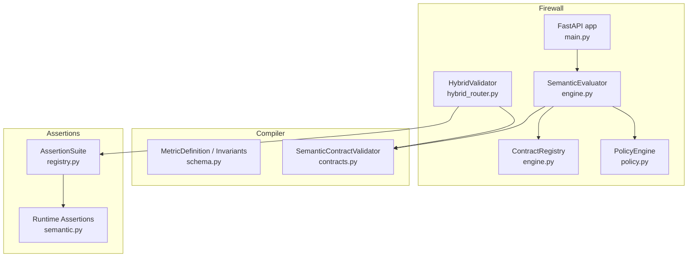
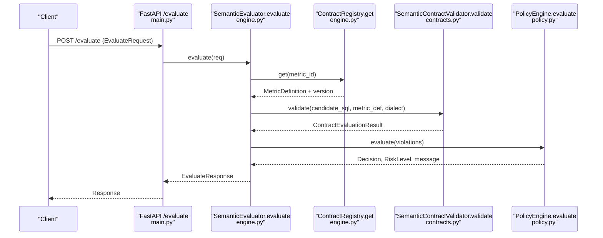
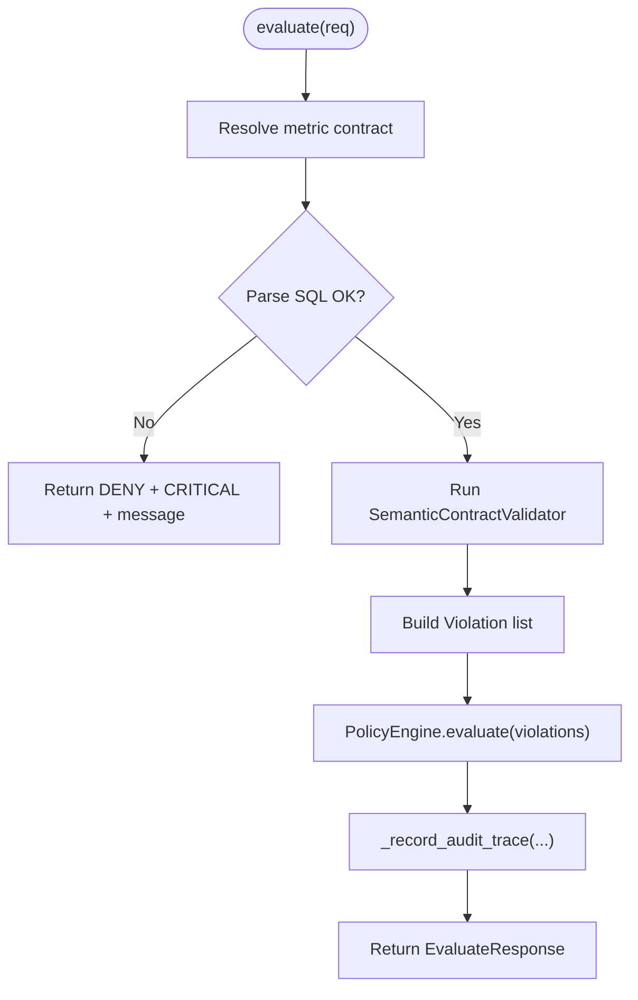
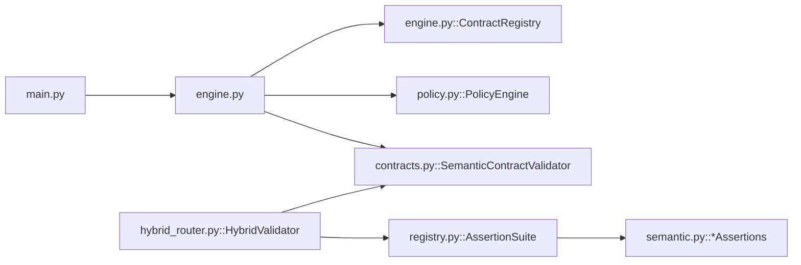

# Firewall Engine

<cite>
**Referenced Files in This Document**
- [engine.py](file://semantic_reliability/firewall/engine.py)
- [models.py](file://semantic_reliability/firewall/models.py)
- [policy.py](file://semantic_reliability/firewall/policy.py)
- [hybrid_router.py](file://semantic_reliability/firewall/hybrid_router.py)
- [main.py](file://semantic_reliability/firewall/main.py)
- [contracts.py](file://semantic_reliability/compiler/contracts.py)
- [schema.py](file://semantic_reliability/compiler/schema.py)
- [registry.py](file://semantic_reliability/assertions/registry.py)
- [semantic.py](file://semantic_reliability/assertions/semantic.py)
- [test_firewall.py](file://tests/test_firewall.py)
- [semantic_firewall_sidecar.yaml](file://deploy/k8s/semantic_firewall_sidecar.yaml)
</cite>

## Table of Contents
1. Introduction
2. Project Structure
3. Core Components
4. Architecture Overview
5. Detailed Component Analysis
6. Dependency Analysis
7. Performance Considerations
8. Troubleshooting Guide
9. Conclusion
10. Appendices

## Introduction
This document explains the firewall engine that enforces semantic contracts on AI-generated SQL queries before execution. It covers the SemanticEvaluator class, ContractRegistry implementation, evaluation pipeline, request/response models (EvaluateRequest and EvaluateResponse), SQL parsing, contract validation, policy enforcement, audit trail generation, integration patterns, error handling, performance considerations, scaling, and monitoring for production deployments.

## Project Structure
The firewall engine is implemented under semantic_reliability/firewall with supporting components in compiler and assertions:
- Firewall API and orchestration: main.py, engine.py, models.py, policy.py, hybrid_router.py
- Contract schema and validation: compiler/schema.py, compiler/contracts.py
- Runtime assertion suite used by hybrid escalation: assertions/registry.py, assertions/semantic.py
- Kubernetes sidecar deployment example: deploy/k8s/semantic_firewall_sidecar.yaml
- Tests demonstrating usage: tests/test_firewall.py

**Diagram sources**
- [main.py:23-33](file://semantic_reliability/firewall/main.py#L23-L33)
- [engine.py:18-132](file://semantic_reliability/firewall/engine.py#L18-L132)
- [policy.py:32-68](file://semantic_reliability/firewall/policy.py#L32-L68)
- [hybrid_router.py:34-156](file://semantic_reliability/firewall/hybrid_router.py#L34-L156)
- [schema.py:83-98](file://semantic_reliability/compiler/schema.py#L83-L98)
- [contracts.py:26-135](file://semantic_reliability/compiler/contracts.py#L26-L135)
- [registry.py:22-160](file://semantic_reliability/assertions/registry.py#L22-L160)
- [semantic.py:8-167](file://semantic_reliability/assertions/semantic.py#L8-L167)

**Section sources**
- [main.py:23-33](file://semantic_reliability/firewall/main.py#L23-L33)
- [engine.py:18-132](file://semantic_reliability/firewall/engine.py#L18-L132)
- [policy.py:32-68](file://semantic_reliability/firewall/policy.py#L32-L68)
- [hybrid_router.py:34-156](file://semantic_reliability/firewall/hybrid_router.py#L34-L156)
- [schema.py:83-98](file://semantic_reliability/compiler/schema.py#L83-L98)
- [contracts.py:26-135](file://semantic_reliability/compiler/contracts.py#L26-L135)
- [registry.py:22-160](file://semantic_reliability/assertions/registry.py#L22-L160)
- [semantic.py:8-167](file://semantic_reliability/assertions/semantic.py#L8-L167)

## Core Components
- ContractRegistry: Loads metric contracts from YAML files into memory and provides lookup by metric_id.
- SemanticEvaluator: Orchestrates evaluation of a request against a registered metric contract, runs static validation, applies policy decisions, and records an immutable audit trace.
- PolicyEngine: Translates violations into governance decisions (ALLOW, AUDIT, REQUIRE_REVIEW, DENY) and risk levels; maps violations to mutation oracles for observability.
- HybridValidator: Static-first verification with adaptive escalation to runtime relational checks when AST complexity warrants it.
- Models: Define the request/response envelope and decision/risk/violation types.

Key responsibilities:
- Parse and validate SQL using a SQL parser.
- Validate semantic invariants defined in MetricDefinition.
- Enforce policy rules based on violation severity and strict mode.
- Produce structured responses and audit logs.

**Section sources**
- [engine.py:18-132](file://semantic_reliability/firewall/engine.py#L18-L132)
- [policy.py:32-68](file://semantic_reliability/firewall/policy.py#L32-L68)
- [hybrid_router.py:34-156](file://semantic_reliability/firewall/hybrid_router.py#L34-L156)
- [models.py:6-51](file://semantic_reliability/firewall/models.py#L6-L51)

## Architecture Overview
The firewall exposes a FastAPI service that receives EvaluateRequest objects, resolves the corresponding metric contract, validates SQL statically, evaluates policy, and returns an EvaluateResponse. An optional hybrid path escalates complex queries to runtime assertions.

**Diagram sources**
- [main.py:36-53](file://semantic_reliability/firewall/main.py#L36-L53)
- [engine.py:54-116](file://semantic_reliability/firewall/engine.py#L54-L116)
- [contracts.py:26-135](file://semantic_reliability/compiler/contracts.py#L26-L135)
- [policy.py:32-68](file://semantic_reliability/firewall/policy.py#L32-L68)

## Detailed Component Analysis

### SemanticEvaluator
Responsibilities:
- Resolve metric contract by metric_id.
- Parse SQL to ensure syntactic validity.
- Run static semantic validation against MetricDefinition invariants.
- Convert validator results into Violation objects.
- Apply policy to determine ALLOW/AUDIT/REQUIRE_REVIEW/DENY.
- Record an immutable audit trace per request.

Error handling:
- Unknown metric contract raises ValueError and is converted to a DENY response with CRITICAL risk.
- SQL parse errors are caught and result in DENY with CRITICAL risk and a descriptive message.

Audit trail:
- Each evaluation writes a trace including trace_id, timestamp, agent_id, metric_id, contract_version, sql_hash, decision, violation_count, and violations.

**Diagram sources**
- [engine.py:54-132](file://semantic_reliability/firewall/engine.py#L54-L132)

**Section sources**
- [engine.py:18-132](file://semantic_reliability/firewall/engine.py#L18-L132)

### ContractRegistry
Responsibilities:
- Load all YAML contract files from a configured directory at startup.
- Register MetricDefinition instances keyed by metric identifier.
- Provide fast lookup by metric_id with clear error if unknown.

Behavior:
- Skips unparseable contract files with warnings.
- Stores both definition and version for each metric.

**Section sources**
- [engine.py:18-44](file://semantic_reliability/firewall/engine.py#L18-L44)
- [schema.py:83-98](file://semantic_reliability/compiler/schema.py#L83-L98)

### PolicyEngine
Responsibilities:
- Map violations to mutation oracle categories for observability.
- Determine decision and risk level based on violation severity and strict_mode.
- Enforce hard DENY in strict mode for critical defects; otherwise REQUIRE_REVIEW.

Decision logic:
- No violations: ALLOW, LOW risk.
- Any ERROR/CRITICAL/FATAL:
  - Strict mode: DENY, CRITICAL risk.
  - Non-strict: REQUIRE_REVIEW, CRITICAL risk.
- Otherwise: AUDIT, HIGH risk.

**Section sources**
- [policy.py:32-68](file://semantic_reliability/firewall/policy.py#L32-L68)

### Hybrid Validator (Static-first with Escalation)
Responsibilities:
- Run Tier 3 static analysis first (AST-based invariant checks).
- Assess AST characteristics to decide whether to escalate to Tier 4 runtime checks.
- If escalated, execute runtime assertions via AssertionSuite over a DuckDB connection.

Escalation triggers include:
- Multiple nested CTEs or deep subqueries.
- Window functions or complex CASE expressions.
- Dynamic null-handling bypasses.

Outcome:
- Returns detailed routing tier, decision, latency, and failure reasons.

**Section sources**
- [hybrid_router.py:34-156](file://semantic_reliability/firewall/hybrid_router.py#L34-L156)
- [registry.py:22-160](file://semantic_reliability/assertions/registry.py#L22-L160)
- [semantic.py:8-167](file://semantic_reliability/assertions/semantic.py#L8-L167)

### Request/Response Models
- EvaluateRequest: Identifies the caller (agent_id), target metric (metric_id), SQL text, dialect, and optional question context.
- EvaluateResponse: Carries decision, execution_allowed flag, compliance status, risk level, violations, contract version, and message.
- Violation: Captures rule, expected vs found, severity, invariant type, and optional mutation equivalence mapping.
- Decision and RiskLevel enums standardize outcomes.

Usage examples are validated in tests.

**Section sources**
- [models.py:6-51](file://semantic_reliability/firewall/models.py#L6-L51)
- [test_firewall.py:8-100](file://tests/test_firewall.py#L8-L100)

### SQL Parsing and Contract Validation
- SQL parsing uses a SQL parser to validate syntax and build an AST for deeper checks.
- SemanticContractValidator enforces:
  - Population invariants: required and forbidden filters.
  - Grain invariants: required grouping dimensions.
  - Aggregation invariants: presence of positive/negative components and expected aggregate function.
  - Timezone invariants: enforce UTC alignment where required.

Results are returned as ContractEvaluationResult with passed flag, metric name, violations, and count of evaluated invariants.

**Section sources**
- [contracts.py:26-135](file://semantic_reliability/compiler/contracts.py#L26-L135)
- [schema.py:5-37](file://semantic_reliability/compiler/schema.py#L5-L37)

### Policy Enforcement Mechanisms
- Violations are enriched with mutation oracle mappings to support observability and correlation with known mutation operators.
- Policy decisions gate execution:
  - ALLOW: proceed without further checks.
  - AUDIT: allow but log for review.
  - REQUIRE_REVIEW: block until human approval.
  - DENY: block immediately.

**Section sources**
- [policy.py:32-68](file://semantic_reliability/firewall/policy.py#L32-L68)

### Audit Trail Generation
- Each evaluation produces an immutable trace containing:
  - trace_id, timestamp, agent_id, metric_id, contract_version, sql_hash, decision, violation_count, and violations.
- Traces are appended to an in-memory list and logged as JSON for downstream ingestion.

**Section sources**
- [engine.py:118-132](file://semantic_reliability/firewall/engine.py#L118-L132)

### Integration Patterns
- Sidecar deployment: The firewall runs as a sidecar container next to the analytics agent, exposing /evaluate. Agents call the local endpoint before executing SQL.
- Prometheus metrics: Optional counters and histograms expose request counts, decisions, violations, latency, and blocked executions.
- Health endpoint: Reports loaded contracts and available metrics.

**Section sources**
- [main.py:23-70](file://semantic_reliability/firewall/main.py#L23-L70)
- [semantic_firewall_sidecar.yaml:23-76](file://deploy/k8s/semantic_firewall_sidecar.yaml#L23-L76)

## Dependency Analysis
High-level dependencies:
- Firewall API depends on SemanticEvaluator, ContractRegistry, and PolicyEngine.
- SemanticEvaluator depends on ContractRegistry and SemanticContractValidator.
- HybridValidator depends on SemanticContractValidator and AssertionSuite.
- AssertionSuite composes concrete runtime assertions.

**Diagram sources**
- [main.py:23-33](file://semantic_reliability/firewall/main.py#L23-L33)
- [engine.py:18-132](file://semantic_reliability/firewall/engine.py#L18-L132)
- [policy.py:32-68](file://semantic_reliability/firewall/policy.py#L32-L68)
- [hybrid_router.py:34-156](file://semantic_reliability/firewall/hybrid_router.py#L34-L156)
- [contracts.py:26-135](file://semantic_reliability/compiler/contracts.py#L26-L135)
- [registry.py:22-160](file://semantic_reliability/assertions/registry.py#L22-L160)
- [semantic.py:8-167](file://semantic_reliability/assertions/semantic.py#L8-L167)

**Section sources**
- [main.py:23-33](file://semantic_reliability/firewall/main.py#L23-L33)
- [engine.py:18-132](file://semantic_reliability/firewall/engine.py#L18-L132)
- [policy.py:32-68](file://semantic_reliability/firewall/policy.py#L32-L68)
- [hybrid_router.py:34-156](file://semantic_reliability/firewall/hybrid_router.py#L34-L156)
- [contracts.py:26-135](file://semantic_reliability/compiler/contracts.py#L26-L135)
- [registry.py:22-160](file://semantic_reliability/assertions/registry.py#L22-L160)
- [semantic.py:8-167](file://semantic_reliability/assertions/semantic.py#L8-L167)

## Performance Considerations
- Static-first validation minimizes runtime cost: most queries are approved or rejected without warehouse execution.
- Escalation only occurs for complex AST patterns or explicit force flags, limiting expensive runtime checks.
- Metrics collection is optional and guarded to avoid overhead when prometheus_client is unavailable.
- Concurrency: The FastAPI server can be scaled horizontally behind a reverse proxy; stateless design supports multiple replicas.

[No sources needed since this section provides general guidance]

## Troubleshooting Guide
Common issues and resolutions:
- Unknown metric contract: Ensure the metric_id exists in ContractRegistry and the contract YAML is valid.
- SQL parse errors: Fix syntax or dialect mismatch; the firewall will DENY with a descriptive message.
- Critical violations:
  - In strict mode: Execution blocked; update SQL to satisfy required filters, grain, and aggregation invariants.
  - In non-strict mode: Requires manual review; address violations before enabling strict enforcement.
- Audit traces: Inspect the in-memory audit_log entries to correlate requests with decisions and violations.

Operational tips:
- Use /health to verify contract loading and availability.
- Use /metrics to observe request volume, decisions, violations, latency, and blocked counts.
- Deploy with liveness/readiness probes to ensure service health.

**Section sources**
- [engine.py:54-132](file://semantic_reliability/firewall/engine.py#L54-L132)
- [policy.py:32-68](file://semantic_reliability/firewall/policy.py#L32-L68)
- [main.py:56-70](file://semantic_reliability/firewall/main.py#L56-L70)
- [semantic_firewall_sidecar.yaml:64-76](file://deploy/k8s/semantic_firewall_sidecar.yaml#L64-L76)

## Conclusion
The firewall engine provides robust, policy-driven protection for AI-generated SQL by combining declarative contracts, static AST validation, and optional runtime assertions. It delivers deterministic decisions, rich audit trails, and production-ready observability. Teams can adopt strict enforcement for safety-critical environments or run in audit/review modes during rollout.

[No sources needed since this section summarizes without analyzing specific files]

## Appendices

### API Endpoints
- POST /evaluate: Accepts EvaluateRequest, returns EvaluateResponse.
- GET /health: Returns service status and loaded contracts.
- GET /metrics: Exposes Prometheus metrics when available.

**Section sources**
- [main.py:36-70](file://semantic_reliability/firewall/main.py#L36-L70)

### Example Usage in Tests
- Demonstrates allowing compliant SQL, denying missing population filters, requiring review in non-strict mode, rejecting unparseable SQL, and verifying audit traces.

**Section sources**
- [test_firewall.py:8-100](file://tests/test_firewall.py#L8-L100)