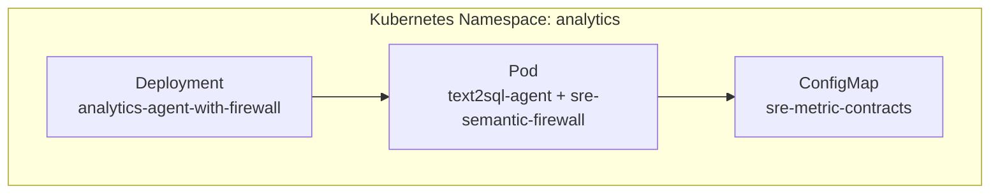
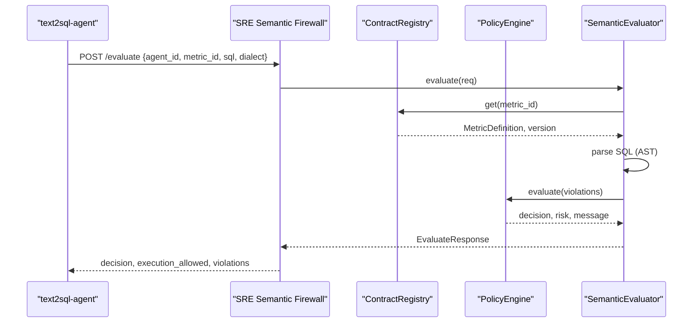
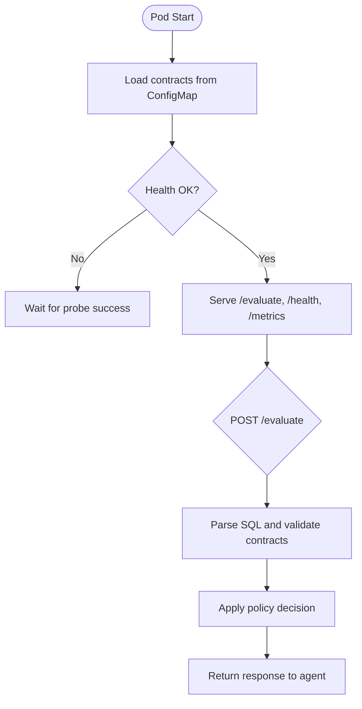
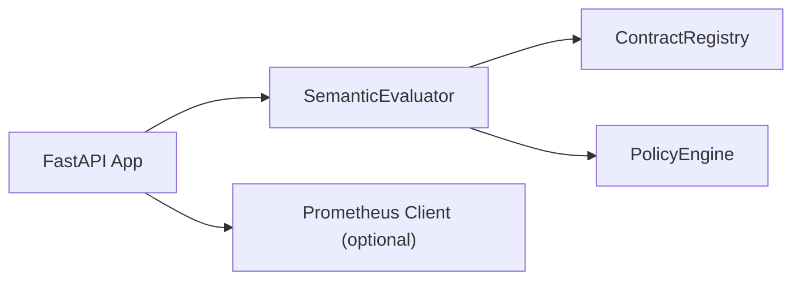

# Kubernetes Deployment

<cite>
**Referenced Files in This Document**
- [semantic_firewall_sidecar.yaml](file://deploy/k8s/semantic_firewall_sidecar.yaml)
- [main.py](file://semantic_reliability/firewall/main.py)
- [engine.py](file://semantic_reliability/firewall/engine.py)
- [policy.py](file://semantic_reliability/firewall/policy.py)
- [Dockerfile](file://demo/Dockerfile)
- [docker-compose.yml](file://demo/docker-compose.yml)
- [pyproject.toml](file://pyproject.toml)
</cite>

## Table of Contents
1. [Introduction](#introduction)
2. [Project Structure](#project-structure)
3. [Core Components](#core-components)
4. [Architecture Overview](#architecture-overview)
5. [Detailed Component Analysis](#detailed-component-analysis)
6. [Dependency Analysis](#dependency-analysis)
7. [Performance Considerations](#performance-considerations)
8. [Troubleshooting Guide](#troubleshooting-guide)
9. [Conclusion](#conclusion)
10. [Appendices](#appendices)

## Introduction
This document provides detailed Kubernetes deployment guidance for the semantic firewall sidecar pattern used to enforce semantic contracts on AI-generated SQL queries before execution. It explains how the sidecar integrates with a primary analytics agent, how to configure resources and scaling, how health checks and metrics are exposed, and how to manage configuration via ConfigMaps. It also includes examples for Helm charts, Kustomize overlays, and GitOps workflows, along with networking, security contexts, and high availability considerations.

## Project Structure
The repository includes:
- A Kubernetes Deployment manifest that defines a two-container Pod: a primary analytics agent and the SRE semantic firewall sidecar.
- A FastAPI-based firewall service exposing endpoints for evaluation, health, and Prometheus metrics.
- Docker assets for local development and containerization.
- Configuration files for dependencies and optional tooling.

**Diagram sources**
- [semantic_firewall_sidecar.yaml:1-103](file://deploy/k8s/semantic_firewall_sidecar.yaml#L1-L103)

**Section sources**
- [semantic_firewall_sidecar.yaml:1-103](file://deploy/k8s/semantic_firewall_sidecar.yaml#L1-L103)

## Core Components
- Sidecar Firewall Service (FastAPI): Implements an evaluate endpoint that parses SQL, validates against metric contracts, applies policy decisions, and exposes health and metrics endpoints.
- Contract Registry: Loads YAML metric contracts from a directory and registers them for validation.
- Policy Engine: Determines ALLOW, AUDIT, REQUIRE_REVIEW, or DENY based on violations and strict mode.
- Kubernetes Manifest: Defines a Deployment with two containers sharing a Pod, resource requests/limits, probes, and a ConfigMap volume for contracts.

Key responsibilities:
- Pre-execution semantic validation of SQL queries generated by agents.
- Enforcing governance policies at runtime.
- Exposing observability via Prometheus metrics and health checks.

**Section sources**
- [main.py:23-70](file://semantic_reliability/firewall/main.py#L23-L70)
- [engine.py:18-132](file://semantic_reliability/firewall/engine.py#L18-L132)
- [policy.py:32-68](file://semantic_reliability/firewall/policy.py#L32-L68)
- [semantic_firewall_sidecar.yaml:22-76](file://deploy/k8s/semantic_firewall_sidecar.yaml#L22-L76)

## Architecture Overview
The sidecar pattern places the semantic firewall next to the analytics agent within the same Pod. The agent calls the firewall’s evaluate endpoint before executing SQL. Contracts are provided via a ConfigMap mounted into the sidecar. Observability is enabled through Prometheus annotations and a /metrics endpoint.

**Diagram sources**
- [main.py:36-53](file://semantic_reliability/firewall/main.py#L36-L53)
- [engine.py:54-116](file://semantic_reliability/firewall/engine.py#L54-L116)
- [policy.py:38-68](file://semantic_reliability/firewall/policy.py#L38-L68)

**Section sources**
- [semantic_firewall_sidecar.yaml:22-76](file://deploy/k8s/semantic_firewall_sidecar.yaml#L22-L76)
- [main.py:23-70](file://semantic_reliability/firewall/main.py#L23-L70)

## Detailed Component Analysis

### Kubernetes Deployment and Sidecar Orchestration
- Two containers run in one Pod:
  - text2sql-agent: Primary application exposing port 3000; configured to call the sidecar at http://127.0.0.1:8080/evaluate.
  - sre-semantic-firewall: Sidecar running the FastAPI app on port 8080; mounts contract YAMLs from a ConfigMap into /etc/sre/contracts.
- Replicas set to 2 for basic HA.
- Prometheus annotations enable scraping at /metrics on port 8080.
- Health and readiness probes target /health on port 8080.

Resource requirements and limits:
- text2sql-agent: requests 500m CPU, 1Gi memory; limits 2 CPU, 4Gi memory.
- sre-semantic-firewall: requests 100m CPU, 256Mi memory; limits 500m CPU, 512Mi memory.

Configuration management:
- Contracts are provided via a ConfigMap named sre-metric-contracts and mounted read-only into the sidecar.
- Environment variables control behavior:
  - SRE_FIREWALL_URL: URL the agent uses to reach the sidecar.
  - SRE_STRICT_MODE: Controls strict enforcement vs audit/review modes.
  - SRE_CONTRACTS_DIR: Path where the sidecar reads contracts.

Networking:
- Agents communicate with the sidecar over localhost (127.0.0.1), ensuring isolation within the Pod.
- External exposure can be achieved by adding a Service if needed.

Scaling:
- Horizontal scaling via replicas=2; consider HPA based on CPU/memory or custom metrics like request rate or latency.

Security context:
- The demo Dockerfile demonstrates non-root user execution and dropping capabilities; similar hardening should be applied to production images.

**Diagram sources**
- [semantic_firewall_sidecar.yaml:22-76](file://deploy/k8s/semantic_firewall_sidecar.yaml#L22-L76)
- [main.py:56-69](file://semantic_reliability/firewall/main.py#L56-L69)

**Section sources**
- [semantic_firewall_sidecar.yaml:1-103](file://deploy/k8s/semantic_firewall_sidecar.yaml#L1-L103)

### Firewall API Endpoints
- POST /evaluate: Accepts an evaluation request, performs AST parsing, contract validation, policy evaluation, and returns a structured response including decision, violations, and metadata.
- GET /health: Returns status and loaded contract information.
- GET /metrics: Exposes Prometheus metrics when available; otherwise returns a placeholder.

Observability:
- Prometheus counters and histograms track total requests, decisions, violations, latency, and blocked executions.

**Section sources**
- [main.py:36-69](file://semantic_reliability/firewall/main.py#L36-L69)

### Contract Loading and Validation
- ContractRegistry scans a directory for YAML files and loads metric definitions.
- SemanticEvaluator parses SQL using a specified dialect, validates against contracts, and records an immutable audit trace per request.

Error handling:
- Unparseable SQL results in a DENY decision with CRITICAL risk.
- Unknown metric IDs raise errors during registry lookup.

**Section sources**
- [engine.py:18-132](file://semantic_reliability/firewall/engine.py#L18-L132)

### Policy Engine Decisions
- PolicyEngine evaluates violations and enforces strict or non-strict modes:
  - Strict mode: Critical violations result in DENY.
  - Non-strict mode: Critical violations require review; minor anomalies are AUDIT.
- Violations are enriched with mutation-equivalent mappings for deeper analysis.

**Section sources**
- [policy.py:32-68](file://semantic_reliability/firewall/policy.py#L32-L68)

### Containerization and Local Development
- Demo Dockerfile builds a Python image, installs dependencies, sets a non-root user, exposes port 8000, and includes a HEALTHCHECK.
- docker-compose defines services for an MCP server and an analytics agent, demonstrating local networking and resource constraints.

Note: In production, use the sidecar image referenced in the Kubernetes manifest and ensure environment variables and volumes match your deployment needs.

**Section sources**
- [Dockerfile:1-34](file://demo/Dockerfile#L1-L34)
- [docker-compose.yml:1-52](file://demo/docker-compose.yml#L1-L52)

## Dependency Analysis
The firewall depends on:
- FastAPI and Starlette for HTTP serving.
- sqlglot for SQL parsing.
- pyyaml for loading contracts.
- Optional prometheus_client for metrics.

Runtime configuration:
- SRE_STRICT_MODE toggles strict enforcement.
- SRE_CONTRACTS_DIR points to the mounted ConfigMap path.
- Default contract discovery falls back to a default directory if none is provided.

**Diagram sources**
- [main.py:23-70](file://semantic_reliability/firewall/main.py#L23-L70)
- [engine.py:18-132](file://semantic_reliability/firewall/engine.py#L18-L132)
- [policy.py:32-68](file://semantic_reliability/firewall/policy.py#L32-L68)

**Section sources**
- [pyproject.toml:15-25](file://pyproject.toml#L15-L25)
- [main.py:10-21](file://semantic_reliability/firewall/main.py#L10-L21)

## Performance Considerations
- Resource requests/limits:
  - Ensure sufficient CPU and memory for both containers based on expected query complexity and throughput.
  - Monitor CPU throttling and adjust limits accordingly.
- Concurrency:
  - Uvicorn handles async requests; tune workers and threads based on workload characteristics.
- Contract size:
  - Large numbers of contracts may increase startup time; consider splitting into multiple ConfigMaps and selective mounting if necessary.
- Probes:
  - Tune initialDelaySeconds and periodSeconds for liveness/readiness to avoid premature restarts during cold starts.

[No sources needed since this section provides general guidance]

## Troubleshooting Guide
Common issues and resolutions:
- Health check failures:
  - Verify /health responds successfully on port 8080 and that the sidecar has loaded contracts.
- Evaluation errors:
  - Check for unparseable SQL or unknown metric IDs; these result in DENY decisions with CRITICAL risk.
- Missing contracts:
  - Ensure the ConfigMap is correctly mounted at SRE_CONTRACTS_DIR and contains valid YAML files.
- Metrics unavailable:
  - If prometheus_client is not installed, /metrics returns a placeholder; install the dependency to enable full metrics.

Operational tips:
- Use logs to inspect audit traces emitted per request.
- Adjust SRE_STRICT_MODE to move between strict blocking and audit/review modes during rollout.

**Section sources**
- [main.py:56-69](file://semantic_reliability/firewall/main.py#L56-L69)
- [engine.py:54-84](file://semantic_reliability/firewall/engine.py#L54-L84)
- [semantic_firewall_sidecar.yaml:45-75](file://deploy/k8s/semantic_firewall_sidecar.yaml#L45-L75)

## Conclusion
The semantic firewall sidecar provides robust pre-execution governance for AI-generated SQL by enforcing declarative contracts and policy decisions at runtime. Deployed as a sidecar within the same Pod as the analytics agent, it ensures low-latency, secure, and observable enforcement. With ConfigMaps for configuration, Prometheus for observability, and clear resource boundaries, this pattern scales well and supports high availability deployments.

[No sources needed since this section summarizes without analyzing specific files]

## Appendices

### Appendix A: Helm Chart Example
Create a Helm chart that renders the Kubernetes Deployment and ConfigMap with templated values:
- Values:
  - replicaCount: number of pods
  - agent.image.repository and .tag
  - firewall.image.repository and .tag
  - firewall.resources.requests and .limits
  - agent.resources.requests and .limits
  - firewall.env.SRE_STRICT_MODE
  - firewall.env.SRE_CONTRACTS_DIR
  - configMap.contracts: map of filename to YAML content
- Templates:
  - templates/deployment.yaml: render the Deployment with two containers, env vars, ports, probes, and volumeMounts.
  - templates/configmap.yaml: render the ConfigMap with contract YAMLs.
  - templates/service.yaml (optional): expose the sidecar externally if needed.

Best practices:
- Use secrets for sensitive values (e.g., database credentials).
- Pin image versions and use tags for reproducibility.
- Include PodDisruptionBudget and HorizontalPodAutoscaler via separate templates or values.

[No sources needed since this section provides conceptual guidance]

### Appendix B: Kustomize Overlay Example
Use Kustomize to overlay base manifests:
- Base: deploy/k8s/semantic_firewall_sidecar.yaml
- Overlays:
  - dev: lower replicas, relaxed strict mode, smaller resources.
  - staging: moderate replicas, strict mode off for testing.
  - prod: higher replicas, strict mode on, tuned resources.
- Patching:
  - Use patchesStrategicMerge or jsonPatch to modify replicas, env, and resources per environment.
  - Add NetworkPolicies and PodDisruptionBudgets in overlays for production.

[No sources needed since this section provides conceptual guidance]

### Appendix C: GitOps Workflow
- Store base manifests and overlays in a Git repository.
- Use Argo CD or Flux to sync desired state to the cluster.
- Promote changes across environments by merging PRs into branches (dev -> staging -> prod).
- Automate validation:
  - Lint manifests with kubeval or kubeconform.
  - Run policy checks (e.g., OPA/Kyverno) to enforce resource limits and security contexts.

[No sources needed since this section provides conceptual guidance]

### Appendix D: Networking and Security Contexts
- Networking:
  - Agent-to-sidecar communication uses localhost; no external exposure required unless explicitly needed.
  - For multi-tenant clusters, consider NetworkPolicies to restrict ingress/egress.
- Security:
  - Run containers as non-root users (as demonstrated in the demo Dockerfile).
  - Drop unnecessary capabilities and set readOnlyRootFilesystem where possible.
  - Use Secrets for sensitive configuration; keep contracts in ConfigMaps.

**Section sources**
- [Dockerfile:3-6](file://demo/Dockerfile#L3-L6)
- [docker-compose.yml:19-22](file://demo/docker-compose.yml#L19-L22)

### Appendix E: Scaling and High Availability
- Replicas:
  - Set replicas to at least 2 for HA; distribute load across nodes using node affinity or anti-affinity rules.
- Horizontal Pod Autoscaler:
  - Scale based on CPU utilization or custom metrics (e.g., request rate, latency).
- PodDisruptionBudget:
  - Define PDB to allow voluntary disruptions while maintaining minimum availability.
- Rolling updates:
  - Use rolling update strategy to minimize downtime during deployments.

[No sources needed since this section provides general guidance]