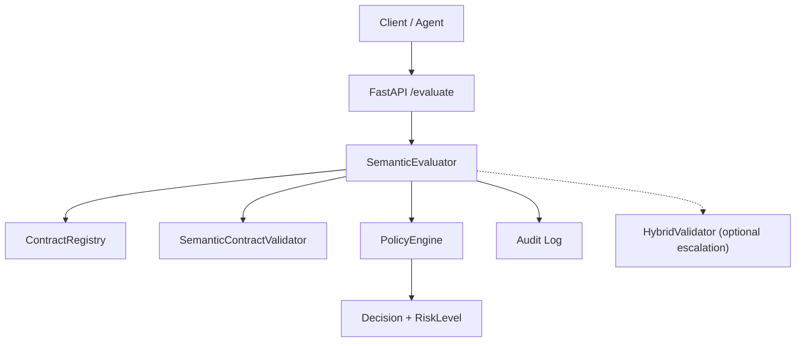
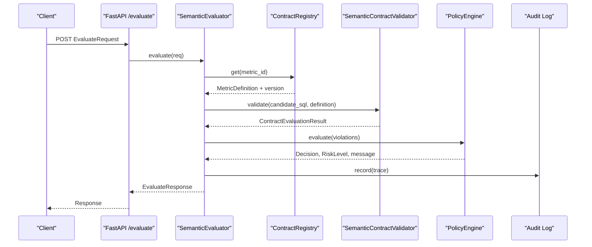
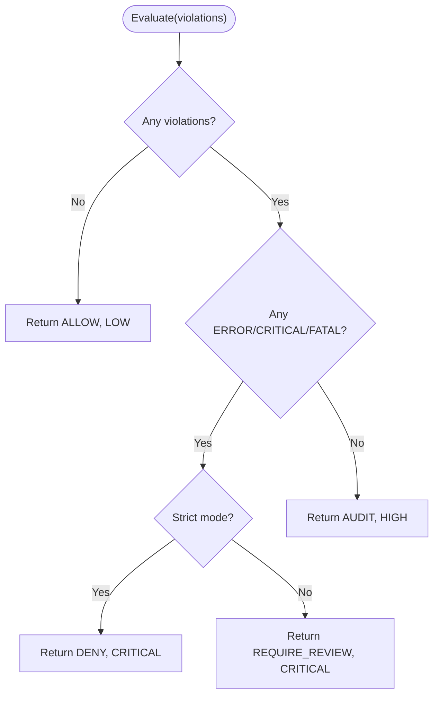
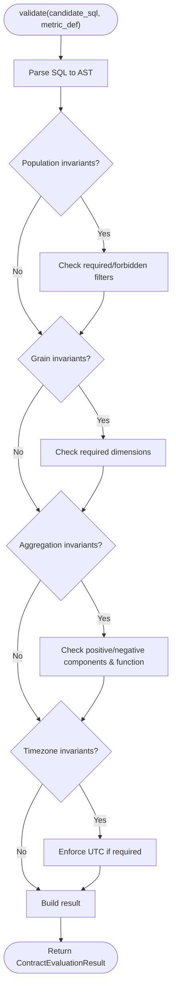
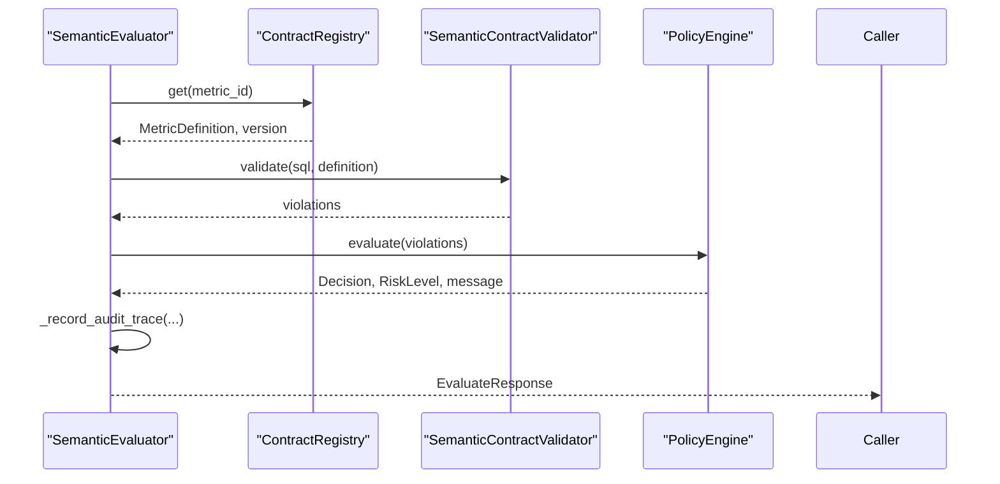
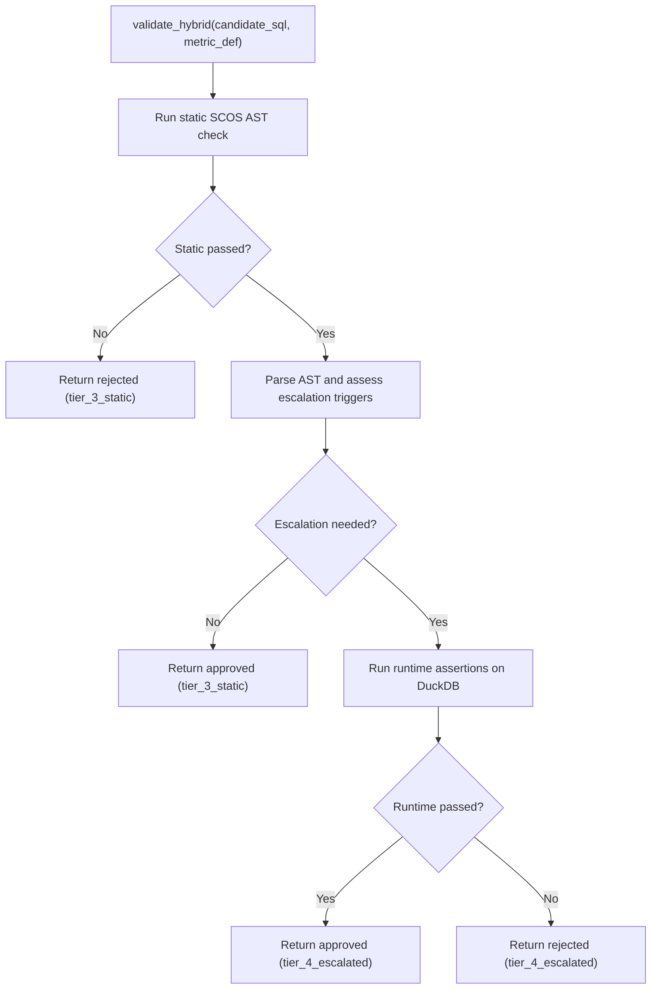
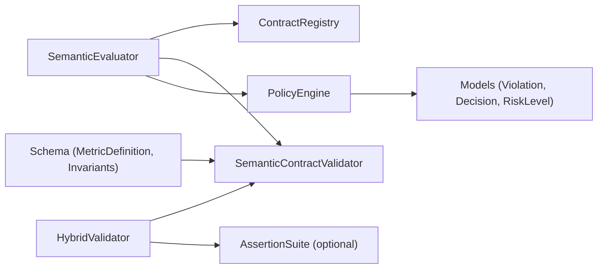

# Policy Enforcement

<cite>
**Referenced Files in This Document**
- [engine.py](file://semantic_reliability/firewall/engine.py)
- [policy.py](file://semantic_reliability/firewall/policy.py)
- [models.py](file://semantic_reliability/firewall/models.py)
- [main.py](file://semantic_reliability/firewall/main.py)
- [hybrid_router.py](file://semantic_reliability/firewall/hybrid_router.py)
- [contracts.py](file://semantic_reliability/compiler/contracts.py)
- [schema.py](file://semantic_reliability/compiler/schema.py)
- [validity_policy.yaml](file://semantic_reliability/harness/validity_policy.yaml)
- [test_firewall.py](file://tests/test_firewall.py)
- [semantic_assertions.yaml](file://examples/assertions/semantic_assertions.yaml)
</cite>

## Table of Contents
1. Introduction
2. Project Structure
3. Core Components
4. Architecture Overview
5. Detailed Component Analysis
6. Dependency Analysis
7. Performance Considerations
8. Troubleshooting Guide
9. Conclusion
10. Appendices

## Introduction
This document explains the policy enforcement system that protects analytical SQL generated by AI agents. It covers how semantic contracts are enforced, how decisions are made, and how risk is assessed at runtime. You will learn about violation types, severity levels, governance rules, configuration options, custom rule creation, and policy versioning. The guide also includes examples ranging from strict blocking to audit-only modes, plus testing, validation, and migration strategies for enterprise environments.

## Project Structure
The policy enforcement system is centered around a FastAPI service that evaluates candidate SQL against metric contracts and applies policy-driven decisions. Key modules include:
- Contract registry and evaluation pipeline
- Semantic contract validator (AST-based)
- Policy engine (decision logic)
- Hybrid router (static-first with adaptive escalation)
- Models for requests, responses, violations, decisions, and risk levels
- Versioned harness policy for benchmark validity thresholds

**Diagram sources**
- [main.py:23-53](file://semantic_reliability/firewall/main.py#L23-L53)
- [engine.py:46-132](file://semantic_reliability/firewall/engine.py#L46-L132)
- [policy.py:32-68](file://semantic_reliability/firewall/policy.py#L32-L68)
- [hybrid_router.py:34-156](file://semantic_reliability/firewall/hybrid_router.py#L34-L156)

**Section sources**
- [main.py:23-70](file://semantic_reliability/firewall/main.py#L23-L70)
- [engine.py:18-132](file://semantic_reliability/firewall/engine.py#L18-L132)

## Core Components
- ContractRegistry: Loads and serves metric definitions and their versions from YAML files.
- SemanticContractValidator: Parses SQL into an AST and checks declared semantic invariants (population, grain, aggregation, timezone).
- PolicyEngine: Translates violations into governance decisions (ALLOW, AUDIT, REQUIRE_REVIEW, DENY) and assigns risk levels.
- HybridValidator: Static-first verification with adaptive escalation to runtime relational checks when AST complexity or ambiguity warrants it.
- Models: Typed request/response structures, violations, decisions, and risk levels.

Key responsibilities:
- Enforce business-defined semantic contracts before execution.
- Provide deterministic decisions with clear rationale and audit trails.
- Support strict vs. non-strict modes for different operational policies.

**Section sources**
- [engine.py:18-132](file://semantic_reliability/firewall/engine.py#L18-L132)
- [contracts.py:26-135](file://semantic_reliability/compiler/contracts.py#L26-L135)
- [policy.py:32-68](file://semantic_reliability/firewall/policy.py#L32-L68)
- [hybrid_router.py:34-156](file://semantic_reliability/firewall/hybrid_router.py#L34-L156)
- [models.py:6-51](file://semantic_reliability/firewall/models.py#L6-L51)

## Architecture Overview
The runtime flow starts at the API endpoint, which delegates to the evaluator. The evaluator parses SQL, validates against the active metric contract, collects violations, and asks the policy engine for a decision. An immutable audit trace is recorded for every request. Optionally, a hybrid path escalates to runtime checks for complex queries.

**Diagram sources**
- [main.py:36-53](file://semantic_reliability/firewall/main.py#L36-L53)
- [engine.py:54-132](file://semantic_reliability/firewall/engine.py#L54-L132)
- [contracts.py:26-135](file://semantic_reliability/compiler/contracts.py#L26-L135)
- [policy.py:32-68](file://semantic_reliability/firewall/policy.py#L32-L68)

## Detailed Component Analysis

### PolicyEngine: Decision-Making Logic and Risk Assessment
- Inputs: list of Violation objects produced by contract validation.
- Behavior:
  - If no violations: ALLOW with LOW risk.
  - If any ERROR/CRITICAL/FATAL severity:
    - Strict mode: DENY with CRITICAL risk.
    - Non-strict mode: REQUIRE_REVIEW with CRITICAL risk.
  - Otherwise (warnings only): AUDIT with HIGH risk.
- Mutation mapping: Each violation is enriched with a mutation-equivalent operator to support targeted testing and regression analysis.

**Diagram sources**
- [policy.py:32-68](file://semantic_reliability/firewall/policy.py#L32-L68)

**Section sources**
- [policy.py:32-68](file://semantic_reliability/firewall/policy.py#L32-L68)

### SemanticContractValidator: Invariant Checks and Violation Generation
- Population invariant: Ensures required filters exist and forbidden filters do not appear.
- Grain invariant: Ensures required grouping dimensions are present.
- Aggregation invariant: Ensures positive/negative components and expected functions are included.
- Timezone invariant: Enforces UTC alignment when required.
- Output: ContractEvaluationResult with passed flag, metric name, violations, and count of evaluated invariants.

**Diagram sources**
- [contracts.py:26-135](file://semantic_reliability/compiler/contracts.py#L26-L135)

**Section sources**
- [contracts.py:26-135](file://semantic_reliability/compiler/contracts.py#L26-L135)

### SemanticEvaluator: Orchestration and Audit Trail
- Parses SQL using sqlglot; unparseable SQL results in immediate DENY with CRITICAL risk.
- Runs contract validation and maps violations into internal models.
- Invokes PolicyEngine to compute decision and risk.
- Records an immutable audit trace including trace ID, agent ID, metric ID, contract version, SQL hash, decision, violations, and timestamp.

**Diagram sources**
- [engine.py:46-132](file://semantic_reliability/firewall/engine.py#L46-L132)

**Section sources**
- [engine.py:46-132](file://semantic_reliability/firewall/engine.py#L46-L132)

### HybridValidator: Static-First Verification with Adaptive Escalation
- Step 1: Run static SCOS AST linter against the metric contract.
- Step 2: If static pass, assess AST complexity (CTEs, subqueries, window functions, CASE branches) to decide whether to escalate.
- Step 3: If escalation triggers and runtime engine is available, execute assertions against a DuckDB connection and aggregate failures.
- Returns detailed routing info, latency, and bytes scanned (synthetic for planning).

**Diagram sources**
- [hybrid_router.py:34-156](file://semantic_reliability/firewall/hybrid_router.py#L34-L156)

**Section sources**
- [hybrid_router.py:34-156](file://semantic_reliability/firewall/hybrid_router.py#L34-L156)

### Models: Requests, Responses, Violations, Decisions, and Risk Levels
- Decision: ALLOW, AUDIT, REQUIRE_REVIEW, DENY.
- RiskLevel: LOW, MEDIUM, HIGH, CRITICAL.
- EvaluateRequest: Identifiers, SQL, dialect, agent context, optional question.
- Violation: Rule, expected, found, severity, invariant type, and optional mutation equivalent.
- EvaluateResponse: Full outcome including decision, execution_allowed, contract_compliant, risk, violations, contract_version, and message.

**Section sources**
- [models.py:6-51](file://semantic_reliability/firewall/models.py#L6-L51)

### API Surface and Observability
- Endpoint: POST /evaluate returns EvaluateResponse.
- Health: GET /health reports loaded contracts and metrics.
- Metrics: GET /metrics exposes Prometheus counters and histograms for requests, decisions, violations, latency, and blocked executions.

**Section sources**
- [main.py:23-70](file://semantic_reliability/firewall/main.py#L23-L70)

## Dependency Analysis
- SemanticEvaluator depends on ContractRegistry, SemanticContractValidator, and PolicyEngine.
- PolicyEngine depends on models (Violation, Decision, RiskLevel).
- HybridValidator depends on SemanticContractValidator and optionally AssertionSuite for runtime checks.
- Contracts and schema define the declarative policy surface (invariants and probes).

**Diagram sources**
- [engine.py:46-132](file://semantic_reliability/firewall/engine.py#L46-L132)
- [policy.py:32-68](file://semantic_reliability/firewall/policy.py#L32-L68)
- [contracts.py:26-135](file://semantic_reliability/compiler/contracts.py#L26-L135)
- [schema.py:5-98](file://semantic_reliability/compiler/schema.py#L5-L98)
- [hybrid_router.py:34-156](file://semantic_reliability/firewall/hybrid_router.py#L34-L156)

**Section sources**
- [engine.py:46-132](file://semantic_reliability/firewall/engine.py#L46-L132)
- [policy.py:32-68](file://semantic_reliability/firewall/policy.py#L32-L68)
- [contracts.py:26-135](file://semantic_reliability/compiler/contracts.py#L26-L135)
- [schema.py:5-98](file://semantic_reliability/compiler/schema.py#L5-L98)
- [hybrid_router.py:34-156](file://semantic_reliability/firewall/hybrid_router.py#L34-L156)

## Performance Considerations
- Static-first validation avoids warehouse scans and minimizes latency for simple queries.
- Escalation to runtime checks incurs additional cost; use hybrid mode judiciously for complex queries.
- Prometheus metrics enable monitoring of latency, decision distribution, and blocked queries.
- Avoid overly broad invariants to reduce false positives and unnecessary escalations.

[No sources needed since this section provides general guidance]

## Troubleshooting Guide
Common issues and resolutions:
- Unparseable SQL: Results in DENY with CRITICAL risk and a parse error message. Validate SQL syntax and dialect settings.
- Missing population filter: Triggers CRITICAL severity; add required filters to satisfy the contract.
- Missing grouping dimension: Triggers CRITICAL severity; include required GROUP BY columns.
- Aggregation mismatch: Triggers HIGH severity; ensure positive/negative components and expected functions are present.
- Timezone drift: Triggers HIGH severity; align timestamps to UTC per contract.

Operational tips:
- Use non-strict mode to require review instead of blocking when transitioning policies.
- Inspect audit logs for trace IDs and violation details to pinpoint root causes.
- Leverage hybrid escalation for ambiguous or complex queries to confirm behavior under runtime conditions.

**Section sources**
- [engine.py:54-132](file://semantic_reliability/firewall/engine.py#L54-L132)
- [contracts.py:44-135](file://semantic_reliability/compiler/contracts.py#L44-L135)
- [policy.py:38-68](file://semantic_reliability/firewall/policy.py#L38-L68)

## Conclusion
The policy enforcement system provides a robust, auditable control plane for AI-generated analytical SQL. By combining declarative semantic contracts, AST-based validation, and a configurable policy engine, it ensures that only compliant queries execute while maintaining visibility and flexibility for evolving governance needs. Enterprise teams can adopt strict blocking for production and audit-only modes for development, with clear migration paths and comprehensive testing support.

[No sources needed since this section summarizes without analyzing specific files]

## Appendices

### Violation Types, Severity Levels, and Governance Rules
- Violation categories:
  - Population Invariant: Required/forbidden filters in WHERE clause.
  - Reporting Grain Invariant: Required grouping dimensions.
  - Aggregation Invariant: Positive/negative components and expected functions.
  - Timezone Invariant: UTC alignment requirements.
- Severity levels:
  - CRITICAL/HIGH/WARNING mapped to policy outcomes.
- Governance rules:
  - Strict mode: Critical defects block execution (DENY).
  - Non-strict mode: Critical defects require manual review (REQUIRE_REVIEW).
  - Warnings: Execution allowed but logged (AUDIT).

**Section sources**
- [contracts.py:44-135](file://semantic_reliability/compiler/contracts.py#L44-L135)
- [policy.py:38-68](file://semantic_reliability/firewall/policy.py#L38-L68)

### Policy Configuration Options
- PolicyEngine.strict_mode: Controls blocking vs. review behavior for critical defects.
- ContractRegistry contract_dir: Directory containing YAML metric definitions for auto-discovery.
- HybridValidator.force_escalate: Forces runtime checks regardless of AST complexity.
- Dialect selection: Ensure correct SQL dialect for parsing and validation.

**Section sources**
- [policy.py:32-68](file://semantic_reliability/firewall/policy.py#L32-L68)
- [engine.py:18-52](file://semantic_reliability/firewall/engine.py#L18-L52)
- [hybrid_router.py:62-156](file://semantic_reliability/firewall/hybrid_router.py#L62-L156)

### Custom Rule Creation
- Define new invariants via MetricDefinition.invariants:
  - PopulationInvariant: Add required_filters or forbidden_filters.
  - GrainInvariant: Add required_dimensions or adjust allow_over_aggregation.
  - AggregationInvariant: Specify required_function, positive_components, negative_components.
  - TimeInvariant: Set timezone and period_grain as needed.
- Implement additional checks in SemanticContractValidator.validate to enforce domain-specific rules.

**Section sources**
- [schema.py:5-98](file://semantic_reliability/compiler/schema.py#L5-L98)
- [contracts.py:26-135](file://semantic_reliability/compiler/contracts.py#L26-L135)

### Policy Versioning
- Contract versions are tracked per metric in ContractRegistry, enabling rollouts and rollback strategies.
- Harness policy file defines versioned thresholds for benchmark validity and confidence levels.

**Section sources**
- [engine.py:21-43](file://semantic_reliability/firewall/engine.py#L21-L43)
- [validity_policy.yaml:1-17](file://semantic_reliability/harness/validity_policy.yaml#L1-L17)

### Examples of Policy Scenarios
- Strict mode:
  - Critical violations block execution immediately (DENY).
  - Suitable for production environments requiring zero tolerance for semantic drift.
- Non-strict mode:
  - Critical violations trigger manual review (REQUIRE_REVIEW).
  - Useful during rollout or when investigating edge cases.
- Audit-only mode:
  - Warnings allow execution but log for audit (AUDIT).
  - Ideal for development or exploratory analytics.

**Section sources**
- [policy.py:38-68](file://semantic_reliability/firewall/policy.py#L38-L68)
- [test_firewall.py:28-100](file://tests/test_firewall.py#L28-L100)

### Testing, Validation, and Migration Strategies
- Unit tests demonstrate:
  - Allowing compliant SQL.
  - Denying missing population filters.
  - Requiring review in non-strict mode.
  - Handling unparseable SQL.
  - Recording audit traces.
- Validation suites:
  - Use semantic_assertions.yaml to define not_null, expected_grain, required_population, and metric_value checks.
- Migration strategy:
  - Introduce new invariants gradually; start with audit-only, then move to review, then enforce strict blocking.
  - Use hybrid escalation to validate complex queries under runtime conditions before full enforcement.

**Section sources**
- [test_firewall.py:8-100](file://tests/test_firewall.py#L8-L100)
- [semantic_assertions.yaml:1-25](file://examples/assertions/semantic_assertions.yaml#L1-L25)