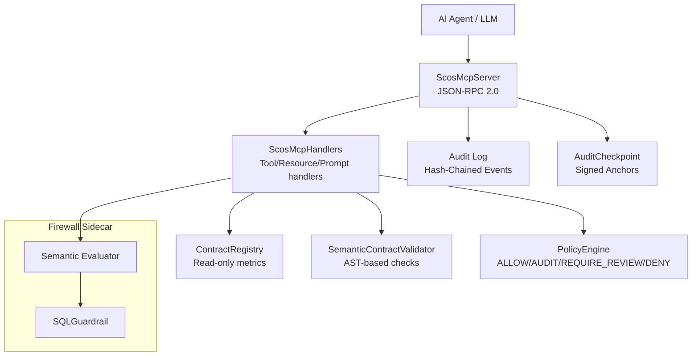
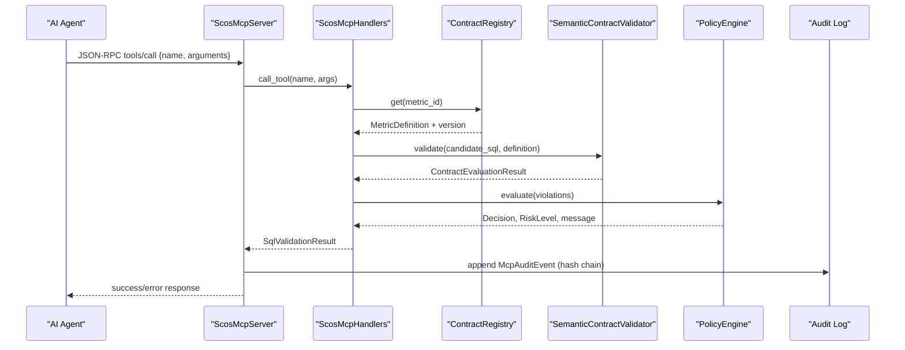
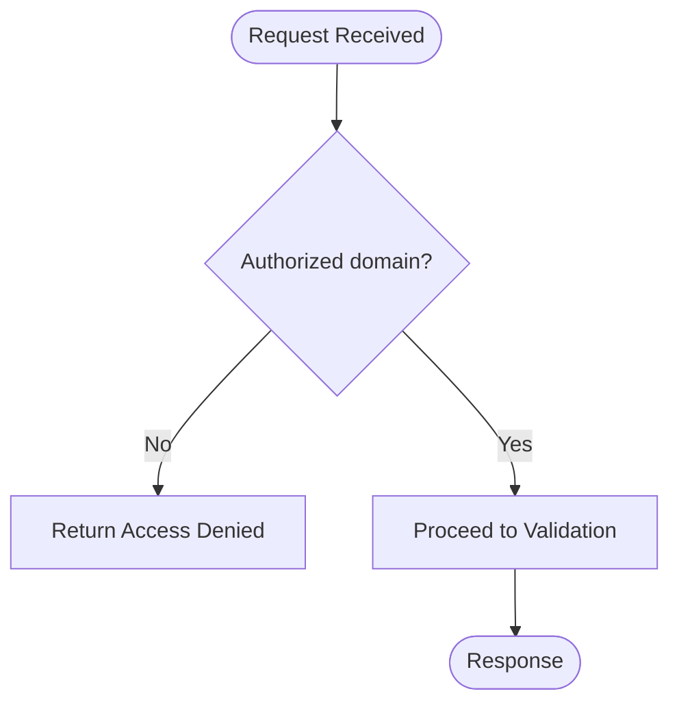
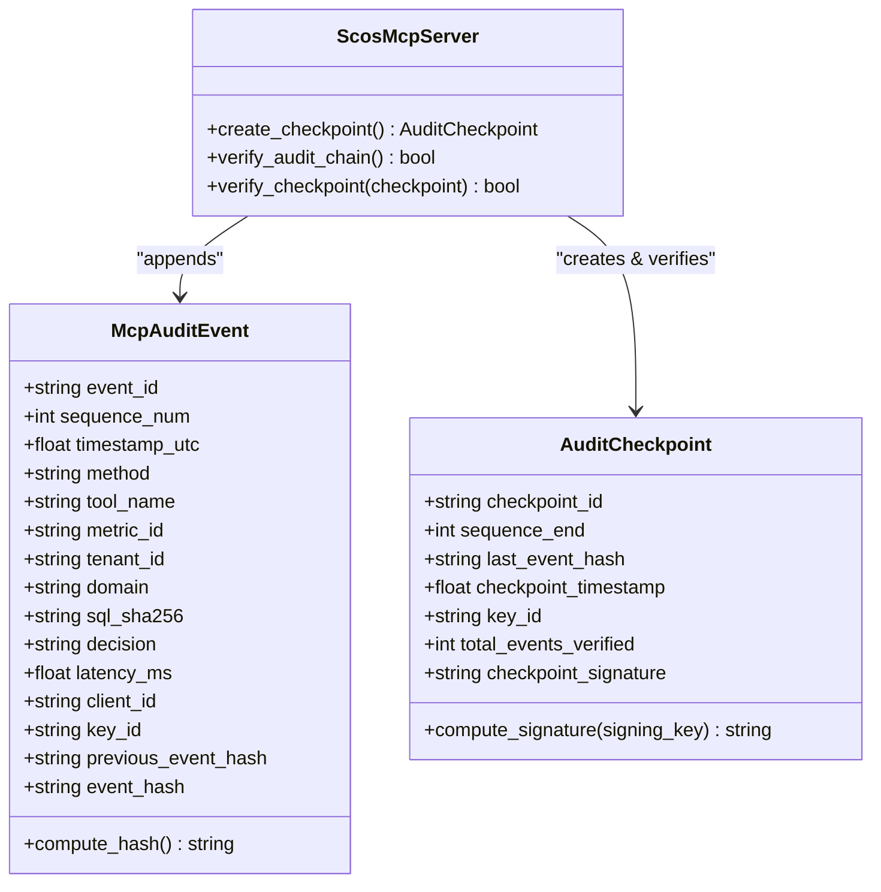
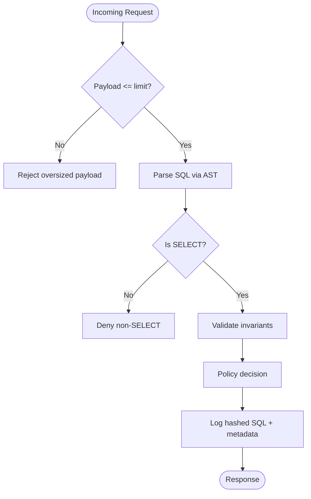
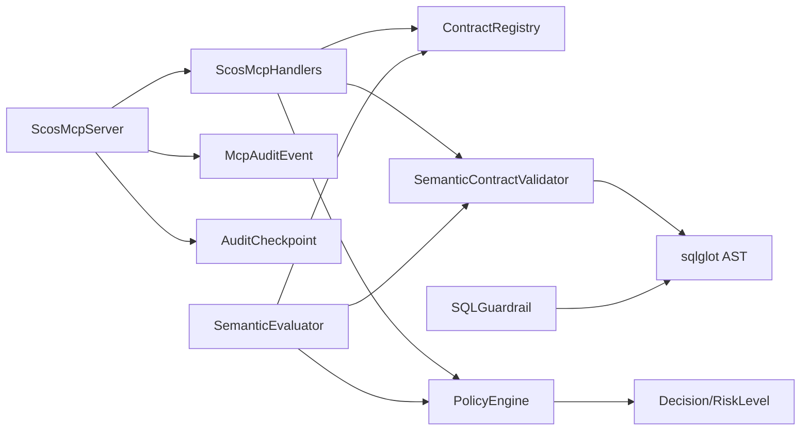

# Security Architecture

<cite>
**Referenced Files in This Document**
- [MCP_SECURITY_AND_THREAT_MODEL.md](file://docs/MCP_SECURITY_AND_THREAT_MODEL.md)
- [ENTERPRISE_ARCHITECTURE_AND_CISO_WHITEPAPER.md](file://docs/ENTERPRISE_ARCHITECTURE_AND_CISO_WHITEPAPER.md)
- [server.py](file://semantic_reliability/mcp/server.py)
- [handlers.py](file://semantic_reliability/mcp/handlers.py)
- [security.py](file://semantic_reliability/mcp/security.py)
- [models.py](file://semantic_reliability/mcp/models.py)
- [engine.py](file://semantic_reliability/firewall/engine.py)
- [policy.py](file://semantic_reliability/firewall/policy.py)
- [contracts.py](file://semantic_reliability/compiler/contracts.py)
- [sql_guardrail.py](file://semantic_reliability/runtime/sql_guardrail.py)
- [guardrail.py](file://semantic_reliability/guardrail.py)
- [semantic_firewall_sidecar.yaml](file://deploy/k8s/semantic_firewall_sidecar.yaml)
</cite>

## Table of Contents
1. [Introduction](#introduction)
2. [Project Structure](#project-structure)
3. [Core Components](#core-components)
4. [Architecture Overview](#architecture-overview)
5. [Detailed Component Analysis](#detailed-component-analysis)
6. [Dependency Analysis](#dependency-analysis)
7. [Performance Considerations](#performance-considerations)
8. [Troubleshooting Guide](#troubleshooting-guide)
9. [Conclusion](#conclusion)
10. [Appendices](#appendices)

## Introduction
This document describes the security architecture of the Semantic Reliability Engine with a focus on threat mitigation, access control, cryptographic verification, and secure communication for Text-to-SQL workflows. It explains how the system enforces read-only semantic guidance, validates SQL against business contracts, prevents execution of unsafe or non-compliant queries, and produces tamper-evident audit trails suitable for compliance and incident response.

Key security goals:
- Prevent arbitrary execution and data mutation by AI agents
- Enforce declarative metric contracts (SCOS) before any query runs
- Provide hash-chained, signed audit evidence for compliance
- Limit input size and complexity to mitigate denial-of-service
- Scope access by tenant and domain to prevent cross-tenant leakage

**Section sources**
- [MCP_SECURITY_AND_THREAT_MODEL.md:1-69](file://docs/MCP_SECURITY_AND_THREAT_MODEL.md#L1-L69)
- [ENTERPRISE_ARCHITECTURE_AND_CISO_WHITEPAPER.md:50-181](file://docs/ENTERPRISE_ARCHITECTURE_AND_CISO_WHITEPAPER.md#L50-L181)

## Project Structure
Security-relevant components are organized into:
- MCP Server: JSON-RPC 2.0 server exposing read-only tools/resources/prompts with strict authorization and audit chaining
- Firewall: Contract registry, semantic evaluator, policy engine, and immutable audit traces
- Compiler: Invariant validation over ASTs parsed from candidate SQL
- Runtime Guardrails: Structural enforcement (SELECT-only, LIMIT caps)
- Deployment: Kubernetes sidecar pattern isolating the firewall from the agent

**Diagram sources**
- [server.py:16-220](file://semantic_reliability/mcp/server.py#L16-L220)
- [handlers.py:19-349](file://semantic_reliability/mcp/handlers.py#L19-L349)
- [engine.py:18-132](file://semantic_reliability/firewall/engine.py#L18-L132)
- [contracts.py:26-135](file://semantic_reliability/compiler/contracts.py#L26-L135)
- [policy.py:32-68](file://semantic_reliability/firewall/policy.py#L32-L68)
- [sql_guardrail.py:71-102](file://semantic_reliability/runtime/sql_guardrail.py#L71-L102)

**Section sources**
- [server.py:16-220](file://semantic_reliability/mcp/server.py#L16-L220)
- [handlers.py:19-349](file://semantic_reliability/mcp/handlers.py#L19-L349)
- [engine.py:18-132](file://semantic_reliability/firewall/engine.py#L18-L132)
- [contracts.py:26-135](file://semantic_reliability/compiler/contracts.py#L26-L135)
- [policy.py:32-68](file://semantic_reliability/firewall/policy.py#L32-L68)
- [sql_guardrail.py:71-102](file://semantic_reliability/runtime/sql_guardrail.py#L71-L102)
- [semantic_firewall_sidecar.yaml:1-103](file://deploy/k8s/semantic_firewall_sidecar.yaml#L1-L103)

## Core Components
- ScosMcpServer: Implements JSON-RPC 2.0 methods, request validation, payload limits, domain scoping, and hash-chained audit events with periodic signed checkpoints.
- ScosMcpHandlers: Read-only tool/resource/prompt handlers enforcing allowed domains and returning only metadata/invariants; no raw data exposure.
- ContractRegistry: In-memory, read-only registry of SCOS metric definitions loaded from YAML directories.
- SemanticContractValidator: Parses candidate SQL via AST and checks population, grain, aggregation, and timezone invariants.
- PolicyEngine: Maps violations to governance decisions (ALLOW, AUDIT, REQUIRE_REVIEW, DENY) based on severity and strict mode.
- SQLGuardrail: Structural guardrail ensuring SELECT-only statements and capping row limits.
- SemanticGuardrail: High-level orchestrator combining contract evaluation and drift scoring for pre-execution gating.
- Audit models: McpAuditEvent and AuditCheckpoint provide tamper-evident chains and HMAC-signed anchors.

**Section sources**
- [server.py:16-220](file://semantic_reliability/mcp/server.py#L16-L220)
- [handlers.py:19-349](file://semantic_reliability/mcp/handlers.py#L19-L349)
- [engine.py:18-132](file://semantic_reliability/firewall/engine.py#L18-L132)
- [contracts.py:26-135](file://semantic_reliability/compiler/contracts.py#L26-L135)
- [policy.py:32-68](file://semantic_reliability/firewall/policy.py#L32-L68)
- [sql_guardrail.py:71-102](file://semantic_reliability/runtime/sql_guardrail.py#L71-L102)
- [guardrail.py:45-153](file://semantic_reliability/guardrail.py#L45-L153)
- [models.py:9-121](file://semantic_reliability/mcp/models.py#L9-L121)

## Architecture Overview
The system operates as a read-only semantic consultant that never executes SQL against production systems. All requests pass through layered controls:
- Transport and request validation at the MCP server layer
- Domain-scoped authorization for tools and resources
- AST-based invariant validation against SCOS contracts
- Policy-driven decision making with configurable strictness
- Immutable, hash-chained audit logs with periodic signed checkpoints

**Diagram sources**
- [server.py:50-180](file://semantic_reliability/mcp/server.py#L50-L180)
- [handlers.py:19-349](file://semantic_reliability/mcp/handlers.py#L19-L349)
- [engine.py:46-132](file://semantic_reliability/firewall/engine.py#L46-L132)
- [contracts.py:26-135](file://semantic_reliability/compiler/contracts.py#L26-L135)
- [policy.py:32-68](file://semantic_reliability/firewall/policy.py#L32-L68)

## Detailed Component Analysis

### Threat Model and Mitigations
The MCP server adopts a read-only philosophy and mitigates STRIDE threats:
- Spoofing: CallerIdentity binds client_id, tenant_id, and allowed_domains to each request
- Tampering: ContractRegistry is immutable at runtime; no write/update/patch tools
- Repudiation: Hash-chained audit events anchored by signed checkpoints
- Information Disclosure: Raw SQL redacted; logs store sql_sha256 and sanitized metadata
- Denial of Service: Hard ceilings on payload size, SQL length, and AST nodes
- Elevation of Privilege: AST parsing only; DDL/DML rejected; no interpolation or execution

**Section sources**
- [MCP_SECURITY_AND_THREAT_MODEL.md:18-69](file://docs/MCP_SECURITY_AND_THREAT_MODEL.md#L18-L69)
- [ENTERPRISE_ARCHITECTURE_AND_CISO_WHITEPAPER.md:135-181](file://docs/ENTERPRISE_ARCHITECTURE_AND_CISO_WHITEPAPER.md#L135-L181)

### Access Control and Authorization
- Domain scoping: Handlers filter metrics by authorized domains; unauthorized resource reads return explicit errors without leaking existence
- Tenant isolation: CallerIdentity carries tenant_id; audit events include tenant context
- Tool surface: Only read-only tools exposed (list_metrics, get_contract, validate_sql, explain_violation, get_probe_status)

**Diagram sources**
- [handlers.py:25-34](file://semantic_reliability/mcp/handlers.py#L25-L34)
- [handlers.py:315-349](file://semantic_reliability/mcp/handlers.py#L315-L349)

**Section sources**
- [handlers.py:25-34](file://semantic_reliability/mcp/handlers.py#L25-L34)
- [handlers.py:315-349](file://semantic_reliability/mcp/handlers.py#L315-L349)
- [models.py:9-16](file://semantic_reliability/mcp/models.py#L9-L16)

### Cryptographic Verification and Signed Checkpoints
- Audit events: Each event includes previous_event_hash and computes event_hash over canonical JSON
- Checkpoints: Periodic AuditCheckpoint records compute HMAC-SHA256 signatures using a signing secret
- Chain verification: verify_audit_chain() ensures integrity; verify_checkpoint() validates signature and sequence alignment

**Diagram sources**
- [models.py:43-108](file://semantic_reliability/mcp/models.py#L43-L108)
- [server.py:182-220](file://semantic_reliability/mcp/server.py#L182-L220)

**Section sources**
- [models.py:43-108](file://semantic_reliability/mcp/models.py#L43-L108)
- [server.py:182-220](file://semantic_reliability/mcp/server.py#L182-L220)

### Data Integrity Verification and Input Sanitization
- Input limits: enforce_limits() caps payload size and SQL length; server enforces max_request_bytes
- AST parsing: sqlglot parses SQL strictly for invariant matching; non-SELECT statements blocked
- Output validation: Responses contain only metadata, invariants, and decisions; no raw row data
- Redaction: hash_sql() hashes SQL before logging; audit logs exclude raw SQL

**Diagram sources**
- [security.py:21-35](file://semantic_reliability/mcp/security.py#L21-L35)
- [sql_guardrail.py:77-102](file://semantic_reliability/runtime/sql_guardrail.py#L77-L102)
- [engine.py:54-116](file://semantic_reliability/firewall/engine.py#L54-L116)

**Section sources**
- [security.py:21-35](file://semantic_reliability/mcp/security.py#L21-L35)
- [sql_guardrail.py:77-102](file://semantic_reliability/runtime/sql_guardrail.py#L77-L102)
- [engine.py:54-116](file://semantic_reliability/firewall/engine.py#L54-L116)

### Secure Communication Protocols
- Protocol: JSON-RPC 2.0 over stdio or HTTP (sidecar)
- Initialization: Server advertises capabilities and protocol version
- Resource access: URIs scoped to policies and contracts; domain authorization enforced
- No direct data access: Resources expose schemas, invariants, and health status only

**Section sources**
- [server.py:76-173](file://semantic_reliability/mcp/server.py#L76-L173)
- [handlers.py:315-349](file://semantic_reliability/mcp/handlers.py#L315-L349)

### Authentication Methods and Authorization Models
- CallerIdentity: Binds client_id, tenant_id, allowed_domains, role, and authenticated flag
- Domain filtering: Handlers check metric metadata tags/domain against allowed list
- Role model: Default reader role; extensible for future privilege escalation controls

**Section sources**
- [models.py:9-16](file://semantic_reliability/mcp/models.py#L9-L16)
- [handlers.py:25-34](file://semantic_reliability/mcp/handlers.py#L25-L34)

### Audit Logging Requirements
- Structured audit logger emits JSON events with timestamps, tool names, decisions, latencies, and hashed SQL
- Hash chaining: Each event references previous_event_hash; event_hash computed over canonical payload
- Checkpoints: Periodic signed anchors enable external verification of chain integrity

**Section sources**
- [security.py:37-57](file://semantic_reliability/mcp/security.py#L37-L57)
- [server.py:109-127](file://semantic_reliability/mcp/server.py#L109-L127)
- [models.py:43-108](file://semantic_reliability/mcp/models.py#L43-L108)

### MCP Security Controls
- Read-only tools: List metrics, retrieve contracts, validate SQL, explain violations, probe status
- Strict defaults: Non-strict mode allows manual review; strict mode denies critical defects
- Limits: Max SQL characters and AST nodes enforced in handlers

**Section sources**
- [handlers.py:19-24](file://semantic_reliability/mcp/handlers.py#L19-L24)
- [handlers.py:315-349](file://semantic_reliability/mcp/handlers.py#L315-L349)

### Incident Response Procedures
- Evidence preservation: Hash-chained logs and signed checkpoints provide chain-of-custody
- Verification: Use verify_audit_chain() and verify_checkpoint() to confirm integrity post-incident
- Isolation: Sidecar deployment isolates firewall from agent processes

**Section sources**
- [server.py:182-220](file://semantic_reliability/mcp/server.py#L182-L220)
- [semantic_firewall_sidecar.yaml:41-76](file://deploy/k8s/semantic_firewall_sidecar.yaml#L41-L76)

### Security Monitoring Recommendations
- Expose Prometheus metrics via sidecar annotations for scraping
- Monitor decision rates (ALLOW vs DENY), violation counts, and latency distributions
- Alert on spikes in DENY decisions or parse errors indicating potential abuse

**Section sources**
- [semantic_firewall_sidecar.yaml:18-22](file://deploy/k8s/semantic_firewall_sidecar.yaml#L18-L22)

## Dependency Analysis

**Diagram sources**
- [server.py:16-220](file://semantic_reliability/mcp/server.py#L16-L220)
- [handlers.py:19-349](file://semantic_reliability/mcp/handlers.py#L19-L349)
- [engine.py:18-132](file://semantic_reliability/firewall/engine.py#L18-L132)
- [contracts.py:26-135](file://semantic_reliability/compiler/contracts.py#L26-L135)
- [policy.py:32-68](file://semantic_reliability/firewall/policy.py#L32-L68)
- [sql_guardrail.py:71-102](file://semantic_reliability/runtime/sql_guardrail.py#L71-L102)
- [models.py:43-108](file://semantic_reliability/mcp/models.py#L43-L108)

**Section sources**
- [server.py:16-220](file://semantic_reliability/mcp/server.py#L16-L220)
- [handlers.py:19-349](file://semantic_reliability/mcp/handlers.py#L19-L349)
- [engine.py:18-132](file://semantic_reliability/firewall/engine.py#L18-L132)
- [contracts.py:26-135](file://semantic_reliability/compiler/contracts.py#L26-L135)
- [policy.py:32-68](file://semantic_reliability/firewall/policy.py#L32-L68)
- [sql_guardrail.py:71-102](file://semantic_reliability/runtime/sql_guardrail.py#L71-L102)
- [models.py:43-108](file://semantic_reliability/mcp/models.py#L43-L108)

## Performance Considerations
- AST parsing overhead: Keep SQL concise; avoid deeply nested expressions beyond node limits
- Payload sizing: Enforce strict payload limits to reduce memory pressure
- Policy evaluation: Minimize violations to lower processing time; pre-validate in CI/CD
- Sidecar resource limits: Configure CPU/memory requests/limits appropriately for high-throughput environments

[No sources needed since this section provides general guidance]

## Troubleshooting Guide
Common issues and resolutions:
- Invalid request format: Ensure JSON-RPC 2.0 structure with method and params fields
- Method not found: Verify supported methods (initialize, tools/list, tools/call, resources/list, resources/read, prompts/list, prompts/get)
- Unauthorized domain: Confirm caller identity includes allowed_domains matching metric metadata
- Parse errors: Fix malformed SQL; ensure dialect compatibility
- Deny decisions: Review violations and remediation hints; adjust SQL to satisfy invariants

**Section sources**
- [server.py:50-180](file://semantic_reliability/mcp/server.py#L50-L180)
- [engine.py:54-116](file://semantic_reliability/firewall/engine.py#L54-L116)
- [handlers.py:315-349](file://semantic_reliability/mcp/handlers.py#L315-L349)

## Conclusion
The Semantic Reliability Engine implements a robust, defense-in-depth security architecture for Text-to-SQL workflows. By combining read-only MCP semantics, AST-based invariant validation, policy-driven decisions, and cryptographically secured audit trails, it prevents data corruption, enforces business logic, and provides verifiable evidence for compliance and incident response. The sidecar deployment pattern further isolates enforcement from agent processes, enabling scalable and auditable operations.

[No sources needed since this section summarizes without analyzing specific files]

## Appendices

### Compliance Alignment
- SOC 2 / ISO 27001 readiness: Hash-chained audits and signed checkpoints support evidence collection and chain-of-custody verification
- Audit retention: Store checkpoints and logs externally for long-term retention and independent verification

**Section sources**
- [ENTERPRISE_ARCHITECTURE_AND_CISO_WHITEPAPER.md:147-181](file://docs/ENTERPRISE_ARCHITECTURE_AND_CISO_WHITEPAPER.md#L147-L181)

### Penetration Testing Guidelines
- Test payload limits: Attempt oversized payloads and deep AST structures to verify rejection
- Validate domain scoping: Attempt access to unauthorized metrics/resources
- Probe injection: Submit non-SELECT statements and malformed SQL to ensure denials
- Verify audit integrity: Manipulate audit logs and use verification functions to detect tampering

**Section sources**
- [MCP_SECURITY_AND_THREAT_MODEL.md:18-69](file://docs/MCP_SECURITY_AND_THREAT_MODEL.md#L18-L69)
- [server.py:182-220](file://semantic_reliability/mcp/server.py#L182-L220)