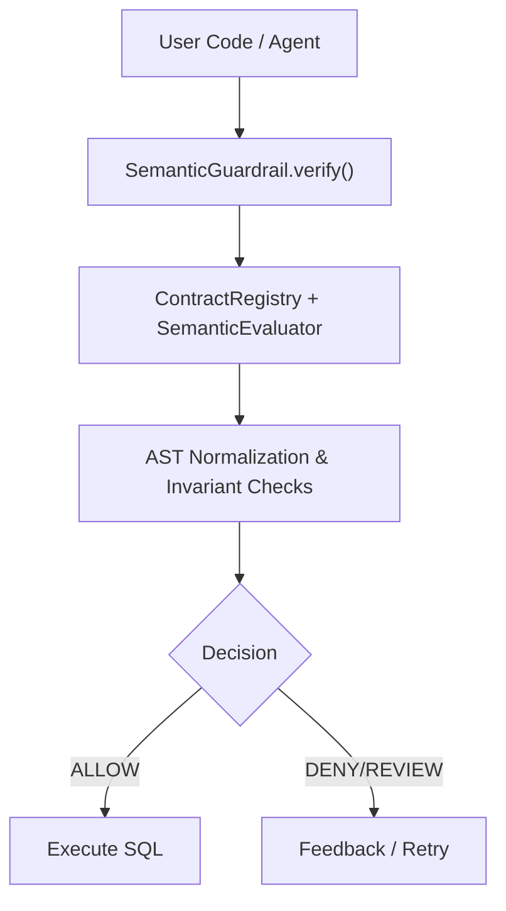
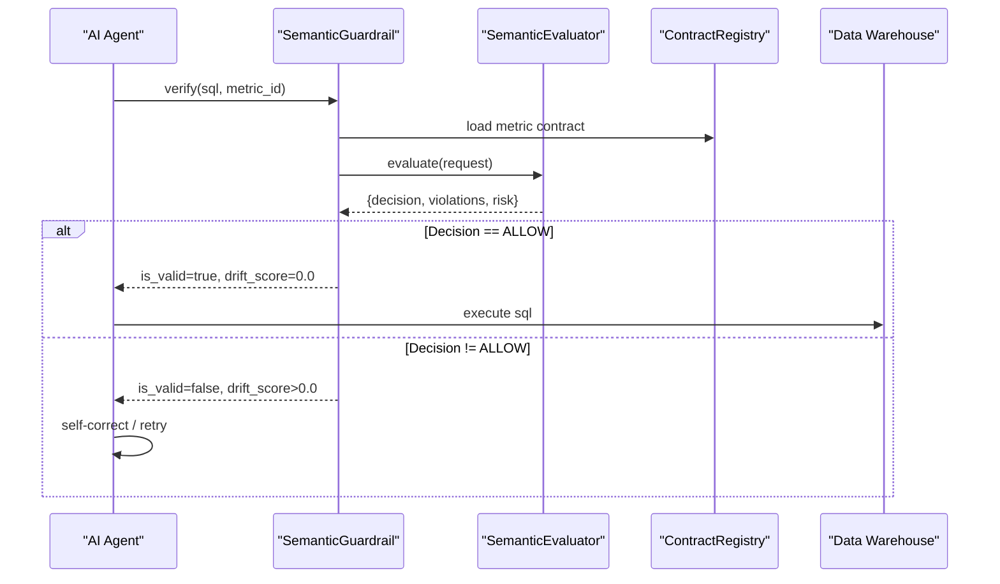
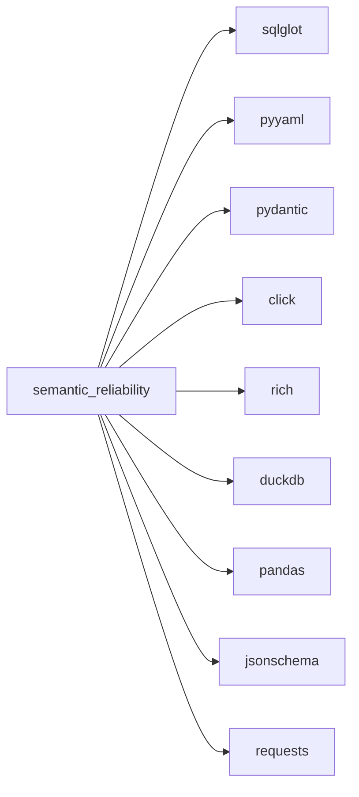

# Getting Started

<cite>
**Referenced Files in This Document**
- [README.md](file://README.md)
- [pyproject.toml](file://pyproject.toml)
- [requirements.txt](file://requirements.txt)
- [semantic_reliability/__init__.py](file://semantic_reliability/__init__.py)
- [semantic_reliability/cli.py](file://semantic_reliability/cli.py)
- [semantic_reliability/guardrail.py](file://semantic_reliability/guardrail.py)
- [semantic_reliability/mcp/server.py](file://semantic_reliability/mcp/server.py)
- [benchmark_corpus/dev/net_revenue/contract.yaml](file://benchmark_corpus/dev/net_revenue/contract.yaml)
- [examples/models/fct_net_revenue_baseline.sql](file://examples/models/fct_net_revenue_baseline.sql)
</cite>

## Table of Contents
1. [Introduction](#introduction)
2. [Project Structure](#project-structure)
3. [Core Components](#core-components)
4. [Architecture Overview](#architecture-overview)
5. [Detailed Component Analysis](#detailed-component-analysis)
6. [Dependency Analysis](#dependency-analysis)
7. [Performance Considerations](#performance-considerations)
8. [Troubleshooting Guide](#troubleshooting-guide)
9. [Conclusion](#conclusion)
10. [Appendices](#appendices)

## Introduction
This guide helps you install and use the Semantic Reliability Engine (SRE) to validate AI-generated SQL against business semantic contracts. It explains what semantic contract validation is, why it matters for text-to-SQL agents, and how to get up and running quickly with Python SDK usage, CLI commands, and the MCP server.

Semantic contract validation ensures that generated SQL adheres to explicit business definitions (grain, filters, aggregations). Without it, AI agents can produce syntactically correct queries that silently violate core business logic—leading to incorrect metrics and decisions. SRE uses deterministic AST-based analysis to detect semantic drift before execution.

**Section sources**
- [README.md:14-46](file://README.md#L14-L46)

## Project Structure
At a high level:
- The package exposes a Python API and a CLI tool named sre.
- Contracts define metric semantics; the compiler turns them into canonical SQL.
- The guardrail evaluates candidate SQL against contracts and returns a decision and drift score.
- The MCP server provides a JSON-RPC interface for read-only contract evaluation and resource access.

**Diagram sources**
- [semantic_reliability/guardrail.py:45-136](file://semantic_reliability/guardrail.py#L45-L136)
- [semantic_reliability/mcp/server.py:16-176](file://semantic_reliability/mcp/server.py#L16-L176)

**Section sources**
- [semantic_reliability/__init__.py:1-21](file://semantic_reliability/__init__.py#L1-L21)
- [semantic_reliability/cli.py:36-40](file://semantic_reliability/cli.py#L36-L40)

## Core Components
- SemanticGuardrail: High-level entry point to verify or intercept SQL against contracts.
- MetricCompiler: Compiles SCOS metric YAML into canonical SQL and supports dialects.
- ContractRegistry + SemanticEvaluator: Load contracts and evaluate SQL deterministically.
- CLI (sre): Compile contracts, run checks, benchmark, and launch the MCP server.
- MCP Server: JSON-RPC 2.0 server exposing tools/resources/prompts for integration.

Key installation notes:
- Requires Python 3.10+.
- Core dependencies include SQL parsing, YAML, Pydantic, Click, Rich, DuckDB, Pandas, JSON Schema, and Requests.
- Optional dev dependencies include pytest.

**Section sources**
- [pyproject.toml:5-34](file://pyproject.toml#L5-L34)
- [requirements.txt:1-11](file://requirements.txt#L1-L11)
- [semantic_reliability/guardrail.py:45-136](file://semantic_reliability/guardrail.py#L45-L136)
- [semantic_reliability/cli.py:571-585](file://semantic_reliability/cli.py#L571-L585)
- [semantic_reliability/mcp/server.py:16-49](file://semantic_reliability/mcp/server.py#L16-L49)

## Architecture Overview
The engine sits between AI agents and data warehouses. Contracts define invariants; the guardrail compares generated SQL to those invariants using AST normalization and returns a decision and drift score.

**Diagram sources**
- [semantic_reliability/guardrail.py:91-136](file://semantic_reliability/guardrail.py#L91-L136)
- [semantic_reliability/mcp/server.py:50-128](file://semantic_reliability/mcp/server.py#L50-L128)

## Detailed Component Analysis

### Installation and Prerequisites
- Python version: 3.10+
- Package manager options:
  - pip: Install from source or via your preferred method.
  - conda: Create an environment with Python 3.10+ and then install the package.
  - From source: Clone the repository and install in editable mode.
- Required system dependencies: None beyond Python and standard build tools.
- Database connections:
  - For local evaluation and fixtures, DuckDB is used automatically.
  - For BigQuery dry-run evaluation, configure project credentials as needed by the adapter.

Installation steps:
- Using pip:
  - Install from source directory: pip install .
  - Or install with optional dev extras: pip install ".[dev]"
- Using conda:
  - Create environment: conda create -n sre python=3.10
  - Activate: conda activate sre
  - Install: pip install .
- From source:
  - git clone <repo-url>
  - cd semantic-reliability-engine
  - pip install -e .

Verify installation:
- Run sre --version to confirm the CLI is available.
- Run a quick compile on a sample contract to ensure everything works.

**Section sources**
- [pyproject.toml:5-34](file://pyproject.toml#L5-L34)
- [requirements.txt:1-11](file://requirements.txt#L1-L11)
- [semantic_reliability/cli.py:36-40](file://semantic_reliability/cli.py#L36-L40)

### Quick Start: 5-Line Guardrail Example
Use the Python SDK to load a contract and verify agent-generated SQL prior to execution.

Steps:
1. Choose a contract file from the included corpus or examples.
2. Initialize the guardrail from the contract path.
3. Call verify with the candidate SQL.
4. Inspect result.is_valid, result.drift_score, and result.violations.
5. If invalid, prompt the agent to self-correct based on the feedback.

Reference example paths:
- Contract: [contract.yaml](file://benchmark_corpus/dev/net_revenue/contract.yaml)
- Baseline model: [fct_net_revenue_baseline.sql](file://examples/models/fct_net_revenue_baseline.sql)

What happens under the hood:
- The guardrail loads the metric definition, builds an evaluation request, runs invariant checks, computes a drift score, and returns a decision.

**Section sources**
- [README.md:49-65](file://README.md#L49-L65)
- [semantic_reliability/guardrail.py:45-136](file://semantic_reliability/guardrail.py#L45-L136)
- [benchmark_corpus/dev/net_revenue/contract.yaml:1-19](file://benchmark_corpus/dev/net_revenue/contract.yaml#L1-L19)
- [examples/models/fct_net_revenue_baseline.sql:1-9](file://examples/models/fct_net_revenue_baseline.sql#L1-L9)

### Basic CLI Usage
Install the CLI entry points (sre) and use these common commands:

- Compile a metric contract to canonical SQL:
  - Command: sre compile --metric <path-to-contract.yaml>
  - Purpose: Validate and render the ground-truth SQL for a metric definition.
  - Reference: [compile command:571-585](file://semantic_reliability/cli.py#L571-L585)

- Check semantic drift between baseline and candidate SQL:
  - Command: sre check --candidate <candidate.sql> [--base <baseline.sql> | --metric <contract.yaml>]
  - Purpose: Compare candidate SQL to baseline or contract and report drift severity.
  - Reference: [check command:43-132](file://semantic_reliability/cli.py#L43-L132)

- Launch the read-only SCOS MCP server:
  - Command: sre mcp-serve --contracts <path-to-contracts-dir>
  - Purpose: Start a JSON-RPC 2.0 server to expose tools/resources/prompts for contract evaluation.
  - Reference: [mcp-serve command:789-800](file://semantic_reliability/cli.py#L789-L800), [server implementation:16-49](file://semantic_reliability/mcp/server.py#L16-L49)

Additional useful commands:
- Benchmark assertions against mutations: sre benchmark
- Evaluate agent-generated SQL against contracts: sre evaluate-agent
- Generate PR comments for drift: sre pr-comment

**Section sources**
- [semantic_reliability/cli.py:43-132](file://semantic_reliability/cli.py#L43-L132)
- [semantic_reliability/cli.py:571-585](file://semantic_reliability/cli.py#L571-L585)
- [semantic_reliability/cli.py:789-800](file://semantic_reliability/cli.py#L789-L800)
- [semantic_reliability/mcp/server.py:16-49](file://semantic_reliability/mcp/server.py#L16-L49)

### Running Checks and Interpreting Results
- Drift detection compares AST-normalized structures and enforces declared invariants.
- Output includes severity levels and business impact summaries.
- Use SARIF export for CI integration when supported by your platform.

Typical flow:
- Provide either a baseline SQL or a metric contract.
- Run the check command.
- Review reported drift types and severities.
- Fail CI if critical/high drift is detected using the appropriate flags.

**Section sources**
- [semantic_reliability/cli.py:43-132](file://semantic_reliability/cli.py#L43-L132)

### Launching the MCP Server
- The MCP server exposes a JSON-RPC 2.0 interface for tools, resources, and prompts.
- It loads contracts from a directory and enforces request size limits and audit logging.
- You can integrate it with clients that support MCP to perform read-only contract evaluations.

Server capabilities:
- initialize, tools/list, tools/call, resources/list, resources/read, prompts/list, prompts/get.
- Audit hash-chaining for tamper-evident logs.

**Section sources**
- [semantic_reliability/mcp/server.py:16-176](file://semantic_reliability/mcp/server.py#L16-L176)
- [semantic_reliability/mcp/server.py:239-257](file://semantic_reliability/mcp/server.py#L239-L257)

## Dependency Analysis
SRE depends on:
- sqlglot for SQL parsing and normalization
- pyyaml for contract definitions
- pydantic for data models
- click and rich for CLI and output formatting
- duckdb for local fixture execution
- pandas for data handling
- jsonschema for schema validation
- requests for HTTP operations

Optional dev dependency:
- pytest for tests

**Diagram sources**
- [pyproject.toml:15-25](file://pyproject.toml#L15-L25)
- [requirements.txt:1-11](file://requirements.txt#L1-L11)

**Section sources**
- [pyproject.toml:15-34](file://pyproject.toml#L15-L34)
- [requirements.txt:1-11](file://requirements.txt#L1-L11)

## Performance Considerations
- Local evaluation uses DuckDB for fast, in-memory execution of fixtures and assertions.
- AST normalization avoids expensive LLM-based judgments and enables deterministic checks.
- Keep contracts focused and minimal to reduce evaluation overhead.
- Batch multiple SQL checks where possible to amortize contract loading costs.

[No sources needed since this section provides general guidance]

## Troubleshooting Guide
Common setup issues and resolutions:
- Python version mismatch:
  - Ensure Python 3.10+ is installed and active.
  - Verify with sre --version after installation.
- Missing dependencies:
  - Reinstall with pip install . or pip install -e . to resolve missing packages.
  - For development, add pytest with pip install ".[dev]".
- Windows console encoding errors:
  - The CLI forces UTF-8 on Windows consoles to avoid character map issues.
- No valid contracts found:
  - When initializing from a directory, ensure it contains valid SCOS contract YAML files.
- BigQuery dry-run evaluation:
  - Ensure project credentials are configured appropriately for the adapter.

Where to look:
- CLI initialization and version: [cli main:36-40](file://semantic_reliability/cli.py#L36-L40)
- Guardrail contract loading and error handling: [guardrail init:53-79](file://semantic_reliability/guardrail.py#L53-L79)
- MCP server request limits and error mapping: [server handle_request:50-176](file://semantic_reliability/mcp/server.py#L50-L176)

**Section sources**
- [semantic_reliability/cli.py:11-17](file://semantic_reliability/cli.py#L11-L17)
- [semantic_reliability/guardrail.py:53-79](file://semantic_reliability/guardrail.py#L53-L79)
- [semantic_reliability/mcp/server.py:50-176](file://semantic_reliability/mcp/server.py#L50-L176)

## Conclusion
You now have the essentials to install SRE, write and compile semantic contracts, validate AI-generated SQL, and run the MCP server for integrations. Start with the 5-line guardrail example, expand to CLI workflows, and progressively adopt contracts and assertions across your analytics pipelines to prevent silent semantic failures.

[No sources needed since this section summarizes without analyzing specific files]

## Appendices

### Appendix A: Example Artifacts
- Sample contract: [contract.yaml](file://benchmark_corpus/dev/net_revenue/contract.yaml)
- Baseline model: [fct_net_revenue_baseline.sql](file://examples/models/fct_net_revenue_baseline.sql)

These artifacts demonstrate a realistic metric definition and corresponding SQL to help you get started quickly.

**Section sources**
- [benchmark_corpus/dev/net_revenue/contract.yaml:1-19](file://benchmark_corpus/dev/net_revenue/contract.yaml#L1-L19)
- [examples/models/fct_net_revenue_baseline.sql:1-9](file://examples/models/fct_net_revenue_baseline.sql#L1-L9)