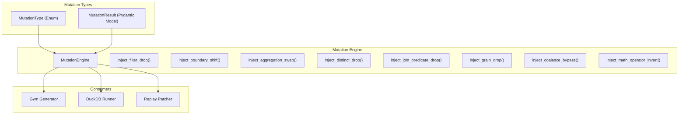
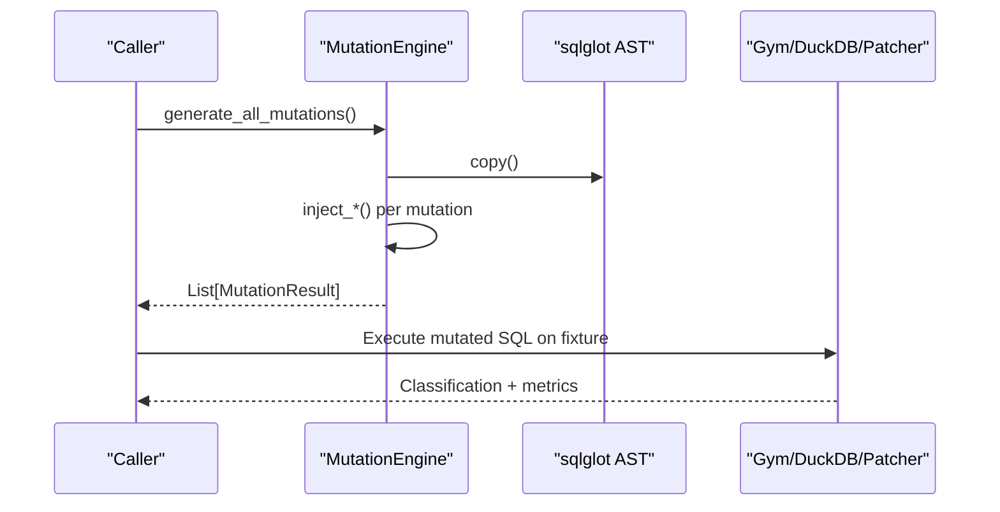
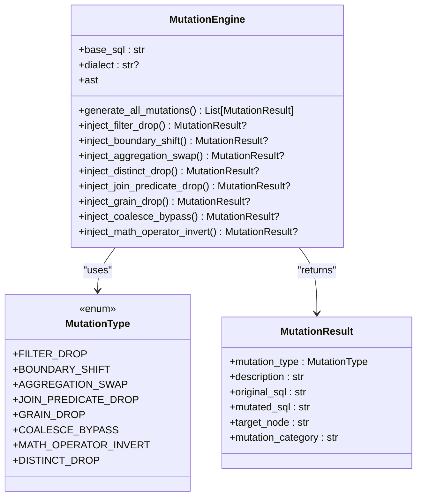
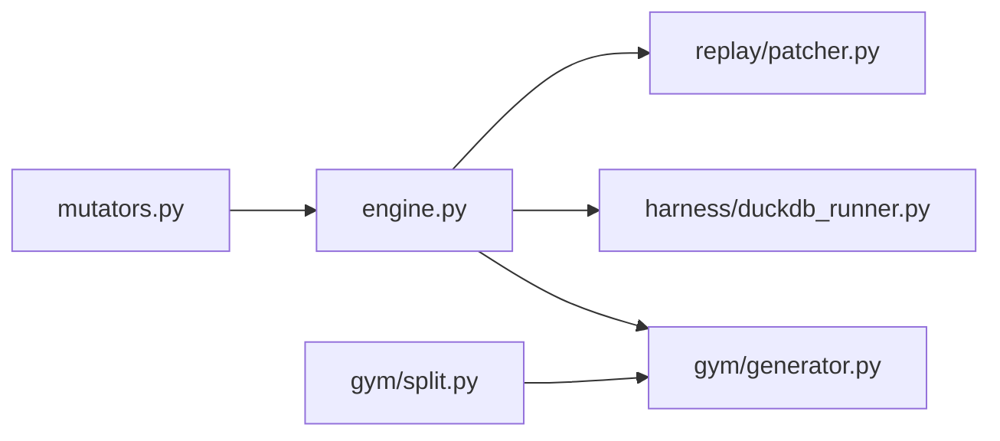

# Custom Mutator Development

<cite>
**Referenced Files in This Document**
- [mutators.py](file://semantic_reliability/testing/mutations/mutators.py)
- [engine.py](file://semantic_reliability/testing/mutations/engine.py)
- [generator.py](file://semantic_reliability/gym/generator.py)
- [split.py](file://semantic_reliability/gym/split.py)
- [duckdb_runner.py](file://semantic_reliability/harness/duckdb_runner.py)
- [patcher.py](file://semantic_reliability/replay/patcher.py)
- [test_mutations.py](file://tests/test_mutations.py)
</cite>

## Table of Contents
1. [Introduction](#introduction)
2. [Project Structure](#project-structure)
3. [Core Components](#core-components)
4. [Architecture Overview](#architecture-overview)
5. [Detailed Component Analysis](#detailed-component-analysis)
6. [Dependency Analysis](#dependency-analysis)
7. [Performance Considerations](#performance-considerations)
8. [Troubleshooting Guide](#troubleshooting-guide)
9. [Conclusion](#conclusion)
10. [Appendices](#appendices)

## Introduction
This document provides comprehensive guidance for developing custom mutation operators beyond the built-in set. It explains how to extend the MutationType enum, define new mutation categories, and implement custom mutator methods within the MutationEngine class. It also covers domain-specific mutation examples, best practices for deterministic and performant mutations, testing strategies, integration with the existing framework, and versioning considerations.

## Project Structure
The mutation system is centered around two core files:
- A types module that defines the shared mutation contract (MutationType and MutationResult).
- An engine module that implements concrete mutation injectors and orchestrates their execution.

**Diagram sources**
- [mutators.py:8-26](file://semantic_reliability/testing/mutations/mutators.py#L8-L26)
- [engine.py:8-52](file://semantic_reliability/testing/mutations/engine.py#L8-L52)
- [generator.py:92-198](file://semantic_reliability/gym/generator.py#L92-L198)
- [duckdb_runner.py:125-206](file://semantic_reliability/harness/duckdb_runner.py#L125-L206)
- [patcher.py:31-47](file://semantic_reliability/replay/patcher.py#L31-L47)

**Section sources**
- [mutators.py:8-26](file://semantic_reliability/testing/mutations/mutators.py#L8-L26)
- [engine.py:8-52](file://semantic_reliability/testing/mutations/engine.py#L8-L52)

## Core Components
- MutationType: Enum defining all supported mutation categories used across the system.
- MutationResult: Pydantic model representing a single applied mutation with required fields for type, description, original SQL, mutated SQL, target node, and category.
- MutationEngine: Orchestrates AST-level mutations by invoking specific injector methods and returning a list of MutationResult objects.

Key responsibilities:
- Define the mutation taxonomy via MutationType.
- Provide a uniform result structure via MutationResult.
- Implement deterministic, parseable mutations through AST manipulation using sqlglot.

**Section sources**
- [mutators.py:8-26](file://semantic_reliability/testing/mutations/mutators.py#L8-L26)
- [engine.py:8-52](file://semantic_reliability/testing/mutations/engine.py#L8-L52)

## Architecture Overview
The MutationEngine parses base SQL into an AST and applies targeted transformations. Each injector method returns a MutationResult when applicable; generate_all_mutations aggregates them. Consumers like the Gym generator and DuckDB runner execute mutated SQL against fixtures, compare outputs, and classify outcomes. The Replay patcher uses mutation metadata to suggest fixes.

**Diagram sources**
- [engine.py:16-52](file://semantic_reliability/testing/mutations/engine.py#L16-L52)
- [generator.py:92-198](file://semantic_reliability/gym/generator.py#L92-L198)
- [duckdb_runner.py:125-206](file://semantic_reliability/harness/duckdb_runner.py#L125-L206)
- [patcher.py:31-47](file://semantic_reliability/replay/patcher.py#L31-L47)

## Detailed Component Analysis

### MutationType and MutationResult
- MutationType enumerates mutation families such as FILTER_DROP, BOUNDARY_SHIFT, AGGREGATION_SWAP, JOIN_PREDICATE_DROP, GRAIN_DROP, COALESCE_BYPASS, MATH_OPERATOR_INVERT, DISTINCT_DROP.
- MutationResult requires:
  - mutation_type: One of the defined MutationType values.
  - description: Human-readable explanation of the change.
  - original_sql: The baseline SQL string before mutation.
  - mutated_sql: The resulting SQL after mutation.
  - target_node: The AST or SQL element affected.
  - mutation_category: A grouping label used for categorization and splits.

Best practices:
- Keep descriptions concise and actionable.
- Use consistent mutation_category naming to align with training/validation/holdout splits.
- Ensure mutated_sql parses cleanly (validated downstream).

**Section sources**
- [mutators.py:8-26](file://semantic_reliability/testing/mutations/mutators.py#L8-L26)

### MutationEngine: Adding a New Custom Mutator
To add a new mutation operator:
1. Extend MutationType:
   - Add a new enum member in the MutationType enum.
2. Implement an injector method in MutationEngine:
   - Create a method named inject_<your_mutation>() returning Optional[MutationResult].
   - Work on a copy of the AST to avoid mutating the original.
   - Detect relevant nodes using sqlglot expressions.
   - Apply a minimal, deterministic transformation.
   - Return a MutationResult with all required fields.
3. Register the injector:
   - Call your new injector from generate_all_mutations() and append its result if not None.
4. Update splits and consumers if needed:
   - Optionally assign the new mutation to train/val/holdout via split rules.
   - Ensure downstream consumers handle the new mutation type gracefully.

Example pattern reference:
- See existing injectors for filter drop, boundary shift, aggregation swap, distinct drop, join predicate drop, grain drop, coalesce bypass, and math operator invert.

**Section sources**
- [engine.py:16-52](file://semantic_reliability/testing/mutations/engine.py#L16-L52)
- [engine.py:54-269](file://semantic_reliability/testing/mutations/engine.py#L54-L269)

#### Class Diagram: MutationEngine and Injectors

**Diagram sources**
- [engine.py:8-52](file://semantic_reliability/testing/mutations/engine.py#L8-L52)
- [engine.py:54-269](file://semantic_reliability/testing/mutations/engine.py#L54-L269)
- [mutators.py:8-26](file://semantic_reliability/testing/mutations/mutators.py#L8-L26)

### Domain-Specific Mutation Examples
Below are conceptual examples of domain-specific mutations you can implement following the same pattern:

- Financial compliance guard:
  - Mutation: Remove or weaken a regulatory threshold check (e.g., replace >= with >).
  - Category: "Regulatory Thresholds"
  - Target: Comparison nodes in WHERE clauses tied to compliance thresholds.

- Inventory reconciliation:
  - Mutation: Drop a warehouse or region filter that restricts inventory scope.
  - Category: "Scope Filtering"
  - Target: AND conjuncts in WHERE related to location filters.

- Healthcare reporting:
  - Mutation: Swap COUNT(DISTINCT patient_id) to COUNT(patient_id), inflating counts.
  - Category: "Count Semantics"
  - Target: COUNT nodes with distinct modifier.

- Risk exposure:
  - Mutation: Replace SUM(exposure) with AVG(exposure), altering risk magnitude.
  - Category: "Aggregation Semantics"
  - Target: Aggregation functions in SELECT.

Implementation steps mirror existing injectors: detect relevant AST nodes, apply minimal deterministic changes, and return a fully populated MutationResult.

[No sources needed since this section describes conceptual patterns without analyzing specific files]

### Best Practices for Mutation Design
- Determinism:
  - Always operate on a copy of the AST to ensure repeatable results.
  - Avoid randomization; use fixed, rule-based transformations.
- Minimal impact:
  - Change only what is necessary to simulate realistic bugs.
  - Prefer replacing one node or modifier rather than rewriting large sections.
- Parseability:
  - Ensure mutated_sql parses cleanly; validate downstream if needed.
- Performance:
  - Limit AST traversal to necessary nodes.
  - Short-circuit early when conditions are not met.
- Safety:
  - Guard against empty or malformed inputs.
  - Avoid creating Cartesian products unintentionally unless it is the intended mutation.
- Categorization:
  - Use clear mutation_category labels to support dataset splits and analysis.

[No sources needed since this section provides general guidance]

### Testing Strategies for Custom Mutators
- Unit tests:
  - Instantiate MutationEngine with representative SQL.
  - Assert that the custom injector returns a non-None MutationResult.
  - Verify mutation_type matches the expected value.
  - Confirm mutated_sql parses cleanly using sqlglot.
  - Validate semantic markers (e.g., presence/absence of specific tokens).
- Integration tests:
  - Run mutated SQL against fixtures and assert divergence or equivalence as expected.
  - Check classification outcomes in the runner (runtime error, equivalent, valid defect detected/survived).
- Split coverage:
  - Ensure new mutation types are assigned to appropriate train/val/holdout sets based on risk and complexity.

Reference patterns:
- See test cases for existing injectors to model assertions and parsing checks.

**Section sources**
- [test_mutations.py:17-63](file://tests/test_mutations.py#L17-L63)
- [duckdb_runner.py:125-206](file://semantic_reliability/harness/duckdb_runner.py#L125-L206)

### Integration With Existing Framework
- Gym generator:
  - Uses MutationEngine to produce mutations and filters them by split rules.
  - Validates contracts and executes mutated SQL against fixtures.
  - Records evidence and difficulty assignments.
- DuckDB runner:
  - Executes baseline and mutated queries, computes variance, runs assertions, and classifies outcomes.
- Replay patcher:
  - Interprets mutation descriptions to suggest code changes.

When adding a new mutation:
- Add to MutationType.
- Implement injector and register in generate_all_mutations.
- Optionally update split rules if the mutation belongs to a specific dataset split.
- Ensure downstream consumers handle the new type without errors.

**Section sources**
- [generator.py:92-198](file://semantic_reliability/gym/generator.py#L92-L198)
- [split.py:1-20](file://semantic_reliability/gym/split.py#L1-L20)
- [duckdb_runner.py:125-206](file://semantic_reliability/harness/duckdb_runner.py#L125-L206)
- [patcher.py:31-47](file://semantic_reliability/replay/patcher.py#L31-L47)

## Dependency Analysis
The mutation system has clear boundaries:
- Types (mutators.py) are consumed by the engine and downstream consumers.
- Engine (engine.py) depends on sqlglot and the types module.
- Consumers depend on the engine’s output format and may rely on split rules and assertion suites.

**Diagram sources**
- [mutators.py:8-26](file://semantic_reliability/testing/mutations/mutators.py#L8-L26)
- [engine.py:1-52](file://semantic_reliability/testing/mutations/engine.py#L1-L52)
- [generator.py:92-198](file://semantic_reliability/gym/generator.py#L92-L198)
- [split.py:1-20](file://semantic_reliability/gym/split.py#L1-L20)
- [duckdb_runner.py:125-206](file://semantic_reliability/harness/duckdb_runner.py#L125-L206)
- [patcher.py:31-47](file://semantic_reliability/replay/patcher.py#L31-L47)

**Section sources**
- [mutators.py:8-26](file://semantic_reliability/testing/mutations/mutators.py#L8-L26)
- [engine.py:1-52](file://semantic_reliability/testing/mutations/engine.py#L1-L52)
- [generator.py:92-198](file://semantic_reliability/gym/generator.py#L92-L198)
- [split.py:1-20](file://semantic_reliability/gym/split.py#L1-L20)
- [duckdb_runner.py:125-206](file://semantic_reliability/harness/duckdb_runner.py#L125-L206)
- [patcher.py:31-47](file://semantic_reliability/replay/patcher.py#L31-L47)

## Performance Considerations
- AST operations:
  - Use targeted find/find_all calls to minimize traversal cost.
  - Early exit when no applicable nodes are found.
- Query execution:
  - Reuse connections where possible in runners.
  - Limit fixture size during development and testing.
- Concurrency:
  - If parallelizing mutation generation, ensure thread safety by copying ASTs per mutation.
- Memory:
  - Avoid holding large intermediate structures; process and discard promptly.

[No sources needed since this section provides general guidance]

## Troubleshooting Guide
Common issues and resolutions:
- Mutated SQL does not parse:
  - Validate mutated_sql with sqlglot.parse_one in tests.
  - Ensure transformations preserve syntactic correctness.
- No mutation produced:
  - Check if the AST contains the expected nodes; adjust detection logic.
- Equivalent output on fixture:
  - Review mutation semantics; ensure it meaningfully alters behavior.
- Runtime errors:
  - Inspect execution paths; guard against invalid operations.
- Assertion failures:
  - Align mutation_category and descriptions with assertion expectations.

References:
- Execution and classification flow in the runner.
- Parsing validation in tests.

**Section sources**
- [duckdb_runner.py:125-206](file://semantic_reliability/harness/duckdb_runner.py#L125-L206)
- [test_mutations.py:17-63](file://tests/test_mutations.py#L17-L63)

## Conclusion
Extending the mutation library involves three primary steps: define a new MutationType, implement a deterministic injector in MutationEngine, and integrate it into the generation pipeline. Follow best practices for determinism, performance, and safety. Test thoroughly at unit and integration levels, and consider dataset splits and downstream consumers. Clear categorization and descriptive metadata enable robust analysis and automated remediation.

[No sources needed since this section summarizes without analyzing specific files]

## Appendices

### Step-by-Step Implementation Checklist
- Add a new enum member to MutationType.
- Implement inject_<name>() in MutationEngine:
  - Copy AST, detect nodes, apply minimal change, return MutationResult.
- Register in generate_all_mutations().
- Update split rules if needed.
- Write unit tests asserting type, parsing, and semantic markers.
- Add integration tests executing mutated SQL and checking classification.
- Validate downstream handling in gym, runner, and patcher.

[No sources needed since this section provides procedural guidance]

### Versioning and Compatibility Considerations
- Backward compatibility:
  - Do not remove or rename existing MutationType members without a deprecation plan.
  - Maintain stable MutationResult schema; add optional fields if needed.
- Deprecation strategy:
  - Mark deprecated mutation types in documentation and logs.
  - Provide migration guides for consumers.
- Split evolution:
  - Adjust TRAIN/VAL/HOLDOUT sets gradually; document rationale.
- Consumer updates:
  - Ensure gym, runner, and patcher handle unknown types gracefully (e.g., fallback behaviors).

[No sources needed since this section provides general guidance]