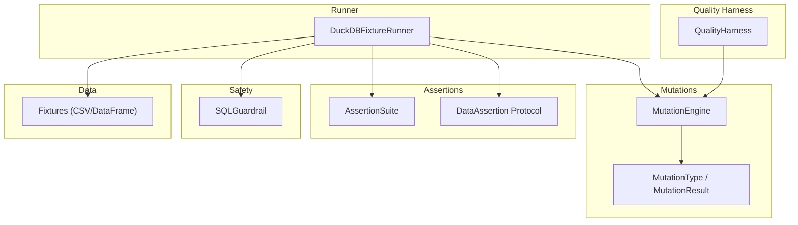
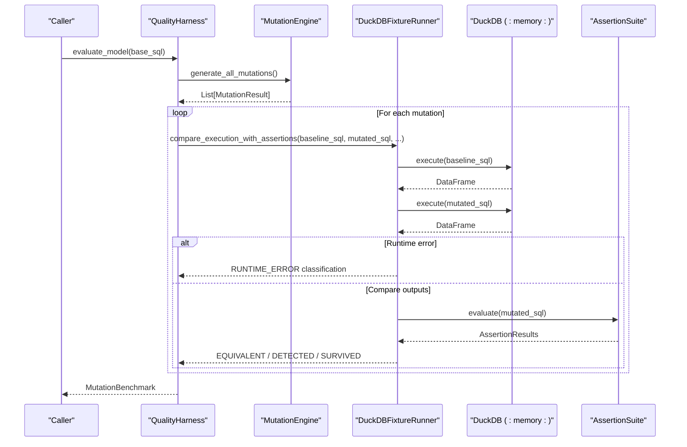
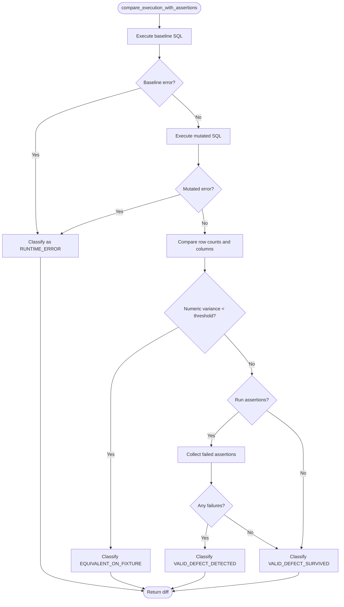
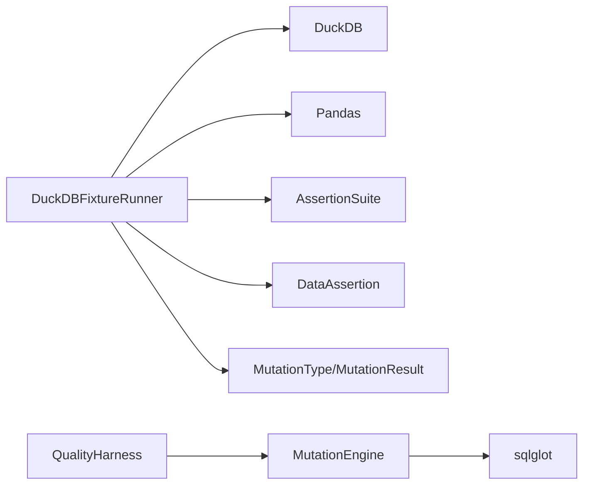
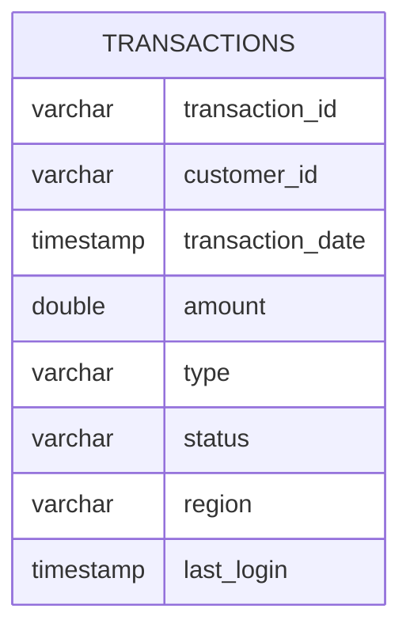

# Execution Runner

<cite>
**Referenced Files in This Document**
- [duckdb_runner.py](file://semantic_reliability/harness/duckdb_runner.py)
- [quality_harness.py](file://semantic_reliability/harness/quality_harness.py)
- [engine.py](file://semantic_reliability/testing/mutations/engine.py)
- [mutators.py](file://semantic_reliability/testing/mutations/mutators.py)
- [base.py](file://semantic_reliability/assertions/base.py)
- [registry.py](file://semantic_reliability/assertions/registry.py)
- [sql_guardrail.py](file://semantic_reliability/runtime/sql_guardrail.py)
- [test_duckdb_runner.py](file://tests/test_duckdb_runner.py)
- [transactions.csv](file://examples/fixtures/transactions.csv)
</cite>

## Table of Contents
1. Introduction
2. Project Structure
3. Core Components
4. Architecture Overview
5. Detailed Component Analysis
6. Dependency Analysis
7. Performance Considerations
8. Troubleshooting Guide
9. Conclusion
10. Appendices

## Introduction
This document explains the DuckDB execution runner used to safely execute mutated SQL queries in an isolated environment for testing semantic reliability. It covers how the runner creates a temporary, in-memory database with fixtures, executes baseline and mutated queries, compares results empirically, evaluates assertion suites, and integrates with the quality harness for automated mutation testing. It also documents error handling, result classification, and integration points that help prevent unsafe or runaway behavior during test-time execution.

## Project Structure
The execution runner is centered around an in-memory DuckDB instance that loads fixture data and runs both baseline and mutated SQL. The runner collaborates with:
- A mutation engine that generates AST-level mutations against a base query
- An assertion registry that provides structural and semantic checks
- A quality harness that orchestrates mutation generation and evaluation (with optional custom runners)
- A runtime guardrail that enforces safe execution constraints on SELECT statements

**Diagram sources**
- [duckdb_runner.py:56-256](file://semantic_reliability/harness/duckdb_runner.py#L56-L256)
- [engine.py:8-52](file://semantic_reliability/testing/mutations/engine.py#L8-L52)
- [mutators.py:8-27](file://semantic_reliability/testing/mutations/mutators.py#L8-L27)
- [registry.py:22-160](file://semantic_reliability/assertions/registry.py#L22-L160)
- [base.py:6-25](file://semantic_reliability/assertions/base.py#L6-L25)
- [quality_harness.py:34-113](file://semantic_reliability/harness/quality_harness.py#L34-L113)
- [sql_guardrail.py:71-101](file://semantic_reliability/runtime/sql_guardrail.py#L71-L101)

**Section sources**
- [duckdb_runner.py:56-256](file://semantic_reliability/harness/duckdb_runner.py#L56-L256)
- [engine.py:8-52](file://semantic_reliability/testing/mutations/engine.py#L8-L52)
- [mutators.py:8-27](file://semantic_reliability/testing/mutations/mutators.py#L8-L27)
- [registry.py:22-160](file://semantic_reliability/assertions/registry.py#L22-L160)
- [base.py:6-25](file://semantic_reliability/assertions/base.py#L6-L25)
- [quality_harness.py:34-113](file://semantic_reliability/harness/quality_harness.py#L34-L113)
- [sql_guardrail.py:71-101](file://semantic_reliability/runtime/sql_guardrail.py#L71-L101)

## Core Components
- DuckDBFixtureRunner: Creates an in-memory DuckDB connection, loads fixtures, executes queries, compares baseline vs mutated outputs, evaluates assertions, and classifies outcomes.
- Assertion Suite and Protocol: Provides pluggable assertions (structural and semantic) evaluated against the mutated query within the same connection.
- Mutation Engine and Types: Generates AST-based mutations (e.g., filter drop, boundary shift, aggregation swap) and returns structured mutation results.
- Quality Harness: Orchestrates mutation generation and evaluation; supports a custom test runner or simulated checks for demonstration.
- SQLGuardrail: Enforces safe execution by allowing only SELECT statements and capping LIMIT to protect against resource exhaustion.

Key responsibilities:
- Isolation: In-memory DuckDB ensures no impact on production data.
- Comparison: Empirical equivalence detection using row counts, column alignment, numeric variance, and exact equality when applicable.
- Assertions: Optional suite evaluation to detect semantic defects beyond empirical differences.
- Classification: Categorizes outcomes as equivalent, detected defect, survived defect, or runtime error.

**Section sources**
- [duckdb_runner.py:56-256](file://semantic_reliability/harness/duckdb_runner.py#L56-L256)
- [registry.py:22-160](file://semantic_reliability/assertions/registry.py#L22-L160)
- [base.py:6-25](file://semantic_reliability/assertions/base.py#L6-L25)
- [engine.py:8-52](file://semantic_reliability/testing/mutations/engine.py#L8-L52)
- [mutators.py:8-27](file://semantic_reliability/testing/mutations/mutators.py#L8-L27)
- [quality_harness.py:34-113](file://semantic_reliability/harness/quality_harness.py#L34-L113)
- [sql_guardrail.py:71-101](file://semantic_reliability/runtime/sql_guardrail.py#L71-L101)

## Architecture Overview
The runner executes baseline and mutated SQL in isolation, then compares outputs and optionally runs assertions. The quality harness drives mutation generation and aggregates results into a benchmark report.

**Diagram sources**
- [quality_harness.py:66-113](file://semantic_reliability/harness/quality_harness.py#L66-L113)
- [engine.py:16-52](file://semantic_reliability/testing/mutations/engine.py#L16-L52)
- [duckdb_runner.py:116-256](file://semantic_reliability/harness/duckdb_runner.py#L116-L256)
- [registry.py:22-160](file://semantic_reliability/assertions/registry.py#L22-L160)

## Detailed Component Analysis

### DuckDBFixtureRunner
Responsibilities:
- Connection management: Opens an in-memory DuckDB connection and closes it safely.
- Fixture loading: Accepts DataFrames or CSV paths; falls back to a default fixture if none provided.
- Query execution: Executes SQL and returns a DataFrame or error string.
- Assertion evaluation: Runs an AssertionSuite against the mutated query using the same connection.
- Comparison and classification: Compares baseline vs mutated outputs, computes empirical variance, and classifies outcomes.

Connection and transaction handling:
- Uses an in-memory DuckDB connection per runner instance, ensuring isolation from any external database.
- No explicit transactions are opened; each execute call runs independently. This keeps tests simple and avoids cross-query state leakage.

Error recovery:
- Catches exceptions during query execution and returns an empty DataFrame plus the error message.
- Classifies runtime errors distinctly so downstream reporting can separate syntax/runtime failures from semantic issues.

Comparison logic:
- If row counts differ, calculates percentage delta based on row count difference.
- If row counts match and columns align, computes numeric sum variance across numeric columns; very small variance indicates equivalence.
- Otherwise, performs exact DataFrame equality for non-numeric cases.

Classification:
- EQUIVALENT_ON_FIXTURE: Outputs are effectively identical under fixture data.
- VALID_DEFECT_DETECTED: Assertions failed on the mutated query.
- VALID_DEFECT_SURVIVED: Output differs but no assertions caught it.
- RUNTIME_ERROR: Mutated query raised an exception.

Integration:
- Works with AssertionSuite to add structural and semantic checks.
- Used by tests to validate identity, filter drops, and overall benchmark flow.

**Diagram sources**
- [duckdb_runner.py:116-206](file://semantic_reliability/harness/duckdb_runner.py#L116-L206)

**Section sources**
- [duckdb_runner.py:56-256](file://semantic_reliability/harness/duckdb_runner.py#L56-L256)
- [test_duckdb_runner.py:17-72](file://tests/test_duckdb_runner.py#L17-L72)

### MutationEngine and Mutation Types
Responsibilities:
- Parses base SQL into an AST and applies targeted mutations such as filter drops, boundary shifts, aggregation swaps, join predicate drops, grain drops, coalesce bypasses, math operator inversions, and distinct drops.
- Returns structured MutationResult objects describing the mutation type, description, original and mutated SQL, target node, and category.

Design notes:
- Each injection method attempts a specific transformation and returns None if not applicable, enabling selective mutation application.
- The engine composes all applicable mutations into a list for benchmarking.

**Section sources**
- [engine.py:8-269](file://semantic_reliability/testing/mutations/engine.py#L8-L269)
- [mutators.py:8-27](file://semantic_reliability/testing/mutations/mutators.py#L8-L27)

### Assertion Suite and Protocol
Responsibilities:
- Defines a protocol for assertions that can be executed against a DuckDB connection and a candidate SQL string.
- Provides a suite container that holds multiple assertions and offers standard suites (structural, realistic dbt, semantic).
- Loads assertions from YAML configuration files for flexible, declarative test definitions.

Usage:
- The runner evaluates assertions against the mutated query to catch semantic defects even when empirical output appears similar.

**Section sources**
- [base.py:6-25](file://semantic_reliability/assertions/base.py#L6-L25)
- [registry.py:22-160](file://semantic_reliability/assertions/registry.py#L22-L160)

### Quality Harness Integration
Responsibilities:
- Orchestrates mutation generation via MutationEngine.
- Evaluates each mutation using either a custom test runner or simulated checks.
- Aggregates evaluations into a MutationBenchmark with total, caught, uncaught, and score metrics.

Custom runner support:
- Allows injecting a function that takes mutated SQL and mutation type and returns check results, enabling integration with external test frameworks.

**Section sources**
- [quality_harness.py:34-113](file://semantic_reliability/harness/quality_harness.py#L34-L113)

### Safety and Resource Constraints
While the runner itself uses an in-memory database, the project includes a runtime guardrail that enforces safe execution patterns:
- Only SELECT statements are permitted; DDL and destructive operations are blocked.
- LIMIT is enforced or capped to a configured maximum to avoid excessive memory usage.

Recommendation:
- When integrating with broader systems, wrap query execution through the guardrail to ensure consistent safety policies.

**Section sources**
- [sql_guardrail.py:71-101](file://semantic_reliability/runtime/sql_guardrail.py#L71-L101)

## Dependency Analysis
The runner depends on:
- DuckDB for in-memory execution
- Pandas for DataFrame handling
- sqlglot via the mutation engine for AST parsing and transformation
- Assertion framework for structural and semantic checks
- Quality harness for orchestration

**Diagram sources**
- [duckdb_runner.py:56-256](file://semantic_reliability/harness/duckdb_runner.py#L56-L256)
- [engine.py:8-52](file://semantic_reliability/testing/mutations/engine.py#L8-L52)
- [mutators.py:8-27](file://semantic_reliability/testing/mutations/mutators.py#L8-L27)
- [registry.py:22-160](file://semantic_reliability/assertions/registry.py#L22-L160)
- [base.py:6-25](file://semantic_reliability/assertions/base.py#L6-L25)
- [quality_harness.py:34-113](file://semantic_reliability/harness/quality_harness.py#L34-L113)

**Section sources**
- [duckdb_runner.py:56-256](file://semantic_reliability/harness/duckdb_runner.py#L56-L256)
- [engine.py:8-52](file://semantic_reliability/testing/mutations/engine.py#L8-L52)
- [mutators.py:8-27](file://semantic_reliability/testing/mutations/mutators.py#L8-L27)
- [registry.py:22-160](file://semantic_reliability/assertions/registry.py#L22-L160)
- [base.py:6-25](file://semantic_reliability/assertions/base.py#L6-L25)
- [quality_harness.py:34-113](file://semantic_reliability/harness/quality_harness.py#L34-L113)

## Performance Considerations
- Fixture size: Larger fixtures increase memory usage and comparison time. Keep fixtures representative but minimal for fast iteration.
- Numeric variance computation: Summing numeric columns can be expensive on large datasets; consider sampling or pre-aggregation if needed.
- Assertion count: More assertions increase evaluation time; use tiered suites (structural first, semantic second) to optimize.
- Concurrency: The current runner does not parallelize query execution. Parallelization should be implemented at the harness level with careful isolation of connections and fixtures.
- Guardrails: Use SQLGuardrail to enforce LIMIT and restrict to SELECT statements to prevent runaway queries in integrated environments.

[No sources needed since this section provides general guidance]

## Troubleshooting Guide
Common issues and resolutions:
- Runtime errors on mutated SQL:
  - Symptom: Classification shows RUNTIME_ERROR with an error message.
  - Action: Inspect the mutated SQL and fix syntax or unsupported constructs; verify dialect compatibility.
- Equivalent on fixture but semantic drift:
  - Symptom: EQUIVALENT_ON_FIXTURE despite business logic changes.
  - Action: Add semantic assertions (population filters, metric value bounds, grain checks) to capture domain-specific expectations.
- Surviving defects:
  - Symptom: VALID_DEFECT_SURVIVED indicates output changed without assertion coverage.
  - Action: Expand assertion suite to include required population, expected grain, and metric tolerances.
- Fixture sensitivity:
  - Symptom: Some mutations appear equivalent due to uniform fixture data.
  - Action: Introduce contrast in fixtures (e.g., varied statuses, regions, nulls) to expose edge cases.
- Performance bottlenecks:
  - Symptom: Slow comparisons or assertion evaluation.
  - Action: Reduce fixture size, limit numeric columns considered, or sample rows for variance checks.

**Section sources**
- [duckdb_runner.py:116-206](file://semantic_reliability/harness/duckdb_runner.py#L116-L206)
- [registry.py:22-160](file://semantic_reliability/assertions/registry.py#L22-L160)
- [error_analysis.py:22-92](file://semantic_reliability/harness/error_analysis.py#L22-L92)

## Conclusion
The DuckDB execution runner provides a robust, isolated environment for testing SQL mutations against fixture data. It combines empirical output comparison with assertion-based validation to classify outcomes accurately. Integrated with the quality harness and supported by safety guardrails, it enables automated, repeatable mutation testing that helps identify semantic defects before they reach production.

[No sources needed since this section summarizes without analyzing specific files]

## Appendices

### Configuration Options and Best Practices
- Fixtures:
  - Provide DataFrames or CSV paths to the runner constructor; otherwise, a default fixture table is loaded automatically.
  - Ensure fixtures contain diverse values to maximize mutation detection.
- Assertions:
  - Use structural suites for quick checks (nulls, uniqueness, row bounds).
  - Add semantic suites for population filters, grain enforcement, and metric value tolerances.
- Safety:
  - Wrap queries through SQLGuardrail to enforce SELECT-only and LIMIT caps.
- Benchmarking:
  - Use the quality harness to generate mutations and compute mutation scores; inject a custom runner for integration with external test frameworks.

**Section sources**
- [duckdb_runner.py:56-108](file://semantic_reliability/harness/duckdb_runner.py#L56-L108)
- [registry.py:106-160](file://semantic_reliability/assertions/registry.py#L106-L160)
- [sql_guardrail.py:71-101](file://semantic_reliability/runtime/sql_guardrail.py#L71-L101)
- [quality_harness.py:66-113](file://semantic_reliability/harness/quality_harness.py#L66-L113)

### Example Fixture Schema
The default fixture table schema includes fields commonly used in revenue and activity metrics.

**Diagram sources**
- [duckdb_runner.py:83-100](file://semantic_reliability/harness/duckdb_runner.py#L83-L100)
- [transactions.csv:1-12](file://examples/fixtures/transactions.csv#L1-L12)