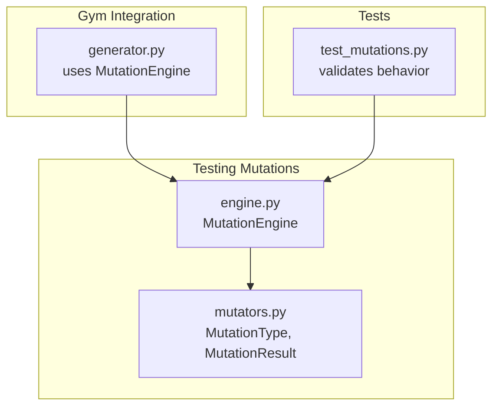
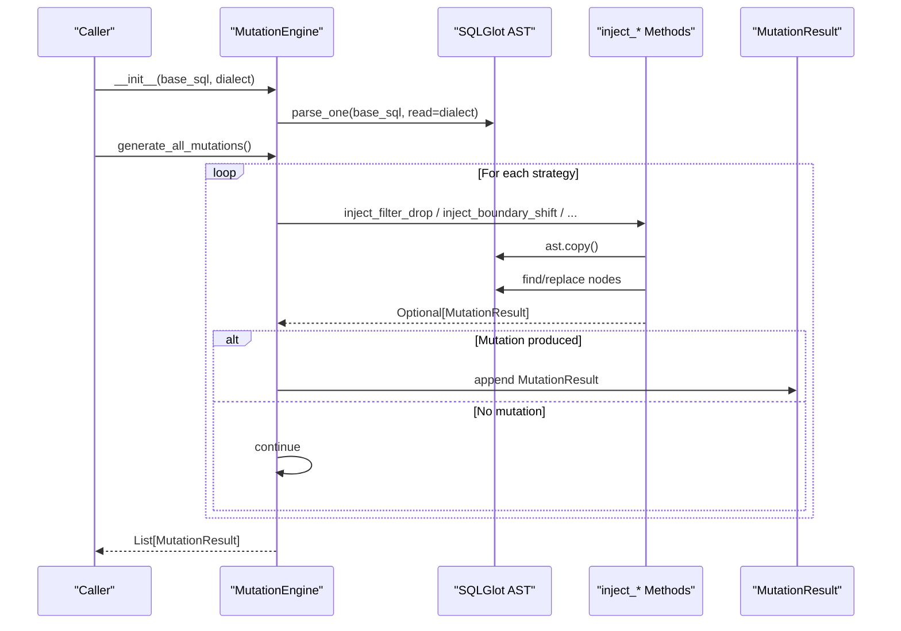
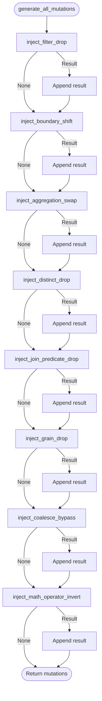
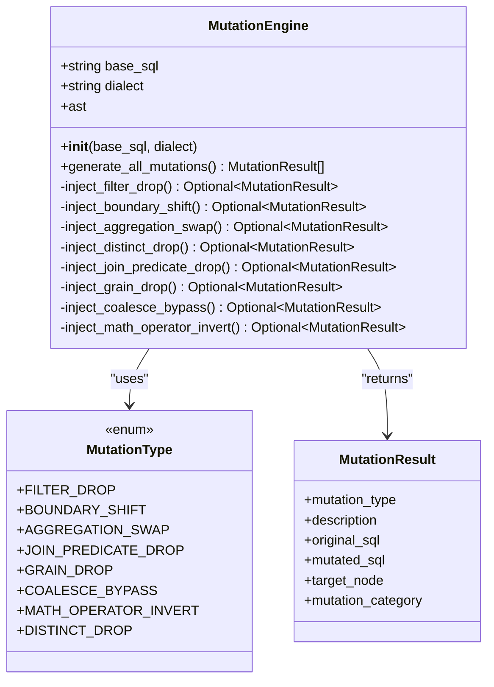
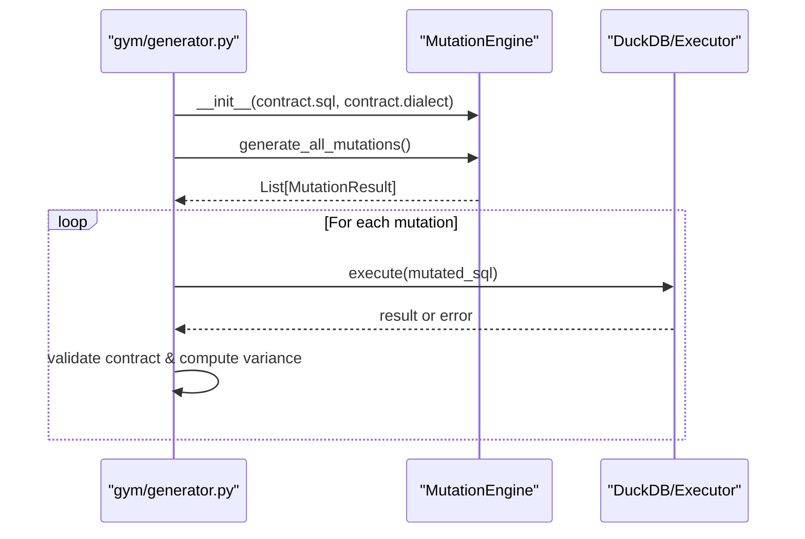
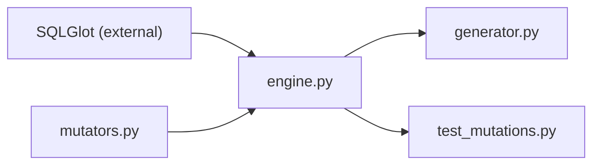
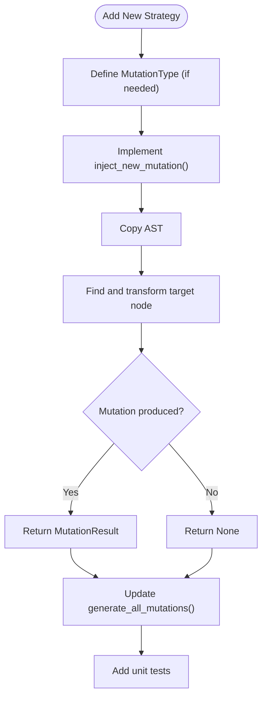

# Mutation Generation Engine

<cite>
**Referenced Files in This Document**
- [engine.py](file://semantic_reliability/testing/mutations/engine.py)
- [mutators.py](file://semantic_reliability/testing/mutations/mutators.py)
- [generator.py](file://semantic_reliability/gym/generator.py)
- [test_mutations.py](file://tests/test_mutations.py)
</cite>

## Table of Contents
1. [Introduction](#introduction)
2. [Project Structure](#project-structure)
3. [Core Components](#core-components)
4. [Architecture Overview](#architecture-overview)
5. [Detailed Component Analysis](#detailed-component-analysis)
6. [Dependency Analysis](#dependency-analysis)
7. [Performance Considerations](#performance-considerations)
8. [Troubleshooting Guide](#troubleshooting-guide)
9. [Conclusion](#conclusion)
10. [Appendices](#appendices)

## Introduction
This document explains the MutationEngine class that orchestrates AST-based SQL mutation generation using SQLGlot. It covers initialization with base SQL and optional dialect, how generate_all_mutations systematically applies multiple mutation strategies, how copies of the AST are created to avoid modifying original queries, the MutationResult structure for capturing metadata, and guidance for extending the engine with custom mutations. It also addresses performance considerations when generating large numbers of mutations.

## Project Structure
The mutation system is implemented under testing/mutations with two primary files:
- engine.py: Defines MutationEngine and concrete injection methods for each mutation strategy.
- mutators.py: Defines shared types (MutationType enum and MutationResult model).

Integration points exist in gym/generator.py where the engine is used to produce mutations for downstream evaluation and training data generation. Tests in tests/test_mutations.py validate behavior and ensure generated SQL remains parseable.

**Diagram sources**
- [engine.py:8-14](file://semantic_reliability/testing/mutations/engine.py#L8-L14)
- [mutators.py:8-27](file://semantic_reliability/testing/mutations/mutators.py#L8-L27)
- [generator.py:92-93](file://semantic_reliability/gym/generator.py#L92-L93)
- [test_mutations.py:58-63](file://tests/test_mutations.py#L58-L63)

**Section sources**
- [engine.py:8-14](file://semantic_reliability/testing/mutations/engine.py#L8-L14)
- [mutators.py:8-27](file://semantic_reliability/testing/mutations/mutators.py#L8-L27)
- [generator.py:92-93](file://semantic_reliability/gym/generator.py#L92-L93)
- [test_mutations.py:58-63](file://tests/test_mutations.py#L58-L63)

## Core Components
- MutationEngine: Orchestrates mutation generation by parsing SQL into an AST and applying targeted injections.
- MutationType: Enumerates supported mutation families (e.g., FILTER_DROP, BOUNDARY_SHIFT, AGGREGATION_SWAP, etc.).
- MutationResult: Captures metadata about a mutation including type, description, original and mutated SQL, target node, and category.

Key responsibilities:
- Parse base SQL into an AST once per engine instance.
- Provide a single entry point generate_all_mutations to run all strategies.
- Each inject_* method performs a precise AST transformation and returns a MutationResult if applicable.

**Section sources**
- [engine.py:8-14](file://semantic_reliability/testing/mutations/engine.py#L8-L14)
- [engine.py:16-52](file://semantic_reliability/testing/mutations/engine.py#L16-L52)
- [mutators.py:8-27](file://semantic_reliability/testing/mutations/mutators.py#L8-L27)

## Architecture Overview
The engine uses SQLGlot to represent SQL as an Abstract Syntax Tree (AST). For each mutation strategy:
- A copy of the AST is created to avoid mutating the original query.
- The strategy locates specific nodes (e.g., WHERE, JOIN, aggregations) and modifies them.
- If a valid mutation is produced, a MutationResult is returned with rich metadata.
- generate_all_mutations aggregates results from all strategies.

**Diagram sources**
- [engine.py:11-14](file://semantic_reliability/testing/mutations/engine.py#L11-L14)
- [engine.py:16-52](file://semantic_reliability/testing/mutations/engine.py#L16-L52)
- [engine.py:54-268](file://semantic_reliability/testing/mutations/engine.py#L54-L268)
- [mutators.py:8-27](file://semantic_reliability/testing/mutations/mutators.py#L8-L27)

## Detailed Component Analysis

### MutationEngine Initialization and Dialect Support
- Accepts base SQL and optional dialect string.
- Parses SQL into an AST once; stores it for reuse across strategies.
- Dialect is passed to the parser to ensure correct tokenization and semantics.

**Section sources**
- [engine.py:11-14](file://semantic_reliability/testing/mutations/engine.py#L11-L14)

### Systematic Application of Strategies via generate_all_mutations
- Calls each inject_* method sequentially.
- Appends any non-None MutationResult to the output list.
- Ensures consistent ordering and easy iteration over all possible mutations.

**Diagram sources**
- [engine.py:16-52](file://semantic_reliability/testing/mutations/engine.py#L16-L52)

**Section sources**
- [engine.py:16-52](file://semantic_reliability/testing/mutations/engine.py#L16-L52)

### AST-Based Mutations Using SQLGlot
Each strategy operates on a deep copy of the AST to preserve the original query. Examples include:
- Filter drop: Removes or weakens WHERE conditions.
- Boundary shift: Adjusts comparison operators.
- Aggregation swap: Swaps SUM/AVG/COUNT.
- Distinct drop: Removes DISTINCT modifier in COUNT.
- Join predicate drop: Removes ON condition to simulate Cartesian product risk.
- Grain drop: Removes a column from GROUP BY.
- Coalesce bypass: Replaces COALESCE with its first argument.
- Math operator invert: Switches between addition and subtraction.

**Diagram sources**
- [engine.py:8-268](file://semantic_reliability/testing/mutations/engine.py#L8-L268)
- [mutators.py:8-27](file://semantic_reliability/testing/mutations/mutators.py#L8-L27)

**Section sources**
- [engine.py:54-268](file://semantic_reliability/testing/mutations/engine.py#L54-L268)
- [mutators.py:8-27](file://semantic_reliability/testing/mutations/mutators.py#L8-L27)

### MutationResult Structure and Metadata
MutationResult captures:
- mutation_type: One of the defined mutation families.
- description: Human-readable explanation of the change.
- original_sql: The input SQL before mutation.
- mutated_sql: The resulting SQL after mutation.
- target_node: The AST node or clause affected (e.g., “WHERE AND Conjunct”, “COUNT DISTINCT Modifier”).
- mutation_category: High-level grouping such as “Population Filtering”, “Boundary Conditions”, “Mathematical Calculation”, “Join Cardinality”, “Reporting Grain”, “Null Safety”, “Arithmetic Logic”.

These fields enable reporting, filtering, and analysis downstream (e.g., in gym generator and harness reporters).

**Section sources**
- [mutators.py:8-27](file://semantic_reliability/testing/mutations/mutators.py#L8-L27)
- [engine.py:54-268](file://semantic_reliability/testing/mutations/engine.py#L54-L268)

### Integration Points and Usage
- Gym generator instantiates MutationEngine per contract SQL and calls generate_all_mutations to build training examples and evaluate divergence.
- Tests assert that mutations are valid and that mutated SQL parses cleanly.

**Diagram sources**
- [generator.py:92-130](file://semantic_reliability/gym/generator.py#L92-L130)
- [engine.py:16-52](file://semantic_reliability/testing/mutations/engine.py#L16-L52)

**Section sources**
- [generator.py:92-130](file://semantic_reliability/gym/generator.py#L92-L130)
- [test_mutations.py:58-63](file://tests/test_mutations.py#L58-L63)

## Dependency Analysis
- MutationEngine depends on SQLGlot for AST parsing and manipulation.
- It imports MutationType and MutationResult from mutators.py.
- Downstream consumers (gym generator, tests) depend on the engine’s public API.

**Diagram sources**
- [engine.py:1-5](file://semantic_reliability/testing/mutations/engine.py#L1-L5)
- [mutators.py:1-5](file://semantic_reliability/testing/mutations/mutators.py#L1-L5)
- [generator.py:92-93](file://semantic_reliability/gym/generator.py#L92-L93)
- [test_mutations.py:1-4](file://tests/test_mutations.py#L1-L4)

**Section sources**
- [engine.py:1-5](file://semantic_reliability/testing/mutations/engine.py#L1-L5)
- [mutators.py:1-5](file://semantic_reliability/testing/mutations/mutators.py#L1-L5)
- [generator.py:92-93](file://semantic_reliability/gym/generator.py#L92-L93)
- [test_mutations.py:1-4](file://tests/test_mutations.py#L1-L4)

## Performance Considerations
When generating large numbers of mutations:
- Minimize repeated parsing: The engine parses once per instance; reuse the same engine for multiple strategies.
- Prefer selective strategy execution: Only call relevant inject_* methods based on known query shapes to reduce overhead.
- Avoid unnecessary string conversions: Each strategy converts the mutated AST back to SQL only when a mutation is produced.
- Batch processing: In generators, process mutations in batches and stream results to control memory usage.
- Early rejection: Use lightweight checks (e.g., identical SQL strings) before expensive execution or validation steps.
- Parallelism: If needed, parallelize across independent contracts or mutation sets while ensuring thread safety around shared resources.

[No sources needed since this section provides general guidance]

## Troubleshooting Guide
Common issues and diagnostics:
- Invalid mutated SQL: Ensure each inject_* method returns a MutationResult only when a valid transformation occurs. Tests verify that mutated SQL parses cleanly.
- No mutations produced: Some strategies require specific AST patterns (e.g., WHERE with AND, COUNT with DISTINCT). Verify the base SQL contains these constructs.
- Unexpected equivalence: If mutated SQL equals original SQL, downstream logic may reject it as identical; confirm the intended mutation path was taken.
- Execution errors: When executing mutated SQL against fixtures, handle exceptions gracefully and track rejections.

Relevant validations and assertions can be found in tests.

**Section sources**
- [test_mutations.py:17-63](file://tests/test_mutations.py#L17-L63)

## Conclusion
The MutationEngine provides a robust, AST-based approach to SQL mutation generation using SQLGlot. It encapsulates multiple well-defined mutation strategies, preserves original queries through AST copying, and produces richly annotated MutationResult objects for downstream analysis and integration. Its design supports extensibility for new strategies and scales to large mutation workloads with careful batching and selective execution.

[No sources needed since this section summarizes without analyzing specific files]

## Appendices

### Extending the Engine with Custom Mutation Strategies
To add a new mutation:
- Define a new value in MutationType if necessary.
- Implement a new inject_* method in MutationEngine that:
  - Creates a copy of the AST.
  - Locates and modifies the target node(s).
  - Returns a MutationResult with appropriate metadata (type, description, target_node, category).
- Optionally update generate_all_mutations to invoke the new strategy.
- Add tests to assert correctness and parseability.

**Diagram sources**
- [mutators.py:8-27](file://semantic_reliability/testing/mutations/mutators.py#L8-L27)
- [engine.py:16-52](file://semantic_reliability/testing/mutations/engine.py#L16-L52)
- [engine.py:54-268](file://semantic_reliability/testing/mutations/engine.py#L54-L268)

**Section sources**
- [mutators.py:8-27](file://semantic_reliability/testing/mutations/mutators.py#L8-L27)
- [engine.py:16-52](file://semantic_reliability/testing/mutations/engine.py#L16-L52)
- [engine.py:54-268](file://semantic_reliability/testing/mutations/engine.py#L54-L268)