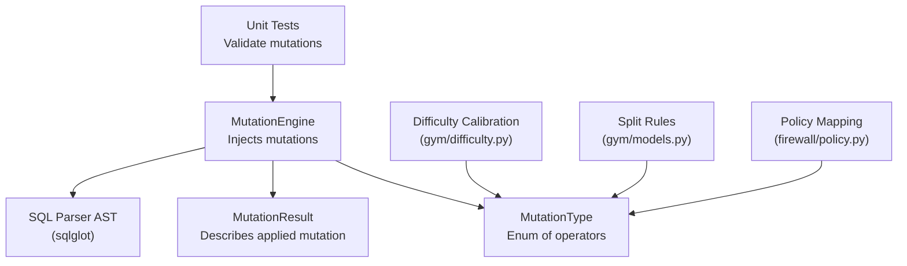
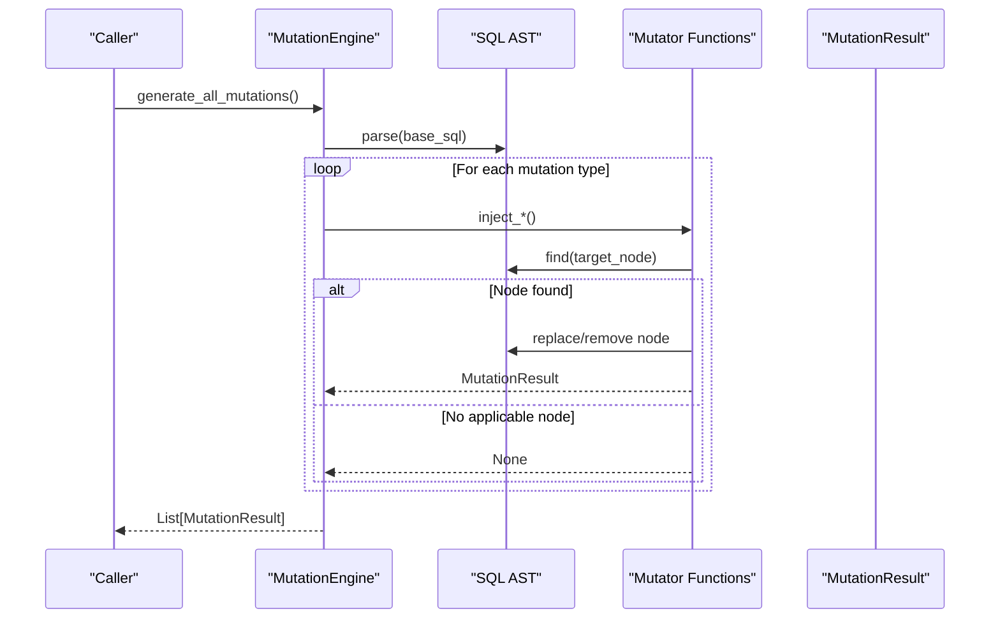
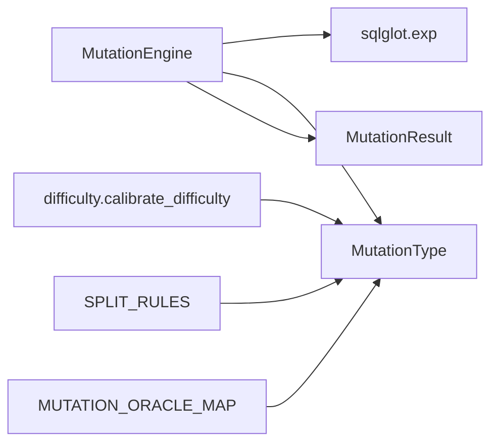

# Mutation Operators

<cite>
**Referenced Files in This Document**
- [engine.py](file://semantic_reliability/testing/mutations/engine.py)
- [mutators.py](file://semantic_reliability/testing/mutations/mutators.py)
- [test_mutations.py](file://tests/test_mutations.py)
- [difficulty.py](file://semantic_reliability/gym/difficulty.py)
- [models.py](file://semantic_reliability/gym/models.py)
- [policy.py](file://semantic_reliability/firewall/policy.py)
</cite>

## Table of Contents
1. [Introduction](#introduction)
2. [Project Structure](#project-structure)
3. [Core Components](#core-components)
4. [Architecture Overview](#architecture-overview)
5. [Detailed Component Analysis](#detailed-component-analysis)
6. [Dependency Analysis](#dependency-analysis)
7. [Performance Considerations](#performance-considerations)
8. [Troubleshooting Guide](#troubleshooting-guide)
9. [Conclusion](#conclusion)

## Introduction
This document provides comprehensive documentation for all built-in mutation operators used to simulate realistic SQL errors and assess query robustness. The operators target common failure modes such as incorrect filtering, boundary mis-specification, aggregation mistakes, join cardinality issues, grain changes, null safety failures, and arithmetic logic errors. Each operator manipulates the SQL Abstract Syntax Tree (AST) at precise nodes to inject a controlled semantic change, enabling systematic testing and validation of data pipelines.

The mutation system is implemented using AST traversal and targeted node replacement via a SQL parser library. Mutations are categorized into logical groups that align with real-world bug classes: Population Filtering, Boundary Conditions, Mathematical Calculation, Join Cardinality, Reporting Grain, Null Safety, and Arithmetic Logic.

## Project Structure
The mutation system centers around two core modules:
- A mutation engine that orchestrates injection of mutations across different SQL constructs
- A types module that defines mutation categories and result structures

**Diagram sources**
- [engine.py:8-52](file://semantic_reliability/testing/mutations/engine.py#L8-L52)
- [mutators.py:8-26](file://semantic_reliability/testing/mutations/mutators.py#L8-L26)
- [difficulty.py:3-26](file://semantic_reliability/gym/difficulty.py#L3-L26)
- [models.py:20-24](file://semantic_reliability/gym/models.py#L20-L24)
- [policy.py:4-14](file://semantic_reliability/firewall/policy.py#L4-L14)

**Section sources**
- [engine.py:8-52](file://semantic_reliability/testing/mutations/engine.py#L8-L52)
- [mutators.py:8-26](file://semantic_reliability/testing/mutations/mutators.py#L8-L26)

## Core Components
- MutationEngine: Parses base SQL into an AST and applies mutation functions to produce mutated SQL variants. It returns structured results describing each mutation.
- MutationType: Enumerates supported mutation operators.
- MutationResult: Captures metadata about each mutation including original and mutated SQL, target node, and category.

Key responsibilities:
- Parse SQL into an AST
- Identify specific SQL constructs (WHERE, JOIN, GROUP BY, aggregations, comparisons, arithmetic)
- Replace or remove nodes to simulate bugs
- Return standardized mutation results for downstream evaluation

**Section sources**
- [engine.py:8-52](file://semantic_reliability/testing/mutations/engine.py#L8-L52)
- [mutators.py:8-26](file://semantic_reliability/testing/mutations/mutators.py#L8-L26)

## Architecture Overview
The mutation pipeline follows a consistent pattern:
1. Parse base SQL into an AST
2. For each mutation type, attempt to find relevant AST nodes
3. If found, mutate the node and construct a MutationResult
4. Collect all successful mutations and return them

**Diagram sources**
- [engine.py:16-52](file://semantic_reliability/testing/mutations/engine.py#L16-L52)

## Detailed Component Analysis

### FILTER_DROP
- Purpose: Simulates accidental deletion of a filter condition in WHERE clauses.
- AST manipulation: Finds WHERE clause; if AND exists, replaces it with its left operand (dropping right conjunct); otherwise removes entire WHERE clause.
- Real-world error: Missing filter leads to broader population inclusion, inflating metrics.
- Impact: Can cause significant metric inflation by including rows that should be excluded.
- Applicability: Queries with WHERE clauses containing multiple conditions.
- Bugs detected: Incorrect population definitions, missing filters, overly broad queries.

Example transformation (conceptual):
- Original: SELECT ... FROM t WHERE a = 'x' AND b > 10
- Mutated: SELECT ... FROM t WHERE a = 'x'

**Section sources**
- [engine.py:54-83](file://semantic_reliability/testing/mutations/engine.py#L54-L83)
- [test_mutations.py:17-24](file://tests/test_mutations.py#L17-L24)

### BOUNDARY_SHIFT
- Purpose: Mutates inequality/equality operators to shift boundaries.
- AST manipulation: Replaces GT with GTE, LT with LTE, EQ with NEQ.
- Real-world error: Off-by-one errors or inverted equality checks.
- Impact: Changes which rows satisfy conditions, potentially altering counts and aggregates.
- Applicability: Any comparison operators in WHERE or HAVING clauses.
- Bugs detected: Boundary specification errors, off-by-one logic mistakes.

Example transformation (conceptual):
- Original: WHERE amount > 100
- Mutated: WHERE amount >= 100

**Section sources**
- [engine.py:85-128](file://semantic_reliability/testing/mutations/engine.py#L85-L128)
- [test_mutations.py:27-32](file://tests/test_mutations.py#L27-L32)

### AGGREGATION_SWAP
- Purpose: Swaps aggregation functions to simulate calculation errors.
- AST manipulation: Replaces SUM with AVG, AVG with SUM, COUNT with SUM.
- Real-world error: Using wrong aggregation function leads to incorrect totals/averages.
- Impact: Distorts metric values significantly depending on data distribution.
- Applicability: Queries with SUM, AVG, or COUNT aggregations.
- Bugs detected: Wrong aggregation choice, misapplied business logic.

Example transformation (conceptual):
- Original: COALESCE(SUM(amount), 0) AS total_amount
- Mutated: COALESCE(AVG(amount), 0) AS total_amount

**Section sources**
- [engine.py:130-173](file://semantic_reliability/testing/mutations/engine.py#L130-L173)
- [test_mutations.py:35-40](file://tests/test_mutations.py#L35-L40)

### DISTINCT_DROP
- Purpose: Removes DISTINCT modifier from COUNT(DISTINCT ...) to simulate deduplication errors.
- AST manipulation: Finds Count nodes with distinct flag set and clears it.
- Real-world error: Counting duplicates instead of unique values.
- Impact: Inflates counts when duplicate values exist.
- Applicability: Queries using COUNT(DISTINCT column).
- Bugs detected: Incorrect uniqueness assumptions, double-counting bugs.

Example transformation (conceptual):
- Original: COUNT(DISTINCT user_id)
- Mutated: COUNT(user_id)

**Section sources**
- [engine.py:175-189](file://semantic_reliability/testing/mutations/engine.py#L175-L189)

### JOIN_PREDICATE_DROP
- Purpose: Drops ON condition from JOIN to simulate Cartesian product risk.
- AST manipulation: Finds Join nodes with ON predicates and removes them.
- Real-world error: Accidental cross joins causing massive row multiplication.
- Impact: Exponential growth in result sets, severe performance and correctness issues.
- Applicability: Queries with JOIN clauses containing ON conditions.
- Bugs detected: Missing join keys, incorrect join logic.

Example transformation (conceptual):
- Original: FROM a JOIN b ON a.id = b.a_id
- Mutated: FROM a JOIN b

**Section sources**
- [engine.py:191-205](file://semantic_reliability/testing/mutations/engine.py#L191-L205)

### GRAIN_DROP
- Purpose: Drops a column from GROUP BY to simulate over-aggregation.
- AST manipulation: Finds Group node and removes last expression from expressions list.
- Real-world error: Aggregating at coarser grain than intended.
- Impact: Merges distinct groups, producing inflated aggregated values per group.
- Applicability: Queries with multi-column GROUP BY clauses.
- Bugs detected: Incorrect grouping dimensions, loss of granularity.

Example transformation (conceptal):
- Original: GROUP BY customer_id, DATE_TRUNC('month', transaction_date)
- Mutated: GROUP BY customer_id

**Section sources**
- [engine.py:207-221](file://semantic_reliability/testing/mutations/engine.py#L207-L221)
- [test_mutations.py:51-55](file://tests/test_mutations.py#L51-L55)

### COALESCE_BYPASS
- Purpose: Removes COALESCE default fallback to expose NULL propagation issues.
- AST manipulation: Finds Coalesce node and replaces it with first argument only.
- Real-world error: NULL values propagate through calculations instead of being handled.
- Impact: Results may become NULL, breaking downstream logic or reporting.
- Applicability: Queries using COALESCE for null handling.
- Bugs detected: Inadequate null safety, unexpected NULL propagation.

Example transformation (conceptual):
- Original: COALESCE(SUM(amount), 0)
- Mutated: SUM(amount)

**Section sources**
- [engine.py:223-238](file://semantic_reliability/testing/mutations/engine.py#L223-L238)
- [test_mutations.py:43-48](file://tests/test_mutations.py#L43-L48)

### MATH_OPERATOR_INVERT
- Purpose: Inverts arithmetic operators (+ to -, - to +) to simulate calculation errors.
- AST manipulation: Finds Add/Sub nodes and swaps them.
- Real-world error: Sign errors in formulas lead to incorrect results.
- Impact: Can flip positive/negative values, drastically changing outcomes.
- Applicability: Queries with addition or subtraction operations.
- Bugs detected: Formula sign errors, incorrect arithmetic logic.

Example transformation (conceptual):
- Original: revenue - cost
- Mutated: revenue + cost

**Section sources**
- [engine.py:240-268](file://semantic_reliability/testing/mutations/engine.py#L240-L268)

## Dependency Analysis
The mutation system has clear dependencies and relationships:

Key dependencies:
- sqlglot: Provides AST parsing and manipulation capabilities
- MutationType enum: Centralizes operator definitions
- External modules use mutation types for difficulty calibration, split assignment, and policy mapping

**Diagram sources**
- [engine.py:1-5](file://semantic_reliability/testing/mutations/engine.py#L1-L5)
- [mutators.py:1-26](file://semantic_reliability/testing/mutations/mutators.py#L1-L26)
- [difficulty.py:15-26](file://semantic_reliability/gym/difficulty.py#L15-L26)
- [models.py:20-24](file://semantic_reliability/gym/models.py#L20-L24)
- [policy.py:4-14](file://semantic_reliability/firewall/policy.py#L4-L14)

**Section sources**
- [engine.py:1-52](file://semantic_reliability/testing/mutations/engine.py#L1-L52)
- [mutators.py:1-26](file://semantic_reliability/testing/mutations/mutators.py#L1-L26)

## Performance Considerations
- AST copying: Each mutation creates a copy of the AST to avoid modifying the original
- Node searching: Uses efficient AST traversal methods like find() and find_all()
- Early termination: Many mutation functions return immediately after first successful mutation
- Memory usage: Maintains both original and mutated SQL strings in results
- Scalability: Suitable for moderate-sized SQL statements; very complex queries may benefit from selective mutation application

## Troubleshooting Guide
Common issues and solutions:
- No mutations generated: Ensure SQL contains relevant constructs (WHERE, JOIN, GROUP BY, aggregations)
- Invalid mutated SQL: Verify AST modifications maintain syntactic validity
- Unexpected behavior: Check if mutation targets exist in the specific SQL structure
- Performance issues: Consider running specific mutation types rather than all mutations

Debugging tips:
- Inspect MutationResult.target_node to understand what was modified
- Compare original_sql vs mutated_sql to see exact changes
- Use unit tests as reference for expected behavior patterns

**Section sources**
- [test_mutations.py:1-64](file://tests/test_mutations.py#L1-L64)

## Conclusion
The mutation operator framework provides a systematic approach to testing SQL query robustness by simulating realistic error scenarios. Each operator targets specific vulnerability classes and uses precise AST manipulation to inject controlled semantic changes. The system enables detection of common bugs including filter omissions, boundary errors, aggregation mistakes, join issues, grain problems, null safety failures, and arithmetic logic errors. By categorizing mutations into logical groups and providing difficulty calibration, the framework supports comprehensive testing strategies for data quality assurance.