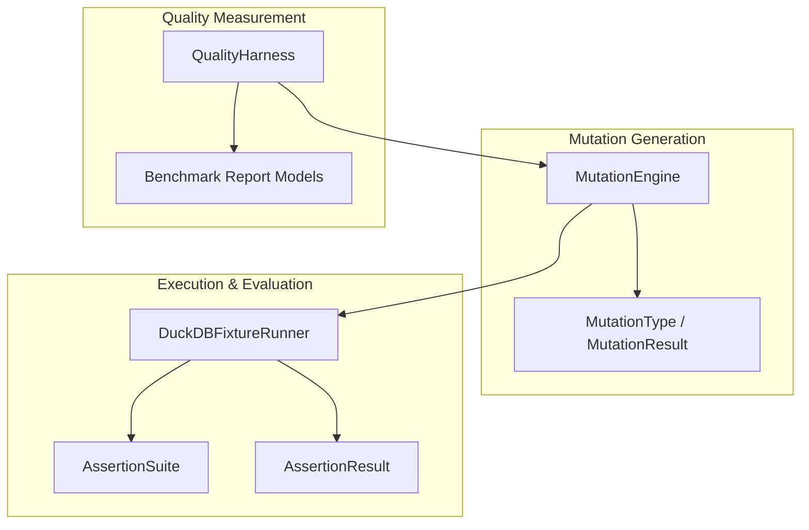
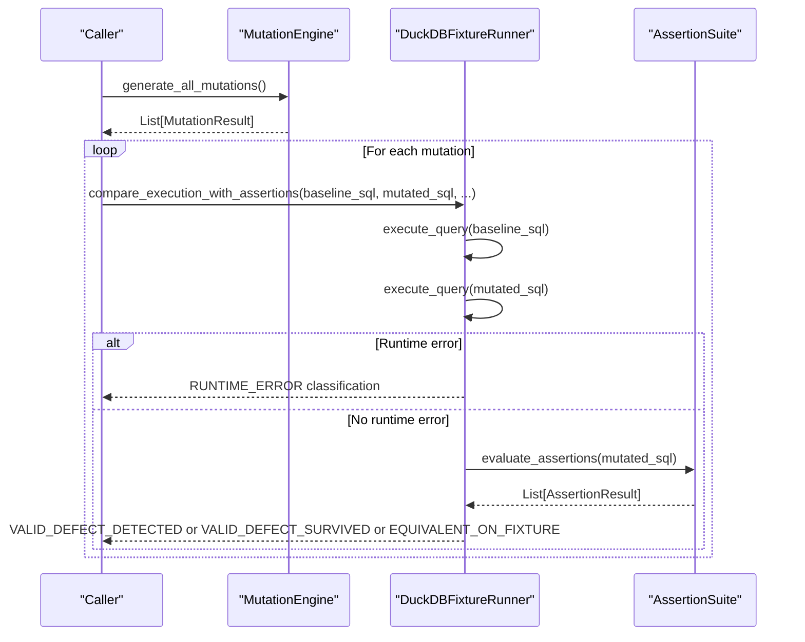
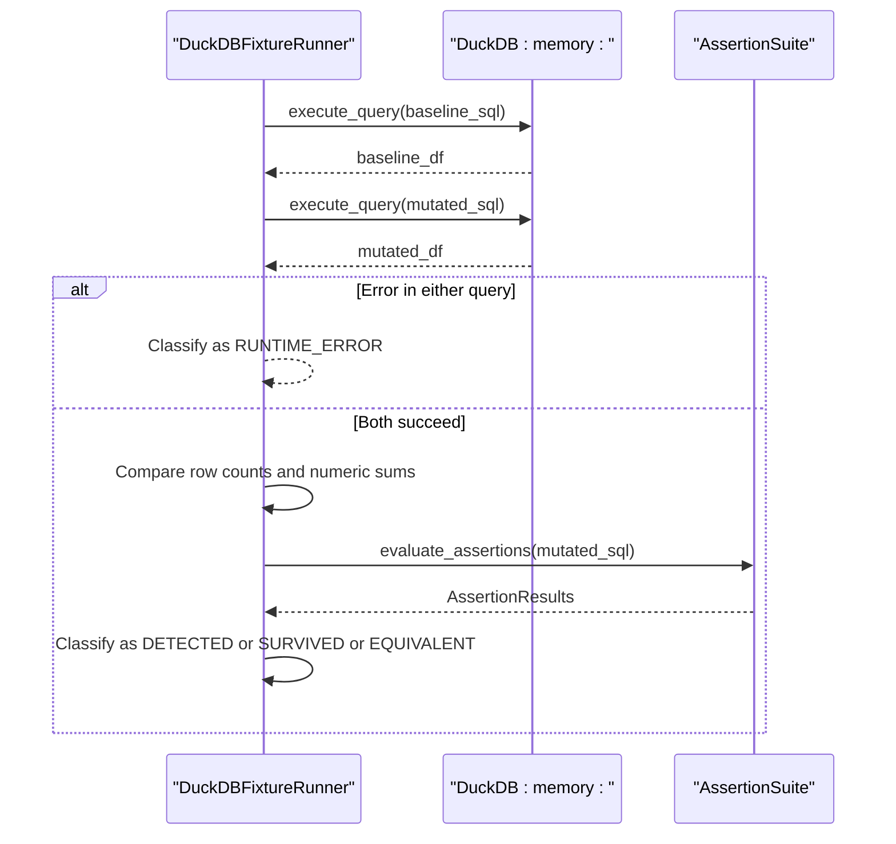
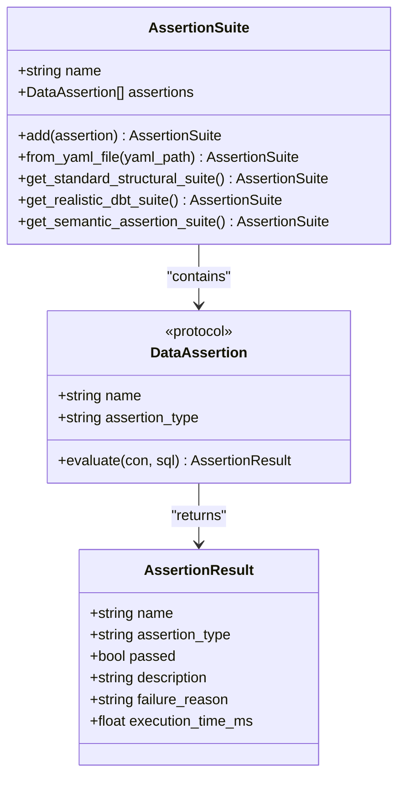
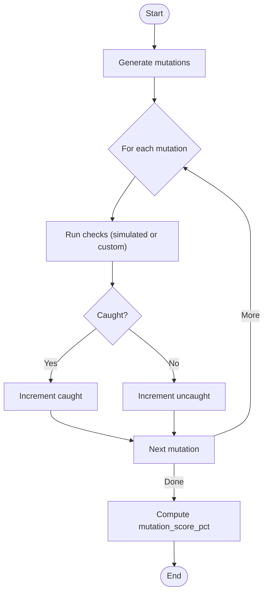
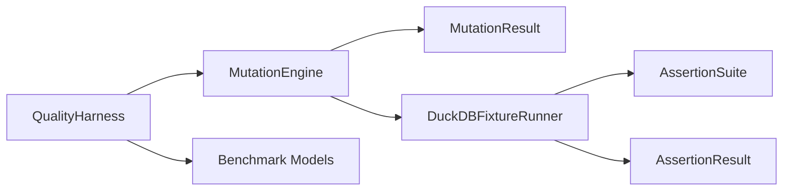

# Mutation Testing

<cite>
**Referenced Files in This Document**
- [engine.py](file://semantic_reliability/testing/mutations/engine.py)
- [mutators.py](file://semantic_reliability/testing/mutations/mutators.py)
- [duckdb_runner.py](file://semantic_reliability/harness/duckdb_runner.py)
- [quality_harness.py](file://semantic_reliability/harness/quality_harness.py)
- [base.py](file://semantic_reliability/assertions/base.py)
- [registry.py](file://semantic_reliability/assertions/registry.py)
- [test_mutations.py](file://tests/test_mutations.py)
- [test_duckdb_runner.py](file://tests/test_duckdb_runner.py)
- [test_quality_harness.py](file://tests/test_quality_harness.py)
- [README.md](file://README.md)
</cite>

## Table of Contents
1. [Introduction](#introduction)
2. [Project Structure](#project-structure)
3. [Core Components](#core-components)
4. [Architecture Overview](#architecture-overview)
5. [Detailed Component Analysis](#detailed-component-analysis)
6. [Dependency Analysis](#dependency-analysis)
7. [Performance Considerations](#performance-considerations)
8. [Troubleshooting Guide](#troubleshooting-guide)
9. [Conclusion](#conclusion)
10. [Appendices](#appendices)

## Introduction
This document explains the mutation testing framework that performs adversarial testing on SQL models by injecting precise, AST-level mutations to simulate real-world semantic errors. It covers built-in mutation operators (filter removal, boundary shifts, aggregation swaps, join predicate drops, grain changes, coalesce bypasses, and arithmetic operator inversions), the mutation generation engine, the DuckDB runner for safe execution and evaluation, quality metrics such as mutation catch rates and assertion effectiveness, guidance for creating custom mutators, and performance tuning strategies for large test suites.

The framework is designed to expose blind spots in standard structural tests and to validate whether semantic assertions can detect meaningful deviations caused by realistic SQL logic changes.

**Section sources**
- [README.md:14-18](file://README.md#L14-L18)

## Project Structure
The mutation testing capability spans three primary areas:
- Mutation generation: AST-based injection of logical changes into SQL queries.
- Execution and evaluation: In-memory DuckDB execution with fixture data and assertion suite evaluation.
- Quality measurement: Aggregation of results into benchmark reports and mutation scores.

**Diagram sources**
- [engine.py:8-52](file://semantic_reliability/testing/mutations/engine.py#L8-L52)
- [mutators.py:8-27](file://semantic_reliability/testing/mutations/mutators.py#L8-L27)
- [duckdb_runner.py:56-256](file://semantic_reliability/harness/duckdb_runner.py#L56-L256)
- [registry.py:22-160](file://semantic_reliability/assertions/registry.py#L22-L160)
- [quality_harness.py:34-113](file://semantic_reliability/harness/quality_harness.py#L34-L113)

**Section sources**
- [engine.py:8-52](file://semantic_reliability/testing/mutations/engine.py#L8-L52)
- [duckdb_runner.py:56-256](file://semantic_reliability/harness/duckdb_runner.py#L56-L256)
- [quality_harness.py:34-113](file://semantic_reliability/harness/quality_harness.py#L34-L113)

## Core Components
- MutationEngine: Parses base SQL into an AST and applies targeted mutations across filtering, boundaries, aggregations, joins, grain, null safety, and arithmetic logic.
- Mutation types and results: Enumerated categories and structured records describing each mutation’s intent and output.
- DuckDBFixtureRunner: Executes baseline and mutated queries in an isolated in-memory database, compares outputs, evaluates assertions, and classifies outcomes.
- AssertionSuite and DataAssertion: A registry of structural and semantic checks executed against query results; includes default suites and YAML-configurable assertions.
- QualityHarness: Orchestrates mutation evaluation and computes a mutation score based on how many injected defects are caught by configured checks.

Key responsibilities:
- Generate controlled, parseable mutated SQL variants.
- Execute safely using DuckDB with fixtures or defaults.
- Compare outputs empirically and via assertions.
- Produce actionable metrics and summaries.

**Section sources**
- [engine.py:8-52](file://semantic_reliability/testing/mutations/engine.py#L8-L52)
- [mutators.py:8-27](file://semantic_reliability/testing/mutations/mutators.py#L8-L27)
- [duckdb_runner.py:56-256](file://semantic_reliability/harness/duckdb_runner.py#L56-L256)
- [registry.py:22-160](file://semantic_reliability/assertions/registry.py#L22-L160)
- [quality_harness.py:34-113](file://semantic_reliability/harness/quality_harness.py#L34-L113)

## Architecture Overview
The system follows a pipeline:
1. Parse base SQL into an AST.
2. Apply one or more mutation operators to produce mutated SQL.
3. Execute both baseline and mutated SQL in DuckDB with fixtures.
4. Compare outputs and run assertions to classify outcomes.
5. Aggregate results into benchmark reports and compute catch scores.

**Diagram sources**
- [engine.py:16-52](file://semantic_reliability/testing/mutations/engine.py#L16-L52)
- [duckdb_runner.py:116-206](file://semantic_reliability/harness/duckdb_runner.py#L116-L206)
- [registry.py:22-160](file://semantic_reliability/assertions/registry.py#L22-L160)

## Detailed Component Analysis

### Mutation Engine and Operators
The engine parses SQL once and then applies multiple mutation generators. Each generator targets a specific AST node type and returns a structured result describing the change.

Built-in operators:
- Filter removal: Drops right conjunct of AND or entire WHERE clause.
- Boundary shift: Mutates > to >=, < to <=, = to !=.
- Aggregation swap: Swaps SUM, AVG, COUNT to another aggregate.
- Distinct drop: Removes DISTINCT from COUNT(DISTINCT).
- Join predicate drop: Removes ON condition from JOINs.
- Grain drop: Removes a column from GROUP BY to over-aggregate.
- Coalesce bypass: Replaces COALESCE(col, default) with col to expose NULL propagation.
- Arithmetic invert: Flips + to - or - to +.

```mermaid
flowchart TD
Start(["Start"]) --> Parse["Parse SQL to AST"]
Parse --> Filters{"WHERE present?"}
Filters --> |Yes| DropFilter["Drop AND conjunct or entire WHERE"]
Filters --> |No| Boundaries{"Comparison ops?"}
DropFilter --> Boundaries
Boundaries --> |Yes| ShiftBoundary["Mutate >/< to >=/<= or = to !="]
Boundaries --> |No| Aggregations{"Aggregations?"}
ShiftBoundary --> Aggregations
Aggregations --> |Yes| SwapAgg["Swap SUM/AVG/COUNT"]
Aggregations --> |No| Distinct{"COUNT DISTINCT?"}
SwapAgg --> Distinct
Distinct --> |Yes| DropDistinct["Remove DISTINCT from COUNT"]
Distinct --> |No| Joins{"JOINs?"}
DropDistinct --> Joins
Joins --> |Yes| DropJoinPred["Remove ON predicate"]
Joins --> |No| Grain{"GROUP BY has >1 expr?"}
DropJoinPred --> Grain
Grain --> |Yes| DropGrain["Pop last GROUP BY expression"]
Grain --> |No| Coalesce{"COALESCE present?"}
DropGrain --> Coalesce
Coalesce --> |Yes| BypassCoalesce["Replace COALESCE with first arg"]
Coalesce --> |No| Math{"Add/Sub present?"}
BypassCoalesce --> Math
Math --> |Yes| InvertMath["Invert + <-> -"]
Math --> |No| End(["End"])
InvertMath --> End
```

**Diagram sources**
- [engine.py:54-268](file://semantic_reliability/testing/mutations/engine.py#L54-L268)

**Section sources**
- [engine.py:54-268](file://semantic_reliability/testing/mutations/engine.py#L54-L268)
- [mutators.py:8-27](file://semantic_reliability/testing/mutations/mutators.py#L8-L27)

### DuckDB Runner: Safe Execution and Evaluation
The runner executes baseline and mutated SQL in an in-memory DuckDB instance, optionally loading CSV or DataFrame fixtures. It compares row counts, numeric sums, and runs assertions to classify outcomes:
- Equivalent on fixture: Outputs match within tolerance.
- Runtime error: Syntax or execution failure.
- Valid defect detected: Assertions failed on mutated query.
- Valid defect survived: Output changed but no assertions failed.

**Diagram sources**
- [duckdb_runner.py:102-206](file://semantic_reliability/harness/duckdb_runner.py#L102-L206)

**Section sources**
- [duckdb_runner.py:56-256](file://semantic_reliability/harness/duckdb_runner.py#L56-L256)

### Assertions and Suites
Assertions define structural and semantic checks executed against query results. The registry supports:
- Structural checks: non-null, unique keys, row count bounds, accepted ranges/values, relationships, singular SQL tests.
- Semantic checks: required population filters, metric value expectations, expected grain columns.
- Predefined suites: standard structural, realistic dbt-like, and comprehensive semantic suites.

**Diagram sources**
- [registry.py:22-160](file://semantic_reliability/assertions/registry.py#L22-L160)
- [base.py:6-25](file://semantic_reliability/assertions/base.py#L6-L25)

**Section sources**
- [registry.py:22-160](file://semantic_reliability/assertions/registry.py#L22-L160)
- [base.py:6-25](file://semantic_reliability/assertions/base.py#L6-L25)

### Quality Harness and Metrics
QualityHarness orchestrates mutation evaluation and computes a mutation score indicating how many injected defects were caught by configured checks. It can use simulated checks or a custom test runner.

Metrics:
- Total mutations generated.
- Caught vs uncaught mutations.
- Mutation score percentage.
- Per-mutation evaluations including catching checks and blind spots.

**Diagram sources**
- [quality_harness.py:66-113](file://semantic_reliability/harness/quality_harness.py#L66-L113)

**Section sources**
- [quality_harness.py:34-113](file://semantic_reliability/harness/quality_harness.py#L34-L113)

## Dependency Analysis
The components have clear separation of concerns:
- MutationEngine depends on sqlglot AST manipulation and produces MutationResult objects.
- DuckDBFixtureRunner depends on DuckDB, pandas, and AssertionSuite to execute and evaluate queries.
- QualityHarness depends on MutationEngine and optional custom runners to compute scores.
- Assertions provide pluggable checks that integrate with the runner.

**Diagram sources**
- [engine.py:8-52](file://semantic_reliability/testing/mutations/engine.py#L8-L52)
- [duckdb_runner.py:56-256](file://semantic_reliability/harness/duckdb_runner.py#L56-L256)
- [quality_harness.py:34-113](file://semantic_reliability/harness/quality_harness.py#L34-L113)

**Section sources**
- [engine.py:8-52](file://semantic_reliability/testing/mutations/engine.py#L8-L52)
- [duckdb_runner.py:56-256](file://semantic_reliability/harness/duckdb_runner.py#L56-L256)
- [quality_harness.py:34-113](file://semantic_reliability/harness/quality_harness.py#L34-L113)

## Performance Considerations
- In-memory execution: DuckDBFixtureRunner uses an in-memory database to avoid disk I/O overhead and ensure isolation per run.
- Fixture loading: Supports CSV and DataFrame inputs; defaults to a small transactions table if none provided.
- Empirical equivalence: Compares row counts and numeric sums to quickly determine equivalence without full deep comparison when possible.
- Assertion evaluation: Runs all configured assertions against mutated queries; keep suites minimal for speed and add semantic checks selectively.
- Parallelization strategy:
  - Process mutations independently; each mutation evaluation is stateless after setup.
  - Use Python multiprocessing or concurrent.futures to parallelize comparisons across CPU cores.
  - Share a read-only fixture dataset across workers to minimize duplication.
  - Limit assertion suites per worker to reduce per-query overhead.
  - Batch mutations to control memory usage and avoid overwhelming DuckDB connections.
- Scaling considerations:
  - For large test suites, shard mutations across workers and aggregate reports at the end.
  - Tune assertion complexity; prefer lightweight structural checks for broad coverage and reserve heavy semantic checks for targeted scenarios.
  - Monitor resource usage (CPU, memory) and adjust batch sizes accordingly.

[No sources needed since this section provides general guidance]

## Troubleshooting Guide
Common issues and resolutions:
- Runtime errors during mutation execution:
  - Cause: Invalid SQL after mutation or missing fixtures.
  - Resolution: Validate mutated SQL parsing; ensure fixtures exist or provide explicit datasets.
- Equivalent on fixture despite mutation:
  - Cause: Mutation did not affect output under current fixtures.
  - Resolution: Expand fixture diversity or add semantic assertions targeting affected logic.
- Surviving defects:
  - Cause: Assertions insufficient to detect semantic drift.
  - Resolution: Add RequiredPopulationAssertion, MetricValueAssertion, or ExpectedGrainAssertion tailored to the model.
- Slow evaluation:
  - Cause: Large datasets or expensive assertions.
  - Resolution: Reduce dataset size for CI, optimize assertions, and parallelize evaluations.

**Section sources**
- [duckdb_runner.py:102-206](file://semantic_reliability/harness/duckdb_runner.py#L102-L206)
- [registry.py:22-160](file://semantic_reliability/assertions/registry.py#L22-L160)

## Conclusion
The mutation testing framework provides a robust mechanism to stress-test SQL models through adversarial, AST-level mutations. By combining precise mutation operators with in-memory execution and configurable assertions, it reveals semantic blind spots and quantifies test suite effectiveness via mutation catch rates. Teams can extend the operator library with custom mutators, tailor assertion suites to their domain, and scale evaluations through parallelization to maintain performance on large codebases.

[No sources needed since this section summarizes without analyzing specific files]

## Appendices

### Built-in Mutation Operators Summary
- Filter removal: Simulates accidental deletion of filter conditions.
- Boundary shift: Alters inequality/equality semantics.
- Aggregation swap: Changes calculation semantics (SUM/AVG/COUNT).
- Distinct drop: Removes deduplication in counts.
- Join predicate drop: Introduces Cartesian product risk.
- Grain drop: Over-aggregates by removing grouping columns.
- Coalesce bypass: Exposes NULL propagation risks.
- Arithmetic invert: Flips addition/subtraction operands.

**Section sources**
- [engine.py:54-268](file://semantic_reliability/testing/mutations/engine.py#L54-L268)
- [mutators.py:8-27](file://semantic_reliability/testing/mutations/mutators.py#L8-L27)

### Creating Custom Mutators
To add a new mutation operator:
- Define a new MutationType in the enum.
- Implement an inject method in MutationEngine that locates relevant AST nodes and replaces them with mutated equivalents.
- Return a MutationResult with type, description, original and mutated SQL, target node, and category.
- Include unit tests validating the mutated SQL parses and behaves as expected.

Example references:
- Existing operators demonstrate patterns for finding and replacing AST nodes and constructing MutationResult.

**Section sources**
- [mutators.py:8-27](file://semantic_reliability/testing/mutations/mutators.py#L8-L27)
- [engine.py:54-268](file://semantic_reliability/testing/mutations/engine.py#L54-L268)
- [test_mutations.py:17-63](file://tests/test_mutations.py#L17-L63)

### Extending Assertion Suites
To enhance detection:
- Add semantic assertions like RequiredPopulationAssertion to enforce filters.
- Use MetricValueAssertion to validate computed values within tolerances.
- Use ExpectedGrainAssertion to ensure grouping correctness.
- Load suites from YAML for configuration-driven testing.

**Section sources**
- [registry.py:22-160](file://semantic_reliability/assertions/registry.py#L22-L160)
- [base.py:6-25](file://semantic_reliability/assertions/base.py#L6-L25)

### Running Tests and Verifying Behavior
- Unit tests verify individual mutation operators and overall generation.
- DuckDB runner tests validate execution, equivalence detection, and benchmark reporting.
- Quality harness tests confirm score computation and report generation.

**Section sources**
- [test_mutations.py:17-63](file://tests/test_mutations.py#L17-L63)
- [test_duckdb_runner.py:17-72](file://tests/test_duckdb_runner.py#L17-L72)
- [test_quality_harness.py:25-44](file://tests/test_quality_harness.py#L25-L44)