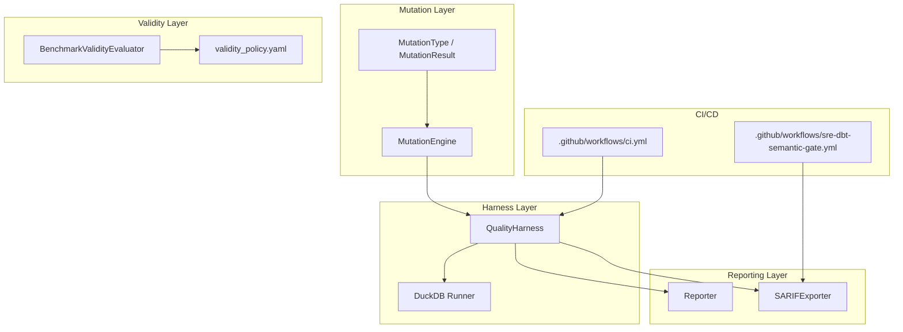
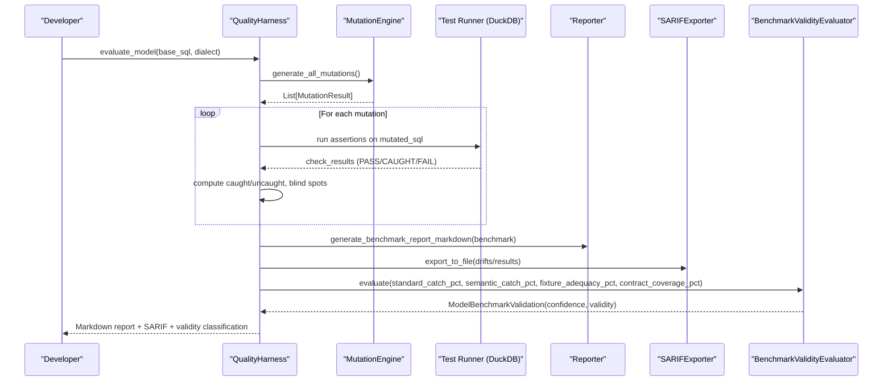
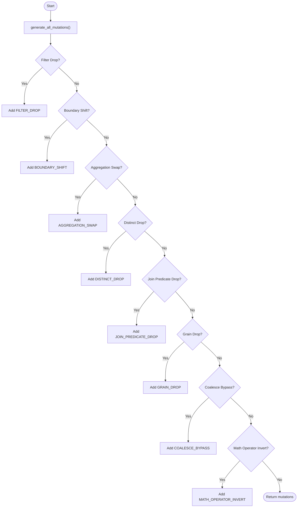
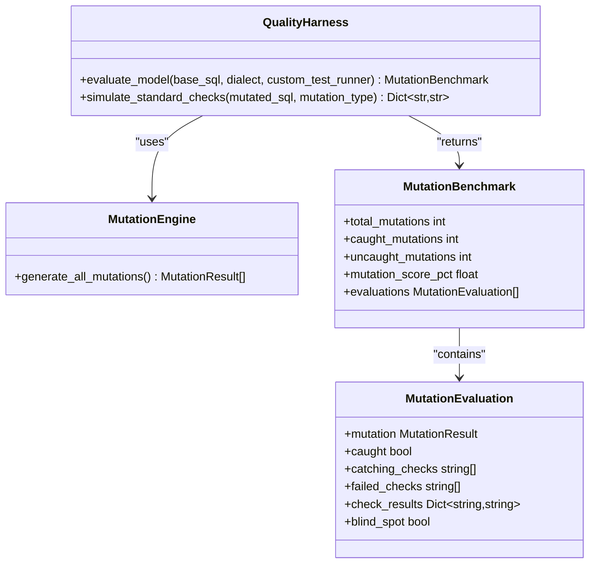
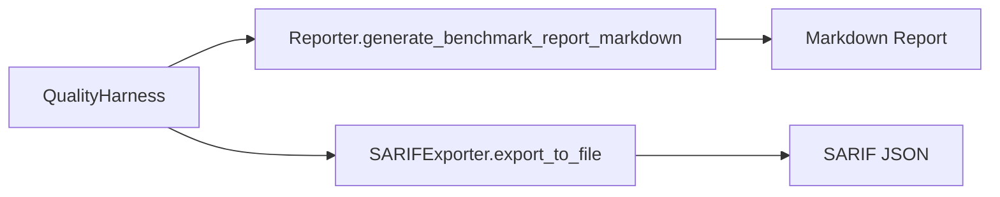
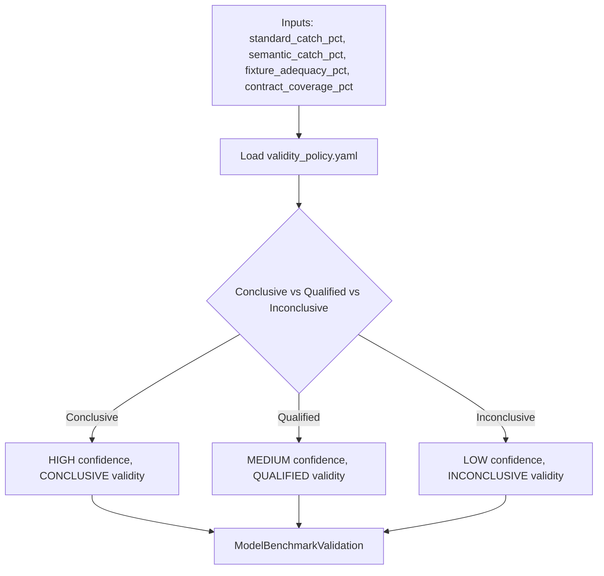
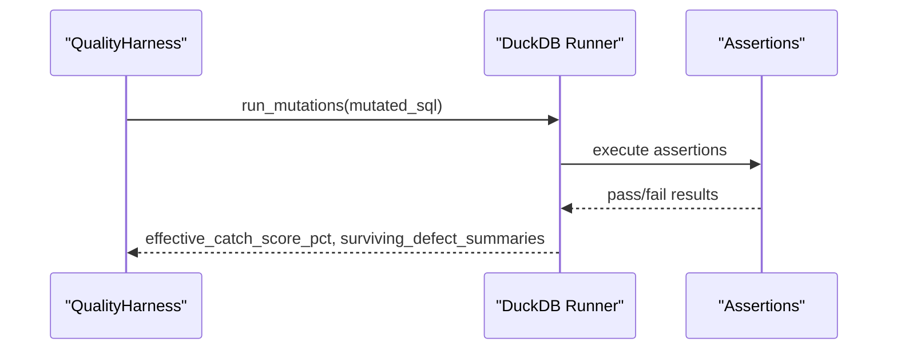
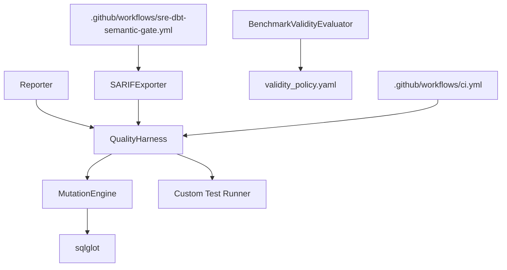

# Quality Metrics & Assessment

<cite>
**Referenced Files in This Document**
- [quality_harness.py](file://semantic_reliability/harness/quality_harness.py)
- [engine.py](file://semantic_reliability/testing/mutations/engine.py)
- [mutators.py](file://semantic_reliability/testing/mutations/mutators.py)
- [reporter.py](file://semantic_reliability/harness/reporter.py)
- [sarif_exporter.py](file://semantic_reliability/harness/sarif_exporter.py)
- [validity.py](file://semantic_reliability/harness/validity.py)
- [validity_policy.yaml](file://semantic_reliability/harness/validity_policy.yaml)
- [duckdb_runner.py](file://semantic_reliability/harness/duckdb_runner.py)
- [cli.py](file://semantic_reliability/cli.py)
- [ci.yml](file://.github/workflows/ci.yml)
- [sre-dbt-semantic-gate.yml](file://.github/workflows/sre-dbt-semantic-gate.yml)
</cite>

## Table of Contents
1. [Introduction](#introduction)
2. [Project Structure](#project-structure)
3. [Core Components](#core-components)
4. [Architecture Overview](#architecture-overview)
5. [Detailed Component Analysis](#detailed-component-analysis)
6. [Dependency Analysis](#dependency-analysis)
7. [Performance Considerations](#performance-considerations)
8. [Troubleshooting Guide](#troubleshooting-guide)
9. [Conclusion](#conclusion)
10. [Appendices](#appendices)

## Introduction
This document explains how to measure and assess assertion quality using mutation testing, focusing on key metrics such as mutation catch rate, assertion effectiveness score, and coverage percentage. It describes the quality harness orchestration that coordinates mutation generation, execution, and result analysis; interprets results to identify weak areas in assertion suites; and outlines reporting formats (JSON, SARIF, human-readable summaries). It also provides guidance for setting quality thresholds and gating criteria in CI/CD pipelines, along with trend analysis and regression detection strategies over time.

## Project Structure
The repository implements a mutation-based assessment framework centered around:
- Mutation generation via AST-level SQL mutations
- A quality harness that evaluates test/assertion suites against mutated models
- Reporting utilities for human-readable markdown and SARIF outputs
- Validity evaluation and policy-driven confidence classification
- CI/CD workflows that integrate semantic checks and benchmarking

**Diagram sources**
- [engine.py:8-52](file://semantic_reliability/testing/mutations/engine.py#L8-L52)
- [mutators.py:8-27](file://semantic_reliability/testing/mutations/mutators.py#L8-L27)
- [quality_harness.py:34-112](file://semantic_reliability/harness/quality_harness.py#L34-L112)
- [reporter.py:8-129](file://semantic_reliability/harness/reporter.py#L8-L129)
- [sarif_exporter.py:9-100](file://semantic_reliability/harness/sarif_exporter.py#L9-L100)
- [validity.py:47-127](file://semantic_reliability/harness/validity.py#L47-L127)
- [validity_policy.yaml:1-17](file://semantic_reliability/harness/validity_policy.yaml#L1-L17)
- [ci.yml:1-51](file://.github/workflows/ci.yml#L1-L51)
- [sre-dbt-semantic-gate.yml:1-72](file://.github/workflows/sre-dbt-semantic-gate.yml#L1-L72)

**Section sources**
- [engine.py:8-52](file://semantic_reliability/testing/mutations/engine.py#L8-L52)
- [quality_harness.py:34-112](file://semantic_reliability/harness/quality_harness.py#L34-L112)
- [reporter.py:8-129](file://semantic_reliability/harness/reporter.py#L8-L129)
- [sarif_exporter.py:9-100](file://semantic_reliability/harness/sarif_exporter.py#L9-L100)
- [validity.py:47-127](file://semantic_reliability/harness/validity.py#L47-L127)
- [validity_policy.yaml:1-17](file://semantic_reliability/harness/validity_policy.yaml#L1-L17)
- [ci.yml:1-51](file://.github/workflows/ci.yml#L1-L51)
- [sre-dbt-semantic-gate.yml:1-72](file://.github/workflows/sre-dbt-semantic-gate.yml#L1-L72)

## Core Components
- MutationEngine: Generates AST-level logical mutations across filtering, boundaries, aggregations, joins, grain, null safety, and arithmetic operators.
- QualityHarness: Orchestrates mutation execution and evaluates assertion/test suites to compute mutation scores and per-mutation evaluations.
- Reporter: Produces human-readable markdown reports including mutation catch summaries and drift alerts.
- SARIFExporter: Converts drift or validation findings into SARIF 2.1.0 JSON for GitHub Code Scanning integration.
- BenchmarkValidityEvaluator: Applies versioned policies to classify benchmark validity and confidence based on fixture adequacy and contract coverage.
- DuckDB Runner: Executes assertions against mutated SQL and computes effective catch scores and surviving defect summaries.

Key metrics:
- Mutation Catch Rate: Percentage of injected mutations detected by the assertion suite.
- Assertion Effective Catch Score: Catch rate computed over executable (non-equivalent) mutations, reflecting practical effectiveness.
- Coverage Percentage: Contract coverage indicating how many required semantic dimensions are covered by contracts.

**Section sources**
- [engine.py:8-52](file://semantic_reliability/testing/mutations/engine.py#L8-L52)
- [quality_harness.py:34-112](file://semantic_reliability/harness/quality_harness.py#L34-L112)
- [reporter.py:87-129](file://semantic_reliability/harness/reporter.py#L87-L129)
- [sarif_exporter.py:9-100](file://semantic_reliability/harness/sarif_exporter.py#L9-L100)
- [validity.py:47-127](file://semantic_reliability/harness/validity.py#L47-L127)
- [duckdb_runner.py:239-255](file://semantic_reliability/harness/duckdb_runner.py#L239-L255)

## Architecture Overview
The quality harness coordinates three phases:
1. Mutation Generation: AST-level mutations are produced by MutationEngine.
2. Execution & Evaluation: Mutated SQL is executed under a test runner (e.g., DuckDB), and assertion responses determine whether each mutation is caught.
3. Reporting & Validation: Results are summarized in markdown and SARIF, and validity/confidence is classified using policy thresholds.

**Diagram sources**
- [quality_harness.py:66-112](file://semantic_reliability/harness/quality_harness.py#L66-L112)
- [engine.py:16-52](file://semantic_reliability/testing/mutations/engine.py#L16-L52)
- [reporter.py:87-129](file://semantic_reliability/harness/reporter.py#L87-L129)
- [sarif_exporter.py:92-100](file://semantic_reliability/harness/sarif_exporter.py#L92-L100)
- [validity.py:67-127](file://semantic_reliability/harness/validity.py#L67-L127)

## Detailed Component Analysis

### Mutation Engine
- Purpose: Inject precise AST-level logical mutations into SQL models to simulate common bugs (filter drops, boundary shifts, aggregation swaps, join predicate drops, grain drops, coalesce bypasses, math operator inversions, distinct drops).
- Output: MutationResult objects containing type, description, original/mutated SQL, target node, and category.

**Diagram sources**
- [engine.py:16-52](file://semantic_reliability/testing/mutations/engine.py#L16-L52)
- [mutators.py:8-27](file://semantic_reliability/testing/mutations/mutators.py#L8-L27)

**Section sources**
- [engine.py:54-269](file://semantic_reliability/testing/mutations/engine.py#L54-L269)
- [mutators.py:8-27](file://semantic_reliability/testing/mutations/mutators.py#L8-L27)

### Quality Harness
- Purpose: Orchestrate mutation execution and compute mutation scores, identifying blind spots where assertions fail to detect semantic changes.
- Key outputs:
  - MutationBenchmark: total_mutations, caught_mutations, uncaught_mutations, mutation_score_pct, evaluations.
  - Per-mutation evaluations include catching checks, failed checks, and blind spot flags.

**Diagram sources**
- [quality_harness.py:8-32](file://semantic_reliability/harness/quality_harness.py#L8-L32)
- [quality_harness.py:34-112](file://semantic_reliability/harness/quality_harness.py#L34-L112)
- [engine.py:8-52](file://semantic_reliability/testing/mutations/engine.py#L8-L52)

**Section sources**
- [quality_harness.py:34-112](file://semantic_reliability/harness/quality_harness.py#L34-L112)

### Reporting Formats
- Human-Readable Markdown:
  - Drift alerts with severity badges and detailed breakdowns.
  - Mutation benchmark reports summarizing catch rates and per-mutation evaluations.
- SARIF 2.1.0 JSON:
  - Standardized format for GitHub Code Scanning, mapping severity levels and providing remediation guidance.

**Diagram sources**
- [reporter.py:87-129](file://semantic_reliability/harness/reporter.py#L87-L129)
- [sarif_exporter.py:92-100](file://semantic_reliability/harness/sarif_exporter.py#L92-L100)

**Section sources**
- [reporter.py:8-129](file://semantic_reliability/harness/reporter.py#L8-L129)
- [sarif_exporter.py:9-100](file://semantic_reliability/harness/sarif_exporter.py#L9-L100)

### Validity and Confidence Classification
- Policy-driven thresholds define conclusive, qualified, and inconclusive benchmarks based on fixture adequacy and contract coverage.
- Outputs include confidence level, validity classification, and incremental gain between standard and semantic catch rates.

**Diagram sources**
- [validity.py:47-127](file://semantic_reliability/harness/validity.py#L47-L127)
- [validity_policy.yaml:1-17](file://semantic_reliability/harness/validity_policy.yaml#L1-L17)

**Section sources**
- [validity.py:47-127](file://semantic_reliability/harness/validity.py#L47-L127)
- [validity_policy.yaml:1-17](file://semantic_reliability/harness/validity_policy.yaml#L1-L17)

### Execution Under Test Runner (DuckDB)
- The runner executes assertions against mutated SQL, computes effective catch scores, and tracks surviving defects.
- Effective catch score is calculated over executable mutations excluding equivalent outcomes.

**Diagram sources**
- [duckdb_runner.py:239-255](file://semantic_reliability/harness/duckdb_runner.py#L239-L255)

**Section sources**
- [duckdb_runner.py:239-255](file://semantic_reliability/harness/duckdb_runner.py#L239-L255)

## Dependency Analysis
- MutationEngine depends on sqlglot to parse and mutate SQL ASTs.
- QualityHarness depends on MutationEngine and optional custom test runners.
- Reporter and SARIFExporter depend on drift/validation results to produce standardized outputs.
- BenchmarkValidityEvaluator depends on policy configuration and input metrics.
- CI/CD workflows invoke CLI commands to run benchmarks and semantic checks, producing artifacts and SARIF files.

**Diagram sources**
- [engine.py:1-15](file://semantic_reliability/testing/mutations/engine.py#L1-L15)
- [quality_harness.py:34-112](file://semantic_reliability/harness/quality_harness.py#L34-L112)
- [reporter.py:8-129](file://semantic_reliability/harness/reporter.py#L8-L129)
- [sarif_exporter.py:9-100](file://semantic_reliability/harness/sarif_exporter.py#L9-L100)
- [validity.py:47-127](file://semantic_reliability/harness/validity.py#L47-L127)
- [ci.yml:1-51](file://.github/workflows/ci.yml#L1-L51)
- [sre-dbt-semantic-gate.yml:1-72](file://.github/workflows/sre-dbt-semantic-gate.yml#L1-L72)

**Section sources**
- [engine.py:1-15](file://semantic_reliability/testing/mutations/engine.py#L1-L15)
- [quality_harness.py:34-112](file://semantic_reliability/harness/quality_harness.py#L34-L112)
- [reporter.py:8-129](file://semantic_reliability/harness/reporter.py#L8-L129)
- [sarif_exporter.py:9-100](file://semantic_reliability/harness/sarif_exporter.py#L9-L100)
- [validity.py:47-127](file://semantic_reliability/harness/validity.py#L47-L127)
- [ci.yml:1-51](file://.github/workflows/ci.yml#L1-L51)
- [sre-dbt-semantic-gate.yml:1-72](file://.github/workflows/sre-dbt-semantic-gate.yml#L1-L72)

## Performance Considerations
- AST mutation generation is efficient but can scale with query complexity; consider limiting mutation types per model in large codebases.
- Execution cost is dominated by running assertions against mutated SQL; batch executions and caching can reduce overhead.
- Fixture adequacy impacts mutation effectiveness; ensure diverse data distributions to avoid equivalent mutations that do not exercise logic.

[No sources needed since this section provides general guidance]

## Troubleshooting Guide
Common issues and resolutions:
- Equivalent Mutations: If many mutations yield identical outputs, review fixture diversity and column contrast to ensure meaningful deltas.
- Blind Spots: Identify uncaught mutations from benchmark reports; add targeted assertions (e.g., semantic value checks) to cover specific categories like boundary conditions or aggregation swaps.
- Policy Thresholds: Adjust fixture adequacy and contract coverage thresholds in validity_policy.yaml to align with team standards and risk tolerance.
- CI Failures: Ensure environment variables and dbt profiles are configured correctly; verify changed-model detection and SARIF upload steps.

**Section sources**
- [validity.py:47-127](file://semantic_reliability/harness/validity.py#L47-L127)
- [validity_policy.yaml:1-17](file://semantic_reliability/harness/validity_policy.yaml#L1-L17)
- [sre-dbt-semantic-gate.yml:43-72](file://.github/workflows/sre-dbt-semantic-gate.yml#L43-L72)

## Conclusion
The mutation testing framework provides a robust mechanism to quantify assertion quality through mutation catch rates, effective catch scores, and coverage percentages. By orchestrating mutation generation, execution, and analysis, teams can identify weak areas in assertion suites and improve semantic reliability. Reporting in multiple formats supports both developer feedback and automated governance. Policy-driven validity classification ensures results are interpreted with appropriate confidence, while CI/CD integration enables continuous quality gating and trend monitoring.

[No sources needed since this section summarizes without analyzing specific files]

## Appendices

### Interpreting Key Metrics
- Mutation Catch Rate: Ratio of caught mutations to total generated; higher indicates stronger assertion coverage against semantic changes.
- Assertion Effective Catch Score: Catch rate computed over executable mutations (excluding equivalent outcomes); reflects real-world effectiveness.
- Coverage Percentage: Proportion of required semantic dimensions covered by contracts; guides where to expand contract definitions.

**Section sources**
- [quality_harness.py:66-112](file://semantic_reliability/harness/quality_harness.py#L66-L112)
- [duckdb_runner.py:239-255](file://semantic_reliability/harness/duckdb_runner.py#L239-L255)
- [validity.py:67-127](file://semantic_reliability/harness/validity.py#L67-L127)

### Statistical Significance Testing and Confidence Intervals
- The framework uses heuristic validity classification rather than formal statistical hypothesis tests.
- To incorporate statistical significance:
  - Treat mutation outcomes as Bernoulli trials and compute confidence intervals for catch rates using binomial methods.
  - Compare baseline and current catch rates with difference-of-proportions tests to detect significant improvements or regressions.
  - Use Monte Carlo simulations to estimate uncertainty when mutation counts are small.

[No sources needed since this section provides general guidance]

### Trend Analysis and Regression Detection
- Track metrics over time (mutation catch rate, effective catch score, coverage percentage) to observe trends.
- Detect regressions by comparing current runs against baselines using threshold-based alerts or statistical tests.
- Leverage CLI outputs and benchmark artifacts to build dashboards and historical plots.

**Section sources**
- [cli.py:402-426](file://semantic_reliability/cli.py#L402-L426)

### Setting Quality Thresholds and Gating Criteria
- Define minimum acceptable values for:
  - Mutation catch rate (e.g., ≥ 80%)
  - Effective catch score (e.g., ≥ 75%)
  - Contract coverage (e.g., ≥ 60%)
- Configure CI gates to fail builds if thresholds are not met or if validity is inconclusive.
- Use SARIF severity levels to enforce strict gating on critical/high issues.

**Section sources**
- [validity_policy.yaml:1-17](file://semantic_reliability/harness/validity_policy.yaml#L1-L17)
- [sre-dbt-semantic-gate.yml:50-72](file://.github/workflows/sre-dbt-semantic-gate.yml#L50-L72)
- [ci.yml:41-51](file://.github/workflows/ci.yml#L41-L51)