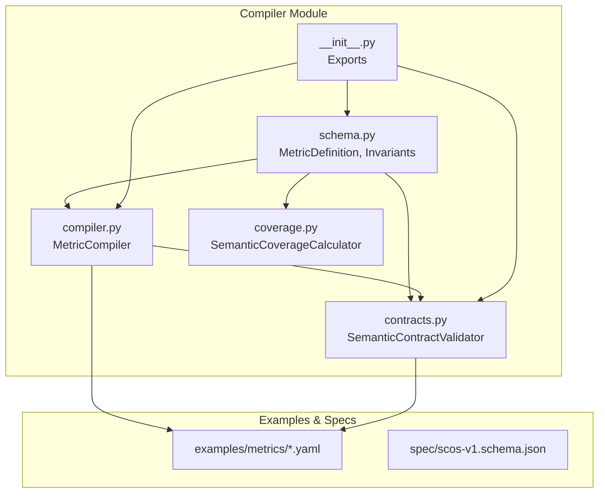
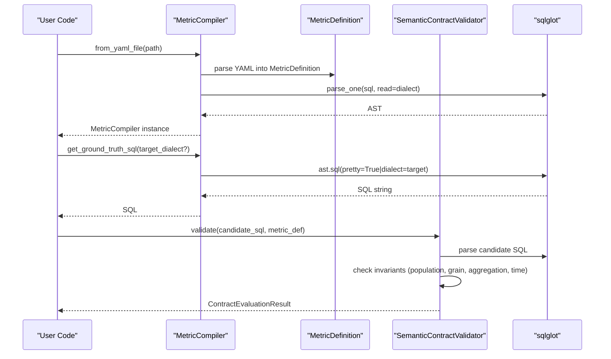
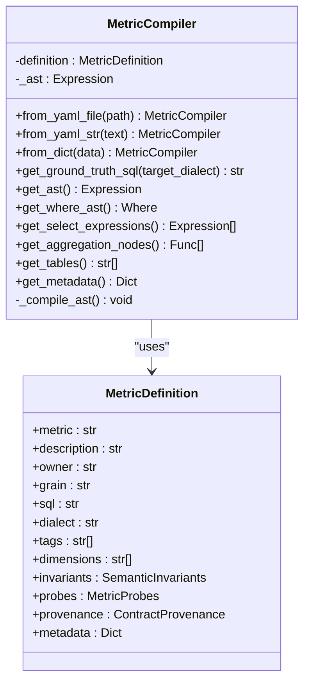
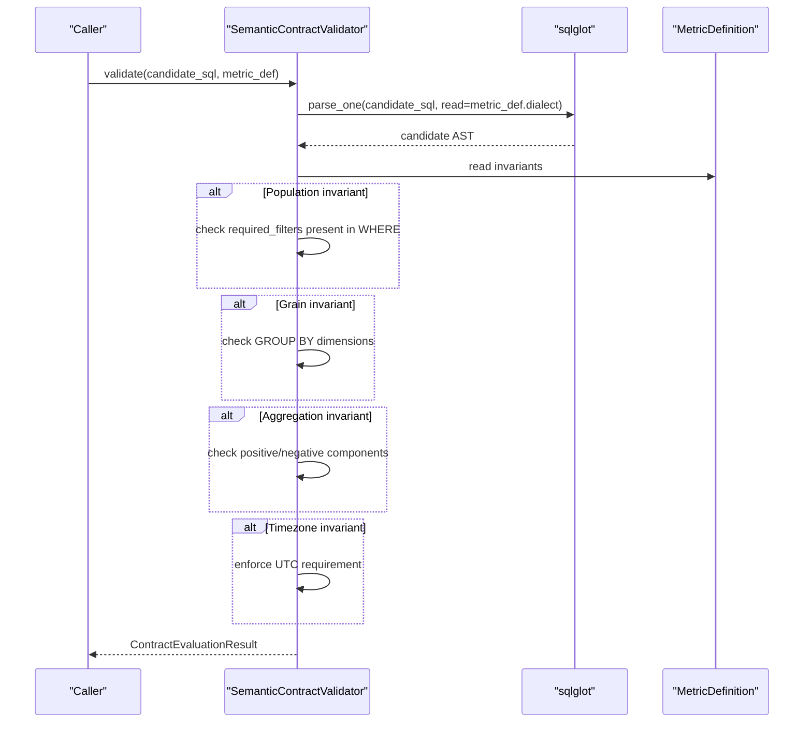
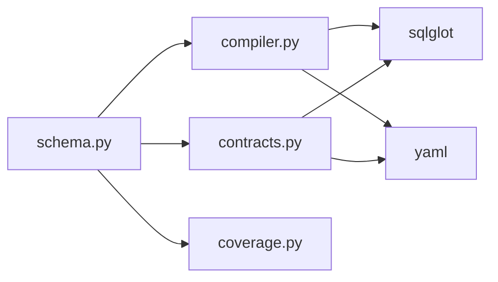

# MetricCompiler

<cite>
**Referenced Files in This Document**
- [compiler.py](file://semantic_reliability/compiler/compiler.py)
- [contracts.py](file://semantic_reliability/compiler/contracts.py)
- [schema.py](file://semantic_reliability/compiler/schema.py)
- [coverage.py](file://semantic_reliability/compiler/coverage.py)
- [__init__.py](file://semantic_reliability/compiler/__init__.py)
- [net_revenue.yaml](file://examples/metrics/net_revenue.yaml)
- [monthly_active_users.yaml](file://examples/metrics/monthly_active_users.yaml)
- [contract.yaml](file://benchmark_corpus/dev/net_revenue/contract.yaml)
- [scos-v1.schema.json](file://spec/scos-v1.schema.json)
- [test_compiler.py](file://tests/test_compiler.py)
- [test_contracts.py](file://tests/test_contracts.py)
</cite>

## Table of Contents
1. [Introduction](#introduction)
2. [Project Structure](#project-structure)
3. [Core Components](#core-components)
4. [Architecture Overview](#architecture-overview)
5. [Detailed Component Analysis](#detailed-component-analysis)
6. [Dependency Analysis](#dependency-analysis)
7. [Performance Considerations](#performance-considerations)
8. [Troubleshooting Guide](#troubleshooting-guide)
9. [Conclusion](#conclusion)
10. [Appendices](#appendices)

## Introduction
This document provides comprehensive documentation for the MetricCompiler class and its surrounding compilation pipeline within the SCOS (Semantic Contract Open Standard) system. It explains how business metrics are defined declaratively in YAML, compiled into AST representations, validated against semantic contracts, and transpiled to multiple SQL dialects. It also covers error handling, performance considerations, and batch processing capabilities for large-scale contract compilation.

## Project Structure
The compiler module is organized around three primary concerns:
- Schema definitions for metric contracts and semantic invariants
- Compilation from YAML to AST and multi-dialect SQL generation
- Validation of candidate SQL against declared semantic invariants
- Coverage reporting for semantic completeness

**Diagram sources**
- [schema.py:83-97](file://semantic_reliability/compiler/schema.py#L83-L97)
- [compiler.py:10-72](file://semantic_reliability/compiler/compiler.py#L10-L72)
- [contracts.py:26-135](file://semantic_reliability/compiler/contracts.py#L26-L135)
- [coverage.py:25-128](file://semantic_reliability/compiler/coverage.py#L25-L128)
- [__init__.py:1-30](file://semantic_reliability/compiler/__init__.py#L1-L30)

**Section sources**
- [schema.py:83-97](file://semantic_reliability/compiler/schema.py#L83-L97)
- [compiler.py:10-72](file://semantic_reliability/compiler/compiler.py#L10-L72)
- [contracts.py:26-135](file://semantic_reliability/compiler/contracts.py#L26-L135)
- [coverage.py:25-128](file://semantic_reliability/compiler/coverage.py#L25-L128)
- [__init__.py:1-30](file://semantic_reliability/compiler/__init__.py#L1-L30)

## Core Components
- MetricCompiler: Parses YAML or dict into a MetricDefinition, compiles canonical SQL into an AST, supports transpilation to target dialects, and exposes AST inspection utilities.
- SemanticContractValidator: Validates candidate SQL against declared invariants (population filters, grain dimensions, aggregation components, timezone).
- MetricDefinition and related models: Pydantic schemas defining metric metadata, invariants, probes, and provenance.
- SemanticCoverageCalculator: Evaluates semantic coverage by comparing declared invariants against domain-specific requirements.

Key responsibilities:
- Load contracts from YAML files or strings
- Compile SQL into AST using sqlglot with dialect awareness
- Generate formatted SQL for ground truth or transpile to other dialects
- Validate candidate SQL against semantic contracts
- Provide AST introspection for WHERE clauses, SELECT expressions, aggregations, and tables
- Report semantic coverage scores

**Section sources**
- [compiler.py:10-72](file://semantic_reliability/compiler/compiler.py#L10-L72)
- [contracts.py:26-135](file://semantic_reliability/compiler/contracts.py#L26-L135)
- [schema.py:5-97](file://semantic_reliability/compiler/schema.py#L5-L97)
- [coverage.py:25-128](file://semantic_reliability/compiler/coverage.py#L25-L128)

## Architecture Overview
The compilation pipeline transforms SCOS YAML definitions into executable SQL across multiple dialects while enforcing semantic contracts.

**Diagram sources**
- [compiler.py:18-47](file://semantic_reliability/compiler/compiler.py#L18-L47)
- [contracts.py:29-135](file://semantic_reliability/compiler/contracts.py#L29-L135)
- [schema.py:83-97](file://semantic_reliability/compiler/schema.py#L83-L97)

## Detailed Component Analysis

### MetricCompiler
Responsibilities:
- Initialize from YAML file, YAML string, or dictionary
- Parse canonical SQL into AST using sqlglot with the specified dialect
- Expose methods to retrieve formatted SQL, optionally transpiled to another dialect
- Provide AST introspection: WHERE node, SELECT expressions, aggregation functions, table names
- Return non-SQL metadata via model dump

Compilation workflow:
- Construct MetricDefinition from YAML/dict
- Parse SQL into AST; raise ValueError on parse failures
- Store AST internally for reuse
- Transpile to target dialect when requested

AST inspection capabilities:
- get_where_ast: locate WHERE clause node
- get_select_expressions: list all SELECT expressions
- get_aggregation_nodes: find aggregate functions like SUM, AVG, COUNT
- get_tables: extract referenced table names

Transpilation:
- get_ground_truth_sql returns pretty-printed SQL; if target_dialect differs from definition.dialect, uses sqlglot to convert AST to target dialect

Error handling:
- Invalid SQL raises ValueError with context about the metric name and parse error

Usage examples:
- From YAML file: load and compile a net_revenue metric
- From YAML string: inline definition for tests
- From dict: programmatic construction without YAML
- Transpile to Snowflake: generate Snowflake-compatible SQL from Postgres definition

**Section sources**
- [compiler.py:10-72](file://semantic_reliability/compiler/compiler.py#L10-L72)
- [test_compiler.py:23-59](file://tests/test_compiler.py#L23-L59)

#### Class Diagram

**Diagram sources**
- [compiler.py:10-72](file://semantic_reliability/compiler/compiler.py#L10-L72)
- [schema.py:83-97](file://semantic_reliability/compiler/schema.py#L83-L97)

### SemanticContractValidator
Responsibilities:
- Validate candidate SQL against declared semantic invariants
- Check population filters (required and forbidden)
- Enforce reporting grain (GROUP BY dimensions)
- Verify aggregation components (positive/negative)
- Enforce timezone constraints (e.g., UTC)

Validation flow:
- Parse candidate SQL into AST using the metric’s dialect
- Normalize required filters and dimensions for comparison
- Detect missing required filters, missing grouping dimensions, absent positive/negative components, and non-UTC timezone usage
- Produce a result indicating pass/fail, violations, and count of rules checked

Output:
- ContractEvaluationResult includes passed flag, metric name, list of violations, and evaluated_invariants_count

Violation details include category, rule, severity, details, and remediation guidance

**Section sources**
- [contracts.py:26-135](file://semantic_reliability/compiler/contracts.py#L26-L135)
- [test_contracts.py:36-92](file://tests/test_contracts.py#L36-L92)

#### Sequence Diagram

**Diagram sources**
- [contracts.py:29-135](file://semantic_reliability/compiler/contracts.py#L29-L135)
- [schema.py:31-37](file://semantic_reliability/compiler/schema.py#L31-L37)

### MetricDefinition and Invariants
MetricDefinition captures:
- Unique metric identifier, description, owner, grain, canonical SQL, and dialect
- Tags, allowed dimensions, semantic invariants, runtime probes, provenance, and arbitrary metadata

SemanticInvariants include:
- PopulationInvariant: required and forbidden filters
- GrainInvariant: required dimensions and over-aggregation policy
- AggregationInvariant: expected top-level function and positive/negative components
- UnitInvariant: currency and scale
- TimeInvariant: timezone and period grain

These models provide strict validation and serialization for SCOS contracts.

**Section sources**
- [schema.py:5-97](file://semantic_reliability/compiler/schema.py#L5-L97)

### SemanticCoverageCalculator
Purpose:
- Evaluate whether a metric’s declared invariants satisfy domain-specific semantic requirements
- Compute coverage score based on intersection of declared and required dimensions

Domain rules:
- Predefined requirements per metric category (e.g., financial revenue, engagement funnel, cohort retention)
- Map invariants to conceptual dimensions like population, grain, aggregation, currency, time

Output:
- ContractCoverageReport with metric name, category, declared and missing dimensions, and coverage percentage

**Section sources**
- [coverage.py:25-128](file://semantic_reliability/compiler/coverage.py#L25-L128)

## Dependency Analysis
Internal dependencies:
- MetricCompiler depends on MetricDefinition and sqlglot for parsing and transpilation
- SemanticContractValidator depends on MetricDefinition and sqlglot for AST-based validation
- Coverage calculator depends on MetricDefinition and SemanticInvariants for domain mapping

External dependencies:
- sqlglot for SQL parsing, transformation, and dialect conversion
- Pydantic for schema validation and serialization
- yaml for loading SCOS contracts

Coupling and cohesion:
- High cohesion within each module (schema, compiler, contracts, coverage)
- Low coupling through well-defined interfaces (MetricDefinition, AST nodes)
- No circular dependencies observed between modules

Potential integration points:
- DB adapters can consume generated SQL for execution
- Benchmark harness can use validators to ensure correctness across transformations

**Diagram sources**
- [schema.py:83-97](file://semantic_reliability/compiler/schema.py#L83-L97)
- [compiler.py:1-72](file://semantic_reliability/compiler/compiler.py#L1-L72)
- [contracts.py:1-135](file://semantic_reliability/compiler/contracts.py#L1-L135)
- [coverage.py:1-128](file://semantic_reliability/compiler/coverage.py#L1-L128)

**Section sources**
- [compiler.py:1-72](file://semantic_reliability/compiler/compiler.py#L1-L72)
- [contracts.py:1-135](file://semantic_reliability/compiler/contracts.py#L1-L135)
- [schema.py:1-97](file://semantic_reliability/compiler/schema.py#L1-L97)
- [coverage.py:1-128](file://semantic_reliability/compiler/coverage.py#L1-L128)

## Performance Considerations
- AST reuse: MetricCompiler stores the parsed AST internally to avoid repeated parsing when generating multiple outputs or performing inspections.
- Dialect-aware parsing: Using the correct dialect reduces parse errors and improves transpilation accuracy.
- Batch processing: For large-scale compilation:
  - Load multiple YAML files and construct MetricCompiler instances in batches
  - Reuse MetricDefinition objects where possible
  - Use parallel processing for independent validations and transpilations
  - Cache AST results per metric to minimize redundant work
- Validation efficiency:
  - Normalize strings carefully to reduce overhead during comparisons
  - Limit deep AST traversals to necessary nodes (WHERE, GROUP BY, aggregates)
- Memory management:
  - Avoid holding large SQL strings unnecessarily; prefer AST operations
  - Release references after batch runs to free memory

[No sources needed since this section provides general guidance]

## Troubleshooting Guide
Common issues and resolutions:
- Invalid SQL in YAML:
  - Symptom: ValueError raised during compilation
  - Cause: sqlglot cannot parse the provided SQL
  - Resolution: Fix syntax errors in the canonical SQL field
- Missing required filters:
  - Symptom: Contract validation fails with population invariant violation
  - Cause: Candidate SQL lacks required WHERE predicates
  - Resolution: Add missing filters as indicated in remediation
- Missing grouping dimensions:
  - Symptom: Reporting grain invariant violation
  - Cause: GROUP BY does not include required dimensions
  - Resolution: Include required dimensions in GROUP BY
- Missing aggregation components:
  - Symptom: Aggregation invariant violation
  - Cause: Positive or negative components omitted in calculation
  - Resolution: Ensure both positive and negative components are included
- Non-UTC timezone usage:
  - Symptom: Timezone invariant violation
  - Cause: Query uses non-UTC timezone conversions
  - Resolution: Convert timestamps to UTC consistently

Diagnostic tips:
- Use get_where_ast to inspect WHERE clauses
- Use get_aggregation_nodes to verify aggregate functions
- Use get_tables to confirm referenced tables
- Use get_ground_truth_sql to compare generated SQL across dialects

**Section sources**
- [test_compiler.py:51-59](file://tests/test_compiler.py#L51-L59)
- [test_contracts.py:45-92](file://tests/test_contracts.py#L45-L92)
- [contracts.py:44-127](file://semantic_reliability/compiler/contracts.py#L44-L127)

## Conclusion
The MetricCompiler and associated modules provide a robust pipeline for compiling SCOS contracts into executable SQL, validating semantic integrity, and supporting multi-dialect transpilation. By leveraging AST-based analysis and declarative invariants, the system ensures that business metrics remain consistent, auditable, and portable across database engines. The inclusion of coverage reporting enables governance and completeness checks at scale.

[No sources needed since this section summarizes without analyzing specific files]

## Appendices

### Example Contract Workflows
- Net Revenue:
  - Define metric in YAML with canonical SQL and invariants
  - Compile to AST and generate ground truth SQL
  - Validate candidate SQL against population, grain, and aggregation invariants
  - Transpile to Snowflake or other dialects as needed

- Monthly Active Users:
  - Define metric with event filtering and deduplication
  - Validate grouping by organization and temporal windows
  - Ensure timezone alignment and proper aggregation

**Section sources**
- [net_revenue.yaml:1-22](file://examples/metrics/net_revenue.yaml#L1-L22)
- [monthly_active_users.yaml:1-21](file://examples/metrics/monthly_active_users.yaml#L1-L21)
- [contract.yaml:1-19](file://benchmark_corpus/dev/net_revenue/contract.yaml#L1-L19)

### Custom Dialect Configuration
- Set dialect in MetricDefinition to match canonical SQL source
- Use get_ground_truth_sql with target_dialect to transpile to different engines
- Ensure sqlglot supports the target dialect for accurate conversion

**Section sources**
- [schema.py:83-97](file://semantic_reliability/compiler/schema.py#L83-L97)
- [compiler.py:43-47](file://semantic_reliability/compiler/compiler.py#L43-L47)
- [scos-v1.schema.json:46-51](file://spec/scos-v1.schema.json#L46-L51)

### Relationship Between MetricDefinition, AST Transformations, and Generated SQL
- MetricDefinition holds canonical SQL and metadata
- MetricCompiler parses SQL into AST using sqlglot
- AST transformations enable extraction of WHERE clauses, aggregations, and tables
- Generated SQL can be pretty-printed or transpiled to target dialects
- Validators use AST to enforce semantic invariants on candidate SQL

**Section sources**
- [compiler.py:10-72](file://semantic_reliability/compiler/compiler.py#L10-L72)
- [contracts.py:26-135](file://semantic_reliability/compiler/contracts.py#L26-L135)
- [schema.py:83-97](file://semantic_reliability/compiler/schema.py#L83-L97)