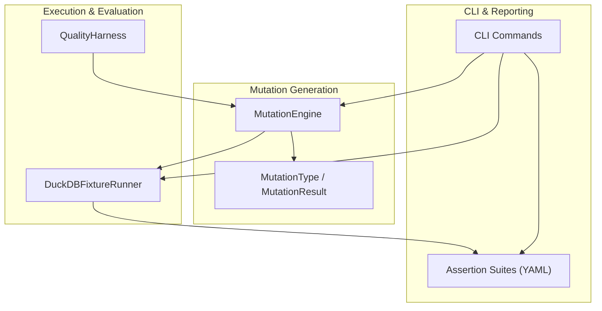
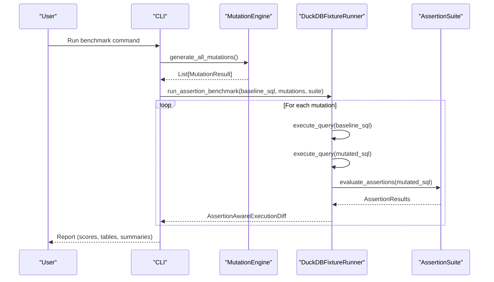
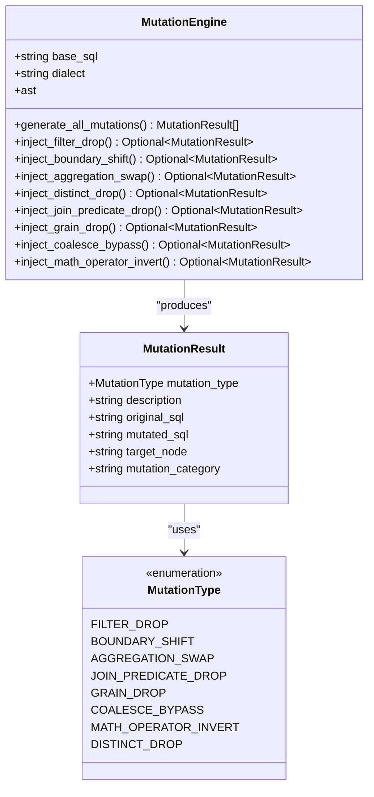
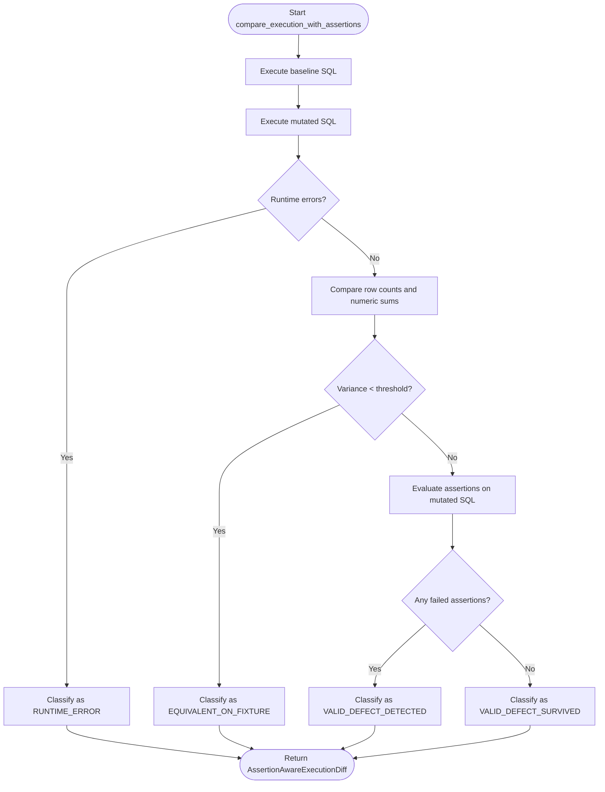
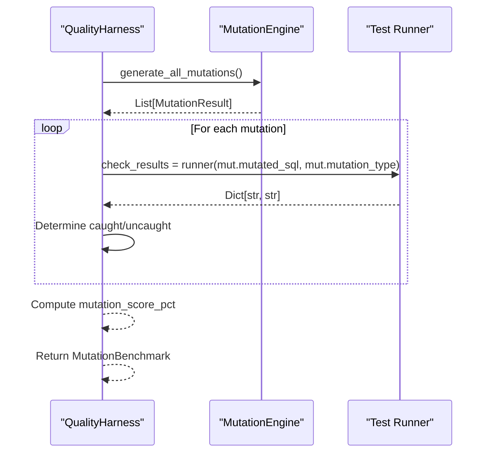
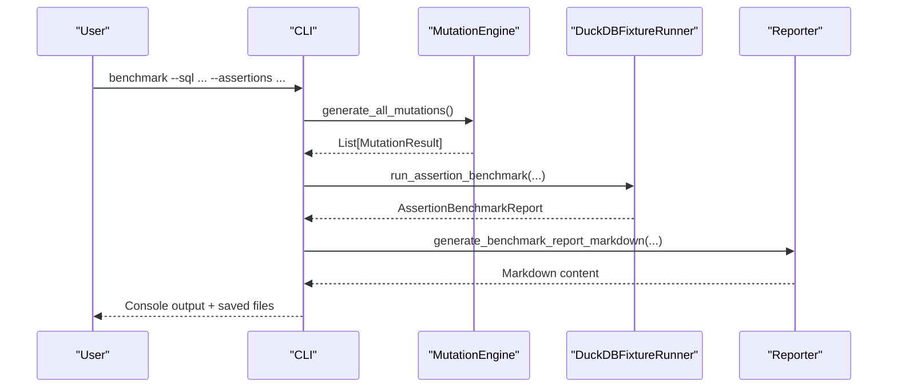
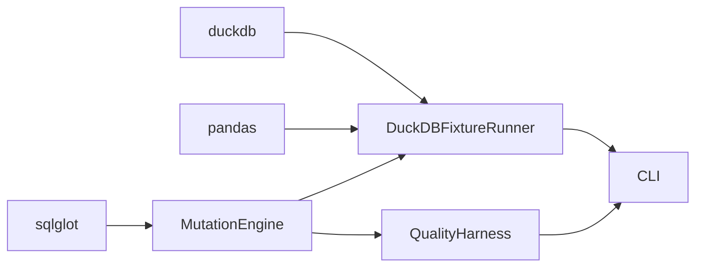
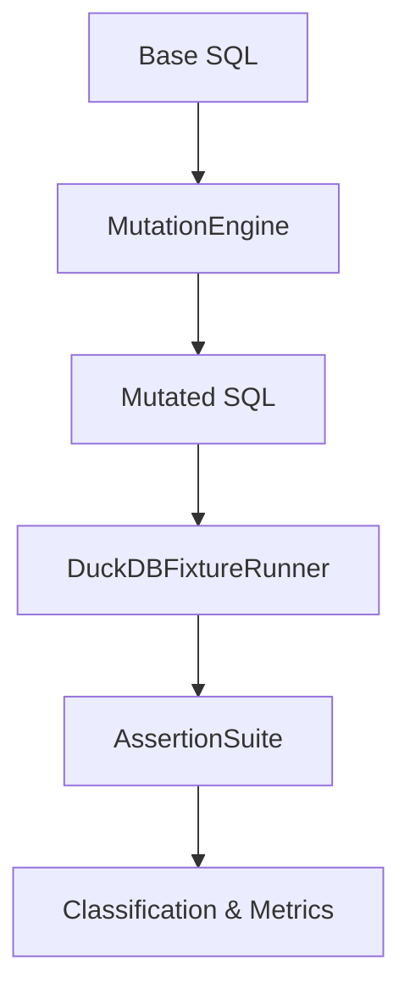

# MutationEngine

<cite>
**Referenced Files in This Document**
- [engine.py](file://semantic_reliability/testing/mutations/engine.py)
- [mutators.py](file://semantic_reliability/testing/mutations/mutators.py)
- [duckdb_runner.py](file://semantic_reliability/harness/duckdb_runner.py)
- [quality_harness.py](file://semantic_reliability/harness/quality_harness.py)
- [cli.py](file://semantic_reliability/cli.py)
- [test_mutations.py](file://tests/test_mutations.py)
- [ci.yml](file://.github/workflows/ci.yml)
- [semantic_assertions.yaml](file://examples/assertions/semantic_assertions.yaml)
</cite>

## Table of Contents
1. Introduction
2. Project Structure
3. Core Components
4. Architecture Overview
5. Detailed Component Analysis
6. Dependency Analysis
7. Performance Considerations
8. Troubleshooting Guide
9. Conclusion
10. Appendices

## Introduction
This document provides comprehensive documentation for the MutationEngine class, which generates and evaluates SQL mutations to test assertion effectiveness. It explains mutation operator types, generation strategies, evaluation workflows, configuration of mutators and rules, interpretation of results, practical usage examples, CI/CD integration, performance considerations, and optimization strategies for large-scale mutation testing.

## Project Structure
The MutationEngine is part of a broader testing harness that:
- Generates AST-level SQL mutations using sqlglot
- Executes baseline and mutated queries against fixture data
- Evaluates assertions to classify outcomes
- Produces reports and integrates with CI/CD

**Diagram sources**
- [engine.py:8-52](file://semantic_reliability/testing/mutations/engine.py#L8-L52)
- [mutators.py:8-27](file://semantic_reliability/testing/mutations/mutators.py#L8-L27)
- [duckdb_runner.py:56-255](file://semantic_reliability/harness/duckdb_runner.py#L56-L255)
- [quality_harness.py:34-113](file://semantic_reliability/harness/quality_harness.py#L34-L113)
- [cli.py:175-283](file://semantic_reliability/cli.py#L175-L283)
- [semantic_assertions.yaml:1-25](file://examples/assertions/semantic_assertions.yaml#L1-L25)

**Section sources**
- [engine.py:8-52](file://semantic_reliability/testing/mutations/engine.py#L8-L52)
- [mutators.py:8-27](file://semantic_reliability/testing/mutations/mutators.py#L8-L27)
- [duckdb_runner.py:56-255](file://semantic_reliability/harness/duckdb_runner.py#L56-L255)
- [quality_harness.py:34-113](file://semantic_reliability/harness/quality_harness.py#L34-L113)
- [cli.py:175-283](file://semantic_reliability/cli.py#L175-L283)
- [semantic_assertions.yaml:1-25](file://examples/assertions/semantic_assertions.yaml#L1-L25)

## Core Components
- MutationEngine: Parses base SQL into an AST and injects targeted mutations across categories such as filtering, boundaries, aggregations, joins, grain, null safety, and arithmetic logic.
- MutationType and MutationResult: Enumerates supported mutation operators and encapsulates metadata about each generated mutation.
- DuckDBFixtureRunner: Executes baseline and mutated SQL on fixture data, compares outputs, runs assertions, and classifies outcomes.
- QualityHarness: Orchestrates mutation generation and evaluation to compute a mutation catch score and detailed evaluations.
- CLI: Provides commands to generate mutations, run benchmarks, compare suites, and export reports.

Key responsibilities:
- MutationEngine: AST manipulation and mutation injection
- DuckDBFixtureRunner: Execution, comparison, assertion evaluation, classification
- QualityHarness: Benchmarking and scoring
- CLI: User-facing orchestration and reporting

**Section sources**
- [engine.py:8-269](file://semantic_reliability/testing/mutations/engine.py#L8-L269)
- [mutators.py:8-27](file://semantic_reliability/testing/mutations/mutators.py#L8-L27)
- [duckdb_runner.py:56-255](file://semantic_reliability/harness/duckdb_runner.py#L56-L255)
- [quality_harness.py:34-113](file://semantic_reliability/harness/quality_harness.py#L34-L113)
- [cli.py:175-283](file://semantic_reliability/cli.py#L175-L283)

## Architecture Overview
The system follows a clear pipeline:
1. Parse base SQL into an AST
2. Generate mutations via targeted injectors
3. Execute baseline and mutated queries on fixtures
4. Evaluate assertions and classify outcomes
5. Aggregate results into benchmark reports

**Diagram sources**
- [cli.py:175-283](file://semantic_reliability/cli.py#L175-L283)
- [engine.py:16-52](file://semantic_reliability/testing/mutations/engine.py#L16-L52)
- [duckdb_runner.py:116-255](file://semantic_reliability/harness/duckdb_runner.py#L116-L255)

## Detailed Component Analysis

### MutationEngine
- Purpose: Inject precise AST-level logical mutations into SQL models to simulate common defects and assess assertion robustness.
- Key methods:
  - generate_all_mutations: Orchestrates all injectors and collects valid MutationResult instances
  - inject_filter_drop: Drops AND conjunct or entire WHERE clause
  - inject_boundary_shift: Mutates inequality/equality operators
  - inject_aggregation_swap: Swaps SUM/AVG/COUNT
  - inject_distinct_drop: Removes DISTINCT from COUNT(DISTINCT)
  - inject_join_predicate_drop: Strips ON predicate from JOIN
  - inject_grain_drop: Removes a column from GROUP BY
  - inject_coalesce_bypass: Replaces COALESCE with first argument
  - inject_math_operator_invert: Inverts + to - or - to +

**Diagram sources**
- [engine.py:8-269](file://semantic_reliability/testing/mutations/engine.py#L8-L269)
- [mutators.py:8-27](file://semantic_reliability/testing/mutations/mutators.py#L8-L27)

**Section sources**
- [engine.py:8-269](file://semantic_reliability/testing/mutations/engine.py#L8-L269)
- [mutators.py:8-27](file://semantic_reliability/testing/mutations/mutators.py#L8-L27)

### DuckDBFixtureRunner
- Purpose: Execute baseline and mutated SQL on in-memory fixtures, compare outputs, evaluate assertions, and classify outcomes.
- Key behaviors:
  - compare_execution_with_assertions: Runs both queries, computes row deltas and variance, evaluates assertions, and classifies as equivalent, detected, survived, or runtime error
  - run_assertion_benchmark: Iterates mutations, aggregates counts, and produces a report including effective catch score

**Diagram sources**
- [duckdb_runner.py:116-206](file://semantic_reliability/harness/duckdb_runner.py#L116-L206)

**Section sources**
- [duckdb_runner.py:56-255](file://semantic_reliability/harness/duckdb_runner.py#L56-L255)

### QualityHarness
- Purpose: Simulate or execute test suites against mutated SQL to calculate a mutation catch score and provide per-mutation evaluations.
- Key behaviors:
  - simulate_standard_checks: Demonstrates typical data quality checks and their blind spots
  - evaluate_model: Generates mutations, runs checks (simulated or custom), and returns a MutationBenchmark

**Diagram sources**
- [quality_harness.py:34-113](file://semantic_reliability/harness/quality_harness.py#L34-L113)
- [engine.py:16-52](file://semantic_reliability/testing/mutations/engine.py#L16-L52)

**Section sources**
- [quality_harness.py:34-113](file://semantic_reliability/harness/quality_harness.py#L34-L113)

### CLI Integration
- The CLI exposes commands to:
  - Generate mutations and write manifests
  - Run benchmarks comparing standard vs semantic assertion suites
  - Output markdown reports and JSON artifacts
  - Integrate with CI/CD pipelines

**Diagram sources**
- [cli.py:175-283](file://semantic_reliability/cli.py#L175-L283)
- [engine.py:16-52](file://semantic_reliability/testing/mutations/engine.py#L16-L52)
- [duckdb_runner.py:208-255](file://semantic_reliability/harness/duckdb_runner.py#L208-L255)

**Section sources**
- [cli.py:175-283](file://semantic_reliability/cli.py#L175-L283)

## Dependency Analysis
- MutationEngine depends on sqlglot for AST parsing and manipulation
- DuckDBFixtureRunner depends on duckdb and pandas for execution and comparison
- QualityHarness depends on MutationEngine and optional custom test runners
- CLI orchestrates components and persists reports

**Diagram sources**
- [engine.py:1-15](file://semantic_reliability/testing/mutations/engine.py#L1-L15)
- [duckdb_runner.py:1-12](file://semantic_reliability/harness/duckdb_runner.py#L1-L12)
- [quality_harness.py:1-6](file://semantic_reliability/harness/quality_harness.py#L1-L6)
- [cli.py:175-283](file://semantic_reliability/cli.py#L175-L283)

**Section sources**
- [engine.py:1-15](file://semantic_reliability/testing/mutations/engine.py#L1-L15)
- [duckdb_runner.py:1-12](file://semantic_reliability/harness/duckdb_runner.py#L1-L12)
- [quality_harness.py:1-6](file://semantic_reliability/harness/quality_harness.py#L1-L6)
- [cli.py:175-283](file://semantic_reliability/cli.py#L175-L283)

## Performance Considerations
- AST copying: Each injector creates a copy of the AST; ensure minimal duplication by reusing copies where possible
- Fixture size: Large fixtures increase execution time; consider sampling or partitioning datasets
- Concurrency: Parallelize mutation execution across CPU cores when feasible
- Early exits: Skip equivalent mutations quickly based on variance thresholds
- Dialect-specific optimizations: Use appropriate SQL dialect to reduce parsing overhead
- Assertion suite size: Minimize assertion count to reduce evaluation cost per mutation

[No sources needed since this section provides general guidance]

## Troubleshooting Guide
Common issues and resolutions:
- Runtime errors during mutation execution:
  - Inspect mutation descriptions and target nodes
  - Validate SQL syntax after mutation
  - Check fixture schema compatibility
- Equivalent mutations with zero variance:
  - Review mutation category and target node
  - Adjust fixture data to expose subtle differences
- Surviving defects:
  - Add semantic assertions targeting population filters, grain, and metric bounds
  - Increase tolerance sensitivity or add value range checks

**Section sources**
- [duckdb_runner.py:116-206](file://semantic_reliability/harness/duckdb_runner.py#L116-L206)
- [test_mutations.py:17-64](file://tests/test_mutations.py#L17-L64)

## Conclusion
The MutationEngine enables systematic, AST-level mutation testing to validate assertion effectiveness across critical SQL logic areas. Combined with execution-based evaluation and assertion suites, it provides actionable insights into test coverage gaps and helps improve reliability through targeted improvements. Integrating these workflows into CI/CD ensures continuous validation of data quality and semantic correctness.

[No sources needed since this section summarizes without analyzing specific files]

## Appendices

### Mutation Operator Types and Categories
- FILTER_DROP: Population Filtering
- BOUNDARY_SHIFT: Boundary Conditions
- AGGREGATION_SWAP: Mathematical Calculation
- DISTINCT_DROP: Mathematical Calculation
- JOIN_PREDICATE_DROP: Join Cardinality
- GRAIN_DROP: Reporting Grain
- COALESCE_BYPASS: Null Safety
- MATH_OPERATOR_INVERT: Arithmetic Logic

**Section sources**
- [mutators.py:8-17](file://semantic_reliability/testing/mutations/mutators.py#L8-L17)
- [engine.py:54-269](file://semantic_reliability/testing/mutations/engine.py#L54-L269)

### Configuration and Customization
- Configure assertion suites via YAML files to enforce population criteria, grain, and metric bounds
- Customize mutation rules by extending MutationEngine with additional injectors
- Provide custom test runners to QualityHarness for domain-specific checks

**Section sources**
- [semantic_assertions.yaml:1-25](file://examples/assertions/semantic_assertions.yaml#L1-L25)
- [quality_harness.py:66-113](file://semantic_reliability/harness/quality_harness.py#L66-L113)

### Practical Examples
- Running mutation tests:
  - Use CLI benchmark command to generate mutations and evaluate against assertion suites
  - Export reports and JSON artifacts for analysis
- Analyzing mutation coverage:
  - Review effective catch scores and surviving defect summaries
  - Focus on categories with high survival rates
- Integrating with CI/CD:
  - Add steps to install dependencies, run tests, and execute benchmark-corpus
  - Upload artifacts for traceability

**Section sources**
- [cli.py:175-283](file://semantic_reliability/cli.py#L175-L283)
- [ci.yml:1-51](file://.github/workflows/ci.yml#L1-L51)

### Relationship Between Base Queries, Mutations, and Assertions
- Base SQL defines the intended semantics
- Mutations introduce realistic defects to challenge assertions
- Assertions validate population, grain, and metric values to detect defects
- Outcomes are classified to measure assertion effectiveness

**Diagram sources**
- [engine.py:16-52](file://semantic_reliability/testing/mutations/engine.py#L16-L52)
- [duckdb_runner.py:116-255](file://semantic_reliability/harness/duckdb_runner.py#L116-L255)
- [semantic_assertions.yaml:1-25](file://examples/assertions/semantic_assertions.yaml#L1-L25)