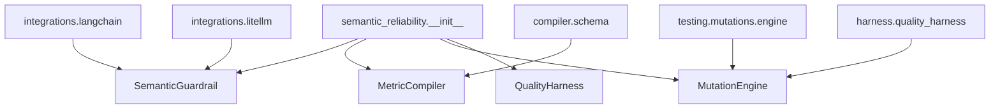
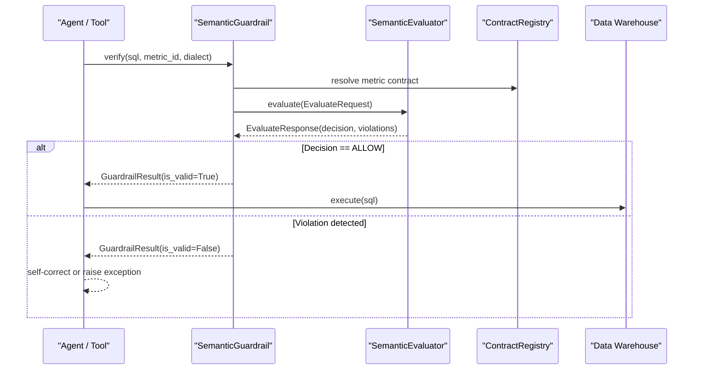
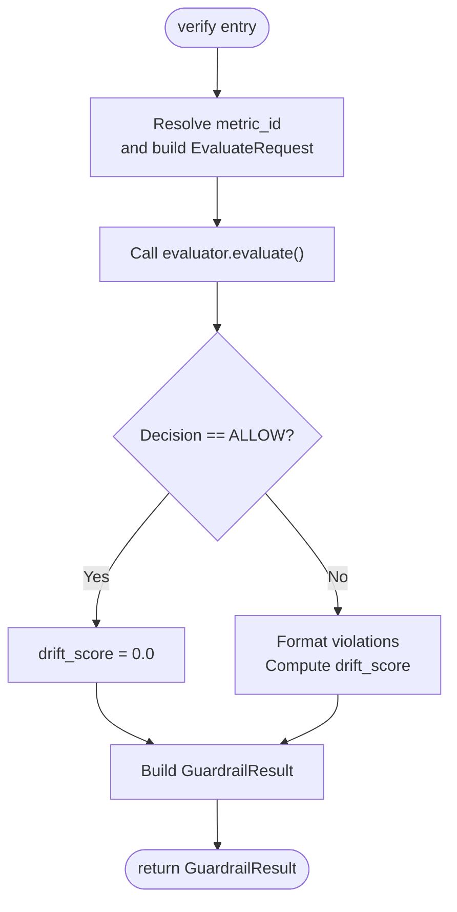
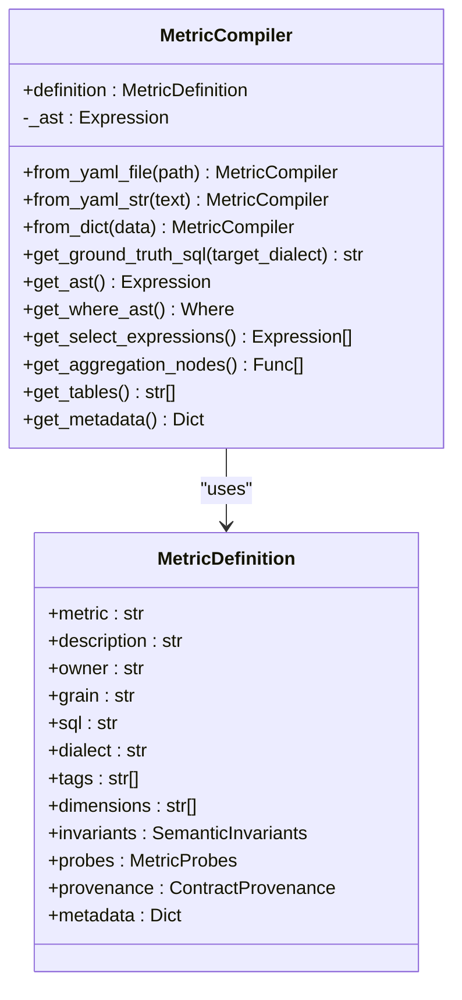
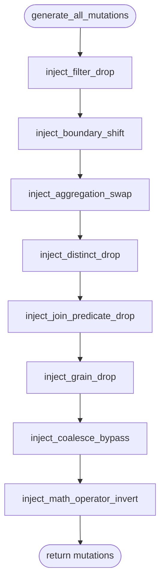
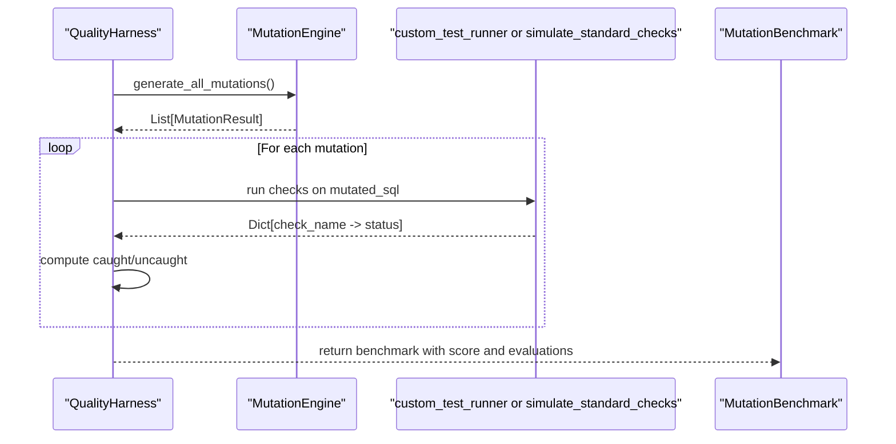
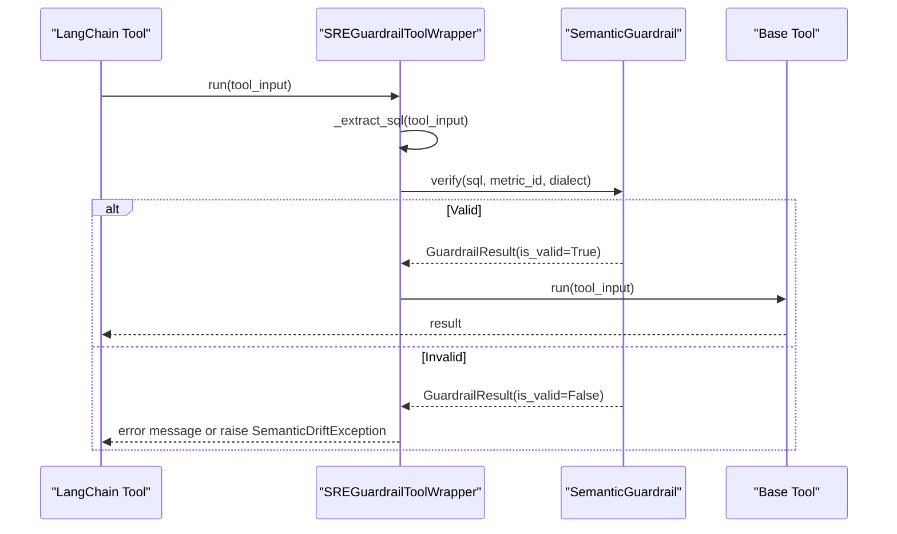
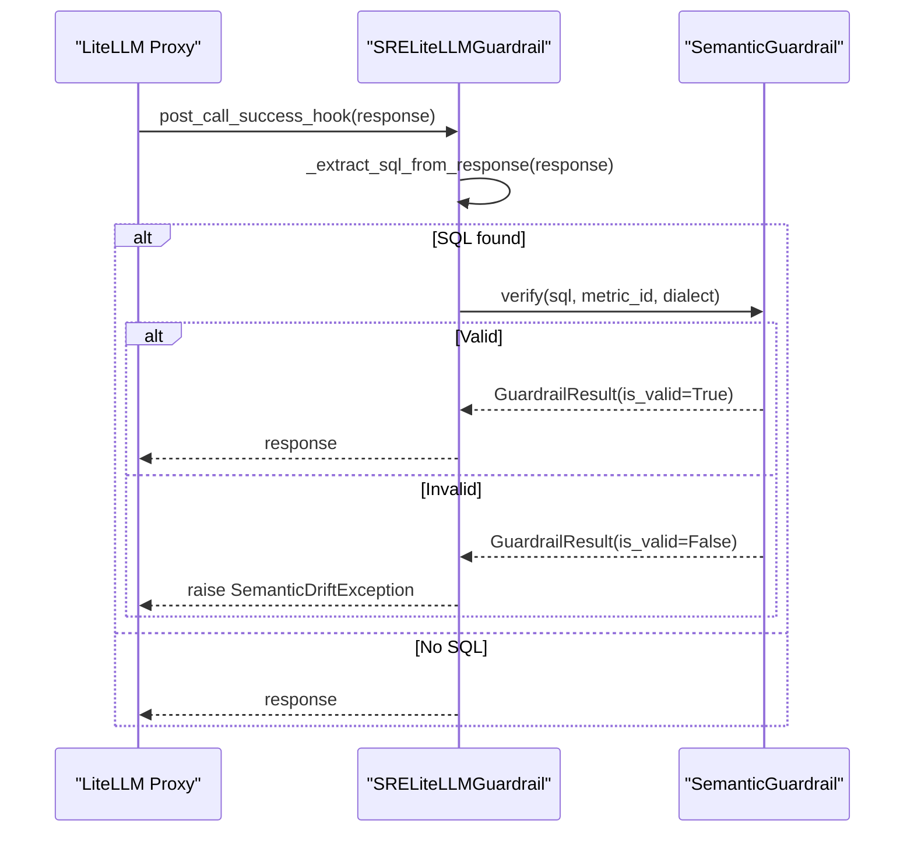
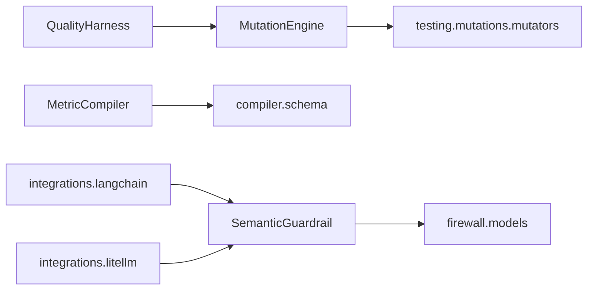

# Python SDK

<cite>
**Referenced Files in This Document**
- [__init__.py](file://semantic_reliability/__init__.py)
- [guardrail.py](file://semantic_reliability/guardrail.py)
- [compiler.py](file://semantic_reliability/compiler/compiler.py)
- [schema.py](file://semantic_reliability/compiler/schema.py)
- [engine.py](file://semantic_reliability/testing/mutations/engine.py)
- [mutators.py](file://semantic_reliability/testing/mutations/mutators.py)
- [quality_harness.py](file://semantic_reliability/harness/quality_harness.py)
- [langchain.py](file://semantic_reliability/integrations/langchain.py)
- [litellm.py](file://semantic_reliability/integrations/litellm.py)
- [models.py](file://semantic_reliability/firewall/models.py)
- [README.md](file://README.md)
</cite>

## Table of Contents
1. [Introduction](#introduction)
2. [Project Structure](#project-structure)
3. [Core Components](#core-components)
4. [Architecture Overview](#architecture-overview)
5. [Detailed Component Analysis](#detailed-component-analysis)
6. [Dependency Analysis](#dependency-analysis)
7. [Performance Considerations](#performance-considerations)
8. [Troubleshooting Guide](#troubleshooting-guide)
9. [Conclusion](#conclusion)
10. [Appendices](#appendices)

## Introduction
This document provides comprehensive documentation for the Python SDK that powers semantic reliability for text-to-SQL systems. It covers:
- SemanticGuardrail: loading contracts, verifying SQL, and handling validation results
- MetricCompiler: compiling and transpiling canonical metric definitions to ASTs and target dialects
- MutationEngine: generating and evaluating SQL mutations for robustness testing
- QualityHarness: end-to-end testing workflows to measure test suite resilience against semantic mutations
- Integrations: LangChain and LiteLLM adapters for production guardrailing

The SDK enforces deterministic semantic correctness by comparing generated SQL against business metric contracts (SCOS), preventing silent metric corruption before execution.

## Project Structure
At a high level, the SDK exposes a curated public API surface via the package root and organizes functionality into focused modules:
- Guardrails and evaluation models live under the core module
- Contract compilation and schema definitions are in the compiler module
- Mutation generation and evaluation are in the testing module
- End-to-end quality harnessing is in the harness module
- Framework integrations are in the integrations module

**Diagram sources**
- [__init__.py:5-19](file://semantic_reliability/__init__.py#L5-L19)
- [langchain.py:12-149](file://semantic_reliability/integrations/langchain.py#L12-L149)
- [litellm.py:13-95](file://semantic_reliability/integrations/litellm.py#L13-L95)
- [compiler.py:10-72](file://semantic_reliability/compiler/compiler.py#L10-L72)
- [schema.py:83-98](file://semantic_reliability/compiler/schema.py#L83-L98)
- [engine.py:8-269](file://semantic_reliability/testing/mutations/engine.py#L8-L269)
- [quality_harness.py:34-113](file://semantic_reliability/harness/quality_harness.py#L34-L113)

**Section sources**
- [__init__.py:1-21](file://semantic_reliability/__init__.py#L1-L21)
- [README.md:49-89](file://README.md#L49-L89)

## Core Components
This section summarizes the primary classes and their responsibilities:
- SemanticGuardrail: loads SCOS contracts, verifies candidate SQL, returns structured results or raises exceptions on drift
- MetricCompiler: parses and validates canonical metric SQL, extracts AST nodes, and transpiles across dialects
- MutationEngine: applies AST-level logical mutations to simulate common SQL errors and produce mutated queries
- QualityHarness: orchestrates mutation generation and evaluation to compute a mutation score for test suites
- Integration wrappers: provide seamless guardrailing within LangChain tools and LiteLLM callbacks

Key data structures include:
- MetricDefinition: declarative contract with SQL, invariants, probes, and metadata
- GuardrailResult: validation outcome including drift score, violations, decision, and risk
- EvaluateRequest/EvaluateResponse: internal request/response models used by the evaluator
- MutationType/MutationResult: enumeration and result model for mutation operations

**Section sources**
- [guardrail.py:13-153](file://semantic_reliability/guardrail.py#L13-L153)
- [compiler.py:10-72](file://semantic_reliability/compiler/compiler.py#L10-L72)
- [schema.py:5-98](file://semantic_reliability/compiler/schema.py#L5-L98)
- [engine.py:8-269](file://semantic_reliability/testing/mutations/engine.py#L8-L269)
- [mutators.py:8-27](file://semantic_reliability/testing/mutations/mutators.py#L8-L27)
- [quality_harness.py:8-113](file://semantic_reliability/harness/quality_harness.py#L8-L113)
- [models.py:6-51](file://semantic_reliability/firewall/models.py#L6-L51)

## Architecture Overview
The system follows a deterministic, AST-based approach to enforce semantic contracts:
- Contracts define canonical SQL and invariants
- The guardrail evaluates candidate SQL against these invariants
- If valid, execution proceeds; otherwise, feedback or blocking occurs
- Integrations wrap agent tool calls and LLM responses to intercept and validate SQL

**Diagram sources**
- [guardrail.py:91-153](file://semantic_reliability/guardrail.py#L91-L153)
- [models.py:20-51](file://semantic_reliability/firewall/models.py#L20-L51)

## Detailed Component Analysis

### SemanticGuardrail
Purpose:
- Load SCOS contracts from YAML files, directories, dictionaries, or MetricDefinition objects
- Verify candidate SQL against metric invariants
- Return structured validation results or raise exceptions when drift is detected

Public API:
- __init__(contract_source): accepts str, Path, MetricDefinition, or dict; registers contracts and sets primary metric
- from_contract(contract_path): class method to initialize from a contract file or directory
- from_definition(definition): class method to initialize directly from a MetricDefinition
- verify(sql, metric_id=None, dialect="duckdb", agent_id="agent-guardrail"): returns GuardrailResult with is_valid, drift_score, violations, decision, risk, metric_id, sql, remediation_hint, raw_response
- intercept(sql, metric_id=None, dialect="duckdb", agent_id="agent-guardrail"): returns unmodified SQL if valid; raises SemanticDriftException on violation

Return values and exceptions:
- verify returns GuardrailResult; boolean coercion uses is_valid
- intercept raises SemanticDriftException containing result details and remediation hints

Usage patterns:
- Load a contract and verify generated SQL prior to execution
- Use intercept to block invalid SQL at runtime in agent pipelines

**Diagram sources**
- [guardrail.py:91-136](file://semantic_reliability/guardrail.py#L91-L136)

**Section sources**
- [guardrail.py:13-153](file://semantic_reliability/guardrail.py#L13-L153)
- [models.py:6-51](file://semantic_reliability/firewall/models.py#L6-L51)

### MetricCompiler
Purpose:
- Compile canonical metric definitions into AST representations
- Validate SQL parsing and extract structural components
- Transpile ground-truth SQL to target dialects

Public API:
- __init__(definition): takes a MetricDefinition; compiles AST internally
- from_yaml_file(path): class method to load from YAML file path
- from_yaml_str(text): class method to parse YAML string
- from_dict(data): class method to construct from dictionary
- get_ground_truth_sql(target_dialect=None): returns formatted SQL, optionally transpiled
- get_ast(): returns copy of root AST node
- get_where_ast(): returns WHERE filter AST node if present
- get_select_expressions(): returns list of selected columns/aggregations
- get_aggregation_nodes(): returns aggregation functions found in AST
- get_tables(): returns table names referenced in FROM/JOIN clauses
- get_metadata(): returns non-SQL metadata excluding SQL field

Error handling:
- Parsing failures raise ValueError with context about the metric and error

Usage patterns:
- Load metric contracts and inspect AST structure for analysis
- Transpile canonical SQL to different warehouse dialects for compatibility checks

**Diagram sources**
- [compiler.py:10-72](file://semantic_reliability/compiler/compiler.py#L10-L72)
- [schema.py:83-98](file://semantic_reliability/compiler/schema.py#L83-L98)

**Section sources**
- [compiler.py:10-72](file://semantic_reliability/compiler/compiler.py#L10-L72)
- [schema.py:5-98](file://semantic_reliability/compiler/schema.py#L5-L98)

### MutationEngine
Purpose:
- Inject precise AST-level logical mutations into SQL models to simulate common errors
- Generate multiple mutation types targeting filters, boundaries, aggregations, joins, grain, null safety, and arithmetic

Public API:
- __init__(base_sql, dialect=None): parses base SQL into AST using sqlglot
- generate_all_mutations(): runs all mutation generators and returns a list of MutationResult
- Individual inject_* methods: each targets a specific mutation category and returns a MutationResult or None

Supported mutation categories:
- Population Filtering: FILTER_DROP
- Boundary Conditions: BOUNDARY_SHIFT
- Mathematical Calculation: AGGREGATION_SWAP, DISTINCT_DROP, MATH_OPERATOR_INVERT
- Join Cardinality: JOIN_PREDICATE_DROP
- Reporting Grain: GRAIN_DROP
- Null Safety: COALESCE_BYPASS

Usage patterns:
- Use generate_all_mutations to create a suite of mutated queries for testing
- Feed mutated SQL into QualityHarness to evaluate detection capabilities

**Diagram sources**
- [engine.py:16-52](file://semantic_reliability/testing/mutations/engine.py#L16-L52)

**Section sources**
- [engine.py:8-269](file://semantic_reliability/testing/mutations/engine.py#L8-L269)
- [mutators.py:8-27](file://semantic_reliability/testing/mutations/mutators.py#L8-L27)

### QualityHarness
Purpose:
- Simulate or execute test suites against mutated SQL models to calculate a mutation score
- Provide standard check simulation and custom runner integration

Public API:
- simulate_standard_checks(mutated_sql, mutation_type): returns simulated check results demonstrating typical blind spots
- evaluate_model(base_sql, dialect=None, custom_test_runner=None): runs all mutations and computes MutationBenchmark

Outputs:
- MutationBenchmark includes total_mutations, caught_mutations, uncaught_mutations, mutation_score_pct, and evaluations
- Each evaluation contains mutation details, whether it was caught, catching/failed checks, and blind spot flag

Usage patterns:
- Run evaluate_model to assess how well your existing tests catch semantic mutations
- Provide a custom_test_runner to integrate with dbt-expectations, Monte Carlo, or other observability tools

**Diagram sources**
- [quality_harness.py:66-113](file://semantic_reliability/harness/quality_harness.py#L66-L113)
- [engine.py:16-52](file://semantic_reliability/testing/mutations/engine.py#L16-L52)

**Section sources**
- [quality_harness.py:8-113](file://semantic_reliability/harness/quality_harness.py#L8-L113)

### Integrations

#### LangChain Integration
Purpose:
- Wrap database/SQL tools to intercept and validate generated SQL
- Provide feedback to agents for self-correction or raise exceptions on drift

Public API:
- SREGuardrailToolWrapper(base_tool, contract_path, metric_id=None, dialect="duckdb", raise_on_drift=False)
  - run(tool_input, **kwargs): synchronous wrapper; returns base tool result or error message
  - arun(tool_input, **kwargs): asynchronous wrapper; same behavior async
  - __call__(*args, **kwargs): callable interface forwarding to run
- SREGuardrailCallback(contract_path, metric_id=None, dialect="duckdb", block_on_drift=True)
  - on_tool_start(serialized, input_str, **kwargs): intercepts tool start events containing SQL

Behavior:
- Extracts SQL from various input formats
- Verifies SQL via SemanticGuardrail
- On violation: returns diagnostic message or raises SemanticDriftException based on configuration
- On success: forwards to underlying tool’s run/arun/callable interface

**Diagram sources**
- [langchain.py:12-149](file://semantic_reliability/integrations/langchain.py#L12-L149)
- [guardrail.py:91-153](file://semantic_reliability/guardrail.py#L91-L153)

**Section sources**
- [langchain.py:12-149](file://semantic_reliability/integrations/langchain.py#L12-L149)

#### LiteLLM Integration
Purpose:
- Provide a LiteLLM-compatible guardrail hook to validate LLM-generated SQL in proxy callbacks
- Extract SQL from response payloads and enforce policy

Public API:
- SRELiteLLMGuardrail(contract_path, metric_id=None, dialect="duckdb", block_on_violation=True)
  - post_call_success_hook(data, user_api_key_dict, response): synchronous hook executed after completion
  - async_post_call_success_hook(data, user_api_key_dict, response): asynchronous variant

Behavior:
- Extracts SQL from choices/tool_calls or markdown code blocks
- Verifies SQL via SemanticGuardrail
- On violation and block_on_violation=True: raises SemanticDriftException
- Returns original response otherwise

**Diagram sources**
- [litellm.py:13-95](file://semantic_reliability/integrations/litellm.py#L13-L95)
- [guardrail.py:91-153](file://semantic_reliability/guardrail.py#L91-L153)

**Section sources**
- [litellm.py:13-95](file://semantic_reliability/integrations/litellm.py#L13-L95)

## Dependency Analysis
The SDK exhibits clear separation of concerns:
- Guardrail depends on firewall models and evaluator for evaluation logic
- Compiler depends on schema for contract definitions and sqlglot for AST manipulation
- MutationEngine depends on mutators for mutation types and sqlglot for AST traversal
- QualityHarness depends on MutationEngine and optional custom runners
- Integrations depend on SemanticGuardrail to enforce policies at framework boundaries

**Diagram sources**
- [guardrail.py:7-10](file://semantic_reliability/guardrail.py#L7-L10)
- [compiler.py:7-5](file://semantic_reliability/compiler/compiler.py#L7-L5)
- [engine.py:5-3](file://semantic_reliability/testing/mutations/engine.py#L5-L3)
- [quality_harness.py:4-5](file://semantic_reliability/harness/quality_harness.py#L4-L5)
- [langchain.py:7-7](file://semantic_reliability/integrations/langchain.py#L7-L7)
- [litellm.py:8-8](file://semantic_reliability/integrations/litellm.py#L8-L8)

**Section sources**
- [__init__.py:5-19](file://semantic_reliability/__init__.py#L5-L19)
- [guardrail.py:7-10](file://semantic_reliability/guardrail.py#L7-L10)
- [compiler.py:7-5](file://semantic_reliability/compiler/compiler.py#L7-L5)
- [engine.py:5-3](file://semantic_reliability/testing/mutations/engine.py#L5-L3)
- [quality_harness.py:4-5](file://semantic_reliability/harness/quality_harness.py#L4-L5)
- [langchain.py:7-7](file://semantic_reliability/integrations/langchain.py#L7-L7)
- [litellm.py:8-8](file://semantic_reliability/integrations/litellm.py#L8-L8)

## Performance Considerations
- AST parsing and transformation: Both MetricCompiler and MutationEngine rely on sqlglot; large SQL statements may incur parsing overhead. Cache compiled ASTs where possible.
- Evaluation cost: SemanticGuardrail.verify constructs requests and invokes evaluators per query; batch verification is not exposed, so avoid redundant evaluations of identical SQL.
- Mutation generation: generate_all_mutations traverses the AST multiple times; prefer targeted injection methods if only specific mutation categories are needed.
- Integration hooks: LangChain and LiteLLM integrations perform extraction and verification on every tool call or response; ensure contract loading is efficient and reuse instances.
- Dialect transpilation: get_ground_truth_sql with target_dialect triggers transpilation; use sparingly in hot paths.

Best practices:
- Reuse SemanticGuardrail instances across requests
- Preload contracts once at application startup
- Limit dialect changes to development or CI environments
- Profile mutation-heavy workloads and consider selective mutation strategies

[No sources needed since this section provides general guidance]

## Troubleshooting Guide
Common issues and resolutions:
- Contract loading errors:
  - FileNotFoundError when contract path does not exist; verify path and permissions
  - ValueError when no valid SCOS contracts are found in a directory; ensure YAML files conform to schema
- SQL parsing errors:
  - ValueError raised by MetricCompiler when canonical SQL cannot be parsed; check dialect and syntax
- Drift detection:
  - SemanticDriftException raised by intercept or integrations when violations are detected; review violations and remediation hints in GuardrailResult
- Integration extraction failures:
  - LiteLLM guardrail may fail to extract SQL from complex responses; ensure responses contain recognizable SQL patterns or adjust extraction logic

Diagnostic tips:
- Inspect GuardrailResult.raw_response for detailed EvaluateResponse information
- Use MetricCompiler.get_metadata and get_aggregation_nodes to understand expected structures
- Leverage QualityHarness.simulate_standard_checks to identify blind spots in your test suite

**Section sources**
- [guardrail.py:53-78](file://semantic_reliability/guardrail.py#L53-L78)
- [compiler.py:37-41](file://semantic_reliability/compiler/compiler.py#L37-L41)
- [guardrail.py:138-153](file://semantic_reliability/guardrail.py#L138-L153)
- [litellm.py:39-71](file://semantic_reliability/integrations/litellm.py#L39-L71)
- [quality_harness.py:37-64](file://semantic_reliability/harness/quality_harness.py#L37-L64)

## Conclusion
The Python SDK provides a robust, deterministic framework for enforcing semantic correctness in text-to-SQL systems. By combining contract-driven validation, AST-based analysis, and practical integrations, it enables teams to prevent silent metric corruption and improve agent reliability. Use SemanticGuardrail for runtime enforcement, MetricCompiler for contract management, MutationEngine for adversarial testing, and QualityHarness to measure test suite effectiveness. Integrate with LangChain and LiteLLM to embed guardrailing into agent workflows and proxies with minimal friction.

[No sources needed since this section summarizes without analyzing specific files]

## Appendices

### Public API Summary
- SemanticGuardrail:
  - Methods: __init__, from_contract, from_definition, verify, intercept
  - Exceptions: SemanticDriftException
  - Results: GuardrailResult with is_valid, drift_score, violations, decision, risk, metric_id, sql, remediation_hint, raw_response
- MetricCompiler:
  - Methods: __init__, from_yaml_file, from_yaml_str, from_dict, get_ground_truth_sql, get_ast, get_where_ast, get_select_expressions, get_aggregation_nodes, get_tables, get_metadata
  - Exceptions: ValueError on parse failure
- MutationEngine:
  - Methods: __init__, generate_all_mutations, inject_* methods
  - Outputs: List[MutationResult]
- QualityHarness:
  - Methods: simulate_standard_checks, evaluate_model
  - Outputs: MutationBenchmark with evaluations
- Integrations:
  - LangChain: SREGuardrailToolWrapper, SREGuardrailCallback
  - LiteLLM: SRELiteLLMGuardrail

**Section sources**
- [__init__.py:5-19](file://semantic_reliability/__init__.py#L5-L19)
- [guardrail.py:13-153](file://semantic_reliability/guardrail.py#L13-L153)
- [compiler.py:10-72](file://semantic_reliability/compiler/compiler.py#L10-L72)
- [engine.py:8-269](file://semantic_reliability/testing/mutations/engine.py#L8-L269)
- [quality_harness.py:8-113](file://semantic_reliability/harness/quality_harness.py#L8-L113)
- [langchain.py:12-149](file://semantic_reliability/integrations/langchain.py#L12-L149)
- [litellm.py:13-95](file://semantic_reliability/integrations/litellm.py#L13-L95)