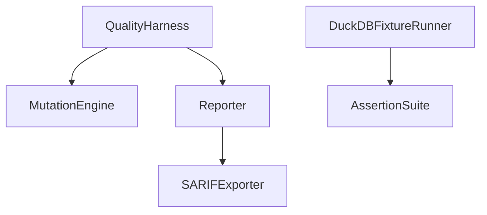
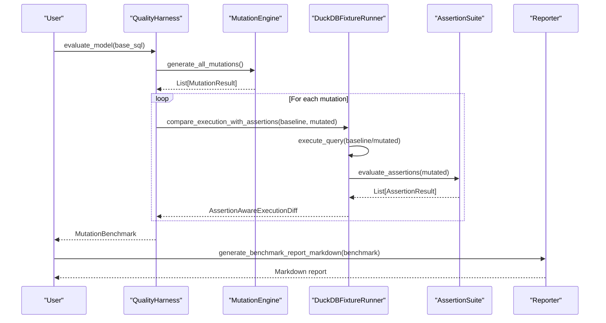
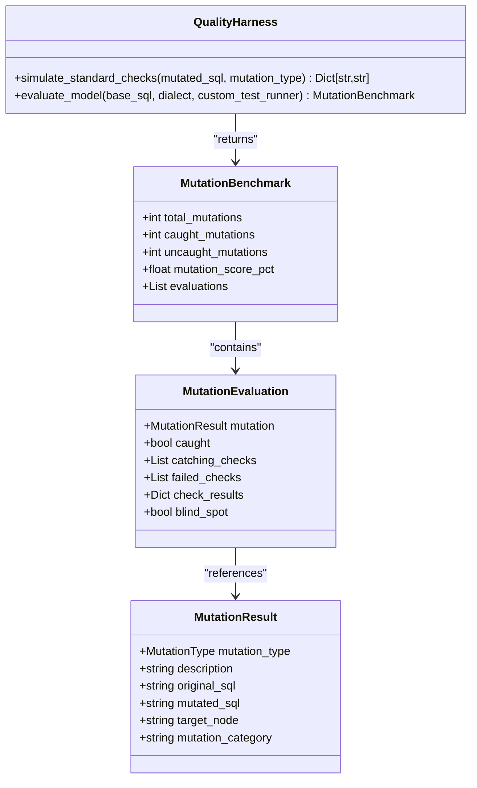
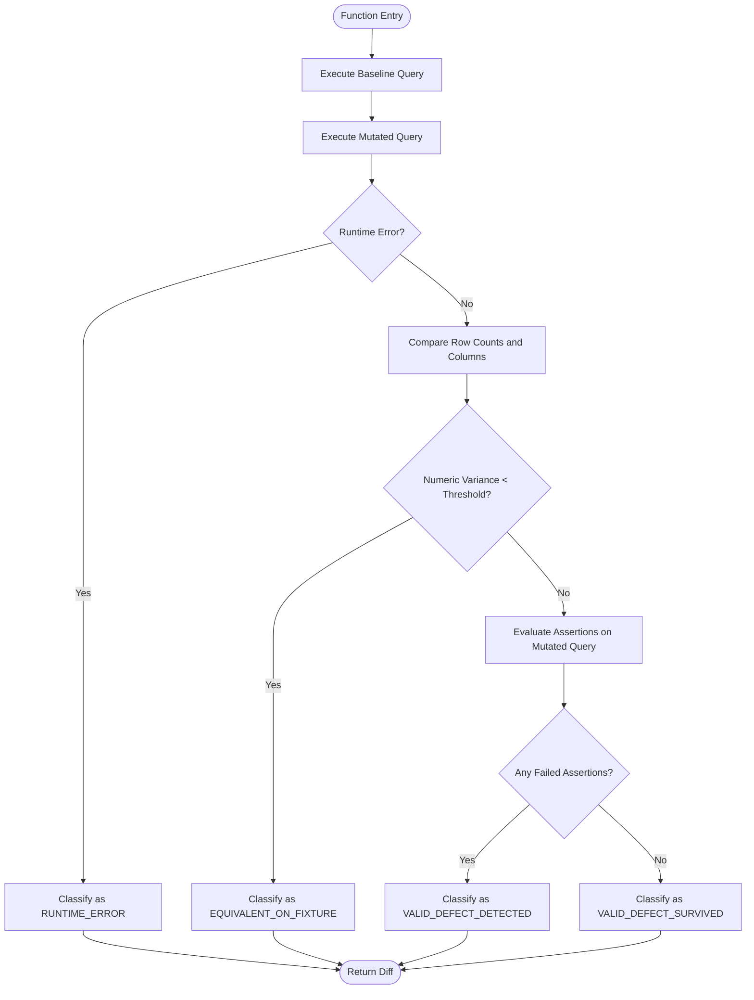
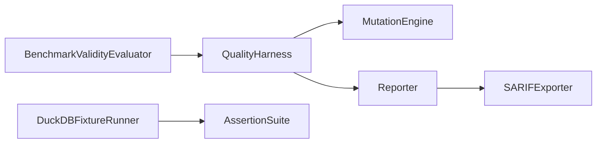

# QualityHarness

<cite>
**Referenced Files in This Document**
- [quality_harness.py](file://semantic_reliability/harness/quality_harness.py)
- [duckdb_runner.py](file://semantic_reliability/harness/duckdb_runner.py)
- [reporter.py](file://semantic_reliability/harness/reporter.py)
- [sarif_exporter.py](file://semantic_reliability/harness/sarif_exporter.py)
- [engine.py](file://semantic_reliability/testing/mutations/engine.py)
- [mutators.py](file://semantic_reliability/testing/mutations/mutators.py)
- [base.py](file://semantic_reliability/assertions/base.py)
- [registry.py](file://semantic_reliability/assertions/registry.py)
- [validity.py](file://semantic_reliability/harness/validity.py)
- [test_quality_harness.py](file://tests/test_quality_harness.py)
</cite>

## Table of Contents
1. [Introduction](#introduction)
2. [Project Structure](#project-structure)
3. [Core Components](#core-components)
4. [Architecture Overview](#architecture-overview)
5. [Detailed Component Analysis](#detailed-component-analysis)
6. [Dependency Analysis](#dependency-analysis)
7. [Performance Considerations](#performance-considerations)
8. [Troubleshooting Guide](#troubleshooting-guide)
9. [Conclusion](#conclusion)
10. [Appendices](#appendices)

## Introduction
This document provides comprehensive documentation for the QualityHarness class and its ecosystem to support multi-layered quality assessments, mutation benchmarking, and reporting. It explains how to:
- Run quality assessments against SQL models using AST-level mutations
- Execute benchmark suites with fixture-backed execution via DuckDB
- Generate reports (Markdown and SARIF) for CI/CD and external monitoring
- Configure test environments and optimize performance
- Interpret metrics such as mutation score, effective catch rate, and validity confidence

The system integrates a MutationEngine that injects realistic SQL logic changes, a DuckDBFixtureRunner that executes baseline vs mutated queries in an isolated in-memory database, and reporters that produce human-readable and machine-consumable outputs.

## Project Structure
At a high level, the harness layer orchestrates:
- Mutation generation over SQL ASTs
- Execution and comparison under fixtures
- Assertion evaluation for structural and semantic checks
- Reporting and export to standard formats

**Diagram sources**
- [quality_harness.py:34-112](file://semantic_reliability/harness/quality_harness.py#L34-L112)
- [engine.py:8-52](file://semantic_reliability/testing/mutations/engine.py#L8-L52)
- [duckdb_runner.py:56-255](file://semantic_reliability/harness/duckdb_runner.py#L56-L255)
- [registry.py:22-160](file://semantic_reliability/assertions/registry.py#L22-L160)
- [reporter.py:8-129](file://semantic_reliability/harness/reporter.py#L8-L129)
- [sarif_exporter.py:9-100](file://semantic_reliability/harness/sarif_exporter.py#L9-L100)

**Section sources**
- [quality_harness.py:34-112](file://semantic_reliability/harness/quality_harness.py#L34-L112)
- [duckdb_runner.py:56-255](file://semantic_reliability/harness/duckdb_runner.py#L56-L255)
- [registry.py:22-160](file://semantic_reliability/assertions/registry.py#L22-L160)
- [reporter.py:8-129](file://semantic_reliability/harness/reporter.py#L8-L129)
- [sarif_exporter.py:9-100](file://semantic_reliability/harness/sarif_exporter.py#L9-L100)

## Core Components
- QualityHarness: Orchestrates mutation-based evaluation and optional custom test runner integration; computes a MutationBenchmark including total, caught, uncaught, and percentage score.
- MutationEngine: Generates AST-level mutations across categories like filter drops, boundary shifts, aggregation swaps, join predicate drops, grain drops, coalesce bypasses, math operator inversions, and distinct drops.
- DuckDBFixtureRunner: Executes baseline and mutated SQL in an isolated in-memory DuckDB instance, compares results, evaluates assertion suites, and classifies outcomes into equivalence, runtime error, detected defect, or surviving defect.
- Reporter: Produces Markdown reports for PR comments and benchmark summaries.
- SARIFExporter: Converts drift findings into SARIF JSON for GitHub Code Scanning and other tools.
- AssertionSuite: Loads and runs structural and semantic assertions from YAML or built-in defaults.

Key data models include:
- MutationResult and MutationType for mutation metadata
- AssertionAwareExecutionDiff and AssertionBenchmarkReport for detailed per-mutation evaluation and aggregated report
- ModelBenchmarkValidation and BenchmarkValidityEvaluator for scientific validity and confidence scoring

**Section sources**
- [quality_harness.py:8-112](file://semantic_reliability/harness/quality_harness.py#L8-L112)
- [engine.py:8-269](file://semantic_reliability/testing/mutations/engine.py#L8-L269)
- [mutators.py:8-27](file://semantic_reliability/testing/mutations/mutators.py#L8-L27)
- [duckdb_runner.py:14-54](file://semantic_reliability/harness/duckdb_runner.py#L14-L54)
- [registry.py:22-160](file://semantic_reliability/assertions/registry.py#L22-L160)
- [validity.py:8-127](file://semantic_reliability/harness/validity.py#L8-L127)

## Architecture Overview
The end-to-end workflow combines multiple validation layers:
1. Mutation Generation: The engine parses base SQL into an AST and applies targeted mutations.
2. Fixture Execution: The DuckDB runner loads fixtures (CSV or DataFrames) into an in-memory database and executes both baseline and mutated queries.
3. Assertion Evaluation: An AssertionSuite validates structural and semantic properties on the mutated output.
4. Classification & Aggregation: Each mutation is classified (equivalent, runtime error, detected, survived), then aggregated into benchmark reports.
5. Reporting: Markdown and SARIF outputs are generated for human consumption and tool integrations.

**Diagram sources**
- [quality_harness.py:66-112](file://semantic_reliability/harness/quality_harness.py#L66-L112)
- [engine.py:16-52](file://semantic_reliability/testing/mutations/engine.py#L16-L52)
- [duckdb_runner.py:116-255](file://semantic_reliability/harness/duckdb_runner.py#L116-L255)
- [registry.py:106-160](file://semantic_reliability/assertions/registry.py#L106-L160)
- [reporter.py:87-129](file://semantic_reliability/harness/reporter.py#L87-L129)

## Detailed Component Analysis

### QualityHarness
Responsibilities:
- Simulate standard checks or delegate to a custom test runner
- Evaluate model robustness by running all mutations and computing a mutation score
- Return structured benchmark results for downstream reporting

Key methods:
- simulate_standard_checks: Demonstrates typical data observability blind spots and which checks might catch specific mutation types
- evaluate_model: Runs the full mutation suite, optionally using a custom test runner, and aggregates results into a MutationBenchmark

Usage example reference:
- See tests invoking evaluate_model and asserting benchmark fields

**Section sources**
- [quality_harness.py:34-112](file://semantic_reliability/harness/quality_harness.py#L34-L112)
- [test_quality_harness.py:25-43](file://tests/test_quality_harness.py#L25-L43)

#### Class Diagram

**Diagram sources**
- [quality_harness.py:8-32](file://semantic_reliability/harness/quality_harness.py#L8-L32)
- [quality_harness.py:34-112](file://semantic_reliability/harness/quality_harness.py#L34-L112)
- [mutators.py:8-27](file://semantic_reliability/testing/mutations/mutators.py#L8-L27)

### DuckDBFixtureRunner
Responsibilities:
- Manage an in-memory DuckDB connection and load fixtures (CSV or DataFrames)
- Execute baseline and mutated SQL safely, capturing errors
- Compare outputs empirically (row counts, numeric variance) and run assertion suites
- Classify mutations and aggregate into a comprehensive benchmark report

Key methods:
- execute_query: Runs SQL and returns DataFrame plus optional error
- compare_execution_with_assertions: Compares baseline vs mutated, evaluates assertions, classifies outcome
- run_assertion_benchmark: Iterates mutations, collects evaluations, computes effective catch score

Integration points:
- Uses AssertionSuite to validate structural and semantic properties
- Returns AssertionAwareExecutionDiff and AssertionBenchmarkReport for analysis

**Section sources**
- [duckdb_runner.py:56-255](file://semantic_reliability/harness/duckdb_runner.py#L56-L255)
- [registry.py:22-160](file://semantic_reliability/assertions/registry.py#L22-L160)

#### Flowchart: compare_execution_with_assertions

**Diagram sources**
- [duckdb_runner.py:116-206](file://semantic_reliability/harness/duckdb_runner.py#L116-L206)

### Reporter
Responsibilities:
- Generate Markdown for PR comments highlighting semantic drift
- Generate Markdown benchmark reports summarizing mutation scores and evaluations

Key methods:
- generate_pr_comment_markdown: Builds a formatted comment with severity badges and drift details
- generate_benchmark_report_markdown: Summarizes mutation catch rates and lists evaluations

**Section sources**
- [reporter.py:8-129](file://semantic_reliability/harness/reporter.py#L8-L129)

### SARIFExporter
Responsibilities:
- Convert drift findings into SARIF 2.1.0 JSON for GitHub Code Scanning and security tabs
- Export to file for CI artifacts

Key methods:
- from_drifts: Maps drift severities to SARIF levels and builds rules/results
- export_to_file: Writes SARIF JSON to disk

**Section sources**
- [sarif_exporter.py:9-100](file://semantic_reliability/harness/sarif_exporter.py#L9-L100)

### MutationEngine and Mutators
Responsibilities:
- Parse SQL into AST and apply precise mutations targeting common failure modes
- Provide rich metadata about each mutation (type, category, target node, descriptions)

Supported mutation categories:
- Population Filtering: Filter drop
- Boundary Conditions: Boundary shift
- Mathematical Calculation: Aggregation swap, distinct drop, math operator invert
- Join Cardinality: Join predicate drop
- Reporting Grain: Grain drop
- Null Safety: Coalesce bypass

**Section sources**
- [engine.py:8-269](file://semantic_reliability/testing/mutations/engine.py#L8-L269)
- [mutators.py:8-27](file://semantic_reliability/testing/mutations/mutators.py#L8-L27)

### Assertions and Suites
Responsibilities:
- Define and execute structural and semantic assertions against query outputs
- Load suites from YAML or use built-in defaults

Key capabilities:
- Structural: Non-null, unique keys, row count bounds, accepted ranges/values, relationships, singular SQL tests
- Semantic: Required population filters, expected metric values, expected grain

**Section sources**
- [base.py:6-25](file://semantic_reliability/assertions/base.py#L6-L25)
- [registry.py:22-160](file://semantic_reliability/assertions/registry.py#L22-L160)

### Validity and Confidence
Responsibilities:
- Evaluate benchmark scientific validity and confidence based on fixture adequacy and contract coverage thresholds
- Produce a ModelBenchmarkValidation with notes and policy version

Key concepts:
- Confidence levels: HIGH, MEDIUM, LOW
- Validity levels: CONCLUSIVE, QUALIFIED, INCONCLUSIVE
- Incremental gain: Difference between semantic and standard catch percentages

**Section sources**
- [validity.py:8-127](file://semantic_reliability/harness/validity.py#L8-L127)

## Dependency Analysis
High-level dependencies:
- QualityHarness depends on MutationEngine for generating mutations and Reporter for outputs
- DuckDBFixtureRunner depends on AssertionSuite for validation and uses DuckDB for isolation
- Reporter can integrate with SARIFExporter for standardized exports
- Validity evaluator consumes benchmark metrics to assess confidence and validity

**Diagram sources**
- [quality_harness.py:34-112](file://semantic_reliability/harness/quality_harness.py#L34-L112)
- [engine.py:8-52](file://semantic_reliability/testing/mutations/engine.py#L8-L52)
- [duckdb_runner.py:56-255](file://semantic_reliability/harness/duckdb_runner.py#L56-L255)
- [registry.py:22-160](file://semantic_reliability/assertions/registry.py#L22-L160)
- [reporter.py:8-129](file://semantic_reliability/harness/reporter.py#L8-L129)
- [sarif_exporter.py:9-100](file://semantic_reliability/harness/sarif_exporter.py#L9-L100)
- [validity.py:47-127](file://semantic_reliability/harness/validity.py#L47-L127)

**Section sources**
- [quality_harness.py:34-112](file://semantic_reliability/harness/quality_harness.py#L34-L112)
- [duckdb_runner.py:56-255](file://semantic_reliability/harness/duckdb_runner.py#L56-L255)
- [registry.py:22-160](file://semantic_reliability/assertions/registry.py#L22-L160)
- [reporter.py:8-129](file://semantic_reliability/harness/reporter.py#L8-L129)
- [sarif_exporter.py:9-100](file://semantic_reliability/harness/sarif_exporter.py#L9-L100)
- [validity.py:47-127](file://semantic_reliability/harness/validity.py#L47-L127)

## Performance Considerations
- Use in-memory DuckDB for fast, isolated execution without persistent storage overhead
- Prefer lightweight fixtures; CSV loading is efficient but large datasets increase memory usage
- Limit assertion suites to necessary checks to reduce evaluation time
- Reuse connections where appropriate; ensure proper cleanup to avoid resource leaks
- Avoid overly broad assertions; focus on critical structural and semantic checks relevant to the model
- Batch mutations when possible; the engine generates a fixed set per model, so keep base SQL concise

[No sources needed since this section provides general guidance]

## Troubleshooting Guide
Common issues and resolutions:
- Runtime errors during mutation execution:
  - Inspect AssertionAwareExecutionDiff classification; runtime errors indicate invalid SQL or incompatible mutations
  - Validate dialect settings if using non-default SQL dialects
- Equivalent-on-fixture classifications:
  - Fixtures may not exercise the mutated logic; add contrast rows or adjust assertions to detect subtle differences
- Low mutation catch rates:
  - Strengthen assertion suites with semantic checks (population filters, expected values, grain)
  - Review blind spots in simulate_standard_checks and add targeted checks
- Fixture adequacy concerns:
  - Ensure fixtures contain diverse conditions (e.g., multiple statuses, regions) to expose mutations
- Report interpretation:
  - Use Markdown reports to identify uncaught mutations and their categories
  - Export SARIF for integration with code scanning tools to track drift over time

**Section sources**
- [duckdb_runner.py:116-206](file://semantic_reliability/harness/duckdb_runner.py#L116-L206)
- [reporter.py:87-129](file://semantic_reliability/harness/reporter.py#L87-L129)
- [sarif_exporter.py:16-100](file://semantic_reliability/harness/sarif_exporter.py#L16-L100)

## Conclusion
QualityHarness provides a robust framework for evaluating SQL model reliability through mutation-based testing, fixture-backed execution, and layered assertions. By combining AST-level mutations, in-memory execution, and comprehensive reporting, teams can detect semantic drift early, quantify test suite effectiveness, and integrate findings into CI/CD pipelines. The system supports configurable assertion suites, validity scoring, and standard export formats for seamless monitoring and compliance workflows.

[No sources needed since this section summarizes without analyzing specific files]

## Appendices

### Configuration Examples
- Assertion Suite from YAML:
  - Load a suite using the registry’s YAML loader to define structural and semantic checks
- Default Suites:
  - Use built-in structural or semantic suites for quick setup
- Fixtures:
  - Provide CSV paths or pandas DataFrames to DuckDBFixtureRunner for isolated execution

**Section sources**
- [registry.py:33-104](file://semantic_reliability/assertions/registry.py#L33-L104)
- [registry.py:106-160](file://semantic_reliability/assertions/registry.py#L106-L160)
- [duckdb_runner.py:69-100](file://semantic_reliability/harness/duckdb_runner.py#L69-L100)

### Running Automated Test Suites
- Invoke QualityHarness.evaluate_model with base SQL to generate a MutationBenchmark
- Optionally pass a custom test runner to integrate existing test frameworks
- Use Reporter.generate_benchmark_report_markdown to summarize results

**Section sources**
- [quality_harness.py:66-112](file://semantic_reliability/harness/quality_harness.py#L66-L112)
- [reporter.py:87-129](file://semantic_reliability/harness/reporter.py#L87-L129)
- [test_quality_harness.py:25-43](file://tests/test_quality_harness.py#L25-L43)

### Interpreting Quality Metrics
- Mutation Score: Percentage of injected mutations caught by tests; higher indicates stronger robustness
- Effective Catch Score: Ratio of detected defects among executable mutations after excluding equivalent cases
- Validity Confidence: Assesses whether fixture contrast and contract coverage meet thresholds for conclusive results

**Section sources**
- [quality_harness.py:103-112](file://semantic_reliability/harness/quality_harness.py#L103-L112)
- [duckdb_runner.py:240-255](file://semantic_reliability/harness/duckdb_runner.py#L240-L255)
- [validity.py:67-127](file://semantic_reliability/harness/validity.py#L67-L127)