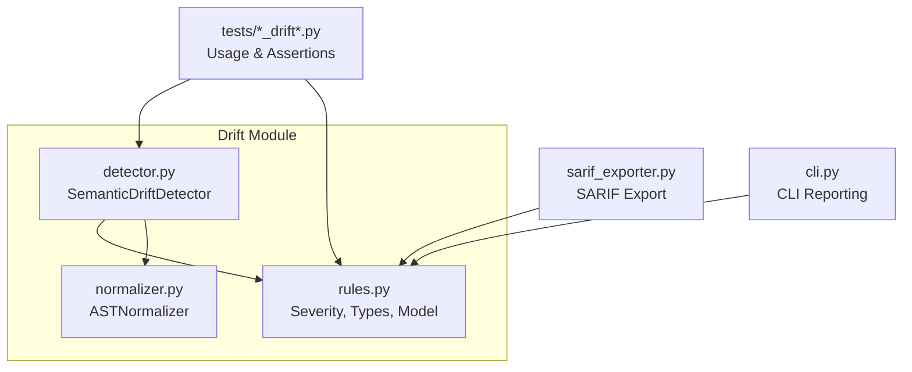
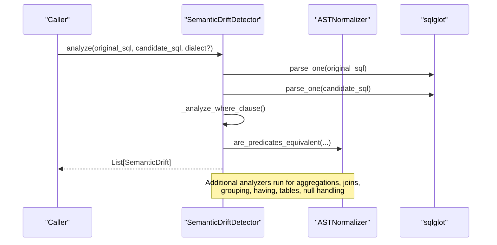
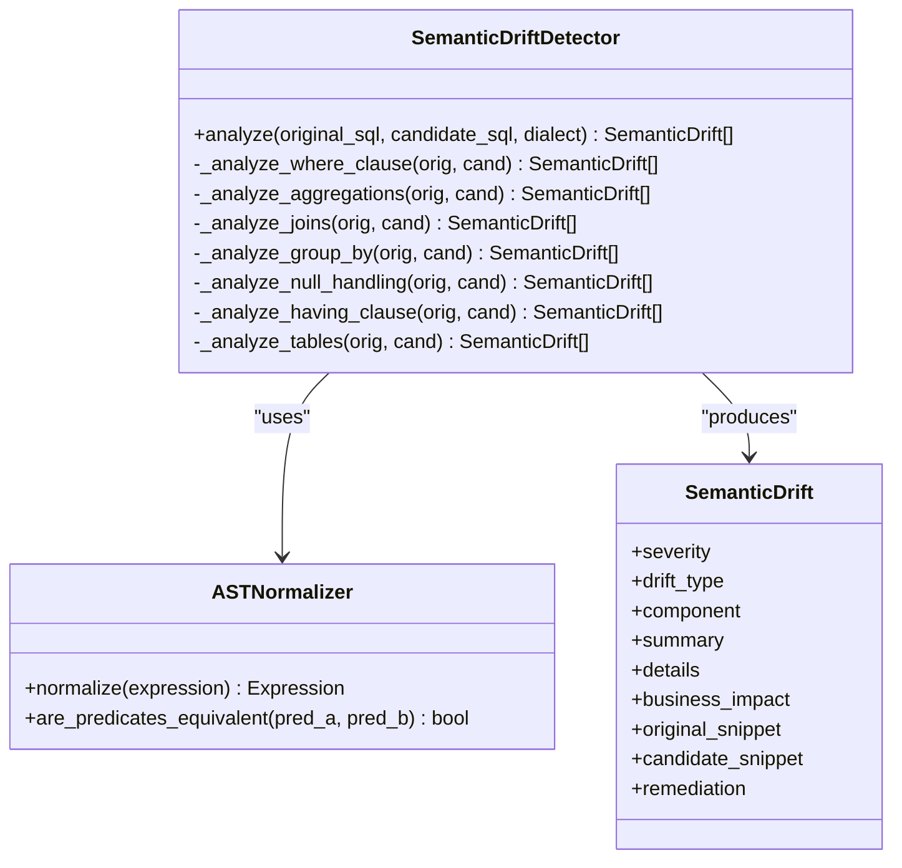
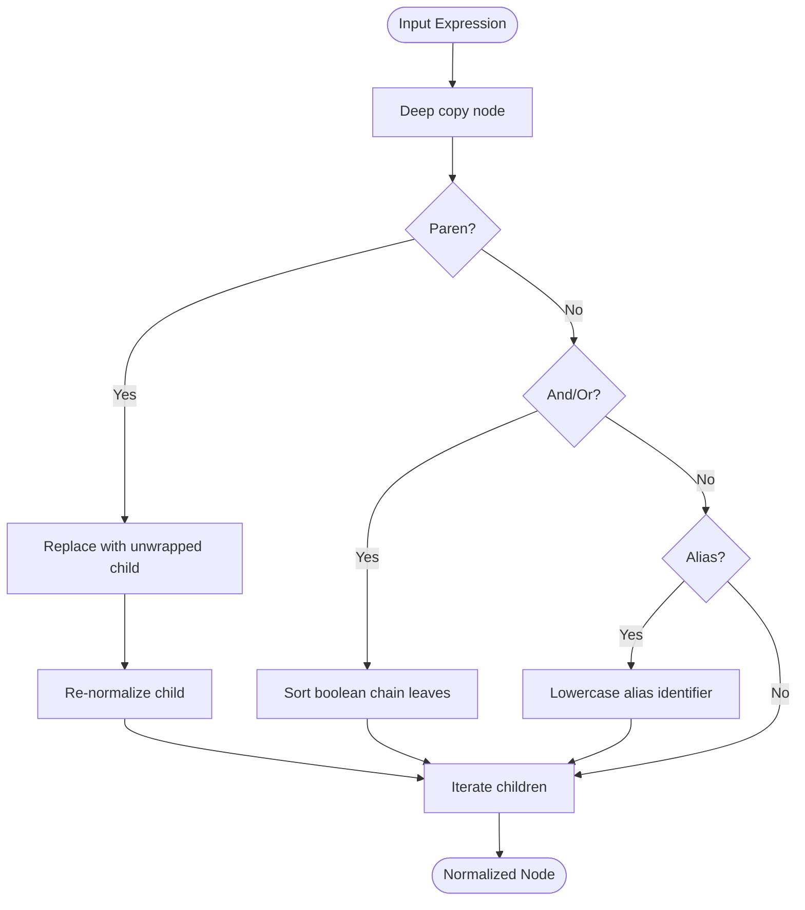
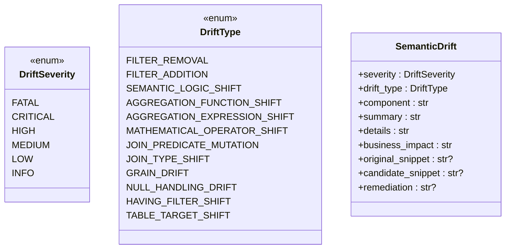
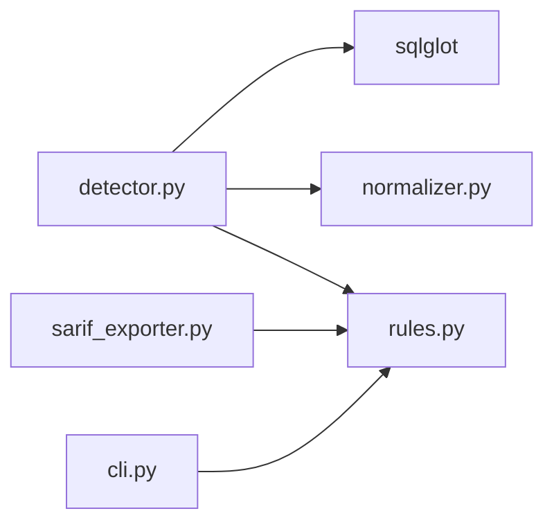

# SemanticDriftDetector

<cite>
**Referenced Files in This Document**
- [detector.py](file://semantic_reliability/testing/drift/detector.py)
- [normalizer.py](file://semantic_reliability/testing/drift/normalizer.py)
- [rules.py](file://semantic_reliability/testing/drift/rules.py)
- [test_drift_detector.py](file://tests/test_drift_detector.py)
- [test_equivalence.py](file://tests/test_equivalence.py)
- [sarif_exporter.py](file://semantic_reliability/harness/sarif_exporter.py)
- [cli.py](file://semantic_reliability/cli.py)
</cite>

## Table of Contents
1. [Introduction](#introduction)
2. [Project Structure](#project-structure)
3. [Core Components](#core-components)
4. [Architecture Overview](#architecture-overview)
5. [Detailed Component Analysis](#detailed-component-analysis)
6. [Dependency Analysis](#dependency-analysis)
7. [Performance Considerations](#performance-considerations)
8. [Troubleshooting Guide](#troubleshooting-guide)
9. [Conclusion](#conclusion)
10. [Appendices](#appendices)

## Introduction
This document provides comprehensive documentation for the SemanticDriftDetector class, which performs AST-based semantic comparison between baseline and candidate SQL queries. It explains drift detection algorithms, severity classification, invariant violation detection, configuration options, and how to interpret results. It also covers practical examples, performance considerations, and strategies for managing drift alerts in production environments.

## Project Structure
The drift detection capability is implemented under a focused module with three core files:
- Rules: Severity levels, drift types, and the SemanticDrift data model
- Normalizer: AST normalization utilities to avoid false positives from cosmetic or commutative differences
- Detector: The SemanticDriftDetector orchestrating analysis across relational algebra components (WHERE, SELECT aggregations, JOINs, GROUP BY, HAVING, tables, null handling)

**Diagram sources**
- [detector.py:1-46](file://semantic_reliability/testing/drift/detector.py#L1-L46)
- [normalizer.py:1-93](file://semantic_reliability/testing/drift/normalizer.py#L1-L93)
- [rules.py:1-41](file://semantic_reliability/testing/drift/rules.py#L1-L41)
- [sarif_exporter.py:1-100](file://semantic_reliability/harness/sarif_exporter.py#L1-L100)
- [cli.py:86-119](file://semantic_reliability/cli.py#L86-L119)
- [test_drift_detector.py:1-84](file://tests/test_drift_detector.py#L1-L84)
- [test_equivalence.py:1-43](file://tests/test_equivalence.py#L1-L43)

**Section sources**
- [detector.py:1-46](file://semantic_reliability/testing/drift/detector.py#L1-L46)
- [rules.py:1-41](file://semantic_reliability/testing/drift/rules.py#L1-L41)
- [normalizer.py:1-93](file://semantic_reliability/testing/drift/normalizer.py#L1-L93)

## Core Components
- SemanticDriftDetector: Entry point for comparing two SQL statements by parsing them into ASTs and running a suite of relational-algebra-aware checks.
- ASTNormalizer: Canonicalizes AST expressions to eliminate false positives from commutative operators, redundant parentheses, and alias casing.
- Rules: Defines DriftSeverity, DriftType, and the SemanticDrift result model used throughout the system.

Key responsibilities:
- Parse SQL into ASTs using sqlglot
- Compare WHERE clauses, aggregation functions and expressions, JOIN topology/predicates, GROUP BY grain, HAVING filters, source tables, and null-handling patterns
- Produce structured SemanticDrift instances with severity, type, component, summary, details, business impact, snippets, and remediation guidance

**Section sources**
- [detector.py:9-46](file://semantic_reliability/testing/drift/detector.py#L9-L46)
- [normalizer.py:6-93](file://semantic_reliability/testing/drift/normalizer.py#L6-L93)
- [rules.py:6-41](file://semantic_reliability/testing/drift/rules.py#L6-L41)

## Architecture Overview
The detector follows a pipeline approach: parse both SQLs, normalize where necessary, then run independent analyzers per relational component. Each analyzer returns zero or more SemanticDrift objects that are aggregated into a final list.

**Diagram sources**
- [detector.py:12-46](file://semantic_reliability/testing/drift/detector.py#L12-L46)
- [normalizer.py:77-93](file://semantic_reliability/testing/drift/normalizer.py#L77-L93)

## Detailed Component Analysis

### SemanticDriftDetector
- Purpose: Compare baseline vs candidate SQL at the AST level and detect semantic deviations across key relational components.
- Public API:
  - analyze(original_sql, candidate_sql, dialect=None) -> List[SemanticDrift]
- Internal analyzers:
  - WHERE clause: detects removal/addition/modification of filters; uses ASTNormalizer for predicate equivalence
  - Aggregations: detects changes in aggregation functions and their payloads
  - JOINs: detects join count changes and missing ON/USING predicates (cartesian explosion risk)
  - GROUP BY: detects grain dimension shifts
  - HAVING: detects post-aggregation filter changes
  - Tables: detects source table lineage changes
  - Null handling: detects removal of COALESCE defaults

**Diagram sources**
- [detector.py:9-246](file://semantic_reliability/testing/drift/detector.py#L9-L246)
- [normalizer.py:6-93](file://semantic_reliability/testing/drift/normalizer.py#L6-L93)
- [rules.py:30-41](file://semantic_reliability/testing/drift/rules.py#L30-L41)

#### WHERE Clause Analysis
- Detects:
  - Complete filter removal (FATAL)
  - New filter addition (HIGH)
  - Filter logic modification (CRITICAL) via normalized predicate equivalence
- Uses ASTNormalizer.are_predicates_equivalent to ignore commutative reordering and redundant parentheses

**Section sources**
- [detector.py:48-91](file://semantic_reliability/testing/drift/detector.py#L48-L91)
- [normalizer.py:77-93](file://semantic_reliability/testing/drift/normalizer.py#L77-L93)
- [test_equivalence.py:7-36](file://tests/test_equivalence.py#L7-L36)

#### Aggregation Analysis
- Detects:
  - Changes in aggregation function types (e.g., SUM to AVG) (HIGH)
  - Changes in expressions inside aggregations even when function types match (HIGH)
- Compares sorted lists of aggregate function SQL strings to identify payload changes

**Section sources**
- [detector.py:93-131](file://semantic_reliability/testing/drift/detector.py#L93-L131)
- [test_drift_detector.py:46-57](file://tests/test_drift_detector.py#L46-L57)

#### JOIN Analysis
- Detects:
  - Join count changes (HIGH)
  - Missing ON/USING on non-CROSS joins (FATAL), indicating potential cartesian product explosion
- Emphasizes cardinality risks and duplicate counting

**Section sources**
- [detector.py:133-164](file://semantic_reliability/testing/drift/detector.py#L133-L164)
- [test_drift_detector.py:74-78](file://tests/test_drift_detector.py#L74-L78)

#### GROUP BY Analysis
- Detects grain dimension shifts by comparing GROUP BY expression sets
- Marks as CRITICAL due to downstream dimensional model impacts

**Section sources**
- [detector.py:166-187](file://semantic_reliability/testing/drift/detector.py#L166-L187)
- [test_drift_detector.py:60-71](file://tests/test_drift_detector.py#L60-L71)

#### HAVING Analysis
- Detects presence/absence or modification of post-aggregation filters
- Marks as HIGH due to group retention changes

**Section sources**
- [detector.py:207-225](file://semantic_reliability/testing/drift/detector.py#L207-L225)

#### Table Target Analysis
- Detects changes in source tables referenced in FROM/JOIN
- Marks as HIGH due to upstream dependency shifts

**Section sources**
- [detector.py:227-245](file://semantic_reliability/testing/drift/detector.py#L227-L245)

#### Null Handling Analysis
- Detects removal of COALESCE calls that could propagate NULLs into calculations
- Marks as MEDIUM

**Section sources**
- [detector.py:189-205](file://semantic_reliability/testing/drift/detector.py#L189-L205)

### ASTNormalizer
- Purpose: Normalize AST expressions to reduce false positives from cosmetic or commutative variations
- Key behaviors:
  - Unwrap redundant parentheses
  - Flatten and sort AND/OR chains to canonical order
  - Lowercase aliases for consistent comparison
  - Predicate equivalence check via normalized SQL string comparison

**Diagram sources**
- [normalizer.py:9-38](file://semantic_reliability/testing/drift/normalizer.py#L9-L38)
- [normalizer.py:40-76](file://semantic_reliability/testing/drift/normalizer.py#L40-L76)

**Section sources**
- [normalizer.py:6-93](file://semantic_reliability/testing/drift/normalizer.py#L6-L93)
- [test_equivalence.py:7-43](file://tests/test_equivalence.py#L7-L43)

### Rules and Severity Classification
- DriftSeverity: FATAL, CRITICAL, HIGH, MEDIUM, LOW, INFO
- DriftType: Enumerates specific semantic change categories (e.g., FILTER_REMOVAL, AGGREGATION_FUNCTION_SHIFT, GRAIN_DRIFT, etc.)
- SemanticDrift: Structured result including severity, drift type, component, summary, details, business impact, optional snippets, and remediation

**Diagram sources**
- [rules.py:6-41](file://semantic_reliability/testing/drift/rules.py#L6-L41)

**Section sources**
- [rules.py:6-41](file://semantic_reliability/testing/drift/rules.py#L6-L41)

## Dependency Analysis
- SemanticDriftDetector depends on:
  - sqlglot for parsing SQL into AST nodes
  - ASTNormalizer for predicate equivalence and normalization
  - Rules for severity/type/model definitions
- Downstream consumers:
  - SARIFExporter maps drift severities to SARIF levels and produces standardized reports
  - CLI renders detected drifts in a human-readable table

**Diagram sources**
- [detector.py:1-46](file://semantic_reliability/testing/drift/detector.py#L1-L46)
- [normalizer.py:1-93](file://semantic_reliability/testing/drift/normalizer.py#L1-L93)
- [rules.py:1-41](file://semantic_reliability/testing/drift/rules.py#L1-L41)
- [sarif_exporter.py:1-100](file://semantic_reliability/harness/sarif_exporter.py#L1-L100)
- [cli.py:86-119](file://semantic_reliability/cli.py#L86-L119)

**Section sources**
- [detector.py:1-46](file://semantic_reliability/testing/drift/detector.py#L1-L46)
- [sarif_exporter.py:1-100](file://semantic_reliability/harness/sarif_exporter.py#L1-L100)
- [cli.py:86-119](file://semantic_reliability/cli.py#L86-L119)

## Performance Considerations
- Parsing overhead: Both SQLs are parsed into ASTs once per call; reuse parsed ASTs if performing multiple comparisons against the same baseline/candidate.
- Analyzer complexity: Most analyzers traverse the AST once per component; overall complexity is roughly linear in AST size.
- Large-scale detection strategies:
  - Batch comparisons: Group multiple candidate SQLs against a single baseline to amortize parsing costs.
  - Early exits: If high-severity drifts are found, consider short-circuiting further analysis based on policy.
  - Parallelization: Run independent comparisons concurrently across CPU cores.
  - Caching: Cache normalized predicate representations for repeated comparisons.
  - Dialect selection: Provide an explicit dialect to parser to avoid extra inference steps.

[No sources needed since this section provides general guidance]

## Troubleshooting Guide
Common issues and resolutions:
- False positives from commutative predicates: Ensure ASTNormalizer is used; tests demonstrate equivalence for reordered AND/OR and redundant parentheses.
- Unexpected drift on identical SQL: Verify no hidden whitespace or case differences; ASTNormalizer handles alias lowercasing and parenthesis unwrapping.
- Cartesian explosion risk: Missing ON/USING on non-CROSS joins triggers FATAL; add explicit join conditions.
- Metric inflation: Removal of WHERE filters triggers FATAL; restore population constraints or create a dedicated unfiltered model.
- Grain mismatch: GROUP BY changes trigger CRITICAL; restore required grouping dimensions.

Integration tips:
- Use SARIFExporter to convert drifts into standard SARIF JSON for CI/CD integration and code scanning dashboards.
- Use CLI output to quickly visualize detected drifts during development.

**Section sources**
- [test_equivalence.py:7-43](file://tests/test_equivalence.py#L7-L43)
- [test_drift_detector.py:17-83](file://tests/test_drift_detector.py#L17-L83)
- [sarif_exporter.py:16-100](file://semantic_reliability/harness/sarif_exporter.py#L16-L100)
- [cli.py:86-119](file://semantic_reliability/cli.py#L86-L119)

## Conclusion
SemanticDriftDetector provides robust, AST-based semantic comparison for SQL queries, detecting critical changes in filtering, aggregation, joins, grouping, null handling, and source tables. Its severity classification and detailed reporting enable effective governance and rapid remediation. Combined with AST normalization, it minimizes false positives while catching meaningful semantic deviations. For production use, integrate SARIF export and CLI reporting into CI/CD pipelines, and adopt batching, caching, and parallelization to scale effectively.

[No sources needed since this section summarizes without analyzing specific files]

## Appendices

### Configuration and Customization
- Dialect support: Pass a dialect parameter to analyze to tailor parsing behavior to your target SQL dialect.
- Severity thresholds: While the detector assigns fixed severities per rule, you can implement policy layers around the returned SemanticDrift list to enforce custom thresholds (e.g., block merges on any FATAL/CRITICAL).
- Rule extension: Add new analyzers to SemanticDriftDetector and define corresponding DriftType and severity mappings in rules.py.

**Section sources**
- [detector.py:12-18](file://semantic_reliability/testing/drift/detector.py#L12-L18)
- [rules.py:6-41](file://semantic_reliability/testing/drift/rules.py#L6-L41)

### Practical Examples
- Comparing SQL versions: Call analyze with baseline and candidate SQL to get a list of SemanticDrift objects describing any deviations.
- Detecting semantic deviations: Tests cover filter removal, logic shifts, aggregation changes, grain drift, and join predicate mutations.
- Handling drift scenarios: Use the provided remediation hints in each SemanticDrift to guide fixes; integrate SARIF reports into CI to gate merges on severity thresholds.

**Section sources**
- [test_drift_detector.py:17-83](file://tests/test_drift_detector.py#L17-L83)
- [sarif_exporter.py:16-100](file://semantic_reliability/harness/sarif_exporter.py#L16-L100)

### Relationship Between AST Normalization, Rule Evaluation, and Drift Reporting
- AST normalization ensures that logically equivalent but syntactically different predicates do not trigger false drifts.
- Rule evaluation applies deterministic checks per relational component and assigns severity based on business risk.
- Drift reporting aggregates findings into structured objects consumable by SARIF exporters and CLI displays.

**Section sources**
- [normalizer.py:77-93](file://semantic_reliability/testing/drift/normalizer.py#L77-L93)
- [detector.py:25-46](file://semantic_reliability/testing/drift/detector.py#L25-L46)
- [sarif_exporter.py:16-100](file://semantic_reliability/harness/sarif_exporter.py#L16-L100)