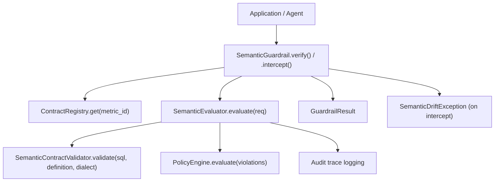
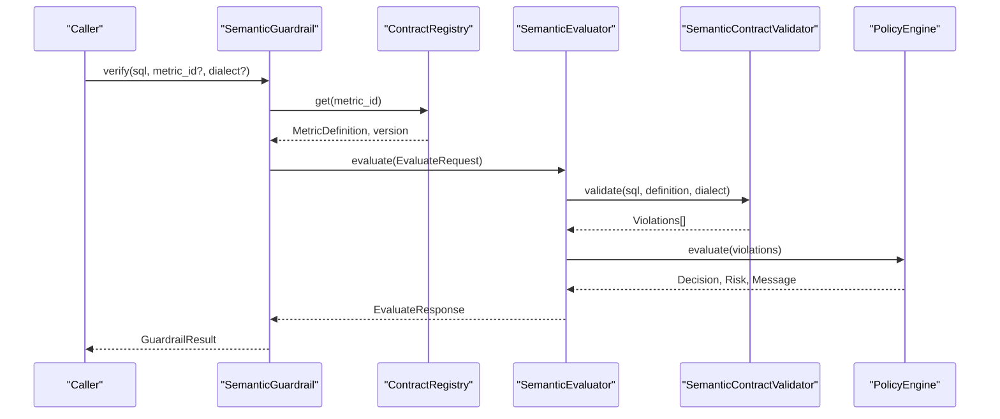
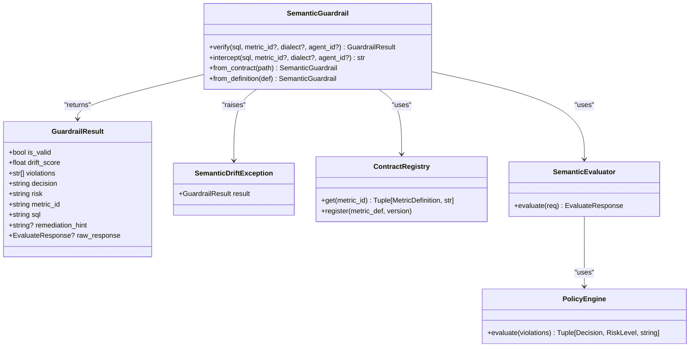

# SemanticGuardrail

<cite>
**Referenced Files in This Document**
- [guardrail.py](file://semantic_reliability/guardrail.py)
- [__init__.py](file://semantic_reliability/__init__.py)
- [engine.py](file://semantic_reliability/firewall/engine.py)
- [schema.py](file://semantic_reliability/compiler/schema.py)
- [langchain.py](file://semantic_reliability/integrations/langchain.py)
- [litellm.py](file://semantic_reliability/integrations/litellm.py)
- [test_guardrail_and_integrations.py](file://tests/test_guardrail_and_integrations.py)
- [contract.yaml](file://benchmark_corpus/dev/net_revenue/contract.yaml)
</cite>

## Table of Contents
1. [Introduction](#introduction)
2. [Project Structure](#project-structure)
3. [Core Components](#core-components)
4. [Architecture Overview](#architecture-overview)
5. [Detailed Component Analysis](#detailed-component-analysis)
6. [Dependency Analysis](#dependency-analysis)
7. [Performance Considerations](#performance-considerations)
8. [Troubleshooting Guide](#troubleshooting-guide)
9. [Conclusion](#conclusion)
10. [Appendices](#appendices)

## Introduction
SemanticGuardrail is the primary interface for semantic contract validation of SQL queries generated by AI agents or BI tools. It ensures that candidate queries adhere to business metric definitions (SCOS contracts) before execution, preventing silent metric corruption and unfiltered mutations. The class provides deterministic verification, structured results, and strict interception with typed exceptions for production-grade enforcement.

## Project Structure
The SemanticGuardrail lives in the core module and integrates with:
- Contract registry and evaluator for AST-based validation
- Policy engine for decisioning (ALLOW/AUDIT/DENY)
- Integrations for LangChain and LiteLLM workflows
- Tests demonstrating usage patterns and error handling

**Diagram sources**
- [guardrail.py:45-152](file://semantic_reliability/guardrail.py#L45-L152)
- [engine.py:18-132](file://semantic_reliability/firewall/engine.py#L18-L132)

**Section sources**
- [guardrail.py:1-152](file://semantic_reliability/guardrail.py#L1-L152)
- [engine.py:1-132](file://semantic_reliability/firewall/engine.py#L1-L132)

## Core Components
- SemanticGuardrail: High-level API to load contracts, verify SQL, and intercept invalid queries.
- GuardrailResult: Structured result containing validity, drift score, violations, decision, risk, and metadata.
- SemanticDriftException: Typed exception raised on invalid queries when using intercept mode.
- ContractRegistry: In-memory registry of MetricDefinition objects loaded from YAML files/directories.
- SemanticEvaluator: Orchestrates parsing, validation against invariants, policy evaluation, and audit logging.

Key responsibilities:
- Load and register metric contracts from file paths, directories, dicts, or MetricDefinition objects.
- Verify SQL against declared invariants and return a GuardrailResult.
- Intercept and block invalid SQL by raising SemanticDriftException.

**Section sources**
- [guardrail.py:13-152](file://semantic_reliability/guardrail.py#L13-L152)
- [engine.py:18-132](file://semantic_reliability/firewall/engine.py#L18-L132)
- [schema.py:83-98](file://semantic_reliability/compiler/schema.py#L83-L98)

## Architecture Overview
SemanticGuardrail composes a contract registry and an evaluator to enforce SCOS invariants. The flow includes:
- Request construction with metric_id, sql, dialect, agent_id
- Parsing and validation via SQLGlot and contract validator
- Policy-driven decisioning (ALLOW/AUDIT/DENY)
- Audit tracing and result mapping to GuardrailResult

**Diagram sources**
- [guardrail.py:91-136](file://semantic_reliability/guardrail.py#L91-L136)
- [engine.py:54-116](file://semantic_reliability/firewall/engine.py#L54-L116)

## Detailed Component Analysis

### SemanticGuardrail
Responsibilities:
- Initialize with contract source (file path, directory, dict, or MetricDefinition)
- Provide verify() for non-blocking validation returning GuardrailResult
- Provide intercept() for blocking validation raising SemanticDriftException on violation
- Support multiple metrics via metric_id parameter; default to primary_metric if not specified

Method signatures and behavior:
- __init__(contract_source: Union[str, Path, MetricDefinition, Dict[str, Any]])
  - Loads and registers contracts; sets primary_metric
  - Raises ValueError if no valid contracts found in directory
  - Raises FileNotFoundError if path does not exist
- from_contract(contract_path: Union[str, Path]) -> SemanticGuardrail
  - Convenience constructor for loading from a contract YAML file
- from_definition(definition: MetricDefinition) -> SemanticGuardrail
  - Convenience constructor for direct MetricDefinition initialization
- verify(sql: str, metric_id: Optional[str] = None, dialect: str = "duckdb", agent_id: str = "agent-guardrail") -> GuardrailResult
  - Builds EvaluateRequest and calls SemanticEvaluator.evaluate
  - Computes drift_score based on violations and decision
  - Returns GuardrailResult with is_valid, drift_score, violations, decision, risk, metric_id, sql, remediation_hint, raw_response
- intercept(sql: str, metric_id: Optional[str] = None, dialect: str = "duckdb", agent_id: str = "agent-guardrail") -> str
  - Calls verify and raises SemanticDriftException if not valid
  - Returns original SQL if valid

Return values and exceptions:
- verify returns GuardrailResult; no exceptions are raised by verify itself
- intercept raises SemanticDriftException on invalid queries
- Constructor may raise ValueError or FileNotFoundError for invalid inputs

Configuration options:
- dialect: SQL dialect used for parsing (default duckdb)
- agent_id: Identifier for audit traces (default agent-guardrail)
- metric_id: Target metric to validate against (defaults to primary_metric)

Usage examples (paths only):
- Loading from contract file and verifying SQL: [test_guardrail_and_integrations.py:22-31](file://tests/test_guardrail_and_integrations.py#L22-L31)
- Detecting filter violations: [test_guardrail_and_integrations.py:33-43](file://tests/test_guardrail_and_integrations.py#L33-L43)
- Intercept pattern with exception handling: [test_guardrail_and_integrations.py:45-55](file://tests/test_guardrail_and_integrations.py#L45-L55)

**Section sources**
- [guardrail.py:45-152](file://semantic_reliability/guardrail.py#L45-L152)
- [test_guardrail_and_integrations.py:22-55](file://tests/test_guardrail_and_integrations.py#L22-L55)

### GuardrailResult
Fields:
- is_valid: bool indicating whether the query is allowed
- drift_score: float in [0, 1] representing severity of drift
- violations: List[str] describing invariant violations
- decision: string representation of Decision (ALLOW/AUDIT/DENY)
- risk: string representation of RiskLevel
- metric_id: target metric identifier
- sql: validated SQL string
- remediation_hint: optional message from policy/validator
- raw_response: underlying EvaluateResponse for advanced inspection

Behavior:
- Boolean coercion returns is_valid for use in conditionals

**Section sources**
- [guardrail.py:28-43](file://semantic_reliability/guardrail.py#L28-L43)

### SemanticDriftException
Purpose:
- Raised by intercept() when a query violates semantic invariants
- Carries GuardrailResult for detailed diagnostics

Message composition:
- Includes drift_score, decision, violations list, and optional remediation hint

**Section sources**
- [guardrail.py:13-26](file://semantic_reliability/guardrail.py#L13-L26)

### Contract Registry and Evaluator
ContractRegistry:
- Loads YAML contracts from a directory or registers MetricDefinition objects
- Provides get(metric_id) to retrieve definition and version

SemanticEvaluator:
- Parses SQL using SQLGlot with specified dialect
- Validates SQL against MetricDefinition invariants
- Applies PolicyEngine to determine decision and risk
- Records immutable audit traces

Error handling:
- Unparseable SQL or missing metric results in DENY decisions with critical risk
- Violations are mapped to structured Violation objects

**Section sources**
- [engine.py:18-132](file://semantic_reliability/firewall/engine.py#L18-L132)

### Integration Patterns

#### LangChain Integration
SREGuardrailToolWrapper:
- Wraps a base SQL tool to intercept and validate generated queries
- Supports synchronous run() and asynchronous arun()
- Can return diagnostic feedback or raise SemanticDriftException based on configuration

SREGuardrailCallback:
- Implements BaseCallbackHandler-compatible hook to observe and optionally block SQL queries during tool execution

Usage examples (paths only):
- Tool wrapper with self-correction feedback: [test_guardrail_and_integrations.py:57-81](file://tests/test_guardrail_and_integrations.py#L57-L81)
- Raising on drift: [test_guardrail_and_integrations.py:83-96](file://tests/test_guardrail_and_integrations.py#L83-L96)

**Section sources**
- [langchain.py:12-149](file://semantic_reliability/integrations/langchain.py#L12-L149)
- [test_guardrail_and_integrations.py:57-96](file://tests/test_guardrail_and_integrations.py#L57-L96)

#### LiteLLM Integration
SRELiteLLMGuardrail:
- Extracts SQL from LLM responses (tool calls or markdown code blocks)
- Validates via SemanticGuardrail.verify()
- Optionally blocks execution by raising SemanticDriftException

Hooks:
- post_call_success_hook(data, user_api_key_dict, response)
- async_post_call_success_hook(data, user_api_key_dict, response)

Usage example (paths only):
- Hook behavior with block_on_violation: [test_guardrail_and_integrations.py:98-124](file://tests/test_guardrail_and_integrations.py#L98-L124)

**Section sources**
- [litellm.py:13-95](file://semantic_reliability/integrations/litellm.py#L13-L95)
- [test_guardrail_and_integrations.py:98-124](file://tests/test_guardrail_and_integrations.py#L98-L124)

## Dependency Analysis
SemanticGuardrail depends on:
- ContractRegistry for metric definitions
- SemanticEvaluator for validation and decisioning
- PolicyEngine for rule-based decisions
- SQLGlot for SQL parsing
- Pydantic models for schema validation

**Diagram sources**
- [guardrail.py:45-152](file://semantic_reliability/guardrail.py#L45-L152)
- [engine.py:18-132](file://semantic_reliability/firewall/engine.py#L18-L132)

**Section sources**
- [guardrail.py:45-152](file://semantic_reliability/guardrail.py#L45-L152)
- [engine.py:18-132](file://semantic_reliability/firewall/engine.py#L18-L132)

## Performance Considerations
- Fast-path static approvals: Many clean queries are approved without database execution, reducing warehouse compute and latency.
- Hybrid routing: Queries can be escalated to runtime checks only when necessary, improving throughput.
- Audit logging: Immutable traces are recorded per evaluation; ensure log volume is managed in high-throughput environments.
- Dialect parsing: SQLGlot parsing is fast but should be considered in tight loops; reuse guardrail instances to avoid repeated registry setup.

Recommendations:
- Reuse SemanticGuardrail instances across requests to leverage in-memory registry
- Use appropriate dialect settings to minimize parse overhead
- Monitor audit logs and consider sampling or aggregation for high-volume deployments
- Leverage integration wrappers to batch or cache where feasible at the application layer

[No sources needed since this section provides general guidance]

## Troubleshooting Guide
Common issues and resolutions:
- Unknown metric contract: Ensure metric_id is registered; check ContractRegistry contents and versions
- SQL parse errors: Validate SQL syntax and dialect compatibility; parser errors result in DENY decisions
- Violations detected: Review GuardrailResult.violations and remediation_hint to correct query structure
- Exception handling: Catch SemanticDriftException in intercept flows to handle blocked queries gracefully

Patterns:
- Non-blocking validation: Use verify() and inspect GuardrailResult.is_valid and drift_score
- Blocking validation: Use intercept() and catch SemanticDriftException for immediate failure
- Integration feedback: In LangChain/LiteLLM integrations, configure raise_on_drift/block_on_violation to control behavior

**Section sources**
- [guardrail.py:13-26](file://semantic_reliability/guardrail.py#L13-L26)
- [engine.py:54-84](file://semantic_reliability/firewall/engine.py#L54-L84)
- [test_guardrail_and_integrations.py:45-55](file://tests/test_guardrail_and_integrations.py#L45-L55)

## Conclusion
SemanticGuardrail provides a robust, deterministic mechanism for enforcing semantic contracts on SQL queries. With structured results, typed exceptions, and integrations for popular frameworks, it enables safe deployment of AI-driven analytics while maintaining data integrity and governance. Adopting best practices around instance reuse, dialect configuration, and audit monitoring will ensure reliable performance in production.

[No sources needed since this section summarizes without analyzing specific files]

## Appendices

### Method Reference Summary
- SemanticGuardrail.__init__(contract_source)
  - Parameters: contract_source (Union[str, Path, MetricDefinition, Dict[str, Any]])
  - Behavior: Loads contracts, sets primary_metric, initializes evaluator
  - Exceptions: ValueError, FileNotFoundError
- SemanticGuardrail.from_contract(contract_path)
  - Parameters: contract_path (Union[str, Path])
  - Returns: SemanticGuardrail
- SemanticGuardrail.from_definition(definition)
  - Parameters: definition (MetricDefinition)
  - Returns: SemanticGuardrail
- SemanticGuardrail.verify(sql, metric_id?, dialect?, agent_id?)
  - Parameters: sql (str), metric_id (Optional[str]), dialect (str), agent_id (str)
  - Returns: GuardrailResult
- SemanticGuardrail.intercept(sql, metric_id?, dialect?, agent_id?)
  - Parameters: sql (str), metric_id (Optional[str]), dialect (str), agent_id (str)
  - Returns: str (original SQL if valid)
  - Exceptions: SemanticDriftException

**Section sources**
- [guardrail.py:53-152](file://semantic_reliability/guardrail.py#L53-L152)

### Example Workflows (Paths Only)
- Load contract and verify valid SQL: [test_guardrail_and_integrations.py:22-31](file://tests/test_guardrail_and_integrations.py#L22-L31)
- Detect and handle invalid SQL: [test_guardrail_and_integrations.py:33-43](file://tests/test_guardrail_and_integrations.py#L33-L43)
- Intercept with exception handling: [test_guardrail_and_integrations.py:45-55](file://tests/test_guardrail_and_integrations.py#L45-L55)
- LangChain tool wrapper usage: [test_guardrail_and_integrations.py:57-96](file://tests/test_guardrail_and_integrations.py#L57-L96)
- LiteLLM hook usage: [test_guardrail_and_integrations.py:98-124](file://tests/test_guardrail_and_integrations.py#L98-L124)

**Section sources**
- [test_guardrail_and_integrations.py:22-124](file://tests/test_guardrail_and_integrations.py#L22-L124)