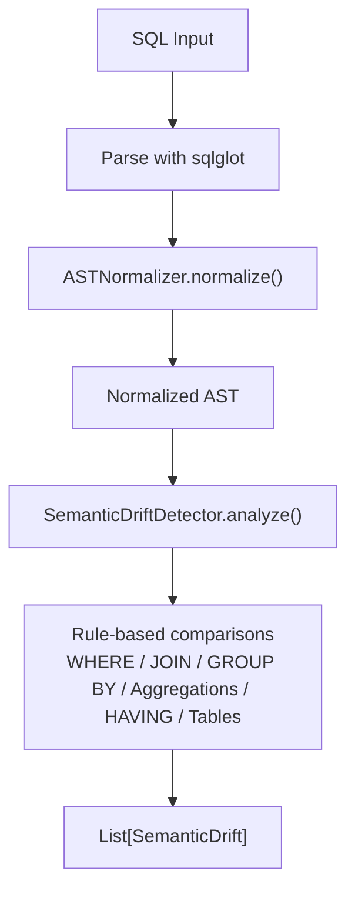
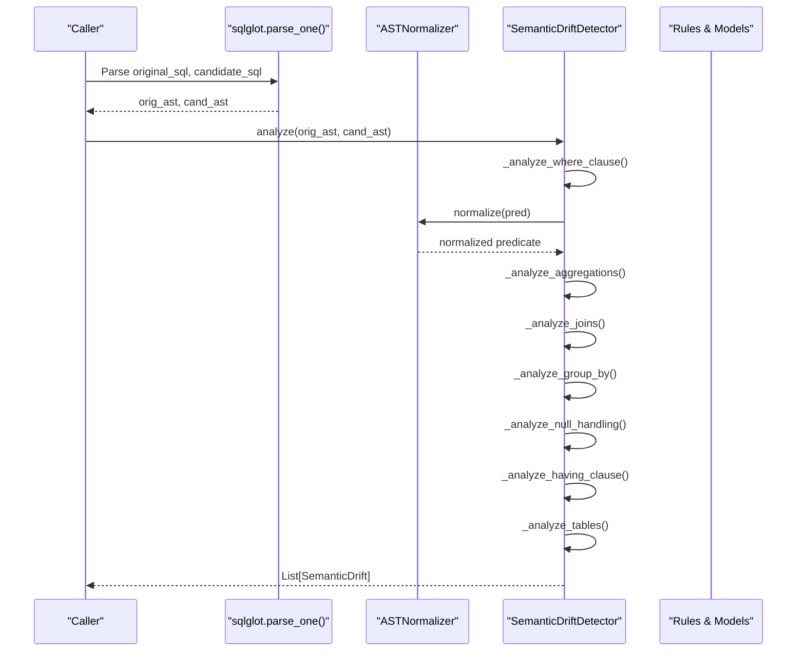
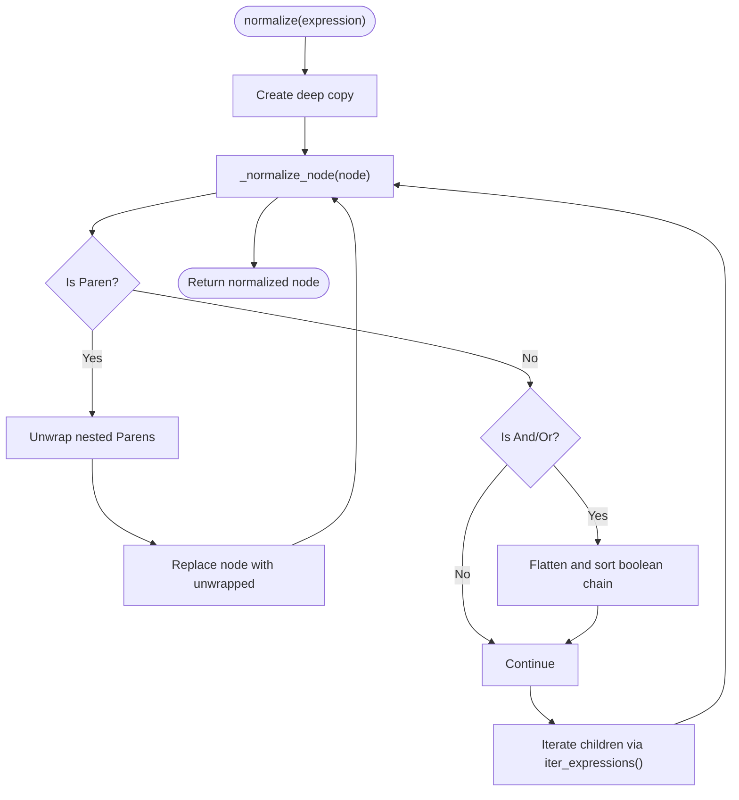
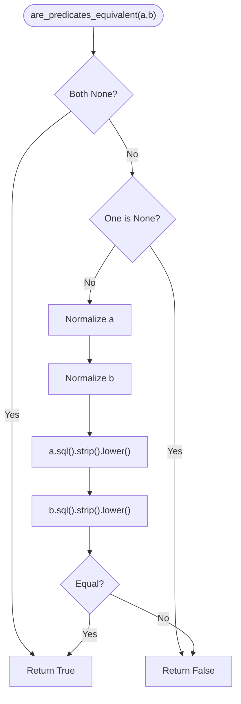
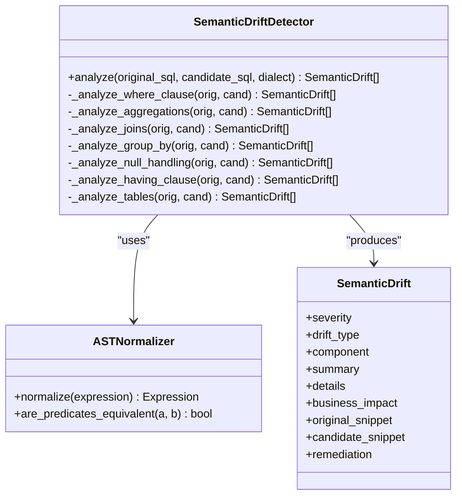
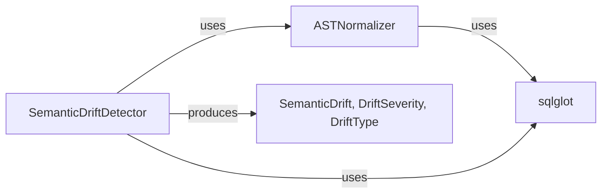

# AST Normalization

<cite>
**Referenced Files in This Document**
- [normalizer.py](file://semantic_reliability/testing/drift/normalizer.py)
- [detector.py](file://semantic_reliability/testing/drift/detector.py)
- [rules.py](file://semantic_reliability/testing/drift/rules.py)
- [test_equivalence.py](file://tests/test_equivalence.py)
- [test_drift_detector.py](file://tests/test_drift_detector.py)
</cite>

## Table of Contents
1. Introduction
2. Project Structure
3. Core Components
4. Architecture Overview
5. Detailed Component Analysis
6. Dependency Analysis
7. Performance Considerations
8. Troubleshooting Guide
9. Conclusion

## Introduction
This document explains the AST normalization system used for drift detection in SQL queries. It focuses on how the ASTNormalizer transforms SQL Abstract Syntax Trees into canonical forms to enable robust semantic equivalence checking, and how the SemanticDriftDetector uses these normalized forms to identify meaningful changes across WHERE clauses, aggregations, joins, grouping, null handling, HAVING filters, and source tables. The guide also covers predicate comparison algorithms, expression normalization techniques, structural comparison methods, performance considerations, edge cases, and troubleshooting guidance.

## Project Structure
The AST normalization and drift detection logic is implemented under a focused module:
- AST normalization and predicate equivalence: normalizer.py
- Drift analysis orchestration and rule application: detector.py
- Drift types and severity taxonomy: rules.py
- Tests validating equivalence and drift detection behavior: test_equivalence.py, test_drift_detector.py

**Diagram sources**
- [normalizer.py:6-92](file://semantic_reliability/testing/drift/normalizer.py#L6-L92)
- [detector.py:9-46](file://semantic_reliability/testing/drift/detector.py#L9-L46)

**Section sources**
- [normalizer.py:1-92](file://semantic_reliability/testing/drift/normalizer.py#L1-L92)
- [detector.py:1-246](file://semantic_reliability/testing/drift/detector.py#L1-L246)
- [rules.py:1-41](file://semantic_reliability/testing/drift/rules.py#L1-L41)

## Core Components
- ASTNormalizer: Canonicalizes SQL AST nodes by unwrapping redundant parentheses, flattening and sorting commutative boolean chains (AND/OR), and normalizing alias identifiers to lowercase. Provides are_predicates_equivalent for comparing two predicates after normalization.
- SemanticDriftDetector: Orchestrates parsing and runs multiple targeted analyses (WHERE, aggregations, joins, GROUP BY, null handling, HAVING, tables). Uses ASTNormalizer for predicate equivalence checks where applicable.
- Rules: Defines DriftSeverity and DriftType enums and a SemanticDrift data model that captures the nature and impact of detected drifts.

Key responsibilities:
- Normalize expressions to eliminate cosmetic differences (parentheses, ordering, case).
- Compare logical predicates semantically rather than syntactically.
- Detect structural and semantic changes that affect metric computation or population.

**Section sources**
- [normalizer.py:6-92](file://semantic_reliability/testing/drift/normalizer.py#L6-L92)
- [detector.py:9-246](file://semantic_reliability/testing/drift/detector.py#L9-L246)
- [rules.py:6-41](file://semantic_reliability/testing/drift/rules.py#L6-L41)

## Architecture Overview
The pipeline parses baseline and candidate SQL into ASTs, then applies normalization and structured comparisons to produce a list of drift reports.

**Diagram sources**
- [detector.py:12-46](file://semantic_reliability/testing/drift/detector.py#L12-L46)
- [normalizer.py:9-92](file://semantic_reliability/testing/drift/normalizer.py#L9-L92)

## Detailed Component Analysis

### ASTNormalizer: Canonicalization and Predicate Equivalence
- Deep copy and recursive normalization:
  - Unwraps redundant Paren nodes to reduce structural noise.
  - Flattens and sorts binary AND/OR chains to canonical order using SQL string representation (lowercased, stripped).
  - Normalizes Alias identifiers to lowercase to avoid case-driven false positives.
- Predicate equivalence:
  - are_predicates_equivalent normalizes both operands and compares their SQL strings after stripping whitespace and lowercasing.

**Diagram sources**
- [normalizer.py:9-38](file://semantic_reliability/testing/drift/normalizer.py#L9-L38)
- [normalizer.py:40-76](file://semantic_reliability/testing/drift/normalizer.py#L40-L76)

Predicate equivalence flow:

**Diagram sources**
- [normalizer.py:77-92](file://semantic_reliability/testing/drift/normalizer.py#L77-L92)

Examples of normalization outcomes:
- Commutative AND/OR reordering becomes equivalent after sorting leaves.
- Redundant parentheses are removed so structure matches.
- Alias names are lowercased to ignore casing differences.

These behaviors are validated by tests that assert zero drifts for logically identical but syntactically varied SQL.

**Section sources**
- [normalizer.py:6-92](file://semantic_reliability/testing/drift/normalizer.py#L6-L92)
- [test_equivalence.py:7-43](file://tests/test_equivalence.py#L7-L43)

### SemanticDriftDetector: Structural and Semantic Comparison
The detector performs targeted analyses across key SQL components:

- WHERE clause:
  - Detects removal or addition of filters.
  - Uses ASTNormalizer.are_predicates_equivalent to detect semantic shifts while ignoring cosmetic differences.
- Aggregations:
  - Compares aggregation function types and payloads to detect formula changes.
- Joins:
  - Checks join count and presence of ON/USING predicates; flags missing predicates as fatal due to potential Cartesian explosion.
- GROUP BY:
  - Compares grouping expressions to detect grain drift.
- Null handling:
  - Flags removal of COALESCE calls that could propagate NULLs.
- HAVING:
  - Detects post-aggregation filter changes.
- Tables:
  - Compares source table sets to detect lineage changes.

**Diagram sources**
- [detector.py:9-246](file://semantic_reliability/testing/drift/detector.py#L9-L246)
- [normalizer.py:6-92](file://semantic_reliability/testing/drift/normalizer.py#L6-L92)
- [rules.py:6-41](file://semantic_reliability/testing/drift/rules.py#L6-L41)

Example scenarios validated by tests:
- Filter removal triggers a FATAL drift.
- Logic shift in WHERE conditions triggers a CRITICAL drift.
- Aggregation function change triggers a HIGH drift.
- Grain change triggers a CRITICAL drift.
- Missing join predicate triggers a FATAL drift.
- Identical SQL yields no drifts.

**Section sources**
- [detector.py:48-246](file://semantic_reliability/testing/drift/detector.py#L48-L246)
- [test_drift_detector.py:17-83](file://tests/test_drift_detector.py#L17-L83)

### Predicate Comparison Algorithms
- Boolean chain flattening and sorting:
  - Extracts all conjuncts/disjuncts from nested AND/OR trees.
  - Sorts leaves by normalized SQL string to achieve canonical form.
  - Rebuilds the chain preserving operator type.
- Parenthesis unwrapping:
  - Removes redundant Paren wrappers to simplify structure.
- Alias normalization:
  - Lowercases alias identifiers to avoid case-sensitive mismatches.
- Final equivalence check:
  - Converts normalized AST back to SQL, strips whitespace, lowercases, and compares strings.

These steps ensure that logically equivalent predicates are recognized as such despite syntactic variations.

**Section sources**
- [normalizer.py:17-76](file://semantic_reliability/testing/drift/normalizer.py#L17-L76)
- [normalizer.py:77-92](file://semantic_reliability/testing/drift/normalizer.py#L77-L92)

### Expression Normalization Techniques
- Redundant parentheses removal reduces tree depth and eliminates cosmetic differences.
- Sorting boolean chains ensures deterministic ordering for comparison.
- Lowercasing aliases prevents case-driven false positives.
- String-based final comparison leverages stable SQL serialization after normalization.

These techniques collectively minimize false positives while preserving semantic fidelity.

**Section sources**
- [normalizer.py:17-76](file://semantic_reliability/testing/drift/normalizer.py#L17-L76)

### Structural Comparison Methods
- WHERE clause: Presence and semantic equivalence of filters.
- Aggregations: Function type and payload equality.
- Joins: Count and predicate presence.
- GROUP BY: Set equality of grouping expressions.
- Null handling: Count of COALESCE usage.
- HAVING: Presence and content equality.
- Tables: Set equality of referenced tables.

These comparisons target high-impact areas of SQL semantics relevant to metric definitions.

**Section sources**
- [detector.py:48-246](file://semantic_reliability/testing/drift/detector.py#L48-L246)

## Dependency Analysis
- ASTNormalizer depends on sqlglot for AST traversal and manipulation.
- SemanticDriftDetector depends on ASTNormalizer for predicate equivalence and on sqlglot for parsing and AST operations.
- Both modules depend on the rules module for standardized drift reporting.

**Diagram sources**
- [normalizer.py:1-92](file://semantic_reliability/testing/drift/normalizer.py#L1-L92)
- [detector.py:1-246](file://semantic_reliability/testing/drift/detector.py#L1-L246)
- [rules.py:1-41](file://semantic_reliability/testing/drift/rules.py#L1-L41)

**Section sources**
- [normalizer.py:1-92](file://semantic_reliability/testing/drift/normalizer.py#L1-L92)
- [detector.py:1-246](file://semantic_reliability/testing/drift/detector.py#L1-L246)
- [rules.py:1-41](file://semantic_reliability/testing/drift/rules.py#L1-L41)

## Performance Considerations
- Parsing cost: Each analyze call parses both baseline and candidate SQL once using sqlglot. For large batches, consider caching parsed ASTs if the same SQL is analyzed repeatedly.
- Tree traversal: Normalization recursively visits nodes via iter_expressions. Complexity scales with AST size; typical SQL queries remain small enough for fast processing.
- Sorting boolean chains: Sorting leaf nodes introduces O(k log k) where k is the number of conjuncts/disjuncts. For very wide predicates, this adds overhead but remains practical for most queries.
- Memory usage: normalize creates a deep copy of the input expression before mutating it, which doubles memory temporarily for that subtree. For extremely large ASTs, be mindful of peak memory during normalization.
- String conversion: Converting normalized ASTs to SQL for comparison is efficient but can add overhead for very large expressions. Use predicate equivalence only when necessary.

Optimization opportunities:
- Early exits in normalization for simple nodes to avoid unnecessary recursion.
- Memoization of normalized SQL strings for repeated comparisons.
- Batch processing with streaming to reduce memory pressure.
- Limiting normalization scope to relevant subgraphs (e.g., only WHERE/HAVING/JON branches) when possible.

[No sources needed since this section provides general guidance]

## Troubleshooting Guide
Common issues and resolutions:
- False positives due to formatting:
  - Ensure you rely on AST-level comparison; avoid direct string comparisons of SQL.
  - Verify that parentheses and alias casing do not cause mismatches; ASTNormalizer handles these cases.
- Unexpected drifts in complex predicates:
  - Check whether boolean chains are deeply nested; normalization flattens them, but ensure your expectations align with canonical ordering.
  - Validate that alias identifiers are intentionally case-insensitive; normalization lowercases them.
- Missing join predicates flagged as fatal:
  - Confirm whether the join is intended to be CROSS; otherwise, add explicit ON/USING clauses.
- Aggregation changes not detected:
  - Ensure aggregation functions and payloads are present in the query; detector compares both function types and inner expressions.
- Grouping grain drift:
  - If downstream models depend on specific dimensions, verify GROUP BY expressions match expected grain.

Diagnostic steps:
- Inspect the returned SemanticDrift objects for component, summary, details, and remediation fields to understand the exact change.
- Use tests as reference patterns to validate expected behavior for known transformations.

**Section sources**
- [detector.py:48-246](file://semantic_reliability/testing/drift/detector.py#L48-L246)
- [rules.py:6-41](file://semantic_reliability/testing/drift/rules.py#L6-L41)
- [test_drift_detector.py:17-83](file://tests/test_drift_detector.py#L17-L83)
- [test_equivalence.py:7-43](file://tests/test_equivalence.py#L7-L43)

## Conclusion
The AST normalization system enables robust semantic equivalence checking by canonicalizing SQL ASTs and focusing drift detection on meaningful changes. Through careful normalization of parentheses, boolean chains, and aliases, combined with targeted structural comparisons, the system identifies critical, high, medium, and low-severity drifts across key SQL components. The design balances correctness with performance, making it suitable for analyzing typical SQL queries in production environments. When encountering edge cases, use the provided diagnostics and tests to validate behavior and adjust queries accordingly.