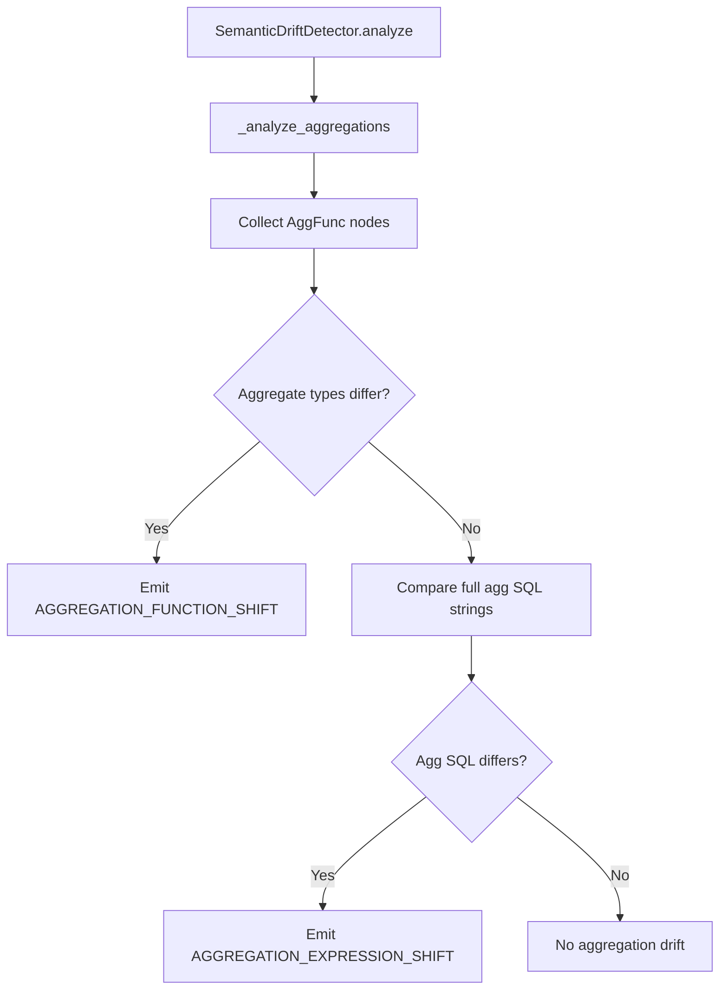
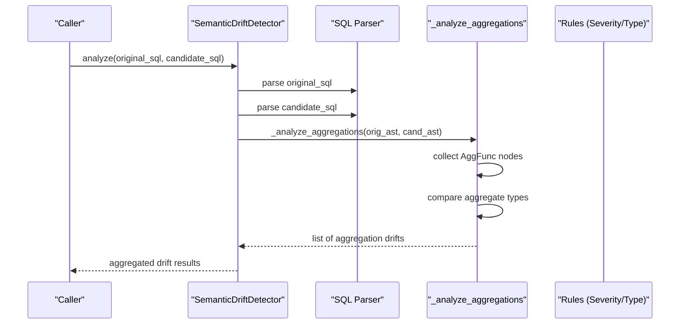
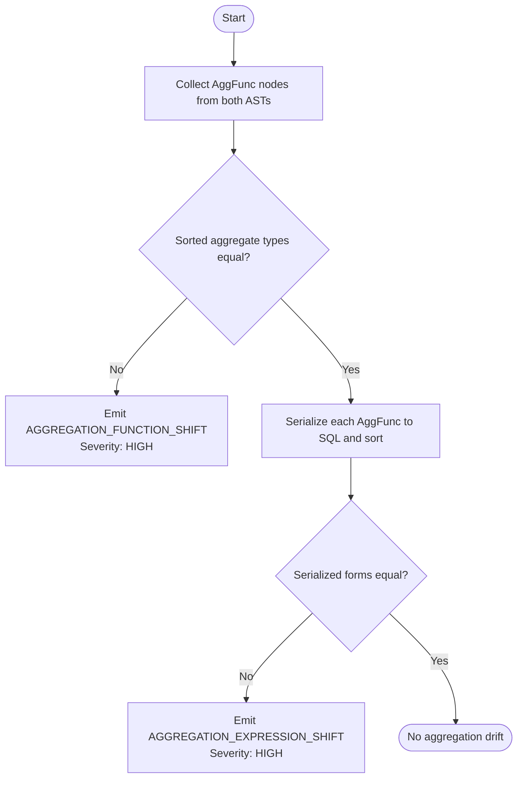
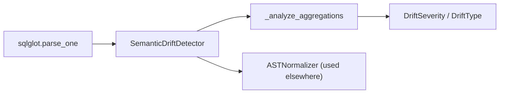
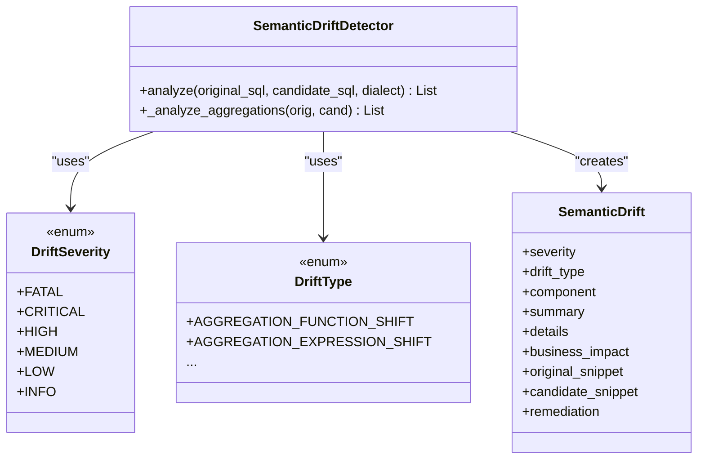

# Aggregation Analysis

<cite>
**Referenced Files in This Document**
- [detector.py](file://semantic_reliability/testing/drift/detector.py)
- [rules.py](file://semantic_reliability/testing/drift/rules.py)
- [normalizer.py](file://semantic_reliability/testing/drift/normalizer.py)
- [test_drift_detector.py](file://tests/test_drift_detector.py)
- [engine.py](file://semantic_reliability/testing/mutations/engine.py)
</cite>

## Table of Contents
1. [Introduction](#introduction)
2. [Project Structure](#project-structure)
3. [Core Components](#core-components)
4. [Architecture Overview](#architecture-overview)
5. [Detailed Component Analysis](#detailed-component-analysis)
6. [Dependency Analysis](#dependency-analysis)
7. [Performance Considerations](#performance-considerations)
8. [Troubleshooting Guide](#troubleshooting-guide)
9. [Conclusion](#conclusion)
10. [Appendices](#appendices)

## Introduction
This document explains how aggregation drift is detected and analyzed when comparing a baseline SQL query to a candidate SQL query. It focuses on the two-level analysis performed by the aggregation analyzer: first, it compares aggregate function types (for example, SUM vs AVG vs COUNT), and second, it inspects the expressions inside aggregations for modifications such as CASE statements or arithmetic changes. The documentation covers severity classification, business impact assessment, interpretation of drift reports, and recommended remediation steps.

## Project Structure
The aggregation analysis logic resides in the testing drift module. The detector parses both queries into ASTs, then runs a series of checks including aggregation analysis. Supporting modules define drift types/severities and provide normalization utilities to reduce false positives from cosmetic differences.

**Diagram sources**
- [detector.py:12-46](file://semantic_reliability/testing/drift/detector.py#L12-L46)
- [detector.py:94-131](file://semantic_reliability/testing/drift/detector.py#L94-L131)

**Section sources**
- [detector.py:12-46](file://semantic_reliability/testing/drift/detector.py#L12-L46)
- [rules.py:6-28](file://semantic_reliability/testing/drift/rules.py#L6-L28)

## Core Components
- SemanticDriftDetector: Orchestrates drift detection across multiple SQL components, including aggregations.
- _analyze_aggregations: Implements the two-level comparison for aggregation drift.
- DriftSeverity and DriftType: Enumerations that classify drifts and their severity levels.
- ASTNormalizer: Normalizes predicates and expressions to avoid false positives due to commutativity or formatting.

Key responsibilities:
- Parse baseline and candidate SQL into ASTs.
- Extract all aggregate functions and compare their types.
- If types match, compare the full serialized form of each aggregate to detect expression changes.
- Produce structured drift records with severity, type, component, summary, details, business impact, snippets, and remediation guidance.

**Section sources**
- [detector.py:12-46](file://semantic_reliability/testing/drift/detector.py#L12-L46)
- [detector.py:94-131](file://semantic_reliability/testing/drift/detector.py#L94-L131)
- [rules.py:6-28](file://semantic_reliability/testing/drift/rules.py#L6-L28)
- [normalizer.py:6-93](file://semantic_reliability/testing/drift/normalizer.py#L6-L93)

## Architecture Overview
The aggregation analysis is part of a broader semantic drift inspection pipeline. The detector performs sequential checks across WHERE, SELECT aggregations, JOINs, GROUP BY, NULL handling, HAVING, and source tables. Aggregation analysis specifically targets mathematical computation integrity.

**Diagram sources**
- [detector.py:12-46](file://semantic_reliability/testing/drift/detector.py#L12-L46)
- [detector.py:94-131](file://semantic_reliability/testing/drift/detector.py#L94-L131)

## Detailed Component Analysis

### Two-Level Aggregation Analysis
The method performs a two-level comparison:

1. Aggregate Function Type Comparison
   - Collects all aggregate functions from both ASTs.
   - Compares the sorted list of aggregate function types.
   - If they differ, emits an aggregation function shift drift with HIGH severity.

2. Expression Inside Aggregations Comparison
   - Serializes each aggregate function to SQL and sorts them.
   - If aggregate types are identical but the serialized forms differ, emits an aggregation expression shift drift with HIGH severity.

This approach detects common drifts such as changing SUM(amount) to AVG(amount) or modifying CASE conditions and arithmetic within aggregations.

**Diagram sources**
- [detector.py:94-131](file://semantic_reliability/testing/drift/detector.py#L94-L131)

**Section sources**
- [detector.py:94-131](file://semantic_reliability/testing/drift/detector.py#L94-L131)

### Severity Classification and Business Impact
- Aggregation Function Shift:
  - Severity: HIGH
  - Business Impact: The mathematical computation of the metric has changed.
  - Remediation: Ensure the formula conforms to the canonical business metric definition.

- Aggregation Expression Shift:
  - Severity: HIGH
  - Business Impact: Underlying calculation components modified (e.g., CASE statements or amounts).
  - Remediation: Review arithmetic operands and case conditions inside aggregation.

These classifications help prioritize review efforts and communicate risk to stakeholders.

**Section sources**
- [detector.py:102-129](file://semantic_reliability/testing/drift/detector.py#L102-L129)
- [rules.py:6-28](file://semantic_reliability/testing/drift/rules.py#L6-L28)

### Examples of Common Aggregation Drifts
- Changing aggregate function type:
  - Example: Replacing SUM(amount) with AVG(amount) triggers an aggregation function shift.
  - Reference test demonstrates this scenario.

- Modifying expressions inside aggregations:
  - Example: Altering CASE WHEN conditions or arithmetic operations inside SUM/COUNT/AVG triggers an aggregation expression shift.
  - Tests include complex net revenue calculations using CASE statements.

- Grain drift (related):
  - While not strictly an aggregation payload change, altering GROUP BY dimensions affects aggregation outcomes and is flagged separately.

**Section sources**
- [test_drift_detector.py:46-57](file://tests/test_drift_detector.py#L46-L57)
- [test_drift_detector.py:5-14](file://tests/test_drift_detector.py#L5-L14)
- [test_drift_detector.py:60-71](file://tests/test_drift_detector.py#L60-L71)

### Interpreting Drift Reports
When reviewing drift reports for aggregation changes:
- Identify the drift type:
  - AGGREGATION_FUNCTION_SHIFT indicates a change in the aggregate function itself.
  - AGGREGATION_EXPRESSION_SHIFT indicates a change in the expression evaluated by the aggregate.
- Check severity:
  - Both are classified as HIGH, warranting prompt review.
- Read business impact:
  - Understand how the change affects metric computation and downstream dashboards.
- Use provided snippets:
  - Original and candidate snippets show exact differences in aggregation definitions.
- Follow remediation guidance:
  - Align the candidate query with the canonical business metric definition.

**Section sources**
- [detector.py:102-129](file://semantic_reliability/testing/drift/detector.py#L102-L129)

### Recommended Remediation Steps
- For aggregation function shifts:
  - Verify whether the new aggregate function matches the intended business definition.
  - If unintended, revert to the correct aggregate function (e.g., SUM instead of AVG).

- For aggregation expression shifts:
  - Inspect CASE statements, arithmetic operators, and column references inside aggregates.
  - Restore original logic if the change was accidental; otherwise, update contracts and tests accordingly.

- Validate downstream effects:
  - Re-run metrics and dashboards to confirm expected behavior after remediation.

[No sources needed since this section provides general guidance]

## Dependency Analysis
The aggregation analysis depends on:
- SQL parsing via sqlglot to build ASTs.
- AST traversal to find aggregate functions.
- Rule definitions for severity and drift types.
- Optional normalization utilities for predicate equivalence (used elsewhere in the detector).

**Diagram sources**
- [detector.py:1-6](file://semantic_reliability/testing/drift/detector.py#L1-L6)
- [detector.py:94-131](file://semantic_reliability/testing/drift/detector.py#L94-L131)
- [rules.py:6-28](file://semantic_reliability/testing/drift/rules.py#L6-L28)
- [normalizer.py:6-93](file://semantic_reliability/testing/drift/normalizer.py#L6-L93)

**Section sources**
- [detector.py:1-6](file://semantic_reliability/testing/drift/detector.py#L1-L6)
- [detector.py:94-131](file://semantic_reliability/testing/drift/detector.py#L94-L131)
- [rules.py:6-28](file://semantic_reliability/testing/drift/rules.py#L6-L28)
- [normalizer.py:6-93](file://semantic_reliability/testing/drift/normalizer.py#L6-L93)

## Performance Considerations
- AST traversal cost scales with query complexity; aggregation analysis collects all aggregate functions and serializes them to SQL for comparison.
- Sorting aggregate types and serialized forms ensures deterministic comparisons but adds overhead proportional to the number of aggregates.
- For large queries with many aggregates, consider limiting scope to relevant sections or pre-filtering candidates.

[No sources needed since this section provides general guidance]

## Troubleshooting Guide
Common issues and resolutions:
- False positives due to formatting:
  - The normalizer handles commutative chains and parentheses unwrapping for predicates; aggregation comparison uses serialized SQL which may still be sensitive to whitespace or ordering. Normalize where possible before comparison.
- Unexpected drifts on equivalent expressions:
  - Ensure expressions are semantically equivalent; minor syntactic differences can trigger expression shift detections.
- Misinterpretation of severity:
  - Both aggregation drift types are HIGH; treat them as significant changes requiring validation against business definitions.

**Section sources**
- [normalizer.py:6-93](file://semantic_reliability/testing/drift/normalizer.py#L6-L93)
- [detector.py:94-131](file://semantic_reliability/testing/drift/detector.py#L94-L131)

## Conclusion
The aggregation analysis in drift detection provides a robust two-level mechanism to identify changes in aggregate functions and their internal expressions. By classifying drifts with appropriate severity and providing clear business impact and remediation guidance, it enables teams to maintain metric integrity and quickly address unintended changes.

[No sources needed since this section summarizes without analyzing specific files]

## Appendices

### Appendix A: Class Relationships

**Diagram sources**
- [detector.py:9-46](file://semantic_reliability/testing/drift/detector.py#L9-L46)
- [rules.py:6-41](file://semantic_reliability/testing/drift/rules.py#L6-L41)

### Appendix B: Mutation-Based Testing Context
The mutation engine includes helpers to simulate aggregation swaps (SUM <-> AVG <-> COUNT), which complement drift detection by generating candidate queries that intentionally alter aggregation logic for testing purposes.

**Section sources**
- [engine.py:130-173](file://semantic_reliability/testing/mutations/engine.py#L130-L173)