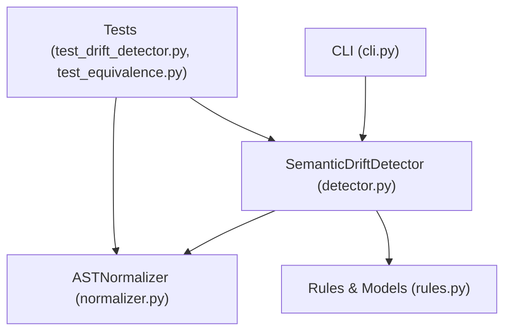
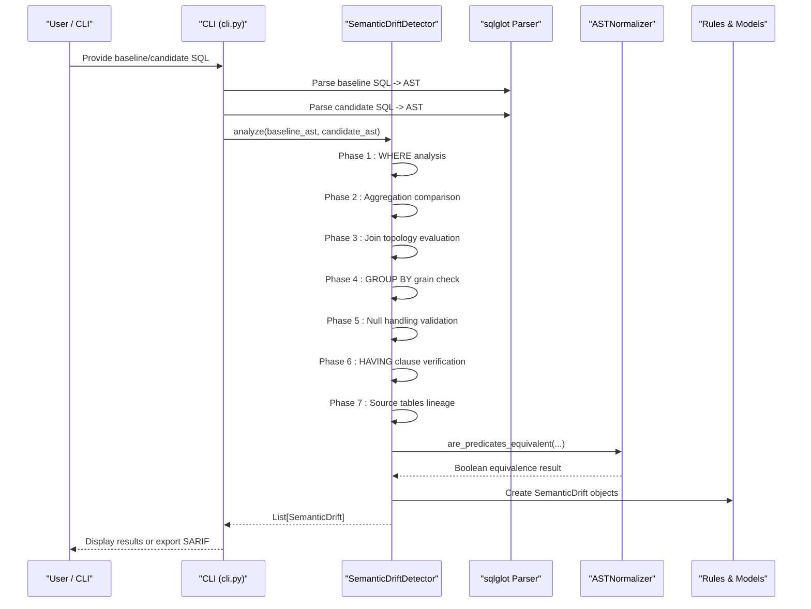
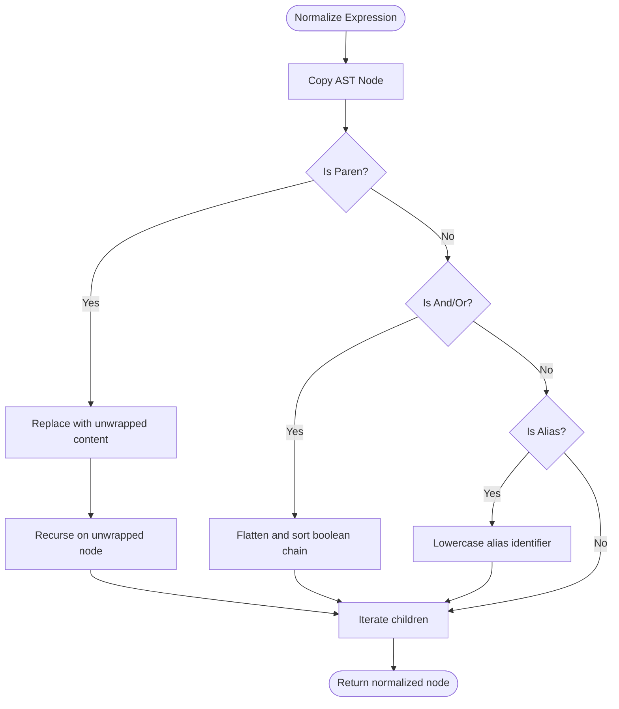
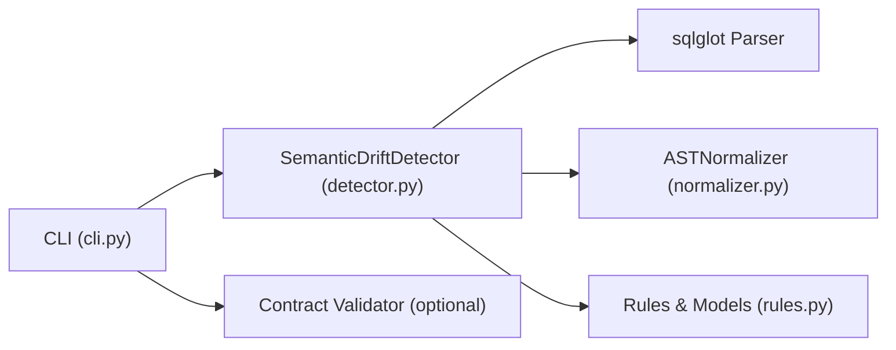

# Drift Detection Engine

<cite>
**Referenced Files in This Document**
- [detector.py](file://semantic_reliability/testing/drift/detector.py)
- [normalizer.py](file://semantic_reliability/testing/drift/normalizer.py)
- [rules.py](file://semantic_reliability/testing/drift/rules.py)
- [cli.py](file://semantic_reliability/cli.py)
- [test_drift_detector.py](file://tests/test_drift_detector.py)
- [test_equivalence.py](file://tests/test_equivalence.py)
</cite>

## Table of Contents
1. [Introduction](#introduction)
2. [Project Structure](#project-structure)
3. [Core Components](#core-components)
4. [Architecture Overview](#architecture-overview)
5. [Detailed Component Analysis](#detailed-component-analysis)
6. [Dependency Analysis](#dependency-analysis)
7. [Performance Considerations](#performance-considerations)
8. [Troubleshooting Guide](#troubleshooting-guide)
9. [Conclusion](#conclusion)

## Introduction
This document explains the drift detection engine that performs AST-based comparison between baseline and candidate SQL queries to detect semantic changes. The core class, SemanticDriftDetector, parses both SQL statements into ASTs and runs seven analysis phases: WHERE clause analysis, aggregation comparison, join topology evaluation, GROUP BY grain checking, null handling validation, HAVING clause verification, and source table lineage tracking. It uses ASTNormalizer to normalize expressions for semantic equivalence checks (e.g., commutative AND/OR chains, redundant parentheses). The system reports drifts with severity levels, types, business impact, and remediation guidance.

## Project Structure
The drift detection engine is implemented under the testing.drift package with three primary modules:
- detector.py: Implements SemanticDriftDetector and its seven analysis phases.
- normalizer.py: Provides AST normalization utilities for semantic equivalence.
- rules.py: Defines drift severity, drift type enums, and the SemanticDrift data model.

Integration points include:
- cli.py: A command-line interface that invokes the detector and optionally validates invariant contracts.
- tests: Unit tests demonstrating usage and expected behaviors for common drift scenarios.

**Diagram sources**
- [cli.py:50-131](file://semantic_reliability/cli.py#L50-L131)
- [detector.py:1-46](file://semantic_reliability/testing/drift/detector.py#L1-L46)
- [normalizer.py:1-93](file://semantic_reliability/testing/drift/normalizer.py#L1-L93)
- [rules.py:1-41](file://semantic_reliability/testing/drift/rules.py#L1-L41)
- [test_drift_detector.py:1-84](file://tests/test_drift_detector.py#L1-L84)
- [test_equivalence.py:1-44](file://tests/test_equivalence.py#L1-L44)

**Section sources**
- [detector.py:1-46](file://semantic_reliability/testing/drift/detector.py#L1-L46)
- [normalizer.py:1-93](file://semantic_reliability/testing/drift/normalizer.py#L1-L93)
- [rules.py:1-41](file://semantic_reliability/testing/drift/rules.py#L1-L41)
- [cli.py:50-131](file://semantic_reliability/cli.py#L50-L131)
- [test_drift_detector.py:1-84](file://tests/test_drift_detector.py#L1-L84)
- [test_equivalence.py:1-44](file://tests/test_equivalence.py#L1-L44)

## Core Components
- SemanticDriftDetector: Parses baseline and candidate SQL into ASTs and executes seven analysis phases to identify semantic drifts. Each phase returns a list of SemanticDrift objects describing the issue, severity, component, summary, details, business impact, snippets, and remediation.
- ASTNormalizer: Canonicalizes AST nodes by unwrapping redundant parentheses, flattening and sorting commutative boolean chains (AND/OR), and lowering alias identifiers. Provides are_predicates_equivalent for robust predicate comparisons.
- Rules: Enumerates drift severities (FATAL, CRITICAL, HIGH, MEDIUM, LOW, INFO) and drift types (e.g., FILTER_REMOVAL, AGGREGATION_FUNCTION_SHIFT, GRAIN_DRIFT). Defines the SemanticDrift Pydantic model used across the engine.

Key responsibilities:
- Parse SQL using sqlglot into ASTs.
- Compare AST structures and semantics across seven relational algebra components.
- Normalize predicates to avoid false positives from cosmetic differences.
- Report structured drift findings with actionable remediation.

**Section sources**
- [detector.py:9-46](file://semantic_reliability/testing/drift/detector.py#L9-L46)
- [normalizer.py:6-93](file://semantic_reliability/testing/drift/normalizer.py#L6-L93)
- [rules.py:6-41](file://semantic_reliability/testing/drift/rules.py#L6-L41)

## Architecture Overview
The engine follows a pipeline architecture:
- Input: Baseline SQL and candidate SQL strings.
- Parsing: Convert both to ASTs via sqlglot.
- Analysis: Run seven independent analyzers over the ASTs.
- Normalization: Use ASTNormalizer for semantic equivalence where needed.
- Output: List of SemanticDrift instances with rich metadata.

**Diagram sources**
- [cli.py:50-131](file://semantic_reliability/cli.py#L50-L131)
- [detector.py:12-46](file://semantic_reliability/testing/drift/detector.py#L12-L46)
- [normalizer.py:77-93](file://semantic_reliability/testing/drift/normalizer.py#L77-L93)
- [rules.py:30-41](file://semantic_reliability/testing/drift/rules.py#L30-L41)

## Detailed Component Analysis

### AST Normalization Process (ASTNormalizer)
ASTNormalizer ensures semantic equivalence by canonicalizing AST nodes:
- Unwrap redundant parentheses to reduce structural noise.
- Flatten and sort commutative boolean chains (AND/OR) so order does not affect equivalence.
- Lowercase alias identifiers to ignore case differences.
- Recursively process all child expressions.
- Provide are_predicates_equivalent to compare two predicates after normalization.

Complexity considerations:
- Normalization traverses the AST once per node; time complexity is O(N) where N is the number of AST nodes.
- Sorting boolean chains adds overhead proportional to the number of conjuncts/disjuncts; typically small in practice.

**Diagram sources**
- [normalizer.py:9-38](file://semantic_reliability/testing/drift/normalizer.py#L9-L38)
- [normalizer.py:40-76](file://semantic_reliability/testing/drift/normalizer.py#L40-L76)

**Section sources**
- [normalizer.py:6-93](file://semantic_reliability/testing/drift/normalizer.py#L6-L93)

### Seven Analysis Phases in SemanticDriftDetector

#### 1. WHERE Clause Analysis
Detects filter removal, addition, or semantic logic shifts:
- If baseline has WHERE but candidate lacks it: FATAL drift indicating unfiltered aggregation risk.
- If candidate introduces new filters not present in baseline: HIGH drift indicating population restriction.
- If both have WHERE but differ semantically: CRITICAL drift indicating changed population criteria. Uses ASTNormalizer.are_predicates_equivalent to avoid false positives from commutativity or parentheses.

Common drift scenario: Filter removal leading to metric inflation.

**Section sources**
- [detector.py:48-91](file://semantic_reliability/testing/drift/detector.py#L48-L91)
- [test_drift_detector.py:17-28](file://tests/test_drift_detector.py#L17-L28)

#### 2. Aggregation Comparison
Compares aggregation functions and their payloads:
- Detects changes in aggregation function types (e.g., SUM vs AVG vs COUNT): HIGH drift indicating altered mathematical computation.
- Detects changes in expressions inside aggregations when function types match: HIGH drift indicating modified operands or conditions.

Common drift scenario: Changing SUM to AVG alters metric semantics.

**Section sources**
- [detector.py:93-131](file://semantic_reliability/testing/drift/detector.py#L93-L131)
- [test_drift_detector.py:46-57](file://tests/test_drift_detector.py#L46-L57)

#### 3. Join Topology Evaluation
Evaluates join count and predicates:
- If join counts differ: HIGH drift indicating potential fan-out or record loss.
- If a non-CROSS join lacks ON/USING: FATAL drift indicating Cartesian product explosion risk.

Common drift scenario: Missing join predicate causing duplicate counting.

**Section sources**
- [detector.py:133-164](file://semantic_reliability/testing/drift/detector.py#L133-L164)
- [test_drift_detector.py:74-78](file://tests/test_drift_detector.py#L74-L78)

#### 4. GROUP BY Grain Checking
Checks reporting grain dimensions:
- Compares GROUP BY expressions; if they differ: CRITICAL drift indicating output dataset grain change, which can break downstream models and BI.

Common drift scenario: Removing a grouping dimension shifts granularity.

**Section sources**
- [detector.py:166-187](file://semantic_reliability/testing/drift/detector.py#L166-L187)
- [test_drift_detector.py:60-71](file://tests/test_drift_detector.py#L60-L71)

#### 5. Null Handling Validation
Validates COALESCE presence:
- If candidate reduces COALESCE calls relative to baseline: MEDIUM drift indicating potential NULL propagation risks in calculations.

Common drift scenario: Dropping coalesce defaults leads to unexpected NULL aggregates.

**Section sources**
- [detector.py:189-205](file://semantic_reliability/testing/drift/detector.py#L189-L205)

#### 6. HAVING Clause Verification
Verifies post-aggregation filters:
- Detects presence/absence or changes in HAVING clauses: HIGH drift indicating altered group retention thresholds.

Common drift scenario: Modifying post-aggregation filters changes final output sets.

**Section sources**
- [detector.py:207-225](file://semantic_reliability/testing/drift/detector.py#L207-L225)

#### 7. Source Table Lineage Tracking
Tracks FROM/JOIN table references:
- Compares set of table names; if different: HIGH drift indicating upstream dependency shifts that may alter metric sources.

Common drift scenario: Switching to staging or deprecated tables changes lineage.

**Section sources**
- [detector.py:227-245](file://semantic_reliability/testing/drift/detector.py#L227-L245)

### Example Drift Scenarios
- Filter removal: Baseline includes WHERE constraints; candidate removes them entirely, triggering FATAL drift.
- Aggregation function changes: Baseline uses SUM; candidate switches to AVG, triggering HIGH drift.
- Join predicate mutations: Candidate omits ON clause in a JOIN, triggering FATAL drift due to Cartesian product risk.
- Grain shifts: Candidate removes a GROUP BY dimension, triggering CRITICAL drift affecting downstream outputs.

These scenarios are validated in unit tests and demonstrate real-world impacts on metrics and dashboards.

**Section sources**
- [test_drift_detector.py:17-78](file://tests/test_drift_detector.py#L17-L78)

### Equivalence Testing and Normalizer Usage
Tests confirm that commutative AND/OR predicates and redundant parentheses do not cause false positives:
- Commutative AND/OR reorderings are treated as equivalent.
- Redundant parentheses are unwrapped before comparison.
- ASTNormalizer.are_predicates_equivalent is used to validate logical equivalence.

**Section sources**
- [test_equivalence.py:7-43](file://tests/test_equivalence.py#L7-L43)
- [normalizer.py:77-93](file://semantic_reliability/testing/drift/normalizer.py#L77-L93)

## Dependency Analysis
The detector depends on:
- sqlglot for parsing SQL into ASTs.
- ASTNormalizer for semantic equivalence checks.
- Rules module for severity/type enums and the SemanticDrift model.

The CLI integrates the detector and optionally validates invariant contracts, then formats and exports results.

**Diagram sources**
- [detector.py:1-46](file://semantic_reliability/testing/drift/detector.py#L1-L46)
- [normalizer.py:1-93](file://semantic_reliability/testing/drift/normalizer.py#L1-L93)
- [rules.py:1-41](file://semantic_reliability/testing/drift/rules.py#L1-L41)
- [cli.py:50-131](file://semantic_reliability/cli.py#L50-L131)

**Section sources**
- [detector.py:1-46](file://semantic_reliability/testing/drift/detector.py#L1-L46)
- [cli.py:50-131](file://semantic_reliability/cli.py#L50-L131)

## Performance Considerations
- AST traversal: Each analyzer scans the AST once; overall complexity scales linearly with AST size. For large SQL statements, ensure AST depth and node count remain manageable.
- Predicate normalization: Sorting boolean chains adds overhead proportional to the number of conjuncts/disjuncts. Keep WHERE/HAVING predicates concise to minimize sorting cost.
- Memory usage: Creating normalized copies of AST nodes increases memory usage. Reuse ASTs where possible and avoid unnecessary deep copies outside normalization.
- Dialect parsing: Passing an explicit dialect to sqlglot can improve parse accuracy and reduce error retries.
- Batch processing: When comparing many candidates against a baseline, reuse the baseline AST and only parse candidates incrementally.
- Early exits: If critical drifts are found early (e.g., missing WHERE), consider short-circuiting further analysis in custom wrappers to save compute.

[No sources needed since this section provides general guidance]

## Troubleshooting Guide
Common issues and resolutions:
- False positives from predicate ordering: Ensure ASTNormalizer.are_predicates_equivalent is used for WHERE/HAVING/ON comparisons to handle commutativity and parentheses.
- Unexpected drifts due to aliases: Aliases are lowercased during normalization; verify that alias casing differences are not intentional requirements.
- Missing join predicates: If a JOIN lacks ON/USING, the engine flags FATAL drift; add explicit join conditions to prevent Cartesian products.
- Aggregation mismatches: Confirm that aggregation functions and their payloads match baseline definitions to avoid metric calculation drift.
- Grain changes: Validate GROUP BY dimensions to maintain consistent reporting granularity.

Remediation tips:
- Restore removed filters or create dedicated unfiltered models when necessary.
- Align aggregation formulas with canonical business definitions.
- Add explicit ON clauses to joins to avoid cartesian explosions.
- Preserve required grouping dimensions to maintain downstream compatibility.
- Retain COALESCE defaults to ensure NULL-safe calculations.

**Section sources**
- [detector.py:48-245](file://semantic_reliability/testing/drift/detector.py#L48-L245)
- [test_drift_detector.py:17-78](file://tests/test_drift_detector.py#L17-L78)
- [test_equivalence.py:7-43](file://tests/test_equivalence.py#L7-L43)

## Conclusion
The drift detection engine provides robust, AST-based semantic comparison between baseline and candidate SQL queries through seven focused analysis phases. By leveraging AST normalization for semantic equivalence, it minimizes false positives while flagging high-impact changes such as filter removal, aggregation shifts, join predicate mutations, and grain changes. The structured drift reports include severity, business impact, and remediation guidance, enabling teams to maintain metric reliability at scale. Integrating the engine via the CLI supports practical workflows and optional contract validation for additional assurance.

[No sources needed since this section summarizes without analyzing specific files]