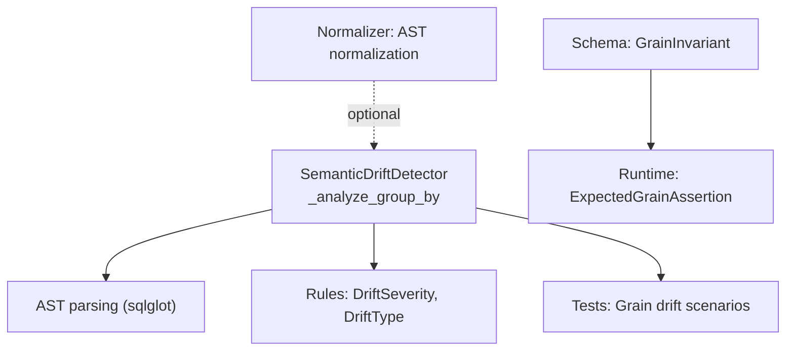
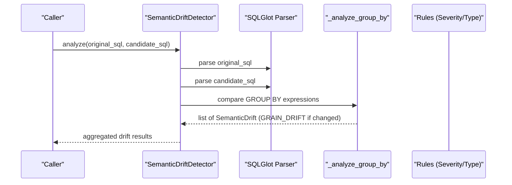
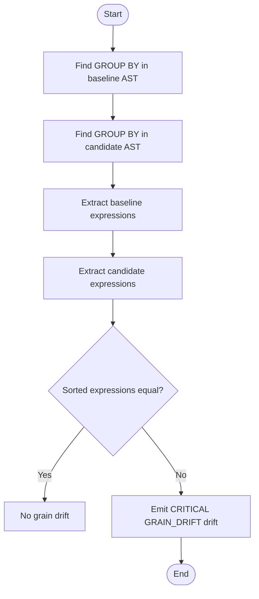
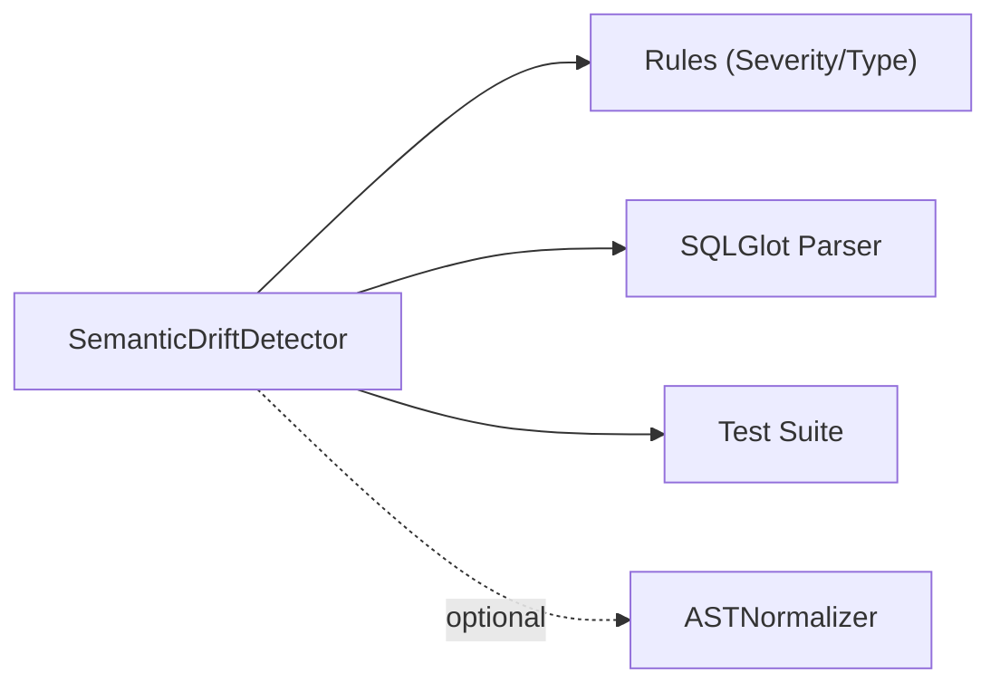

# GROUP BY Analysis

<cite>
**Referenced Files in This Document**
- [detector.py](file://semantic_reliability/testing/drift/detector.py)
- [rules.py](file://semantic_reliability/testing/drift/rules.py)
- [normalizer.py](file://semantic_reliability/testing/drift/normalizer.py)
- [test_drift_detector.py](file://tests/test_drift_detector.py)
- [schema.py](file://semantic_reliability/compiler/schema.py)
- [semantic.py](file://semantic_reliability/assertions/semantic.py)
</cite>

## Table of Contents
1. [Introduction](#introduction)
2. [Project Structure](#project-structure)
3. [Core Components](#core-components)
4. [Architecture Overview](#architecture-overview)
5. [Detailed Component Analysis](#detailed-component-analysis)
6. [Dependency Analysis](#dependency-analysis)
7. [Performance Considerations](#performance-considerations)
8. [Troubleshooting Guide](#troubleshooting-guide)
9. [Conclusion](#conclusion)
10. [Appendices](#appendices)

## Introduction
This document explains how GROUP BY clause analysis is performed during drift detection to identify grain shifts between a baseline and candidate SQL query. It focuses on the _analyze_group_by method, which compares grouping dimensions to detect changes that alter the reporting granularity. Maintaining stable GROUP BY structures is essential for consistent reporting, dimensional modeling, and BI tooling. The documentation covers why grain drift is classified as CRITICAL, provides examples of common grain drift scenarios, and offers guidance for maintaining stable grouping structures and interpreting drift reports.

## Project Structure
The GROUP BY analysis lives within the drift detection subsystem:
- Detection logic parses both baseline and candidate SQL into ASTs and inspects relational components, including GROUP BY.
- Rules define severity levels and drift types used across detectors.
- Normalization utilities help avoid false positives from cosmetic or commutative differences elsewhere in the pipeline.
- Tests validate expected behaviors for grain drift detection.
- Contracts and assertions define expected grains and enforce them at runtime.

**Diagram sources**
- [detector.py:166-187](file://semantic_reliability/testing/drift/detector.py#L166-L187)
- [rules.py:6-27](file://semantic_reliability/testing/drift/rules.py#L6-L27)
- [test_drift_detector.py:60-71](file://tests/test_drift_detector.py#L60-L71)
- [schema.py:10-13](file://semantic_reliability/compiler/schema.py#L10-L13)
- [semantic.py:123-166](file://semantic_reliability/assertions/semantic.py#L123-L166)

**Section sources**
- [detector.py:1-46](file://semantic_reliability/testing/drift/detector.py#L1-L46)
- [rules.py:1-41](file://semantic_reliability/testing/drift/rules.py#L1-L41)
- [normalizer.py:1-93](file://semantic_reliability/testing/drift/normalizer.py#L1-L93)
- [test_drift_detector.py:1-84](file://tests/test_drift_detector.py#L1-L84)
- [schema.py:1-23](file://semantic_reliability/compiler/schema.py#L1-L23)
- [semantic.py:123-166](file://semantic_reliability/assertions/semantic.py#L123-L166)

## Core Components
- SemanticDriftDetector._analyze_group_by: Compares baseline and candidate GROUP BY expressions to detect grain drift.
- DriftSeverity.CRITICAL and DriftType.GRAIN_DRIFT: Severity and classification for grain changes.
- ASTNormalizer: Canonicalizes expressions to reduce false positives in other checks; not directly used by GROUP BY comparison but part of the same detection framework.
- GrainInvariant and ExpectedGrainAssertion: Define and enforce expected reporting grain at contract and runtime levels.

Key responsibilities:
- Extract GROUP BY expressions from both ASTs.
- Compare normalized expression lists to detect additions, removals, or modifications.
- Emit a CRITICAL drift when grouping dimensions change, with details and remediation guidance.

**Section sources**
- [detector.py:166-187](file://semantic_reliability/testing/drift/detector.py#L166-L187)
- [rules.py:6-27](file://semantic_reliability/testing/drift/rules.py#L6-L27)
- [normalizer.py:1-93](file://semantic_reliability/testing/drift/normalizer.py#L1-L93)
- [schema.py:10-13](file://semantic_reliability/compiler/schema.py#L10-L13)
- [semantic.py:123-166](file://semantic_reliability/assertions/semantic.py#L123-L166)

## Architecture Overview
The GROUP BY analysis is one step in a comprehensive semantic drift inspection pipeline. The detector parses both queries, then sequentially analyzes WHERE, aggregations, joins, GROUP BY, null handling, HAVING, and source tables. For GROUP BY, it extracts grouping expressions and compares them to detect grain drift.

**Diagram sources**
- [detector.py:12-46](file://semantic_reliability/testing/drift/detector.py#L12-L46)
- [detector.py:166-187](file://semantic_reliability/testing/drift/detector.py#L166-L187)
- [rules.py:6-27](file://semantic_reliability/testing/drift/rules.py#L6-L27)

## Detailed Component Analysis

### GROUP BY Analysis: _analyze_group_by
The method identifies grain drift by comparing the set of grouping expressions in the baseline and candidate queries. If they differ, it emits a CRITICAL GRAIN_DRIFT drift with details about baseline and candidate grains and business impact.

**Diagram sources**
- [detector.py:166-187](file://semantic_reliability/testing/drift/detector.py#L166-L187)

Why this matters:
- GROUP BY defines the reporting grain—the level of detail at which metrics are computed.
- Any change to grouping dimensions can alter downstream model keys, BI visualizations, and aggregation semantics.
- The detector classifies such changes as CRITICAL because they can silently break dashboards and analytical contracts.

Examples of grain drift scenarios detected by this logic:
- Removing a time dimension: Baseline groups by customer_id and month; candidate groups only by customer_id.
- Adding a new dimension: Baseline groups by customer_id; candidate adds region or channel.
- Changing an expression: Baseline groups by DATE_TRUNC('month', transaction_date); candidate switches to week-level truncation or uses a different column.
- Reordering or aliasing: While sorting helps normalize comparisons, changing the underlying expression still triggers drift.

Business impact and remediation:
- Impact: Output dataset grain changes; downstream dimensional models and BI tools may break due to mismatched keys or unexpected aggregation levels.
- Remediation: Restore required grouping dimensions to maintain stable reporting granularity.

**Section sources**
- [detector.py:166-187](file://semantic_reliability/testing/drift/detector.py#L166-L187)
- [test_drift_detector.py:60-71](file://tests/test_drift_detector.py#L60-L71)

### Severity Classification: CRITICAL GRAIN_DRIFT
- DriftSeverity.CRITICAL indicates high-risk changes that can cause significant downstream failures.
- DriftType.GRAIN_DRIFT specifically flags alterations to grouping dimensions.
- The detector includes business_impact messaging to emphasize risks to dimensional models and BI.

**Section sources**
- [rules.py:6-27](file://semantic_reliability/testing/drift/rules.py#L6-L27)
- [detector.py:166-187](file://semantic_reliability/testing/drift/detector.py#L166-L187)

### Supporting Components: Normalization and Assertions
- ASTNormalizer: Provides canonicalization for predicates and expressions elsewhere in the pipeline to reduce false positives.
- GrainInvariant: Declares required dimensions that define the reporting grain for a metric.
- ExpectedGrainAssertion: Enforces strict reporting grain at runtime by checking for duplicate rows under declared grain columns.

These components complement GROUP BY drift detection by defining expected grains and validating them during execution.

**Section sources**
- [normalizer.py:1-93](file://semantic_reliability/testing/drift/normalizer.py#L1-L93)
- [schema.py:10-13](file://semantic_reliability/compiler/schema.py#L10-L13)
- [semantic.py:123-166](file://semantic_reliability/assertions/semantic.py#L123-L166)

## Dependency Analysis
GROUP BY analysis depends on:
- SQLGlot for AST parsing and expression extraction.
- Rules module for severity and drift type definitions.
- Test suite for validating expected behavior.
- Optional normalization utilities for broader drift detection stability.

**Diagram sources**
- [detector.py:1-46](file://semantic_reliability/testing/drift/detector.py#L1-L46)
- [rules.py:1-41](file://semantic_reliability/testing/drift/rules.py#L1-L41)
- [normalizer.py:1-93](file://semantic_reliability/testing/drift/normalizer.py#L1-L93)
- [test_drift_detector.py:1-84](file://tests/test_drift_detector.py#L1-L84)

**Section sources**
- [detector.py:1-46](file://semantic_reliability/testing/drift/detector.py#L1-L46)
- [rules.py:1-41](file://semantic_reliability/testing/drift/rules.py#L1-L41)
- [normalizer.py:1-93](file://semantic_reliability/testing/drift/normalizer.py#L1-L93)
- [test_drift_detector.py:1-84](file://tests/test_drift_detector.py#L1-L84)

## Performance Considerations
- Parsing two SQL statements per analysis is lightweight relative to full query execution.
- GROUP BY comparison involves extracting and sorting expression strings; complexity is proportional to the number and size of grouping expressions.
- Avoid unnecessary re-parsing by caching ASTs where appropriate in higher-level orchestrators.
- Keep grouping expressions concise and stable to minimize drift noise and improve readability of reports.

[No sources needed since this section provides general guidance]

## Troubleshooting Guide
Common issues and how to interpret drift reports:
- Grain drift detected: Review the reported baseline vs candidate grouping expressions. Ensure any changes align with approved metric updates.
- Unexpected grain changes: Check for accidental removal of time or entity dimensions, or unintended expression modifications (e.g., switching date truncation levels).
- Downstream model breaks: Validate that dimensional keys in downstream models match the current reporting grain. Update keys or revert grouping changes accordingly.
- Runtime grain violations: Use ExpectedGrainAssertion to catch duplicate grain rows at runtime, indicating potential grouping or deduplication issues.

Remediation steps:
- Restore required grouping dimensions to match the baseline grain.
- If intentionally changing grain, update contracts, downstream models, and BI definitions consistently.
- Add explicit tests or assertions to guard against future grain drift.

**Section sources**
- [detector.py:166-187](file://semantic_reliability/testing/drift/detector.py#L166-L187)
- [semantic.py:123-166](file://semantic_reliability/assertions/semantic.py#L123-L166)

## Conclusion
GROUP BY analysis is a critical safeguard for maintaining consistent reporting granularity. By detecting grain shifts early and classifying them as CRITICAL, the system protects downstream dimensional models and BI tools from silent failures. Teams should treat GROUP BY stability as a core invariant, enforce it via contracts and assertions, and respond promptly to drift reports to preserve reliable analytics.

[No sources needed since this section summarizes without analyzing specific files]

## Appendices

### Example Scenarios and Interpretation
- Removing a time dimension:
  - Baseline: GROUP BY customer_id, DATE_TRUNC('month', transaction_date)
  - Candidate: GROUP BY customer_id
  - Result: CRITICAL GRAIN_DRIFT; report will aggregate at a coarser grain, potentially inflating metrics.
- Adding a new dimension:
  - Baseline: GROUP BY customer_id
  - Candidate: GROUP BY customer_id, region
  - Result: CRITICAL GRAIN_DRIFT; report splits by region, affecting totals and trends.
- Changing grouping expression:
  - Baseline: GROUP BY DATE_TRUNC('month', transaction_date)
  - Candidate: GROUP BY DATE_TRUNC('week', transaction_date)
  - Result: CRITICAL GRAIN_DRIFT; time granularity changes, impacting period-over-period comparisons.

Interpretation tips:
- Focus on the “Baseline grain” vs “Candidate grain” details in the drift report.
- Align changes with business approvals and update all dependent artifacts (contracts, models, dashboards).
- Use ExpectedGrainAssertion to validate runtime grain integrity.

**Section sources**
- [test_drift_detector.py:60-71](file://tests/test_drift_detector.py#L60-L71)
- [semantic.py:123-166](file://semantic_reliability/assertions/semantic.py#L123-L166)