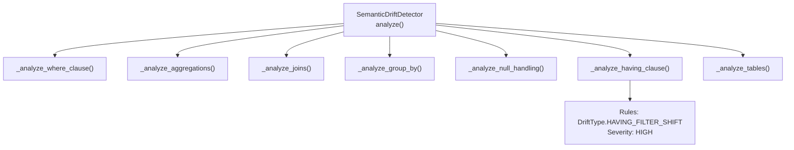
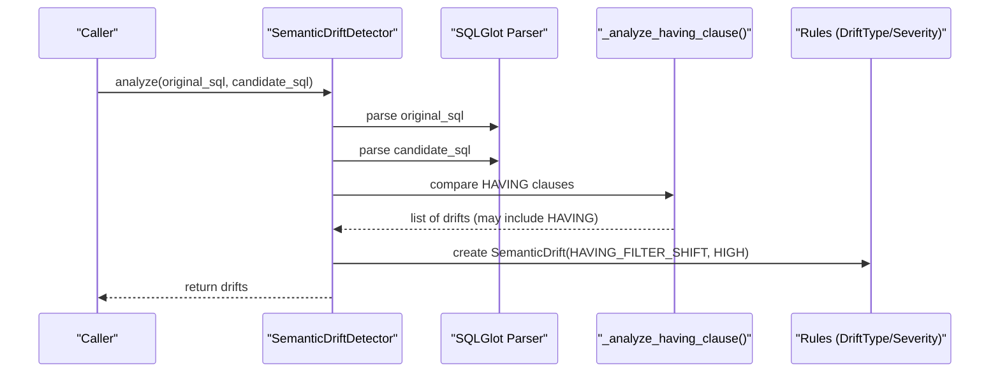
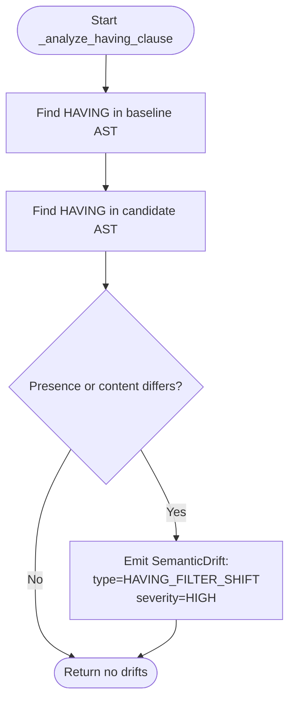
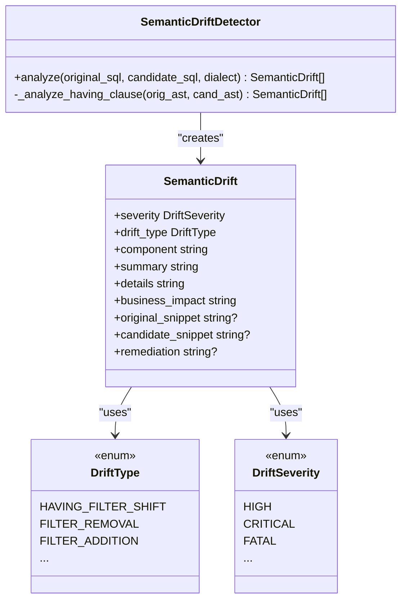
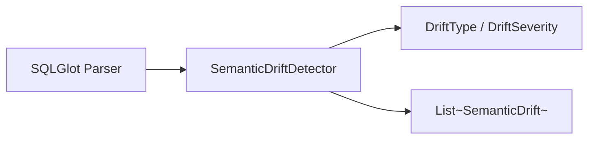

# HAVING Clause Analysis

<cite>
**Referenced Files in This Document**
- [detector.py](file://semantic_reliability/testing/drift/detector.py)
- [rules.py](file://semantic_reliability/testing/drift/rules.py)
- [normalizer.py](file://semantic_reliability/testing/drift/normalizer.py)
- [test_drift_detector.py](file://tests/test_drift_detector.py)
</cite>

## Table of Contents
1. [Introduction](#introduction)
2. [Project Structure](#project-structure)
3. [Core Components](#core-components)
4. [Architecture Overview](#architecture-overview)
5. [Detailed Component Analysis](#detailed-component-analysis)
6. [Dependency Analysis](#dependency-analysis)
7. [Performance Considerations](#performance-considerations)
8. [Troubleshooting Guide](#troubleshooting-guide)
9. [Conclusion](#conclusion)

## Introduction
This document explains how the drift detection system analyzes HAVING clauses to detect post-aggregation filter changes between a baseline SQL and a candidate SQL. It clarifies the distinction between WHERE (pre-aggregation) and HAVING (post-aggregation) filters, why HAVING changes are significant for group retention, and how the detector classifies these changes as HIGH severity with concrete business impact. It also provides practical guidance on maintaining stable post-aggregation filters and interpreting HAVING drift reports.

## Project Structure
The HAVING clause analysis is implemented within the semantic drift detection module. The key files involved are:
- Drift detection orchestration and per-clause analyzers
- Drift types and severities used across detectors
- AST normalization utilities that help avoid false positives in predicate comparisons
- Tests that validate drift detection behavior

**Diagram sources**
- [detector.py:12-46](file://semantic_reliability/testing/drift/detector.py#L12-L46)
- [detector.py:207-225](file://semantic_reliability/testing/drift/detector.py#L207-L225)
- [rules.py:6-27](file://semantic_reliability/testing/drift/rules.py#L6-L27)

**Section sources**
- [detector.py:12-46](file://semantic_reliability/testing/drift/detector.py#L12-L46)
- [rules.py:6-27](file://semantic_reliability/testing/drift/rules.py#L6-L27)

## Core Components
- SemanticDriftDetector: Orchestrates parsing and runs multiple clause-level analyses including HAVING.
- _analyze_having_clause: Detects presence/absence or modification of HAVING predicates after aggregation.
- Rules (DriftType, DriftSeverity): Define the HAVING change type and its severity classification.
- ASTNormalizer: Normalizes expressions to reduce false positives when comparing predicates.

Key responsibilities:
- Parse baseline and candidate SQL into ASTs.
- Compare HAVING clauses for additions, removals, or modifications.
- Emit a SemanticDrift with appropriate metadata and remediation guidance.

**Section sources**
- [detector.py:12-46](file://semantic_reliability/testing/drift/detector.py#L12-L46)
- [detector.py:207-225](file://semantic_reliability/testing/drift/detector.py#L207-L225)
- [rules.py:6-27](file://semantic_reliability/testing/drift/rules.py#L6-L27)
- [normalizer.py:6-93](file://semantic_reliability/testing/drift/normalizer.py#L6-L93)

## Architecture Overview
The HAVING analysis is one step in a multi-stage pipeline that inspects different parts of the SQL AST. For HAVING specifically:
- The detector extracts HAVING nodes from both ASTs.
- It compares their presence and textual representation to identify changes.
- If any difference is found, it emits a drift record indicating a post-aggregation filter shift.

**Diagram sources**
- [detector.py:12-46](file://semantic_reliability/testing/drift/detector.py#L12-L46)
- [detector.py:207-225](file://semantic_reliability/testing/drift/detector.py#L207-L225)
- [rules.py:6-27](file://semantic_reliability/testing/drift/rules.py#L6-L27)

## Detailed Component Analysis

### HAVING Clause Detection Logic
The HAVING analyzer performs three checks:
- Removal: Baseline has HAVING; candidate does not.
- Addition: Candidate adds HAVING where baseline had none.
- Modification: Both have HAVING but their SQL representations differ.

When any of these conditions hold, it records a drift with:
- Type: HAVING_FILTER_SHIFT
- Severity: HIGH
- Business impact: Post-aggregation group retention altered
- Remediation: Confirm post-aggregation business thresholds

**Diagram sources**
- [detector.py:207-225](file://semantic_reliability/testing/drift/detector.py#L207-L225)

**Section sources**
- [detector.py:207-225](file://semantic_reliability/testing/drift/detector.py#L207-L225)

### Distinction Between WHERE and HAVING Filters
- WHERE (pre-aggregation): Filters rows before GROUP BY and aggregations. Changes here alter the input population to aggregates.
- HAVING (post-aggregation): Filters groups after aggregation. Changes here alter which groups survive the final output, directly affecting group retention.

Why this matters:
- A HAVING change can remove or add entire groups even if row-level data did not change.
- Typical use cases include minimum/maximum thresholds on aggregated metrics (e.g., only keep customers with at least N transactions).
- Because HAVING operates on grouped results, it is often the place where business rules like “only report active cohorts” or “exclude low-volume segments” are enforced.

**Section sources**
- [detector.py:48-91](file://semantic_reliability/testing/drift/detector.py#L48-L91)
- [detector.py:207-225](file://semantic_reliability/testing/drift/detector.py#L207-L225)

### HAVING Drift Scenarios and Business Impact
Common scenarios detected by the HAVING analyzer:
- Removing a minimum threshold: Dropping HAVING COUNT(...) >= N can inflate reported groups and distort ratios.
- Adding a maximum limit: Introducing HAVING SUM(...) <= M can exclude high-volume groups, reducing totals.
- Modifying group filtering logic: Changing conditions such as HAVING AVG(...) > X to HAVING AVG(...) > Y alters which groups are retained.

Business impact:
- Altered group retention changes downstream dashboards, KPIs, and cohort analyses.
- Can cause apparent metric spikes or drops without any underlying transactional changes.
- May break contracts or SLAs tied to specific group definitions.

Severity rationale:
- Classified as HIGH because post-aggregation filters commonly encode core business definitions for which groups count toward a metric.

**Section sources**
- [detector.py:207-225](file://semantic_reliability/testing/drift/detector.py#L207-L225)
- [rules.py:6-27](file://semantic_reliability/testing/drift/rules.py#L6-L27)

### Class and Data Model Relationships

**Diagram sources**
- [detector.py:9-46](file://semantic_reliability/testing/drift/detector.py#L9-L46)
- [detector.py:207-225](file://semantic_reliability/testing/drift/detector.py#L207-L225)
- [rules.py:6-41](file://semantic_reliability/testing/drift/rules.py#L6-L41)

**Section sources**
- [detector.py:9-46](file://semantic_reliability/testing/drift/detector.py#L9-L46)
- [rules.py:6-41](file://semantic_reliability/testing/drift/rules.py#L6-L41)

### Interpreting HAVING Drift Reports
When you see a HAVING_FILTER_SHIFT drift:
- Review the baseline vs. candidate HAVING snippets provided in the drift details.
- Determine whether the change intentionally modifies group eligibility (e.g., new minimum volume requirement).
- Validate downstream impacts on dashboards, contracts, and reporting granularity.
- Use the remediation guidance to confirm alignment with business policy or to revert unintended changes.

**Section sources**
- [detector.py:207-225](file://semantic_reliability/testing/drift/detector.py#L207-L225)

## Dependency Analysis
The HAVING analysis depends on:
- SQL parsing via an external library to build ASTs.
- Rule enums to classify drift type and severity.
- Optional normalization utilities for other comparators (not directly used for HAVING text comparison in this implementation).

**Diagram sources**
- [detector.py:1-7](file://semantic_reliability/testing/drift/detector.py#L1-L7)
- [detector.py:12-46](file://semantic_reliability/testing/drift/detector.py#L12-L46)
- [rules.py:6-27](file://semantic_reliability/testing/drift/rules.py#L6-L27)

**Section sources**
- [detector.py:1-7](file://semantic_reliability/testing/drift/detector.py#L1-L7)
- [rules.py:6-27](file://semantic_reliability/testing/drift/rules.py#L6-L27)

## Performance Considerations
- HAVING comparison uses direct SQL string equality of parsed nodes, which is fast and avoids expensive semantic equivalence checks.
- Parsing both SQL statements dominates runtime; ensure dialect is specified only when necessary.
- For large queries, consider caching normalized forms if future enhancements introduce deeper comparisons.

[No sources needed since this section provides general guidance]

## Troubleshooting Guide
Common issues and resolutions:
- False positives due to formatting: The current HAVING check compares node SQL strings; minor formatting differences may be treated as changes. Normalize whitespace and canonicalize expressions upstream if possible.
- Unexpected group loss/gain: Inspect the HAVING snippet pair in the drift details to understand which groups were added or removed.
- Misclassification risk: HAVING changes are classified as HIGH; verify whether the change is intentional and documented before approving.

Remediation steps:
- Restore the intended HAVING condition to match the business definition.
- If changing thresholds, update documentation and notify stakeholders.
- Add tests or assertions to guard against accidental HAVING drift in CI.

**Section sources**
- [detector.py:207-225](file://semantic_reliability/testing/drift/detector.py#L207-L225)
- [rules.py:6-27](file://semantic_reliability/testing/drift/rules.py#L6-L27)

## Conclusion
The HAVING clause analysis detects post-aggregation filter changes that directly affect group retention. By flagging additions, removals, and modifications as HIGH severity, the system helps prevent silent shifts in which groups contribute to metrics. Teams should treat HAVING changes as deliberate business decisions, validate downstream impacts, and maintain stable post-aggregation filters through code review and automated drift detection.

[No sources needed since this section summarizes without analyzing specific files]