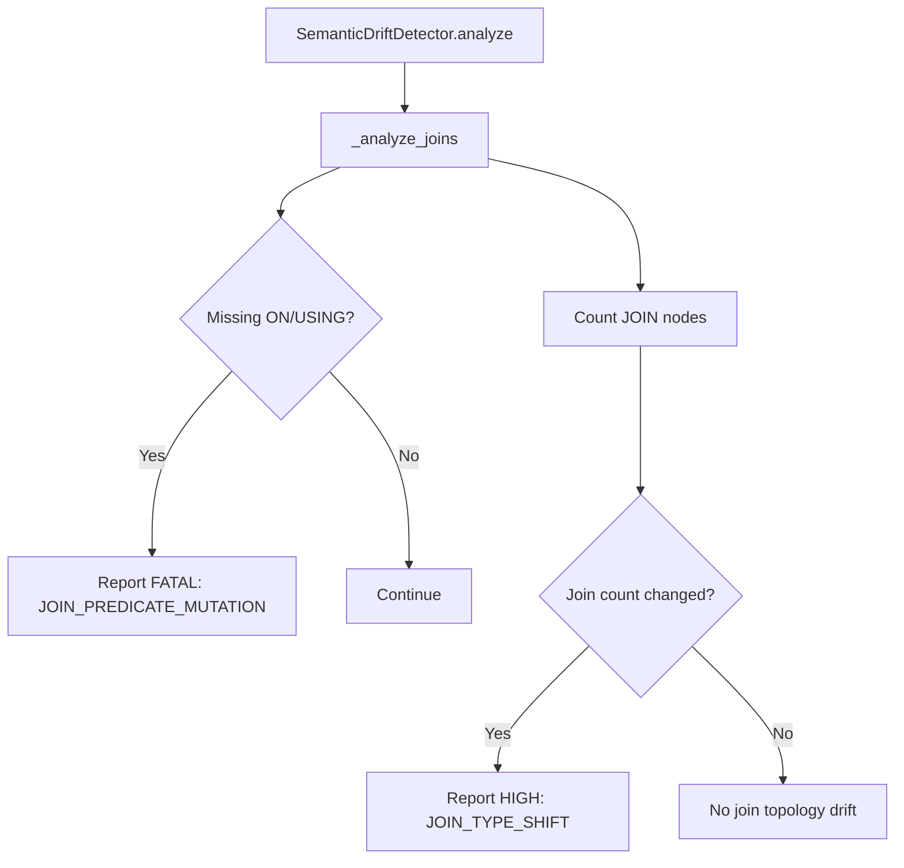
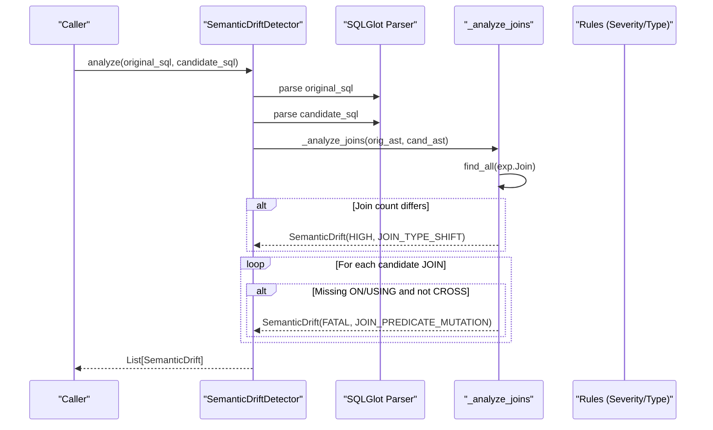
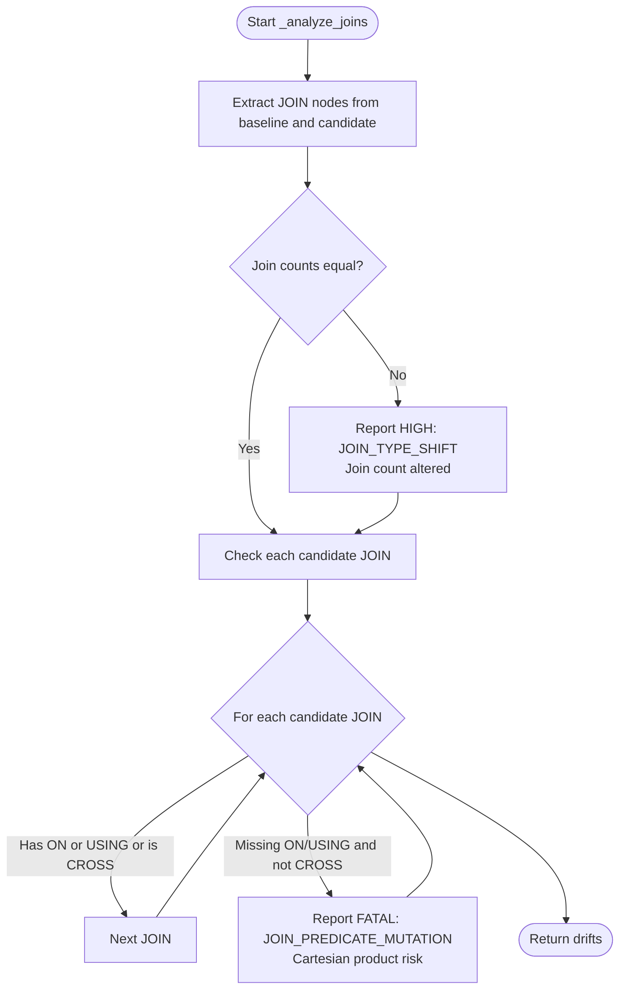
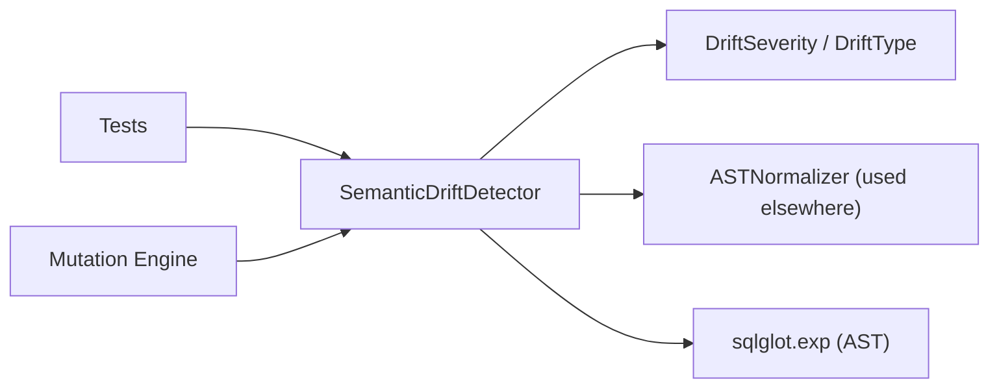

# Join Topology Analysis

<cite>
**Referenced Files in This Document**
- [detector.py](file://semantic_reliability/testing/drift/detector.py)
- [rules.py](file://semantic_reliability/testing/drift/rules.py)
- [normalizer.py](file://semantic_reliability/testing/drift/normalizer.py)
- [test_drift_detector.py](file://tests/test_drift_detector.py)
- [engine.py](file://semantic_reliability/testing/mutations/engine.py)
</cite>

## Table of Contents
1. [Introduction](#introduction)
2. [Project Structure](#project-structure)
3. [Core Components](#core-components)
4. [Architecture Overview](#architecture-overview)
5. [Detailed Component Analysis](#detailed-component-analysis)
6. [Dependency Analysis](#dependency-analysis)
7. [Performance Considerations](#performance-considerations)
8. [Troubleshooting Guide](#troubleshooting-guide)
9. [Conclusion](#conclusion)

## Introduction
This document explains how join topology analysis is performed during drift detection, focusing on the _analyze_joins method. It covers:
- Detection of join count changes (adding/removing joins)
- Detection of missing join predicates (missing ON/USING clauses) and the risk of Cartesian product explosions
- How join type shifts are identified
- The severity classification system and why missing predicates are classified as FATAL
- Examples of join topology drifts and guidance for diagnosing and preventing such issues

## Project Structure
The join topology analysis is implemented within the semantic drift detection pipeline. The key files involved are:
- Drift detector that parses SQL into an AST and inspects relational components
- Rules defining severity levels and drift types
- Normalizer that ensures logical equivalence checks avoid false positives from commutative or cosmetic differences
- Tests validating behavior for join predicate mutations
- Mutation engine used to simulate join predicate drops for testing

**Diagram sources**
- [detector.py:13-46](file://semantic_reliability/testing/drift/detector.py#L13-L46)
- [detector.py:134-164](file://semantic_reliability/testing/drift/detector.py#L134-L164)

**Section sources**
- [detector.py:13-46](file://semantic_reliability/testing/drift/detector.py#L13-L46)
- [rules.py:6-27](file://semantic_reliability/testing/drift/rules.py#L6-L27)

## Core Components
- SemanticDriftDetector: Orchestrates AST-level comparisons across WHERE, aggregations, joins, GROUP BY, null handling, HAVING, and source tables.
- _analyze_joins: Specifically inspects JOIN topology and predicates to detect topology changes and dangerous missing predicates.
- DriftSeverity and DriftType: Enumerations that classify the impact and category of detected drifts.
- ASTNormalizer: Ensures logical equivalence checks ignore cosmetic differences and reorder commutative boolean chains.

Key responsibilities:
- Parse baseline and candidate SQL into ASTs
- Extract all JOIN nodes and compare counts
- For each candidate JOIN, verify presence of ON or USING unless it is a CROSS join
- Emit SemanticDrift entries with appropriate severity and remediation guidance

**Section sources**
- [detector.py:13-46](file://semantic_reliability/testing/drift/detector.py#L13-L46)
- [detector.py:134-164](file://semantic_reliability/testing/drift/detector.py#L134-L164)
- [rules.py:6-27](file://semantic_reliability/testing/drift/rules.py#L6-L27)
- [normalizer.py:77-92](file://semantic_reliability/testing/drift/normalizer.py#L77-L92)

## Architecture Overview
The join topology analysis integrates into the broader drift detection workflow. The detector first normalizes and compares multiple SQL components; join analysis runs alongside other checks.

**Diagram sources**
- [detector.py:13-46](file://semantic_reliability/testing/drift/detector.py#L13-L46)
- [detector.py:134-164](file://semantic_reliability/testing/drift/detector.py#L134-L164)
- [rules.py:6-27](file://semantic_reliability/testing/drift/rules.py#L6-L27)

## Detailed Component Analysis

### _analyze_joins Method
Purpose:
- Detects changes in the number of joins between baseline and candidate SQL
- Flags missing ON/USING clauses on non-CROSS joins to prevent Cartesian product explosions
- Emits structured drift reports with severity, type, and remediation guidance

Behavior:
- Extracts all JOIN nodes from both ASTs
- If counts differ, emits a HIGH severity drift indicating a join topology change
- Iterates through candidate JOINs; if a JOIN lacks both ON and USING and is not explicitly CROSS, emits a FATAL drift for missing predicate

Why missing predicates are FATAL:
- Without ON/USING, a JOIN becomes a Cartesian product, multiplying rows and causing duplicate metric counting. This can drastically inflate metrics and break downstream analytics.

Example scenarios covered by this logic:
- Adding or removing a JOIN changes the join count
- Changing a JOIN type (e.g., INNER to LEFT) may alter cardinality and is captured by join count or related downstream checks
- Removing a JOIN condition (ON/USING) triggers a FATAL drift due to potential Cartesian explosion

**Diagram sources**
- [detector.py:134-164](file://semantic_reliability/testing/drift/detector.py#L134-L164)

**Section sources**
- [detector.py:134-164](file://semantic_reliability/testing/drift/detector.py#L134-L164)
- [rules.py:6-27](file://semantic_reliability/testing/drift/rules.py#L6-L27)

### Severity Classification System
- FATAL: Indicates severe data integrity risks, such as missing join predicates leading to Cartesian products. These must be addressed immediately.
- CRITICAL: Significant semantic changes, e.g., grain drift altering reporting dimensions.
- HIGH: Notable structural changes like join count alterations or filter additions/removals.
- MEDIUM/LOW/INFO: Lower-impact changes such as null handling adjustments or informational notes.

In join topology analysis:
- Missing ON/USING on non-CROSS joins → FATAL (JOIN_PREDICATE_MUTATION)
- Join count changes → HIGH (JOIN_TYPE_SHIFT)

**Section sources**
- [rules.py:6-27](file://semantic_reliability/testing/drift/rules.py#L6-L27)
- [detector.py:134-164](file://semantic_reliability/testing/drift/detector.py#L134-L164)

### Example Drift Scenarios
- Adding/removing joins: Detected via join count comparison; reported as HIGH severity topology shift.
- Changing join types: While explicit type comparison is not performed here, changing join types often alters join count semantics or downstream effects; ensure join count stability and correct predicates.
- Removing join conditions: Missing ON/USING triggers FATAL drift due to Cartesian product risk.

Validation examples:
- Test coverage includes verifying that dropping a JOIN predicate results in a FATAL drift of type JOIN_PREDICATE_MUTATION.

**Section sources**
- [test_drift_detector.py:74-78](file://tests/test_drift_detector.py#L74-L78)
- [engine.py:191-205](file://semantic_reliability/testing/mutations/engine.py#L191-L205)

## Dependency Analysis
The join topology analysis depends on:
- SQL parsing via SQLGlot to build ASTs
- AST traversal to locate JOIN nodes
- Rule definitions for severity and drift types
- Optional normalization utilities for predicate equivalence elsewhere in the pipeline

**Diagram sources**
- [detector.py:1-7](file://semantic_reliability/testing/drift/detector.py#L1-L7)
- [rules.py:1-27](file://semantic_reliability/testing/drift/rules.py#L1-L27)
- [normalizer.py:1-93](file://semantic_reliability/testing/drift/normalizer.py#L1-L93)

**Section sources**
- [detector.py:1-7](file://semantic_reliability/testing/drift/detector.py#L1-L7)
- [rules.py:1-27](file://semantic_reliability/testing/drift/rules.py#L1-L27)
- [normalizer.py:1-93](file://semantic_reliability/testing/drift/normalizer.py#L1-L93)

## Performance Considerations
- AST traversal cost scales with query complexity; join analysis iterates over all JOIN nodes once.
- Avoid excessive string operations; the implementation uses AST methods and minimal SQL string conversions.
- For very large queries, consider limiting analysis scope to relevant subqueries or using incremental parsing strategies.

[No sources needed since this section provides general guidance]

## Troubleshooting Guide
Common join-related drift issues and how to diagnose them:
- Missing ON/USING clause:
  - Symptom: FATAL drift with JOIN_PREDICATE_MUTATION
  - Impact: Cartesian product explosion causing duplicate metric counting
  - Action: Add explicit ON clause to re-establish proper join relationships
- Join count changed:
  - Symptom: HIGH drift with JOIN_TYPE_SHIFT
  - Impact: Altered table relationships; potential fan-out or record loss
  - Action: Verify intended join cardinality and ensure joins match business requirements
- Unexpected Cartesian joins:
  - Symptom: Metrics spike unexpectedly
  - Action: Inspect candidate SQL for any JOIN without ON/USING; confirm CROSS JOIN intent

Diagnostic steps:
- Run drift detection comparing baseline and candidate SQL
- Review reported drifts for JOIN_PREDICATE_MUTATION and JOIN_TYPE_SHIFT
- Validate join predicates and ensure they match baseline semantics
- Use mutation tests to simulate and validate detection of join predicate drops

**Section sources**
- [detector.py:134-164](file://semantic_reliability/testing/drift/detector.py#L134-L164)
- [test_drift_detector.py:74-78](file://tests/test_drift_detector.py#L74-L78)
- [engine.py:191-205](file://semantic_reliability/testing/mutations/engine.py#L191-L205)

## Conclusion
The _analyze_joins method provides robust protection against critical join topology drifts by:
- Detecting changes in join count and flagging them as significant topology shifts
- Enforcing the presence of ON/USING clauses on non-CROSS joins to prevent catastrophic Cartesian product explosions
- Classifying missing predicates as FATAL due to their severe impact on metric correctness

Best practices for maintaining stable join topologies:
- Always specify explicit ON or USING clauses for joins
- Treat any change in join count as a high-risk modification requiring review
- Validate join semantics against business definitions and baseline models
- Use drift detection and mutation tests to catch accidental predicate removals early

[No sources needed since this section summarizes without analyzing specific files]