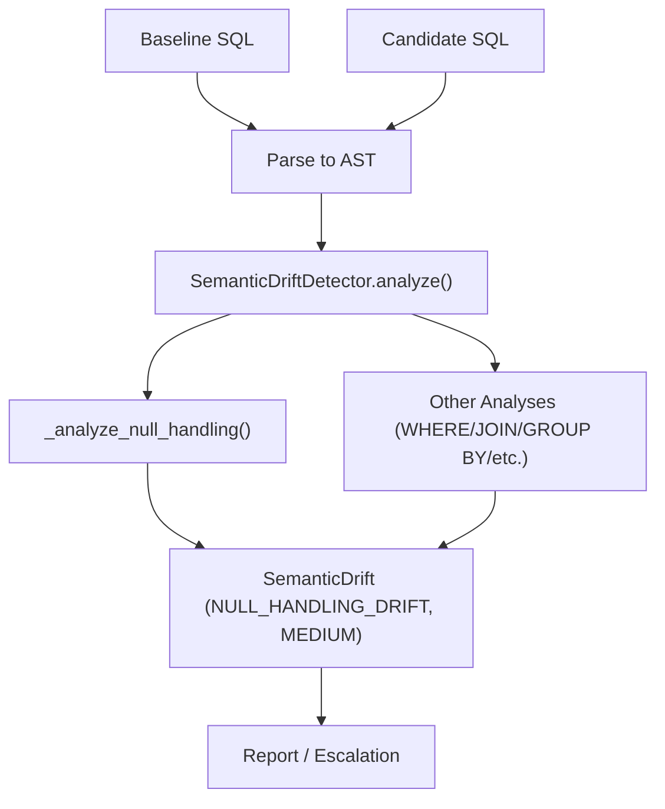
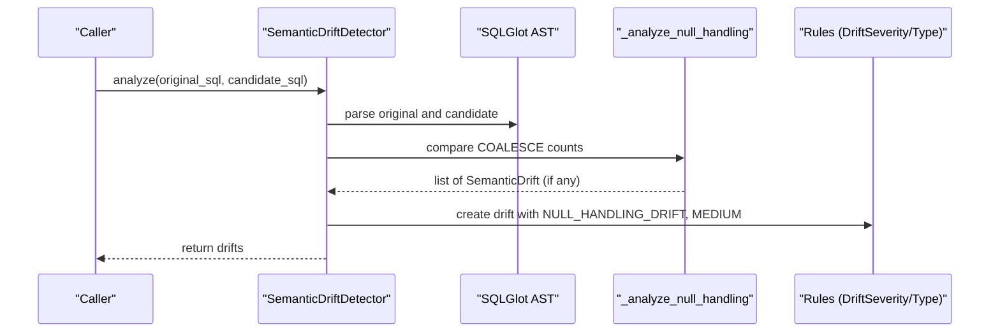
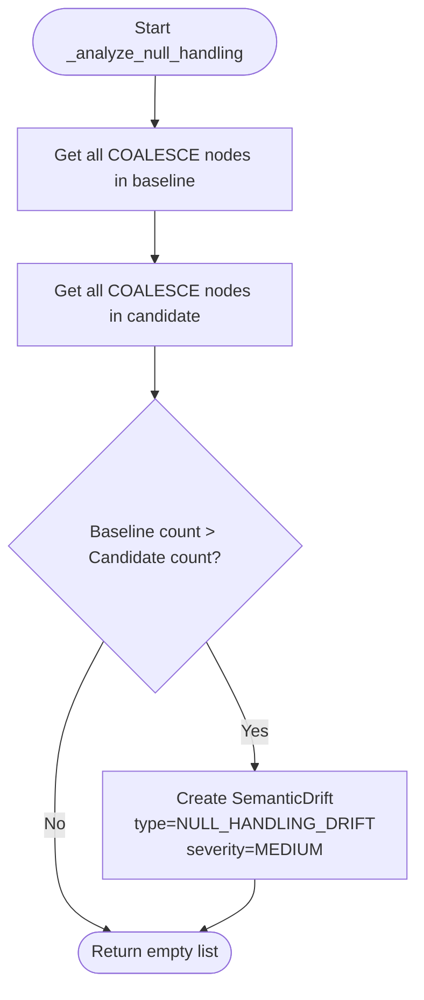
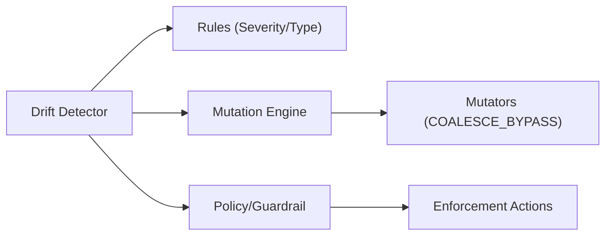

# Null Handling Analysis

<cite>
**Referenced Files in This Document**
- [detector.py](file://semantic_reliability/testing/drift/detector.py)
- [rules.py](file://semantic_reliability/testing/drift/rules.py)
- [engine.py](file://semantic_reliability/testing/mutations/engine.py)
- [mutators.py](file://semantic_reliability/testing/mutations/mutators.py)
- [test_drift_detector.py](file://tests/test_drift_detector.py)
- [test_mutations.py](file://tests/test_mutations.py)
- [hybrid_router.py](file://semantic_reliability/firewall/hybrid_router.py)
- [policy.py](file://semantic_reliability/firewall/policy.py)
- [sql_guardrail.py](file://semantic_reliability/runtime/sql_guardrail.py)
</cite>

## Table of Contents
1. Introduction
2. Project Structure
3. Core Components
4. Architecture Overview
5. Detailed Component Analysis
6. Dependency Analysis
7. Performance Considerations
8. Troubleshooting Guide
9. Conclusion
10. Appendices

## Introduction
This document explains how null handling analysis is implemented and reported in drift detection, focusing on the _analyze_null_handling method that detects removal or weakening of COALESCE-based null safety. It clarifies why such changes are classified as MEDIUM severity, outlines the business impact of NULL propagation through calculations, and provides practical guidance for interpreting reports and implementing robust null handling patterns.

## Project Structure
Null handling drift detection is part of a broader semantic drift inspection pipeline that compares baseline and candidate SQL at the AST level. The key components involved include:
- Drift detector that parses SQL into ASTs and runs multiple analyses (including null handling)
- Rules that define drift types and severities
- Mutation engine that can inject null-handling bypasses to test detection
- Policy and guardrails that map detected issues to enforcement actions

**Diagram sources**
- [detector.py:12-46](file://semantic_reliability/testing/drift/detector.py#L12-L46)
- [detector.py:189-205](file://semantic_reliability/testing/drift/detector.py#L189-L205)

**Section sources**
- [detector.py:12-46](file://semantic_reliability/testing/drift/detector.py#L12-L46)

## Core Components
- SemanticDriftDetector: Orchestrates AST-level comparisons and delegates to specific analyzers, including null handling.
- _analyze_null_handling: Detects when COALESCE calls are removed or reduced between baseline and candidate SQL.
- DriftSeverity and DriftType: Define the classification taxonomy used by all drifts, including NULL_HANDLING_DRIFT with MEDIUM severity.
- MutationEngine: Injects COALESCE bypass mutations to simulate null propagation bugs; tests verify these mutations remove COALESCE from mutated SQL.

Key behaviors:
- Counts COALESCE nodes in both ASTs and flags a drift if the candidate has fewer than the baseline.
- Emits a MEDIUM severity drift with type NULL_HANDLING_DRIFT and a clear business impact statement about NULL propagation.

**Section sources**
- [detector.py:189-205](file://semantic_reliability/testing/drift/detector.py#L189-L205)
- [rules.py:6-27](file://semantic_reliability/testing/drift/rules.py#L6-L27)
- [engine.py:223-238](file://semantic_reliability/testing/mutations/engine.py#L223-L238)
- [mutators.py:8-16](file://semantic_reliability/testing/mutations/mutators.py#L8-L16)
- [test_mutations.py:43-48](file://tests/test_mutations.py#L43-L48)

## Architecture Overview
The null handling analysis integrates into the main analyze flow:

**Diagram sources**
- [detector.py:12-46](file://semantic_reliability/testing/drift/detector.py#L12-L46)
- [detector.py:189-205](file://semantic_reliability/testing/drift/detector.py#L189-L205)
- [rules.py:6-27](file://semantic_reliability/testing/drift/rules.py#L6-L27)

## Detailed Component Analysis

### Null Handling Detection Logic
The _analyze_null_handling method performs a focused comparison of COALESCE usage:
- Extracts all COALESCE nodes from baseline and candidate ASTs.
- If the candidate contains fewer COALESCE nodes than the baseline, it records a drift.
- The drift is typed as NULL_HANDLING_DRIFT and set to MEDIUM severity.
- The business impact explicitly warns about NULL propagation leading to unexpected aggregates.

**Diagram sources**
- [detector.py:189-205](file://semantic_reliability/testing/drift/detector.py#L189-L205)

**Section sources**
- [detector.py:189-205](file://semantic_reliability/testing/drift/detector.py#L189-L205)

### Severity Classification: Why MEDIUM?
- MEDIUM indicates a meaningful but not immediately catastrophic change. Removing COALESCE defaults can introduce NULL values into downstream metrics, which may distort aggregations and reporting, but often does not crash pipelines outright.
- The system reserves FATAL/CRITICAL for structural or population logic changes that can cause severe data integrity issues (e.g., missing WHERE filters, Cartesian joins).

**Section sources**
- [rules.py:6-27](file://semantic_reliability/testing/drift/rules.py#L6-L27)
- [detector.py:189-205](file://semantic_reliability/testing/drift/detector.py#L189-L205)

### Business Impact of NULL Propagation
- Aggregations like SUM, AVG, COUNT can produce NULL or misleading results when inputs are NULL.
- Metrics such as revenue, conversion rates, and churn rely on non-NULL inputs; NULL propagation can deflate or invalidate these metrics.
- Downstream dashboards and BI tools may display blanks or incorrect totals, eroding trust in analytics.

**Section sources**
- [detector.py:189-205](file://semantic_reliability/testing/drift/detector.py#L189-L205)

### Examples of Null Handling Drifts
- Removing default values from COALESCE calls: Baseline uses COALESCE to provide safe defaults; candidate drops them, exposing raw NULLs.
- Eliminating ISNULL checks or equivalent fallback logic: Similar effect—values become NULL where previously defaulted.
- Dropping CASE WHEN ... ELSE 0 patterns: Replaces explicit null-safe branches with direct expressions that can propagate NULL.

These scenarios align with the mutation engine’s COALESCE bypass behavior and the detector’s counting approach.

**Section sources**
- [engine.py:223-238](file://semantic_reliability/testing/mutations/engine.py#L223-L238)
- [test_mutations.py:43-48](file://tests/test_mutations.py#L43-L48)
- [detector.py:189-205](file://semantic_reliability/testing/drift/detector.py#L189-L205)

### Implications for Metric Calculations and Data Quality
- Revenue metrics: NULL amounts in invoice/refund lines can reduce sums or yield NULL totals.
- Rates and ratios: Denominators becoming NULL can break ratio computations or produce NaN-like outcomes.
- Time-series and cohort metrics: Missing values can create gaps or misalign cohorts.

Mitigation: Ensure every numeric expression entering aggregations is guarded by COALESCE or equivalent null-safe constructs.

**Section sources**
- [detector.py:189-205](file://semantic_reliability/testing/drift/detector.py#L189-L205)

### Implementing Robust Null Handling Patterns
- Always wrap nullable inputs to aggregations with COALESCE or equivalent functions to ensure non-NULL defaults.
- Use CASE WHEN ... THEN ... ELSE 0 patterns to handle conditional nulls before aggregation.
- Validate upstream columns for NOT NULL constraints where appropriate; still guard against NULLs at calculation boundaries.
- Treat removal of existing COALESCE or null-safe patterns as a drift requiring review.

[No sources needed since this section provides general guidance]

### Interpreting Null Handling Drift Reports
- Summary: Indicates COALESCE defaults were removed.
- Details: Shows counts of COALESCE in baseline vs candidate.
- Business impact: Warns about NULL propagation and unexpected aggregates.
- Remediation: Restore null-safe fallbacks.

Use these fields to quickly assess whether a change introduced a risk and what action to take.

**Section sources**
- [detector.py:189-205](file://semantic_reliability/testing/drift/detector.py#L189-L205)

## Dependency Analysis
Null handling drift detection depends on:
- AST parsing via SQLGlot to locate COALESCE nodes
- Drift rules defining types and severities
- Mutation engine for generating COALESCE bypass examples
- Policy/guardrail mappings that can escalate or enforce actions based on detected drifts

**Diagram sources**
- [detector.py:12-46](file://semantic_reliability/testing/drift/detector.py#L12-L46)
- [rules.py:6-27](file://semantic_reliability/testing/drift/rules.py#L6-L27)
- [engine.py:223-238](file://semantic_reliability/testing/mutations/engine.py#L223-L238)
- [mutators.py:8-16](file://semantic_reliability/testing/mutations/mutators.py#L8-L16)
- [policy.py:10-28](file://semantic_reliability/firewall/policy.py#L10-L28)
- [sql_guardrail.py:12-30](file://semantic_reliability/runtime/sql_guardrail.py#L12-L30)

**Section sources**
- [detector.py:12-46](file://semantic_reliability/testing/drift/detector.py#L12-L46)
- [rules.py:6-27](file://semantic_reliability/testing/drift/rules.py#L6-L27)
- [engine.py:223-238](file://semantic_reliability/testing/mutations/engine.py#L223-L238)
- [mutators.py:8-16](file://semantic_reliability/testing/mutations/mutators.py#L8-L16)
- [policy.py:10-28](file://semantic_reliability/firewall/policy.py#L10-L28)
- [sql_guardrail.py:12-30](file://semantic_reliability/runtime/sql_guardrail.py#L12-L30)

## Performance Considerations
- Counting COALESCE nodes is lightweight and scales with query size; it avoids expensive full equivalence checks.
- For very large queries, consider limiting analysis scope to relevant subexpressions if needed.
- Combine with other drift checks to prioritize remediation effort.

[No sources needed since this section provides general guidance]

## Troubleshooting Guide
Common issues and resolutions:
- False positives due to dialect differences: Ensure consistent dialect parsing across baseline and candidate to avoid spurious COALESCE mismatches.
- Incomplete coverage of null patterns: The current detector focuses on COALESCE; additional null-safe patterns (e.g., ISNULL, CASE WHEN ... ELSE) should be reviewed manually or extended in future versions.
- Misinterpretation of severity: MEDIUM indicates potential metric distortion; treat as actionable but not necessarily blocking unless downstream impacts are severe.

Operational tips:
- Inspect the details field to see COALESCE counts and confirm whether defaults were dropped.
- Use remediation guidance to restore null-safe patterns.
- Leverage mutation tests to validate your environment’s ability to detect and report such drifts.

**Section sources**
- [detector.py:189-205](file://semantic_reliability/testing/drift/detector.py#L189-L205)
- [test_mutations.py:43-48](file://tests/test_mutations.py#L43-L48)

## Conclusion
The null handling analysis identifies when COALESCE-based safeguards are weakened or removed, flagging them as MEDIUM severity drifts. While not always fatal, such changes can propagate NULLs into critical metrics, degrading data quality and reliability. Teams should treat these drifts as signals to restore null-safe patterns and validate downstream impacts. Extending detection to cover additional null-safe constructs will further strengthen protection against subtle but impactful changes.

[No sources needed since this section summarizes without analyzing specific files]

## Appendices

### How the Mutation Engine Simulates Null Handling Drifts
- The mutation engine replaces COALESCE(col, default) with just col, simulating accidental removal of null safety.
- Tests assert that the mutated SQL no longer contains COALESCE, confirming the bypass was applied.

**Section sources**
- [engine.py:223-238](file://semantic_reliability/testing/mutations/engine.py#L223-L238)
- [test_mutations.py:43-48](file://tests/test_mutations.py#L43-L48)

### Integration with Policy and Guardrails
- Policies and guardrails map certain drift characteristics to enforcement categories, including null coalesce drop scenarios.
- These mappings help route detections to appropriate review or blocking workflows.

**Section sources**
- [policy.py:10-28](file://semantic_reliability/firewall/policy.py#L10-L28)
- [sql_guardrail.py:12-30](file://semantic_reliability/runtime/sql_guardrail.py#L12-L30)