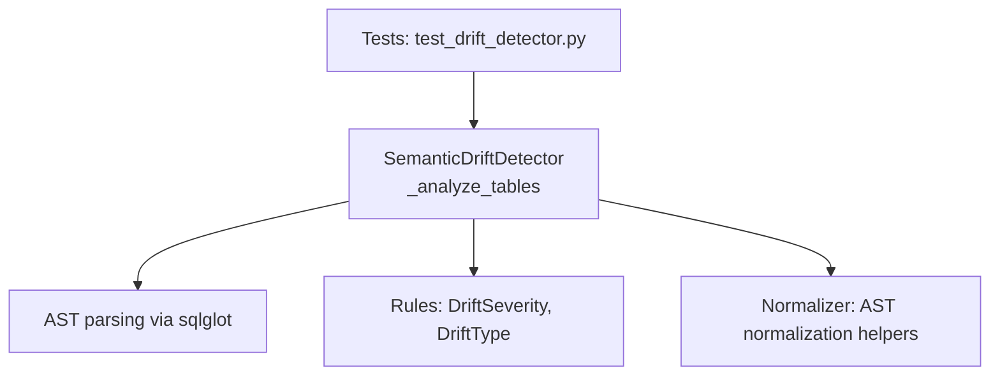
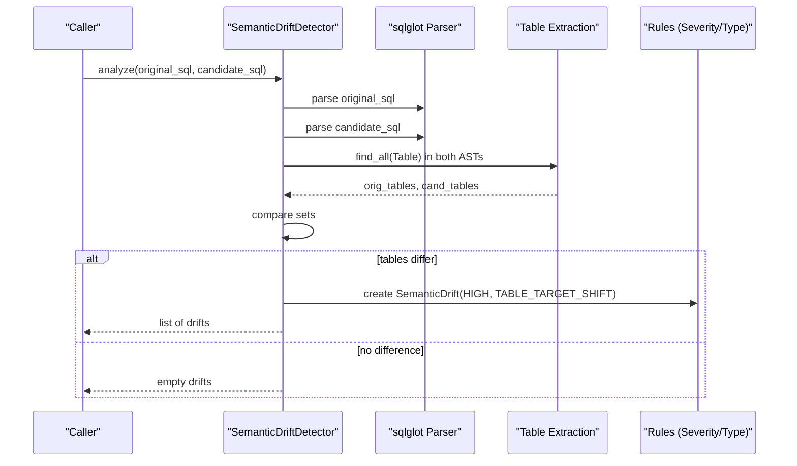
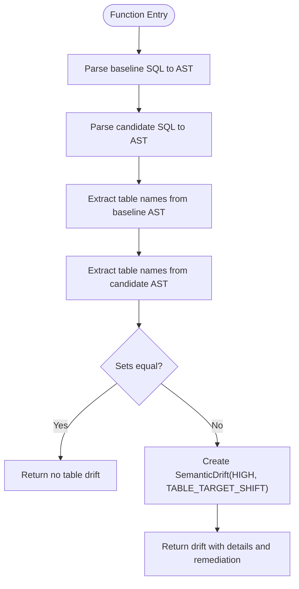
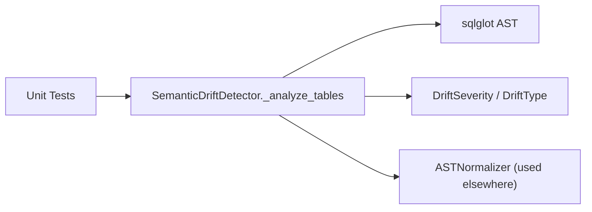

# Table Lineage Analysis

<cite>
**Referenced Files in This Document**
- [detector.py](file://semantic_reliability/testing/drift/detector.py)
- [rules.py](file://semantic_reliability/testing/drift/rules.py)
- [normalizer.py](file://semantic_reliability/testing/drift/normalizer.py)
- [distance.py](file://semantic_reliability/testing/drift/distance.py)
- [test_drift_detector.py](file://tests/test_drift_detector.py)
</cite>

## Table of Contents
1. [Introduction](#introduction)
2. [Project Structure](#project-structure)
3. [Core Components](#core-components)
4. [Architecture Overview](#architecture-overview)
5. [Detailed Component Analysis](#detailed-component-analysis)
6. [Dependency Analysis](#dependency-analysis)
7. [Performance Considerations](#performance-considerations)
8. [Troubleshooting Guide](#troubleshooting-guide)
9. [Conclusion](#conclusion)

## Introduction
This document explains how table lineage analysis is performed during drift detection, focusing on the _analyze_tables method that detects changes in FROM and JOIN table references. It also covers why stable table lineage matters for consistent data sources and upstream dependencies, what constitutes a table lineage drift (e.g., switching to different staging tables, replacing deprecated tables, adding or removing source tables), and why such drifts are classified as HIGH severity with potential impacts on metric calculations. Finally, it provides guidance for managing table dependencies and interpreting lineage drift reports.

## Project Structure
The table lineage analysis is implemented within the semantic drift detection subsystem:
- The detector orchestrates multiple AST-level checks, including source table comparison.
- Rules define severity levels and drift types used across detectors.
- Normalization utilities ensure fair comparisons by canonicalizing expressions.
- Distance utilities compute structural similarity between SQL statements.

**Diagram sources**
- [detector.py:12-46](file://semantic_reliability/testing/drift/detector.py#L12-L46)
- [rules.py:6-28](file://semantic_reliability/testing/drift/rules.py#L6-L28)
- [normalizer.py:6-93](file://semantic_reliability/testing/drift/normalizer.py#L6-L93)
- [test_drift_detector.py:1-84](file://tests/test_drift_detector.py#L1-L84)

**Section sources**
- [detector.py:12-46](file://semantic_reliability/testing/drift/detector.py#L12-L46)
- [rules.py:6-28](file://semantic_reliability/testing/drift/rules.py#L6-L28)
- [normalizer.py:6-93](file://semantic_reliability/testing/drift/normalizer.py#L6-L93)
- [test_drift_detector.py:1-84](file://tests/test_drift_detector.py#L1-L84)

## Core Components
- SemanticDriftDetector.analyze parses baseline and candidate SQL into ASTs and runs several targeted analyses, including source table comparison.
- _analyze_tables extracts all referenced tables from both ASTs and compares them; any difference triggers a TABLE_TARGET_SHIFT drift at HIGH severity.
- Rules define severity levels (FATAL, CRITICAL, HIGH, MEDIUM, LOW, INFO) and drift types (including TABLE_TARGET_SHIFT).
- Normalizer provides predicate equivalence checks and canonicalization to avoid false positives in other components.
- Distance utilities compute a deterministic Jaccard-based semantic distance between SQL statements using normalized AST node signatures.

Key responsibilities:
- Detecting table lineage changes in FROM and JOIN clauses.
- Reporting structured drift information with severity, type, component, summary, details, business impact, snippets, and remediation guidance.
- Enabling downstream systems to interpret and act on lineage drifts consistently.

**Section sources**
- [detector.py:12-46](file://semantic_reliability/testing/drift/detector.py#L12-L46)
- [detector.py:227-245](file://semantic_reliability/testing/drift/detector.py#L227-L245)
- [rules.py:6-28](file://semantic_reliability/testing/drift/rules.py#L6-L28)
- [normalizer.py:6-93](file://semantic_reliability/testing/drift/normalizer.py#L6-L93)
- [distance.py:33-64](file://semantic_reliability/testing/drift/distance.py#L33-L64)

## Architecture Overview
The drift detection pipeline normalizes SQL ASTs and performs targeted checks. For table lineage, it focuses on table nodes found in the AST and compares sets of table names between baseline and candidate queries.

**Diagram sources**
- [detector.py:12-46](file://semantic_reliability/testing/drift/detector.py#L12-L46)
- [detector.py:227-245](file://semantic_reliability/testing/drift/detector.py#L227-L245)
- [rules.py:6-28](file://semantic_reliability/testing/drift/rules.py#L6-L28)

## Detailed Component Analysis

### Source Table Lineage Detection (_analyze_tables)
- Purpose: Identify changes in source tables referenced in FROM and JOIN clauses.
- Mechanism: Extract all table names from both baseline and candidate ASTs, deduplicate, sort, and compare sets. Any mismatch indicates a lineage change.
- Output: A SemanticDrift with:
  - Severity: HIGH
  - Type: TABLE_TARGET_SHIFT
  - Component: Source Tables (FROM / JOIN)
  - Summary: Source table lineage has changed
  - Details: Baseline vs candidate source tables
  - Business Impact: Upstream dependency shifts; metric may read from staging or deprecated tables
  - Snippets: Original and candidate table lists
  - Remediation: Verify upstream model lineage and table sources

**Diagram sources**
- [detector.py:227-245](file://semantic_reliability/testing/drift/detector.py#L227-L245)

**Section sources**
- [detector.py:227-245](file://semantic_reliability/testing/drift/detector.py#L227-L245)

### Why Table Lineage Stability Matters
- Consistent Data Sources: Metrics depend on specific upstream tables. Changing these can alter data semantics even if SQL syntax remains valid.
- Upstream Dependencies: Models often rely on curated staging or fact tables. Switching to different staging tables or deprecated ones can introduce schema or data quality differences.
- Metric Integrity: Adding/removing source tables can change aggregation grain, join cardinality, and filtering scope, leading to silent metric inflation or deflation.

### Examples of Table Lineage Drifts
- Switching to different staging tables: Replacing a curated staging table with another variant that has different schemas or data coverage.
- Replacing deprecated tables: Using an outdated table that may be decommissioned or inconsistent with current definitions.
- Adding/removing source tables: Introducing new joins or dropping existing ones, altering dataset scope and relationships.

These scenarios are captured by the same mechanism: any set difference in table names triggers a HIGH severity drift report.

**Section sources**
- [detector.py:227-245](file://semantic_reliability/testing/drift/detector.py#L227-L245)

### Classification and Impact
- Severity: HIGH
- Rationale: Changes in source tables directly affect upstream dependencies and can silently alter metric calculations without changing SQL structure significantly.
- Potential Impacts:
  - Different data volumes or coverage due to alternate staging tables.
  - Altered join cardinality causing duplicate counting or record loss.
  - Schema mismatches affecting column availability and semantics.
  - Deprecated tables may have inconsistent or incomplete data.

**Section sources**
- [rules.py:6-28](file://semantic_reliability/testing/drift/rules.py#L6-L28)
- [detector.py:227-245](file://semantic_reliability/testing/drift/detector.py#L227-L245)

### Managing Table Dependencies and Interpreting Reports
- Before merging changes, review reported table differences:
  - Confirm whether the new table is intended and approved.
  - Validate schema compatibility and data semantics.
  - Ensure join predicates remain correct to avoid Cartesian products or unintended duplicates.
- Use remediation guidance in drift reports to verify upstream model lineage and table sources.
- If lineage changes are intentional, update contracts and documentation accordingly and re-baseline metrics where appropriate.

**Section sources**
- [detector.py:227-245](file://semantic_reliability/testing/drift/detector.py#L227-L245)

## Dependency Analysis
The table lineage analysis depends on:
- AST parsing via sqlglot to extract table nodes.
- Rule definitions for severity and drift type classification.
- Normalization utilities for other drift checks (not directly used in table extraction but part of the broader system).
- Tests validating overall drift detection behavior.

**Diagram sources**
- [detector.py:227-245](file://semantic_reliability/testing/drift/detector.py#L227-L245)
- [rules.py:6-28](file://semantic_reliability/testing/drift/rules.py#L6-L28)
- [normalizer.py:6-93](file://semantic_reliability/testing/drift/normalizer.py#L6-L93)
- [test_drift_detector.py:1-84](file://tests/test_drift_detector.py#L1-L84)

**Section sources**
- [detector.py:227-245](file://semantic_reliability/testing/drift/detector.py#L227-L245)
- [rules.py:6-28](file://semantic_reliability/testing/drift/rules.py#L6-L28)
- [normalizer.py:6-93](file://semantic_reliability/testing/drift/normalizer.py#L6-L93)
- [test_drift_detector.py:1-84](file://tests/test_drift_detector.py#L1-L84)

## Performance Considerations
- AST Parsing: Parsing SQL into ASTs is O(n) in query size; repeated parsing for baseline and candidate is acceptable for CI pipelines.
- Table Extraction: Finding all Table nodes is linear in AST size; deduplication and sorting add minimal overhead.
- Set Comparison: Comparing sorted sets is efficient; this check is lightweight compared to full query execution.
- Scalability: For large codebases, batch processing and caching parsed ASTs can reduce repeated work.

[No sources needed since this section provides general guidance]

## Troubleshooting Guide
Common issues and resolutions:
- Unexpected table lineage drift:
  - Review the reported baseline vs candidate table lists.
  - Check for accidental table renames or alias changes that affect table identity.
  - Validate upstream model lineage and ensure the intended table is selected.
- Join-related side effects:
  - Ensure ON/USING clauses remain intact when tables change to avoid Cartesian products.
  - Re-check join predicates after table swaps to maintain correct cardinality.
- Staging table switches:
  - Confirm schema parity and data coverage before accepting changes.
  - Update contracts and documentation if lineage changes are intentional.

**Section sources**
- [detector.py:227-245](file://semantic_reliability/testing/drift/detector.py#L227-L245)
- [detector.py:133-164](file://semantic_reliability/testing/drift/detector.py#L133-L164)

## Conclusion
Table lineage analysis in drift detection safeguards metric integrity by detecting changes in FROM and JOIN table references. The _analyze_tables method flags any deviation as a HIGH severity drift, prompting verification of upstream dependencies and potential impacts on calculations. By understanding and acting on lineage drift reports, teams can maintain consistent data sources, prevent silent metric changes, and manage table dependencies responsibly.

[No sources needed since this section summarizes without analyzing specific files]