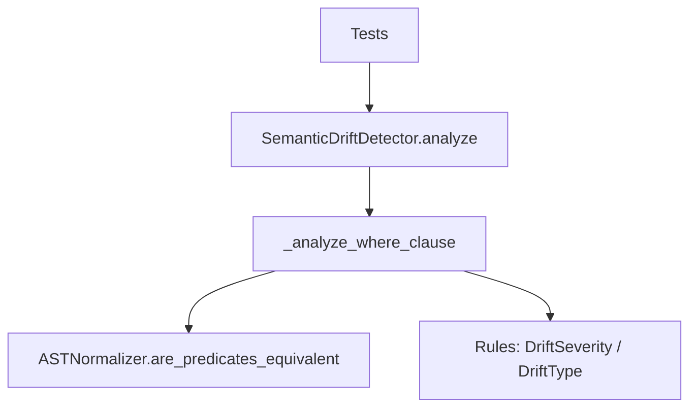
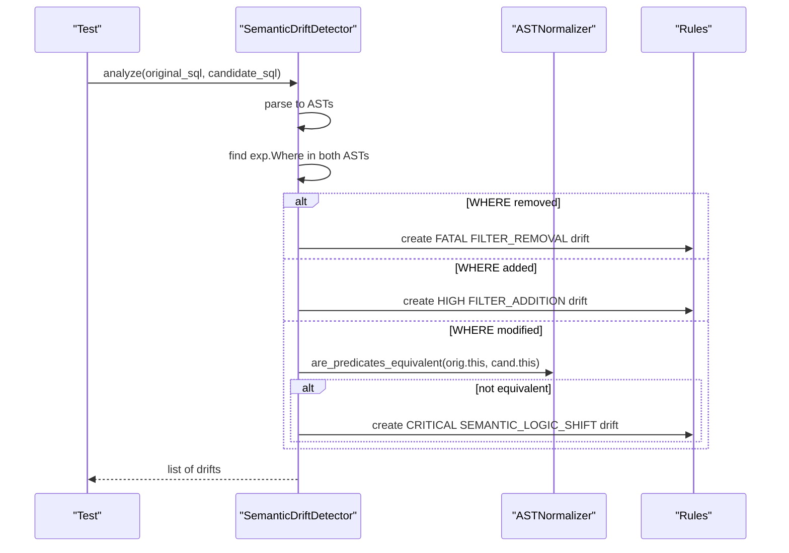
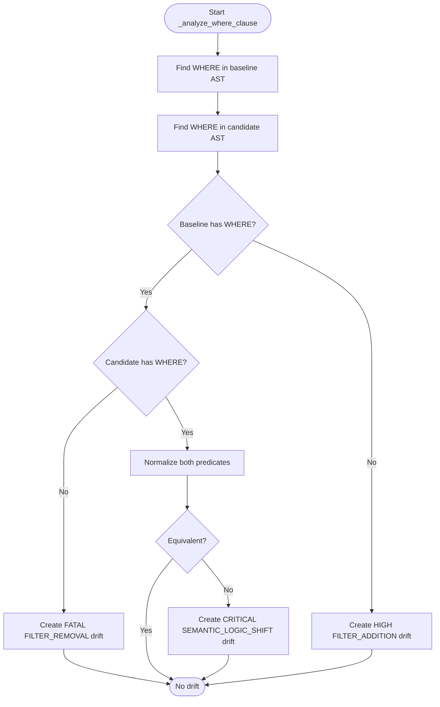
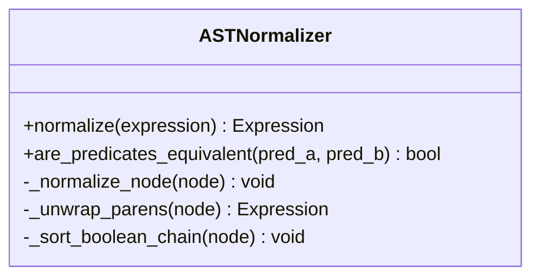
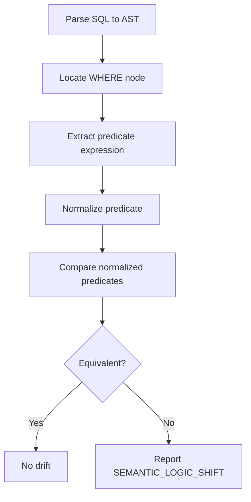
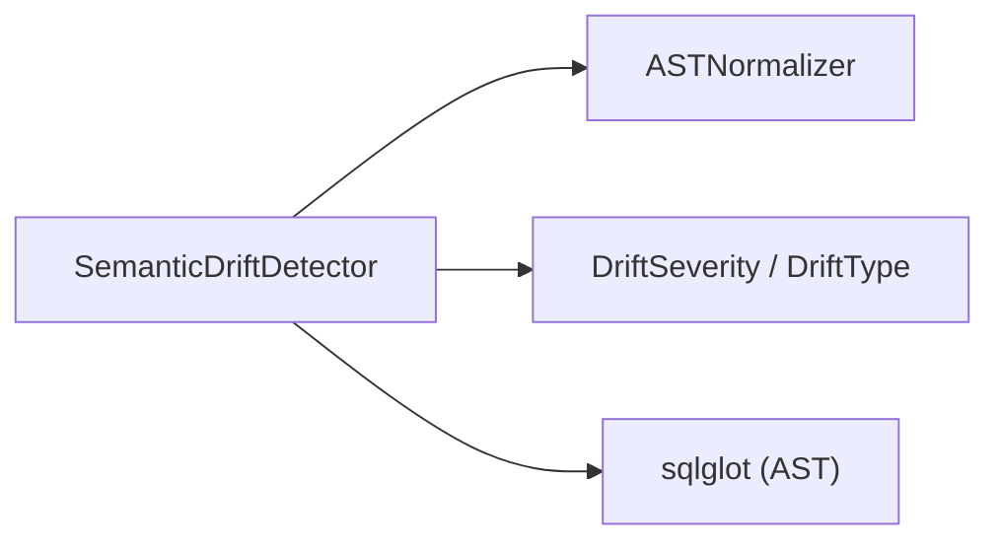

# WHERE Clause Analysis

<cite>
**Referenced Files in This Document**
- [detector.py](file://semantic_reliability/testing/drift/detector.py)
- [normalizer.py](file://semantic_reliability/testing/drift/normalizer.py)
- [rules.py](file://semantic_reliability/testing/drift/rules.py)
- [test_drift_detector.py](file://tests/test_drift_detector.py)
- [test_equivalence.py](file://tests/test_equivalence.py)
</cite>

## Table of Contents
1. [Introduction](#introduction)
2. [Project Structure](#project-structure)
3. [Core Components](#core-components)
4. [Architecture Overview](#architecture-overview)
5. [Detailed Component Analysis](#detailed-component-analysis)
6. [Dependency Analysis](#dependency-analysis)
7. [Performance Considerations](#performance-considerations)
8. [Troubleshooting Guide](#troubleshooting-guide)
9. [Conclusion](#conclusion)

## Introduction
This document explains how WHERE clause analysis is performed during drift detection to identify changes that alter the population of data used for metrics and reports. It focuses on the method that detects filter removal, filter addition, and logical condition modifications; documents the severity classification system applied to these changes; provides concrete examples of each drift type; assesses business impact; and outlines remediation guidance. It also details how AST traversal and a semantic normalizer are used to compare WHERE clauses robustly against cosmetic or commutative differences.

## Project Structure
The WHERE clause analysis is implemented within the testing/drift module:
- The detector orchestrates SQL parsing and delegates specific checks to focused methods.
- The normalizer canonicalizes predicates to avoid false positives from ordering or parentheses.
- The rules define severity levels and drift types used across detectors.

**Diagram sources**
- [detector.py:12-46](file://semantic_reliability/testing/drift/detector.py#L12-L46)
- [detector.py:48-91](file://semantic_reliability/testing/drift/detector.py#L48-L91)
- [normalizer.py:77-92](file://semantic_reliability/testing/drift/normalizer.py#L77-L92)
- [rules.py:6-27](file://semantic_reliability/testing/drift/rules.py#L6-L27)

**Section sources**
- [detector.py:12-46](file://semantic_reliability/testing/drift/detector.py#L12-L46)
- [rules.py:6-27](file://semantic_reliability/testing/drift/rules.py#L6-L27)

## Core Components
- SemanticDriftDetector: Parses baseline and candidate SQL into ASTs and runs component-wise comparisons. For WHERE clauses, it locates WHERE nodes and compares their presence and content.
- ASTNormalizer: Canonicalizes boolean chains (AND/OR), unwraps redundant parentheses, and lowercases aliases so that logically equivalent predicates are recognized as such.
- Rules: Defines severity levels (FATAL, CRITICAL, HIGH, MEDIUM, LOW, INFO) and drift types (e.g., FILTER_REMOVAL, FILTER_ADDITION, SEMANTIC_LOGIC_SHIFT).

Key responsibilities:
- Detect when a WHERE clause is removed, added, or changed.
- Classify the change with an appropriate severity and drift type.
- Provide actionable summaries, business impact notes, and remediation steps.

**Section sources**
- [detector.py:48-91](file://semantic_reliability/testing/drift/detector.py#L48-L91)
- [normalizer.py:6-92](file://semantic_reliability/testing/drift/normalizer.py#L6-L92)
- [rules.py:6-27](file://semantic_reliability/testing/drift/rules.py#L6-L27)

## Architecture Overview
The WHERE clause analysis follows a clear pipeline:
1. Parse both SQL strings into ASTs.
2. Locate WHERE nodes in baseline and candidate.
3. Compare presence and semantics:
   - Removal: baseline has WHERE, candidate does not.
   - Addition: baseline has no WHERE, candidate introduces one.
   - Modification: both have WHERE; compare normalized predicate trees.
4. Emit a SemanticDrift with severity, type, summary, details, business impact, snippets, and remediation.

**Diagram sources**
- [detector.py:12-46](file://semantic_reliability/testing/drift/detector.py#L12-L46)
- [detector.py:48-91](file://semantic_reliability/testing/drift/detector.py#L48-L91)
- [normalizer.py:77-92](file://semantic_reliability/testing/drift/normalizer.py#L77-L92)
- [rules.py:6-27](file://semantic_reliability/testing/drift/rules.py#L6-L27)

## Detailed Component Analysis

### WHERE Clause Detection Logic
The _analyze_where_clause method performs three primary checks:
- Filter removal: baseline contains a WHERE; candidate does not.
- Filter addition: baseline has no WHERE; candidate introduces one.
- Logical modification: both contain WHERE; compare normalized predicates.

It uses AST traversal via sqlglot to locate WHERE nodes and then compares their predicate expressions using the normalizer. When a difference is detected, it emits a SemanticDrift with:
- Severity: FATAL for removal, HIGH for addition, CRITICAL for logical shift.
- Drift type: FILTER_REMOVAL, FILTER_ADDITION, SEMANTIC_LOGIC_SHIFT.
- Business impact: describes expected metric inflation, volume restriction, or silent inclusion/exclusion changes.
- Remediation: guidance to restore constraints, confirm intent, or validate approved updates.

**Diagram sources**
- [detector.py:48-91](file://semantic_reliability/testing/drift/detector.py#L48-L91)
- [normalizer.py:77-92](file://semantic_reliability/testing/drift/normalizer.py#L77-L92)

**Section sources**
- [detector.py:48-91](file://semantic_reliability/testing/drift/detector.py#L48-L91)

### Normalization and Semantic Comparison
The normalizer ensures that semantically identical predicates are not flagged as drift due to:
- Commutativity of AND/OR chains: order of conjuncts/disjuncts is ignored.
- Redundant parentheses: nested parentheses are unwrapped.
- Alias casing: identifiers are lowercased for stable comparison.

are_predicates_equivalent normalizes both sides and compares their SQL representations after stripping whitespace and lowercasing.

**Diagram sources**
- [normalizer.py:6-92](file://semantic_reliability/testing/drift/normalizer.py#L6-L92)

**Section sources**
- [normalizer.py:6-92](file://semantic_reliability/testing/drift/normalizer.py#L6-L92)

### Severity Classification System
The system applies severity levels to WHERE-related drifts:
- FATAL: Complete removal of filters. Indicates unfiltered aggregation and potential massive metric inflation.
- HIGH: Addition of new filters to a previously unfiltered model. Indicates restricted population and lower volumes downstream.
- CRITICAL: Logical modification of existing filters. Indicates changed population criteria affecting dashboards and reports.

These severities align with the risk to data integrity and downstream analytics.

**Section sources**
- [rules.py:6-12](file://semantic_reliability/testing/drift/rules.py#L6-L12)
- [detector.py:54-90](file://semantic_reliability/testing/drift/detector.py#L54-L90)

### Examples of Drift Types

#### Complete Filter Removal
- Scenario: Baseline includes WHERE constraints; candidate removes them entirely.
- Detection: Presence-only check identifies missing WHERE in candidate.
- Severity: FATAL
- Drift Type: FILTER_REMOVAL
- Business Impact: Unfiltered data aggregated; significant metric inflation expected.
- Remediation: Restore population constraints or create a dedicated unfiltered model.
- Test Reference: Demonstrated by comparing a base query with filters to a variant without filters.

**Section sources**
- [detector.py:54-65](file://semantic_reliability/testing/drift/detector.py#L54-L65)
- [test_drift_detector.py:17-28](file://tests/test_drift_detector.py#L17-L28)

#### New Filter Introduction
- Scenario: Candidate adds WHERE constraints where none existed before.
- Detection: Presence-only check identifies new WHERE in candidate.
- Severity: HIGH
- Drift Type: FILTER_ADDITION
- Business Impact: Population restricted; downstream metrics reflect lower volumes than baseline.
- Remediation: Confirm if filtering is intentional and aligned with business definition.
- Test Reference: Covered by tests that assert drift detection when filters are introduced.

**Section sources**
- [detector.py:66-77](file://semantic_reliability/testing/drift/detector.py#L66-L77)
- [test_drift_detector.py:31-43](file://tests/test_drift_detector.py#L31-L43)

#### Logical Condition Modifications
- Scenario: Both baseline and candidate have WHERE clauses, but conditions differ.
- Detection: Normalized predicate comparison flags non-equivalent logic.
- Severity: CRITICAL
- Drift Type: SEMANTIC_LOGIC_SHIFT
- Business Impact: Population criteria changed; dashboards will silently include/exclude different entities.
- Remediation: Verify whether logical criteria change is an approved business metric update.
- Test Reference: Demonstrated by changing a status value in the WHERE clause.

**Section sources**
- [detector.py:78-90](file://semantic_reliability/testing/drift/detector.py#L78-L90)
- [test_drift_detector.py:31-43](file://tests/test_drift_detector.py#L31-L43)

### AST Traversal and Normalization in Practice
- Traversal: The detector uses sqlglot to parse SQL and locate WHERE nodes.
- Normalization: The normalizer flattens AND/OR chains, sorts leaves by SQL string, unwraps parentheses, and lowercases aliases.
- Comparison: are_predicates_equivalent compares normalized forms to detect true semantic differences while ignoring cosmetic variations.

**Diagram sources**
- [detector.py:48-91](file://semantic_reliability/testing/drift/detector.py#L48-L91)
- [normalizer.py:16-75](file://semantic_reliability/testing/drift/normalizer.py#L16-L75)
- [normalizer.py:77-92](file://semantic_reliability/testing/drift/normalizer.py#L77-L92)

**Section sources**
- [test_equivalence.py:7-43](file://tests/test_equivalence.py#L7-L43)

## Dependency Analysis
The WHERE clause analysis depends on:
- sqlglot for AST parsing and traversal.
- ASTNormalizer for canonicalization and equivalence checking.
- Rules for severity and drift type definitions.

**Diagram sources**
- [detector.py:1-6](file://semantic_reliability/testing/drift/detector.py#L1-L6)
- [detector.py:48-91](file://semantic_reliability/testing/drift/detector.py#L48-L91)
- [normalizer.py:1-92](file://semantic_reliability/testing/drift/normalizer.py#L1-L92)
- [rules.py:1-27](file://semantic_reliability/testing/drift/rules.py#L1-L27)

**Section sources**
- [detector.py:1-6](file://semantic_reliability/testing/drift/detector.py#L1-L6)
- [rules.py:1-27](file://semantic_reliability/testing/drift/rules.py#L1-L27)

## Performance Considerations
- AST parsing and traversal are linear in the size of the SQL AST; WHERE detection is efficient because it targets specific node types.
- Normalization flattens boolean chains and sorts leaves; complexity grows with the number of conjuncts/disjuncts but remains manageable for typical queries.
- Predicate comparison involves SQL string normalization; ensure queries are not excessively large to keep comparison time reasonable.
- Avoid unnecessary deep nesting in WHERE clauses to minimize normalization overhead.

[No sources needed since this section provides general guidance]

## Troubleshooting Guide
Common issues and resolutions:
- False positives from commutative predicates: Ensure you rely on the normalizer’s equivalence check rather than raw SQL string comparison. Tests demonstrate that reordered AND/OR chains are treated as equivalent.
- Unexpected drift on alias casing: The normalizer lowercases aliases; verify that your queries do not depend on case-sensitive alias behavior.
- Misclassification of logical shifts: If a change is intended, treat it as an approved metric update and adjust documentation accordingly.

Remediation tips:
- For FILTER_REMOVAL: Restore original constraints or explicitly create an unfiltered model if that is the desired behavior.
- For FILTER_ADDITION: Validate that the new filters match business requirements and update contracts if necessary.
- For SEMANTIC_LOGIC_SHIFT: Confirm the change with stakeholders and update metric definitions if approved.

**Section sources**
- [test_equivalence.py:7-43](file://tests/test_equivalence.py#L7-L43)
- [detector.py:54-90](file://semantic_reliability/testing/drift/detector.py#L54-L90)

## Conclusion
WHERE clause analysis in drift detection leverages AST traversal and semantic normalization to robustly identify filter removal, addition, and logical modifications. The severity classification system prioritizes risks: FATAL for complete removal, HIGH for new additions, and CRITICAL for logical shifts. Each drift includes business impact and remediation guidance to help teams maintain metric integrity. Tests validate core behaviors, including commutative equivalence and detection of meaningful changes.

[No sources needed since this section summarizes without analyzing specific files]