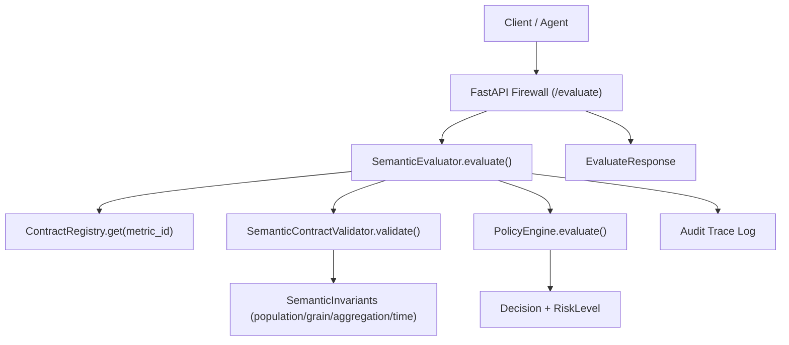
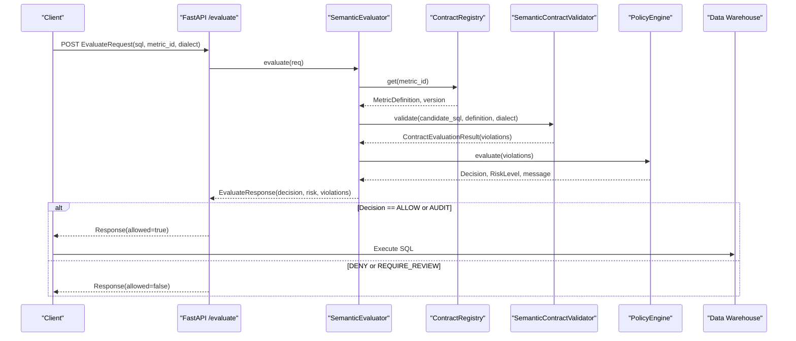
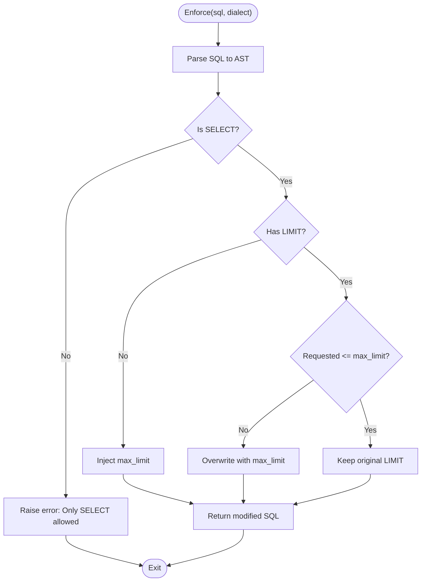
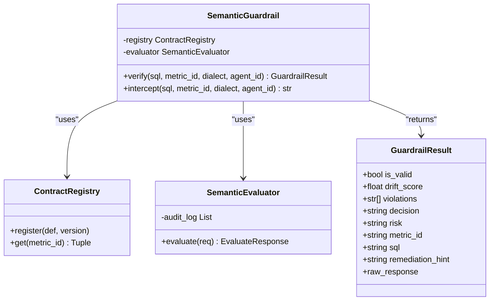
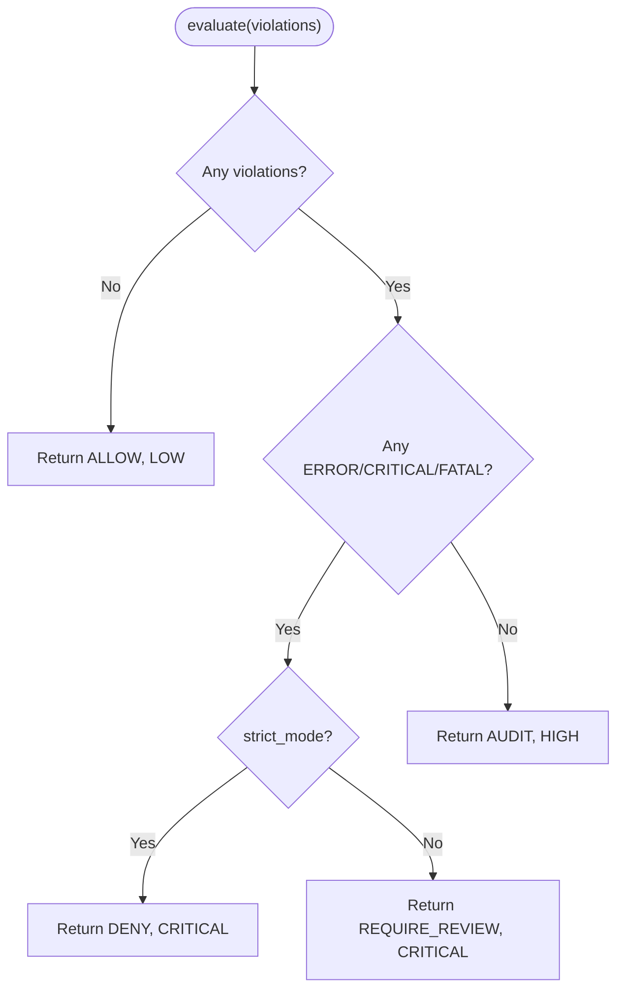
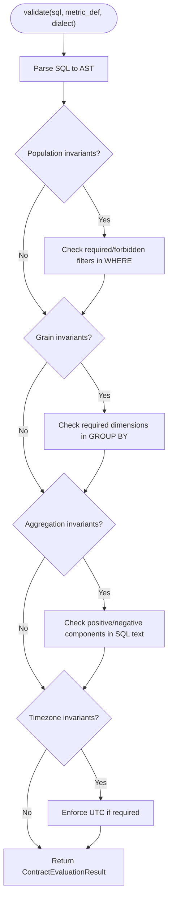
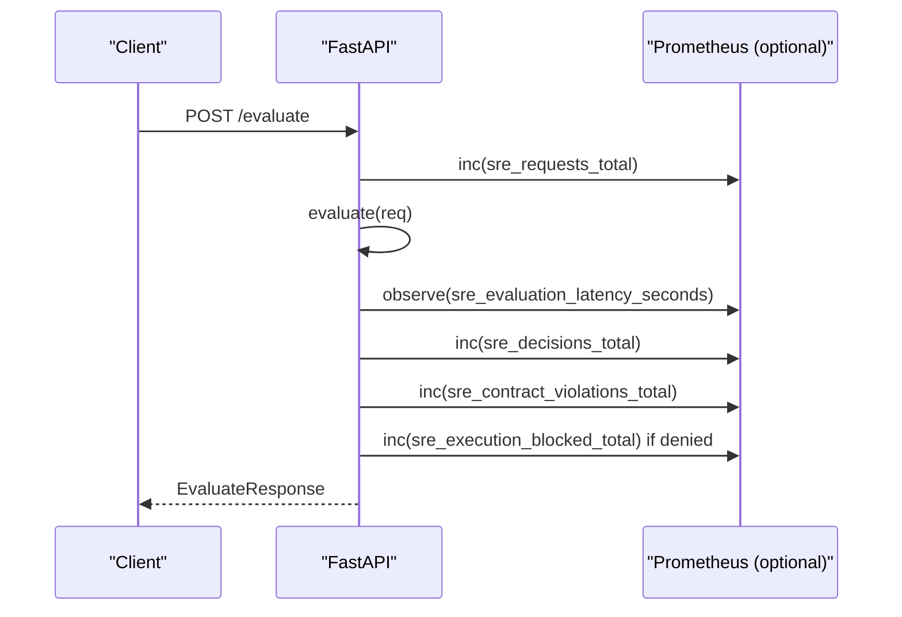
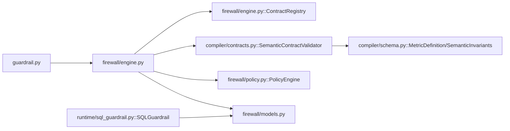

# SQL Guardrail Runtime

<cite>
**Referenced Files in This Document**
- [sql_guardrail.py](file://semantic_reliability/runtime/sql_guardrail.py)
- [guardrail.py](file://semantic_reliability/guardrail.py)
- [engine.py](file://semantic_reliability/firewall/engine.py)
- [policy.py](file://semantic_reliability/firewall/policy.py)
- [models.py](file://semantic_reliability/firewall/models.py)
- [schema.py](file://semantic_reliability/compiler/schema.py)
- [contracts.py](file://semantic_reliability/compiler/contracts.py)
- [main.py](file://semantic_reliability/firewall/main.py)
- [README.md](file://README.md)
</cite>

## Table of Contents
1. [Introduction](#introduction)
2. [Project Structure](#project-structure)
3. [Core Components](#core-components)
4. [Architecture Overview](#architecture-overview)
5. [Detailed Component Analysis](#detailed-component-analysis)
6. [Dependency Analysis](#dependency-analysis)
7. [Performance Considerations](#performance-considerations)
8. [Troubleshooting Guide](#troubleshooting-guide)
9. [Conclusion](#conclusion)
10. [Appendices](#appendices)

## Introduction
This document explains the SQL guardrail runtime that provides real-time SQL validation and enforcement for AI-generated or dynamic queries. It covers how the runtime intercepts SQL execution, applies semantic contracts (SCOS), enforces governance policies, and integrates with database connections and query execution pipelines. It also documents configuration options, deployment patterns, monitoring approaches, and performance considerations for high-throughput environments.

## Project Structure
The SQL guardrail runtime is composed of:
- A structural guardrail that blocks destructive statements and enforces safe limits via AST analysis.
- A semantic guardrail that validates candidate SQL against declarative metric contracts using AST-based checks.
- A policy engine that decides whether to allow, audit, require review, or deny execution based on violations and severity.
- A registry of metric contracts and an evaluator that orchestrates parsing, validation, auditing, and decision-making.
- An HTTP API surface exposing evaluation endpoints and metrics for integration into production systems.

**Diagram sources**
- [main.py:23-53](file://semantic_reliability/firewall/main.py#L23-L53)
- [engine.py:46-116](file://semantic_reliability/firewall/engine.py#L46-L116)
- [policy.py:32-67](file://semantic_reliability/firewall/policy.py#L32-L67)
- [contracts.py:26-134](file://semantic_reliability/compiler/contracts.py#L26-L134)
- [schema.py:31-37](file://semantic_reliability/compiler/schema.py#L31-L37)

**Section sources**
- [main.py:23-53](file://semantic_reliability/firewall/main.py#L23-L53)
- [engine.py:46-116](file://semantic_reliability/firewall/engine.py#L46-L116)
- [policy.py:32-67](file://semantic_reliability/firewall/policy.py#L32-L67)
- [contracts.py:26-134](file://semantic_reliability/compiler/contracts.py#L26-L134)
- [schema.py:31-37](file://semantic_reliability/compiler/schema.py#L31-L37)

## Core Components
- Structural Guardrail: Parses SQL via AST and enforces read-only semantics and row limits.
- Semantic Guardrail: Validates SQL against SCOS metric contracts; computes drift score and returns a decision.
- Contract Registry: Loads and serves metric definitions and versions.
- Semantic Evaluator: Orchestrates parsing, contract validation, policy evaluation, and audit logging.
- Policy Engine: Maps violations to decisions and risk levels, optionally mapping to mutation operators.
- Models: Typed request/response structures and enums for decisions and risks.

Key responsibilities:
- Intercept SQL before execution.
- Enforce structural safety (no DDL/mutations, enforce LIMIT).
- Validate semantic correctness against business invariants.
- Apply governance policy to decide ALLOW/AUDIT/REQUIRE_REVIEW/DENY.
- Emit immutable audit traces for compliance and replay.

**Section sources**
- [sql_guardrail.py:71-101](file://semantic_reliability/runtime/sql_guardrail.py#L71-L101)
- [guardrail.py:45-152](file://semantic_reliability/guardrail.py#L45-L152)
- [engine.py:18-132](file://semantic_reliability/firewall/engine.py#L18-L132)
- [policy.py:32-67](file://semantic_reliability/firewall/policy.py#L32-L67)
- [models.py:6-51](file://semantic_reliability/firewall/models.py#L6-L51)

## Architecture Overview
The runtime operates as a pre-execution gate between clients and data warehouses. Clients submit SQL and a target metric ID; the firewall evaluates it against registered contracts and policy rules, then either allows execution, audits it, requires review, or denies it. All evaluations are logged with trace IDs for downstream replay and observability.

**Diagram sources**
- [main.py:36-53](file://semantic_reliability/firewall/main.py#L36-L53)
- [engine.py:54-116](file://semantic_reliability/firewall/engine.py#L54-L116)
- [contracts.py:29-134](file://semantic_reliability/compiler/contracts.py#L29-L134)
- [policy.py:38-67](file://semantic_reliability/firewall/policy.py#L38-L67)

## Detailed Component Analysis

### Structural Guardrail (AST Safety and Limits)
- Purpose: Ensure only safe SELECT statements execute and cap result rows.
- Behavior:
  - Parse SQL into AST; reject non-SELECT statements.
  - If no LIMIT exists or requested limit exceeds configured maximum, inject a safe LIMIT.
  - Reconstruct SQL from AST for execution.

**Diagram sources**
- [sql_guardrail.py:77-101](file://semantic_reliability/runtime/sql_guardrail.py#L77-L101)

**Section sources**
- [sql_guardrail.py:71-101](file://semantic_reliability/runtime/sql_guardrail.py#L71-L101)

### Semantic Guardrail (Contract Validation and Drift Scoring)
- Purpose: Validate generated SQL against SCOS metric contracts and compute a deterministic drift score.
- Behavior:
  - Load metric definition by metric_id.
  - Parse SQL and run invariant checks (population filters, grain dimensions, aggregation components, timezone).
  - Map violations to policy decisions and risk levels.
  - Compute drift score based on violation count and compliance status.
  - Raise exception when intercept mode detects invalid SQL.

**Diagram sources**
- [guardrail.py:45-152](file://semantic_reliability/guardrail.py#L45-L152)
- [engine.py:46-132](file://semantic_reliability/firewall/engine.py#L46-L132)
- [models.py:20-51](file://semantic_reliability/firewall/models.py#L20-L51)

**Section sources**
- [guardrail.py:45-152](file://semantic_reliability/guardrail.py#L45-L152)
- [engine.py:46-132](file://semantic_reliability/firewall/engine.py#L46-L132)

### Policy Engine (Governance Decisions)
- Purpose: Convert violations into actionable decisions and risk levels.
- Behavior:
  - If no violations: ALLOW with LOW risk.
  - If any ERROR/CRITICAL/FATAL: DENY in strict mode; REQUIRE_REVIEW otherwise.
  - Otherwise: AUDIT with HIGH risk.
  - Enrich violations with mutation operator mappings for downstream replay and analysis.

**Diagram sources**
- [policy.py:32-67](file://semantic_reliability/firewall/policy.py#L32-L67)

**Section sources**
- [policy.py:32-67](file://semantic_reliability/firewall/policy.py#L32-L67)

### Contract Validator (AST-Based Invariant Checks)
- Purpose: Verify candidate SQL against declared invariants in metric definitions.
- Checks:
  - Population: required and forbidden filters presence in WHERE clause.
  - Grain: required grouping dimensions present in GROUP BY.
  - Aggregation: positive/negative components included in calculation.
  - Timezone: enforce UTC alignment where specified.
- Output: list of violations with severity and remediation hints.

**Diagram sources**
- [contracts.py:29-134](file://semantic_reliability/compiler/contracts.py#L29-L134)
- [schema.py:31-37](file://semantic_reliability/compiler/schema.py#L31-L37)

**Section sources**
- [contracts.py:29-134](file://semantic_reliability/compiler/contracts.py#L29-L134)
- [schema.py:31-37](file://semantic_reliability/compiler/schema.py#L31-L37)

### HTTP API Surface and Observability
- Endpoint: POST /evaluate accepts EvaluateRequest and returns EvaluateResponse.
- Metrics: Optional Prometheus counters/histograms for requests, decisions, violations, latency, and blocked executions.
- Health: GET /health exposes loaded contracts and metrics.
- Metrics Export: GET /metrics returns Prometheus exposition when available.

**Diagram sources**
- [main.py:36-53](file://semantic_reliability/firewall/main.py#L36-L53)

**Section sources**
- [main.py:23-70](file://semantic_reliability/firewall/main.py#L23-L70)

## Dependency Analysis
High-level dependencies among core modules:

**Diagram sources**
- [guardrail.py:45-152](file://semantic_reliability/guardrail.py#L45-L152)
- [engine.py:46-132](file://semantic_reliability/firewall/engine.py#L46-L132)
- [contracts.py:26-134](file://semantic_reliability/compiler/contracts.py#L26-L134)
- [schema.py:83-98](file://semantic_reliability/compiler/schema.py#L83-L98)
- [models.py:20-51](file://semantic_reliability/firewall/models.py#L20-L51)
- [sql_guardrail.py:71-101](file://semantic_reliability/runtime/sql_guardrail.py#L71-L101)

**Section sources**
- [guardrail.py:45-152](file://semantic_reliability/guardrail.py#L45-L152)
- [engine.py:46-132](file://semantic_reliability/firewall/engine.py#L46-L132)
- [contracts.py:26-134](file://semantic_reliability/compiler/contracts.py#L26-L134)
- [schema.py:83-98](file://semantic_reliability/compiler/schema.py#L83-L98)
- [models.py:20-51](file://semantic_reliability/firewall/models.py#L20-L51)
- [sql_guardrail.py:71-101](file://semantic_reliability/runtime/sql_guardrail.py#L71-L101)

## Performance Considerations
- AST Parsing Overhead: Each evaluation parses SQL once for contract validation and may parse again for structural enforcement. Minimize repeated parsing by caching parsed ASTs per request when possible.
- Limit Enforcement Cost: Injecting or capping LIMIT clauses is lightweight but should be applied only to SELECTs to avoid unnecessary work.
- Policy Evaluation Complexity: Violation enumeration and severity checks are linear in the number of invariants; keep contract definitions focused to reduce evaluation time.
- Concurrency: The FastAPI server can handle concurrent requests; ensure underlying resources (e.g., contract loading) are thread-safe and efficient.
- Monitoring: Use provided Prometheus metrics to track latency and throughput; tune thresholds based on observed distributions.

[No sources needed since this section provides general guidance]

## Troubleshooting Guide
Common issues and resolutions:
- Unparseable SQL: The evaluator returns a DENY with a parse error message. Validate SQL syntax and dialect compatibility.
- Non-SELECT Statements: Structural guardrail rejects DDL/mutations; rewrite as read-only queries.
- Missing Required Filters/Dimensions: Contract validator reports violations; add required WHERE filters and GROUP BY dimensions.
- Excessive Row Limits: Structural guardrail caps LIMIT at configured maximum; adjust application logic to respect limits.
- Policy Denials: In strict mode, critical violations block execution; switch to non-strict mode to require review instead of hard denial.

**Section sources**
- [engine.py:54-84](file://semantic_reliability/firewall/engine.py#L54-L84)
- [sql_guardrail.py:77-86](file://semantic_reliability/runtime/sql_guardrail.py#L77-L86)
- [contracts.py:44-127](file://semantic_reliability/compiler/contracts.py#L44-L127)
- [policy.py:49-67](file://semantic_reliability/firewall/policy.py#L49-L67)

## Conclusion
The SQL guardrail runtime provides a robust, contract-driven defense layer for AI-generated SQL. It combines structural safety checks with semantic validation and policy-driven governance to prevent silent metric corruption and unsafe execution. With clear configuration options, observability, and modular architecture, it supports both strict production enforcement and flexible review workflows.

[No sources needed since this section summarizes without analyzing specific files]

## Appendices

### Configuration Options
- Strict Mode: Controls whether critical violations hard-deny execution or require manual review.
- Max Limit: Configurable upper bound for SELECT result rows enforced by the structural guardrail.
- Dialect: Specify SQL dialect for parsing and validation (e.g., duckdb, postgres).
- Contract Source: Provide a single YAML file or directory to load metric definitions and versions.
- Agent ID: Tag evaluations for tracing and attribution.

**Section sources**
- [policy.py:35-36](file://semantic_reliability/firewall/policy.py#L35-L36)
- [sql_guardrail.py:74-75](file://semantic_reliability/runtime/sql_guardrail.py#L74-L75)
- [guardrail.py:53-79](file://semantic_reliability/guardrail.py#L53-L79)
- [engine.py:21-43](file://semantic_reliability/firewall/engine.py#L21-L43)

### Deployment Patterns
- Sidecar Proxy: Deploy the FastAPI firewall as a sidecar next to agents or BI tools to intercept SQL before warehouse execution.
- Centralized Gateway: Run the firewall as a centralized service behind an API gateway; clients call /evaluate prior to executing queries.
- Integration Wrappers: Wrap existing database tools or LLM proxies (e.g., LangChain, LiteLLM) to enforce guardrails transparently.

**Section sources**
- [main.py:23-53](file://semantic_reliability/firewall/main.py#L23-L53)
- [README.md:67-89](file://README.md#L67-L89)

### Monitoring Approaches
- Prometheus Metrics: Track total requests, decisions, violations, latency, and blocked executions.
- Audit Logs: Immutable traces include trace ID, agent ID, metric ID, contract version, SQL hash, decision, and violations.
- Health Checks: Expose contract counts and metric names for operational visibility.

**Section sources**
- [main.py:10-21](file://semantic_reliability/firewall/main.py#L10-L21)
- [main.py:36-53](file://semantic_reliability/firewall/main.py#L36-L53)
- [engine.py:118-132](file://semantic_reliability/firewall/engine.py#L118-L132)
- [main.py:56-70](file://semantic_reliability/firewall/main.py#L56-L70)