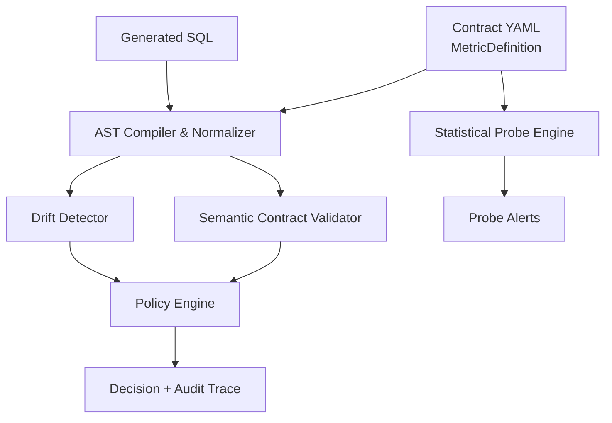
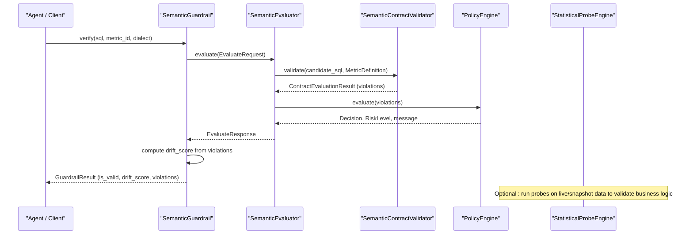
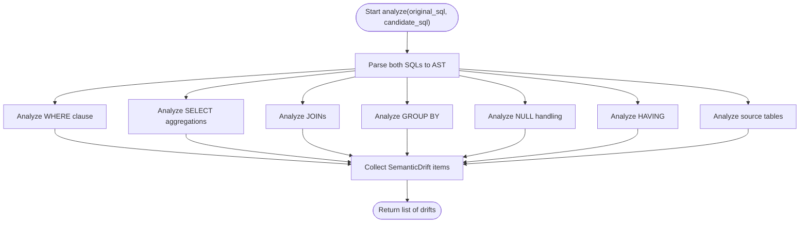
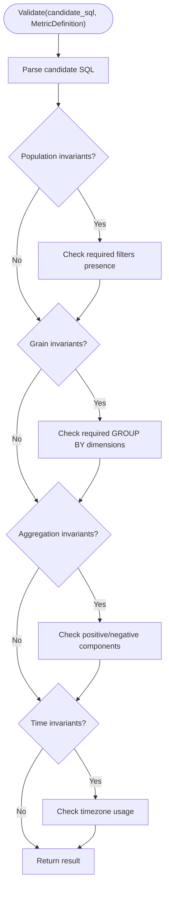
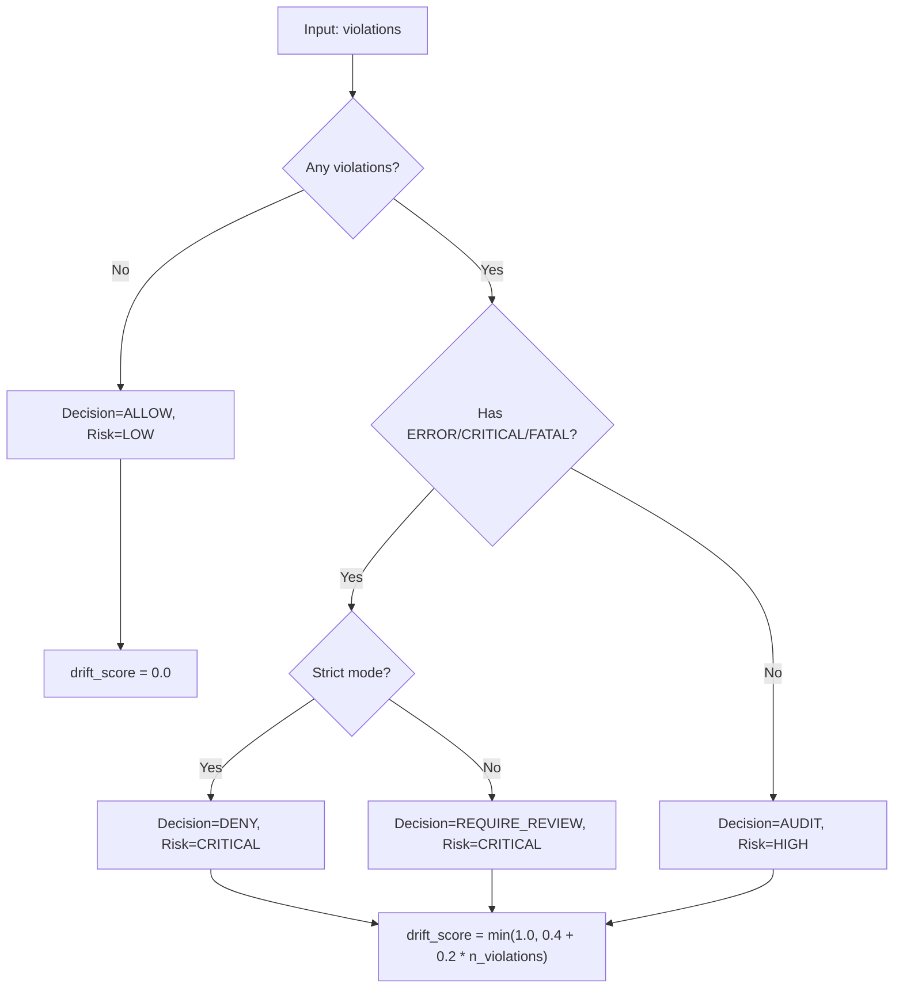
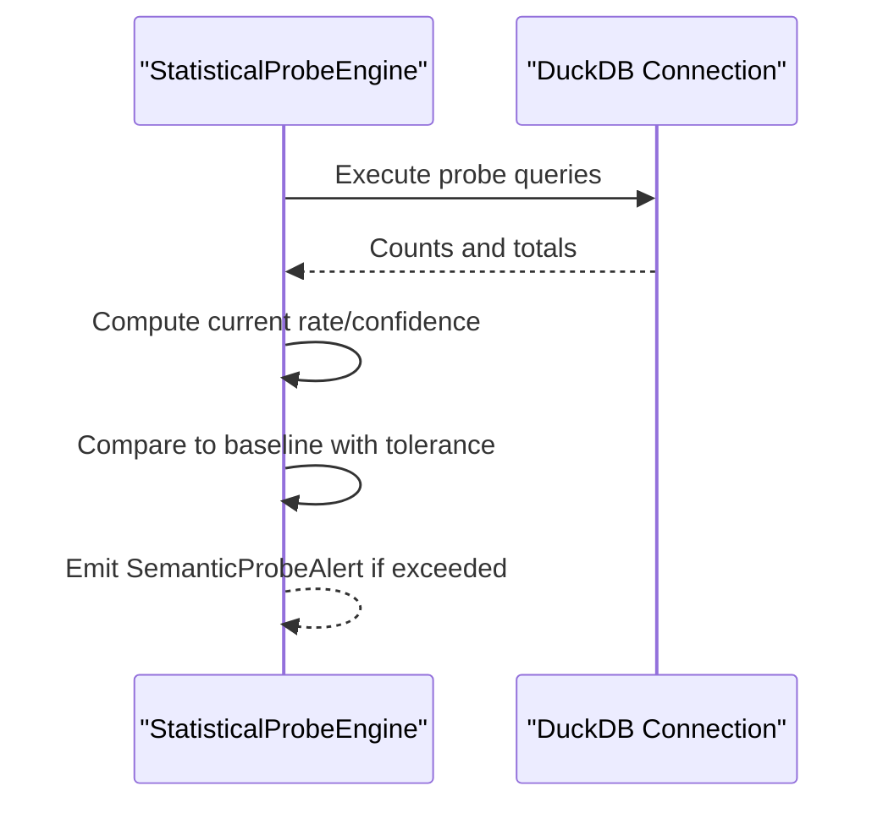
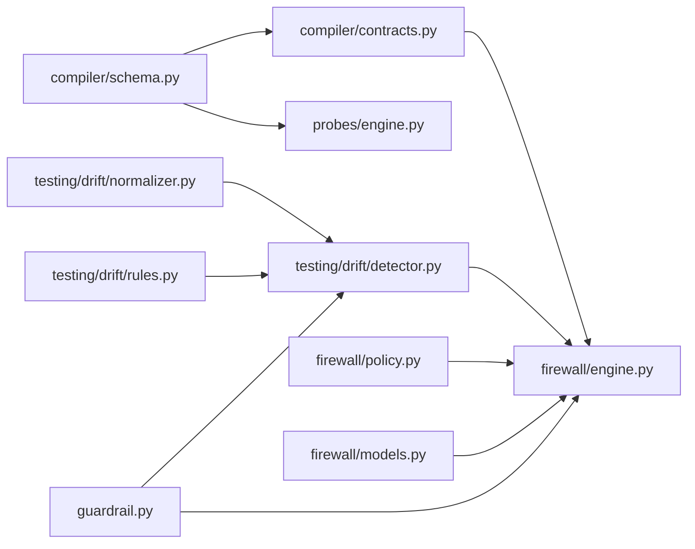

# Semantic Analysis

<cite>
**Referenced Files in This Document**
- [README.md](file://README.md)
- [guardrail.py](file://semantic_reliability/guardrail.py)
- [engine.py](file://semantic_reliability/firewall/engine.py)
- [policy.py](file://semantic_reliability/firewall/policy.py)
- [models.py](file://semantic_reliability/firewall/models.py)
- [contracts.py](file://semantic_reliability/compiler/contracts.py)
- [schema.py](file://semantic_reliability/compiler/schema.py)
- [detector.py](file://semantic_reliability/testing/drift/detector.py)
- [normalizer.py](file://semantic_reliability/testing/drift/normalizer.py)
- [rules.py](file://semantic_reliability/testing/drift/rules.py)
- [engine.py](file://semantic_reliability/probes/engine.py)
- [signals.py](file://semantic_reliability/probes/signals.py)
- [contract.yaml](file://benchmark_corpus/dev/net_revenue/contract.yaml)
- [net_revenue_contract.yaml](file://examples/metrics/net_revenue_contract.yaml)
</cite>

## Table of Contents
1. Introduction
2. Project Structure
3. Core Components
4. Architecture Overview
5. Detailed Component Analysis
6. Dependency Analysis
7. Performance Considerations
8. Troubleshooting Guide
9. Conclusion
10. Appendices

## Introduction
This document explains the semantic analysis engine that detects drift between generated SQL and business metric contracts. It covers AST-based comparison, rule-driven violation detection, severity classification, drift scoring, statistical reality probes, customization for custom rules and probes, common violations with examples, and performance/scalability guidance.

The system enforces deterministic checks using Abstract Syntax Trees (AST) to compare candidate SQL against canonical metric definitions and declared invariants. It also runs statistical probes to validate that runtime data realities match contract assumptions.

**Section sources**
- [README.md:22-46](file://README.md#L22-L46)

## Project Structure
At a high level, the semantic analysis pipeline consists of:
- Contract definition and parsing (MetricDefinition, invariants, probes)
- AST normalization and equivalence checking
- Rule-based drift detection across WHERE, JOINs, GROUP BY, aggregations, HAVING, null handling, and source tables
- Policy-driven decisioning (ALLOW/AUDIT/REQUIRE_REVIEW/DENY)
- Statistical probes executed against live or snapshot data
- Guardrail integration for pre-execution enforcement

**Diagram sources**
- [engine.py:18-43](file://semantic_reliability/firewall/engine.py#L18-L43)
- [contracts.py:26-135](file://semantic_reliability/compiler/contracts.py#L26-L135)
- [detector.py:9-46](file://semantic_reliability/testing/drift/detector.py#L9-L46)
- [engine.py:11-38](file://semantic_reliability/probes/engine.py#L11-L38)

**Section sources**
- [engine.py:18-43](file://semantic_reliability/firewall/engine.py#L18-L43)
- [schema.py:5-98](file://semantic_reliability/compiler/schema.py#L5-L98)

## Core Components
- MetricDefinition and invariants define the ground truth: required filters, grouping dimensions, aggregation components, units, time settings, and statistical probes.
- SemanticContractValidator parses candidate SQL and checks it against declared invariants.
- SemanticDriftDetector performs AST-level comparisons to detect structural and semantic changes (filters, joins, grain, aggregations, null handling, HAVING, tables).
- PolicyEngine maps violations to decisions and risk levels.
- StatisticalProbeEngine executes declarative probes to validate population rates, implications, and null drift.
- SemanticGuardrail orchestrates evaluation and computes a drift score for feedback or blocking.

**Section sources**
- [schema.py:5-98](file://semantic_reliability/compiler/schema.py#L5-L98)
- [contracts.py:26-135](file://semantic_reliability/compiler/contracts.py#L26-L135)
- [detector.py:9-46](file://semantic_reliability/testing/drift/detector.py#L9-L46)
- [policy.py:35-67](file://semantic_reliability/firewall/policy.py#L35-L67)
- [engine.py:11-38](file://semantic_reliability/probes/engine.py#L11-L38)
- [guardrail.py:45-136](file://semantic_reliability/guardrail.py#L45-L136)

## Architecture Overview
The end-to-end flow evaluates generated SQL before execution:

**Diagram sources**
- [guardrail.py:91-136](file://semantic_reliability/guardrail.py#L91-L136)
- [engine.py:54-116](file://semantic_reliability/firewall/engine.py#L54-L116)
- [contracts.py:29-135](file://semantic_reliability/compiler/contracts.py#L29-L135)
- [policy.py:35-67](file://semantic_reliability/firewall/policy.py#L35-L67)

## Detailed Component Analysis

### AST-Based Drift Detection
The detector compares baseline and candidate SQL by parsing both into ASTs and inspecting key relational-algebra components:
- WHERE clause: missing, added, or modified filters
- Aggregations: function shifts and expression payload changes
- JOIN topology: count changes, missing predicates (cartesian explosion risk)
- GROUP BY: grain dimension shifts
- Null handling: removal of COALESCE/defaulting
- HAVING: post-aggregation filter changes
- Source tables: lineage changes

**Diagram sources**
- [detector.py:12-46](file://semantic_reliability/testing/drift/detector.py#L12-L46)
- [detector.py:48-245](file://semantic_reliability/testing/drift/detector.py#L48-L245)

Key behaviors:
- Predicate equivalence uses AST normalization to ignore commutative order and redundant parentheses.
- Missing ON/USING on non-CROSS joins is flagged as fatal due to cartesian explosion risk.
- Grain drift is critical because downstream BI and dimensional models depend on stable grouping.

**Section sources**
- [detector.py:48-245](file://semantic_reliability/testing/drift/detector.py#L48-L245)
- [normalizer.py:6-93](file://semantic_reliability/testing/drift/normalizer.py#L6-L93)

### Contract-Based Validation Rules
The contract validator checks candidate SQL against declared invariants:
- Population invariants: required filters must be present; forbidden filters are not allowed
- Grain invariants: required grouping dimensions must be present
- Aggregation invariants: positive/negative components must be included; optional required function
- Time invariants: timezone alignment (e.g., UTC)

**Diagram sources**
- [contracts.py:29-135](file://semantic_reliability/compiler/contracts.py#L29-L135)

**Section sources**
- [contracts.py:29-135](file://semantic_reliability/compiler/contracts.py#L29-L135)
- [schema.py:5-98](file://semantic_reliability/compiler/schema.py#L5-L98)

### Severity Classification and Drift Scoring
- Drift severity categories include FATAL, CRITICAL, HIGH, MEDIUM, LOW, INFO.
- Drift types cover FILTER_REMOVAL, FILTER_ADDITION, SEMANTIC_LOGIC_SHIFT, AGGREGATION_FUNCTION_SHIFT, AGGREGATION_EXPRESSION_SHIFT, MATHEMATICAL_OPERATOR_SHIFT, JOIN_PREDICATE_MUTATION, JOIN_TYPE_SHIFT, GRAIN_DRIFT, NULL_HANDLING_DRIFT, HAVING_FILTER_SHIFT, TABLE_TARGET_SHIFT.
- Policy mapping:
  - No violations: ALLOW, LOW risk
  - Any ERROR/CRITICAL/FATAL: DENY or REQUIRE_REVIEW depending on strict mode
  - Otherwise: AUDIT, HIGH risk
- Drift score calculation:
  - If compliant and ALLOW: 0.0
  - Else: scaled penalty based on number of violations, capped at 1.0

**Diagram sources**
- [rules.py:6-41](file://semantic_reliability/testing/drift/rules.py#L6-L41)
- [policy.py:35-67](file://semantic_reliability/firewall/policy.py#L35-L67)
- [guardrail.py:114-125](file://semantic_reliability/guardrail.py#L114-L125)

**Section sources**
- [rules.py:6-41](file://semantic_reliability/testing/drift/rules.py#L6-L41)
- [policy.py:35-67](file://semantic_reliability/firewall/policy.py#L35-L67)
- [guardrail.py:114-125](file://semantic_reliability/guardrail.py#L114-L125)

### Statistical Reality Probes
Probes validate empirical data realities against contract assumptions:
- Population rate probes: ensure expected filter selects the intended proportion
- Implication probes: enforce relationships like “if condition A then implication B”
- Null drift probes: monitor unexpected increases in null rates for critical columns

**Diagram sources**
- [engine.py:11-38](file://semantic_reliability/probes/engine.py#L11-L38)
- [engine.py:40-138](file://semantic_reliability/probes/engine.py#L40-L138)
- [signals.py:5-18](file://semantic_reliability/probes/signals.py#L5-L18)

**Section sources**
- [engine.py:11-38](file://semantic_reliability/probes/engine.py#L11-L38)
- [engine.py:40-138](file://semantic_reliability/probes/engine.py#L40-L138)
- [signals.py:5-18](file://semantic_reliability/probes/signals.py#L5-L18)

### Customization: Adding Custom Detection Rules and Probes
- Add new invariant categories to MetricDefinition.invariants and extend SemanticContractValidator to check them.
- Introduce new DriftType and DriftSeverity entries in rules.py and implement corresponding checks in detector.py.
- Extend MetricProbes with new probe types and implement their logic in StatisticalProbeEngine.
- Update PolicyEngine to map new violation severities to appropriate decisions and risks.

**Section sources**
- [schema.py:5-98](file://semantic_reliability/compiler/schema.py#L5-L98)
- [contracts.py:29-135](file://semantic_reliability/compiler/contracts.py#L29-L135)
- [rules.py:6-41](file://semantic_reliability/testing/drift/rules.py#L6-L41)
- [detector.py:48-245](file://semantic_reliability/testing/drift/detector.py#L48-L245)
- [engine.py:11-38](file://semantic_reliability/probes/engine.py#L11-L38)
- [policy.py:35-67](file://semantic_reliability/firewall/policy.py#L35-L67)

### Common Semantic Violations and Detection Examples
- Missing required filters: Detected by contract validator when required_filters are absent from WHERE; drift detector flags FILTER_REMOVAL or SEMANTIC_LOGIC_SHIFT.
- Incorrect aggregations: Detected by comparing aggregate functions and expressions; reports AGGREGATION_FUNCTION_SHIFT or AGGREGATION_EXPRESSION_SHIFT.
- Grain changes: Detected by comparing GROUP BY dimensions; reports GRAIN_DRIFT.
- Join issues: Missing ON/USING triggers JOIN_PREDICATE_MUTATION; join count changes trigger JOIN_TYPE_SHIFT.
- Post-aggregation filter changes: HAVING differences reported as HAVING_FILTER_SHIFT.
- Source table lineage changes: Reported as TABLE_TARGET_SHIFT.

Example contract references:
- Net revenue contract defines required filters and aggregation components.

**Section sources**
- [detector.py:48-245](file://semantic_reliability/testing/drift/detector.py#L48-L245)
- [contracts.py:29-135](file://semantic_reliability/compiler/contracts.py#L29-L135)
- [contract.yaml:1-19](file://benchmark_corpus/dev/net_revenue/contract.yaml#L1-L19)
- [net_revenue_contract.yaml:1-39](file://examples/metrics/net_revenue_contract.yaml#L1-L39)

## Dependency Analysis
High-level dependencies among core modules:

**Diagram sources**
- [schema.py:5-98](file://semantic_reliability/compiler/schema.py#L5-L98)
- [contracts.py:26-135](file://semantic_reliability/compiler/contracts.py#L26-L135)
- [detector.py:9-46](file://semantic_reliability/testing/drift/detector.py#L9-L46)
- [normalizer.py:6-93](file://semantic_reliability/testing/drift/normalizer.py#L6-L93)
- [rules.py:6-41](file://semantic_reliability/testing/drift/rules.py#L6-L41)
- [engine.py:18-116](file://semantic_reliability/firewall/engine.py#L18-L116)
- [policy.py:35-67](file://semantic_reliability/firewall/policy.py#L35-L67)
- [models.py:1-51](file://semantic_reliability/firewall/models.py#L1-L51)
- [guardrail.py:45-136](file://semantic_reliability/guardrail.py#L45-L136)

**Section sources**
- [engine.py:18-116](file://semantic_reliability/firewall/engine.py#L18-L116)
- [guardrail.py:45-136](file://semantic_reliability/guardrail.py#L45-L136)

## Performance Considerations
- AST parsing and traversal are linear in query size; normalize boolean chains and unwrap parentheses to reduce false positives and keep comparisons fast.
- Prefer dialect-specific parsing to avoid costly fallbacks; reuse parsed ASTs where possible.
- Batch contract loading via ContractRegistry to minimize repeated file reads.
- For large-scale analysis:
  - Run StatisticalProbeEngine against read-only snapshots or materialized views to limit warehouse load.
  - Use strict_mode=false in non-production contexts to allow audit flows without blocking.
  - Cache normalized predicate representations for repeated checks.
  - Parallelize independent probe evaluations per metric.

[No sources needed since this section provides general guidance]

## Troubleshooting Guide
Common issues and resolutions:
- Unparseable SQL: Automatically denied; fix syntax or dialect mismatch.
- Missing required filters: Add filters specified in invariants.population.required_filters.
- Incorrect grouping dimensions: Include required_dimensions in GROUP BY.
- Aggregation mismatches: Ensure positive/negative components and functions match invariants.aggregation.
- Timezone drift: Align timestamps to UTC if required.
- Probe alerts: Investigate upstream schema or ETL changes causing population rate or null drift.

Operational tips:
- Inspect EvaluateResponse.message and violations for actionable details.
- Review audit traces recorded by SemanticEvaluator for full context.
- Use guardrail.intercept to raise exceptions early in CI pipelines.

**Section sources**
- [engine.py:54-84](file://semantic_reliability/firewall/engine.py#L54-L84)
- [engine.py:118-132](file://semantic_reliability/firewall/engine.py#L118-L132)
- [guardrail.py:138-153](file://semantic_reliability/guardrail.py#L138-L153)

## Conclusion
The semantic analysis engine combines deterministic AST-based drift detection with contract validation and statistical probes to safeguard analytical correctness. It classifies violations by severity, computes drift scores, and enforces policy-driven decisions. With extensible rules and probes, teams can tailor detection to domain-specific semantics while maintaining performance and scalability for large-scale environments.

[No sources needed since this section summarizes without analyzing specific files]

## Appendices

### Example Contract References
- Net revenue contract demonstrates required filters and aggregation components.

**Section sources**
- [contract.yaml:1-19](file://benchmark_corpus/dev/net_revenue/contract.yaml#L1-L19)
- [net_revenue_contract.yaml:1-39](file://examples/metrics/net_revenue_contract.yaml#L1-L39)